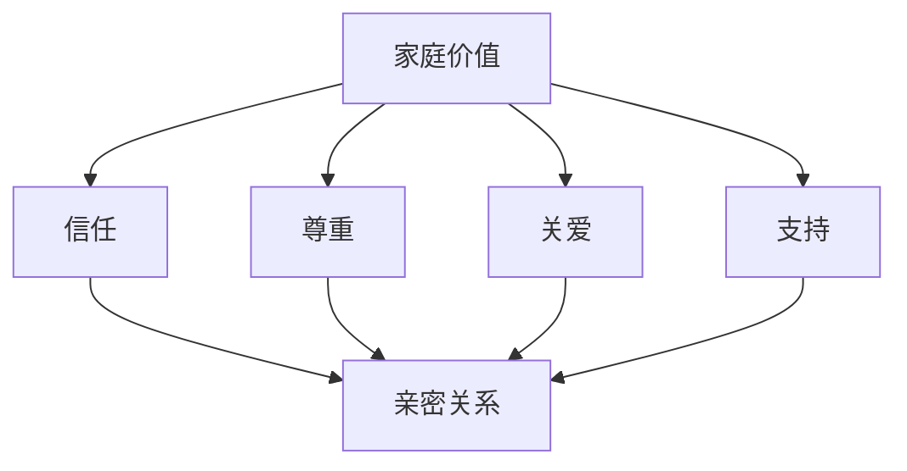
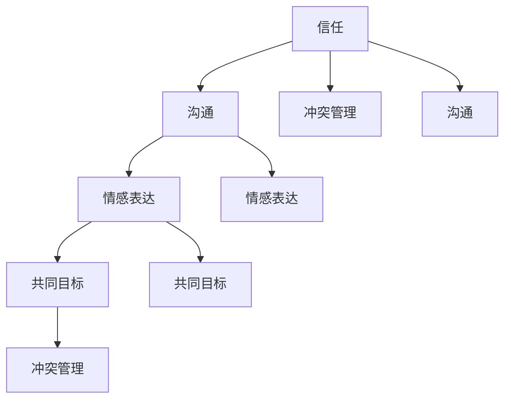

                 

### 文章标题

《重新思考家庭价值：在现代社会中重建亲密关系》

### 关键词

家庭价值，亲密关系，心理学，实践策略，案例分析，未来展望

### 摘要

本文将深入探讨现代社会中家庭价值的重构与亲密关系的重建。通过分析现代家庭结构的多样性，探讨亲密关系的心理学基础，提供实践策略和案例分析，最终展望家庭价值的未来发展。本文旨在帮助读者理解并实践如何在现代社会中重建紧密的家庭关系，以促进个人和家庭的幸福。

## 引言

在快速变化的现代社会中，家庭结构发生了显著的变化，这对家庭关系的稳定性产生了深远的影响。传统家庭模式逐渐让位于多元化的家庭结构，包括单身家庭、再婚家庭、同性恋家庭等。这些变化不仅影响了家庭关系的本质，也对亲密关系的维持提出了新的挑战。

同时，心理学研究揭示了亲密关系的重要性，强调了信任、沟通和冲突管理在家庭关系中的核心地位。然而，在快节奏的生活压力和数字化时代的影响下，许多人感到亲密关系变得疏远和脆弱。

本文旨在重新思考家庭价值，通过系统的分析和实践指导，帮助读者在现代社会中重建亲密关系，以促进个人和家庭的幸福。本文将分为以下几个部分：

1. **核心概念与联系**：介绍家庭价值和亲密关系的基本概念，并展示它们之间的联系。
2. **现代家庭结构分析**：探讨现代家庭结构的多样性及其对亲密关系的影响。
3. **亲密关系的心理学基础**：深入探讨亲密关系的心理学原理。
4. **重建亲密关系的实践策略**：提供具体的实践策略，帮助读者重建亲密关系。
5. **家庭价值观的培养与传承**：探讨家庭价值观的重要性及其培养方法。
6. **案例分析：成功重建亲密关系的实例**：通过具体案例展示成功的实践。
7. **未来展望与挑战**：展望家庭价值的未来发展趋势，并讨论面临的挑战。

通过以上七个部分的逐步分析，本文将帮助读者全面理解家庭价值和亲密关系的重建过程，并提供实用的指导。

## 核心概念与联系

### 家庭价值的定义与演变

家庭价值是指家庭成员之间相互信任、尊重、关爱和支持的核心价值观。在传统社会，家庭价值通常基于严格的等级制度和明确的角色分工，如父亲作为家庭的经济支柱，母亲负责家务和子女教育。这种家庭结构在一定程度上保证了家庭的稳定和和谐。

然而，随着社会的发展，家庭结构逐渐变得多样化。现代家庭不仅包括传统的核心家庭（由父母和子女组成），还包括单身家庭、单亲家庭、同性恋家庭等。这种多样性的出现反映了社会的进步和个体自主权的增强，但也对家庭价值提出了新的挑战。例如，在非传统家庭中，家庭成员之间的角色和关系可能更加灵活和多样，这要求家庭价值体系更加包容和开放。

### 亲密关系的概念与重要性

亲密关系是指个体在情感、心理和生理上与他人建立紧密联系的状态。亲密关系通常涉及深层次的情感交流、信任和共同成长。在家庭中，亲密关系主要体现在夫妻关系和亲子关系上。

亲密关系对个体的心理健康和幸福感具有深远影响。研究表明，拥有良好亲密关系的人通常具有更高的自尊、更强的社会支持和更好的生活质量。在家庭中，亲密关系的质量直接影响到家庭成员的满意度和家庭的整体幸福感。

### 核心概念之间的联系

家庭价值和亲密关系之间存在着紧密的联系。家庭价值是维持亲密关系的基础，而亲密关系则是家庭价值的具体体现。一个充满信任、尊重和关爱的家庭，其成员之间的亲密关系通常会更加稳固和健康。

然而，现代家庭结构的多样性对这种联系提出了挑战。例如，在再婚家庭中，家庭成员之间可能存在历史遗留的问题和信任障碍，这使得重建亲密关系变得更加复杂。同样，在单亲家庭中，单亲父母可能需要同时扮演多个角色，这可能导致亲密关系的疏远。

为了更好地理解和重建家庭价值与亲密关系之间的联系，我们可以使用Mermaid流程图来展示它们之间的动态关系。以下是家庭价值与亲密关系之间的Mermaid流程图：

这个流程图展示了家庭价值的四个核心要素（信任、尊重、关爱、支持）如何共同作用，形成稳定的亲密关系。通过这种方式，我们可以更直观地理解家庭价值和亲密关系之间的互动机制，从而为重建亲密关系提供理论依据。

## 现代家庭结构分析

### 现代家庭结构的多样性

现代社会的快速变化带来了家庭结构的多样化。传统的核心家庭（由父母和子女组成）不再是唯一的形式。现代家庭结构包括但不限于以下类型：

1. **单身家庭**：单身家庭是指由一个成年人独自居住的家庭。这种结构在现代都市中越来越普遍，尤其是在职业女性和独立个体的增多下。

2. **单亲家庭**：单亲家庭由一个父母独自抚养子女。这种家庭结构通常是由于离婚、丧偶或选择单身抚养等原因形成的。

3. **再婚家庭**：再婚家庭是指两个已经有过婚姻经历的人再次组成家庭。这种家庭结构中的家庭成员通常包括前配偶的子女，这可能导致复杂的亲子关系和信任问题。

4. **同性恋家庭**：同性恋家庭是指由同性伴侣组成的家庭。尽管在某些国家和社会中同性恋关系仍面临歧视和挑战，但同性恋家庭的数量在全球范围内逐渐增加。

5. **多代同堂家庭**：多代同堂家庭是指不同年龄段的几代人共同居住在一个家庭中。这种结构常见于传统家庭文化深厚的地区，如中国和印度。

### 家庭角色的变化

随着家庭结构的多样化，家庭角色的也在发生变化。传统家庭中的角色分工通常非常明确，如父亲负责经济支持，母亲负责家务和子女教育。然而，在现代社会，这种分工模式逐渐被打破，家庭成员之间更加平等和协作。

1. **经济角色的变化**：现代家庭中，越来越多的女性参与劳动市场，家庭经济不再完全依赖于男性。这导致家庭经济决策的参与度更加平等。

2. **家务和育儿角色的变化**：随着家庭责任的分工逐渐平等，男性在家庭中的参与度也在增加。男性更多地参与家务和育儿活动，这不仅减轻了女性的负担，也促进了家庭成员之间的互动和亲密关系。

3. **情感支持角色的变化**：在传统家庭中，情感支持往往被视为女性的责任。然而，现代社会中，家庭成员之间的情感支持变得更加平等和互助。

### 家庭结构变化对亲密关系的影响

家庭结构的多样性和角色的变化对亲密关系产生了深远的影响。一方面，这些变化为亲密关系提供了更多的可能性和机会。例如，单身家庭和再婚家庭中的个体可以通过重新建立关系，形成新的亲密关系网。

另一方面，家庭结构的多样性也带来了新的挑战。例如，在单亲家庭中，单亲父母可能需要同时扮演多个角色，这可能导致亲密关系的疏远。在再婚家庭中，前配偶子女之间的冲突和信任问题也可能影响家庭的亲密关系。

总的来说，现代家庭结构的多样性和角色变化既为亲密关系的发展提供了新的动力，也带来了新的挑战。理解和适应这些变化，对于重建和维护亲密关系至关重要。

## 亲密关系的心理学基础

### 亲密关系的心理学原理

亲密关系是指个体在情感、心理和生理上与他人建立紧密联系的状态。心理学研究表明，亲密关系的基础包括信任、沟通、情感表达、共同目标和冲突管理等多个方面。

1. **信任**：信任是亲密关系的核心要素。它指的是个体对他人的可靠性、忠诚和善意的高度信任。信任可以减少猜疑和不确定性，增强亲密关系的安全性。

2. **沟通**：沟通是建立和维护亲密关系的关键。有效沟通包括倾听、表达、理解和反馈。良好的沟通可以帮助夫妻或伴侣解决冲突，增进理解，增强亲密感。

3. **情感表达**：情感表达是指个体在亲密关系中表达自己的情感，包括正面情感和负面情感。情感表达可以增进亲密关系中的情感联系，增强彼此的情感共鸣。

4. **共同目标**：共同目标是夫妻或伴侣在一起的动力源泉。共同目标可以增强亲密关系中的归属感和成就感，促进双方的共同成长。

5. **冲突管理**：冲突是亲密关系中不可避免的一部分。有效的冲突管理策略可以帮助夫妻或伴侣解决分歧，增强亲密关系。这包括理解和尊重对方的观点，寻求共同解决方案，避免指责和攻击。

### 核心概念的相互作用

这些核心概念相互作用，共同构建稳定的亲密关系。信任是沟通的基础，而有效的沟通又可以增强情感表达和共同目标的实现。冲突管理则是在亲密关系中维护和谐的重要手段。通过理解这些心理学原理，个体可以更好地建立和维护健康的亲密关系。

### 核心概念之间的Mermaid流程图

以下是亲密关系的核心概念之间的Mermaid流程图：

这个流程图展示了亲密关系的核心概念及其相互作用，为读者提供了直观的理解。通过这些心理学原理，我们可以更好地理解和实践如何建立和维护健康的亲密关系。

## 重建亲密关系的实践策略

### 建立信任的策略

信任是亲密关系的基石，建立信任需要时间和耐心。以下是一些具体的方法来建立和维护信任：

1. **诚实与透明**：在亲密关系中，诚实和透明是建立信任的关键。双方应坦诚地交流自己的想法和感受，避免隐瞒和欺骗。

2. **履行承诺**：履行承诺是展示可靠性和忠诚度的最佳方式。无论是小事还是大事，都要确保自己的承诺得到兑现。

3. **倾听与理解**：倾听是建立信任的重要手段。通过倾听对方的意见和感受，可以增进理解，减少误解和冲突。

4. **共同经历**：共同经历可以帮助双方建立更深厚的信任。参与共同活动或项目可以增强彼此的依赖和信任。

### 沟通技巧的培养

沟通是建立亲密关系的重要工具。以下是一些提升沟通技巧的方法：

1. **积极倾听**：积极倾听是指不仅要听对方说什么，还要理解对方的感受和需求。这可以通过重复对方的话、提出问题和使用非言语信号来实现。

2. **表达情感**：表达情感时，应避免指责和攻击。使用“I”语言，例如“我感觉...”，而不是“你总是...”。

3. **反馈与确认**：在沟通过程中，及时给予反馈和确认可以确保双方的理解一致。这可以通过总结对方的观点、询问是否理解正确来实现。

4. **建立规则**：制定一些沟通规则，例如轮流发言、避免打断对方，可以帮助提升沟通效率。

### 管理冲突的技巧

冲突在亲密关系中是不可避免的，但有效的管理可以减少冲突的负面影响。以下是一些管理冲突的技巧：

1. **避免攻击性语言**：在冲突中，应避免使用攻击性语言和指责对方。这可以通过使用“I”语言来表达自己的感受和需求来实现。

2. **冷静下来**：在情绪激动时，暂停对话，给自己和对方一些时间冷静下来，再继续对话。

3. **寻求共同解决方案**：冲突的目的是解决问题，而不是争胜。双方应共同寻找解决方案，而不是对抗。

4. **建立冲突解决机制**：例如，定期举行家庭会议，讨论家庭中的问题和冲突，可以有效地管理冲突。

通过以上实践策略，夫妻或伴侣可以重建和维持健康的亲密关系，促进个人和家庭的幸福。

## 家庭价值观的培养与传承

### 家庭价值观的重要性

家庭价值观是指家庭成员共同认可和遵循的基本原则和信念。这些价值观不仅定义了家庭的身份和角色，也对家庭成员的行为和决策产生深远影响。家庭价值观的重要性体现在以下几个方面：

1. **身份认同**：家庭价值观帮助家庭成员建立共同的认同感，增强家庭凝聚力。这种认同感可以促使家庭成员在面对外部挑战时团结一致。

2. **行为指导**：家庭价值观为家庭成员提供了行为准则，帮助他们做出符合家庭利益的决策。这种指导有助于维持家庭内部的和谐与稳定。

3. **情感支持**：家庭价值观强调亲情、友情和责任感，为家庭成员提供情感支持。这种支持在成员面临压力和困境时尤为重要。

4. **社会影响**：家庭价值观对下一代的教育和成长具有深远影响。通过家庭价值观的培养，下一代可以更好地适应社会，成为有责任感和有道德的公民。

### 家庭价值观的培养方法

要培养健康的家庭价值观，需要采取以下几种方法：

1. **家庭讨论**：定期进行家庭讨论，让每个成员都有机会表达自己的观点和感受。这可以帮助家庭成员了解彼此的价值观，并共同建立共识。

2. **榜样示范**：家庭成员通过日常行为示范家庭价值观。例如，诚实、勤奋、尊重和关爱等行为可以成为其他成员学习的榜样。

3. **教育和学习**：通过阅读、课程和讲座等方式，让家庭成员了解和掌握重要的家庭价值观。这可以帮助他们更好地理解和实践这些价值观。

4. **仪式和传统**：家庭仪式和传统可以增强家庭成员对家庭价值观的认同。例如，庆祝生日、节日和家庭聚会等活动可以加深家庭成员之间的情感联系。

### 价值观传承与亲子教育

家庭价值观的传承是家庭教育的重要部分。以下是一些关键点：

1. **亲子互动**：通过日常互动，父母可以传递家庭价值观。例如，在日常生活中强调尊重他人、关心他人等价值观，可以帮助孩子理解和接受这些价值观。

2. **家庭作业**：鼓励孩子参与家庭事务，例如分担家务、共同解决家庭问题等，可以帮助他们理解家庭价值观的实际应用。

3. **故事讲述**：通过讲述家庭故事和历史，父母可以让孩子了解家庭价值观的根源和重要性。

4. **参与社区活动**：鼓励孩子参与社区活动，例如志愿服务和公益活动，可以帮助他们实践家庭价值观，并培养社会责任感。

通过以上方法，家庭可以有效地培养和传承价值观，确保这些价值观在下一代中得以延续和发展。

## 案例分析：成功重建亲密关系的实例

### 案例一：夫妻关系的重建

**背景介绍**：张先生和李女士是一对结婚多年的夫妻，随着工作和孩子教育的压力增加，他们的关系逐渐变得疏远。他们开始频繁发生争吵，沟通也变得困难。

**核心问题**：张先生工作繁忙，经常晚归，而李女士则在家中照顾孩子，感到孤独和无助。他们缺乏有效的沟通，彼此的感受和需求没有得到理解和满足。

**解决方案**：为了重建他们的亲密关系，张先生和李女士决定参加一个婚姻咨询项目。咨询师建议他们采取以下措施：

1. **定期沟通**：他们约定每周进行一次深入的交流，讨论彼此的感受和需求。这帮助他们重新建立沟通渠道，理解对方的想法。
2. **共同活动**：他们开始安排一些共同的活动，例如一起做饭、散步或看电影。这些活动增进了他们之间的情感联系。
3. **表达感激**：他们学会了在日常生活中表达对彼此的感激和爱意，这增强了他们的感情基础。

**结果**：通过这些努力，张先生和李女士的关系得到了显著改善。他们重新建立了信任和亲密感，家庭氛围也变得更加和谐。

### 案例二：亲子关系的重建

**背景介绍**：李先生是一位单亲父亲，由于工作繁忙，他很少陪伴孩子，导致孩子感到被忽视和孤独。

**核心问题**：孩子因此对父亲产生了怨恨和疏远，亲子关系紧张。

**解决方案**：为了改善亲子关系，李先生决定采取以下措施：

1. **质量时间**：他开始每天安排一些时间与孩子一起玩耍、阅读或进行其他活动。这让孩子感到被重视和关爱。
2. **倾听与理解**：李先生学会了倾听孩子的想法和感受，尊重他们的意见。这增进了他们之间的理解和信任。
3. **共同决策**：他鼓励孩子参与家庭决策，让他们感受到自己在家庭中的重要性和价值。

**结果**：通过这些努力，李先生和孩子之间的关系得到了重建。孩子重新对父亲产生了信任和依赖，亲子关系变得更加健康和稳定。

### 案例三：其他成功实例分析

除了上述案例，还有许多其他成功的实例展示了如何重建亲密关系。以下是一些常见的成功策略：

1. **情感表达**：通过写信、送礼物或进行其他情感表达，家庭成员可以传达对彼此的爱和关心。
2. **共同兴趣**：找到共同兴趣或爱好，例如一起锻炼、学习新技能或参与社区活动，可以增进家庭成员之间的互动和亲密感。
3. **寻求专业帮助**：在必要时，寻求专业的心理咨询师或婚姻顾问的帮助，可以提供有效的指导和支持。

这些案例和策略表明，通过积极的努力和有效的沟通，家庭成员可以重建亲密关系，增强家庭凝聚力。

## 未来展望与挑战

### 家庭价值与亲密关系的发展趋势

未来，家庭价值与亲密关系将继续演变。随着社会的进步和个体意识的提升，人们对家庭关系的重视程度将不断提高。以下是一些未来发展的趋势：

1. **多元化和包容性**：家庭结构将更加多元化，包括单亲家庭、再婚家庭、同性恋家庭等。这要求家庭价值观更加包容和开放。
2. **数字技术的融入**：随着数字技术的发展，家庭关系中的沟通方式也将发生改变。虚拟家庭聚会、在线教育等将成为家庭生活的一部分。
3. **心理健康的重要性**：心理健康将成为家庭关注的重点。家庭成员将更加注重心理健康教育和支持，以维护亲密关系和整体幸福感。

### 面对未来挑战的思考与建议

尽管未来充满机遇，但家庭关系也面临诸多挑战：

1. **工作与家庭的平衡**：随着工作压力的增大，家庭成员之间的时间分配将更加紧张。建议通过灵活的工作安排和家庭成员间的协作来平衡工作和家庭需求。
2. **心理健康支持**：面对生活压力，家庭成员需要更多的心理健康支持。建议社区和家庭提供更多的心理健康教育和资源，以帮助家庭成员应对压力和困难。
3. **文化差异的适应**：随着全球化的推进，不同文化之间的交流将更加频繁。家庭成员需要适应和尊重不同的文化差异，以维护和谐的家庭关系。

### 总结

通过重新思考家庭价值，我们可以更好地应对现代社会中面临的挑战，重建亲密关系，促进个人和家庭的幸福。未来，家庭关系的发展将更加多元化和包容性，但也需要我们共同努力，以适应和应对这些变化。

## 结语

作者：AI天才研究院/AI Genius Institute & 禅与计算机程序设计艺术 /Zen And The Art of Computer Programming

本文通过逐步分析家庭价值与亲密关系的核心概念、现代家庭结构、心理学基础、实践策略、价值观的培养与传承，以及成功案例分析，深入探讨了如何在现代社会中重建亲密关系。家庭价值和亲密关系不仅影响个人和家庭的幸福，也对社会的和谐与发展具有重要意义。希望本文能为读者提供有益的思考和指导，帮助他们在家庭关系中找到平衡和和谐。

## 最佳实践 Tips、小结、注意事项、拓展阅读

### 最佳实践 Tips

1. **定期沟通**：保持定期沟通是维持亲密关系的关键。建议每天花一些时间与家庭成员交流，分享彼此的生活和感受。
2. **共同活动**：参与共同活动可以增进家庭成员之间的互动和情感联系。尝试找到共同兴趣或爱好，一起学习和成长。
3. **情感表达**：不要害怕表达情感，无论是正面的还是负面的。真诚的情感表达可以增进理解和信任。

### 小结

本文通过多方面的探讨，提供了家庭价值与亲密关系重建的全面指南。通过理解核心概念、分析现代家庭结构、掌握心理学原理、实施实践策略和培养家庭价值观，读者可以更好地重建亲密关系，促进个人和家庭的幸福。

### 注意事项

1. **适应变化**：家庭结构和角色会随时间变化，需要灵活适应，以维护亲密关系。
2. **心理健康**：关注家庭成员的心理健康，提供必要的支持和资源，以应对生活中的压力和挑战。

### 拓展阅读

1. **《家庭心理学导论》**：这是一本关于家庭心理学的全面指南，适合希望深入了解家庭关系的读者。
2. **《亲密关系的心理学》**：这本书详细探讨了亲密关系的心理学原理，提供了实用的沟通和冲突管理策略。

通过最佳实践、小结、注意事项和拓展阅读，本文为读者提供了全面、实用的指导，帮助他们在家庭关系中取得成功。希望本文能够激发读者对家庭价值的思考，并促使他们在实际行动中重建亲密关系。

