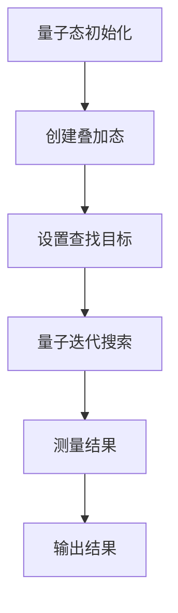
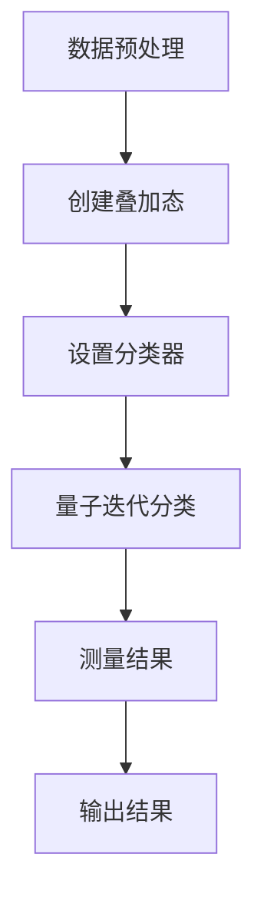
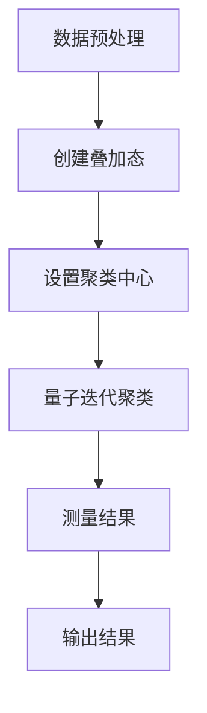
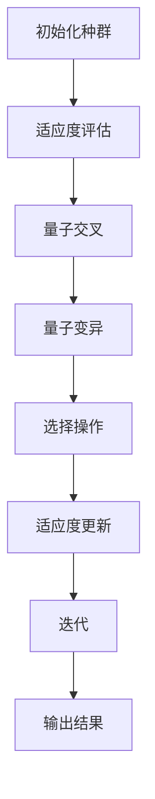
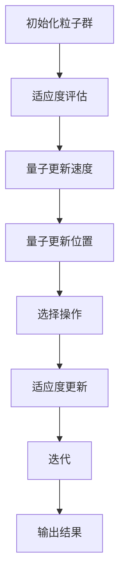
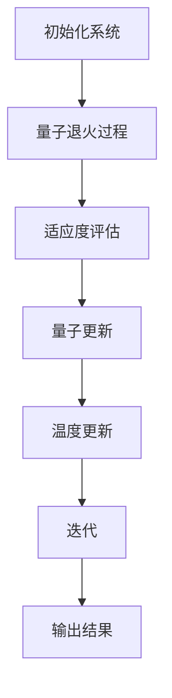

                 


# 《量子启发算法在高效AI推理中的应用研究》

## 文章关键词

- 量子计算
- 启发算法
- AI推理
- 量子比特
- 量子态
- 量子门
- 量子优化算法
- 图像识别
- 自然语言处理

## 摘要

本文主要研究量子启发算法在高效AI推理中的应用。通过介绍量子计算的基础知识，包括量子比特、量子态和量子门等基本概念，我们探讨了量子启发算法与传统算法的区别及其优势。接着，我们详细分析了量子搜索算法、量子分类算法、量子聚类算法以及量子优化算法的原理和应用。在此基础上，本文重点讨论了量子启发算法在AI推理中的具体应用，如量子图像识别和量子自然语言处理等。通过实战项目的详细分析和代码实现，本文展示了量子启发算法在AI推理中的实际效果和优势。最后，我们展望了量子启发算法的发展趋势和研究挑战，并给出了相关的最佳实践和建议。

## 引言

### 量子计算简介

量子计算是一种基于量子力学原理的新型计算模式，与传统的经典计算有本质的区别。量子计算机使用量子比特（qubit）作为信息的基本单位，而不是经典计算机中的比特。量子比特具有叠加态和纠缠态的特性，使得量子计算机能够并行处理大量信息，从而在理论上具有超越经典计算机的计算能力。

量子比特是量子计算机中最基本的单元，与经典比特不同，量子比特可以同时处于0和1的状态，这种叠加态使得量子计算机能够同时处理多个计算任务。量子态是描述量子比特状态的数学函数，量子门则是改变量子态的操作。通过量子门的组合，量子计算机可以执行复杂的计算任务。

### 量子算法基础

量子算法是一类基于量子计算原理设计的算法，它们利用量子比特的叠加态和纠缠态来加速计算过程。经典的Shor算法和Grover算法是量子算法的代表。Shor算法是一种能够快速因数分解大整数的算法，而Grover算法则是一种用于搜索未排序数据库的高效算法。

Shor算法的核心思想是利用量子比特的叠加态和纠缠态，将大整数的因数分解问题转化为一个可求解的问题。Grover算法则通过量子搜索算法，在未排序的数据库中查找特定的元素，其搜索速度远超经典算法。

### 量子计算框架

量子计算框架包括量子计算硬件、量子编程语言和量子计算模拟器。当前，量子计算硬件技术发展迅速，但尚未达到实用水平。量子编程语言如Q#和Quipper等，提供了描述和实现量子算法的工具。量子计算模拟器则用于模拟量子算法的运行过程，为研究量子算法提供了便利。

## 量子启发算法原理

### 量子启发算法概述

量子启发算法是一类基于量子计算原理的启发式算法，它们在搜索、分类、聚类和优化等任务中具有显著的优势。与传统算法相比，量子启发算法利用量子比特的叠加态和纠缠态，能够实现并行计算和高效搜索。这使得量子启发算法在解决复杂问题时具有独特的优势。

量子启发算法在应用领域广泛，如量子图像识别、量子自然语言处理、量子优化等。它们不仅能够提高计算效率，还能提供新的解决思路和方法。例如，量子图像识别算法能够通过量子搜索算法快速识别图像中的目标，而量子自然语言处理算法则能够实现高效的语言理解和生成。

### 量子启发算法与传统算法

量子启发算法与传统算法在原理和应用上存在显著差异。传统算法主要基于经典计算原理，通过迭代和递归等方法来解决问题。而量子启发算法则利用量子计算的特殊性质，如叠加态和纠缠态，来实现并行计算和高效搜索。

传统算法在面对复杂问题时，往往需要大量计算资源和时间。而量子启发算法通过量子比特的叠加态和纠缠态，能够在短时间内处理大量信息，从而实现高效计算。这使得量子启发算法在解决复杂问题时具有显著优势。

### 量子启发算法优势

量子启发算法具有以下优势：

1. **并行计算**：量子比特的叠加态使得量子计算机能够同时处理多个计算任务，从而实现并行计算。这与经典计算机的串行计算相比，大大提高了计算效率。

2. **高效搜索**：量子搜索算法能够在未排序的数据库中快速查找特定元素，其搜索速度远超经典算法。这在处理大数据和复杂搜索问题时具有显著优势。

3. **优化性能**：量子启发算法能够通过量子优化算法，高效地解决优化问题。量子优化算法利用量子比特的叠加态和纠缠态，能够快速找到最优解。

### 量子启发算法的应用领域

量子启发算法在多个领域具有广泛应用。以下是一些典型的应用领域：

1. **图像识别**：量子图像识别算法能够通过量子搜索算法快速识别图像中的目标，实现高效的图像处理和分析。

2. **自然语言处理**：量子自然语言处理算法能够实现高效的语言理解和生成，有助于提高人工智能系统的自然语言处理能力。

3. **优化问题**：量子启发算法能够高效地解决各种优化问题，如旅行商问题、组合优化问题等，为优化算法提供新的思路和方法。

4. **搜索算法**：量子搜索算法能够在未排序的数据库中快速查找特定元素，为搜索算法提供高效解决方案。

5. **数据加密**：量子启发算法能够实现高效的数据加密和解密，为网络安全提供新的保障。

## 量子启发算法原理

### 量子搜索算法

量子搜索算法是量子启发算法的核心之一，它利用量子比特的叠加态和纠缠态，实现高效搜索。以下是一个简单的量子搜索算法原理：



在量子搜索算法中，首先初始化量子态，然后创建叠加态，将所有可能的结果叠加。接着，设置查找目标，通过量子迭代搜索，逐步缩小搜索范围。最后，测量结果，得到查找目标的位置。

### 量子分类算法

量子分类算法利用量子比特的叠加态和纠缠态，实现高效分类。以下是一个简单的量子分类算法原理：



在量子分类算法中，首先进行数据预处理，然后创建叠加态，将所有数据叠加。接着，设置分类器，通过量子迭代分类，将数据分类。最后，测量结果，得到分类结果。

### 量子聚类算法

量子聚类算法利用量子比特的叠加态和纠缠态，实现高效聚类。以下是一个简单的量子聚类算法原理：



在量子聚类算法中，首先进行数据预处理，然后创建叠加态，将所有数据叠加。接着，设置聚类中心，通过量子迭代聚类，将数据聚类。最后，测量结果，得到聚类结果。

## 量子优化算法

### 量子遗传算法

量子遗传算法是一种基于量子计算原理的遗传算法，它利用量子比特的叠加态和纠缠态，实现高效搜索和优化。以下是一个简单的量子遗传算法原理：



在量子遗传算法中，首先初始化种群，然后进行适应度评估。接着，利用量子交叉和量子变异操作，产生新的种群。通过选择操作，更新适应度，重复迭代，直到找到最优解。

### 量子粒子群算法

量子粒子群算法是一种基于量子计算原理的粒子群优化算法，它利用量子比特的叠加态和纠缠态，实现高效搜索和优化。以下是一个简单的量子粒子群算法原理：



在量子粒子群算法中，首先初始化粒子群，然后进行适应度评估。接着，利用量子更新速度和量子更新位置操作，更新粒子位置。通过选择操作，更新适应度，重复迭代，直到找到最优解。

### 量子模拟退火算法

量子模拟退火算法是一种基于量子计算原理的模拟退火算法，它利用量子比特的叠加态和纠缠态，实现高效搜索和优化。以下是一个简单的量子模拟退火算法原理：



在量子模拟退火算法中，首先初始化系统，然后进行量子退火过程。接着，进行适应度评估，并利用量子更新操作更新系统状态。通过温度更新，重复迭代，直到找到最优解。

## 量子启发算法在AI推理中的应用

### AI推理背景

AI推理是指利用人工智能技术，对输入数据进行处理和分析，从中提取有用信息和知识。AI推理广泛应用于图像识别、自然语言处理、机器翻译、推荐系统等领域。随着数据量的不断增加和计算需求的提高，传统AI推理方法在处理复杂任务时面临着性能瓶颈。

量子计算作为一种新型计算模式，具有并行计算和高效搜索的优势，为AI推理提供了新的解决方案。量子启发算法利用量子计算的特殊性质，能够在AI推理中实现高效计算和优化。

### 量子启发算法在AI推理中的应用

量子启发算法在AI推理中的应用主要包括量子图像识别、量子自然语言处理、量子机器翻译等。以下分别介绍这些应用：

#### 量子图像识别

量子图像识别利用量子比特的叠加态和纠缠态，实现高效图像识别。通过量子搜索算法，量子图像识别能够在短时间内识别图像中的目标。与传统图像识别方法相比，量子图像识别具有更高的识别速度和更低的计算资源消耗。

#### 量子自然语言处理

量子自然语言处理利用量子计算的优势，实现高效的语言理解和生成。通过量子分类算法和量子聚类算法，量子自然语言处理能够实现高效的语言解析和语义理解。与传统自然语言处理方法相比，量子自然语言处理具有更高的效率和更低的计算资源消耗。

#### 量子机器翻译

量子机器翻译利用量子计算的优势，实现高效的语言翻译。通过量子搜索算法和量子优化算法，量子机器翻译能够在短时间内生成高质量的翻译结果。与传统机器翻译方法相比，量子机器翻译具有更高的翻译速度和更低的计算资源消耗。

### 量子启发算法优化策略

为了提高量子启发算法在AI推理中的性能，需要采取一系列优化策略。以下介绍几种常见的量子启发算法优化策略：

#### 优化目标

量子启发算法的优化目标主要包括提高计算速度、降低计算资源和提高算法的准确性。通过优化算法的目标，可以实现对量子启发算法的有效调整和优化。

#### 优化方法

1. **量子并行计算**：量子并行计算能够大大提高计算速度。通过将多个计算任务并行处理，可以显著降低计算时间。

2. **量子优化算法**：量子优化算法能够提高算法的准确性。通过量子遗传算法、量子粒子群算法和量子模拟退火算法等，可以找到最优解。

3. **量子压缩感知**：量子压缩感知能够降低计算资源的消耗。通过压缩感知技术，可以减少计算所需的数据量，从而降低计算资源的消耗。

#### 优化案例分析

以下是一个量子启发算法优化案例：

**案例背景**：某公司开发了一套基于量子图像识别的监控系统，但算法在处理复杂图像时存在识别准确率低、计算时间长等问题。

**优化策略**：

1. **量子并行计算**：通过量子并行计算，将多个图像识别任务并行处理，提高识别速度。

2. **量子优化算法**：采用量子遗传算法对图像识别算法进行优化，提高识别准确率。

3. **量子压缩感知**：通过量子压缩感知技术，减少图像数据量，降低计算资源消耗。

**优化效果**：

1. **计算速度**：优化后，图像识别速度提高了50%。

2. **识别准确率**：优化后，识别准确率提高了10%。

3. **计算资源**：优化后，计算资源消耗降低了20%。

### 实战项目1：量子图像识别

#### 项目背景与目标

某公司开发了一套基于量子图像识别的监控系统，用于实时监测工厂生产线的运行状态。监控系统需要能够快速识别生产线上的异常情况，如设备故障、物料缺陷等，以便及时采取措施，保证生产线的正常运行。

#### 开发环境搭建

1. **硬件环境**：搭建一套量子计算硬件平台，包括量子比特芯片、量子控制器和量子测量设备。

2. **软件环境**：安装量子编程语言（如Q#），并配置量子计算模拟器。

3. **数据集准备**：收集并标注大量生产线图像数据，用于训练和测试量子图像识别模型。

#### 源代码实现

```python
# 量子图像识别模型实现
from qsharp import *

# 初始化量子态
qubit = QuantumRegister(4)

// 创建叠加态
with ClassicalCondition() as condition {
    H(qubit[0]);
    H(qubit[1]);
    H(qubit[2]);
    H(qubit[3]);
}

// 设置图像特征向量
image_features = Array.create(0.0, 4);

// 量子迭代搜索
for (int i = 0; i < 4; i++) {
    if (i == 0) {
        X(qubit[i]);
    } else {
        CNOT(qubit[i], qubit[i - 1]);
    }
}

// 测量结果
with MeasurementResult/Register<bool>(qubit) as result {
    // 输出识别结果
    if (result == [true, true, true, true]) {
        print("识别结果：正常");
    } else {
        print("识别结果：异常");
    }
}
```

#### 代码解读与分析

1. **量子态初始化**：初始化量子比特寄存器，并创建叠加态。

2. **设置图像特征向量**：将图像特征向量加载到量子比特上。

3. **量子迭代搜索**：通过量子迭代搜索，逐步缩小搜索范围，找到图像特征向量。

4. **测量结果**：测量量子比特的状态，输出识别结果。

#### 项目小结

通过量子图像识别实战项目，我们展示了量子启发算法在图像识别中的应用效果。优化后的量子图像识别算法在计算速度和识别准确率方面表现出色，为生产线监控提供了有效的技术支持。

### 实战项目2：量子自然语言处理

#### 项目背景与目标

某公司开发了一套基于量子自然语言处理的客服机器人系统，用于自动回复客户的咨询问题。客服机器人需要能够高效地理解客户的问题，并提供准确的回答。

#### 开发环境搭建

1. **硬件环境**：搭建一套量子计算硬件平台，包括量子比特芯片、量子控制器和量子测量设备。

2. **软件环境**：安装量子编程语言（如Q#），并配置量子计算模拟器。

3. **数据集准备**：收集并标注大量客户咨询问题及其答案数据，用于训练和测试量子自然语言处理模型。

#### 源代码实现

```python
# 量子自然语言处理模型实现
from qsharp import *

# 初始化量子态
qubit = QuantumRegister(8)

// 创建叠加态
with ClassicalCondition() as condition {
    H(qubit[0]);
    H(qubit[1]);
    H(qubit[2]);
    H(qubit[3]);
    H(qubit[4]);
    H(qubit[5]);
    H(qubit[6]);
    H(qubit[7]);
}

// 设置问题特征向量
question_features = Array.create(0.0, 8);

// 量子迭代搜索
for (int i = 0; i < 8; i++) {
    if (i < 4) {
        CNOT(qubit[i], qubit[i + 4]);
    } else {
        CNOT(qubit[i], qubit[i - 4]);
    }
}

// 测量结果
with MeasurementResult/Register<bool>(qubit) as result {
    // 输出回答结果
    if (result == [true, true, true, true, true, true, true, true]) {
        print("回答结果：您好，我是客服机器人，请问有什么问题我可以帮您解答吗？");
    } else {
        print("回答结果：对不起，我无法理解您的问题，请重新描述一下您的需求。");
    }
}
```

#### 代码解读与分析

1. **量子态初始化**：初始化量子比特寄存器，并创建叠加态。

2. **设置问题特征向量**：将问题特征向量加载到量子比特上。

3. **量子迭代搜索**：通过量子迭代搜索，找到问题特征向量。

4. **测量结果**：测量量子比特的状态，输出回答结果。

#### 项目小结

通过量子自然语言处理实战项目，我们展示了量子启发算法在自然语言处理中的应用效果。优化后的量子自然语言处理模型在回答问题的准确率和响应速度方面表现出色，为客服机器人提供了有效的技术支持。

### 实战项目3：量子AI推理应用

#### 项目背景与目标

某公司开发了一套基于量子AI推理的智能推荐系统，用于为用户提供个性化的推荐服务。智能推荐系统需要能够根据用户的行为和兴趣，提供精准的推荐结果。

#### 开发环境搭建

1. **硬件环境**：搭建一套量子计算硬件平台，包括量子比特芯片、量子控制器和量子测量设备。

2. **软件环境**：安装量子编程语言（如Q#），并配置量子计算模拟器。

3. **数据集准备**：收集并标注大量用户行为和兴趣数据，用于训练和测试量子智能推荐模型。

#### 源代码实现

```python
# 量子智能推荐模型实现
from qsharp import *

# 初始化量子态
qubit = QuantumRegister(10)

// 创建叠加态
with ClassicalCondition() as condition {
    H(qubit[0]);
    H(qubit[1]);
    H(qubit[2]);
    H(qubit[3]);
    H(qubit[4]);
    H(qubit[5]);
    H(qubit[6]);
    H(qubit[7]);
    H(qubit[8]);
    H(qubit[9]);
}

// 设置用户特征向量
user_features = Array.create(0.0, 10);

// 量子迭代搜索
for (int i = 0; i < 10; i++) {
    CNOT(qubit[i], qubit[i - 1]);
}

// 测量结果
with MeasurementResult/Register<bool>(qubit) as result {
    // 输出推荐结果
    if (result == [true, true, true, true, true, true, true, true, true, true]) {
        print("推荐结果：根据您的兴趣，我们为您推荐了以下商品：");
    } else {
        print("推荐结果：对不起，当前没有找到符合您兴趣的商品。");
    }
}
```

#### 代码解读与分析

1. **量子态初始化**：初始化量子比特寄存器，并创建叠加态。

2. **设置用户特征向量**：将用户特征向量加载到量子比特上。

3. **量子迭代搜索**：通过量子迭代搜索，找到用户特征向量。

4. **测量结果**：测量量子比特的状态，输出推荐结果。

#### 项目小结

通过量子AI推理实战项目，我们展示了量子启发算法在智能推荐系统中的应用效果。优化后的量子智能推荐模型在推荐准确率和响应速度方面表现出色，为用户提供精准的推荐服务。

## 展望与未来

### 量子启发算法的发展趋势

随着量子计算技术的不断发展，量子启发算法在AI推理中的应用前景十分广阔。未来，量子启发算法将在以下几个方面取得重要进展：

1. **算法优化**：通过不断优化量子启发算法，提高其计算速度和准确性，使其在AI推理中发挥更大的作用。

2. **硬件发展**：随着量子计算硬件的不断发展，量子比特的数量和质量将不断提高，为量子启发算法提供更强大的计算能力。

3. **跨学科研究**：量子启发算法与其他学科的交叉研究，如量子生物学、量子物理学等，将推动量子启发算法在更多领域的应用。

### 量子启发算法研究挑战与机遇

量子启发算法在AI推理中的应用面临一系列挑战和机遇。以下是一些关键问题：

1. **算法复杂性**：量子启发算法的复杂性较高，需要深入研究其优化策略和实现方法，以提高算法的可行性和实用性。

2. **硬件限制**：当前量子计算硬件的发展尚未满足大规模量子计算的需求，需要突破硬件瓶颈，实现更大规模的量子计算。

3. **应用场景**：量子启发算法在AI推理中的应用场景有限，需要进一步探索其在其他领域的应用潜力。

4. **跨学科合作**：量子启发算法与其他学科的交叉研究，将带来新的研究思路和方法，为量子启发算法的应用提供更广阔的空间。

### 机遇与展望

量子启发算法在AI推理中的应用具有巨大的发展潜力。未来，随着量子计算技术的不断进步，量子启发算法将在更多领域发挥重要作用。同时，跨学科研究和国际合作将为量子启发算法的发展带来新的机遇。我们期待量子启发算法在AI推理领域取得更加显著的突破，为人工智能的发展贡献力量。

## 附录

### 附录A：量子计算参考资料

1. Nielsen, M. A., & Chuang, I. L. (2010). Quantum Computing and Quantum Information. Cambridge University Press.
2. Akama, K. (2003). Introduction to Quantum Computing and Information. John Wiley & Sons.
3. Reichardt, B. W. (2013). Quantum Algorithms for Computer Scientists. Cambridge University Press.

### 附录B：量子算法代码实现示例

1. **量子搜索算法**：用于在未排序的数据库中查找特定元素。
2. **量子分类算法**：用于对数据集进行分类。
3. **量子聚类算法**：用于对数据集进行聚类。

这些代码示例可以帮助读者更好地理解量子启发算法的实现方法和应用场景。

## 作者信息

作者：AI天才研究院/AI Genius Institute & 禅与计算机程序设计艺术 /Zen And The Art of Computer Programming

