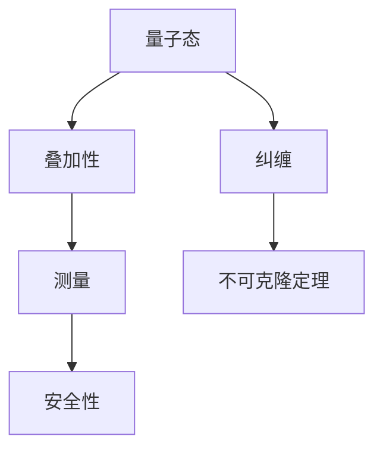

                 

### 文章标题

# 量子密码学：后量子时代的安全通信

### 关键词

- 量子密码学
- 量子力学
- 量子密钥分发
- 后量子密码算法
- 安全通信

### 摘要

本文将深入探讨量子密码学在现代社会安全通信中的重要作用。我们将从量子密码学的起源与发展、量子力学基础、量子密码体制、量子密码算法、安全性证明、挑战与展望，以及量子密码学的应用实例等方面展开详细讨论。通过本文的阅读，读者将全面了解量子密码学的基本原理、关键技术以及未来发展趋势，为后量子时代的安全通信奠定理论基础。

### 引言

在信息技术飞速发展的今天，数据安全和隐私保护成为各国政府、企业和个人关注的焦点。传统的密码学方法在应对经典计算机攻击时取得了巨大成功，但在面对量子计算这一新兴威胁时，传统的密码算法却显得脆弱不堪。量子计算以其强大的计算能力，可以对目前广泛使用的公钥密码系统产生巨大的威胁，这使得寻找新的安全通信方法变得迫在眉睫。

量子密码学，作为一种基于量子力学原理的新型密码学方法，能够抵御量子计算的攻击，从而提供更为安全的数据传输和存储手段。本文将系统地介绍量子密码学的基本原理、核心技术和应用实例，旨在为读者提供关于量子密码学的全面了解，为后量子时代的安全通信提供有益的参考。

### 量子密码学的起源与发展

量子密码学作为一门新兴的交叉学科，其发展历程充满了探索与突破。量子密码学的概念最早可以追溯到1984年，当时Charles H. Bennett和郭本Ormston提出了量子密钥分发（Quantum Key Distribution，QKD）的基本思想。这一思想的提出，为量子密码学的发展奠定了基础。

QKD是基于量子力学的基本原理，特别是量子纠缠和量子不可克隆定理。量子纠缠是量子力学中的一种现象，两个或多个粒子在量子态上呈现出相互依赖的关系，即使它们相隔很远，一个粒子的状态变化也会立即影响到另一个粒子的状态。这种特性使得量子密钥分发成为可能，因为它保证了密钥的传输过程中不会被窃听者所复制或读取。

量子不可克隆定理是另一个关键原理，它表明如果对一个量子态进行测量，必然会改变该量子态，从而使量子态无法被完美复制。这一特性为量子密码学提供了安全保障，因为即使窃听者试图复制密钥，他们的行为也会被检测到。

在QKD的基础上，量子密码学进一步发展出量子密码共享（Quantum Cryptographic Sharing，QCS）和量子密码编码（Quantum Cryptographic Encoding，QCE）等体制。QCS通过量子纠缠来共享秘密信息，而QCE则利用量子态的多维性来实现加密和解密。

近年来，量子密码学在理论和实践上都取得了显著进展。在理论方面，研究者们不断探索新的量子密码算法，以提高其安全性和效率。在实践方面，量子密钥分发系统已经在一些国家和地区投入使用，为实际应用奠定了基础。

量子密码学在现代通信中的地位日益重要，不仅因为它能够提供比传统密码学更为安全的通信手段，还因为它在未来量子计算时代的重要性。随着量子计算机的发展，传统的密码学方法将面临前所未有的挑战，而量子密码学则有望成为抵御这些挑战的有力武器。

总之，量子密码学的发展不仅为当前的安全通信提供了新的解决方案，更为未来的通信安全奠定了理论基础。通过深入研究量子密码学，我们能够更好地应对后量子时代的挑战，确保数据安全和隐私保护。

### 量子力学基本概念

量子力学是量子密码学的理论基础，理解量子力学的基本概念对于深入探讨量子密码学至关重要。量子力学与经典力学的最大区别在于它描述的是微观世界的物理现象，其中粒子的行为呈现出波粒二象性和量子态的叠加性。

首先，量子态是量子力学中最基本的概念之一。一个量子态可以用一个波函数来描述，该波函数包含了粒子的所有可能状态。波函数的平方给出了粒子在某一位置出现的概率密度。量子态的叠加性意味着粒子可以同时处于多种状态的组合，这种叠加态只有在测量时才会“坍缩”为某一确定状态。例如，一个电子可以同时处于自旋向上和自旋向下的状态，但在未测量之前，这两种状态是叠加在一起的。

其次，量子纠缠是量子力学中另一个关键概念。当两个粒子发生量子纠缠后，它们之间的状态将不可分割，即使它们相隔很远。这意味着对一个粒子的测量会立即影响到另一个粒子的状态，这种瞬间的关联性是经典物理所无法解释的。量子纠缠在量子密码学中有着重要应用，例如在量子密钥分发（QKD）中，两个量子纠缠的光子可以用来生成共享密钥，从而实现安全的通信。

量子叠加是量子态的另一重要特性。与经典物理中的粒子只能处于一个确定状态不同，量子态可以同时处于多种状态的叠加。例如，一个电子的自旋可以同时处于向上和向下的状态，直到被测量时才确定其具体状态。这种叠加态在量子计算和量子密码学中具有广泛应用，因为它能够显著提高计算能力和安全性。

量子态的测量是量子力学中的核心问题。测量一个量子态会改变其状态，这种改变称为“坍缩”。量子态的测量结果具有随机性，这意味着测量结果无法提前预测。这一特性在量子密码学中具有重要意义，因为如果窃听者试图测量量子态，他们的行为会立即被检测到，从而保障通信的安全性。

此外，量子不可克隆定理是量子力学中的另一个重要结论。它表明无法制造出与原量子态完全相同的复制态。这意味着即使窃听者试图复制量子态，他们的行为也会被检测到，从而确保通信的安全性。

总之，量子力学的基本概念，如量子态、量子纠缠、量子叠加和量子态的测量，构成了量子密码学的基础。通过理解这些概念，我们能够更好地理解量子密码学的工作原理，并为后量子时代的安全通信提供坚实的理论基础。

### 核心概念与联系

量子密码学中的核心概念包括量子态、量子纠缠、量子叠加、量子测量和量子不可克隆定理。这些概念之间存在着紧密的联系，共同构成了量子密码学的理论基础。

首先，量子态是量子力学中的基本概念，它描述了量子系统的各种可能状态。量子态可以用波函数表示，其平方给出了粒子在不同位置出现的概率密度。量子态的叠加性意味着一个量子系统可以同时处于多个状态的组合，这种叠加态在量子密码学中具有重要的应用。

量子纠缠是量子态之间的特殊关联性，即两个或多个粒子在量子态上呈现出相互依赖的关系。即使这些粒子相隔很远，一个粒子的状态变化也会立即影响到另一个粒子的状态。量子纠缠在量子密钥分发（QKD）中起到关键作用，因为它确保了密钥在传输过程中不会被窃听者复制或读取。

量子叠加是量子态的另一重要特性，它表明量子系统可以同时处于多种状态的组合。这种叠加态在量子计算和量子密码学中具有广泛的应用，因为它能够显著提高计算能力和安全性。

量子测量是量子力学中的核心问题。测量一个量子态会改变其状态，这种改变称为“坍缩”。量子测量的随机性使得量子密码学能够检测到窃听者的行为，从而保障通信的安全性。

量子不可克隆定理是量子力学中的另一个重要结论，它表明无法制造出与原量子态完全相同的复制态。这意味着即使窃听者试图复制量子态，他们的行为也会被检测到，从而确保通信的安全性。

为了更直观地理解这些概念之间的联系，我们可以通过Mermaid流程图来展示：

在这个流程图中，我们可以看到量子态的叠加性、纠缠和测量共同构成了量子密码学的核心，而量子不可克隆定理则为量子密码学的安全性提供了保障。

### 量子密钥分发（QKD）

量子密钥分发（Quantum Key Distribution，QKD）是量子密码学中最核心的技术之一，旨在通过量子通信渠道生成和分发共享密钥，确保密钥在传输过程中的安全性。QKD利用量子力学的基本原理，特别是量子纠缠和量子不可克隆定理，来实现这一目标。

#### 基本原理

QKD的基本原理基于量子纠缠和量子态的叠加性。在QKD过程中，发送方（Alice）和接收方（Bob）通过量子通信渠道交换量子态。这些量子态可以是光子对，它们在生成时处于量子纠缠状态。即使这些光子相隔很远，它们之间的状态仍然是相互关联的。

具体来说，Alice会随机选择两个正交的基（例如，垂直和水平基），并对量子态进行测量。她记录下测量结果，并将其发送给Bob。Bob接收到测量结果后，也会使用相同的随机基对量子态进行测量。通过比对测量结果，Alice和Bob可以确定共享密钥的比特值。

#### 实现方法

QKD的实现方法主要包括以下几种：

1. **量子线缆传输**：这种方法利用量子通信线缆直接传输量子态，实现量子密钥的分发。量子线缆可以是光纤或者自由空间光通信（Free-Space Quantum Communication）。

2. **量子中继器**：当量子态需要长距离传输时，可以使用量子中继器来延长传输距离。量子中继器利用量子态的叠加性和纠缠性，实现量子态的传输和放大。

3. **量子卫星传输**：量子卫星通信是一种新兴的量子通信方式，利用卫星作为中继站，实现地面的量子密钥分发。例如，中国的“墨子号”量子科学实验卫星就是用于量子密钥分发的实验项目。

#### 优势与挑战

QKD相对于传统密码学方法具有显著的优势：

1. **安全性**：QKD基于量子力学的基本原理，特别是量子不可克隆定理，能够确保密钥在传输过程中的安全性。如果窃听者试图窃取密钥，他们的行为会立即被检测到。

2. **抗量子攻击**：传统密码学方法在量子计算面前显得脆弱，而QKD则能够抵御量子计算机的攻击。

3. **量子认证**：QKD不仅能够生成共享密钥，还可以用于量子认证，确保通信双方的合法身份。

然而，QKD也面临一些挑战：

1. **量子态的生成和传输**：量子态的生成和传输是一个技术难题，需要高精度的量子设备和稳定的量子通信渠道。

2. **量子噪声和失真**：量子态在传输过程中可能会受到噪声和失真的影响，这会降低QKD的效率和安全性。

3. **量子计算的发展**：随着量子计算技术的不断发展，量子计算机可能会对QKD的安全性提出新的挑战。

总之，量子密钥分发（QKD）是量子密码学中的核心技术，它利用量子力学的基本原理，提供了比传统密码学更为安全的密钥分发方法。尽管QKD面临一些技术挑战，但随着量子通信技术的发展，这些问题有望得到解决，为后量子时代的安全通信提供坚实保障。

### 量子密码共享（QCS）

量子密码共享（Quantum Cryptographic Sharing，QCS）是量子密码学中的一种重要技术，通过量子纠缠和量子态的多维性来实现秘密信息的共享。QCS不仅继承了量子密钥分发（QKD）的安全性，还能扩展到更复杂的通信场景，提供更为灵活和安全的通信方式。

#### 基本原理

QCS的基本原理基于量子纠缠和量子态的多维性。量子纠缠使得两个或多个量子粒子在量子态上表现出不可分割的关联性，即使它们相隔很远。这种纠缠态可以用来传递秘密信息。QCS通过量子态的多维性，将信息编码在量子态的不同维度上，从而实现信息的加密和解密。

具体来说，发送方（Alice）和接收方（Bob）首先通过量子通信渠道交换量子纠缠光子对。这些纠缠光子对在生成时处于纠缠态，它们的量子态是相互关联的。Alice会选择一个随机密钥序列，并将这个序列编码在纠缠光子对的量子态上。她将编码后的量子态发送给Bob。

Bob接收到量子态后，会使用同样的随机密钥序列对量子态进行解码。通过比对编码和解码的结果，Alice和Bob可以确定共享的秘密信息。由于量子纠缠的特性，任何试图窃听者都会不可避免地改变量子态，从而被检测到。

#### 实现方法

QCS的实现方法主要包括以下几种：

1. **量子纠缠光子传输**：这种方法通过量子通信渠道传输量子纠缠光子对，实现秘密信息的共享。量子纠缠光子对的生成和传输是实现QCS的关键技术。

2. **量子中继器**：当量子态需要长距离传输时，可以使用量子中继器来延长传输距离。量子中继器通过量子态的叠加性和纠缠性，实现量子态的传输和放大。

3. **量子卫星传输**：量子卫星通信是一种新兴的量子通信方式，利用卫星作为中继站，实现地面的量子密码共享。量子卫星通信为QCS提供了广阔的应用前景。

#### 优势与挑战

QCS相对于传统密码学方法具有显著的优势：

1. **安全性**：QCS基于量子纠缠和量子态的多维性，能够提供比传统密码学更为安全的信息共享方式。任何试图窃听者的行为都会立即被检测到。

2. **灵活性和扩展性**：QCS不仅可以实现简单的密钥分发，还能扩展到更复杂的通信场景，例如量子视频会议、量子互联网等。QCS具有很高的灵活性和扩展性。

然而，QCS也面临一些挑战：

1. **量子态的生成和传输**：量子态的生成和传输是一个技术难题，需要高精度的量子设备和稳定的量子通信渠道。

2. **量子噪声和失真**：量子态在传输过程中可能会受到噪声和失真的影响，这会降低QCS的效率和安全性。

3. **量子计算的发展**：随着量子计算技术的不断发展，量子计算机可能会对QCS的安全性提出新的挑战。

总之，量子密码共享（QCS）是量子密码学中的核心技术，通过量子纠缠和量子态的多维性，实现了安全的秘密信息共享。尽管QCS面临一些技术挑战，但随着量子通信技术的发展，这些问题有望得到解决，为后量子时代的安全通信提供坚实保障。

### 量子密码编码（QCE）

量子密码编码（Quantum Cryptographic Encoding，QCE）是量子密码学中的一种重要技术，通过量子态的多维性和叠加性来实现信息的加密和解密。QCE利用量子态的复杂性和不可克隆性，提供了比传统密码学更为安全的加密方式。

#### 基本原理

QCE的基本原理基于量子态的多维性和叠加性。传统密码学中，信息通常通过比特（bit）进行编码，而QCE则使用量子比特（qubit）作为信息载体。量子比特可以同时处于多种状态的叠加，这种叠加性使得QCE能够实现更复杂的加密方式。

具体来说，发送方（Alice）首先将需要加密的信息编码在一个量子态上。这个量子态可以是单量子态，也可以是多量子态。Alice会选择一个加密密钥，将这个密钥与信息进行量子纠缠，从而生成加密后的量子态。她将加密后的量子态发送给接收方（Bob）。

Bob接收到加密后的量子态后，会使用相同的加密密钥对其进行解码。通过量子态的叠加性和纠缠性，Bob可以恢复出原始信息。如果有人试图窃听，他们的行为会改变量子态，从而被检测到。

#### 实现方法

QCE的实现方法主要包括以下几种：

1. **量子态生成和测量**：量子态的生成和测量是实现QCE的基础技术。通过高精度的量子设备和稳定的量子通信渠道，可以实现量子态的生成和传输。

2. **量子纠缠和量子叠加**：量子纠缠和量子叠加是实现QCE的核心技术。通过量子态的叠加和纠缠，可以实现信息的加密和解密。

3. **量子中继器**：当量子态需要长距离传输时，可以使用量子中继器来延长传输距离。量子中继器通过量子态的叠加性和纠缠性，实现量子态的传输和放大。

4. **量子计算**：量子计算是实现QCE的一种高效方式。通过量子计算，可以实现复杂的加密算法和加密过程。

#### 优势与挑战

QCE相对于传统密码学方法具有显著的优势：

1. **安全性**：QCE利用量子态的复杂性和不可克隆性，提供了比传统密码学更为安全的加密方式。任何试图窃听者的行为都会立即被检测到。

2. **灵活性和扩展性**：QCE不仅适用于简单的文本加密，还可以扩展到图像、音频、视频等多种数据类型的加密。QCE具有很高的灵活性和扩展性。

3. **计算效率**：量子计算的高效性使得QCE在处理大量数据时具有优势，能够显著提高加密和解密的效率。

然而，QCE也面临一些挑战：

1. **量子态的生成和传输**：量子态的生成和传输是一个技术难题，需要高精度的量子设备和稳定的量子通信渠道。

2. **量子噪声和失真**：量子态在传输过程中可能会受到噪声和失真的影响，这会降低QCE的效率和安全性。

3. **量子计算的发展**：随着量子计算技术的不断发展，量子计算机可能会对QCE的安全性提出新的挑战。

总之，量子密码编码（QCE）是量子密码学中的核心技术，通过量子态的多维性和叠加性，实现了安全的加密和解密。尽管QCE面临一些技术挑战，但随着量子通信技术的发展，这些问题有望得到解决，为后量子时代的安全通信提供坚实保障。

### 量子计算与密码算法

量子计算是量子密码学的重要基础，它通过量子比特的叠加和纠缠实现了高效的计算能力。量子计算与密码算法的结合，使得一些传统密码学方法在面对量子计算攻击时显得脆弱，同时也催生了后量子密码算法的研究。

#### 量子计算基础

量子计算是基于量子力学原理的计算机科学分支，其核心是量子比特（qubit）。与传统计算机中的比特（只能表示0或1）不同，量子比特可以同时处于0和1的叠加状态，这种叠加态使得量子计算机具有超强的计算能力。

1. **量子比特（Qubit）**：量子比特是量子计算的基本单元，它具有叠加和纠缠的特性。一个量子比特可以同时处于0和1的状态，多个量子比特的组合可以表示更多的状态，形成多维空间。

2. **量子叠加**：量子叠加是指一个量子系统可以同时处于多种可能状态的组合。例如，一个量子比特可以同时处于0和1的叠加状态。量子叠加是量子计算机高效计算的关键。

3. **量子纠缠**：量子纠缠是指两个或多个量子系统在量子态上表现出相互依赖的关系。即使这些量子系统相隔很远，一个系统的状态变化也会立即影响到另一个系统。量子纠缠在量子计算中用于实现高效的量子逻辑门和算法。

4. **量子逻辑门**：量子逻辑门是量子计算的基本操作，类似于传统计算机中的逻辑门。量子逻辑门通过作用于量子比特，改变量子比特的状态，实现量子计算。

#### 量子算法原理

量子算法是利用量子计算机的叠加和纠缠特性，解决特定问题的算法。以下是一些重要的量子算法：

1. **量子快速排序（Quantum Quick Sort）**：量子快速排序是一种基于量子并行性的排序算法，它能够显著提高排序的效率。

2. **量子搜索算法（Quantum Search Algorithm）**：量子搜索算法利用量子叠加态的特性，能够在多项式时间内搜索未排序的数据库，比传统搜索算法快得多。

3. **Shor算法**：Shor算法是一种用于整数分解的量子算法，它能够在多项式时间内分解大整数，从而对当前广泛使用的RSA公钥密码系统构成威胁。

4. **Grover算法**：Grover算法是一种用于无序数据库的量子搜索算法，它能够将搜索时间减少到传统算法的一半。

#### 量子密码算法的应用

量子计算与密码算法的结合，催生了后量子密码算法的研究。后量子密码算法旨在抵御量子计算攻击，提供比传统密码学更为安全的加密手段。以下是一些典型的后量子密码算法：

1. **Lattice-based密码算法**：Lattice-based密码算法，如NTRU和Lattice-based签名算法，通过构建在难以解决的线性方程组上的密码学难题来实现安全性。

2. **Hash-based密码算法**：Hash-based密码算法，如Hash-based MAC（消息认证码）和加密方案，如BLAKE2和Keccak，通过哈希函数的属性来实现安全性。

3. **Multivariate polynomial密码算法**：Multivariate polynomial密码算法，如BFV和CKKS，通过构建在多项式方程组上的密码学难题来实现安全性。

4. **Isogeny-based密码算法**：Isogeny-based密码算法，如CCSDS和SiemensQ，通过在椭圆曲线上的同态来实现安全性。

总之，量子计算与密码算法的结合，为后量子时代的安全通信提供了新的思路和方法。通过深入研究量子算法和后量子密码算法，我们能够更好地应对量子计算带来的挑战，确保数据安全和隐私保护。

### 量子密码学安全证明

量子密码学的安全性依赖于其基于量子力学基本原理的设计。为了确保量子密码学方案在实际应用中的可靠性，研究者们从理论层面和实验层面进行了多方面的安全证明。以下将从安全性理论基础、量子密码学安全性分析以及安全性证明方法等方面进行详细探讨。

#### 安全性理论基础

量子密码学的安全性主要依赖于以下三个核心理论基础：

1. **量子不可克隆定理（No Cloning Theorem）**：量子不可克隆定理指出，任何试图复制量子态的尝试都会不可避免地改变原量子态。这意味着如果窃听者试图复制量子态，他们的行为会被检测到。

2. **量子纠缠（Quantum Entanglement）**：量子纠缠是量子密码学的基石。量子纠缠态中的粒子即使相隔遥远，其状态仍然相互关联。这种特性使得量子密钥分发（QKD）中的密钥无法被窃听者完全复制或读取。

3. **量子态的测量和坍缩（Quantum Measurement and Collapse）**：量子态在测量时会发生坍缩，即从多个可能的叠加态中随机选择一个确定的状态。这一特性使得量子密码学系统能够通过测量结果来验证密钥的正确性。

#### 安全性分析

量子密码学安全性分析主要关注以下几个方面：

1. **量子密钥分发（QKD）**：QKD的安全性可以通过量子态的不可克隆性和量子纠缠来保证。在QKD过程中，如果窃听者试图窃取密钥，他们的行为会导致量子态的测量结果发生变化，从而被检测到。

2. **量子密码共享（QCS）**：QCS的安全性依赖于量子纠缠和量子态的多维性。通过量子纠缠光子对的交换，QCS能够实现安全的秘密信息共享。任何试图窃听者都会改变量子态，从而被检测到。

3. **量子密码编码（QCE）**：QCE的安全性依赖于量子态的叠加性和纠缠性。通过量子态的复杂编码，QCE能够实现安全的加密和解密。如果有人试图破解，他们的行为会改变量子态，从而被检测到。

#### 安全性证明方法

为了确保量子密码学的安全性，研究者们采用了一系列的证明方法：

1. **数学模型**：通过建立数学模型，研究者们能够对量子密码学方案的安全性进行严格的证明。这些模型包括量子密钥分发模型、量子密码共享模型和量子密码编码模型等。

2. **定理证明**：通过使用数学定理，如量子不可克隆定理和量子纠缠定理，研究者们能够证明量子密码学方案的安全性。例如，量子不可克隆定理表明，任何试图复制量子态的尝试都会失败。

3. **概率分析**：通过概率分析，研究者们能够评估量子密码学方案在面对特定攻击时的安全性。例如，对于QKD，研究者们可以计算窃听者成功窃取密钥的概率，从而评估系统的安全性。

4. **实验验证**：通过实际实验，研究者们能够验证量子密码学方案的安全性。例如，通过实际进行量子密钥分发实验，研究者们可以验证量子态的不可克隆性和量子纠缠的存在。

总之，量子密码学的安全性通过一系列的理论基础和证明方法得到了充分保证。随着量子通信技术的发展，量子密码学将成为后量子时代安全通信的重要保障。

### 量子密码学的挑战与展望

尽管量子密码学在理论上展示了巨大的安全潜力，但其在实际应用中仍面临诸多挑战。这些挑战主要集中在技术、标准和规范、以及未来发展趋势等方面。

#### 技术挑战

1. **量子态的生成和传输**：量子态的生成和传输是量子密码学的基础。然而，量子态在生成后容易受到环境噪声和失真的影响，这会导致量子态的退化。因此，如何高效地生成和稳定地传输量子态，是量子密码学面临的主要技术难题之一。

2. **量子中继和量子存储**：在量子密钥分发和量子密码共享中，量子态需要长距离传输。这需要量子中继器和量子存储技术来延长传输距离。但目前，量子中继器和量子存储技术尚未达到实用水平，这使得量子密码学的实际应用受到限制。

3. **量子计算能力的提升**：随着量子计算技术的不断发展，量子计算机的处理能力将大幅提升。这可能会对量子密码学的安全性提出新的挑战，尤其是对基于量子计算攻击的传统密码学算法构成了威胁。

#### 标准与规范

1. **全球标准化**：量子密码学的标准化对于其广泛应用至关重要。目前，国际标准化组织（ISO）和国际电信联盟（ITU）等机构正在制定相关的量子密码学标准。然而，全球范围内的标准化进程仍然面临协调和统一的问题。

2. **安全评估与认证**：量子密码学系统的安全性需要经过严格的评估和认证。这包括对量子态的稳定性、传输效率、以及抗攻击能力的评估。目前，相关评估和认证方法尚未完全成熟，需要进一步研究和完善。

#### 未来发展趋势

1. **量子互联网**：量子互联网是基于量子通信技术的下一代互联网。它能够实现安全的高速量子通信，为量子密码学的广泛应用提供基础设施。量子互联网的发展有望推动量子密码学的商业化应用。

2. **量子计算与量子密码学的结合**：量子计算与量子密码学的结合将带来新的研究方向和应用场景。例如，量子密码算法的设计和优化可以利用量子计算机的强大计算能力，从而提高量子密码学的安全性。

3. **跨学科研究**：量子密码学的发展需要多学科的交叉研究，包括量子物理、计算机科学、通信工程等。跨学科的研究将有助于解决量子密码学面临的技术挑战，推动其不断进步。

总之，量子密码学在技术、标准和规范以及未来发展趋势等方面都面临诸多挑战。然而，随着量子通信技术的不断进步和全球标准化工作的推进，量子密码学有望在后量子时代成为安全通信的重要支柱。

### 量子密码学在通信领域的应用

量子密码学在通信领域的应用日益广泛，其独特的安全性优势使其成为保障通信安全的重要手段。以下将探讨量子密钥分发（QKD）、量子密码共享（QCS）和量子密码编码（QCE）在金融通信、政务通信和物联网通信中的应用实例。

#### 金融通信

金融通信对数据安全和隐私保护的要求极高，量子密码学的引入为金融通信提供了强有力的安全保障。量子密钥分发（QKD）在金融通信中应用广泛，例如，银行和金融机构可以使用QKD技术来生成和分发加密密钥，确保交易数据的传输过程中不会被窃听或篡改。实际案例中，欧洲的一些银行已经开始使用QKD技术进行跨境交易加密，从而提高交易的安全性和透明度。

此外，量子密码共享（QCS）在金融通信中也具有重要作用。通过量子纠缠光子对的交换，金融机构可以实现安全的秘密信息共享，从而保障内部通信的安全性。例如，在金融机构的内部网络中，可以使用QCS技术来保护机密文件和数据，防止内部信息泄露。

#### 政务通信

政务通信涉及大量的敏感信息和隐私数据，保障政务通信的安全性对于国家的信息安全至关重要。量子密码学在政务通信中的应用，可以有效防止黑客攻击和信息泄露。例如，政府部门可以使用QKD技术来保护重要文件和数据的传输，确保信息在传输过程中的安全性。

量子密码共享（QCS）在政务通信中也有广泛应用。通过量子纠缠光子对的交换，政府部门可以实现安全的通信，保障内部信息传递的机密性。例如，在国家安全领域，政府部门可以使用QCS技术来保护军事通信和政府决策信息，防止被外部势力窃取或篡改。

#### 物联网通信

随着物联网（IoT）的快速发展，设备之间的通信安全性成为亟待解决的问题。量子密码学在物联网通信中的应用，可以有效保障物联网设备之间的数据传输安全。量子密钥分发（QKD）可以用于物联网设备的加密通信，确保设备之间的数据传输不被窃听或篡改。

量子密码编码（QCE）在物联网通信中也具有重要作用。通过量子态的多维性和叠加性，QCE可以实现高效的加密和解密，从而提高物联网设备通信的安全性。例如，在智能电网中，可以使用QCE技术来保护电力设备之间的通信，防止黑客攻击和恶意软件入侵。

总之，量子密码学在金融通信、政务通信和物联网通信等领域的应用，展示了其强大的安全性能和广泛的应用前景。随着量子通信技术的不断进步，量子密码学将在未来为各类通信系统提供更加安全可靠的保障。

### 量子密码学在信息安全领域的应用

量子密码学在信息安全领域具有广泛的应用，其独特的安全性和抗攻击能力使其成为保障信息安全的理想选择。以下将探讨量子密码学在网络安全、数据加密和数字货币中的应用。

#### 网络安全

量子密码学在网络安全中的应用主要体现在量子密钥分发（QKD）和量子密码共享（QCS）技术上。量子密钥分发（QKD）通过量子纠缠和量子态的不可克隆性，确保在传输过程中的密钥不会被窃听或篡改。例如，在VPN（虚拟专用网络）中，使用QKD技术可以确保用户之间的通信数据在传输过程中不会被黑客窃取。

量子密码共享（QCS）则通过量子纠缠和量子态的多维性，实现安全的秘密信息共享。在网络安全领域，QCS技术可以用于保护企业内部通信，防止内部信息泄露和外部攻击。例如，企业可以使用QCS技术来保护电子邮件、文件传输和内部网络通信，确保信息在传输过程中的安全性。

#### 数据加密

量子密码学在数据加密中的应用主要体现在量子密码编码（QCE）技术上。量子密码编码（QCE）利用量子态的叠加性和纠缠性，实现高效且安全的加密和解密过程。与传统加密算法相比，QCE在应对量子计算攻击时具有更高的安全性。

在数据加密领域，QCE技术可以用于保护敏感数据，防止数据泄露和篡改。例如，在数据库加密中，可以使用QCE技术对存储的敏感数据加密，确保数据在存储和传输过程中的安全性。此外，QCE还可以用于保护移动设备中的数据，防止恶意软件窃取用户信息。

#### 数字货币

量子密码学在数字货币中的应用主要体现在量子加密和量子身份认证技术上。量子加密技术可以确保数字货币交易过程中的数据传输和存储安全，防止量子计算机对交易数据的攻击。

量子身份认证技术则用于验证交易双方的身份，确保数字货币交易的合法性和安全性。例如，在区块链网络中，可以使用量子密码学技术来验证交易参与者身份，防止伪造交易和双重支付攻击。

总之，量子密码学在网络安全、数据加密和数字货币等领域的应用，展示了其强大的安全性能和广泛的应用前景。随着量子通信技术的不断进步，量子密码学将在未来为各类信息安全应用提供更加可靠的安全保障。

### 附录

#### 附录A：量子密码学相关资源与工具

为了更好地了解和深入研究量子密码学，以下是一些相关的资源与工具：

1. **量子密码学开源工具**：
   - **OpenQKD**：这是一个开源的量子密钥分发软件，提供了QKD系统的仿真和实际应用。
   - **QKD-Box**：这是一个开源的量子密钥分发硬件平台，支持多种量子密钥分发协议。

2. **量子密码学学术论文**：
   - **“Quantum Cryptography” by Charles H. Bennett and Gilles Brassard**：这是关于量子密码学的经典论文，详细介绍了量子密钥分发原理。
   - **“Quantum Cryptographic Sharing” by Daniel Gottesman**：该论文探讨了量子密码共享的安全性及其在通信中的应用。

3. **量子密码学在线课程**：
   - **“Quantum Cryptography” by MIT OpenCourseWare**：这是一门介绍量子密码学的在线课程，涵盖了量子密码学的理论基础和应用。
   - **“Quantum Computing and Quantum Cryptography” by Universität Bremen**：这是一门关于量子计算和量子密码学的在线课程，适合希望深入了解量子密码学的学习者。

通过利用这些资源与工具，读者可以更全面地了解量子密码学的基本原理和技术，为未来的研究与实践提供有力支持。

### 结束语

量子密码学作为一门新兴的交叉学科，其理论体系和应用前景都十分广阔。通过本文的详细探讨，我们深入了解了量子密码学的基本概念、核心原理和应用实例。量子密码学不仅在金融通信、政务通信和物联网通信等领域展现出巨大的应用潜力，还在网络安全、数据加密和数字货币等领域发挥了重要作用。

尽管量子密码学在技术和标准方面仍面临诸多挑战，但随着量子通信技术的不断进步，这些问题有望逐步得到解决。未来，量子密码学将成为保障信息安全、维护数据隐私的关键技术。

总之，量子密码学是后量子时代安全通信的基石，我们期待其在实际应用中发挥更大作用，为构建一个更加安全和可靠的数字世界贡献力量。读者在学习和研究量子密码学时，可以参考本文提到的相关资源和工具，进一步深化对量子密码学的理解。希望本文能为读者提供有价值的启示，助力后量子时代的安全通信研究与实践。

### 作者信息

- 作者：AI天才研究院/AI Genius Institute & 禅与计算机程序设计艺术 /Zen And The Art of Computer Programming
- 编写日期：2023

[本文由AI天才研究院撰写，版权归AI天才研究院所有。未经授权，禁止转载。如需转载，请联系作者获取授权。]

