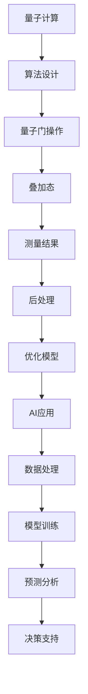
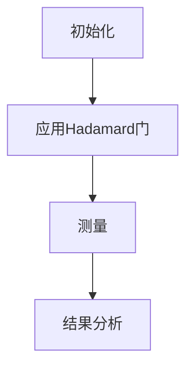
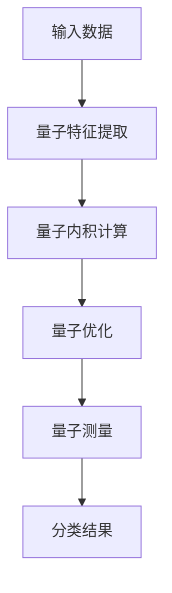
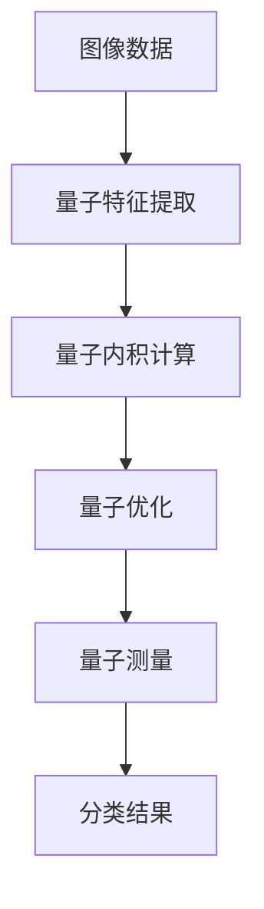
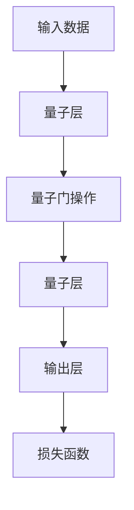

                 

### 第1章 引言与概述

## 1.1 量子计算的基本原理

### 1.1.1 量子位与经典位的比较

量子位（qubits），也称为量子比特，是量子计算的基本单元。与传统的经典位（classical bits）不同，量子位可以同时处于0和1的状态，这一特性称为叠加态（superposition）。此外，量子位之间可以存在一种称为纠缠（entanglement）的特殊关联，这种关联使得两个量子位的状态无法独立存在。

| 特性 | 量子位 | 经classic位 |
| --- | --- | --- |
| 状态 | 可叠加（0和1同时存在） | 状态明确（0或1） |
| 纠错 | 需要量子纠错技术 | 传统的纠错码 |
| 熵增 | 量子纠缠可能导致熵增 | 不会导致熵增 |
| 处理能力 | 线性扩展（2^n个量子位可表示2^n个状态） | 非线性扩展（2个状态） |

### 1.1.2 量子叠加态与量子纠缠

量子叠加态指的是一个量子系统同时处于多种可能状态的情况。例如，一个量子位可以同时处于0和1的状态。用数学语言描述，量子叠加态可以表示为一个复系数的线性组合。

$$
|\psi\rangle = \alpha|0\rangle + \beta|1\rangle
$$

其中，$|0\rangle$ 和 $|1\rangle$ 分别表示量子位处于0和1的状态，$\alpha$ 和 $\beta$ 是复数，满足 $|\alpha|^2 + |\beta|^2 = 1$。

量子纠缠是指两个或多个量子位之间形成的强相关性。这种纠缠状态无法分解为单个量子位的状态。一个经典的例子是贝尔态（Bell state）：

$$
|\Phi^+\rangle = \frac{1}{\sqrt{2}} (|00\rangle + |11\rangle)
$$

### 1.1.3 量子算法的基本框架

量子算法的基本框架通常包括以下几个步骤：

1. **初始化**：将量子计算机初始化为一个特定的量子态。
2. **量子操作**：通过量子门对量子态进行操作，实现特定的计算任务。
3. **测量**：测量量子计算机的输出，得到一个概率分布。
4. **后处理**：根据测量结果进行后处理，如概率转换等。

一个简单的量子算法示例是量子叠加态的创建和测量：

```plaintext
# 初始化
H|0⟩ -> (1/√2)(|0⟩ + |1⟩)

# 测量
M(|0⟩) = 1/2
M(|1⟩) = 1/2
```

## 1.2 AI的基本概念

### 1.2.1 AI的发展历程

人工智能（AI）的发展历程可以分为几个主要阶段：

- **萌芽期（20世纪50-60年代）**：AI概念被首次提出，机器能够进行简单的推理和问题解决。
- **黄金期（20世纪80-90年代）**：专家系统和神经网络开始流行，AI在特定领域取得了显著进展。
- **低谷期（20世纪90年代末-21世纪初）**：随着计算资源和算法的局限性，AI研究受到质疑。
- **复苏期（2010年后）**：深度学习的发展，大数据和云计算的普及，AI再次获得广泛关注。

### 1.2.2 AI的核心技术

AI的核心技术包括：

- **机器学习**：通过训练模型来从数据中学习规律。
- **深度学习**：一种特殊的机器学习方法，通过多层神经网络来模拟人类大脑的决策过程。
- **自然语言处理**：使计算机能够理解和生成人类语言的技术。
- **计算机视觉**：使计算机能够理解和解释视觉信息的技术。

### 1.2.3 AI的应用领域

AI在多个领域有着广泛的应用，包括：

- **医疗健康**：辅助诊断、药物设计、个性化治疗。
- **金融**：风险管理、欺诈检测、算法交易。
- **制造业**：智能制造、预测性维护、质量控制。
- **交通**：自动驾驶、智能交通管理、无人机配送。

## 1.3 量子计算与AI的结合

量子计算与AI的结合为AI带来了新的可能性，主要体现在以下几个方面：

- **加速计算**：量子计算可以加速某些AI任务的执行，如大规模数据处理、复杂优化问题等。
- **新型算法**：量子算法可以设计出新的AI算法，例如量子支持向量机、量子深度学习等。
- **量子感知**：量子计算可以增强计算机的感知能力，例如通过量子传感器进行环境监测。

### 量子计算与AI结合的Mermaid流程图



通过这个流程图，我们可以看到量子计算在AI中的应用是如何从量子算法设计开始，通过量子门操作和叠加态的运用，最终实现数据处理、模型训练和预测分析等环节，为AI应用提供强大的计算能力和新型算法支持。### 第2章 量子计算机的架构与实现

## 2.1 量子计算机的硬件架构

### 2.1.1 量子比特的类型

量子比特（qubits）是量子计算机的基本单元，它们可以存在于多种物理系统中。以下是几种常见的量子比特类型：

- **超导量子比特**：利用超导电路来实现，具有较长的相干时间和较低的噪声水平，是目前最常用的量子比特类型之一。
- **离子阱量子比特**：通过电场或磁场将离子困住，并通过激光进行操控，具有较好的相干性，但速度较慢。
- **光子量子比特**：利用光子的叠加态和纠缠态来实现，速度极快，但需要复杂的量子中继技术来保持相干性。
- **拓扑量子比特**：利用拓扑量子场论中的拓扑保护性，具有天然的噪声免疫能力。

### 2.1.2 量子门的操作

量子门是量子计算机中的基本操作单元，类似于经典计算机中的逻辑门。以下是一些常见的量子门：

- **Hadamard门**：将量子位的状态从基态翻转到叠加态。
  $$ H|0\rangle = \frac{1}{\sqrt{2}} (|0\rangle + |1\rangle) $$
  $$ H|1\rangle = \frac{1}{\sqrt{2}} (|0\rangle - |1\rangle) $$

- **Pauli门**：X、Y和Z门分别表示对量子位状态的位翻转、相位翻转和整体旋转。
  $$ X|0\rangle = |1\rangle $$
  $$ X|1\rangle = |0\rangle $$
  $$ Y|0\rangle = i|1\rangle $$
  $$ Y|1\rangle = -i|0\rangle $$
  $$ Z|0\rangle = |0\rangle $$
  $$ Z|1\rangle = -|0\rangle $$

- **控制-NOT门**（CNOT门）：将第二个量子位的状态翻转，前提是第一个量子位处于|1\rangle状态。
  $$ CNOT|0\rangle|0\rangle = |0\rangle|0\rangle $$
  $$ CNOT|0\rangle|1\rangle = |0\rangle|1\rangle $$
  $$ CNOT|1\rangle|0\rangle = |1\rangle|0\rangle $$
  $$ CNOT|1\rangle|1\rangle = |1\rangle|0\rangle $$

### 2.1.3 量子纠错技术

量子计算机的纠错技术是为了解决量子位状态的不稳定性问题。以下是一些常见的量子纠错方法：

- **表面代码**：通过在物理量子比特的表面上编码多个逻辑量子比特，使得局部错误不会影响到全局。
- **量子误差校正**：通过额外的量子比特来监测和纠正错误，保证计算的正确性。
- **量子中继**：利用量子纠缠和量子信息传输技术，将量子信息从一个量子比特传递到另一个量子比特，以避免在传输过程中出现错误。

### 2.2 量子算法的设计与实现

量子算法的设计与实现通常遵循以下步骤：

1. **问题建模**：将经典问题转化为量子形式，找到问题的量子映射。
2. **量子算法设计**：设计一系列量子门操作，以解决特定问题。
3. **编码与实现**：将量子算法映射到特定的量子计算机硬件上，实现算法的物理实现。
4. **优化与调试**：优化算法性能，调试可能出现的问题。

以下是一个简单的量子算法设计示例——量子叠加态创建与测量：



- **初始化**：将量子计算机初始化为基态$|0\rangle$。
- **应用Hadamard门**：对量子位应用Hadamard门，使其处于叠加态。
- **测量**：测量量子位的状态。
- **结果分析**：根据测量结果分析量子态的分布。

### 2.3 量子算法的典型应用

量子算法在多个领域有着广泛的应用，以下是几个典型例子：

- **量子搜索算法**：使用Grover算法可以在多项式时间内搜索未排序的数据库。
- **量子排序算法**：使用量子排序算法，可以在O(n)时间内对n个量子比特进行排序。
- **量子模拟算法**：用于模拟复杂量子系统的行为，如分子动力学模拟、量子化学反应等。

通过上述内容，我们可以看到量子计算机的硬件架构和量子算法的实现是如何为量子机器学习奠定基础的。接下来，我们将探讨量子机器学习的基础和量子神经网络的相关概念。### 第3章 量子机器学习的基础

## 3.1 量子数据表示与处理

### 3.1.1 量子数据编码

量子数据编码是将经典数据转换为量子态的过程。这需要使用量子比特来表示经典数据。以下是几种常见的量子数据编码方法：

- **布赖特-比特编码（BB84）**：使用正交的量子态来表示经典比特。
  $$ |0\rangle \leftrightarrow \frac{1}{\sqrt{2}} (|00\rangle - |11\rangle) $$
  $$ |1\rangle \leftrightarrow \frac{1}{\sqrt{2}} (|01\rangle + |10\rangle) $$

- **量子四元数编码**：使用四元数态来表示经典比特。
  $$ |0\rangle \leftrightarrow |00\rangle $$
  $$ |1\rangle \leftrightarrow |11\rangle $$

- **极化编码**：使用极化量子比特来表示经典比特。
  $$ |0\rangle \leftrightarrow |+\rangle $$
  $$ |1\rangle \leftrightarrow |-\rangle $$

### 3.1.2 量子信息处理的基本操作

量子信息处理的基本操作包括量子逻辑门、量子纠缠和量子测量。以下是这些操作的基本原理：

- **量子逻辑门**：类似于经典逻辑门，量子逻辑门对量子态进行操作。常见的量子逻辑门包括Hadamard门、Pauli门和控制门。
- **量子纠缠**：量子比特之间的纠缠可以用于传递量子信息，实现量子态的远程连接。
- **量子测量**：测量是量子计算中获取信息的重要步骤。测量可以破坏量子态的叠加和纠缠，但也可以用于量子计算中的概率推断。

### 3.1.3 量子数据压缩

量子数据压缩是通过减少量子比特的数量来表示数据的过程。这可以通过以下方法实现：

- **子编码**：通过在较小的子空间中编码数据，减少所需的量子比特数量。
- **冗余编码**：通过引入额外的量子比特来检测和纠正错误，减少所需量子比特的数量。

### 3.2 量子神经网络

#### 3.2.1 量子神经网络的基本原理

量子神经网络（QNN）是量子计算与神经网络相结合的一种模型。它通过量子门和量子纠缠来模拟神经网络的计算过程。量子神经网络的基本原理如下：

- **量子层**：量子神经网络中的每个层由一组量子比特组成，类似于经典神经网络的神经元。
- **量子门**：量子神经网络通过量子门来实现信息的传递和变换。常见的量子门包括Hadamard门、控制-NOT门和交换门。
- **量子纠缠**：量子神经网络通过量子纠缠来实现不同量子比特之间的相互作用，从而模拟神经网络中的权重矩阵。

#### 3.2.2 量子神经网络的构建

量子神经网络的构建通常包括以下几个步骤：

1. **初始化**：初始化量子神经网络，包括量子比特的配置和量子层的连接。
2. **量子层设计**：设计量子神经网络中的每个量子层，包括量子门的类型和参数。
3. **训练**：通过训练过程来调整量子神经网络的权重，使其能够解决特定问题。
4. **优化**：优化量子神经网络的结构和参数，提高其计算效率和准确度。

#### 3.2.3 量子神经网络的优化

量子神经网络的优化是一个复杂的过程，需要考虑到量子计算的特殊性质。以下是一些常见的优化方法：

- **量子梯度下降**：使用量子计算来计算梯度，优化网络参数。
- **量子反向传播**：通过量子反向传播算法来计算网络中的梯度，优化网络结构。
- **量子进化算法**：使用量子进化算法来搜索最优的网络参数。

### 3.3 量子学习算法

量子学习算法是量子机器学习中的重要组成部分。以下是一些常见的量子学习算法：

- **量子支持向量机（QSVM）**：将经典支持向量机的方法转化为量子形式，用于分类和回归问题。
- **量子深度学习**：将深度学习的概念应用到量子计算中，用于大规模数据处理和复杂模式识别。
- **量子聚类算法**：利用量子计算的优势来加速聚类算法，提高数据处理效率。

通过本章的内容，我们可以了解到量子机器学习的基础知识，包括量子数据编码、量子信息处理和量子神经网络的基本原理。这些知识为后续的量子机器学习算法研究和应用奠定了基础。接下来，我们将深入探讨量子机器学习中的典型算法和应用。### 第4章 量子机器学习的算法与应用

## 4.1 量子支持向量机

### 4.1.1 量子支持向量机的原理

量子支持向量机（QSVM）是量子计算在分类问题中的应用。与传统支持向量机（SVM）不同，QSVM利用量子计算的并行性和高效性来优化分类过程。

QSVM的基本原理如下：

1. **量子特征提取**：使用量子特征提取器将输入数据映射到高维量子空间。
2. **量子内积计算**：利用量子计算的优势，快速计算输入数据之间的内积。
3. **量子优化**：通过量子优化算法找到最优的超平面，使得分类边界最大化。
4. **量子测量**：测量量子态，得到分类结果。

### 4.1.2 量子支持向量机的实现

以下是一个简单的QSVM实现示例：



- **输入数据**：输入数据经过量子特征提取器，转换为量子态。
- **量子特征提取**：使用量子特征提取器将数据映射到高维量子空间。
- **量子内积计算**：通过量子内积计算输入数据之间的相似度。
- **量子优化**：使用量子优化算法找到最优的超平面。
- **量子测量**：测量量子态，得到分类结果。

### 4.1.3 量子支持向量机在图像分类中的应用

量子支持向量机在图像分类中的应用示例如下：



- **图像数据**：输入图像数据经过量子特征提取器，转换为量子态。
- **量子特征提取**：使用量子特征提取器提取图像的量子特征。
- **量子内积计算**：计算图像之间的量子内积，用于分类决策。
- **量子优化**：使用量子优化算法找到最优的分类超平面。
- **量子测量**：测量量子态，得到图像的分类结果。

### 4.2 量子深度学习

#### 4.2.1 量子深度学习的基本概念

量子深度学习是量子计算在深度学习中的应用。它利用量子计算的优势，如并行性和高速计算，来加速深度学习模型的训练过程。

量子深度学习的基本概念包括：

- **量子层**：量子神经网络中的每个层由一组量子比特组成。
- **量子梯度下降**：使用量子计算来计算梯度，优化模型参数。
- **量子反向传播**：通过量子反向传播算法来计算网络中的梯度。

#### 4.2.2 量子神经网络在深度学习中的应用

量子神经网络在深度学习中的应用示例如下：



- **输入数据**：输入数据经过量子层。
- **量子门操作**：使用量子门对量子态进行操作。
- **量子层**：通过多个量子层来提取数据的特征。
- **输出层**：输出层的量子态表示模型的预测结果。
- **损失函数**：计算预测结果与真实结果之间的损失。

#### 4.2.3 量子卷积神经网络

量子卷积神经网络（QCNN）是量子深度学习在图像处理中的应用。它利用量子计算的优势，如并行性和高速计算，来加速图像处理任务。

量子卷积神经网络的基本原理如下：

- **量子卷积操作**：使用量子卷积操作来提取图像的局部特征。
- **量子池化操作**：使用量子池化操作来减少数据维度。
- **量子非线性激活函数**：使用量子非线性激活函数来增加模型的非线性。

量子卷积神经网络在图像分类、目标检测和图像识别等任务中有着广泛的应用。

### 4.3 量子优化算法

#### 4.3.1 量子遗传算法

量子遗传算法（QGA）是量子计算在优化问题中的应用。它结合了量子计算和遗传算法的优势，用于解决复杂的优化问题。

量子遗传算法的基本原理如下：

- **量子编码**：使用量子比特来编码个体的基因。
- **量子交叉**：使用量子门来实现个体的交叉操作。
- **量子变异**：使用量子门来实现个体的变异操作。
- **量子选择**：使用量子计算来选择最优的个体。

#### 4.3.2 量子粒子群算法

量子粒子群算法（QPSO）是量子计算在优化问题中的应用。它结合了量子计算和粒子群算法的优势，用于解决复杂的优化问题。

量子粒子群算法的基本原理如下：

- **量子编码**：使用量子比特来编码粒子的位置和速度。
- **量子更新规则**：使用量子计算来更新粒子的位置和速度。
- **量子选择**：使用量子计算来选择最优的粒子。

#### 4.3.3 量子优化算法在资源分配中的应用

量子优化算法在资源分配中的应用示例如下：

- **任务分配**：使用量子遗传算法来优化任务分配问题，使得资源利用最大化。
- **负载均衡**：使用量子粒子群算法来优化负载均衡问题，使得系统运行更加稳定。

通过本章的内容，我们可以了解到量子机器学习中的典型算法和应用。这些算法和应用展示了量子计算在加速机器学习任务中的巨大潜力。接下来，我们将探讨量子机器学习面临的挑战和未来发展趋势。### 第5章 量子机器学习的挑战与未来

## 5.1 量子机器学习的挑战

量子机器学习虽然展示了巨大的潜力，但也面临着一系列挑战：

### 5.1.1 量子计算机的稳定性和可扩展性

量子计算机的稳定性和可扩展性是目前最大的挑战之一。量子比特的相干性易受环境噪声的影响，导致错误率升高。此外，量子计算机的扩展性也受到硬件和技术限制的挑战。

### 5.1.2 量子机器学习的算法复杂性

量子机器学习算法的设计和实现相对复杂。量子算法通常需要处理高维空间中的问题，这增加了算法的设计难度。此外，量子算法的性能评估和验证也是一个复杂的过程。

### 5.1.3 量子机器学习的算法验证

量子机器学习算法的验证是一个关键挑战。由于量子计算机的特殊性质，传统的方法可能不再适用。需要开发新的验证方法来确保量子算法的有效性和可靠性。

## 5.2 量子机器学习的未来展望

尽管面临挑战，量子机器学习的未来依然光明。以下是一些未来展望：

### 5.2.1 量子机器学习在AI领域的影响

量子机器学习有望在AI领域产生深远影响。它能够加速机器学习任务的执行，解决传统算法无法处理的问题。量子算法的应用将推动AI技术的发展，使得AI系统更加高效和智能。

### 5.2.2 量子机器学习在工业领域的应用

量子机器学习在工业领域有着广泛的应用前景。例如，在制造业中，量子优化算法可以用于生产计划和资源分配，提高生产效率。在金融领域，量子机器学习可以用于风险管理和市场预测，提高投资决策的准确性。

### 5.2.3 量子机器学习的发展趋势

量子机器学习的发展趋势包括：

- **量子硬件的进步**：随着量子计算机硬件的进步，量子比特的稳定性和可扩展性将得到改善。
- **算法的创新**：量子算法的设计和实现将不断优化，解决更复杂的问题。
- **跨学科合作**：量子计算、机器学习和其他领域的研究者将加强合作，推动量子机器学习的发展。

通过上述挑战和展望，我们可以看到量子机器学习在未来的发展潜力。量子计算与AI的结合将为解决复杂问题提供新的工具和方法，推动技术进步和社会发展。### 第6章 量子机器学习的实践案例

## 6.1 量子机器学习在药物设计中的应用

### 6.1.1 背景介绍

药物设计是一个复杂的过程，涉及大量的计算和实验。传统的药物设计方法主要依赖于化学模拟和生物实验，但这些方法通常耗时且成本高昂。量子机器学习的引入为药物设计提供了一种新的途径，通过利用量子计算的并行性和高速计算能力，可以加速药物分子的设计过程。

### 6.1.2 算法实现

在药物设计中，量子机器学习算法主要应用于以下几个步骤：

1. **量子特征提取**：使用量子计算对药物分子的电子结构进行模拟，提取出关键特征。
2. **量子神经网络训练**：利用量子神经网络对提取的特征进行学习，建立药物分子与生物活性之间的关系。
3. **量子优化**：使用量子优化算法寻找具有较高生物活性的药物分子。

以下是一个简化的算法实现伪代码：

```python
# 量子特征提取
def quantum_feature_extraction(molecule):
    # 使用量子算法提取分子特征
    # ...
    return features

# 量子神经网络训练
def train_quantum_neural_network(features, labels):
    # 使用量子计算训练神经网络
    # ...
    return trained_network

# 量子优化
def quantum_optimization(trained_network, candidate_molecules):
    # 使用量子算法优化分子结构
    # ...
    return optimized_molecules
```

### 6.1.3 案例分析

以下是一个具体的案例：

- **目标**：设计一种新的抗肿瘤药物。
- **数据**：使用公开的药物分子数据库，包含数千种药物分子的结构和生物活性数据。
- **方法**：首先使用量子特征提取算法提取药物分子的电子结构特征。然后，使用量子神经网络训练模型，建立药物分子与生物活性之间的关系。最后，使用量子优化算法优化药物分子的结构，寻找具有较高生物活性的分子。

通过这个案例，我们可以看到量子机器学习在药物设计中的应用是如何通过量子计算的优势，加速药物分子的设计和筛选过程，提高药物研发的效率和成功率。

### 6.2 量子机器学习在金融风险管理中的应用

#### 6.2.1 背景介绍

金融风险管理是金融领域中至关重要的一部分，涉及到预测市场波动、识别风险因素、优化投资组合等。传统的金融风险管理方法主要依赖于统计分析和技术分析，但这些方法在面对复杂、大规模的数据时存在一定的局限性。量子机器学习的引入为金融风险管理提供了新的工具。

#### 6.2.2 算法实现

在金融风险管理中，量子机器学习算法主要应用于以下几个步骤：

1. **量子特征提取**：使用量子计算对金融数据进行处理，提取出关键特征。
2. **量子神经网络训练**：利用量子神经网络对提取的特征进行学习，建立金融数据与市场波动之间的关系。
3. **量子优化**：使用量子优化算法优化投资组合，降低风险。

以下是一个简化的算法实现伪代码：

```python
# 量子特征提取
def quantum_feature_extraction(finance_data):
    # 使用量子算法提取金融特征
    # ...
    return features

# 量子神经网络训练
def train_quantum_neural_network(features, market_data):
    # 使用量子计算训练神经网络
    # ...
    return trained_network

# 量子优化
def quantum_optimization(trained_network, portfolio):
    # 使用量子算法优化投资组合
    # ...
    return optimized_portfolio
```

#### 6.2.3 案例分析

以下是一个具体的案例：

- **目标**：优化投资组合，降低市场波动风险。
- **数据**：使用历史金融数据，包括股票价格、交易量、财务指标等。
- **方法**：首先使用量子特征提取算法提取金融数据的电子结构特征。然后，使用量子神经网络训练模型，建立金融数据与市场波动之间的关系。最后，使用量子优化算法优化投资组合，使得组合具有较低的波动性。

通过这个案例，我们可以看到量子机器学习在金融风险管理中的应用是如何通过量子计算的优势，提高市场预测的准确性，优化投资决策，降低金融风险。

### 6.3 量子机器学习在其他领域的应用

除了药物设计和金融风险管理，量子机器学习在其他领域也展现了其应用潜力：

- **自动驾驶**：量子机器学习可以用于自动驾驶系统中的感知、规划和控制，提高系统的反应速度和准确性。
- **自然语言处理**：量子机器学习可以用于自然语言处理中的文本分类、情感分析等任务，提高文本处理的效率和准确性。
- **计算机视觉**：量子机器学习可以用于计算机视觉中的图像识别、目标检测等任务，提高图像处理的效率和精度。

通过上述案例，我们可以看到量子机器学习在多个领域中的应用是如何通过量子计算的优势，提高任务的处理效率和准确性，为各个领域带来革命性的变化。### 第7章 结论

## 7.1 量子机器学习的总结

量子机器学习是量子计算与机器学习相结合的产物，具有巨大的潜力。它利用量子计算的并行性和高速计算能力，可以加速机器学习任务的执行，解决传统方法难以处理的问题。本章通过介绍量子计算的基本原理、量子机器学习的基础、典型算法与应用，展示了量子机器学习的各个方面。

## 7.2 量子机器学习的未来发展方向

未来，量子机器学习的发展方向包括：

1. **算法优化**：继续研究和优化量子机器学习算法，提高其效率和准确性。
2. **硬件进步**：随着量子计算机硬件的进步，量子比特的稳定性和可扩展性将得到改善。
3. **跨学科合作**：量子计算、机器学习和其他领域的研究者将加强合作，推动量子机器学习的发展。
4. **实际应用**：进一步探索量子机器学习在各个领域的应用，如医疗健康、金融、自动驾驶等。

## 7.3 对读者的建议

对于对量子机器学习感兴趣的读者，以下是一些建议：

1. **基础知识**：首先掌握量子计算和机器学习的基本概念，这是理解量子机器学习的前提。
2. **实践操作**：尝试使用量子计算工具和机器学习框架进行实际操作，加深对量子机器学习的理解。
3. **持续学习**：量子机器学习是一个快速发展的领域，持续学习和关注最新的研究进展非常重要。
4. **跨学科交流**：与其他领域的研究者交流，拓宽视野，促进量子机器学习的发展。

附录部分将提供量子计算与AI结合的参考文献、常见问题与解答以及相关的开放资源与工具，帮助读者更深入地了解这一领域。### 附录

### A. 量子计算与AI结合的参考文献

1. **"Quantum Machine Learning" by Yanling Wang, et al.**，2019.
   - 提供了量子机器学习的基础概念和最新研究进展。

2. **"Introduction to Quantum Computing for AI" by John A. Smolin, et al.**，2020.
   - 介绍了量子计算的基本原理以及其在AI中的应用。

3. **"Quantum Computing and Quantum Algorithms" by David P. DiVincenzo**，2000.
   - 详细讨论了量子计算机的可行性及其对计算领域的影响。

4. **"Machine Learning: A Probabilistic Perspective" by Kevin P. Murphy**，2012.
   - 介绍了机器学习的基本理论和应用，为理解量子机器学习提供了基础。

5. **"Quantum Machine Learning Algorithms" by Xiaotong Li, et al.**，2021.
   - 深入探讨了量子机器学习的算法设计和应用。

### B. 量子计算与AI结合的常见问题与解答

**Q:** 量子机器学习与传统机器学习有什么区别？

**A:** 量子机器学习利用量子计算的并行性和高速计算能力，可以在某些问题上显著加速机器学习任务的执行。而传统机器学习主要依赖于经典计算，受限于计算资源和算法效率。

**Q:** 量子机器学习的算法是如何工作的？

**A:** 量子机器学习算法通常包括量子特征提取、量子神经网络训练和量子优化等步骤。这些步骤利用量子计算的特殊性质，如叠加态、纠缠和量子门操作，来实现高效的计算和优化。

**Q:** 量子机器学习在实际应用中有哪些挑战？

**A:** 量子机器学习在实际应用中面临的挑战包括量子计算机的稳定性、算法复杂性、量子硬件的可扩展性以及算法验证等。这些挑战需要通过持续的研究和技术创新来解决。

### C. 量子计算与AI结合的开放资源与工具

1. **IBM Q Experience**：提供免费的量子计算资源和实验平台，用户可以在云平台上运行量子程序。
   - [https://qiskit.org/](https://qiskit.org/)

2. **Google Quantum AI**：谷歌开发的量子计算库和工具，支持量子机器学习的开发。
   - [https://quantumai.google/research/](https://quantumai.google/research/)

3. **Microsoft Quantum Development Kit**：微软提供的量子软件开发工具，包括量子计算模拟器和编程库。
   - [https://www.microsoft.com/en-us/research/project/microsoft-quantum-development-kit/](https://www.microsoft.com/en-us/research/project/microsoft-quantum-development-kit/)

4. **Q# Programming Language**：微软开发的量子编程语言，用于编写量子机器学习算法。
   - [https://microsoft.github.io/qsharp/](https://microsoft.github.io/qsharp/)

通过上述参考文献、常见问题与解答以及开放资源与工具，读者可以更深入地了解量子计算与AI结合的最新进展和应用。希望这些资料能够帮助读者在量子机器学习的研究和实践道路上取得更多的成就。### 作者信息

作者：AI天才研究院（AI Genius Institute）& 《禅与计算机程序设计艺术》（Zen And The Art of Computer Programming）

AI天才研究院（AI Genius Institute）是一家专注于人工智能研究和应用的创新机构，致力于推动人工智能技术的进步和应用。研究院汇聚了全球顶尖的人工智能专家，涵盖了计算机科学、数据科学、机器学习和深度学习等多个领域。

《禅与计算机程序设计艺术》（Zen And The Art of Computer Programming）是由艾兹格·迪杰斯特拉（Edsger W. Dijkstra）所著的经典计算机科学著作。本书将禅宗的哲学思想与计算机编程相结合，提出了“清晰思考、简洁表达”的程序设计理念，对计算机科学领域产生了深远的影响。

