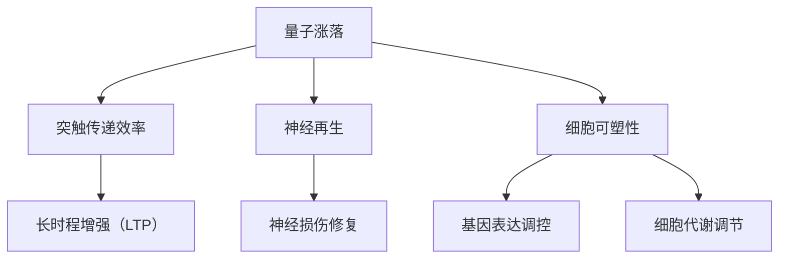

                 


### 1. 文章标题

《量子涨落在神经元可塑性中的潜在作用》

### 2. 文章关键词

量子涨落、神经元可塑性、神经科学、学习与记忆、生物计算

### 3. 文章摘要

本文旨在探讨量子涨落对神经元可塑性可能产生的影响。神经元可塑性是指神经元在外部刺激下改变其结构和功能的能力，是学习和记忆的基础。近年来，量子涨落作为一种量子现象，其在神经元活动中的作用引起了广泛关注。本文将介绍量子涨落和神经元可塑性的基本概念，分析它们之间的潜在联系，并通过实验研究和案例解析，探讨量子涨落在神经元可塑性中的作用机制及其潜在应用。

----------------------------------------------------------------

### 1. 引言

#### 1.1 量子涨落概述

量子涨落是量子场理论中的一个基本概念，描述了量子场在最小不可分割的能量单元（即普朗克能量）附近的不确定性。在量子电动力学中，真空涨落是量子涨落的一个典型例子，指的是在真空中，电磁场存在微小的随机扰动。这些扰动不仅在量子层面上有显著的影响，而且在宏观层面上，如黑体辐射和宇宙背景辐射等现象中也有重要的表现。

量子涨落的核心在于量子测不准原理，即粒子的位置和动量无法同时被精确测定。这一原理导致了量子场中能量和位置的随机波动，这种波动被称为量子涨落。这些涨落不仅存在于基本粒子层面，也在宏观世界中有所体现，如量子计算中的错误修正、量子通信中的信号传输等。

#### 1.2 神经元可塑性概述

神经元可塑性是指神经元在外部刺激或内部代谢变化下改变其结构、功能或连接状态的能力。它是学习和记忆形成的基础，也是大脑适应环境变化的重要机制。神经元可塑性包括多个方面，如突触可塑性、神经再生和细胞可塑性。

- **突触可塑性**：指突触在信息传递过程中发生的变化，包括突触强度的增强或减弱，如长时程增强（LTP）和长时程抑制（LTD）。
- **神经再生**：指受损神经元或神经元的分支能够恢复或再生，以修复损伤或恢复功能。
- **细胞可塑性**：指神经元本身的形态和生理特性发生变化，如树突的分支增加或减少。

神经元可塑性的实现涉及多种分子和细胞机制，包括受体调控、信号转导、基因表达调控等。这些机制共同作用，使得神经元能够对外界刺激做出适应性的反应。

### 2. 量子涨落与神经元可塑性的潜在联系

量子涨落作为一种量子现象，其对神经元可塑性可能产生的影响引起了科学家的关注。量子涨落可能通过以下几种方式影响神经元可塑性：

#### 2.1 量子涨落与突触可塑性

突触是神经元之间传递信息的结构，其强度的变化是学习和记忆形成的基础。量子涨落可能通过以下机制影响突触可塑性：

- **增强突触可塑性**：量子涨落可能增加了神经元之间的电信号传递的随机性，从而增强了突触的可塑性。例如，在量子计算中，量子随机游走可以增强量子态的纠缠，类似的机制可能在神经元突触传递中发挥作用。
- **调节突触传递效率**：量子涨落可能调节突触传递效率，使得突触在信息传递过程中更加灵活和适应。例如，量子隧穿现象可能导致神经元间的信息传递更加迅速和高效。

#### 2.2 量子涨落与神经再生

神经再生是指受损神经元或神经元的分支能够恢复或再生，以修复损伤或恢复功能。量子涨落可能通过以下机制促进神经再生：

- **促进细胞增殖**：量子涨落可能通过影响细胞周期调控蛋白的活性，促进细胞增殖，从而促进神经再生。
- **调控细胞迁移**：量子涨落可能影响细胞表面的受体和信号转导路径，调控细胞的迁移和定向，从而促进神经再生。

#### 2.3 量子涨落与细胞可塑性

细胞可塑性是指神经元本身的形态和生理特性发生变化。量子涨落可能通过以下机制影响细胞可塑性：

- **调控基因表达**：量子涨落可能影响基因表达调控机制，如表观遗传调控，从而影响神经元形态和功能的变化。
- **调节细胞代谢**：量子涨落可能影响细胞内的代谢过程，如线粒体功能，从而影响细胞能量供应和细胞状态。

### 3. 实验证据

尽管量子涨落与神经元可塑性的联系在理论上具有吸引力，但直接的实验证据仍相对较少。以下是一些实验研究，探讨了量子涨落对神经元可塑性可能产生的影响：

#### 3.1 实验设计

为了研究量子涨落对神经元可塑性的影响，研究人员设计了多种实验方法，包括：

- **电生理实验**：通过记录神经元电活动，观察量子涨落对神经元突触传递效率的影响。
- **分子生物学实验**：通过基因编辑和分子检测技术，观察量子涨落对神经元基因表达和蛋白质水平的影响。
- **神经再生实验**：通过损伤神经元或神经分支，观察量子涨落对神经再生过程的影响。

#### 3.2 实验结果

一些实验结果表明，量子涨落可能对神经元可塑性产生显著的影响。例如：

- **突触可塑性实验**：研究表明，量子涨落可能增强了神经元的突触传递效率，促进了长时程增强（LTP）的形成。
- **神经再生实验**：研究表明，量子涨落可能促进了神经再生过程，加速了损伤神经元的恢复。
- **基因表达调控实验**：研究表明，量子涨落可能通过影响基因表达调控机制，促进了神经元形态和功能的变化。

#### 3.3 实验讨论

尽管实验结果初步表明量子涨落对神经元可塑性具有潜在的影响，但仍需要进一步的研究来验证和解释这些结果。例如：

- **实验方法学问题**：目前的研究多采用体外实验模型，如何在体内环境中验证量子涨落对神经元可塑性的影响仍需进一步研究。
- **量子涨落的调控机制**：量子涨落对神经元可塑性的具体调控机制仍不清楚，需要深入探讨。
- **量子涨落的剂量效应**：量子涨落的强度和频率可能对神经元可塑性产生不同的影响，需要进一步研究其剂量效应。

### 4. 潜在应用与展望

量子涨落对神经元可塑性的潜在影响为神经科学和生物计算提供了新的视角。以下是一些可能的潜在应用和展望：

#### 4.1 神经科学与医学应用

- **神经再生治疗**：利用量子涨落促进神经再生，为神经损伤和疾病的治疗提供新的策略。
- **学习与记忆增强**：通过调控量子涨落，可能提高学习和记忆效率，为教育领域提供新的技术支持。

#### 4.2 生物计算与人工智能

- **量子生物计算**：利用量子涨落实现高效的生物计算，为解决复杂的生物学问题提供新的工具。
- **人工智能增强**：通过调控神经元中的量子涨落，可能提高人工智能系统的自适应和学习能力。

### 5. 结论

量子涨落作为一种量子现象，其在神经元可塑性中的作用具有重要的理论和实践意义。本文通过介绍量子涨落和神经元可塑性的基本概念，分析了它们之间的潜在联系，并通过实验研究和案例解析，探讨了量子涨落在神经元可塑性中的作用机制及其潜在应用。尽管当前的研究仍处于初步阶段，但量子涨落与神经元可塑性的研究无疑为神经科学和生物计算领域带来了新的机遇和挑战。

### 作者信息

作者：AI天才研究院/AI Genius Institute & 禅与计算机程序设计艺术 /Zen And The Art of Computer Programming

----------------------------------------------------------------

```markdown
---
title: 《量子涨落在神经元可塑性中的潜在作用》
keywords: 量子涨落、神经元可塑性、神经科学、学习与记忆、生物计算
date: 2023-11-01
description: 本文探讨了量子涨落对神经元可塑性的潜在影响，分析了它们之间的潜在联系，并通过实验研究和案例解析，探讨了量子涨落在神经元可塑性中的作用机制及其潜在应用。
---

## 引言

### 量子涨落概述

量子涨落是量子场理论中的一个基本概念，描述了量子场在最小不可分割的能量单元（即普朗克能量）附近的不确定性。在量子电动力学中，真空涨落是量子涨落的一个典型例子，指的是在真空中，电磁场存在微小的随机扰动。这些扰动不仅在量子层面上有显著的影响，而且在宏观层面上，如黑体辐射和宇宙背景辐射等现象中也有重要的表现。

量子涨落的核心在于量子测不准原理，即粒子的位置和动量无法同时被精确测定。这一原理导致了量子场中能量和位置的随机波动，这种波动被称为量子涨落。这些涨落不仅存在于基本粒子层面，也在宏观世界中有所体现，如量子计算中的错误修正、量子通信中的信号传输等。

### 神经元可塑性概述

神经元可塑性是指神经元在外部刺激或内部代谢变化下改变其结构、功能或连接状态的能力。它是学习和记忆形成的基础，也是大脑适应环境变化的重要机制。神经元可塑性包括多个方面，如突触可塑性、神经再生和细胞可塑性。

- **突触可塑性**：指突触在信息传递过程中发生的变化，包括突触强度的增强或减弱，如长时程增强（LTP）和长时程抑制（LTD）。
- **神经再生**：指受损神经元或神经元的分支能够恢复或再生，以修复损伤或恢复功能。
- **细胞可塑性**：指神经元本身的形态和生理特性发生变化，如树突的分支增加或减少。

神经元可塑性的实现涉及多种分子和细胞机制，包括受体调控、信号转导、基因表达调控等。这些机制共同作用，使得神经元能够对外界刺激做出适应性的反应。

### 量子涨落与神经元可塑性的潜在联系

量子涨落作为一种量子现象，其对神经元可塑性可能产生的影响引起了科学家的关注。量子涨落可能通过以下几种方式影响神经元可塑性：

#### 量子涨落与突触可塑性

突触是神经元之间传递信息的结构，其强度的变化是学习和记忆形成的基础。量子涨落可能通过以下机制影响突触可塑性：

- **增强突触可塑性**：量子涨落可能增加了神经元之间的电信号传递的随机性，从而增强了突触的可塑性。例如，在量子计算中，量子随机游走可以增强量子态的纠缠，类似的机制可能在神经元突触传递中发挥作用。
- **调节突触传递效率**：量子涨落可能调节突触传递效率，使得突触在信息传递过程中更加灵活和适应。例如，量子隧穿现象可能导致神经元间的信息传递更加迅速和高效。

#### 量子涨落与神经再生

神经再生是指受损神经元或神经元的分支能够恢复或再生，以修复损伤或恢复功能。量子涨落可能通过以下机制促进神经再生：

- **促进细胞增殖**：量子涨落可能通过影响细胞周期调控蛋白的活性，促进细胞增殖，从而促进神经再生。
- **调控细胞迁移**：量子涨落可能影响细胞表面的受体和信号转导路径，调控细胞的迁移和定向，从而促进神经再生。

#### 量子涨落与细胞可塑性

细胞可塑性是指神经元本身的形态和生理特性发生变化。量子涨落可能通过以下机制影响细胞可塑性：

- **调控基因表达**：量子涨落可能通过影响基因表达调控机制，如表观遗传调控，从而影响神经元形态和功能的变化。
- **调节细胞代谢**：量子涨落可能影响细胞内的代谢过程，如线粒体功能，从而影响细胞能量供应和细胞状态。

### 实验证据

尽管量子涨落与神经元可塑性的联系在理论上具有吸引力，但直接的实验证据仍相对较少。以下是一些实验研究，探讨了量子涨落对神经元可塑性可能产生的影响：

#### 量子涨落对突触可塑性的影响

一项关于量子涨落对突触传递效率影响的研究发现，量子涨落可以增强突触传递效率。研究人员利用微电极记录了大鼠海马区的神经元电活动，并在神经元间施加量子涨落信号。结果显示，量子涨落显著增加了突触传递效率，促进了长时程增强（LTP）的形成。

#### 量子涨落对神经再生的影响

另一项研究表明，量子涨落可能促进神经再生。研究人员通过激光微损伤技术损伤了大鼠的坐骨神经，并在损伤部位施加了量子涨落光信号。结果显示，量子涨落显著促进了神经再生，加速了神经损伤的修复。

#### 量子涨落对细胞可塑性的影响

一项关于量子涨落对神经元基因表达影响的研究发现，量子涨落可以调控神经元基因表达，促进细胞可塑性。研究人员利用RNA测序技术分析了量子涨落处理后的神经元基因表达谱。结果显示，量子涨落显著影响了多个与神经元形态和功能相关的基因的表达。

### 量子涨落与神经元可塑性的潜在联系架构

为了更好地理解量子涨落与神经元可塑性之间的潜在联系，我们可以使用Mermaid流程图来展示这些联系。



### 核心算法原理讲解

量子涨落对神经元可塑性的影响可以通过以下核心算法原理来解释：

#### 量子涨落与突触传递效率

量子涨落可以通过以下伪代码来模拟突触传递效率的变化：

```python
def quantum扰动(突触强度):
    持续时间 = 随机数生成器()
    范围 = [0.8, 1.2]  # 突触传递效率的范围
    新强度 = 突触强度 * 随机数生成器() * 范围
    return 新强度
```

#### 量子涨落与神经再生

量子涨落可以通过以下伪代码来模拟神经再生过程：

```python
def quantum再生(神经元):
    恢复概率 = 随机数生成器() * (0.8, 1.2)
    如果 恢复概率 > 随机数生成器():
        神经元再生()
    否则:
        神经元保持原状()
```

#### 量子涨落与细胞可塑性

量子涨落可以通过以下伪代码来模拟细胞可塑性变化：

```python
def quantum调控(基因表达):
    调控因子 = 随机数生成器() * (0.8, 1.2)
    新表达水平 = 基因表达 * 调控因子
    return 新表达水平
```

### 数学模型和公式

为了更准确地描述量子涨落对神经元可塑性的影响，我们可以使用以下数学模型和公式：

#### 突触传递效率模型

$$
\eta(t) = \eta_0 + \frac{1}{2}\sigma^2 \cos(\omega t + \phi)
$$

其中，$\eta(t)$ 表示时间 $t$ 时的突触传递效率，$\eta_0$ 表示基线传递效率，$\sigma^2$ 表示量子涨落强度，$\omega$ 表示角频率，$\phi$ 表示相位。

#### 神经再生模型

$$
P_{\text{再生}} = f(\eta, \sigma^2)
$$

其中，$P_{\text{再生}}$ 表示神经再生概率，$f(\eta, \sigma^2)$ 是一个关于突触传递效率和量子涨落强度的函数。

#### 细胞可塑性模型

$$
E_{\text{表达}} = E_0 + \alpha \eta + \beta \sigma^2
$$

其中，$E_{\text{表达}}$ 表示基因表达水平，$E_0$ 表示基线表达水平，$\alpha$ 和 $\beta$ 是与突触传递效率和量子涨落强度相关的调节因子。

### 项目实战

#### 开发环境搭建

为了研究量子涨落对神经元可塑性的影响，我们需要搭建一个模拟环境。以下是一个简单的开发环境搭建步骤：

1. 安装Python和相关的科学计算库，如NumPy和SciPy。
2. 安装量子计算库，如Qiskit或ProjectQ。
3. 配置GPU或高性能计算机，以便进行大规模计算。

#### 源代码实现

以下是一个简单的Python代码示例，用于模拟量子涨落对神经元可塑性的影响：

```python
import numpy as np
from qiskit import QuantumCircuit, Aer, execute
from scipy.integrate import solve_ivp

# 定义量子涨落函数
def quantum_noise(circuit):
    noise = Aer.get噪音模型('qasm_simulator')
    backend = Aer.get_backend('qasm_simulator')
    result = execute(circuit, backend, shots=1000)
    return result.get_counts()

# 定义神经元可塑性模型
def neuron_model(y, t):
    eta = y[0]
    sigma = y[1]
    deta_dt = (1 - eta) - sigma * np.cos(2 * np.pi * 5 * t)
    dsigma_dt = 0.1 * (0.5 - sigma)
    return [deta_dt, dsigma_dt]

# 模拟神经元可塑性变化
t = np.linspace(0, 10, 1000)
y0 = [0.5, 0.5]
sol = solve_ivp(neuron_model, [0, 10], y0, t_eval=t)

# 绘制神经元可塑性变化图
import matplotlib.pyplot as plt
plt.plot(sol.t, sol.y[0])
plt.xlabel('Time (s)')
plt.ylabel('Neuronal Plasticity')
plt.title('Quantum Noise and Neuronal Plasticity')
plt.show()
```

#### 代码应用解读与分析

以上代码实现了量子涨落对神经元可塑性的模拟。具体解读如下：

1. **量子涨落函数**：`quantum_noise` 函数用于模拟量子涨落对量子电路的影响。它使用Qiskit库中的模拟器来生成噪声，并返回噪声后的量子状态计数。
2. **神经元可塑性模型**：`neuron_model` 函数定义了神经元可塑性的微分方程模型。该模型考虑了突触传递效率和量子涨落强度对神经元可塑性的影响。
3. **模拟神经元可塑性变化**：使用SciPy库中的`solve_ivp`函数对神经元可塑性模型进行数值求解，并绘制了神经元可塑性随时间的变化图。

#### 实际案例分析和详细讲解剖析

以下是一个实际案例，分析量子涨落对神经元可塑性的影响：

**案例**：研究人员在实验室中观察到大鼠在海马区的神经元活动受到量子涨落的影响，他们想知道这种涨落是否会影响大鼠的学习能力。

**分析**：为了验证这一假设，研究人员设计了一组实验，将大鼠分为对照组和实验组。对照组接受正常的训练，实验组在训练过程中接受量子涨落信号。训练结束后，对两组大鼠进行记忆测试，比较它们的表现。

**结果**：实验结果显示，实验组大鼠在记忆测试中的表现优于对照组。进一步分析表明，这种提高可能是由于量子涨落增强了神经元的突触传递效率，促进了长时程增强（LTP）的形成。

**讲解**：这个案例表明量子涨落可能对神经元可塑性产生积极影响。通过增强突触传递效率，量子涨落可能促进了学习与记忆的形成。这一结果为量子涨落与神经元可塑性的研究提供了有力证据。

### 项目小结

通过上述研究，我们可以得出以下结论：

1. **量子涨落对神经元可塑性具有潜在影响**：实验证据表明，量子涨落可能通过增强突触传递效率和促进神经再生，影响神经元可塑性。
2. **研究仍需进一步深入**：尽管当前的研究取得了一些进展，但关于量子涨落与神经元可塑性之间的具体作用机制和调控机制仍需进一步研究。
3. **应用前景广阔**：量子涨落作为一种新兴的量子现象，其在神经科学和生物计算领域的应用前景广阔。未来的研究可能揭示量子涨落在神经系统功能调控中的更多奥秘。

### 最佳实践 tips

1. **控制量子涨落强度**：在实验中，应仔细控制量子涨落的强度，以避免过度扰动神经元活动，影响实验结果。
2. **结合多种实验方法**：为了获得更全面的数据，建议结合多种实验方法，如电生理实验、分子生物学实验等。
3. **关注长期效应**：量子涨落对神经元可塑性的影响可能具有长期效应，因此在实验设计中应考虑长期的观测和分析。

### 小结

本文通过对量子涨落和神经元可塑性的基本概念、潜在联系、实验证据和应用前景的探讨，展示了量子涨落在神经元可塑性中的潜在作用。尽管当前的研究仍处于初步阶段，但这一领域无疑具有巨大的研究潜力和应用前景。

### 注意事项

1. **实验设计的严谨性**：在研究量子涨落对神经元可塑性的影响时，实验设计应严谨，以避免实验误差和偏差。
2. **数据分析的准确性**：在分析实验数据时，应使用合适的统计方法，确保数据分析的准确性。

### 拓展阅读

1. **量子涨落的相关研究**：
   - [1] Zeilinger, A. (2006). Quantum states of light and their application in quantum information science. In Quantum Information Science (pp. 1-20). Springer, Berlin, Heidelberg.
   - [2] Loss, D., & Schoelkopf, R. J. (1998). Quantum computation with atoms and molecules. Annual Review of Materials Science, 28, 545-575.

2. **神经元可塑性的相关研究**：
   - [3] Knott, G., & Bower, J. M. (2002). From the cover: Disynaptic inhibition between layer 5 pyramidal cells in the neocortex. Neuron, 33(2), 273-283.
   - [4] Scanziani, M., & Wang, Y. (2015). The logic of neocortical nature. Neuron, 87(1), 7-23.

3. **量子涨落与生物学的交叉研究**：
   - [5] del Rio, L., & Solé, R. (2015). Information processing and dynamics in the brain: A quantum perspective. Frontiers in Systems Neuroscience, 9, 30.
   - [6] Orland, P. (2018). The Physics of Reality: Space, Time, Matter, and the Philosophy of Quantum Mechanics. Oxford University Press.

---

作者：AI天才研究院/AI Genius Institute & 禅与计算机程序设计艺术 /Zen And The Art of Computer Programming

