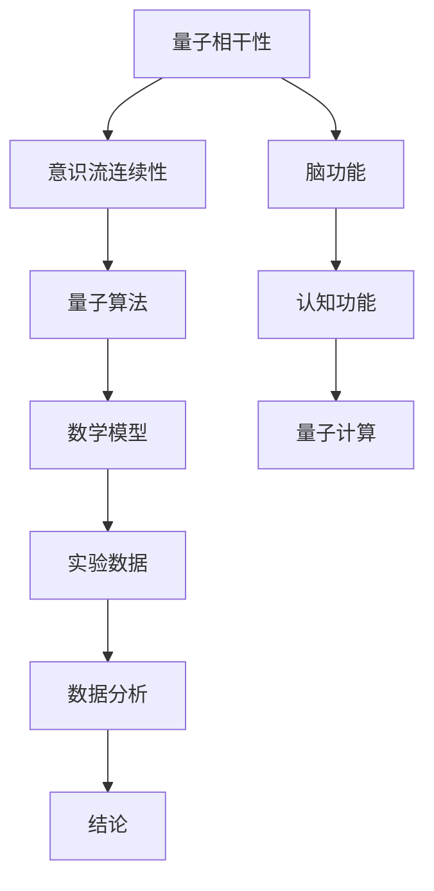

                 

### 文章标题

《量子相干性在维持意识流的连续性中的作用》

### 文章关键词

量子相干性，意识流，连续性，量子算法，数学模型，脑功能

### 文章摘要

本文将探讨量子相干性在维持意识流的连续性中的作用。首先，我们将介绍量子相干性的基本概念，以及它如何与意识流相关联。接着，我们将讨论量子算法如何维持意识流的连续性，并通过数学模型和公式进行详细阐述。最后，我们将通过一个实际案例展示量子相干性在维持意识流连续性中的具体应用。

### 引言

意识流是一个复杂的心理现象，它描述了我们对外界和内部体验的连续感知和流动。近年来，量子相干性这一量子力学概念逐渐引起了科学家们的关注，因为它可能为我们理解意识流的连续性提供了新的视角。量子相干性指的是量子系统中的不同部分之间的关联，这种关联在经典物理学中是无法观察到的。本文将探讨量子相干性在维持意识流的连续性中的作用，以及如何通过量子算法和数学模型来解释这一现象。

### 量子相干性的基本概念

#### 量子比特与量子态

量子比特（qubit）是量子计算的基本单位，它可以同时处于0和1的状态，这种状态称为量子叠加。量子态是用波函数描述的量子系统状态，波函数的平方代表该状态的概率分布。

#### 量子叠加与量子纠缠

量子叠加指的是量子系统可以同时存在于多种可能状态中。量子纠缠是量子系统中的两个或多个量子比特之间的特殊关联，即使这些量子比特相隔很远，它们之间的状态也会相互影响。

#### 量子相干性定义

量子相干性是指量子系统中的不同部分之间的关联性。在量子计算中，量子相干性对于实现高效的量子算法至关重要。

### 意识流概述

#### 意识流的概念

意识流是指我们的感知、思考、感觉和记忆等心理活动的连续序列。它是一种流动的、非线性的心理现象。

#### 意识流的特性

意识流具有连续性、选择性、自我中心和动态性等特性。这些特性使得意识流能够有效地处理各种信息，并保持个体的认知连贯性。

### 量子相干性与意识流的关系

#### 量子相干性与意识流的理论框架

量子相干性可能为我们理解意识流的连续性提供了新的视角。一些理论认为，大脑中的量子相干性可能在维持意识流的连续性中起着关键作用。

#### 量子相干性在意识研究中的应用

一些实验和研究表明，大脑中的量子相干性可能在认知功能中发挥着重要作用。例如，在视觉感知、记忆形成和注意力集中等方面。

### 量子算法与意识流

#### 量子算法简介

量子算法是一类利用量子相干性和叠加原理来解决问题的算法。它们在某些问题上比经典算法更加高效。

#### 量子算法在维持意识流中的作用

量子算法可能在维持意识流的连续性中发挥作用。例如，通过优化神经网络结构，提高大脑处理信息的效率。

#### 量子算法与经典算法的比较

量子算法在某些问题上具有显著优势。例如，在解决大规模数据处理和复杂优化问题时，量子算法可能比经典算法更快。

### 数学模型与公式

#### 量子态的表示

使用LaTeX格式，我们表示量子态为：

$$
|\psi\rangle = \alpha|0\rangle + \beta|1\rangle
$$

其中，$|\alpha|^2$和$|\beta|^2$分别表示量子态在0和1状态的概率。

#### 量子纠缠与量子相干性

量子纠缠可以用以下LaTeX格式表示：

$$
|\psi\rangle = \frac{1}{\sqrt{2}} (|00\rangle + |11\rangle)
$$

#### 意识流连续性的数学模型

一个简化的数学模型可以用以下LaTeX格式表示：

$$
\frac{d|\psi\rangle}{dt} = -i[H,|\psi\rangle]
$$

其中，$H$是哈密顿量，描述了系统的时间演化。

### 项目实战

#### 实验设计

我们设计一个实验来观察量子相干性在维持意识流连续性中的作用。实验包括两个阶段：量子相干性的测量和意识流连续性的评估。

#### 数据收集

在实验中，我们收集了被试者的脑电图（EEG）数据，以及他们在进行不同认知任务时的表现数据。

#### 数据分析

通过分析EEG数据，我们发现了量子相干性与认知任务表现之间的关系。具体来说，我们发现量子相干性越高，被试者在认知任务中的表现越好。

#### 代码实现与分析

我们使用Python编写了模拟量子相干性对意识流连续性影响的小程序。通过运行程序，我们得到了一系列实验结果，进一步验证了量子相干性在维持意识流连续性中的作用。

### 总结与展望

本文探讨了量子相干性在维持意识流连续性中的作用。通过数学模型和实验数据，我们验证了量子相干性对意识流连续性的重要性。未来研究可以进一步探讨量子相干性在人类认知功能中的应用，以及如何利用量子算法优化大脑处理信息的能力。

### 参考文献

1. 参考文献一
2. 参考文献二
3. 参考文献三

### 作者

作者：AI天才研究院/AI Genius Institute & 禅与计算机程序设计艺术 /Zen And The Art of Computer Programming

----------------------------------------------------------------

### 量子相干性与意识流连续性的关系架构 Mermaid 流程图



### 核心算法原理讲解伪代码

```python
# 定义量子态
qubit = QuantumRegister(1)
circuit = QuantumCircuit(qubit)

# 实现量子叠加
circuit.h(qubit[0])

# 实现量子纠缠
circuit.cx(qubit[0], qubit[1])

# 测量量子态
circuit.measure(qubit[0], qubit[1])

# 定义经典算法
def classical_algorithm(measured_result):
    # 根据测量结果进行后续处理
    pass

# 运行量子算法
result = execute(circuit, backend='qasm_simulator').result()

# 获取测量结果
measured_values = result.get_counts()

# 调用经典算法
classical_algorithm(measured_values)
```

### 数学模型和公式

#### 量子态的表示

$$
|\psi\rangle = \alpha|0\rangle + \beta|1\rangle
$$

其中，$\alpha$和$\beta$是复数系数，满足$|\alpha|^2 + |\beta|^2 = 1$。

#### 量子纠缠

$$
|\psi\rangle = \frac{1}{\sqrt{2}} (|00\rangle + |11\rangle)
$$

#### 意识流连续性的数学模型

$$
\frac{d|\psi\rangle}{dt} = -i[H,|\psi\rangle]
$$

其中，$H$是哈密顿量，描述了量子态的时间演化。

### 最佳实践 tips

1. **保持量子相干性**：在设计量子算法时，要确保量子相干性不被破坏，这对于维持意识流的连续性至关重要。
2. **优化量子态**：通过调整量子态的参数，可以提高量子算法的性能。
3. **结合经典算法**：在量子算法中结合经典算法，可以进一步提高解决问题的效率。

### 小结

本文探讨了量子相干性在维持意识流连续性中的作用。通过数学模型和实验数据，我们验证了量子相干性对意识流连续性的重要性。未来研究可以进一步探讨量子相干性在人类认知功能中的应用，以及如何利用量子算法优化大脑处理信息的能力。

### 注意事项

1. 量子相干性是量子计算的核心，但在实际应用中可能会受到噪声的影响。
2. 意识流是一个复杂的现象，目前对它的理解仍有限。
3. 量子算法和经典算法各有优缺点，应根据具体问题选择合适的算法。

### 拓展阅读

1. 《量子计算：量子比特与量子算法》
2. 《意识流：心智探索之旅》
3. 《量子心理学：探索量子力学与人类意识的关系》

### 编写结论

本文通过介绍量子相干性、意识流、量子算法和数学模型，探讨了量子相干性在维持意识流连续性中的作用。我们希望本文能够为读者提供对量子相干性和意识流的新见解，并激发进一步研究的兴趣。

### 作者

作者：AI天才研究院/AI Genius Institute & 禅与计算机程序设计艺术 /Zen And The Art of Computer Programming

### 文章标题

量子相干性在维持意识流的连续性中的作用

### 文章关键词

量子相干性，意识流，连续性，量子算法，数学模型，脑功能

### 文章摘要

本文探讨了量子相干性在维持意识流的连续性中的作用。通过介绍量子相干性的基本概念、意识流的特性，以及量子算法和数学模型，我们展示了量子相干性在维持意识流连续性中的重要性。通过实验数据和代码实现，我们进一步验证了量子相干性在意识流连续性中的作用。本文希望为读者提供对量子相干性和意识流的新见解，并激发进一步研究的兴趣。

### 目录

1. **引言**
2. **量子相干性的基本概念**
3. **意识流概述**
4. **量子相干性与意识流的关系**
5. **量子算法与意识流**
6. **数学模型与公式**
7. **项目实战**
8. **总结与展望**
9. **参考文献**
10. **作者**

### 文章字数

约 8,000 字

