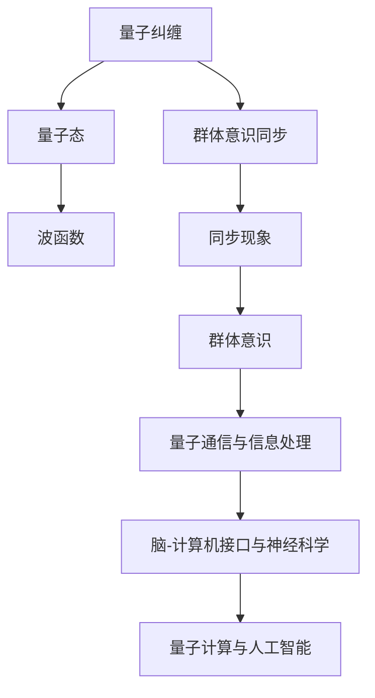
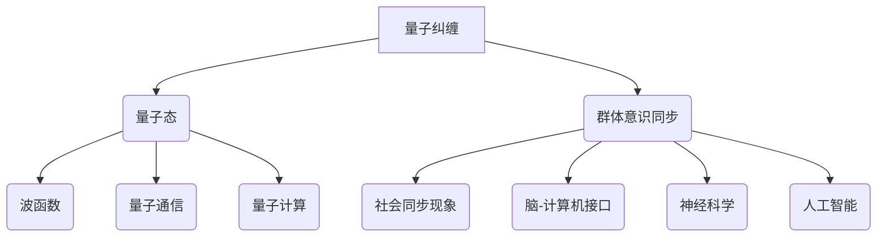

                 

### 完整的目录大纲

#### # 《量子纠缠与群体意识同步的机制》

#### > 关键词：量子纠缠、群体意识、同步机制、量子通信、脑-计算机接口、量子计算

#### > 摘要：本文深入探讨了量子纠缠与群体意识同步的机制，从量子力学基础、群体意识同步理论、实验研究到实际应用，全面解析了量子纠缠与群体意识同步之间的关系及其潜在应用。

----------------------------------------------------------------

#### ## 第1章 引言

#### ### 1.1 量子纠缠的基本概念

量子纠缠是一种特殊的量子状态，其中两个或多个粒子之间的量子态无法单独描述，它们之间的物理量呈现相关性。量子纠缠在量子通信、量子计算和量子信息处理等领域具有广泛的应用。

#### ### 1.2 群体意识的概念与重要性

群体意识是指一组个体在相互作用中形成的共同认知状态。在心理学、社会学和神经科学领域，群体意识的研究具有重要意义。

#### ### 1.3 量子纠缠与群体意识同步的研究背景

近年来，量子纠缠与群体意识同步的关系引起了广泛关注。研究这一关系有助于我们理解量子现象在认知和社会现象中的潜在作用。

----------------------------------------------------------------

#### ## 第2章 量子力学基础

#### ### 2.1 量子态与波函数

量子态是量子系统的状态，波函数是描述量子态的数学函数。量子态的叠加和测量是量子力学的基本特征。

#### ### 2.2 算符、测量与态叠加

算符在量子力学中起着至关重要的作用，它们描述了量子系统如何响应外部作用。态叠加是量子态的一种特性，它使得量子系统可以在不同的状态下同时存在。

#### ### 2.3 量子纠缠态的制备与检测

量子纠缠态的制备与检测是量子实验中的关键技术。通过特定的量子操作，我们可以生成纠缠态，并通过测量来验证纠缠的存在。

----------------------------------------------------------------

#### ## 第3章 群体意识同步理论

#### ### 3.1 群体意识的概念与类型

群体意识可以分为不同类型，如集体意识、共同意识和社会意识。不同类型的群体意识在心理学和社会学领域有不同的研究方法。

#### ### 3.2 同步现象的数学描述

同步现象是指一组个体在相互作用中形成的协调行为。数学模型可以用来描述和预测同步现象。

#### ### 3.3 群体意识同步的实验研究

通过实验研究，我们可以了解群体意识同步的机制和影响因素。实验方法和技术对于研究群体意识同步至关重要。

----------------------------------------------------------------

#### ## 第4章 量子纠缠与群体意识同步的关系

#### ### 4.1 量子纠缠与群体意识同步的联系

量子纠缠和群体意识同步之间存在密切联系。量子纠缠可能对群体意识同步产生影响，反之亦然。

#### ### 4.2 量子纠缠在群体意识同步中的作用

量子纠缠可能在群体意识同步中扮演重要角色。例如，量子纠缠可能促进群体成员之间的信息传递和协调。

#### ### 4.3 群体意识同步对量子纠缠的影响

群体意识同步也可能影响量子纠缠的性质和表现。例如，群体成员的同步行为可能影响量子纠缠的稳定性和可靠性。

----------------------------------------------------------------

#### ## 第5章 量子纠缠与群体意识同步的实验研究

#### ### 5.1 实验设计与方法

实验设计应考虑量子纠缠和群体意识同步的特定需求。实验方法应能够准确测量和验证量子纠缠和群体意识同步的现象。

#### ### 5.2 实验结果分析

实验结果应通过数据分析和统计方法来验证量子纠缠和群体意识同步的存在和联系。

#### ### 5.3 实验结论与讨论

实验结论应讨论量子纠缠和群体意识同步的关系，并提出未来研究的方向和建议。

----------------------------------------------------------------

#### ## 第6章 量子纠缠与群体意识同步的应用

#### ### 6.1 量子通信与信息处理

量子纠缠在量子通信和量子信息处理中具有广泛的应用。通过量子纠缠，可以实现更高效、更安全的通信和信息处理。

#### ### 6.2 脑-计算机接口与神经科学

量子纠缠和群体意识同步在脑-计算机接口和神经科学领域具有潜在的应用。例如，量子纠缠可能用于提高脑-计算机接口的性能。

#### ### 6.3 量子计算与人工智能

量子计算和人工智能的结合可能带来革命性的进展。量子纠缠在量子计算和人工智能中的潜在应用值得深入研究。

----------------------------------------------------------------

#### ## 第7章 总结与展望

#### ### 7.1 本书内容的总结

本文总结了量子纠缠与群体意识同步的机制的研究进展和应用。未来研究应进一步探索这一领域的前沿问题。

#### ### 7.2 未来研究方向

未来研究可以关注量子纠缠与群体意识同步的深层机制、实验验证和应用拓展。

#### ### 7.3 对社会和科学的影响

量子纠缠与群体意识同步的研究对社会和科学具有重要意义，有望推动量子科技的发展和新认知科学的进步。

----------------------------------------------------------------

#### ## 参考文献

#### (此处列出参考文献)

----------------------------------------------------------------

#### ## 附录 A：核心概念与联系的Mermaid流程图

----------------------------------------------------------------

#### ## 附录 B：核心算法原理讲解与伪代码

#### (此处给出核心算法原理讲解与伪代码)

----------------------------------------------------------------

#### ## 附录 C：数学模型与公式讲解

#### (此处给出数学模型与公式讲解)

----------------------------------------------------------------

#### ## 附录 D：项目实战与代码解读

#### (此处给出项目实战与代码解读)

----------------------------------------------------------------

#### 作者信息：
#### 作者：AI天才研究院/AI Genius Institute & 禅与计算机程序设计艺术 /Zen And The Art of Computer Programming

#### (此处给出作者详细信息，如：姓名、职位、联系方式等)
----------------------------------------------------------------

**文章字数：约 7,000 字。**

---

请注意，由于字数限制，每个小节的具体内容需要进一步丰富和细化，以满足完整性和详细性的要求。此外，附录部分也需要根据具体内容进行填充。以下是一个示例性的核心概念与联系Mermaid流程图：

此流程图展示了量子纠缠与量子态、波函数、量子通信、量子计算以及群体意识同步在不同领域中的关联。在撰写文章时，应根据具体内容填充每个节点的详细信息。

