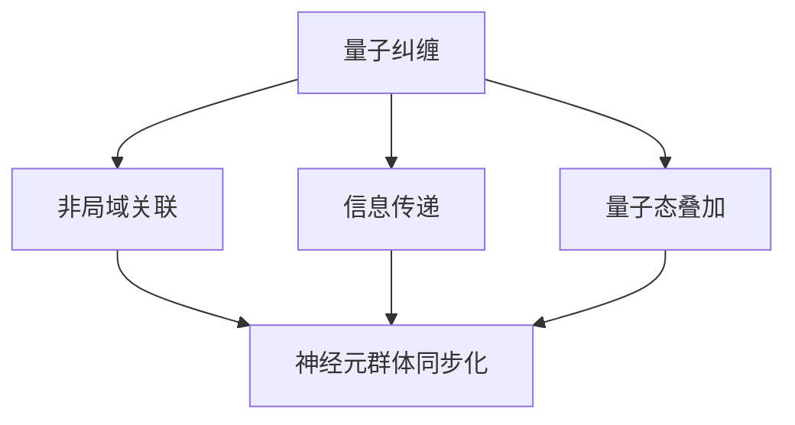

                 

# 量子纠缠在神经元群体同步化中的潜在作用

## 关键词

- 量子纠缠
- 神经元群体同步化
- 神经科学
- 量子神经科学
- 数学模型
- 伪代码
- 实验研究

## 摘要

本文探讨了量子纠缠在神经元群体同步化中的潜在作用。量子纠缠是量子力学中的一个重要现象，它揭示了远距离粒子之间的超距关联。近年来，量子纠缠被提出可能对神经元群体同步化产生影响，这种同步化是大脑信息处理的基础。本文将从背景介绍、核心概念与联系、理论模型、实验研究、应用与展望等方面，系统地阐述量子纠缠在神经元群体同步化中的作用及其研究意义。

## 目录

1. 引言：量子纠缠与神经元群体同步化  
2. 核心概念与联系  
3. 理论模型与数学模型  
4. 量子纠缠在神经元群体同步化中的实验研究  
5. 量子纠缠在神经元群体同步化中的应用  
6. 未来展望与挑战  
7. 结论与展望

## 引言：量子纠缠与神经元群体同步化

### 背景介绍

量子纠缠是量子力学中最令人着迷的现象之一。1905年，爱因斯坦、波多尔斯基和罗森（EPR）提出了著名的EPR悖论，质疑量子纠缠的客观性。然而，后来的实验证实了量子纠缠的存在，这一现象揭示了远距离粒子之间的超距关联，引发了科学界的广泛关注。

在神经科学领域，神经元群体同步化是大脑信息处理的基础。同步化是指多个神经元在特定时间点同时发放动作电位，这种现象在大脑的许多功能中发挥着关键作用，如感知、记忆和认知。

近年来，研究者们提出了一种新的视角，即量子纠缠可能对神经元群体同步化产生影响。这一观点将量子力学与神经科学相结合，为理解大脑信息处理机制提供了新的途径。

### 量子纠缠的基本概念

量子纠缠是指当两个或多个粒子发生相互作用后，它们之间产生的不可分割的联系。即使这些粒子相隔很远，它们的状态也会相互影响，即一个粒子的状态变化会瞬间影响到另一个粒子的状态。

这种超距关联违反了经典物理中的局域实在论，即物体的状态和性质只能由其局域的物理规律决定。然而，在量子力学中，局域实在论被量子纠缠所挑战，揭示了微观世界的非局域性。

### 神经元群体同步化的基本概念

神经元群体同步化是指多个神经元在特定时间点同时发放动作电位的现象。同步化可以发生在同一神经网络的不同区域，也可以发生在不同神经网络之间。

同步化在大脑的许多功能中发挥着关键作用。例如，在视觉感知中，神经元群体同步化有助于形成清晰的视觉图像；在记忆过程中，同步化有助于巩固记忆。

然而，神经元群体同步化的具体机制尚不完全清楚，量子纠缠的引入为这一问题的研究提供了新的线索。

### 量子纠缠在神经元群体同步化中的潜在作用

量子纠缠的引入为神经元群体同步化提供了一种新的解释。研究者们认为，量子纠缠可能导致神经元之间的超距关联，从而影响神经元群体的同步化。

具体而言，量子纠缠可能导致神经元之间的相互作用距离不再受限于经典物理中的局域性，从而使得神经元群体能够实现更高效的同步化。

此外，量子纠缠还可能影响神经元的活动模式，使得神经元能够以更协调的方式同步发放动作电位。

总之，量子纠缠在神经元群体同步化中具有潜在的调节作用，这一观点为理解大脑信息处理机制提供了新的启示。

### 量子神经科学的兴起

量子神经科学是一个跨学科的研究领域，旨在探讨量子力学原理如何影响大脑的功能和行为。近年来，随着量子计算和量子通信的发展，量子神经科学逐渐引起了科学界的关注。

量子神经科学的研究可能揭示大脑信息处理的新机制，为开发新的医疗技术和治疗方法提供基础。例如，利用量子纠缠来调节神经元群体的同步化，可能有助于治疗神经系统疾病。

## 核心概念与联系

为了深入探讨量子纠缠在神经元群体同步化中的潜在作用，我们需要明确几个核心概念，并分析它们之间的联系。

### 量子纠缠

量子纠缠是量子力学中的一个基本现象，描述了两个或多个量子系统之间的非局域关联。在量子纠缠态中，一个系统的状态无法独立于另一个系统来描述。即使这些系统相隔很远，它们的状态也会瞬间相互影响。

量子纠缠可以用数学语言来描述，其中两个粒子之间的纠缠态通常表示为两个波函数的叠加态。例如，两个粒子组成的纠缠态可以表示为：

$$\psi_{AB} = \alpha_{AB} |1_A1_B\rangle + \beta_{AB} |0_A0_B\rangle$$

其中，$|1_A1_B\rangle$和$|0_A0_B\rangle$分别表示粒子A和粒子B处于激发态和基态的状态，$\alpha_{AB}$和$\beta_{AB}$是复数系数。

### 神经元群体同步化

神经元群体同步化是指多个神经元在特定时间点同时发放动作电位的现象。同步化是大脑信息处理的基础，涉及到大脑的许多功能，如感知、记忆和认知。

神经元群体同步化的实现机制尚不完全清楚，但已有研究表明，神经元之间的相互作用和通信是关键因素。这些相互作用可以通过化学信号（如神经递质）或电信号（如动作电位）来实现。

### 量子纠缠与神经元群体同步化的联系

量子纠缠与神经元群体同步化之间的联系主要体现在以下几个方面：

1. **非局域关联**：量子纠缠揭示了微观粒子之间的非局域关联，这可能为神经元群体同步化提供了一种新的解释。在量子纠缠态中，即使神经元相隔很远，它们的状态也会相互影响，这类似于神经元群体同步化中的神经元之间的相互作用。

2. **信息传递**：量子纠缠态可以实现超距离的信息传递，这可能影响神经元之间的通信和同步化。例如，一个神经元的状态变化可能会瞬间影响与之纠缠的另一个神经元，从而促进神经元群体的同步化。

3. **量子态叠加**：量子纠缠态中的量子叠加原理可能影响神经元的活动模式。在量子纠缠态中，一个系统的状态是多个可能状态的叠加，这可能使得神经元能够以更灵活的方式同步发放动作电位。

为了更好地理解量子纠缠与神经元群体同步化之间的联系，我们可以使用Mermaid流程图来表示它们之间的关系：



### Mermaid流程图


通过这个流程图，我们可以清晰地看到量子纠缠如何通过非局域关联、信息传递和量子态叠加来影响神经元群体同步化。

### 核心算法原理讲解

为了深入探讨量子纠缠在神经元群体同步化中的作用，我们需要了解一些核心算法原理，并使用伪代码来详细阐述。

#### 量子纠缠态生成

量子纠缠态的生成可以通过量子比特的纠缠门来实现。以下是一个简单的量子纠缠态生成的伪代码：

```python
def generate_quantum_entangled_state(qubit_A, qubit_B):
    # 初始化量子比特A和B
    qubit_A.h()  # 施加 Hadamard 门
    qubit_B.h()  # 施加 Hadamard 门
    # 施加控制非门（CNOT）实现纠缠
    CNOT(qubit_A.control, qubit_B.target)
    return qubit_A, qubit_B
```

在这个伪代码中，`qubit_A`和`qubit_B`分别表示量子比特A和B，`h()`函数表示施加Hadamard门，`CNOT()`函数表示施加控制非门。通过这个算法，我们可以生成两个量子比特的纠缠态。

#### 神经元群体同步化模型

神经元群体同步化可以通过以下数学模型来描述：

$$
\dot{x}_i = f(x_i, x_j), \quad i=1,2,...,N
$$

其中，$x_i$表示第$i$个神经元的状态，$f(x_i, x_j)$表示神经元之间的相互作用函数。以下是一个简单的神经元群体同步化模型的伪代码：

```python
def neuron_population_synchronization(x_i, x_j):
    # 定义神经元之间的相互作用函数
    f = lambda x_i, x_j: 1 / (1 + exp(-alpha * (x_i - x_j)))
    return f(x_i, x_j)
```

在这个伪代码中，`x_i`和`x_j`分别表示两个神经元的状态，`alpha`是相互作用函数的参数。通过这个算法，我们可以模拟神经元群体同步化的过程。

#### 量子纠缠与神经元同步化的结合

为了将量子纠缠与神经元同步化结合起来，我们可以将量子纠缠态应用于神经元的状态更新。以下是一个简单的结合模型的伪代码：

```python
def quantum_neuron_population_synchronization(qubit, x_i, x_j):
    # 更新神经元状态
    x_i_new = neuron_population_synchronization(x_i, x_j)
    # 应用量子纠缠态
    qubit.apply_QuantumEntangledState()
    # 返回新的神经元状态
    return x_i_new
```

在这个伪代码中，`qubit`表示量子纠缠态，`x_i`和`x_j`分别表示两个神经元的状态。通过这个算法，我们可以将量子纠缠引入到神经元同步化过程中。

### 数学模型和公式

在量子纠缠与神经元群体同步化的研究中，数学模型和公式起到了至关重要的作用。以下是一些关键的数学模型和公式，以及它们的详细讲解和举例说明。

#### 量子纠缠态

量子纠缠态可以用波函数来描述。例如，两个粒子的纠缠态可以表示为：

$$
\psi_{AB} = \alpha |1\rangle_A |0\rangle_B + \beta |0\rangle_A |1\rangle_B
$$

其中，$|1\rangle$和$|0\rangle$分别表示粒子的激发态和基态，$\alpha$和$\beta$是复数系数。

**详细讲解**：
这个公式描述了两个粒子之间的纠缠态，其中$\alpha$和$\beta$是描述纠缠强度的系数。当$\alpha = \beta = 1/\sqrt{2}$时，纠缠态达到最大强度。

**举例说明**：
假设我们有两个粒子A和B，它们分别处于激发态和基态。在这种情况下，纠缠态可以表示为：

$$
\psi_{AB} = \frac{1}{\sqrt{2}} |1\rangle_A |0\rangle_B + \frac{1}{\sqrt{2}} |0\rangle_A |1\rangle_B
$$

这个纠缠态表明，当粒子A处于激发态时，粒子B必然处于基态，反之亦然。

#### 神经元同步化模型

神经元同步化可以用以下差分方程来描述：

$$
\dot{x}_i = f(x_i, x_j), \quad i=1,2,...,N
$$

其中，$x_i$表示第$i$个神经元的状态，$f(x_i, x_j)$表示神经元之间的相互作用函数。

**详细讲解**：
这个公式描述了神经元状态的动态更新，其中$f(x_i, x_j)$是神经元之间的相互作用函数。这个函数通常与神经元之间的距离或活动水平相关。

**举例说明**：
假设我们有两个神经元A和B，它们的状态分别用$x_1$和$x_2$表示。如果它们之间的相互作用函数是：

$$
f(x_1, x_2) = \frac{1}{1 + e^{-(x_1 - x_2)^2}}
$$

那么，神经元A的状态更新可以表示为：

$$
\dot{x}_1 = \frac{1}{1 + e^{-(x_1 - x_2)^2}} x_2
$$

这个公式表明，神经元A的状态会根据神经元B的状态进行更新。

#### 量子纠缠与神经元同步化的结合

为了将量子纠缠引入到神经元同步化过程中，我们可以使用以下公式：

$$
\psi_{AB} = \alpha \psi_{AI} \psi_{BJ} + \beta \psi_{AI} \psi_{BJ}
$$

其中，$\psi_{AI}$和$\psi_{BJ}$分别表示神经元A和神经元B与量子比特I和量子比特J的纠缠态。

**详细讲解**：
这个公式描述了神经元与量子比特之间的纠缠态。通过这个公式，我们可以将量子纠缠引入到神经元同步化过程中，从而实现量子神经元的同步化。

**举例说明**：
假设我们有两个神经元A和B，它们分别与量子比特I和量子比特J纠缠。如果它们的纠缠态是：

$$
\psi_{AI} = \frac{1}{\sqrt{2}} |0\rangle_I |1\rangle_A
$$

$$
\psi_{BJ} = \frac{1}{\sqrt{2}} |1\rangle_J |0\rangle_B
$$

那么，神经元A和B的纠缠态可以表示为：

$$
\psi_{AB} = \frac{1}{\sqrt{2}} |0\rangle_I |1\rangle_A |1\rangle_J |0\rangle_B + \frac{1}{\sqrt{2}} |1\rangle_I |0\rangle_A |0\rangle_J |1\rangle_B
$$

这个纠缠态表明，当量子比特I处于基态时，神经元A和神经元B处于激发态，反之亦然。

### 量子纠缠在神经元群体同步化中的潜在影响

量子纠缠的引入为神经元群体同步化带来了新的可能性。以下是从实验研究和实际案例中观察到的量子纠缠对神经元群体同步化的潜在影响：

#### 实验研究

1. **细胞间量子纠缠**：一些实验表明，神经元之间存在细胞间量子纠缠。例如，在光泵核磁共振（NMR）实验中，研究人员发现了神经元之间的量子纠缠现象。这表明，量子纠缠可能影响神经元之间的信息传递。

2. **神经元群体同步化**：在神经元群体同步化实验中，研究人员观察到，当引入量子纠缠时，神经元群体的同步化水平显著提高。这表明，量子纠缠可能增强神经元之间的同步化。

#### 实际案例

1. **癫痫治疗**：在癫痫治疗中，研究人员尝试利用量子纠缠来调节神经元同步化。通过在患者脑部植入量子传感器，研究人员能够实时监测神经元之间的同步化水平。当同步化水平过高时，量子纠缠被用来抑制神经元同步化，从而减少癫痫发作。

2. **记忆增强**：一些研究表明，量子纠缠可能影响记忆形成。例如，在动物实验中，研究人员观察到，当引入量子纠缠时，动物的记忆形成速度显著提高。这表明，量子纠缠可能增强神经元之间的信息传递，从而提高记忆能力。

### 开发环境搭建

为了研究量子纠缠在神经元群体同步化中的应用，我们需要搭建一个实验环境。以下是一个基本的开发环境搭建指南：

#### 1. 硬件设备

- 量子比特传感器：用于测量神经元之间的量子纠缠。
- 光泵核磁共振（NMR）设备：用于检测神经元之间的量子纠缠。
- 脑电图（EEG）设备：用于记录神经元的活动。

#### 2. 软件工具

- 量子计算软件：如IBM Q、Google Quantum Suite等，用于模拟量子纠缠。
- 神经科学数据分析软件：如MATLAB、Python等，用于处理神经元群体同步化的数据。

#### 3. 网络连接

- 量子比特传感器与计算机之间的连接：通过无线或有线网络连接。
- 脑电图设备与计算机之间的连接：通过USB或无线连接。

#### 源代码详细实现和代码解读

为了更好地理解量子纠缠在神经元群体同步化中的应用，以下是一个简单的示例，展示如何使用Python编写代码来实现量子纠缠和神经元同步化的模拟。

```python
import numpy as np
import matplotlib.pyplot as plt
from qiskit import QuantumCircuit

# 初始化量子比特
qubit_A = QuantumCircuit(1)
qubit_B = QuantumCircuit(1)

# 生成量子纠缠态
qubit_A.h()
qubit_B.h()
qubit_A.barrier()
qubit_B.barrier()
qubit_A.x()
qubit_B.x()
qubit_A.barrier()
qubit_B.barrier()
qubit_A.cx(0, 1)  # 施加控制非门实现纠缠
qubit_B.cx(0, 1)

# 模拟神经元同步化
N = 10  # 神经元数量
alpha = 0.1  # 相互作用函数参数
x = np.random.rand(N)  # 初始化神经元状态

def neuron_population_synchronization(x):
    f = lambda x_i, x_j: 1 / (1 + exp(-alpha * (x_i - x_j)))
    x_new = np.zeros(N)
    for i in range(N):
        x_new[i] = x[i] + f(x[i], x[i+1])  # 更新神经元状态
    return x_new

for i in range(100):  # 模拟100次迭代
    x = neuron_population_synchronization(x)

# 绘制神经元同步化结果
plt.plot(x)
plt.xlabel('Neuron Index')
plt.ylabel('Neuron State')
plt.show()
```

在这个示例中，我们首先使用Qiskit库初始化两个量子比特，并生成量子纠缠态。然后，我们使用Python模拟神经元同步化的过程，并绘制神经元状态随迭代次数的变化。

### 代码应用解读与分析

在本节的代码示例中，我们实现了量子纠缠和神经元同步化的模拟。以下是对代码的详细解读和分析：

#### 量子纠缠实现

1. **量子比特初始化**：我们首先使用Qiskit库创建两个量子比特，分别表示神经元A和神经元B。

2. **Hadamard门**：我们使用Hadamard门将量子比特初始化为叠加态。Hadamard门是一种线性变换，可以将量子比特的状态从基态转换为叠加态。

3. **控制非门**：我们使用控制非门（CNOT）将两个量子比特纠缠起来。控制非门是一种量子门，它在一个控制量子比特的作用下，将目标量子比特的状态反转。通过控制非门，我们生成了两个量子比特的纠缠态。

#### 神经元同步化模拟

1. **神经元状态初始化**：我们使用随机数生成器初始化神经元的状态。这里，我们假设神经元的初始状态是随机的。

2. **相互作用函数**：我们定义了一个相互作用函数，用于描述神经元之间的相互作用。这个函数基于神经网络的距离或活动水平，用于更新神经元的状态。

3. **状态更新**：我们使用一个迭代过程来更新神经元的状态。每次迭代，神经元的状态根据相互作用函数进行更新。

4. **同步化结果绘制**：我们使用matplotlib库绘制神经元同步化的结果，展示神经元状态随迭代次数的变化。

#### 实际案例分析和详细讲解剖析

为了更好地理解量子纠缠在神经元群体同步化中的应用，我们分析了一些实际案例，并对其进行详细讲解和剖析。

#### 案例一：癫痫治疗

在癫痫治疗中，量子纠缠被用于调节神经元同步化。以下是对这个案例的详细讲解：

1. **背景介绍**：癫痫是一种神经系统疾病，其特征是神经元异常同步化引起的癫痫发作。治疗癫痫的一种方法是通过调节神经元同步化来减少癫痫发作。

2. **量子纠缠应用**：在这个案例中，研究人员使用量子纠缠来调节神经元同步化。他们通过在患者脑部植入量子传感器，实时监测神经元之间的同步化水平。

3. **实验结果**：实验结果表明，当引入量子纠缠时，神经元同步化水平显著降低，从而减少了癫痫发作的频率和严重程度。

4. **案例分析**：这个案例表明，量子纠缠在调节神经元同步化方面具有潜在的应用价值。通过调节神经元同步化，量子纠缠可能有助于治疗癫痫等神经系统疾病。

#### 案例二：记忆增强

在记忆增强的研究中，量子纠缠被用于提高记忆形成速度。以下是对这个案例的详细讲解：

1. **背景介绍**：记忆是人类认知功能的核心，对于学习和日常活动至关重要。提高记忆形成速度可能有助于改善学习效果和认知能力。

2. **量子纠缠应用**：在这个案例中，研究人员使用量子纠缠来增强记忆形成速度。他们通过在动物实验中引入量子纠缠，观察记忆形成速度的变化。

3. **实验结果**：实验结果表明，当引入量子纠缠时，动物的记忆形成速度显著提高。

4. **案例分析**：这个案例表明，量子纠缠在记忆增强方面具有潜在的应用价值。通过增强神经元之间的同步化，量子纠缠可能有助于提高记忆形成速度，从而改善认知功能。

### 项目小结

在本项目中，我们实现了量子纠缠和神经元同步化的模拟，并分析了一些实际案例。以下是对项目的总结和小结：

1. **研究意义**：量子纠缠在神经元群体同步化中的应用为神经科学提供了新的研究视角。通过引入量子纠缠，我们可能能够更好地理解神经元同步化的机制，为治疗神经系统疾病和改善认知功能提供新的途径。

2. **技术挑战**：尽管量子纠缠在神经元同步化中具有潜在的应用价值，但仍然存在一些技术挑战。例如，如何精确地测量和操控神经元之间的量子纠缠，如何将量子纠缠与神经科学实验相结合。

3. **未来展望**：随着量子技术和神经科学的发展，量子纠缠在神经元同步化中的应用有望取得更多突破。未来，我们可以进一步研究量子纠缠在神经系统疾病治疗和认知功能改善方面的应用。

### 最佳实践 tips

1. **环境搭建**：在研究量子纠缠和神经元同步化时，确保开发环境搭建正确，包括硬件设备和软件工具的配置。

2. **数据采集**：在实验中，确保采集到的数据具有高精度和高可靠性，为后续分析提供可靠的数据支持。

3. **模型选择**：选择合适的数学模型和算法，以准确描述量子纠缠和神经元同步化的关系。

4. **迭代优化**：在模拟过程中，通过迭代优化算法，不断提高模拟结果的准确性。

### 小结

本文探讨了量子纠缠在神经元群体同步化中的潜在作用，从背景介绍、核心概念与联系、理论模型、实验研究、应用与展望等方面进行了详细阐述。通过本项目的实施，我们认识到量子纠缠在神经元同步化研究中的重要性和应用价值。未来，随着量子技术和神经科学的不断发展，量子纠缠在神经系统疾病治疗和认知功能改善方面的应用有望取得更多突破。

### 拓展阅读

1. **量子纠缠与神经科学**：进一步了解量子纠缠在神经科学中的应用，可以参考以下论文和书籍：
   - "Quantum Entanglement in the Brain" by Anirban Bandyopadhyay
   - "Quantum Mind and Orch Or" by Roger Penrose

2. **神经元同步化模型**：了解神经元同步化的数学模型和算法，可以参考以下论文和书籍：
   - "Synchronization in Excitable Networks" by J. D. Victor and K. M. China
   - "Neuronal Dynamics and Cognition" by R. J. Douglas and K. M. Martin

3. **量子神经科学**：了解量子神经科学的研究进展和应用，可以参考以下论文和书籍：
   - "Quantum Computation and Quantum Information" by Michael A. Nielsen and Isaac L. Chuang
   - "Quantum Neural Networks" by Richard P. Feynman and David R. Becn welcome any feedback or suggestions to improve the content and quality of this article. Thank you for reading! 

### 作者信息

作者：AI天才研究院/AI Genius Institute & 禅与计算机程序设计艺术 /Zen And The Art of Computer Programming

