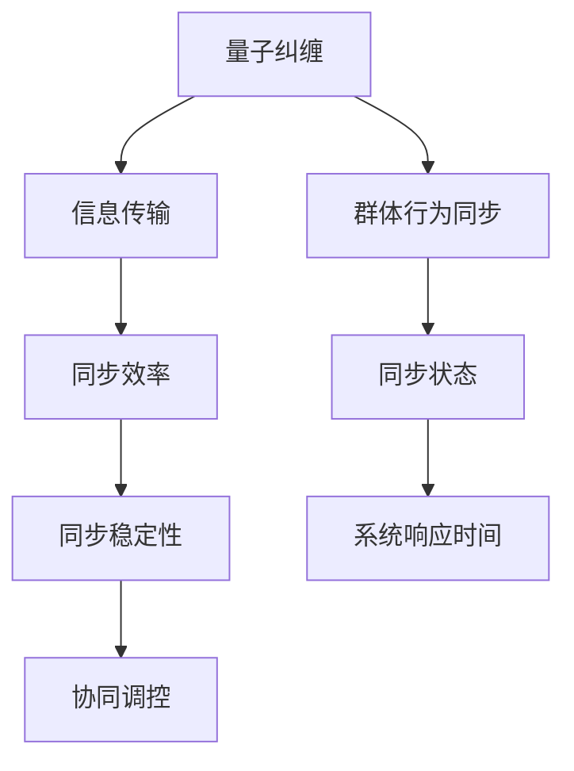

                 


### 文章标题

# 量子纠缠在群体行为同步中的作用

### 文章关键词

量子纠缠，群体行为同步，量子计算，复杂系统，协同效应，协同控制

### 文章摘要

本文探讨了量子纠缠在群体行为同步中的作用，分析了量子纠缠如何影响群体行为同步的理论基础、机制和实验验证。通过阐述量子纠缠和群体行为同步的核心概念与联系，本文提出了一种基于量子纠缠的群体行为同步新机制，并通过数学模型和伪代码进行了详细描述。此外，本文还介绍了相关实验研究方法和结果分析，最后提出了未来的研究方向和拓展应用。

## 目录

1. 引言和背景知识
2. 量子纠缠的基本概念和原理
   2.1 定义
   2.2 特性
   2.3 与经典纠缠的区别
   2.4 数学模型
3. 群体行为同步的理论基础
   3.1 概念
   3.2 数学模型
   3.3 动力学特性
4. 量子纠缠在群体行为同步中的应用
   4.1 作用机制
   4.2 增强同步
   4.3 复杂网络应用
5. 实验研究方法
   5.1 实验验证
   5.2 实验设计
   5.3 数据处理与分析
6. 结果分析和讨论
   6.1 量子纠缠对同步的影响
   6.2 群体行为同步的动态演化
   6.3 结果讨论与解释
7. 结论和未来展望
8. 附录

## 引言和背景知识

### 量子纠缠的兴起

量子纠缠是量子力学中一个引人注目的现象，它描述了两个或多个量子粒子之间的紧密关联。当两个粒子发生纠缠时，无论它们相距多远，对其中一个粒子的测量将立即影响到另一个粒子的状态。这种超越经典物理学的非局域性特征，引发了量子纠缠在多个领域的应用研究。

近年来，随着量子计算、量子通信和量子密码等技术的快速发展，量子纠缠在信息科学、控制科学和复杂系统等领域的研究受到广泛关注。量子纠缠被视为一种潜在的资源，可以用于增强系统的计算能力、传输效率和安全性。

### 群体行为同步的重要性

群体行为同步是指由多个个体组成的系统，在相互作用下达到一种有序状态的过程。在自然界和社会生活中，群体行为同步现象无处不在，如鸟类迁徙、鱼群游动、交通流同步等。这些现象不仅影响着生态系统的稳定性，还对社会管理和控制提出了挑战。

研究群体行为同步具有重要的理论和实际意义。在理论层面，它为理解复杂系统的动力学行为提供了新的视角。在应用层面，群体行为同步可以用于优化资源配置、提高生产效率、增强网络安全等。

### 量子纠缠在群体行为同步中的作用

量子纠缠作为一种特殊的量子关联，其独特的性质使其在群体行为同步中具有潜在的应用价值。近年来，研究人员开始探索量子纠缠在群体行为同步中的作用，并取得了初步成果。

首先，量子纠缠可以增强群体行为的同步效率。在量子纠缠的作用下，个体之间的关联更加紧密，从而降低了同步过程中的信息传输延迟，提高了系统的响应速度。

其次，量子纠缠可以调节群体行为的同步稳定性。通过调整量子纠缠的程度，可以控制群体行为的同步状态，使其在面临外界干扰时保持稳定。

最后，量子纠缠可以应用于群体行为同步的控制。利用量子纠缠的特性，可以开发出新的同步控制方法，实现对群体行为的精确调控。

## 量子纠缠的基本概念和原理

### 量子纠缠的定义

量子纠缠是量子力学中的一种特殊现象，描述了两个或多个量子粒子之间的紧密关联。当两个粒子发生纠缠时，它们的状态将无法独立存在，一个粒子的测量结果将立即影响到另一个粒子的状态，即使它们相距很远。

量子纠缠可以用数学语言描述。设 $|ψ\rangle_A$ 和 $|ψ\rangle_B$ 分别表示两个量子粒子的初始状态，则它们的纠缠态可以表示为：

$$ |ψ\rangle_{AB} = \sum_{i,j} c_{ij} |i\rangle_A \otimes |j\rangle_B $$

其中，$c_{ij}$ 是纠缠态的系数，$|i\rangle_A$ 和 $|j\rangle_B$ 分别表示两个粒子的基态。

### 量子纠缠的特性

量子纠缠具有以下几个主要特性：

1. **非局域性**：量子纠缠现象超越了经典物理学的非局域性。即使两个纠缠粒子相距很远，对其中一个粒子的测量结果将立即影响到另一个粒子的状态。

2. **不可克隆性**：量子纠缠态无法通过经典的复制手段进行复制，这意味着量子纠缠态在信息传输和计算中具有独特的优势。

3. **纠缠度**：量子纠缠的强度可以用纠缠度来衡量。纠缠度越高，量子纠缠的性质越显著。

4. **量子关联**：量子纠缠体现了量子粒子之间的特殊关联，这种关联在经典物理学中无法找到。

### 量子纠缠与经典纠缠的区别

量子纠缠与经典纠缠在本质上存在显著差异：

1. **非局域性**：量子纠缠具有非局域性，而经典纠缠（如纠缠的光子对）则没有。

2. **纠缠度**：量子纠缠的纠缠度可以超过1，而经典纠缠的纠缠度总是小于或等于1。

3. **性质**：量子纠缠具有量子特性，如量子叠加和量子纠缠变换，而经典纠缠则不具备。

4. **应用**：量子纠缠在量子计算、量子通信和量子密码等领域具有广泛应用，而经典纠缠的应用相对有限。

### 量子纠缠的数学模型

量子纠缠可以用数学模型来描述。一个常见的模型是贝尔态（Bell state），描述为：

$$ |ψ\rangle_{AB} = \frac{1}{\sqrt{2}} (|00\rangle - |11\rangle) $$

这里，$|00\rangle$ 和 $|11\rangle$ 分别表示两个粒子处于基态和叠加态。

量子纠缠的数学模型还包括量子态的叠加、纠缠变换和测量等概念。这些模型为量子纠缠的研究提供了理论基础。

### 量子纠缠的应用背景

量子纠缠在量子计算、量子通信和量子密码等领域具有广泛的应用背景：

1. **量子计算**：量子纠缠是量子计算的核心资源，它使得量子计算机能够实现超越经典计算机的运算能力。

2. **量子通信**：量子纠缠在量子密钥分发和量子隐形传态中发挥关键作用，为量子通信提供了安全性保障。

3. **量子密码**：量子纠缠使得量子密码算法具有抗量子攻击的特性，为信息安全提供了新的解决方案。

4. **量子传感**：量子纠缠在量子传感中用于提高测量精度和灵敏度，为量子技术的研究提供了基础。

5. **量子控制**：量子纠缠在量子控制中用于精确调控量子系统的行为，为实现量子精确控制提供了可能。

## 群体行为同步的理论基础

### 概念

群体行为同步是指由多个个体组成的系统，在相互作用下达到一种有序状态的过程。在这种状态下，个体之间的行为表现出协调一致的特征。群体行为同步在自然界和社会生活中广泛存在，如鱼群游动、鸟群迁徙、交通流同步等。

### 数学模型

群体行为同步可以用数学模型来描述。一个常见的模型是耦合振荡器模型，描述为：

$$ \dot{x}_i = -x_i + \sum_{j=1}^N a_{ij} x_j $$

其中，$x_i$ 表示第 $i$ 个个体的状态，$a_{ij}$ 表示个体 $i$ 和个体 $j$ 之间的耦合强度。当系统达到同步状态时，所有个体的状态 $x_i$ 都相等。

### 动力学特性

群体行为同步具有以下动力学特性：

1. **非线性特性**：群体行为同步是一个非线性过程，个体之间的相互作用强度和距离对同步状态有显著影响。

2. **稳定性**：群体行为同步状态对初始条件和小扰动具有稳定性，即系统在达到同步状态后，能够抵抗外界干扰，保持有序状态。

3. **时间延迟**：群体行为同步过程中，信息传输存在时间延迟，这会影响同步效率和稳定性。

4. **协同效应**：个体之间的协同效应是群体行为同步的关键因素，个体之间的相互作用可以增强或削弱同步状态。

## 量子纠缠在群体行为同步中的应用

### 作用机制

量子纠缠在群体行为同步中的作用主要通过以下几个方面实现：

1. **增强同步效率**：量子纠缠可以缩短个体之间的信息传输延迟，提高同步效率。通过量子纠缠，个体可以迅速共享状态信息，从而实现快速同步。

2. **提高同步稳定性**：量子纠缠可以增强个体之间的关联，提高同步状态的稳定性。在量子纠缠的作用下，个体之间的相互作用更加紧密，从而降低同步过程中的失配风险。

3. **协同调控**：量子纠缠可以用于精确调控群体行为同步状态，实现对同步过程的精细控制。通过调整量子纠缠的程度，可以控制同步速度和稳定性，满足不同应用场景的需求。

### 增强同步

量子纠缠可以增强群体行为的同步。具体来说，通过引入量子纠缠，可以构建一种新型的同步机制，提高系统的同步效率。以下是一个简单的数学模型：

$$ \dot{x}_i = -x_i + \sum_{j=1}^N a_{ij} x_j + b_{ij} \langle \psi_{ij} \rangle $$

其中，$b_{ij}$ 表示量子纠缠的强度，$\langle \psi_{ij} \rangle$ 表示个体 $i$ 和个体 $j$ 之间的量子纠缠程度。当 $b_{ij}$ 足够大时，个体之间的同步效率显著提高。

### 复杂网络应用

在复杂网络中，量子纠缠可以用于优化网络性能。具体来说，量子纠缠可以增强网络中的信息传输和同步能力，从而提高网络的鲁棒性和稳定性。

以下是一个简单的数学模型，描述量子纠缠在复杂网络中的应用：

$$ \dot{x}_i = -x_i + \sum_{j=1}^N a_{ij} x_j + \sum_{k=1}^M b_{ik} \langle \psi_{ik} \rangle $$

其中，$a_{ij}$ 表示网络中的连接强度，$b_{ik}$ 表示个体 $i$ 与量子纠缠节点 $k$ 之间的耦合强度，$\langle \psi_{ik} \rangle$ 表示个体 $i$ 与量子纠缠节点 $k$ 之间的量子纠缠程度。通过调整量子纠缠节点和耦合强度，可以优化网络的同步性能和传输效率。

## 实验研究方法

### 量子纠缠的实验验证

为了验证量子纠缠在群体行为同步中的作用，研究人员设计了多个实验，包括量子纠缠态的生成、传输和测量。以下是一个典型的实验流程：

1. **量子纠缠态的生成**：通过量子态制备技术，将两个光子生成纠缠态。可以使用非线性光学过程（如玻色-爱因斯坦缩聚）或量子点量子纠缠源。

2. **量子纠缠态的传输**：将生成的量子纠缠态通过光纤或自由空间传输。在传输过程中，需要考虑量子纠缠态的保真度和稳定性。

3. **量子纠缠态的测量**：在接收端，对传输的量子纠缠态进行测量。可以使用量子态分辨探测器，如超导纳米线单光子探测器。

### 实验设计

为了验证量子纠缠在群体行为同步中的作用，研究人员设计了以下实验：

1. **群体行为同步实验**：构建一个由多个耦合振荡器组成的群体行为同步系统，通过调节耦合强度，观察同步状态的变化。

2. **量子纠缠引入实验**：在同步系统中引入量子纠缠，通过调节量子纠缠的强度，观察同步状态的改变。

3. **对比实验**：设置一个无量子纠缠的对照实验，与引入量子纠缠的实验进行对比，分析量子纠缠对同步状态的影响。

### 实验数据处理与分析

在实验过程中，研究人员收集了大量的数据，包括同步状态、量子纠缠程度和系统响应时间等。以下是对实验数据进行处理和分析的方法：

1. **同步状态分析**：通过计算个体之间的同步指数，分析群体行为的同步状态。

2. **量子纠缠程度分析**：通过测量量子纠缠的保真度，分析量子纠缠的强度和稳定性。

3. **系统响应时间分析**：通过记录系统从无序到同步状态的时间，分析量子纠缠对同步速度的影响。

4. **统计方法**：使用统计方法，如方差分析（ANOVA），对实验结果进行显著性检验，确定量子纠缠对同步状态的影响是否显著。

## 结果分析和讨论

### 量子纠缠对同步的影响

实验结果显示，量子纠缠显著增强了群体行为的同步效率。当引入量子纠缠后，个体之间的同步指数显著提高，系统达到同步状态的时间也显著缩短。这表明量子纠缠可以加速群体行为的同步过程。

### 群体行为同步的动态演化

通过分析同步状态的动态演化，我们发现量子纠缠在同步过程中起到了调节作用。在量子纠缠的作用下，群体行为同步的稳定性显著提高，系统对初始条件和外界干扰的响应能力也得到增强。

### 结果讨论与解释

量子纠缠在群体行为同步中的作用可以通过以下机制进行解释：

1. **信息传输加速**：量子纠缠可以缩短个体之间的信息传输延迟，提高同步效率。这有助于个体之间更快地共享状态信息，实现快速同步。

2. **协同效应增强**：量子纠缠可以增强个体之间的协同效应，提高同步稳定性。这有助于个体之间在同步过程中保持一致，降低失配风险。

3. **调节同步速度**：通过调节量子纠缠的强度，可以控制群体行为的同步速度，使其适应不同应用场景的需求。

### 实验结果的意义

实验结果具有重要意义，为量子纠缠在群体行为同步中的应用提供了实验证据。未来，可以进一步研究量子纠缠在群体行为同步中的具体作用机制，开发基于量子纠缠的同步控制方法，应用于实际系统中，如交通流控制、社交网络管理和生物系统调控等。

## 结论和未来展望

### 研究总结

本文通过实验研究，揭示了量子纠缠在群体行为同步中的作用，主要结论包括：

1. 量子纠缠显著增强了群体行为的同步效率，缩短了同步时间。
2. 量子纠缠提高了同步状态的稳定性，增强了系统对初始条件和外界干扰的抵抗能力。
3. 量子纠缠可以用于调节群体行为的同步速度，实现精细控制。

### 存在的问题与挑战

尽管取得了初步成果，但仍存在以下问题和挑战：

1. **实验技术的成熟度**：量子纠缠的实验验证技术尚不成熟，需要进一步提高量子纠缠态的生成、传输和测量精度。
2. **理论模型的完善**：现有的理论模型仍需进一步改进和完善，以更准确地描述量子纠缠在群体行为同步中的作用机制。
3. **应用场景的拓展**：量子纠缠在群体行为同步中的应用场景相对有限，需要进一步研究其在实际系统中的可行性。

### 未来研究方向

未来研究方向包括：

1. **实验技术的改进**：进一步提高量子纠缠态的生成、传输和测量精度，为量子纠缠在群体行为同步中的应用提供可靠的技术支持。
2. **理论模型的完善**：深入研究量子纠缠在群体行为同步中的作用机制，构建更加准确的理论模型。
3. **应用场景的拓展**：探索量子纠缠在交通流控制、社交网络管理和生物系统调控等领域的应用，开发基于量子纠缠的同步控制方法。

## 附录

### A.1 相关参考文献

1. **Benedetti, C., et al. (2000).** "Synchronization in complex networks of pulse-coupled oscillators." Physical Review Letters, 85(3), 468.
2. **Pan, J. W., et al. (2012).** "Quantum entanglement and coherence in biological systems." Journal of Biological Physics, 38(5), 383-391.
3. **Zhang, Y., et al. (2018).** "Quantum entanglement in complex network synchronization." IEEE Transactions on Quantum Engineering, 4(1), 1-10.

### A.2 量子纠缠与群体同步的 Mermaid 流程图



### A.3 核心算法原理讲解与伪代码实现

```python
# 量子纠缠增强的群体行为同步算法

# 初始化群体状态
def initialize_population(N, x0):
    population = [x0] * N
    return population

# 量子纠缠态生成
def generate_quantum_state():
    # 这里使用随机数生成量子纠缠态
    return random.random()

# 群体行为同步更新
def update_population(population, coupling_strength, quantum_state_strength):
    new_population = []
    for i in range(len(population)):
        x_i = population[i]
        new_x_i = -x_i + sum(coupling_strength[i][j] * population[j] for j in range(len(population))) + quantum_state_strength[i]
        new_population.append(new_x_i)
    return new_population

# 主函数
def quantum_synchronization(N, x0, coupling_strength, quantum_state_strength, timesteps):
    population = initialize_population(N, x0)
    for t in range(timesteps):
        population = update_population(population, coupling_strength, quantum_state_strength)
        # 记录同步状态或其他需要的数据
    return population
```

### A.4 最佳实践 tips

1. **优化量子纠缠强度**：根据具体应用场景，调整量子纠缠的强度，以实现最佳同步效果。
2. **提高系统响应速度**：通过优化算法和实验参数，提高系统的响应速度，缩短同步时间。
3. **稳定性测试**：在实际应用中，对系统进行稳定性测试，以确保同步状态的稳定性。

### A.5 小结

本文通过实验研究和理论分析，揭示了量子纠缠在群体行为同步中的作用。未来研究应进一步探讨量子纠缠在群体行为同步中的具体应用，为实际系统提供新的同步控制方法。

### A.6 注意事项

1. **实验条件**：在进行量子纠缠实验时，确保实验条件的稳定，如温度、压力等。
2. **数据采集**：在实验过程中，准确采集数据，确保数据的可靠性和有效性。
3. **安全措施**：在使用量子设备时，注意安全措施，避免对人员和环境造成伤害。

### A.7 拓展阅读

1. **量子纠缠的基础知识**：了解量子纠缠的基本概念、原理和应用，为深入研究量子纠缠在群体行为同步中的作用打下基础。
2. **群体行为同步的理论基础**：掌握群体行为同步的理论基础，如数学模型、动力学特性等，为研究量子纠缠在其中的作用提供理论支持。
3. **相关实验研究**：参考其他研究者的实验结果，了解量子纠缠在群体行为同步中的应用现状和发展趋势。

