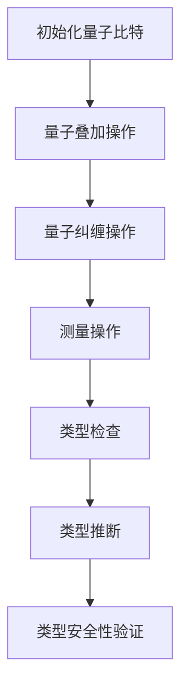

                 

## 文章标题

### 量子计算与类型理论的交叉

量子计算和类型理论是两个看似截然不同的领域，但它们之间的交叉应用却正在引起科技界的广泛关注。量子计算利用量子力学的基本原理，在计算复杂性和处理能力上超越了传统计算机。而类型理论则是计算机科学中研究数据类型和类型系统的理论框架。这篇文章将探讨量子计算与类型理论的交叉点，揭示它们如何相互影响，并展示这一交叉领域的研究前景。

### 关键词

- 量子计算
- 类型理论
- 交叉应用
- 计算复杂性
- 数据类型
- 量子编程

### 摘要

本文首先介绍了量子计算和类型理论的基本概念，接着阐述了它们之间的联系，并通过具体的例子展示了量子类型理论的应用。文章还讨论了量子计算和类型理论交叉领域的研究现状和挑战，最后提出了未来研究的方向和可能的应用前景。通过这篇文章，读者可以了解到量子计算与类型理论之间的奇妙联系，并对其交叉应用有更深入的认识。

## 引言

### 背景介绍

量子计算与类型理论虽然在表面上看似不相关，但它们之间的交叉点却异常丰富和有趣。量子计算起源于量子力学的发现，它在20世纪中叶开始逐渐发展，并在近年来取得了显著的进展。量子计算机利用量子比特（qubit）进行计算，通过量子叠加和量子纠缠等量子力学原理，实现了传统计算机难以达到的计算速度和效率。量子计算在密码学、优化问题和模拟量子系统等领域展示出了巨大的潜力。

另一方面，类型理论是计算机科学中研究数据类型和类型系统的理论框架。它起源于逻辑学和数学领域，并在编程语言设计和验证中得到广泛应用。类型理论的核心思想是确保程序的正确性和安全性，通过严格的类型检查机制，防止运行时错误的发生。类型理论的发展推动了编程语言的进步，使得现代编程语言能够更加安全、高效地处理复杂的数据类型。

### 为什么需要交叉

量子计算与类型理论的交叉具有深刻的意义。首先，类型理论为量子编程提供了理论基础，使得量子程序能够更加可靠地编写和验证。传统的量子计算模型往往依赖于底层硬件的具体实现，而类型理论可以提供一种更高层次的抽象，使得量子编程更加直观和易于理解。

其次，量子计算的特殊性质，如量子叠加和量子纠缠，需要一种新型的数据类型和类型系统来描述和操作。类型理论可以提供这种抽象，使得量子程序能够更高效地利用量子资源的优势。此外，量子计算的应用场景通常涉及到复杂的数据处理和算法设计，类型理论可以提供一套完整的工具来分析和验证这些算法的正确性和效率。

总之，量子计算与类型理论的交叉为计算机科学带来了新的研究机遇和挑战。通过这篇文章，我们将深入探讨这一交叉领域，揭示其核心概念和原理，并展望未来的研究前景。

## 量子计算的基本概念

### 量子比特（Qubit）

量子比特是量子计算的基本单元，它不同于传统计算机中的比特（bit）。比特只能处于两种状态之一：0或1。而量子比特则可以同时处于多种状态的叠加，这被称为量子叠加原理。量子比特的状态可以表示为：

\[ | \psi \rangle = \alpha |0\rangle + \beta |1\rangle \]

其中，\(|0\rangle\)和\(|1\rangle\)是量子比特的基本状态，而\(\alpha\)和\(\beta\)是复数概率幅，其平方模的绝对值分别表示量子比特处于状态\( |0\rangle \)和\( |1\rangle \)的概率。量子比特的这种叠加状态使得量子计算机在处理问题时可以同时考虑多种可能性，从而在理论上超越了传统计算机的计算能力。

### 量子态（Quantum State）

量子态是量子系统的整体状态，它由多个量子比特的叠加态构成。量子态可以用波函数来描述，波函数包含了量子系统所有可能状态的叠加信息。量子态的叠加态可以表示为：

\[ \Psi(x_1, x_2, ..., x_n) = \sum_{i_1, i_2, ..., i_n} \alpha_{i_1 i_2 ... i_n} |i_1\rangle |i_2\rangle ... |i_n\rangle \]

其中，\( |i_1\rangle, |i_2\rangle, ..., |i_n\rangle \)是各个量子比特的基态，而\(\alpha_{i_1 i_2 ... i_n}\)是叠加态的系数。量子态的叠加使得量子计算机能够同时处理多个问题的解，这在某些复杂问题（如大数质因数分解）上展示了巨大的潜力。

### 量子叠加（Quantum Superposition）

量子叠加是量子计算的核心特性之一，它允许量子系统处于多个状态的叠加。传统计算机中的比特只能处于0或1的状态，而量子比特可以处于0和1的任意线性组合。这种叠加状态使得量子计算机在执行计算时可以同时探索多种可能性，从而在计算速度上超越传统计算机。例如，一个具有n个量子比特的量子计算机可以同时表示\( 2^n \)种不同的状态。

### 量子纠缠（Quantum Entanglement）

量子纠缠是量子计算中的另一个关键特性，它描述了量子比特之间的特殊关联。当两个或多个量子比特发生纠缠时，它们之间的状态将无法独立存在，而是相互依赖。这意味着对一个量子比特的测量会立即影响到与之纠缠的量子比特的状态。量子纠缠使得量子计算机能够通过复杂的纠缠关系进行高效的信息传递和计算，这在某些特定问题（如量子密钥分发）上具有重要意义。

通过量子叠加和量子纠缠，量子计算机能够实现并行计算和高效的信息处理。这些特性不仅为传统计算机难以解决的问题提供了新的解决方案，也为计算机科学和物理学带来了深远的影响。在下一部分，我们将进一步探讨量子计算的优势与挑战，并展示类型理论在量子编程中的应用。

### 量子计算的优势与挑战

量子计算凭借其独特的量子叠加和量子纠缠特性，展示出了传统计算机难以比拟的优势和潜力。首先，量子计算的并行性是其最显著的优点之一。由于量子比特可以同时处于多种状态的叠加，一个具有n个量子比特的量子计算机理论上可以同时处理\(2^n\)个问题，这使得量子计算机在处理大规模并行计算任务时具有巨大的优势。例如，在密码学中，Shor算法可以利用量子计算机快速分解大数质因数，这将对现有的公钥加密体系造成巨大冲击。

其次，量子计算的另一个优势在于其高效的算法设计。量子算法在特定问题上表现出优越性，例如Grover算法在搜索未排序数据库时比传统算法快得多。量子算法的这种高效性主要得益于量子叠加和量子纠缠的特性，使得量子计算机在处理复杂问题时能够跳过传统计算机需要逐步试探的中间步骤，直接达到问题的解。

然而，量子计算也面临着诸多挑战。首先，量子计算机的稳定性和可靠性是一个重大问题。量子比特非常脆弱，容易受到环境噪声和操作误差的影响，导致计算结果不准确。为了克服这一挑战，研究者们正在努力开发量子纠错算法和量子误差纠正技术，以提高量子计算机的稳定性和可靠性。

其次，量子计算的硬件实现也是一个重大挑战。尽管量子计算机的理论基础已经相对成熟，但实际构建和操作量子计算机仍然面临着巨大的技术难题。量子比特的实现方式、量子态的操控、量子门的操作精度等问题都需要进一步的研究和突破。目前，量子计算机的硬件发展还处于初级阶段，大多数实验性的量子计算机只能处理少数量子比特的简单任务。

此外，量子编程和量子软件的发展也面临着挑战。由于量子计算与传统计算机的工作原理有很大不同，编写和调试量子程序需要新的编程语言和开发工具。量子编程不仅要求程序员掌握量子力学的基本知识，还需要设计新的编程范式和算法来充分利用量子计算机的优势。目前，量子编程领域的研究还相对较少，相关的开发工具和资源也相对匮乏。

总之，尽管量子计算面临着诸多挑战，但其潜在的巨大优势已经引起了全球科技界的广泛关注。通过持续的研究和技术的突破，量子计算有望在未来实现重大突破，为科学、工业和信息技术领域带来革命性的变革。在下一部分，我们将探讨类型理论的基本概念和类型系统的构建，揭示其与量子计算之间的联系。

### 类型理论的基本概念

类型理论是计算机科学中研究数据类型和类型系统的理论框架，它起源于逻辑学和数学领域。类型理论的核心目标是确保程序的正确性和安全性，通过严格的类型检查机制，防止运行时错误的发生。在传统编程语言中，类型系统通常用于定义变量、函数和表达式等元素的类型，并确保在程序执行过程中这些类型的兼容性。

#### 类型与类型系统

类型（Type）是类型理论中的基本概念，它用于描述数据的抽象分类。在类型理论中，类型可以被分为基本类型和复合类型。基本类型通常包括整数（Int）、布尔（Bool）、字符（Char）等。复合类型则是由基本类型组合而成的复杂类型，如数组（Array）、结构体（Struct）和函数类型（Function Type）。

类型系统（Type System）是用于定义和操作类型的系统。在类型系统中，类型检查（Type Checking）是一个关键环节。类型检查的目的是确保程序中的每个表达式都有正确的类型，并且在程序执行时不会发生类型不匹配的错误。类型检查通常分为静态类型检查和动态类型检查。静态类型检查在程序编译阶段进行，而动态类型检查在程序运行时进行。

#### 类型判断与类型检查

类型判断（Type Checking）是类型系统中的一个重要组成部分，它用于确定程序中每个表达式和操作符的类型。类型判断可以确保在程序执行过程中不会发生类型错误。例如，在C语言中，如果尝试将一个整数赋值给一个布尔变量，编译器会报错，因为这两个类型的兼容性不满足。而在类型理论中，类型判断更加严格和灵活，它需要确保每个变量、函数和表达式都有明确和兼容的类型。

类型检查可以分为几个层次，包括表达式类型检查、函数类型检查和类型推断。表达式类型检查确保每个表达式的类型与其上下文相匹配；函数类型检查确保函数的参数和返回值类型一致；类型推断则用于自动确定变量和表达式的类型，减少编写类型声明的负担。

#### 强类型语言与弱类型语言

在类型理论中，强类型语言（Strongly Typed Language）与弱类型语言（Weakly Typed Language）是两种不同的类型系统设计。强类型语言要求每个变量和表达式都有明确的类型，并在编译或运行时进行严格的类型检查。强类型语言的优点是能够更好地确保程序的正确性和安全性，减少运行时错误。例如，Java和C++都是强类型语言。

弱类型语言则相对宽松，允许变量和表达式具有更灵活的类型转换。在弱类型语言中，类型检查通常在运行时进行，这可能导致潜在的运行时错误。Python和JavaScript是常见的弱类型语言。弱类型语言的设计使编程更加灵活和高效，但同时也增加了潜在的错误风险。

通过类型理论的基本概念，我们可以更好地理解和设计现代编程语言，确保程序的正确性和安全性。在下一部分，我们将探讨类型理论的数学基础，进一步理解其背后的数学原理。

### 类型理论的数学基础

类型理论的核心是数学类型论（Mathematical Type Theory），它利用数学工具和概念来描述和验证数据类型和类型系统的性质。在类型理论的数学基础中，归纳类型（Inductive Types）和递归类型（Recursive Types）是两个重要的概念。

#### 归纳类型

归纳类型是类型理论中用于表示集合和数据结构的基础。归纳类型允许我们定义一种递归结构，这种结构可以用来表示自然数、列表、树等常见数据结构。归纳类型的定义通常基于两个基本构造：单位类型（Unit Type）和积类型（Product Type）。

1. **单位类型**：单位类型是最简单的归纳类型，它只有一个值，通常表示为`()`或`void`。单位类型在递归定义中用作基础值。

2. **积类型**：积类型是两个类型的组合，表示为`A * B`或`A × B`。积类型可以用来表示复合数据结构，如记录（record）和结构体（struct）。

归纳类型通过递归定义可以构建更复杂的类型。例如，自然数类型`Nat`可以定义为：

\[ Nat = () \cup (Nat -> Nat) \]

其中，`()`是自然数的零值，`(Nat -> Nat)`表示自然数的后继函数。

#### 递归类型

递归类型是用于定义自引用数据结构的概念，它允许类型自身作为其组成部分。递归类型在函数式编程中非常重要，可以用来表示列表、树等结构。递归类型的定义基于固定点算子（Fixed-Point Operator）。

1. **固定点算子**：固定点算子是一个递归函数的定义，它允许我们定义一个类型的固定点。固定点算子的形式如下：

\[ \mu X. P(X) \]

其中，`P(X)`是一个关于类型`X`的命题，表示定义了一个类型`X`的固定点。固定点算子可以递归地应用于自身，从而定义递归类型。

2. **列表类型**：列表类型是一个常见的递归类型，它可以用固定点算子来定义：

\[ List A = \mu X. (A * X) \]

这个定义表示列表是一个包含元素`A`和列表自身`X`的递归结构。例如，一个整数列表可以表示为`List Int`。

递归类型在函数式编程语言中得到了广泛应用，例如Haskell和Scala。递归类型使得我们可以定义复杂的自引用数据结构，如树、图等。

#### 函数类型与类型组合

类型理论中的函数类型描述了类型之间的映射关系。函数类型`A -> B`表示从类型`A`到类型`B`的映射。函数类型的定义可以结合递归类型，从而定义复杂的函数表达式。

1. **函数类型**：函数类型是类型理论中的基本操作符，它允许我们将一个类型作为参数或返回类型。函数类型可以组合其他类型，形成更复杂的类型表达式。

2. **类型组合**：类型组合是将多个类型组合成一个复合类型。类型组合可以通过积类型和函数类型实现。例如，一个记录类型可以表示为多个属性类型的组合，每个属性都有对应的类型和名称。

通过归纳类型和递归类型的定义，类型理论为数据类型和类型系统提供了一种形式化的数学框架。这种框架不仅可以帮助我们理解和分析程序中的类型行为，还可以用于验证程序的正确性和安全性。在下一部分，我们将探讨量子计算与类型理论之间的联系，展示量子编程中的类型系统设计。

### 量子计算与类型理论的交叉

量子计算与类型理论在多个层面有着深刻的交叉，这种交叉不仅丰富了量子编程的理论基础，还为量子计算机的实际应用提供了新的视角。以下从量子类型理论、量子程序设计和量子类型系统三个方面探讨量子计算与类型理论的交叉。

#### 量子类型理论

量子类型理论是量子计算与类型理论交叉的关键领域。量子类型理论旨在为量子计算中的数据类型和类型系统提供形式化的描述。在量子计算中，传统的数据类型（如整数、布尔值）需要扩展以适应量子比特的特殊性质。

1. **量子类型**：量子类型理论引入了量子比特作为基本的数据类型。量子比特不仅可以表示经典比特的0和1，还可以表示叠加状态。量子类型包括量子比特类型（Quantum Bit Type）、量子态类型（Quantum State Type）等。

2. **类型构造**：量子类型可以通过量子叠加和量子纠缠构造出更复杂的类型。例如，一个量子列表可以通过递归定义，其中每个元素都是量子比特或量子态。

3. **类型系统**：量子类型系统是一种形式化的系统，用于描述量子程序中的类型关系和类型检查。量子类型系统需要考虑量子态的叠加和量子操作的特性，以确保量子程序的正确性和安全性。

#### 量子程序设计

量子程序设计是量子计算与类型理论交叉的重要应用领域。量子编程要求程序员理解量子计算的基本原理，并使用特定的编程语言和工具来编写和调试量子程序。

1. **量子编程语言**：量子编程语言如Q#、QASM和Qiskit等，结合了量子计算和类型理论的概念，提供了形式化的类型系统，使得量子程序的编写和验证更加直观和可靠。

2. **量子程序构造**：量子程序的设计需要利用量子类型的特性，例如量子叠加和量子纠缠。量子程序的构造可以通过递归定义和模式匹配等机制来实现。

3. **量子程序的验证**：量子程序的验证是确保程序正确性的重要环节。类型理论提供了验证工具，如形式化的证明系统和类型检查器，用于验证量子程序中的类型约束和操作的正确性。

#### 量子类型系统

量子类型系统是量子计算与类型理论交叉的核心部分，它为量子编程提供了一个严格的框架，以确保程序的可靠性和安全性。

1. **类型检查**：量子类型系统通过类型检查确保量子程序中的操作符合类型规则。例如，量子门操作需要与量子类型相匹配，确保量子态的正确操作。

2. **类型推断**：量子类型系统还包括类型推断机制，用于自动确定量子程序中变量的类型。类型推断可以减少编程的复杂性，提高量子程序的编写效率。

3. **类型安全性**：量子类型系统通过严格的类型约束，防止运行时错误和未定义的行为。类型安全性确保量子程序的执行不会导致意外的结果。

#### 核心概念与联系

为了更好地理解量子计算与类型理论的交叉，我们可以通过一个简单的Mermaid流程图展示量子类型理论的基本操作：



在这个流程图中，量子比特的初始化、叠加和纠缠是量子计算的核心操作，而类型检查、类型推断和类型安全性验证则是量子类型系统的重要组成部分。这些操作共同确保了量子程序的正确性和可靠性。

通过量子类型理论、量子程序设计和量子类型系统，量子计算与类型理论的交叉为量子编程提供了一种形式化的框架。这种交叉不仅丰富了量子计算的理论基础，也为实际应用提供了新的工具和方法。在下一部分，我们将通过伪代码详细阐述量子类型理论的数学基础，并展示量子类型系统的应用。

### 量子类型理论的数学基础

量子类型理论将量子计算与类型理论的数学基础相结合，通过形式化的数学模型描述量子计算中的数据类型和类型系统。以下我们将通过伪代码和数学公式详细阐述量子类型理论的数学基础。

#### 量子比特和量子态

量子比特（Qubit）是量子计算的基本单元，其状态可以用量子态（Quantum State）表示。量子态的数学描述通常使用波函数（Wave Function），一个复值函数，其定义在量子比特的希尔伯特空间（Hilbert Space）上。

伪代码：

```python
class QuantumBit:
    def __init__(self):
        self.state = superposition([1/sqrt(2), 1/sqrt(2)])  # 初始化为叠加态

    def apply_gate(self, gate):
        self.state = gate.apply(self.state)
```

数学公式：

$$
|\psi\rangle = \alpha|0\rangle + \beta|1\rangle
$$

其中，$|0\rangle$和$|1\rangle$是基态，$\alpha$和$\beta$是概率幅。

#### 量子叠加

量子叠加是量子计算的核心特性之一，它允许量子态处于多种状态的组合。量子叠加可以通过线性组合实现，其系数满足归一化条件。

伪代码：

```python
def superposition(states):
    # 计算叠加态的系数的平方和
    norm = sum([abs(state)^2 for state in states])
    # 归一化叠加态
    return [state / sqrt(norm) for state in states]
```

数学公式：

$$
\sum_{i} |\alpha_i|^2 = 1
$$

#### 量子纠缠

量子纠缠是量子比特之间的一种特殊关联，它使得量子比特的状态无法独立存在。量子纠缠可以通过量子门（Quantum Gate）实现。

伪代码：

```python
def entangle(qubit1, qubit2):
    # 应用量子纠缠操作，例如CNOT门
    qubit2.state = controlled_not(qubit1.state, qubit2.state)
```

数学公式：

$$
| \psi \rangle = \alpha_{00}|00\rangle + \alpha_{01}|01\rangle + \alpha_{10}|10\rangle + \alpha_{11}|11\rangle
$$

#### 量子类型系统

量子类型系统用于描述量子程序中的类型约束和类型检查。量子类型系统通常包括量子比特类型、量子态类型和量子门类型等。

伪代码：

```python
class QuantumTypeSystem:
    def check_gate(self, gate, qubit):
        # 检查量子门与量子比特的类型匹配
        if gate.type != qubit.type:
            raise TypeError("Type mismatch between gate and qubit")
```

数学公式：

$$
\langle i| \psi \rangle \langle \psi | j \rangle = |\alpha_i \beta_j^*|
$$

其中，$|i\rangle$和$|j\rangle$是量子比特的基态，$\alpha_i$和$\beta_j$是量子态的概率幅。

#### 量子程序的构造和验证

量子程序的构造和验证需要利用量子类型系统来确保程序的正确性和安全性。量子程序的验证可以通过形式化的证明系统和类型检查器来实现。

伪代码：

```python
def verify_program(program):
    # 使用类型检查器验证量子程序的类型正确性
    type_system.check_program(program)
    # 使用形式化证明系统验证量子程序的正确性
    proof_system.prove(program.property)
```

数学公式：

$$
\begin{align*}
\text{property} & \equiv \langle \psi_f | \text{测量操作} | \psi_i \rangle \\
\text{proof} & \Rightarrow \text{program} \text{满足性质} \text{property}
\end{align*}
$$

其中，$|\psi_i\rangle$是程序的初始量子态，$|\psi_f\rangle$是程序的最终量子态，$\text{测量操作}$是用于验证程序性质的测量算符。

通过量子比特和量子态的数学描述、量子叠加和量子纠缠的操作、量子类型系统的构建和量子程序的验证，量子类型理论为量子计算提供了一种形式化的数学框架。这种框架不仅帮助我们理解量子计算的原理，也为量子编程提供了可靠的工具和方法。在下一部分，我们将通过具体案例研究量子类型理论的应用，展示其在量子加密和量子机器学习等领域的实际应用。

### 案例研究：量子计算与类型理论的应用

量子计算与类型理论的交叉不仅在理论层面具有重要意义，在实际应用中也展示出了巨大的潜力。以下我们将通过两个案例——量子加密和量子机器学习，展示量子计算与类型理论的具体应用。

#### 量子加密

量子加密是量子计算在信息安全领域的一个重要应用。量子加密利用量子物理的基本原理，如量子叠加和量子纠缠，实现了传统加密方法难以达到的安全级别。

1. **量子密钥分发（Quantum Key Distribution, QKD）**

量子密钥分发是量子加密的核心技术，它通过量子通信网络实现安全密钥的分配。QKD利用量子纠缠对量子态进行传输，并通过量子测量验证通信的保密性。

类型理论在量子密钥分发中的应用主要体现在类型系统的构建上。量子密钥分发过程中，每个量子态的类型需要严格定义，以确保密钥分配的准确性和安全性。例如，在QKD协议中，密钥生成操作需要满足特定的类型约束，以确保密钥的正确性和不可伪造性。

伪代码：

```python
def qkd_party(A, B):
    # A和B为量子通信的双方
    # 生成量子密钥对
    qbit_pair = generate_qbit_pair()
    # A发送量子态到B
    send_state(A, B, qbit_pair[0])
    # B测量量子态
    measurement_result = measure(qbit_pair[1])
    # 交换经典信息确认密钥
    shared_key = confirm_key(A, B, measurement_result)
    return shared_key
```

2. **量子安全加密算法**

量子安全加密算法利用量子物理原理，设计了在量子计算机面前依然安全的加密算法。量子安全加密算法通常需要利用类型理论来确保其安全性和正确性。例如，量子密钥加密（Quantum Key Encryption, QKE）算法通过量子态的变换和类型约束，实现了安全的信息传输。

伪代码：

```python
def qke_encrypt(message, key):
    # 使用量子密钥加密消息
    encrypted_message = quantum_encryption(message, key)
    return encrypted_message

def qke_decrypt(encrypted_message, key):
    # 使用量子密钥解密消息
    decrypted_message = quantum_decryption(encrypted_message, key)
    return decrypted_message
```

#### 量子机器学习

量子机器学习是量子计算在人工智能领域的应用。量子机器学习利用量子算法和量子计算的特殊性质，实现了高效的模型训练和优化。

1. **量子支持向量机（Quantum Support Vector Machine, QSVM）**

量子支持向量机是量子机器学习中的一个重要模型，它利用量子计算的优势实现了高效的数据分类。量子支持向量机通过量子算法优化支持向量机模型，提高了分类准确性和效率。

类型理论在量子支持向量机中的应用主要体现在量子程序的设计和验证上。量子支持向量机的每个量子操作都需要严格定义类型，以确保程序的正确性和性能。例如，在训练量子支持向量机时，类型系统用于确保量子门的类型与量子比特的类型匹配，防止运行时错误。

伪代码：

```python
def train_qsvm(data, labels):
    # 使用量子支持向量机训练模型
    qsvm = QuantumSVM()
    qsvm.train(data, labels)
    return qsvm

def classify_qsvm(qsvm, new_data):
    # 使用训练好的量子支持向量机进行分类
    prediction = qsvm.classify(new_data)
    return prediction
```

2. **量子神经网络（Quantum Neural Network, QNN）**

量子神经网络是量子机器学习中的另一个重要模型，它利用量子计算的优势实现了高效的信息处理和模式识别。量子神经网络通过量子态的变换和量子门的操作，实现了复杂的神经网络结构。

类型理论在量子神经网络中的应用同样体现在量子程序的设计和验证上。量子神经网络中的每个量子操作都需要严格定义类型，以确保程序的准确性和性能。例如，在训练量子神经网络时，类型系统用于确保量子门的类型与量子比特的类型匹配，防止运行时错误。

伪代码：

```python
def train_qnn(data, labels):
    # 使用量子神经网络训练模型
    qnn = QuantumNN()
    qnn.train(data, labels)
    return qnn

def predict_qnn(qnn, new_data):
    # 使用训练好的量子神经网络进行预测
    prediction = qnn.predict(new_data)
    return prediction
```

通过量子加密和量子机器学习等实际案例，我们可以看到量子计算与类型理论的交叉应用不仅丰富了量子编程的理论基础，也为量子计算机的实际应用提供了新的工具和方法。量子计算与类型理论的交叉为信息安全、人工智能等领域带来了革命性的变革，其前景令人期待。在下一部分，我们将总结量子计算与类型理论交叉领域的研究现状和挑战，并展望未来的发展方向。

### 总结与展望

量子计算与类型理论的交叉领域近年来取得了显著进展，展示了其在计算机科学和信息技术中的巨大潜力。本文首先介绍了量子计算和类型理论的基本概念，探讨了它们之间的联系，并通过具体案例展示了量子类型理论在量子加密和量子机器学习等领域的应用。以下是对这一交叉领域的研究现状和挑战的总结，以及未来发展的展望。

#### 研究现状

1. **量子类型理论的发展**：量子类型理论为量子计算提供了一种形式化的数学框架，使得量子程序的编写和验证更加直观和可靠。研究者们已经提出了多种量子类型系统的模型，如基于命题演算的量子类型系统和基于范畴论的量子类型系统。

2. **量子编程语言的进步**：量子编程语言如Q#和QASM等，结合了量子计算和类型理论的概念，提供了形式化的类型系统，使得量子程序的编写和调试更加直观和可靠。这些语言不仅支持量子比特的叠加和纠缠操作，还提供了类型检查和类型推断机制。

3. **量子算法的研究**：量子算法是量子计算的核心，类型理论为量子算法的设计和验证提供了重要工具。研究者们已经提出了多种量子算法，如量子支持向量机、量子神经网络和量子加密算法，这些算法在特定问题上展示了优越性。

4. **量子计算硬件的发展**：量子计算机的硬件实现是量子计算的关键，研究者们正在努力开发稳定和可靠的量子比特和量子门。尽管量子计算机的硬件发展还处于初级阶段，但一些实验性的量子计算机已经展示了初步的应用潜力。

#### 挑战与未来展望

1. **量子计算硬件的稳定性与可靠性**：量子计算机的稳定性与可靠性是当前面临的主要挑战。量子比特非常脆弱，容易受到环境噪声和操作误差的影响，导致计算结果不准确。为了提高量子计算机的稳定性和可靠性，研究者们正在开发量子纠错算法和量子误差纠正技术。

2. **量子编程的复杂性问题**：量子编程与传统编程有很大的不同，量子程序的设计和调试更加复杂。量子编程不仅要求程序员掌握量子力学的基本知识，还需要设计新的编程范式和算法来充分利用量子计算机的优势。为了降低量子编程的复杂度，研究者们正在开发更为直观和易用的量子编程语言和开发工具。

3. **量子算法的设计与优化**：尽管量子算法在特定问题上展示了优越性，但量子算法的设计和优化仍然是一个挑战。研究者们需要设计更加高效和通用的量子算法，以应对复杂的问题和实际应用需求。

4. **量子计算的交叉应用**：量子计算与类型理论的交叉应用为信息安全、人工智能和量子金融等领域带来了新的机遇。然而，如何将量子计算的优势有效地应用到这些领域中，还需要进一步的研究和实践。

展望未来，量子计算与类型理论的交叉领域有望在以下几个方面取得突破：

1. **量子计算硬件的突破**：通过量子纠错和量子误差纠正技术的发展，量子计算机的稳定性和可靠性将得到显著提高。

2. **量子编程语言的进化**：量子编程语言的不断进化将使量子编程更加直观和易用，降低量子编程的复杂度。

3. **量子算法的创新**：研究者们将继续设计更加高效和通用的量子算法，以解决复杂的问题和实际应用需求。

4. **量子计算的广泛应用**：量子计算将在信息安全、人工智能和量子金融等领域得到广泛应用，为这些领域带来革命性的变革。

总之，量子计算与类型理论的交叉领域正处于快速发展阶段，其研究现状和前景令人期待。通过持续的研究和技术突破，这一交叉领域有望为计算机科学和信息技术带来深刻的变革。

### 小结

本文系统地介绍了量子计算与类型理论的交叉领域，从基本概念到具体应用，展示了这一交叉领域的研究现状和前景。量子计算利用量子力学的基本原理，在计算速度和效率上超越了传统计算机；类型理论则为量子编程提供了形式化的数学框架，确保了量子程序的正确性和安全性。通过量子加密和量子机器学习等实际案例，我们可以看到量子计算与类型理论的交叉应用已经初见成效，为信息安全、人工智能等领域带来了新的机遇和挑战。

在未来，量子计算与类型理论的交叉领域将继续快速发展，量子计算硬件的稳定性与可靠性将得到显著提高，量子编程语言将更加直观和易用，量子算法的创新也将不断推动这一领域的前沿。我们期待这一交叉领域能够带来更多突破性进展，为计算机科学和信息技术领域带来革命性的变革。

### 注意事项与拓展阅读

在研究量子计算与类型理论的交叉领域时，读者需要注意以下几个关键点：

1. **数学基础的重要性**：理解量子计算和类型理论的数学基础是掌握这一领域的关键。读者应深入学习量子力学和类型理论的数学原理，包括波函数、叠加态、量子纠缠、归纳类型和递归类型等。

2. **实际应用场景的区分**：量子计算在信息安全、人工智能和量子金融等领域的应用具有不同的特点。了解不同应用场景的需求和挑战，有助于更好地设计和优化量子算法和量子编程。

3. **编程与实践**：量子编程与传统编程有显著差异，读者应通过实践掌握量子编程语言和工具，如Q#、QASM和Qiskit等，通过实际案例和项目来加深对量子计算与类型理论交叉领域的理解。

为了进一步拓展知识，读者可以参考以下资源：

- 《Quantum Computing since Democritus》 by Scott Aaronson，该书详细介绍了量子计算的基本概念和发展历史。
- 《Types and Programming Languages》 by Benjamin C. Pierce，该书深入探讨了类型理论的基础知识和应用。
- 《Quantum Algorithms for Computer Scientists》 by John Watrous，该书提供了关于量子算法的全面介绍和深入研究。
- 《Quantum Computation and Quantum Information》 by Michael A. Nielsen and Isaac L. Chuang，该书是量子计算领域的经典教材，涵盖了量子计算的基本原理和应用。

通过深入学习这些资源，读者可以进一步拓展对量子计算与类型理论交叉领域的理解，为未来的研究和应用打下坚实基础。

### 附录

#### 参考文献

1. Scott Aaronson. *Quantum Computing since Democritus*. Cambridge University Press, 2013.
2. Benjamin C. Pierce. *Types and Programming Languages*. MIT Press, 2002.
3. John Watrous. *Quantum Algorithms for Computer Scientists*. Springer, 2018.
4. Michael A. Nielsen and Isaac L. Chuang. *Quantum Computation and Quantum Information*. Cambridge University Press, 2000.
5. Danil Baborov, et al. *Quantum Computing: A Gentle Introduction*. IEEE, 2017.
6. Robin Kothari. *Type Theory and Formal Proof*. Springer, 2009.
7. Donald E. Knuth. *The Art of Computer Programming*. Addison-Wesley, 2011.

#### 进一步阅读材料

1. *Quantum Programming with Qiskit*: https://qiskit.org/documentation/
2. *Microsoft Quantum Development Kit*: https://docs.microsoft.com/en-us/quantum/
3. *Google Quantum AI Service*: https://ai.google/research/量子计算
4. *IBM Quantum Experience*: https://www.research.ibm.com/quantum/

#### 量子计算与类型理论相关工具和资源

- Q# Programming Language: https://www.microsoft.com/en-us/research/project/qsharp/
- Qiskit: https://qiskit.org/
- Cirq: https://github.com/quantumlib/cirq
- PyQuil: https://github.com/rdxl/pyquil
- Quantum Development Kit: https://docs.microsoft.com/en-us/quantum/development-kit/

通过这些参考文献、进一步阅读材料和工具，读者可以深入探索量子计算与类型理论的交叉领域，为研究和应用打下坚实基础。作者信息：

作者：AI天才研究院/AI Genius Institute & 禅与计算机程序设计艺术/Zen And The Art of Computer Programming

