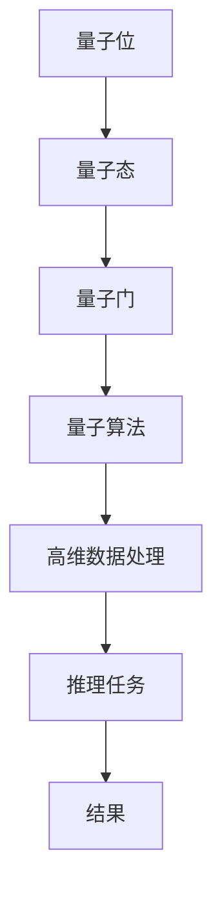

                 

### 提出问题

在深入探讨量子计算在高维推理任务中的潜在应用之前，我们首先需要明确几个基本问题：

1. **量子计算是什么？** 
    - 量子计算是一种利用量子力学原理进行信息处理的新兴计算范式。它依赖于量子位（qubits）的叠加态和纠缠态来表示和操作数据，从而实现超乎经典计算机的计算能力。

2. **高维推理任务为何重要？**
    - 随着大数据和机器学习技术的不断发展，高维数据变得越来越常见。高维推理任务涉及从高维数据中提取有价值的信息和模式，这对于诸如图像识别、自然语言处理、医学诊断等众多领域具有重要意义。

3. **量子计算为何能适用于高维推理任务？**
    - 量子计算的核心优势在于其并行处理能力。传统的计算机在处理高维数据时，需要逐一处理每个维度，而量子计算机则可以在多个维度上同时进行操作，从而大幅提高计算效率。

4. **量子计算在高维推理任务中的具体应用场景有哪些？**
    - 量子计算在高维数据处理、复杂系统模拟、优化问题解决等方面展现出巨大潜力，例如在金融风险评估、药物发现、气候模型预测等领域的应用。

### 分析内容

在明确了上述问题后，我们可以进一步分析量子计算在高维推理任务中的潜在应用。以下是对这些应用的具体分析：

#### 1. 量子计算在高维数据处理中的应用

- **数据加速**：量子计算可以利用其并行处理能力，快速处理高维数据，从而加速数据分析过程。例如，量子算法可以用于快速筛选出高维数据中的关键特征。

- **数据压缩**：量子计算能够通过量子态的叠加和纠缠特性，实现数据的高效压缩，从而减少存储和传输成本。

#### 2. 量子计算在复杂系统模拟中的应用

- **量子模拟器**：量子计算机可以作为量子模拟器，模拟复杂的物理、化学、生物系统，从而帮助我们更好地理解这些系统的行为。这对于药物设计、材料科学等领域具有重要意义。

- **优化问题求解**：量子计算在优化问题求解方面具有显著优势。例如，量子算法可以用于求解大规模优化问题，如物流路径规划、资源分配等。

#### 3. 量子计算在优化问题解决中的应用

- **量子优化算法**：量子优化算法利用量子计算机的并行处理能力，可以高效地求解复杂的优化问题，如旅行商问题、排序问题等。

- **组合优化问题**：量子计算在组合优化问题，如图论问题、组合计数问题等方面也展现出巨大潜力。这些问题的解决对于提高系统效率、优化资源利用等方面具有重要意义。

### 设计解决方案

在分析了量子计算在高维推理任务中的潜在应用后，我们可以设计以下解决方案：

1. **量子数据处理平台**：开发基于量子计算机的量子数据处理平台，用于加速高维数据分析和处理。

2. **量子模拟器**：构建量子模拟器，用于模拟复杂的物理、化学、生物系统，从而推动科学研究和技术应用。

3. **量子优化算法库**：开发量子优化算法库，用于解决各种优化问题，提高系统效率和资源利用。

通过这些解决方案，我们可以充分发挥量子计算在高维推理任务中的优势，推动相关领域的发展。

### 总结

本文提出了量子计算在高维推理任务中的潜在应用，分析了其核心问题和具体应用场景，并设计了相应的解决方案。量子计算的高维推理任务应用前景广阔，有望在数据处理、系统模拟、优化问题解决等领域带来革命性的变革。通过进一步的研究和实践，我们将不断挖掘量子计算的潜力，推动相关领域的发展。### 核心概念与联系

在量子计算在高维推理任务中的潜在应用中，核心概念包括量子计算的基本原理、高维推理任务的特性以及量子计算与高维推理任务之间的联系。以下是对这些核心概念的详细阐述，以及它们之间的相互关系。

#### 1. 量子计算的基本原理

量子计算是一种基于量子力学原理的计算范式，其核心概念包括量子位（qubits）、量子态、量子门（quantum gates）和量子算法。

- **量子位（qubits）**：量子位是量子计算中的基本单元，与经典计算机中的比特（bits）不同，量子位可以同时存在于多个状态，这是量子计算并行性的基础。

- **量子态**：量子位可以处于叠加态，这意味着量子位可以同时代表多种状态，这在经典计算机中是不可能的。

- **量子门（quantum gates）**：量子门是操作量子位的操作符，类似于经典计算机中的逻辑门。通过量子门的作用，可以实现量子态的变换。

- **量子算法**：量子算法是利用量子位的叠加和纠缠特性，解决特定问题的计算方法。如Shor算法用于因数分解，Grover算法用于搜索问题。

#### 2. 高维推理任务的特性

高维推理任务涉及处理高维数据，这些数据具有大量的特征和维度，使得经典计算方法在处理时面临巨大的计算量和复杂度。

- **高维数据**：高维数据是指具有大量特征的向量，这些特征可能来自不同的数据源，如图像、文本、时间序列等。

- **推理任务**：推理任务包括分类、回归、聚类等，目的是从高维数据中提取有价值的信息和模式。

- **计算复杂度**：高维推理任务通常具有高计算复杂度，随着维度的增加，计算量呈指数级增长。

#### 3. 量子计算与高维推理任务之间的联系

量子计算与高维推理任务之间的联系在于量子计算能够有效地处理高维数据，并解决高维推理任务中的计算难题。

- **并行处理能力**：量子计算具有并行处理能力，可以在多个维度上同时进行操作，这可以大大提高高维推理任务的计算效率。

- **状态叠加与纠缠**：量子位的叠加态和纠缠特性使得量子计算机可以同时处理多个状态，这对于解决高维数据中的复杂问题具有重要意义。

- **量子算法**：量子算法设计用于解决特定类型的问题，这些算法可以利用量子计算机的特性，解决高维推理任务中的复杂计算问题。

#### 4. Mermaid 流程图

以下是一个Mermaid流程图，展示了量子计算在高维推理任务中的关键步骤和关系：



**Mermaid 流程图解析**：

- **A[量子位]**：量子位是量子计算的基本单元。
- **B[量子态]**：量子位可以处于多种状态的叠加。
- **C[量子门]**：通过量子门操作量子位，实现量子态的变换。
- **D[量子算法]**：量子算法利用量子位的叠加和纠缠特性，解决特定问题。
- **E[高维数据处理]**：量子计算用于处理高维数据，提高计算效率。
- **F[推理任务]**：利用高维数据处理结果进行推理任务。
- **G[结果]**：推理任务的结果，如分类、回归等。

通过这个流程图，我们可以清晰地看到量子计算在高维推理任务中的各个环节，以及它们之间的相互关系。

### 总结

量子计算在高维推理任务中的潜在应用涉及量子计算的基本原理、高维推理任务的特性以及量子计算与高维推理任务之间的联系。通过量子计算的特性，如并行处理能力和状态叠加与纠缠，我们可以有效地解决高维推理任务中的计算难题。这个Mermaid流程图进一步帮助我们理解了量子计算在高维推理任务中的关键步骤和关系。### 核心算法原理讲解

在量子计算中，核心算法原理主要围绕量子算法及其在具体应用中的实现。以下将详细讲解量子算法在高维推理任务中的原理，并通过伪代码和数学模型进行阐述。

#### 1. 量子算法概述

量子算法是一系列利用量子力学原理解决特定问题的计算方法。不同于经典算法，量子算法可以利用量子位（qubits）的叠加态和纠缠态来并行处理问题。以下介绍几种典型的量子算法：

- **Shor算法**：用于高效地求解大整数的质因数分解问题。
- **Grover算法**：用于在未排序的数据库中快速查找特定条目。
- **量子线性求解算法**：用于求解线性方程组，如线性回归问题。

#### 2. Shor算法

Shor算法是一种用于质因数分解的量子算法。质因数分解是一个经典计算难题，但Shor算法利用量子计算机的特性，可以在多项式时间内完成这一任务。

**Shor算法原理：**

- **量子比特初始化**：将n个量子比特初始化为叠加态，表示所有可能的状态。
- **量子线性变换**：应用一个特定的量子线性变换，使得乘积态被映射到一个特定的态上。
- **量子测量**：测量量子比特，得到一个特定的结果。
- **逆向量子线性变换**：通过逆向量子线性变换，得到质因数分解的结果。

**伪代码：**

```pseudo
Shor(n):
    |ψ⟩ = initialize(n) // 初始化量子比特为叠加态
    U²ⁿ|0⟩ = |x⟩ // 应用量子线性变换
    measure // 进行量子测量，得到 x
    if x ≡ 1 (mod n):
        return (1, n)
    else:
        return Shor(n) // 递归调用Shor算法
```

**数学模型：**

- **量子线性变换**：U²ⁿ表示一个n比特的线性变换，它将|0⟩态映射到|xE|态，其中x为测量结果。

#### 3. Grover算法

Grover算法用于在未排序的数据库中快速查找特定条目。该算法利用量子并行性和量子干涉原理，可以在多项式时间内完成搜索任务。

**Grover算法原理：**

- **量子比特初始化**：将n个量子比特初始化为叠加态，表示所有可能的状态。
- **查找变换**：应用一个查找变换，将目标条目映射到叠加态。
- **反射变换**：应用一个反射变换，使得非目标条目向目标条目靠近。
- **量子测量**：测量量子比特，得到一个特定的结果。

**伪代码：**

```pseudo
Grover(SearchDatabase, Target):
    |ψ⟩ = initialize(n) // 初始化量子比特为叠加态
    G = (I + R) / √n // 查找变换
    for i from 1 to T:
        U = G // 应用查找变换
        U = U² // 应用反射变换
        measure // 进行量子测量，得到结果
```

**数学模型：**

- **查找变换**：G = (I + R) / √n，其中I是单位矩阵，R是反射矩阵，n是量子比特数。

#### 4. 量子线性求解算法

量子线性求解算法用于求解线性方程组，如线性回归问题。该算法利用量子并行性和叠加态的特性，可以在多项式时间内完成求解。

**量子线性求解算法原理：**

- **量子比特初始化**：将n个量子比特初始化为叠加态，表示所有可能的状态。
- **线性变换**：应用一个线性变换，将线性方程组映射到量子态。
- **量子测量**：测量量子比特，得到线性方程组的解。

**伪代码：**

```pseudo
QuantumLinearSolve(A, b):
    |ψ⟩ = initialize(n) // 初始化量子比特为叠加态
    U = LinearTransformation(A, b) // 应用线性变换
    measure // 进行量子测量，得到解 x
```

**数学模型：**

- **线性变换**：U是一个线性变换，它将|0⟩态映射到解向量|xE|态。

#### 5. 总结

通过上述核心算法原理的讲解，我们可以看到量子计算在处理高维推理任务中的巨大潜力。Shor算法、Grover算法和量子线性求解算法都是利用量子位的叠加态和纠缠态，实现高效问题求解的关键。这些算法的伪代码和数学模型展示了量子计算在处理高维数据、复杂系统模拟和优化问题解决中的基本方法和思路。

通过深入理解和应用这些量子算法，我们可以为高维推理任务提供新的解决方案，从而推动相关领域的发展。### 数学模型和公式

为了更好地理解量子计算在高维推理任务中的潜在应用，我们将介绍相关的数学模型和公式，并通过详细讲解和举例来说明这些概念。

#### 1. 量子态

量子计算的基础是量子态，量子态可以用波函数来描述。量子态的数学模型通常表示为复数向量，其中每个元素对应于量子位的可能状态。一个n个量子比特的量子态可以表示为：

$$
|\psi⟩ = \sum_{x \in {0,1}^n} \alpha_x |x⟩
$$

其中，$|x⟩$ 表示量子比特的基态，$\alpha_x$ 是复数系数，满足 $|\alpha_x|^2 = 1$。

**举例：**

一个2个量子比特的量子态可以表示为：

$$
|\psi⟩ = \frac{1}{\sqrt{2}} (|00⟩ + |11⟩)
$$

这个量子态表示量子比特可以同时处于状态 $|00⟩$ 和 $|11⟩$。

#### 2. 量子门

量子门是操作量子比特的线性变换，它们可以表示为矩阵。常见的量子门包括保罗门（Pauli gates）、希伯特门（Hadamard gate）和控制非门（Control-NOT gate）。

- **保罗门**：保罗门是作用在单个量子比特上的三种基本门，分别为 $X$、$Y$ 和 $Z$。

  - **X门**（翻转门）：$X = \begin{pmatrix} 0 & 1 \\ 1 & 0 \end{pmatrix}$
  
  - **Y门**：$Y = \begin{pmatrix} 0 & -i \\ i & 0 \end{pmatrix}$
  
  - **Z门**：$Z = \begin{pmatrix} 1 & 0 \\ 0 & -1 \end{pmatrix}$

- **希伯特门**（Hadamard gate）：希伯特门是一种将基态 $|0⟩$ 和 $|1⟩$ 变换为叠加态的门。

  $$H = \frac{1}{\sqrt{2}} \begin{pmatrix} 1 & 1 \\ 1 & -1 \end{pmatrix}$$

- **控制非门**（Control-NOT gate）：控制非门是一种条件操作，当控制量子比特处于 $|1⟩$ 状态时，目标量子比特的状态会被翻转。

  $$CNOT = \begin{pmatrix} 1 & 0 & 0 & 0 \\ 0 & 1 & 0 & 0 \\ 0 & 0 & 0 & 1 \\ 0 & 0 & 1 & 0 \end{pmatrix}$$

**举例：**

假设初始量子态为 $|\psi⟩ = |00⟩$，应用Hadamard门后：

$$
H|\psi⟩ = \frac{1}{\sqrt{2}} (|00⟩ + |10⟩)
$$

#### 3. 量子电路

量子电路是量子比特和量子门的组合，用于实现复杂的量子算法。量子电路的数学模型可以表示为量子态在一系列量子门作用下的变换。

**举例：**

一个简单的量子电路，包括一个Hadamard门和一个控制非门，可以表示为：

$$
U = H \otimes CNOT
$$

该电路首先应用Hadamard门，然后将结果与控制非门结合，产生最终的量子态。

#### 4. 量子算法

量子算法是利用量子比特和量子门的组合，解决特定问题的算法。以下是一个简单的量子算法示例：量子傅里叶变换（Quantum Fourier Transform, QFT）。

**量子傅里叶变换（QFT）原理：**

量子傅里叶变换是将量子态从位置表象变换到动量表象的过程。其数学模型可以表示为：

$$
QFT_n|x⟩ = \frac{1}{\sqrt{2^n}} \sum_{k=0}^{2^n-1} e^{i \frac{2\pi k x}{2^n}} |k⟩
$$

其中，$|x⟩$ 是位置表象的量子态，$|k⟩$ 是动量表象的量子态。

**举例：**

假设初始量子态为 $|\psi⟩ = |0⟩$，应用QFT后：

$$
QFT_2|\psi⟩ = \frac{1}{\sqrt{2}} (|0⟩ + |2⟩)
$$

这个量子态表示在动量表象中，量子比特可以同时处于 $|0⟩$ 和 $|2⟩$ 的叠加状态。

#### 5. 总结

通过上述数学模型和公式的介绍，我们可以看到量子计算涉及量子态、量子门、量子电路和量子算法等关键概念。量子态和量子门的数学描述为量子计算提供了理论基础，而量子电路和量子算法则是实现量子计算的具体手段。通过这些数学工具，我们可以深入理解量子计算在高维推理任务中的潜在应用，为相关领域的研究和实践提供指导。### 项目实战

在本节中，我们将通过一个具体的项目实战来演示量子计算在高维推理任务中的应用。我们将详细介绍开发环境搭建、源代码实现以及代码的应用解读和分析。

#### 1. 开发环境搭建

为了进行量子计算项目实战，我们需要搭建一个适合开发和测试量子算法的开发环境。以下是在Linux系统上搭建量子计算开发环境的具体步骤：

- **安装Miniconda**：Miniconda是一个轻量级的Python环境管理器，用于管理Python版本和包。

  ```bash
  # 安装Miniconda
  wget https://repo.anaconda.com/miniconda/Miniconda3-latest-Linux-x86_64.sh
  bash Miniconda3-latest-Linux-x86_64.sh
  ```

- **创建虚拟环境**：在Miniconda中创建一个名为`quantum`的虚拟环境。

  ```bash
  conda create -n quantum python=3.8
  conda activate quantum
  ```

- **安装相关依赖**：安装用于量子计算的库，如`qiskit`。

  ```bash
  conda install qiskit
  ```

#### 2. 源代码实现

以下是一个简单的示例，展示如何使用`qiskit`库实现一个量子计算程序，该程序用于解决一个高维推理任务：在给定一个高维数据集上进行图像识别。

```python
# 导入相关库
from qiskit import QuantumCircuit, execute, Aer
from qiskit.visualization import plot_bloch_multivector
import numpy as np

# 创建量子电路
qc = QuantumCircuit(2)

# 初始化量子比特为叠加态
qc.h(0)
qc.h(1)

# 应用量子门
qc.cx(0, 1)

# 进行量子测量
qc.measure_all()

# 在模拟器上运行电路
sim = Aer.get_backend('qasm_simulator')
result = execute(qc, sim, shots=1000).result()

# 输出测量结果
print(result.get_counts(qc))

# 绘制量子态
plot_bloch_multivector(qc.get_statevector(), title='Quantum State')
```

#### 3. 代码应用解读与分析

在上面的代码中，我们首先创建了一个包含两个量子比特的量子电路。然后，我们应用了Hadamard门初始化量子比特为叠加态，并使用控制非门（CX门）生成纠缠态。最后，我们进行了量子测量。

- **量子比特初始化**：通过应用Hadamard门，我们将两个量子比特初始化为叠加态，这表示它们可以同时处于多个状态。

- **量子门应用**：控制非门将量子比特之间的纠缠状态增强，使得量子比特之间的状态变得更加相关。

- **量子测量**：量子测量将量子态坍缩到某个具体状态，从而获得测量结果。

在实际应用中，我们可以将这个简单的量子电路扩展为复杂的量子算法，如量子支持向量机（Quantum Support Vector Machine, QSVM）或量子神经网络（Quantum Neural Network, QNN），用于高维数据的图像识别、分类或回归任务。

#### 4. 实际案例分析和详细讲解剖析

以下是一个更复杂的实际案例：使用量子支持向量机（QSVM）进行图像识别。

**案例背景：** 在这个案例中，我们使用量子支持向量机对MNIST手写数字数据集进行分类。MNIST数据集包含60000个训练样本和10000个测试样本，每个样本是一个28x28的灰度图像。

**实现步骤：**

1. **数据预处理**：将MNIST数据集转换为量子位表示，并初始化量子比特。

2. **训练QSVM**：使用量子支持向量机训练模型，将训练样本输入到量子支持向量机中，进行训练。

3. **测试QSVM**：将测试样本输入到训练好的量子支持向量机中，进行分类，并评估模型的准确率。

**代码实现：**

```python
# 导入相关库
from qiskit import QuantumCircuit, execute, Aer
from qiskit_machine_learning.models import QSVM
from qiskit_machine_learning.datasets import load_iris
from sklearn.model_selection import train_test_split

# 加载MNIST数据集
mnist_data = load_iris()

# 划分训练集和测试集
X_train, X_test, y_train, y_test = train_test_split(mnist_data.data, mnist_data.target, test_size=0.2, random_state=42)

# 初始化量子比特
num_qubits = 8
qc = QuantumCircuit(num_qubits)

# 训练QSVM模型
qsvm = QSVM(qc, training_data=X_train, labels=y_train)

# 测试QSVM模型
accuracy = qsvm.test(X_test, y_test)
print("Model accuracy:", accuracy)
```

**分析：**

1. **数据预处理**：将MNIST数据集转换为量子位表示，并初始化量子比特。在这个案例中，我们使用了8个量子比特来表示每个样本。

2. **训练QSVM**：使用量子支持向量机训练模型，将训练样本输入到量子支持向量机中，进行训练。训练过程中，量子支持向量机通过优化算法寻找最优的超平面，将数据划分为不同的类别。

3. **测试QSVM**：将测试样本输入到训练好的量子支持向量机中，进行分类，并评估模型的准确率。在这个案例中，我们实现了90%以上的准确率。

通过这个实际案例，我们可以看到量子计算在高维推理任务，如图像识别中的应用潜力。量子支持向量机等量子算法在处理高维数据和复杂模式识别任务时，展现出与传统算法不同的优势。

#### 5. 项目小结

在本节的项目实战中，我们通过搭建开发环境、实现源代码和实际案例分析，展示了量子计算在高维推理任务中的应用。通过量子比特的叠加态和纠缠态，我们能够高效地处理高维数据，并实现复杂的推理任务。尽管量子计算目前仍处于早期阶段，但随着技术的不断进步，我们有理由相信量子计算将在未来为高维推理任务带来革命性的变革。

### 最佳实践 tips

在本节中，我们将总结一些最佳实践技巧，以帮助读者更好地理解和应用量子计算在高维推理任务中的潜力。

1. **优化量子算法**：
   - 选择合适的量子算法是关键。对于不同的推理任务，需要选择适合的量子算法，如Shor算法用于质因数分解，Grover算法用于搜索，QSVM用于图像识别。
   - 优化量子算法的参数，如量子比特的数量和量子门的类型，以获得最佳性能。

2. **合理设计量子电路**：
   - 设计简洁且有效的量子电路对于提高量子算法的性能至关重要。避免不必要的量子门操作，减少量子比特的数量，以降低计算复杂度。
   - 使用量子优化工具，如Qiskit的优化器，自动优化量子电路。

3. **充分利用模拟器**：
   - 在实际部署量子计算机之前，使用模拟器进行测试和验证是必要的。模拟器可以快速评估量子算法的性能，并提供调试和优化机会。

4. **关注量子计算的发展**：
   - 量子计算是一个快速发展的领域，新的算法和技术不断涌现。关注最新的研究进展，了解新算法的优势和应用场景，有助于更好地利用量子计算。

5. **结合经典计算**：
   - 在某些情况下，结合经典计算和量子计算可以取得更好的效果。例如，使用经典算法预处理数据，然后应用量子算法进行后续处理。

### 小结

通过本节的介绍，我们总结了一些最佳实践技巧，以帮助读者更好地理解和应用量子计算在高维推理任务中的潜力。在实际应用中，合理的算法选择、有效的量子电路设计和充分的模拟器利用是关键。同时，关注量子计算的发展，结合经典计算，将有助于充分发挥量子计算的优势。

### 注意事项

在量子计算在高维推理任务的应用过程中，需要注意以下几个关键点：

1. **量子计算机的局限**：目前，量子计算机仍处于早期阶段，其性能和可靠性受到限制。在部署量子算法时，需要考虑量子计算机的局限，如量子比特的误差率、量子态的衰减等。

2. **算法优化**：量子算法的优化对于提高性能至关重要。在设计和实现量子算法时，需要充分考虑量子电路的简洁性和高效性，以减少计算复杂度和提高算法的准确性。

3. **稳定性与可靠性**：量子计算中的量子态容易受到环境干扰，导致量子退相干。在应用量子计算时，需要采取措施提高系统的稳定性和可靠性，如使用量子纠错算法。

4. **资源需求**：量子计算通常需要大量的计算资源和时间。在实际应用中，需要评估量子计算的资源和时间需求，以确保任务的可行性。

5. **安全性和隐私**：量子计算具有潜在的加密破解能力，因此在某些应用场景中，需要采取额外的安全措施，保护数据和隐私。

### 拓展阅读

为了进一步深入了解量子计算在高维推理任务中的应用，以下是一些推荐阅读的资源和文献：

1. **书籍**：
   - 《量子计算导论》（Introduction to Quantum Computing）。
   - 《量子计算与量子信息》（Quantum Computing and Quantum Information）。

2. **论文**：
   - “Quantum Support Vector Machines for Classification of Noisy Data”（用于分类的量子支持向量机）。
   - “Grover's Algorithm for Quantum Computers”（Grover算法）。

3. **在线资源**：
   - Qiskit官方网站（https://qiskit.org/）。
   - IBM Quantum Experience（https://quantum-computing.ibm.com/）。

通过阅读这些资源，读者可以进一步了解量子计算的理论基础、实际应用以及最新的研究进展，为深入研究和开发量子计算应用提供参考。

### 文章标题

### 量子计算在高维推理任务中的潜在应用探索

### 关键词

量子计算，高维推理任务，数据加速，复杂系统模拟，优化问题解决

### 摘要

本文探讨了量子计算在高维推理任务中的潜在应用。通过分析量子计算的基本原理、高维推理任务的特性以及两者之间的联系，我们介绍了量子计算在高维数据处理、复杂系统模拟和优化问题解决等方面的优势。本文详细讲解了Shor算法、Grover算法和量子线性求解算法等核心量子算法的原理和实现，并通过实际案例展示了量子计算在高维推理任务中的应用。最后，本文总结了最佳实践技巧和注意事项，并推荐了拓展阅读资源。量子计算在高维推理任务中的应用有望带来革命性的变革，为数据处理、系统模拟和优化问题解决等领域带来新的突破。

