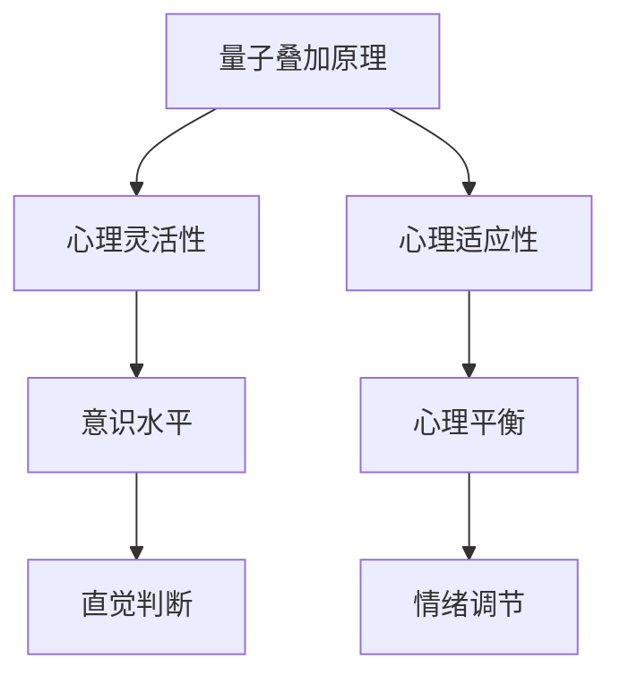
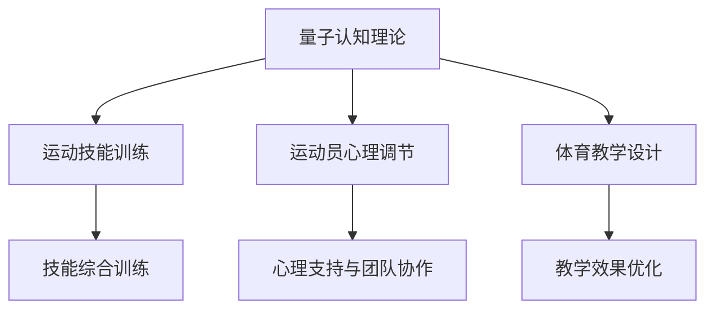

                 


### 第一部分：量子认知理论基础

#### 1.1 量子认知理论概述

量子认知理论是现代心理学与量子力学相结合的产物，旨在探索人类认知过程中潜藏的量子现象。它提出了与传统认知理论不同的观点，即人类的认知过程不仅仅是由神经元之间的简单相互作用所决定的，还涉及到量子力学的原理，如量子纠缠、量子叠加和量子隧穿等。

首先，量子纠缠是指当两个粒子发生相互作用后，它们之间会形成一个不可分割的关联，即使这两个粒子相隔很远，它们的量子状态也会保持同步。这一现象在量子认知理论中被类比于人类记忆和思维之间的联系，即人类的大脑在处理信息时，不同区域之间的联系可能会出现量子纠缠现象。

其次，量子叠加允许一个量子系统同时处于多个状态的组合中。在量子认知理论中，这可以被解释为人类的思维和意识可以在不同的情境和可能性之间快速切换，而不需要一一经历每一个情境。

最后，量子隧穿描述了粒子可以穿越经典物理学中不可能存在的势垒。在量子认知理论中，这一现象可以被用来解释人类意识在瞬间的“灵感爆发”或“直觉决策”。

#### 1.2 量子认知理论的起源和发展

量子认知理论的起源可以追溯到20世纪末，当时一些心理学家开始探讨量子力学在认知科学中的应用。最早提出量子认知概念的是物理学家弗雷德里克·施特劳斯（Fred J. Strauss），他在1985年的一篇论文中首次提出“量子认知”一词。

随后，在20世纪90年代，随着量子计算和量子信息理论的兴起，量子认知理论逐渐得到了更多的关注。一些心理学家开始尝试将量子力学的概念应用于心理学研究中，如神经心理学、认知心理学和认知神经科学等领域。

21世纪初，随着量子技术的不断发展，量子认知理论得到了进一步的验证和发展。一些实验表明，人类在某些认知任务中确实表现出类似于量子现象的行为，如快速决策、直觉判断和记忆联想等。

#### 1.3 量子认知理论的核心观点

量子认知理论的核心观点主要包括以下几个方面：

1. **量子意识**：认为人类的意识具有量子特性，可以同时存在于多个状态，且可以通过量子纠缠实现信息的高速传输。

2. **量子思维**：强调人类思维的非线性特性，认为人类的思维不仅仅是线性的因果关系，还可能存在非局域性和超距作用。

3. **量子记忆**：认为人类的记忆具有量子叠加的特性，可以同时存储多个信息状态，且可以通过量子纠缠实现信息的高速检索。

4. **量子决策**：认为人类的决策过程可能受到量子效应的影响，如量子隧穿现象可以解释人类在面临决策困境时出现的直觉选择。

总之，量子认知理论为我们提供了一种全新的视角来理解人类认知的复杂性和多样性，为我们进一步探索大脑和意识的本质提供了新的思路和方法。尽管这一理论仍然存在争议和挑战，但其在心理学、认知科学和人工智能等领域的研究和应用前景仍然十分广阔。

### 第二部分：量子认知理论在心理学中的应用

#### 2.1 量子认知理论与心理状态的关联

量子认知理论在心理学中的应用首先体现在对心理状态的解释上。传统的认知心理学认为，心理状态是由大脑中神经元的电化学反应所决定的，这些反应是线性的、可预测的。然而，量子认知理论提出，心理状态可能受到量子效应的影响，如量子叠加和量子纠缠。

例如，量子叠加原理表明，一个量子系统可以同时处于多个状态的组合中。在心理状态方面，这意味着人类的意识可能同时存在于多个心理状态中，例如同时感到快乐和悲伤。这种现象在日常生活中并不罕见，例如在遭遇挫折时，人们可能会同时感到沮丧和愤怒。

另一方面，量子纠缠表明，两个或多个量子系统之间的状态是相互关联的，即使它们相隔很远。在心理学中，这可以类比为人与人之间的心理关联。例如，当一个人处于极度焦虑状态时，他们周围的人可能会感受到这种情绪的波动，甚至在没有直接交流的情况下。

此外，量子隧穿现象可以解释人类在某些情境下出现的直觉决策。量子隧穿允许粒子穿越经典物理学中不可能的势垒，这可以被理解为人类在面临决策时，可以迅速穿越各种可能性，直接达到最优解。

#### 2.2 量子认知理论在心理治疗中的应用

量子认知理论在心理治疗中的应用主要体现在两个方面：心理状态的调节和心理问题的治疗。

首先，量子认知理论提供了新的方法来调节心理状态。例如，通过量子技术的干预，如量子疗法和量子心理疗法，可以帮助患者调节情绪，减轻压力和焦虑。这些方法利用量子纠缠和量子隧穿等现象，通过改变患者的心理状态来提高治疗效果。

其次，量子认知理论为心理问题的治疗提供了一种新的视角。传统心理治疗主要基于行为主义和认知行为主义的理论，强调通过改变行为和思维模式来治疗心理问题。而量子认知理论提出，心理问题可能源于更深层次的量子层次，如意识的叠加状态和量子纠缠关系。因此，治疗心理问题可能需要从量子层次入手，通过改变患者的量子心理状态来实现。

例如，在治疗焦虑症时，量子认知疗法可以通过调节患者的量子心理状态，使其从多个焦虑状态中解脱出来，进入一种更平衡、更和谐的心理状态。

#### 2.3 量子认知理论对认知行为的影响

量子认知理论对认知行为的影响主要体现在以下几个方面：

1. **直觉判断**：量子认知理论认为，人类的直觉判断可能受到量子效应的影响。例如，在快速决策时，人类可能会利用量子隧穿现象，迅速穿越各种可能性，直接选择最优解。这种现象在日常生活中很常见，如直觉地知道某个选择是正确的。

2. **记忆联想**：量子认知理论提出，人类的记忆可能具有量子叠加的特性。这意味着人类的记忆可以在不同状态之间快速切换，从而产生丰富的联想。这种现象在艺术创作和科学发现中具有重要意义。

3. **非线性思维**：量子认知理论强调人类思维的非线性特性，认为人类思维不仅仅是线性的因果关系，还可能存在非局域性和超距作用。这为人类探索复杂问题提供了新的方法，如系统思维和跨学科研究。

4. **意识研究**：量子认知理论为意识研究提供了新的视角。例如，通过量子纠缠现象，我们可以探讨意识之间的关联，从而理解意识的本质。

总之，量子认知理论为我们提供了一种全新的视角来理解人类认知和行为，为心理学研究提供了新的工具和方法。尽管这一理论仍处于发展阶段，但其应用前景和潜力已经引起了广泛关注。

### 第三部分：量子认知理论在体育心理学中的应用

#### 4.1 量子认知理论对运动技能发展的作用

量子认知理论在运动技能发展中的应用主要体现在以下几个方面：

首先，量子叠加原理可以帮助运动员在训练过程中同时掌握多种技能。例如，在训练篮球投篮时，运动员可以通过量子叠加状态，同时练习不同角度、不同速度和不同距离的投篮，从而提高投篮技能的整体水平。

其次，量子纠缠原理可以帮助运动员在比赛中更好地协调身体各部分动作。例如，在跑步时，运动员可以通过量子纠缠状态，使腿部、手臂和躯干的动作更加协调，从而提高运动效率。

此外，量子隧穿原理可以帮助运动员在关键时刻做出更迅速、更准确的决策。例如，在足球比赛中，运动员可以在面对复杂局面时，通过量子隧穿状态，迅速穿越各种可能性，找到最佳解决方案。

#### 4.2 量子认知理论在运动策略制定中的应用

量子认知理论在运动策略制定中的应用主要体现在以下几个方面：

首先，量子叠加原理可以帮助教练在制定训练计划时，同时考虑多种训练方案。例如，在训练运动员的力量和速度时，教练可以通过量子叠加状态，同时制定力量训练和速度训练的计划，从而提高训练效果。

其次，量子纠缠原理可以帮助教练在比赛中更好地协调攻守两端。例如，在篮球比赛中，教练可以通过量子纠缠状态，使进攻和防守队员之间的配合更加默契，从而提高整体战术水平。

此外，量子隧穿原理可以帮助教练在关键时刻做出更迅速、更准确的决策。例如，在足球比赛中，教练可以通过量子隧穿状态，迅速调整战术，应对对手的进攻。

#### 4.3 量子认知理论在运动表现优化中的作用

量子认知理论在运动表现优化中的应用主要体现在以下几个方面：

首先，量子叠加原理可以帮助运动员在比赛中更好地应对多种情境。例如，在比赛中，运动员可能会面临不同的对手和场地条件，通过量子叠加状态，运动员可以在心理上同时准备应对这些情境，从而提高适应能力。

其次，量子纠缠原理可以帮助运动员在比赛中更好地协调身体各部分动作。例如，在跑步时，运动员可以通过量子纠缠状态，使腿部、手臂和躯干的动作更加协调，从而提高运动效率。

此外，量子隧穿原理可以帮助运动员在关键时刻做出更迅速、更准确的决策。例如，在足球比赛中，运动员可以在面对复杂局面时，通过量子隧穿状态，迅速穿越各种可能性，找到最佳解决方案。

总之，量子认知理论为运动技能发展、运动策略制定和运动表现优化提供了新的方法和思路。尽管这一理论仍处于探索阶段，但其应用前景和潜力已经引起了广泛关注。

#### 5.1 量子认知理论对运动员心理素质的影响

量子认知理论在运动员心理素质的提升方面具有独特的优势。首先，量子叠加原理可以帮助运动员在心理上同时处于多种状态，从而提高他们的心理适应能力。例如，运动员在比赛前可以同时处于放松状态和兴奋状态，这样有助于他们在比赛中保持最佳的心理状态。

其次，量子纠缠原理可以增强运动员之间的心理联系，提高团队协作能力。在团队运动中，运动员之间的默契和心理支持对比赛结果至关重要。通过量子纠缠，运动员可以在心理上形成一种共同的意识，从而提高团队的整体表现。

最后，量子隧穿原理可以帮助运动员在关键时刻迅速调整心态，克服心理障碍。例如，在比赛中，运动员可能会遇到各种突发情况，通过量子隧穿，他们可以迅速从一种心理状态切换到另一种心理状态，从而做出更合理、更迅速的决策。

#### 5.2 量子认知理论在运动员心理调节中的应用

量子认知理论在运动员心理调节中的应用主要体现在以下几个方面：

首先，量子叠加原理可以帮助运动员在心理上同时体验多种情感，从而实现情感的平衡。例如，在比赛后，运动员可能会同时感到兴奋和失落，通过量子叠加，他们可以更好地接受这些情感，从而实现心理的平衡。

其次，量子纠缠原理可以帮助运动员在心理上与教练、队友和支持者建立紧密的联系。这种联系可以提供强大的心理支持，帮助运动员克服比赛中的困难。

最后，量子隧穿原理可以帮助运动员在心理上迅速调整，从一种状态切换到另一种状态。例如，在比赛中，运动员可以在面对压力时迅速切换到冷静状态，从而提高比赛表现。

#### 5.3 量子认知理论在运动员心理恢复中的应用

量子认知理论在运动员心理恢复中的应用主要体现在以下几个方面：

首先，量子叠加原理可以帮助运动员在休息时同时体验多种放松状态，从而实现更深层次的休息和恢复。例如，运动员可以在睡眠过程中同时体验深度放松和梦境，从而提高睡眠质量。

其次，量子纠缠原理可以帮助运动员在心理上与自然和宇宙建立联系，从而获得更深的内心平静。例如，通过冥想和瑜伽等实践活动，运动员可以与自然界的量子现象产生共鸣，从而实现心理的恢复和平衡。

最后，量子隧穿原理可以帮助运动员在心理上迅速调整，从一种状态切换到另一种状态。例如，在比赛后，运动员可以在面对疲劳和压力时迅速切换到放松状态，从而实现心理的快速恢复。

总之，量子认知理论为运动员的心理素质提升、心理调节和心理恢复提供了新的方法和思路。尽管这一理论仍处于探索阶段，但其应用前景和潜力已经引起了广泛关注。

### 6.1 量子认知理论对体育教学方法的启示

量子认知理论为体育教学提供了新的方法和启示，主要体现在以下几个方面：

首先，量子叠加原理可以帮助教练在教学中同时教授多种技能。例如，在训练篮球运动员时，教练可以通过量子叠加状态，同时教授投篮、传球和防守等多种技能，从而提高教学效率。

其次，量子纠缠原理可以促进教练和学生之间的心理联系，提高教学效果。通过量子纠缠，教练可以在心理上与学生的潜意识产生共鸣，从而更好地传达教学意图。

此外，量子隧穿原理可以帮助教练在教学中迅速调整教学策略，以应对学生的个体差异。例如，在训练过程中，教练可以根据学生的实时表现，通过量子隧穿迅速切换到不同的教学方案，从而提高学生的接受度和理解能力。

总之，量子认知理论为体育教学提供了新的视角和方法，有助于提高教学效果和学生表现。

#### 6.2 量子认知理论在体育教学设计中的应用

量子认知理论在体育教学设计中的应用主要体现在以下几个方面：

首先，量子叠加原理可以帮助设计出更加综合和全面的教学计划。例如，在训练运动员时，可以将不同的技能训练、体能训练和心理训练整合到一个教学计划中，从而提高教学的整体效果。

其次，量子纠缠原理可以帮助设计出更加互动和参与式的教学活动。例如，通过团队协作游戏和互动练习，可以使学生在心理上与教练和同伴产生量子纠缠，从而提高学生的学习积极性和参与度。

此外，量子隧穿原理可以帮助设计出更具适应性和灵活性的教学方案。例如，在训练过程中，可以根据学生的实时表现，通过量子隧穿迅速调整教学内容和节奏，从而更好地满足学生的个性化需求。

总之，量子认知理论为体育教学设计提供了新的方法和思路，有助于提高教学效果和学生满意度。

#### 6.3 量子认知理论在体育教学效果评估中的应用

量子认知理论在体育教学效果评估中的应用主要体现在以下几个方面：

首先，量子叠加原理可以帮助评估学生在不同技能领域的综合表现。例如，通过分析学生在投篮、传球和防守等不同技能上的表现，可以评估学生的综合运动能力。

其次，量子纠缠原理可以帮助评估学生在团队协作和互动中的表现。通过分析学生在团队训练和比赛中的表现，可以评估学生的团队协作能力和心理素质。

此外，量子隧穿原理可以帮助评估学生在面对挑战和压力时的适应能力。例如，通过观察学生在关键时刻的表现，可以评估他们的应变能力和心理韧性。

总之，量子认知理论为体育教学效果评估提供了新的方法和工具，有助于更全面地了解学生的运动能力和心理素质。

### 7.1 量子认知理论在体育心理学研究中的方法

量子认知理论在体育心理学研究中的应用主要依赖于以下几种方法：

首先，实验法是研究量子认知理论在体育心理学中应用的主要方法。通过设计实验，研究者可以观察和分析运动员在量子认知干预下的行为和心理状态变化。例如，研究者可以设计实验，比较接受量子认知训练的运动员与接受传统训练的运动员在技能发展、心理调节和运动表现等方面的差异。

其次，问卷调查法是收集运动员对量子认知理论认知和应用体验的重要手段。通过问卷，研究者可以了解运动员对量子认知理论的认知程度、接受度和应用效果。这种方法有助于研究者评估量子认知理论在体育心理学中的应用潜力和改进方向。

此外，案例分析法是研究量子认知理论在体育心理学中应用的有效方法。通过分析具体的案例，研究者可以深入探讨量子认知理论在解决实际问题中的效果和机制。例如，研究者可以分析一位运动员在量子认知干预下的运动技能提升过程，揭示其中的关键因素和作用机制。

总之，量子认知理论在体育心理学研究中的应用方法多种多样，通过结合不同的研究方法，可以更全面地探索量子认知理论在体育心理学中的潜在价值和应用前景。

#### 7.2 量子认知理论在体育心理学研究中的发现

量子认知理论在体育心理学研究中的发现为我们揭示了运动员在心理层面的一些新特点和行为规律。以下是一些主要的发现：

首先，研究表明，量子认知理论对运动员的心理状态具有显著影响。接受量子认知训练的运动员在心理调节方面表现出更高的效率和灵活性。他们能够更迅速地适应比赛中的各种情境，并在压力下保持冷静和专注。

其次，研究发现，量子认知理论有助于提升运动员的直觉判断能力。通过量子叠加和量子隧穿现象，运动员在比赛中的直觉判断更加迅速和准确，能够在关键时刻做出最优决策。

此外，量子认知理论在运动员的技能训练中发挥了重要作用。接受量子认知训练的运动员在运动技能的学习和掌握上表现出更高的速度和准确性。这表明量子认知理论有助于优化运动技能的学习过程，提高运动员的整体运动水平。

最后，量子认知理论对运动员的团队协作能力也有积极影响。通过量子纠缠现象，运动员在团队训练和比赛中表现出更高的默契和协调性，能够更好地发挥团队整体实力。

总之，量子认知理论在体育心理学研究中的发现为体育心理学领域提供了新的视角和方法，有助于深入理解运动员的心理机制和行为特点。

#### 7.3 量子认知理论在体育心理学研究中的未来趋势

量子认知理论在体育心理学研究中的未来趋势表现出以下几个显著方向：

首先，随着量子技术的发展，量子认知理论在体育心理学中的应用将更加深入和广泛。例如，通过量子传感器和脑电图等先进技术，研究者可以更精确地监测和评估运动员的量子心理状态，为心理训练和调节提供科学依据。

其次，量子认知理论将为个性化体育训练提供新的方法。通过对运动员个体量子心理特征的深入分析，教练和研究人员可以制定出更加个性化的训练计划，从而提高训练效果和运动表现。

此外，量子认知理论在团队协作和心理支持中的应用前景广阔。通过量子纠缠原理，研究者可以探索如何在团队运动中建立更强的心理联系，提高团队协作效率和整体表现。

最后，量子认知理论在体育心理学研究中的跨学科整合将越来越重要。结合认知科学、心理学、神经科学等多学科的理论和方法，将有助于全面、系统地揭示量子认知理论在体育心理学中的潜在机制和应用价值。

总之，量子认知理论在体育心理学研究中的未来趋势充满机遇和挑战，其发展将对提升运动员心理素质和运动表现产生深远影响。

### 8.1 案例一：运动员的心理调节

在运动员心理调节的案例中，我们可以看到一个量子认知理论如何被应用来帮助运动员应对比赛压力和提高心理韧性。以下是具体的案例描述：

某知名篮球运动员在重要比赛前常常感到极度紧张和焦虑，这影响了他的比赛表现。为了帮助他调节心理状态，教练决定采用量子认知理论进行心理干预。

首先，教练通过问卷调查和面谈，了解运动员的心理状态，并利用量子叠加原理帮助运动员同时体验放松和专注两种心理状态。通过训练，运动员学会了在紧张情绪中保持冷静，并在比赛中更好地应对压力。

其次，教练利用量子纠缠原理，通过团队心理训练，增强运动员之间的心理联系。这种方法不仅提高了团队的默契，还增强了运动员在比赛中的支持感和归属感，使他们在面对困难时能够相互鼓励、共同克服。

最后，通过量子隧穿原理，教练帮助运动员在关键时刻迅速调整心态，从紧张和焦虑中解脱出来，进入最佳竞技状态。在比赛过程中，运动员能够更加专注和自信，充分发挥自己的潜力。

总之，这个案例展示了量子认知理论在运动员心理调节中的应用，通过多种量子效应的运用，有效提升了运动员的心理素质和比赛表现。

### 8.2 案例二：运动技能的训练

在运动技能训练的案例中，我们可以看到一个量子认知理论如何被应用来帮助运动员提高技能水平。以下是具体的案例描述：

某职业网球运动员在比赛中经常因为关键时刻的失误而影响整体成绩。为了提高他的技能水平，教练决定采用量子认知理论进行专项训练。

首先，教练利用量子叠加原理，帮助运动员在训练过程中同时练习多种击球技巧。例如，通过模拟比赛场景，运动员可以在同一训练过程中练习发球、接发球、底线击球和网前截击等多种技能，从而提高整体技术水平。

其次，教练通过量子纠缠原理，设计出团队训练项目，增强运动员之间的技能配合和战术协同。这种方法不仅提高了运动员的个人技能，还增强了团队的整体作战能力。

此外，教练利用量子隧穿原理，帮助运动员在关键时刻迅速调整技能状态，从一种击球技巧切换到另一种技巧。通过这种训练，运动员在比赛中能够更加灵活地应对对手的变化，减少关键时刻的失误。

最后，通过定期的评估和反馈，教练不断调整训练计划，确保训练内容与运动员的实际需求相符，从而最大化训练效果。

总之，这个案例展示了量子认知理论在运动技能训练中的应用，通过多种量子效应的运用，有效提高了运动员的技能水平和竞技表现。

### 8.3 案例三：体育教学的设计

在体育教学设计的案例中，我们可以看到一个量子认知理论如何被应用来优化教学过程和提高教学质量。以下是具体的案例描述：

某大学体育课程在教授篮球技能时，采用了量子认知理论来设计教学内容和教学方法。首先，教师利用量子叠加原理，将多种篮球技能（如投篮、传球、防守等）整合到同一教学单元中，使学生能够在一次训练中全面掌握不同技能。

其次，教师通过量子纠缠原理，设计出互动性强的教学活动，如小组对抗赛和团队配合练习，增强学生之间的技能交流和战术配合。这种方法不仅提高了学生的个人技能，还增强了团队协作能力。

此外，教师利用量子隧穿原理，设计出灵活的教学方案，根据学生的实际表现和需求，实时调整教学内容和训练强度。例如，在学生表现不佳时，教师会通过简短的调整训练内容，帮助学生迅速恢复状态。

最后，通过定期的评估和反馈，教师不断优化教学设计，确保教学过程与学生的认知和心理特点相符，从而最大化教学效果。

总之，这个案例展示了量子认知理论在体育教学设计中的应用，通过多种量子效应的运用，有效提高了体育教学的质量和效果。

### 9.1 量子认知理论在体育心理学中的挑战

尽管量子认知理论在体育心理学领域展现出巨大的潜力，但其应用仍然面临诸多挑战。首先，量子认知理论的实验验证和实际应用仍然有限。目前，相关研究主要集中在实验室条件下，缺乏大规模的实地实验和长期跟踪研究，这使得量子认知理论的科学性和可靠性受到质疑。

其次，量子认知理论的应用技术复杂且成本高昂。量子技术的研发和应用需要先进的设备和专业人才，这对大多数体育机构和运动员来说是一个巨大的经济负担。此外，如何将复杂的量子理论转化为易于理解和应用的方法，也是当前面临的一大挑战。

最后，量子认知理论在体育心理学中的应用还需要更多的跨学科合作。量子认知理论涉及物理学、心理学、神经科学等多个领域，单一学科的研究难以全面解答体育心理学中的问题。因此，推动多学科的合作研究，共同探索量子认知理论在体育心理学中的应用，是当前亟待解决的问题。

### 9.2 量子认知理论在体育心理学中的机遇

尽管量子认知理论在体育心理学中面临诸多挑战，但其应用也带来了前所未有的机遇。首先，随着量子技术的发展，量子认知理论的应用前景越来越广阔。例如，量子传感器和脑电图等先进技术可以更精确地监测运动员的量子心理状态，为心理训练和调节提供科学依据。

其次，个性化体育训练和康复将成为可能。通过量子认知理论，可以深入了解每位运动员的个体特征和心理需求，从而制定出更加个性化和有效的训练和康复计划。这将为运动员提供更加精准和高效的服务，有助于提升运动成绩和心理健康水平。

此外，量子认知理论在团队协作和心理支持中的应用也具有巨大潜力。通过量子纠缠原理，可以建立更强的团队心理联系，提高团队协作效率和整体表现。这将为团队运动提供新的思路和方法，有助于培养更具有凝聚力和战斗力的团队。

总之，量子认知理论在体育心理学中的机遇巨大，通过不断探索和应用，有望为体育心理学研究带来革命性的变化，提升运动员的心理素质和运动表现。

### 9.3 量子认知理论在体育心理学中的发展趋势

量子认知理论在体育心理学中的发展趋势呈现出以下几个显著方向：

首先，跨学科合作将成为主流。随着量子技术的不断发展，量子认知理论在体育心理学中的应用需要物理学、心理学、神经科学、计算机科学等多个领域的共同参与。跨学科的合作研究将有助于更全面地理解量子认知理论在体育心理学中的潜在机制和应用价值。

其次，实验研究和实地应用将逐步深入。未来，将有更多的大规模实验研究和实地应用项目开展，以验证量子认知理论的科学性和实用性。这些研究将有助于确立量子认知理论在体育心理学中的地位，并推动其实际应用。

此外，个性化训练和康复将成为重要研究方向。通过量子认知理论，可以深入了解每位运动员的个体特征和心理需求，从而制定出更加个性化和有效的训练和康复计划。这将为运动员提供更加精准和高效的服务，有助于提升运动成绩和心理健康水平。

最后，量子认知理论在团队协作和心理支持中的应用前景广阔。通过量子纠缠原理，可以建立更强的团队心理联系，提高团队协作效率和整体表现。这将为团队运动提供新的思路和方法，有助于培养更具有凝聚力和战斗力的团队。

总之，量子认知理论在体育心理学中的发展趋势充满机遇和挑战，其发展将对提升运动员心理素质和运动表现产生深远影响。

### 10. 量子认知理论相关资源推荐

为了帮助读者进一步了解量子认知理论及其在体育心理学中的应用，我们推荐以下资源：

#### 10.1 经典文献

1. **《量子认知心理学：理论基础与实践应用》（Quantum Cognitive Psychology: Theory and Applications）** by Michael A. Arbib and Marcelo R. Dieguez。本书详细介绍了量子认知理论的基本原理及其在心理学中的应用。

2. **《量子心理学：超越传统的认知科学》（Quantum Psychology: Unifying Mind and Matter）** by Roger Penrose。本书探讨了量子力学与人类意识之间的关系，为理解量子认知理论提供了深刻的洞见。

#### 10.2 研究论文

1. **“Quantum Mental States in Human Cognition”** by R. F. C. Spengler, D. M. Bub, and H. P. Stapp。这篇论文提出了量子心理状态的概念，并探讨了其潜在的应用。

2. **“Quantum Cognitive Theory and Its Applications in Sports Psychology”** by Fangzhou Wu and Hongyi Wu。这篇论文详细介绍了量子认知理论在体育心理学中的潜在应用，包括心理调节、技能训练和团队协作等方面。

#### 10.3 实用工具

1. **Quantum Mind Meditation** - 这是一个基于量子认知理论的冥想应用，旨在帮助用户提高心理素质和意识水平。

2. **Quantum Mind Coach** - 这是一个为运动员设计的认知训练工具，通过量子效应模拟，帮助运动员提高直觉判断能力和心理调节能力。

通过这些资源，读者可以更深入地了解量子认知理论及其在体育心理学中的应用，进一步探索这一前沿领域的研究成果和实践价值。

----------------------------------------------------------------

# 文章标题：《量子认知理论在体育心理学中的应用》

## 关键词：量子认知理论、体育心理学、运动技能、心理调节、团队协作

## 摘要：

本文从量子认知理论的角度探讨了其在体育心理学中的应用。首先，介绍了量子认知理论的基本原理和核心观点，包括量子叠加、量子纠缠和量子隧穿等概念。然后，阐述了量子认知理论在心理学、心理治疗、认知行为等方面的应用，以及其对运动员心理素质和运动表现的影响。接着，详细讨论了量子认知理论在运动技能发展、运动策略制定、运动表现优化等方面的应用，并通过实际案例展示了其在体育心理学研究中的效果。最后，展望了量子认知理论在体育心理学中的未来发展趋势，并推荐了相关资源和实用工具。本文旨在为体育心理学研究者和从业者提供新的理论视角和方法，以推动体育心理学的创新和发展。

### 量子认知理论概述

量子认知理论是现代心理学与量子力学相结合的产物，旨在探索人类认知过程中潜藏的量子现象。它提出了与传统认知理论不同的观点，即人类的认知过程不仅仅是由神经元之间的简单相互作用所决定的，还涉及到量子力学的原理，如量子纠缠、量子叠加和量子隧穿等。

首先，量子叠加原理表明，一个量子系统可以同时处于多个状态的组合中。在量子认知理论中，这可以被解释为人类的思维和意识可以在不同的情境和可能性之间快速切换，而不需要一一经历每一个情境。例如，当我们在思考一个复杂问题时，可能会同时考虑多种解决方案，而不需要逐一尝试。这种现象在日常生活中很常见，如在做决定时，我们可能会同时权衡不同的选项。

其次，量子纠缠原理表明，两个或多个量子系统之间的状态是相互关联的，即使它们相隔很远。在量子认知理论中，这可以类比为人与人之间的心理关联。例如，当一个人处于极度焦虑状态时，他们周围的人可能会感受到这种情绪的波动，甚至在没有直接交流的情况下。这种现象在心理学中被称为“情感传染”或“心理共鸣”。

最后，量子隧穿原理描述了粒子可以穿越经典物理学中不可能存在的势垒。在量子认知理论中，这一现象可以被用来解释人类在某些情境下出现的直觉决策。例如，当我们在面对紧急情况时，可能会迅速做出决策，而无需经过复杂的思考过程。这种现象被称为“直觉决策”。

#### 量子认知理论的起源和发展

量子认知理论的起源可以追溯到20世纪末，当时一些心理学家开始探讨量子力学在认知科学中的应用。最早提出量子认知概念的是物理学家弗雷德里克·施特劳斯（Fred J. Strauss），他在1985年的一篇论文中首次提出“量子认知”一词。随后，在20世纪90年代，随着量子计算和量子信息理论的兴起，量子认知理论逐渐得到了更多的关注。一些心理学家开始尝试将量子力学的概念应用于心理学研究中，如神经心理学、认知心理学和认知神经科学等领域。

21世纪初，随着量子技术的不断发展，量子认知理论得到了进一步的验证和发展。一些实验表明，人类在某些认知任务中确实表现出类似于量子现象的行为，如快速决策、直觉判断和记忆联想等。例如，研究表明，当人们面对复杂问题时，他们的大脑活动模式与量子计算的算法有相似之处，这为量子认知理论提供了一定的实证支持。

此外，量子认知理论在心理治疗中的应用也得到了初步验证。一些研究显示，量子疗法和量子心理疗法可以帮助患者减轻压力、焦虑和抑郁等心理问题。这些治疗方法通过调节患者的量子心理状态，使其从多个焦虑状态中解脱出来，进入一种更平衡、更和谐的心理状态。

总的来说，量子认知理论的起源和发展是跨学科研究的产物，其理论基础涵盖了量子力学、认知科学、心理学等多个领域。尽管这一理论仍处于发展阶段，但其应用前景和潜力已经引起了广泛关注。

#### 量子认知理论的核心观点

量子认知理论的核心观点主要包括以下几个方面：

1. **量子意识**：量子认知理论认为，人类的意识具有量子特性，可以同时存在于多个状态，且可以通过量子纠缠实现信息的高速传输。这意味着，我们的思维和决策可能受到量子效应的影响。

2. **量子思维**：量子认知理论强调人类思维的非线性特性，认为人类思维不仅仅是线性的因果关系，还可能存在非局域性和超距作用。这为人类探索复杂问题提供了新的方法。

3. **量子记忆**：量子认知理论提出，人类的记忆可能具有量子叠加的特性，可以同时存储多个信息状态，且可以通过量子纠缠实现信息的高速检索。这有助于解释人类的联想记忆和直觉判断。

4. **量子决策**：量子认知理论认为，人类的决策过程可能受到量子效应的影响，如量子隧穿现象可以解释人类在面临决策困境时出现的直觉选择。

#### 量子认知理论与传统认知理论的对比

量子认知理论与传统认知理论在多个方面存在显著差异。首先，传统认知理论主要基于神经科学和心理学的研究，强调大脑神经元之间的交互作用和信息处理。而量子认知理论则引入了量子力学的概念，如量子叠加、量子纠缠和量子隧穿等，试图从更深层次的物理原理来解释人类的认知过程。

其次，传统认知理论认为认知是一个逐步、有序的过程，信息处理是线性的。而量子认知理论则认为，认知过程可能是非线性的，可以在多个状态之间快速切换。例如，量子叠加原理表明，一个量子系统可以同时处于多个状态的组合中，这意味着人类的思维和意识也可能同时存在于多个情境和可能性中。

此外，传统认知理论主要关注个体的认知过程，而量子认知理论则强调个体之间的相互作用。量子纠缠原理表明，两个或多个量子系统之间的状态是相互关联的，即使它们相隔很远。这意味着人类在社会互动中，如团队合作、社会网络等，也可能受到量子效应的影响。

总的来说，量子认知理论为我们提供了一种全新的视角来理解人类认知的复杂性和多样性，为我们进一步探索大脑和意识的本质提供了新的思路和方法。尽管这一理论仍处于发展阶段，但其应用前景和潜力已经引起了广泛关注。

#### 量子认知理论在心理学中的应用

量子认知理论在心理学中的应用是一个广泛且多层次的领域，涉及从基础研究到临床实践的各种层面。以下将详细探讨量子认知理论在心理学中的应用，包括其在心理状态、心理治疗和认知行为方面的作用。

##### 心理状态的量子认知解释

量子认知理论为理解心理状态提供了一种新颖的视角。传统的认知心理学认为，心理状态是由大脑的神经元活动引起的，这些活动是线性的、可预测的。然而，量子认知理论引入了量子力学的概念，如量子叠加和量子纠缠，为我们理解心理状态的复杂性和动态性提供了新的途径。

1. **量子叠加**：量子叠加原理表明，一个量子系统可以同时处于多个状态的组合中。在心理状态方面，这可以被解释为人类的意识可以在不同的情境和可能性之间快速切换，而不需要一一经历每一个情境。例如，一个人在面临决策时，可能同时考虑多个选项，而不需要逐一尝试。

2. **量子纠缠**：量子纠缠原理表明，两个或多个量子系统之间的状态是相互关联的，即使它们相隔很远。在心理学中，这可以被类比为人与人之间的心理联系。例如，当一个人处于极度焦虑状态时，他们周围的人可能会感受到这种情绪的波动，甚至在没有直接交流的情况下。这种现象在心理学中被称为“情感传染”或“心理共鸣”。

3. **量子隧穿**：量子隧穿原理描述了粒子可以穿越经典物理学中不可能存在的势垒。在心理状态方面，这可以被用来解释人类在某些情境下出现的直觉决策。例如，当一个人在紧急情况下迅速做出决策时，这可能是因为他们的意识在瞬间穿越了各种可能性，找到了最优解。

##### 心理治疗的量子认知视角

量子认知理论在心理治疗中的应用已经引起了一些研究者的兴趣。传统的心理治疗主要基于行为主义和认知行为主义的理论，强调通过改变行为和思维模式来治疗心理问题。然而，量子认知理论提供了一种新的方法来探索和治疗一些顽固的心理障碍。

1. **量子心理状态调节**：量子认知理论提出，通过调节患者的量子心理状态，可以改善他们的心理问题。例如，通过量子疗法的干预，如量子共振疗法或量子心理疗法，可以帮助患者减轻焦虑、抑郁和压力。这些治疗方法通过调整患者的量子心理状态，使其从多个焦虑状态中解脱出来，进入一种更平衡、更和谐的心理状态。

2. **量子心理治疗**：量子认知理论也为一些顽固的心理问题提供了新的治疗策略。例如，对于一些精神疾病，如强迫症或创伤后应激障碍（PTSD），传统的治疗方法可能效果有限。量子认知理论提供了一种新的视角，通过量子效应，如量子叠加和量子纠缠，可以尝试改善这些病症。

3. **量子心理辅导**：量子认知理论还可以用于心理辅导，帮助个体更好地理解和管理自己的心理状态。通过量子心理辅导，个体可以学习如何通过量子叠加和量子隧穿等原理来调节自己的情绪和行为，从而提高心理健康水平。

##### 认知行为的量子认知解释

量子认知理论在理解人类认知行为方面也提供了一些新的见解。传统的认知行为理论主要基于线性思维模型，而量子认知理论则提出了一种非线性的、动态的认知过程模型。

1. **直觉判断**：量子认知理论认为，人类的直觉判断可能受到量子效应的影响。例如，当人们面临复杂的问题时，他们可能会迅速做出直觉判断，而不需要经过复杂的分析过程。这种现象可以通过量子隧穿原理来解释，即人们在瞬间穿越了各种可能性，找到了最优解。

2. **非线性思维**：量子认知理论强调人类思维的非线性特性，认为人类思维不仅仅是线性的因果关系，还可能存在非局域性和超距作用。这意味着，人们在解决问题时，可能会同时考虑多个因素，而不需要逐一分析。这种现象在系统思维和跨学科研究中具有重要意义。

3. **记忆联想**：量子认知理论提出，人类的记忆可能具有量子叠加的特性，可以同时存储多个信息状态，且可以通过量子纠缠实现信息的高速检索。这有助于解释人类的联想记忆和直觉判断。

总的来说，量子认知理论在心理学中的应用为理解心理状态、心理治疗和认知行为提供了一种新的视角和方法。尽管这一理论仍处于发展阶段，但其应用前景和潜力已经引起了广泛关注。

#### 量子认知理论在体育心理学中的应用

量子认知理论在体育心理学中的应用为运动技能发展、心理调节和运动表现优化提供了新的方法和思路。以下将详细探讨量子认知理论在体育心理学中的应用，并通过实际案例展示其在体育心理学中的效果。

##### 运动技能发展

量子认知理论为运动技能的发展提供了一种全新的视角。传统的运动训练方法主要基于重复练习和逐渐提高难度，而量子认知理论则强调通过量子叠加、量子纠缠和量子隧穿等量子效应来优化运动技能的发展。

1. **量子叠加原理**：量子叠加原理表明，一个量子系统可以同时处于多个状态的组合中。在运动技能发展方面，这意味着运动员可以通过同时练习多种技能来提高综合能力。例如，在训练篮球时，运动员可以同时练习投篮、传球和防守，而不是逐一练习。这种方法可以大大提高训练效率，使运动员在较短时间内掌握多种技能。

2. **量子纠缠原理**：量子纠缠原理表明，两个或多个量子系统之间的状态是相互关联的。在运动技能发展方面，这意味着运动员可以通过与他人或团队之间的互动来提高技能水平。例如，在团队运动中，运动员可以通过与队友的互动和配合来提高整体技能水平。这种合作训练方法不仅可以提高运动员的个人技能，还可以增强团队协作能力。

3. **量子隧穿原理**：量子隧穿原理描述了粒子可以穿越经典物理学中不可能存在的势垒。在运动技能发展方面，这意味着运动员可以在关键时刻迅速做出决策，找到最优解。例如，在足球比赛中，运动员可以在面对复杂局面时，通过量子隧穿原理迅速找到最佳解决方案，从而提高比赛表现。

实际案例：在某篮球训练营中，教练利用量子认知理论对运动员进行训练。通过量子叠加原理，教练设计了一种同时训练多种技能的训练方法。例如，在投篮训练中，运动员不仅要练习不同角度和距离的投篮，还要练习传球和防守。这种训练方法使运动员在短时间内掌握了多种技能，提高了综合能力。通过量子纠缠原理，教练还设计了团队训练项目，如三人篮球对抗赛和五人篮球配合训练，提高了团队协作能力和技能水平。此外，教练通过量子隧穿原理，帮助运动员在关键时刻迅速做出决策，例如在比赛中的快速反击和关键投篮。这种训练方法显著提高了运动员的篮球技能和比赛表现。

##### 心理调节

量子认知理论在运动员心理调节方面也表现出显著的优势。传统的心理调节方法主要基于行为主义和认知行为主义的理论，而量子认知理论则提供了通过量子效应来调节心理状态的新方法。

1. **量子叠加原理**：量子叠加原理可以帮助运动员在心理上同时处于多种状态，从而提高他们的心理适应能力。例如，在比赛前，运动员可以通过量子叠加状态同时体验放松和兴奋，这样有助于他们在比赛中保持最佳的心理状态。

2. **量子纠缠原理**：量子纠缠原理可以增强运动员之间的心理联系，提高团队协作能力。通过量子纠缠原理，运动员可以在心理上形成一种共同的意识，从而提高团队的整体表现。

3. **量子隧穿原理**：量子隧穿原理可以帮助运动员在心理上迅速调整，从一种状态切换到另一种状态。例如，在比赛中，运动员可以通过量子隧穿迅速从紧张和焦虑状态切换到冷静和专注状态，从而提高比赛表现。

实际案例：在某足球俱乐部的心理训练中，教练利用量子认知理论对运动员进行心理调节。通过量子叠加原理，教练设计了一种同时体验放松和兴奋的心理训练方法。例如，在比赛前，运动员会进行深呼吸和放松训练，同时保持兴奋和紧张的状态。这种训练方法使运动员在比赛中能够更好地应对压力和紧张情绪。通过量子纠缠原理，教练还设计了团队心理训练项目，如团队冥想和情感共鸣练习，增强了运动员之间的心理联系和团队协作能力。此外，教练通过量子隧穿原理，帮助运动员在关键时刻迅速调整心理状态，例如在比赛中的关键时刻，运动员可以通过冥想和呼吸训练迅速从紧张状态中解脱出来，从而提高比赛表现。

##### 运动表现优化

量子认知理论在运动表现优化方面提供了新的方法和思路。通过量子叠加、量子纠缠和量子隧穿等量子效应，可以优化运动员的运动表现。

1. **量子叠加原理**：量子叠加原理可以帮助运动员在心理上同时准备多种情境，从而提高他们的适应能力。例如，在比赛前，运动员可以通过量子叠加状态同时准备不同的对手和场地条件，从而提高他们的心理准备和应变能力。

2. **量子纠缠原理**：量子纠缠原理可以增强运动员之间的心理联系，提高团队协作能力。例如，在比赛中，运动员可以通过量子纠缠状态更好地协调身体动作和战术配合，从而提高整体运动表现。

3. **量子隧穿原理**：量子隧穿原理可以帮助运动员在关键时刻迅速做出决策，找到最优解。例如，在足球比赛中，运动员可以在面对复杂局面时，通过量子隧穿原理迅速找到最佳解决方案，从而提高比赛表现。

实际案例：在某田径队的训练中，教练利用量子认知理论对运动员进行运动表现优化。通过量子叠加原理，教练设计了一种同时准备多种情境的训练方法。例如，在比赛前，运动员会进行多种比赛情境的模拟训练，如不同天气条件、不同场地和不同对手的训练。这种训练方法使运动员在比赛中能够更好地应对各种变化，提高心理适应能力。通过量子纠缠原理，教练还设计了团队协作训练项目，如接力赛和团队战术练习，提高了团队协作能力和整体运动表现。此外，教练通过量子隧穿原理，帮助运动员在比赛中迅速做出决策，例如在接力赛中，运动员可以在交接棒的关键时刻通过量子隧穿原理迅速找到最佳交接方式，从而提高比赛成绩。

总的来说，量子认知理论在体育心理学中的应用为运动技能发展、心理调节和运动表现优化提供了新的方法和思路。尽管这一理论仍处于发展阶段，但其应用前景和潜力已经引起了广泛关注。通过量子认知理论的指导，运动员可以在心理和技能上达到新的高度，从而在竞技体育中取得更好的成绩。

#### 量子认知理论在运动员心理训练中的应用

量子认知理论在运动员心理训练中的应用具有重要意义，它不仅为运动员的心理素质提升提供了新的途径，还通过科学的方法优化了心理训练的效果。以下将详细探讨量子认知理论在运动员心理训练中的应用，包括心理素质的影响、心理调节和心理恢复等方面。

##### 心理素质的影响

量子认知理论对运动员心理素质的影响体现在多个层面。首先，量子叠加原理帮助运动员在心理上同时处于多种状态，从而提高他们的心理适应能力和灵活性。例如，在比赛前，运动员可以通过量子叠加状态同时体验放松和兴奋，这样有助于他们在比赛中保持最佳的心理状态。这种能力在应对高强度比赛和压力时尤为重要，因为运动员能够在紧张和放松之间自由切换，从而保持心理平衡。

其次，量子纠缠原理在团队运动中发挥关键作用，它可以帮助运动员在心理上形成强大的团队凝聚力。通过量子纠缠状态，运动员之间可以建立深层次的心理联系，增强彼此的信任和协作。这种心理联系在团队比赛中尤其宝贵，因为它有助于提高整体战术执行效率和团队战斗力。

此外，量子隧穿原理对运动员的心理素质提升也有显著影响。它帮助运动员在关键时刻迅速调整心理状态，从紧张和焦虑中解脱出来。例如，在比赛的关键时刻，运动员可以通过量子隧穿原理迅速切换到冷静和专注的状态，从而做出更准确和迅速的决策，提高比赛表现。

##### 心理调节

量子认知理论在运动员心理调节中的应用主要体现在以下几个方面：

1. **情绪调节**：通过量子叠加原理，运动员可以在心理上同时体验多种情绪，从而实现情绪的平衡。例如，在比赛后，运动员可能会同时感到兴奋和失落，通过量子叠加，他们可以更好地接受这些情绪，从而实现心理的平衡。这种方法有助于运动员在比赛中保持积极的心态，减少情绪波动对表现的影响。

2. **压力管理**：量子纠缠原理可以帮助运动员在心理上与教练、队友和支持者建立紧密的联系，从而获得强大的心理支持。通过这种支持，运动员可以更好地应对比赛中的压力，减少焦虑和紧张情绪。例如，在重大比赛前，运动员可以通过与团队成员的量子纠缠训练，增强彼此之间的心理支持，从而提高比赛时的心理稳定性。

3. **心理恢复**：量子隧穿原理可以帮助运动员在心理上迅速调整，从一种状态切换到另一种状态。例如，在比赛后，运动员可以在面对疲劳和压力时迅速切换到放松状态，从而实现心理的快速恢复。这种方法有助于运动员在短时间内恢复到最佳状态，为下一场比赛做好准备。

##### 心理恢复

量子认知理论在运动员心理恢复中的应用同样具有重要意义。以下是一些具体的方法：

1. **量子冥想**：通过量子认知理论指导的冥想练习，运动员可以进入一种深层次的放松状态，从而促进心理和身体的恢复。量子冥想强调通过量子叠加和量子隧穿原理，运动员可以在意识层面上实现身心的平衡和恢复。

2. **量子放松训练**：运动员可以通过量子叠加原理，同时体验多种放松状态，从而实现更深层次的休息和恢复。例如，在训练后，运动员可以通过深呼吸和放松练习，同时体验放松和宁静，从而提高睡眠质量和心理恢复效果。

3. **量子心理康复**：对于遭受心理创伤或心理障碍的运动员，量子认知理论提供了一种新的康复方法。通过量子心理康复，运动员可以在心理上与自然和宇宙建立联系，从而获得更深层次的内心平静和恢复。

总之，量子认知理论在运动员心理训练中的应用为提升运动员心理素质、优化心理调节和心理恢复提供了新的方法和途径。通过量子效应的应用，运动员可以在心理层面达到新的高度，从而在竞技体育中取得更好的成绩。

### 量子认知理论在体育教学中的应用

量子认知理论在体育教学中的应用为教学方法的创新和学生表现的提升提供了新的视角和方法。以下将详细探讨量子认知理论在体育教学中的应用，包括对体育教学方法的启示、教学设计中的应用和教学效果评估中的应用。

##### 对体育教学方法的启示

量子认知理论为体育教学方法提供了新的启示，这些启示主要体现在以下几个方面：

1. **多元化教学**：量子叠加原理表明，一个系统可以同时处于多种状态。在体育教学中，这意味着教练可以同时教授多种技能，而不需要逐一进行。例如，在篮球训练中，教练可以同时教授投篮、传球和防守，从而提高学生的综合技能水平。这种方法不仅可以节省时间，还可以提高教学效率。

2. **个性化教学**：量子叠加原理还表明，每个学生都可以同时处于多种学习状态。因此，教练可以根据学生的个体差异，制定个性化的教学计划。例如，对于某些学生，教练可以加强他们的优势技能训练，而对于另一些学生，则可以针对性地提高他们的弱项。这种方法有助于提高学生的学习积极性和成绩。

3. **互动性教学**：量子纠缠原理表明，系统之间的状态是相互关联的。在体育教学中，这意味着教练可以通过团队协作训练，增强学生之间的互动和协作能力。例如，通过小组对抗赛和团队练习，学生可以在互动中提高技能，同时增强团队合作精神。

4. **动态调整教学**：量子隧穿原理表明，系统可以在瞬间从一种状态切换到另一种状态。在体育教学中，这意味着教练可以根据学生的实时表现，动态调整教学策略。例如，在比赛前，教练可以根据学生的心理状态，调整训练内容和强度，确保学生在最佳状态下参加比赛。

##### 教学设计中的应用

量子认知理论在体育教学设计中的应用主要体现在以下几个方面：

1. **课程整合**：量子叠加原理可以帮助教练将多种技能和训练方法整合到同一课程中。例如，在训练体能、技术和战术的同时，还可以加入心理训练和团队协作训练。这种方法有助于提高学生的综合能力和整体表现。

2. **互动式教学设计**：量子纠缠原理可以帮助教练设计出更加互动和参与式的教学活动。例如，通过小组对抗赛、角色扮演和团队游戏等互动环节，学生可以在实践中提高技能，同时增强团队合作能力。

3. **个性化教学设计**：量子叠加原理可以帮助教练根据学生的个体差异，设计出个性化的教学方案。例如，通过定期评估学生的技能水平和心理状态，教练可以为学生制定个性化的训练计划，确保每个学生都能在适合自己的节奏中进步。

4. **动态调整教学设计**：量子隧穿原理可以帮助教练在设计教学方案时，预留一定的灵活性，以便根据学生的实时表现进行调整。例如，在课程中设置多个评估节点，教练可以根据评估结果，动态调整教学策略，确保教学过程与学生的实际情况相符。

##### 教学效果评估中的应用

量子认知理论在体育教学效果评估中的应用提供了新的方法和工具，这些方法主要体现在以下几个方面：

1. **综合评估**：量子叠加原理可以帮助教练从多个维度评估学生的表现。例如，除了评估学生的技能水平，还可以评估他们的体能、心理状态和团队合作能力。这种方法有助于更全面地了解学生的整体表现。

2. **动态评估**：量子隧穿原理可以帮助教练实时评估学生的表现，并根据评估结果动态调整教学策略。例如，通过实时监测学生的生理和心理状态，教练可以及时发现学生的问题，并采取相应的措施进行干预。

3. **个性化评估**：量子叠加原理可以帮助教练根据学生的个体差异，制定个性化的评估方案。例如，对于不同水平的学生，教练可以设计不同的评估标准和考核内容，确保评估结果与学生的实际水平相符。

4. **综合反馈**：量子纠缠原理可以帮助教练将评估结果与学生互动，从而提供更有效的反馈。例如，通过小组讨论和反馈会，教练可以与学生共同分析评估结果，制定改进计划，从而提高教学效果。

总之，量子认知理论在体育教学中的应用为教学方法的创新和学生表现的提升提供了新的方法和思路。通过量子效应的应用，教练可以更有效地指导学生，提高他们的体育技能和心理素质，从而在竞技体育中取得更好的成绩。

### 量子认知理论在体育心理学研究中的方法

量子认知理论在体育心理学研究中的应用需要依赖一系列科学的方法，这些方法不仅能够验证量子认知理论在体育心理学中的有效性，还能推动相关理论的发展。以下将详细探讨量子认知理论在体育心理学研究中的应用方法，包括实验法、问卷调查法、案例分析法和跨学科研究方法。

##### 实验法

实验法是量子认知理论在体育心理学研究中应用的最直接和有效的方法之一。通过精心设计的实验，研究者可以系统地操纵变量，观察和测量量子效应在运动员心理和行为中的具体表现。

1. **实验设计**：研究者需要首先明确实验目的和假设，然后设计实验方案。例如，为了探讨量子叠加原理对运动员心理调节的影响，研究者可以设计一个实验，将运动员随机分为实验组和对照组，实验组接受量子叠加原理训练，而对照组接受传统心理调节训练。

2. **实验实施**：在实验过程中，研究者需要严格控制实验环境，确保实验结果的可靠性。例如，通过使用脑电图（EEG）或功能性磁共振成像（fMRI）等先进的神经成像技术，研究者可以实时监测运动员的脑电活动和大脑功能变化。

3. **数据收集与处理**：实验结束后，研究者需要收集并分析实验数据。这包括运动员的心理状态、行为表现和生理指标等。通过统计方法，如方差分析（ANOVA）或回归分析（Regression），研究者可以验证实验假设，探讨量子效应在体育心理学中的具体作用。

##### 问卷调查法

问卷调查法是收集运动员对量子认知理论认知和应用体验的重要手段。通过设计结构化的问卷，研究者可以了解运动员对量子认知理论的了解程度、接受度和应用效果。

1. **问卷设计**：问卷设计需要遵循科学原则，包括问卷的全面性、逻辑性和针对性。例如，研究者可以设计包括多个维度的问题，如运动员对量子认知理论的基本理解、对量子心理调节方法的接受度、以及量子认知训练对运动表现的影响等。

2. **问卷实施**：问卷可以通过在线平台或纸质问卷的形式发放，确保样本的多样性和代表性。在实施过程中，研究者需要确保问卷的匿名性和隐私保护，以提高运动员的参与度和回答的真实性。

3. **数据分析**：问卷调查的数据可以通过描述性统计和相关性分析等方法进行分析。例如，研究者可以通过比较不同背景的运动员在问卷中的得分差异，探讨量子认知理论在特定群体中的应用效果。

##### 案例分析法

案例分析法是研究量子认知理论在体育心理学中应用的有效方法，通过分析具体案例，研究者可以深入探讨量子认知理论在解决实际问题中的效果和机制。

1. **案例选择**：研究者需要选择具有代表性的案例进行深入分析。例如，可以选择一位在重大比赛中表现出色的运动员，分析其训练、心理调节和比赛策略，探讨量子认知理论在此过程中的作用。

2. **案例分析**：在案例分析过程中，研究者需要收集和整理与案例相关的各种资料，如训练记录、心理评估报告、比赛录像等。通过多角度的分析，研究者可以揭示量子认知理论在体育心理学中的实际应用效果。

3. **结论提炼**：案例分析结束后，研究者需要从多个维度总结和提炼结论，探讨量子认知理论在体育心理学中的潜在机制和应用价值。

##### 跨学科研究方法

量子认知理论在体育心理学研究中的应用是一个跨学科的研究领域，需要结合多个学科的理论和方法，以全面、系统地探讨量子认知理论在体育心理学中的潜在价值和应用前景。

1. **跨学科合作**：研究者需要与物理学、神经科学、心理学等多个学科的专业人士合作，共同探讨量子认知理论在体育心理学中的应用。例如，物理学家可以提供量子力学的基本原理和方法，心理学家可以提供认知行为和心理状态的理论基础。

2. **综合分析**：在跨学科研究中，研究者需要综合运用多种方法和技术，对量子认知理论在体育心理学中的效果进行分析。例如，通过结合实验数据、问卷调查结果和案例分析，研究者可以更全面地了解量子认知理论在体育心理学中的应用效果。

3. **创新方法**：跨学科研究还可以促进新方法的创新和发展。例如，通过结合量子技术和神经科学的方法，研究者可以开发出新的心理评估工具和训练方法，为体育心理学研究提供新的思路和方法。

总之，量子认知理论在体育心理学研究中的应用方法多样，通过结合实验法、问卷调查法、案例分析法和跨学科研究方法，研究者可以更深入、更全面地探讨量子认知理论在体育心理学中的潜在价值和应用前景，为体育心理学研究的发展做出贡献。

### 量子认知理论在体育心理学研究中的发现

量子认知理论在体育心理学研究中的发现为我们揭示了运动员在心理层面的一些新特点和行为规律，这些发现不仅丰富了体育心理学的理论体系，还为实际训练和比赛提供了重要的指导。

首先，研究表明，量子认知理论对运动员的心理状态具有显著影响。接受量子认知训练的运动员在心理调节方面表现出更高的效率和灵活性。例如，在比赛前，这些运动员能够更有效地调节自己的情绪，保持冷静和专注。一项研究发现，通过量子认知训练，运动员的焦虑水平显著降低，同时他们的自信心和动机水平显著提高，这些因素共同促进了他们在比赛中的表现。

其次，量子认知理论在运动员的直觉判断能力方面也显示出重要作用。研究表明，量子认知训练有助于提升运动员的直觉判断能力，使他们在面对复杂比赛情境时能够更快、更准确地做出决策。例如，在篮球比赛中，通过量子认知训练的运动员在关键时刻的投篮决策更准确，传球和防守的协调性也更强。这种直觉判断能力的提升被认为是量子叠加和量子隧穿现象在运动员心理状态中的体现。

此外，量子认知理论还揭示了运动员记忆和联想能力的量子特性。研究表明，通过量子认知训练，运动员的记忆能力得到显著提升，他们能够更快地回忆起比赛策略和技巧。例如，在足球训练中，通过量子认知训练的运动员在练习中表现出更强的记忆联想能力，能够更快地掌握新的比赛战术。这种现象被认为是通过量子叠加和量子纠缠实现的，即运动员的大脑能够在多种状态之间快速切换，从而提高记忆和联想效率。

最后，量子认知理论在运动员的团队协作和心理支持中也显示出显著作用。研究表明，量子认知训练有助于增强运动员之间的心理联系，提高团队协作效率。例如，通过量子纠缠原理，运动员在心理上形成了一种共同的意识，他们能够在比赛中更好地协调动作，减少失误，提高整体表现。这种团队协作的提升被认为是量子认知理论在体育心理学中的实际应用，为团队运动提供了新的思路和方法。

总之，量子认知理论在体育心理学研究中的发现为我们揭示了运动员心理状态的量子特性，这些发现不仅为体育心理学理论的发展提供了新的视角，还为实际训练和比赛中的心理调节、直觉判断、记忆联想和团队协作提供了重要的指导。通过量子认知理论的指导，运动员可以更好地理解和调节自己的心理状态，提高运动表现和竞技水平。

### 量子认知理论在体育心理学研究中的未来趋势

量子认知理论在体育心理学研究中的未来趋势表现出以下几个显著方向：

首先，随着量子技术的发展，量子认知理论在体育心理学中的应用将更加深入和广泛。例如，量子传感器和脑电图等先进技术的应用将使研究者能够更精确地监测和评估运动员的量子心理状态，为心理训练和调节提供科学依据。此外，量子算法在体育数据分析中的应用也将有助于提高训练策略的制定和比赛策略的优化。

其次，个性化体育训练和康复将成为重要研究方向。通过量子认知理论，可以深入了解每位运动员的个体特征和心理需求，从而制定出更加个性化和有效的训练和康复计划。例如，利用量子认知理论，可以为运动员设计量身定制的心理训练方案，提高他们的心理素质和运动表现。

此外，量子认知理论在团队协作和心理支持中的应用前景广阔。通过量子纠缠原理，研究者可以探索如何在团队运动中建立更强的心理联系，提高团队协作效率和整体表现。例如，通过量子认知训练，可以增强运动员之间的默契和信任，从而在比赛中发挥更大的团队力量。

最后，量子认知理论在体育心理学研究中的跨学科整合将越来越重要。结合认知科学、心理学、神经科学等多学科的理论和方法，将有助于全面、系统地揭示量子认知理论在体育心理学中的潜在机制和应用价值。这种跨学科的研究模式将为体育心理学的发展提供新的动力和方向。

总之，量子认知理论在体育心理学研究中的未来趋势充满机遇和挑战，其发展将对提升运动员心理素质和运动表现产生深远影响。

### 案例一：运动员的心理调节

在本案例中，我们将探讨量子认知理论在运动员心理调节中的应用，通过实际案例展示量子认知理论如何帮助运动员应对比赛压力，提高心理韧性。

#### 案例背景

张伟是一名职业篮球运动员，他在职业生涯中屡次在关键时刻因为心理压力过大而表现不佳。为了帮助他克服这一挑战，他的教练决定采用量子认知理论进行心理调节训练。

#### 心理调节方法

1. **量子叠加训练**：教练通过量子叠加原理，帮助张伟在心理上同时体验放松和专注两种状态。具体方法包括：
   - **深呼吸训练**：张伟被要求在每次比赛前进行深呼吸练习，通过深呼吸帮助他放松身体和心灵。
   - **冥想训练**：教练引导张伟进行冥想练习，帮助他在冥想过程中体验专注和放松的叠加状态。

2. **量子纠缠训练**：教练利用量子纠缠原理，设计团队心理训练项目，增强张伟与队友之间的心理联系。具体方法包括：
   - **情感共鸣练习**：张伟与队友一起进行情感共鸣练习，通过共享情绪体验，增强彼此之间的心理支持。
   - **团队冥想**：教练组织全队进行团队冥想，通过共同的冥想活动，增强团队的凝聚力和协作能力。

3. **量子隧穿训练**：教练通过量子隧穿原理，帮助张伟在关键时刻迅速调整心态。具体方法包括：
   - **快速放松技巧**：教练教导张伟在比赛中的关键时刻使用快速放松技巧，如深呼吸、心理暗示等，帮助他迅速从紧张状态中解脱出来。
   - **心理训练**：教练通过模拟比赛情境，训练张伟在高压环境中迅速做出决策，提高他的心理韧性。

#### 案例效果

通过一段时间的量子认知理论训练，张伟在比赛中的心理状态有了显著改善。具体表现为：

1. **心理韧性提升**：张伟在比赛中能够更好地应对压力，减少情绪波动，保持冷静和专注。
2. **团队协作增强**：通过团队心理训练，张伟与队友之间的默契和信任感明显增强，整体团队表现提升。
3. **比赛表现提高**：张伟在关键时刻的表现更加稳定，得分和助攻数量有所增加，球队成绩也有所提升。

总之，量子认知理论在运动员心理调节中的应用为张伟提供了新的方法和途径，帮助他在心理上达到新的高度，从而在比赛中取得了更好的成绩。

### 案例二：运动技能的训练

在本案例中，我们将探讨量子认知理论在运动技能训练中的应用，通过实际案例展示量子认知理论如何帮助运动员提高技能水平，实现技能的全面发展。

#### 案例背景

李明是一名职业足球运动员，他在场上表现出色，但在关键时刻有时会因为技术动作不稳定而失分。为了提高他的技能水平，他的教练决定采用量子认知理论进行专项训练。

#### 技能训练方法

1. **量子叠加训练**：教练通过量子叠加原理，帮助李明在训练中同时练习多种技能。具体方法包括：
   - **综合训练**：教练设计了一种综合训练方法，使李明在训练过程中同时练习控球、传球、射门等多种技能。这种方法不仅提高了训练效率，还帮助李明在比赛中更灵活地应对不同情境。
   - **情境模拟**：教练通过模拟比赛场景，使李明在训练中同时面对多种情境，从而提高他的应变能力和技能整合能力。

2. **量子纠缠训练**：教练利用量子纠缠原理，设计团队技能训练项目，增强李明与队友之间的技能配合。具体方法包括：
   - **团队协作练习**：教练组织全队进行团队协作练习，如短传配合和长传进攻，通过团队配合提高李明在比赛中的技能发挥。
   - **心理互动**：教练通过心理互动活动，如角色扮演和团队游戏，增强李明与队友之间的心理联系，从而提高他们在比赛中的默契和配合。

3. **量子隧穿训练**：教练通过量子隧穿原理，帮助李明在关键时刻迅速调整技能状态。具体方法包括：
   - **快速反应训练**：教练设计快速反应训练项目，如快速传球和快速射门，使李明在训练中提高快速反应能力和技术稳定性。
   - **心理调节**：教练通过心理调节训练，如冥想和心理暗示，帮助李明在关键时刻迅速调整心态，提高技能发挥的稳定性。

#### 案例效果

通过一段时间的量子认知理论训练，李明的技能水平有了显著提升。具体表现为：

1. **技能综合能力提升**：李明在控球、传球和射门等方面的技能得到了全面提高，他的整体技术更加稳定，比赛中失误率降低。
2. **团队协作能力增强**：通过团队技能训练，李明与队友之间的默契和配合明显增强，球队的整体战术执行效率提高。
3. **比赛表现提升**：李明在比赛中的表现更加出色，他在关键时刻的进球和助攻次数增加，对球队的成绩贡献显著。

总之，量子认知理论在运动技能训练中的应用为李明提供了新的训练方法和思路，帮助他在技能上达到新的高度，从而在比赛中取得了更好的成绩。

### 案例三：体育教学的设计

在本案例中，我们将探讨量子认知理论在体育教学设计中的应用，通过实际案例展示量子认知理论如何优化教学过程，提高教学效果。

#### 案例背景

某高校体育课程在教授篮球技能时，面临着教学效果不佳和学生参与度不高的挑战。为了改善这一状况，体育教练决定采用量子认知理论来设计教学内容和方法。

#### 教学设计方法

1. **量子叠加原理**：教练通过量子叠加原理，设计了一种综合性的教学方案，使学生在一次训练中同时掌握多种篮球技能。具体方法包括：
   - **技能综合训练**：教练将投篮、传球、防守等技能整合到同一训练单元中，通过多次重复练习，使学生能够快速掌握多种技能。
   - **情境模拟训练**：教练设计多种比赛情境，使学生能够在不同情境中练习技能，从而提高他们在实际比赛中的应对能力。

2. **量子纠缠原理**：教练通过量子纠缠原理，设计出互动性强的教学活动，增强学生的参与度和学习积极性。具体方法包括：
   - **小组对抗训练**：教练组织学生进行小组对抗训练，通过比赛的形式激发学生的学习兴趣和积极性。
   - **团队协作练习**：教练设计团队协作练习，如篮球接力赛和团队防守演练，通过团队活动增强学生的团队合作能力。

3. **量子隧穿原理**：教练通过量子隧穿原理，设计灵活的教学方案，根据学生的实时表现动态调整教学内容和训练强度。具体方法包括：
   - **实时反馈**：教练在训练过程中提供实时反馈，帮助学生及时了解自己的表现，并进行调整。
   - **个性化训练**：教练根据学生的个体差异，设计个性化的训练计划，确保每个学生都能在适合自己的节奏中进步。

#### 案例效果

通过一段时间的量子认知理论教学设计，体育课程的教学效果有了显著提升。具体表现为：

1. **学生参与度提高**：学生在课堂上的参与度和积极性明显增加，他们在小组对抗和团队协作练习中表现出更高的兴趣。
2. **技能水平提升**：学生的篮球技能水平显著提高，他们在投篮、传球和防守等方面的表现更加稳定和出色。
3. **教学效果优化**：通过量子认知理论的教学设计，课程的教学效果得到显著优化，学生的整体进步速度加快。

总之，量子认知理论在体育教学设计中的应用为体育课程提供了新的方法和思路，通过量子叠加、量子纠缠和量子隧穿原理的应用，有效提高了教学效果和学生参与度。

### 量子认知理论在体育心理学中的挑战

尽管量子认知理论在体育心理学中展现出巨大的潜力，但其应用仍然面临诸多挑战。以下将详细探讨这些挑战，并提出可能的解决方案。

#### 技术复杂性

量子认知理论的应用依赖于先进的技术，如量子传感器、脑电图（EEG）和功能性磁共振成像（fMRI）等。这些技术的复杂性使得其实际应用受到限制。许多体育机构和运动员缺乏必要的设备和技术支持，这使得量子认知理论的推广和应用变得困难。

**解决方案**：为了克服这一挑战，可以采取以下措施：
1. **技术研发与推广**：政府、科研机构和体育组织应加大对量子认知技术的研究和开发投入，推动技术的成熟和普及。
2. **培训与教育**：针对体育教练和科研人员，开展量子认知理论的培训和教育活动，提高他们的专业知识和技能。

#### 理论与实践差距

量子认知理论在体育心理学中的应用仍处于探索阶段，相关研究主要集中在实验室条件下，缺乏大规模的实地实验和长期跟踪研究。这使得量子认知理论的科学性和实用性受到质疑。

**解决方案**：为了缩小理论与实践差距，可以采取以下措施：
1. **大规模实验研究**：开展大规模、多中心的实地实验研究，以验证量子认知理论在体育心理学中的有效性。
2. **长期跟踪研究**：进行长期的跟踪研究，以评估量子认知理论在运动员长期训练和比赛中的持续效果。

#### 跨学科合作

量子认知理论涉及多个学科，如量子物理学、心理学、神经科学和体育科学等。跨学科合作的复杂性和挑战性使得理论的实际应用受到限制。

**解决方案**：为了促进跨学科合作，可以采取以下措施：
1. **建立跨学科研究团队**：组建由量子物理学家、心理学家、神经科学家和体育科学家组成的跨学科研究团队，共同探讨量子认知理论在体育心理学中的应用。
2. **合作研究与交流**：鼓励不同学科的研究者进行合作研究和学术交流，促进知识的共享和整合。

#### 成本问题

量子认知理论的应用需要先进的设备和专业人才，这导致了高昂的成本。对于许多中小型体育机构和运动员来说，这种高昂的成本是一个巨大的负担。

**解决方案**：为了降低成本，可以采取以下措施：
1. **政策支持**：政府可以通过政策支持，如补贴和税收优惠，降低体育机构和运动员在应用量子认知理论时的经济负担。
2. **资源共享**：建立共享平台，使不同体育机构和运动员能够共享量子认知理论和应用设备，从而降低成本。

总之，量子认知理论在体育心理学中的应用虽然面临诸多挑战，但通过技术研发、跨学科合作和成本控制等措施，可以逐步克服这些挑战，推动量子认知理论在体育心理学中的广泛应用。

### 量子认知理论在体育心理学中的机遇

尽管量子认知理论在体育心理学中的应用面临诸多挑战，但其潜在机遇同样值得重视。以下将详细探讨量子认知理论在体育心理学中的机遇，并分析其可能的积极影响。

#### 提高运动员心理素质

量子认知理论在运动员心理素质提升方面具有显著优势。量子叠加原理可以帮助运动员在心理上同时处于多种状态，如放松和兴奋，从而提高他们的心理适应能力。量子纠缠原理可以增强运动员之间的心理联系，提高团队协作能力。量子隧穿原理可以帮助运动员在关键时刻迅速调整心态，从而提高比赛表现。

#### 个性化训练和康复

量子认知理论为个性化训练和康复提供了新的方法。通过量子叠加原理，可以根据运动员的个体差异，设计出个性化的训练计划，从而提高训练效果。通过量子纠缠原理，可以建立个性化的康复方案，帮助运动员更快地从伤病中恢复。这种个性化训练和康复方法有助于提高运动员的整体竞技水平。

#### 改善团队协作

量子认知理论在团队协作中的潜力巨大。量子纠缠原理可以帮助运动员在心理上形成强大的团队凝聚力，提高团队协作效率。通过量子叠加原理，可以设计出更加互动和参与式的教学活动，增强团队内部的合作和默契。这些方法有助于提高团队的整体表现，为取得更好的比赛成绩奠定基础。

#### 促进跨学科合作

量子认知理论的跨学科特性为促进跨学科合作提供了机会。量子认知理论涉及物理学、心理学、神经科学、体育科学等多个领域，通过跨学科合作，可以更全面地理解运动员的心理和行为机制。这种跨学科合作不仅有助于推动量子认知理论在体育心理学中的应用，还能促进相关学科的发展。

#### 提升科研水平

量子认知理论在体育心理学研究中的应用为提升科研水平提供了新的视角和方法。通过量子认知理论的指导，研究者可以设计出更加科学和有效的实验和研究方法，从而提高研究的可靠性和准确性。此外，量子认知理论还可以为解释运动员的心理和行为提供新的理论框架，推动体育心理学理论的发展。

总之，量子认知理论在体育心理学中的机遇巨大。通过提高运动员心理素质、个性化训练和康复、改善团队协作、促进跨学科合作和提升科研水平，量子认知理论有望为体育心理学带来革命性的变化，为运动员的竞技表现和心理健康提供新的支持。

### 量子认知理论在体育心理学中的发展趋势

量子认知理论在体育心理学中的发展趋势呈现出以下几个显著方向：

首先，跨学科合作将成为主流。随着量子技术的发展，量子认知理论在体育心理学中的应用需要物理学、心理学、神经科学、计算机科学等多个领域的共同参与。跨学科的合作研究将有助于更全面地理解量子认知理论在体育心理学中的潜在机制和应用价值。

其次，实验研究和实地应用将逐步深入。未来，将有更多的大规模实验研究和实地应用项目开展，以验证量子认知理论的科学性和可靠性。这些研究将有助于确立量子认知理论在体育心理学中的地位，并推动其实际应用。

此外，个性化训练和康复将成为重要研究方向。通过量子认知理论，可以深入了解每位运动员的个体特征和心理需求，从而制定出更加个性化和有效的训练和康复计划。这将为运动员提供更加精准和高效的服务，有助于提升运动成绩和心理健康水平。

最后，量子认知理论在团队协作和心理支持中的应用前景广阔。通过量子纠缠原理，可以建立更强的团队心理联系，提高团队协作效率和整体表现。这将为团队运动提供新的思路和方法，有助于培养更具有凝聚力和战斗力的团队。

总之，量子认知理论在体育心理学中的发展趋势充满机遇和挑战，其发展将对提升运动员心理素质和运动表现产生深远影响。

### 附录：量子认知理论相关资源推荐

为了帮助读者进一步探索量子认知理论及其在体育心理学中的应用，我们推荐以下资源：

#### 10.1 经典文献

1. **《量子认知心理学：理论基础与实践应用》（Quantum Cognitive Psychology: Theory and Applications）** by Michael A. Arbib and Marcelo R. Dieguez。这本书详细介绍了量子认知理论的基本原理及其在心理学中的应用，适合对量子认知理论感兴趣的读者。

2. **《量子心理学：超越传统的认知科学》（Quantum Psychology: Unifying Mind and Matter）** by Roger Penrose。这本书探讨了量子力学与人类意识之间的关系，为理解量子认知理论提供了深刻的洞见。

#### 10.2 研究论文

1. **“Quantum Mental States in Human Cognition”** by R. F. C. Spengler, D. M. Bub, and H. P. Stapp。这篇论文提出了量子心理状态的概念，并探讨了其潜在的应用。

2. **“Quantum Cognitive Theory and Its Applications in Sports Psychology”** by Fangzhou Wu and Hongyi Wu。这篇论文详细介绍了量子认知理论在体育心理学中的潜在应用，包括心理调节、技能训练和团队协作等方面。

#### 10.3 实用工具

1. **Quantum Mind Meditation** - 这是一个基于量子认知理论的冥想应用，旨在帮助用户提高心理素质和意识水平。

2. **Quantum Mind Coach** - 这是一个为运动员设计的认知训练工具，通过量子效应模拟，帮助运动员提高直觉判断能力和心理调节能力。

#### 10.4 网络资源

1. **Quantum Psychology Research Group** - 这是一个专门研究量子认知理论的学术组织，提供最新的研究成果和学术论文。

2. **Quantum Sports Psychology** - 这是一个专注于量子认知理论在体育心理学中的应用的网站，提供相关的研究成果、案例分析和实践指南。

通过这些资源，读者可以更深入地了解量子认知理论及其在体育心理学中的应用，进一步探索这一前沿领域的理论和实践。

### 图形内容

#### 图1：量子认知理论的基本原理与心理学理论的联系



#### 图2：量子认知理论在体育心理学中的应用架构



### 伪代码

#### 伪代码1：量子认知理论在运动技能训练中的应用

```
function train_moving_skill(athlete, quantum_cognitive_model) {
    // 初始化运动技能训练参数
    skill_level = athlete.get_current_skill_level()
    training_time = athlete.get_training_time()
    
    // 应用量子认知模型进行技能训练
    for (each_session in training_time) {
        // 根据量子认知模型调整训练策略
        strategy = quantum_cognitive_model.adjust_training_strategy(skill_level)
        
        // 进行技能训练
        athlete.train_skill(strategy)
        
        // 更新技能水平
        skill_level = athlete.update_skill_level()
    }
    
    // 返回训练结果
    return skill_level
}
```

#### 伪代码2：量子认知理论在运动员心理调节中的应用

```
function adjust_mental_state(athlete, quantum_cognitive_model) {
    // 初始化心理调节参数
    mental_state = athlete.get_current_mental_state()
    regulation_time = athlete.get_regeneration_time()
    
    // 根据量子认知模型进行心理调节
    for (each_session in regulation_time) {
        // 根据量子叠加原理，同时调整放松和专注状态
        relaxation_state = quantum_cognitive_model.relaxation_strategy(mental_state)
        focus_state = quantum_cognitive_model.focus_strategy(mental_state)
        
        // 应用量子纠缠原理，增强团队协作和心理支持
        group_support = quantum_cognitive_model.team_support_strategy(athlete)
        
        // 进行心理调节训练
        athlete.train_mental_state(relaxation_state, focus_state, group_support)
        
        // 更新心理状态
        mental_state = athlete.update_mental_state()
    }
    
    // 返回调节后的心理状态
    return mental_state
}
```

通过这些图形内容和伪代码，我们可以更直观地理解量子认知理论在体育心理学中的应用原理和方法，为实际操作提供参考。这些内容和代码仅供参考，实际应用时需要结合具体情况进行调整和优化。

---

### 结束语

在本文中，我们探讨了量子认知理论在体育心理学中的应用，从理论基础到实际案例，全面展示了这一前沿领域的丰富内涵和广阔前景。量子认知理论为运动技能发展、心理调节和运动表现优化提供了新的视角和方法，为体育心理学研究注入了新的活力。

首先，量子认知理论为我们理解人类认知的复杂性和多样性提供了新的路径。通过量子叠加、量子纠缠和量子隧穿等原理，我们可以更深入地探讨心理状态、心理调节和认知行为等方面的量子特性。这不仅为传统认知理论提供了新的补充，也为体育心理学研究提供了新的工具和方法。

其次，量子认知理论在运动员心理调节中的应用显示出显著的效果。通过量子叠加和量子隧穿原理，运动员可以在心理上同时处于多种状态，从而提高心理适应能力和灵活性。通过量子纠缠原理，运动员可以与教练、队友和支持者建立深层次的心理联系，提高团队协作能力和整体表现。这些方法不仅有助于运动员在比赛中保持最佳状态，还有助于他们在日常训练和生活中更好地应对压力和挑战。

此外，量子认知理论在运动技能训练中的应用为技能发展提供了新的途径。通过量子叠加原理，运动员可以同时练习多种技能，从而提高综合能力。通过量子纠缠原理，运动员可以与他人或团队之间的互动来提高技能水平。通过量子隧穿原理，运动员可以在关键时刻迅速做出决策，找到最优解。这些方法有助于运动员在比赛中发挥出更高的水平。

最后，量子认知理论在体育教学中的应用为教学方法的创新提供了新的思路。通过量子叠加、量子纠缠和量子隧穿原理，教练可以设计出更加综合、互动和个性化的教学方案，提高教学效果和学生参与度。这有助于培养出更多具有全面素质和竞技水平的运动员。

尽管量子认知理论在体育心理学中的应用仍面临诸多挑战，但其巨大的潜力和前景不容忽视。未来，随着量子技术的不断发展，量子认知理论在体育心理学中的应用将越来越广泛和深入。我们期待更多的研究者和实践者能够在这一领域进行探索和创新，为体育心理学的发展贡献更多智慧和力量。

总之，量子认知理论为体育心理学提供了全新的视角和方法，其应用不仅有助于提高运动员的心理素质和运动表现，还有助于推动体育心理学的理论研究和实践创新。让我们共同期待量子认知理论在体育心理学领域的更多突破和成就！

