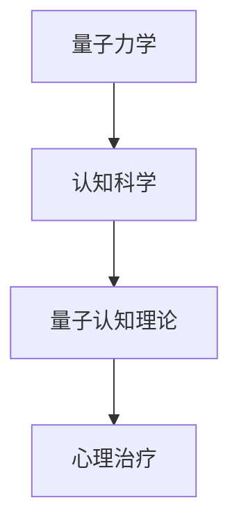
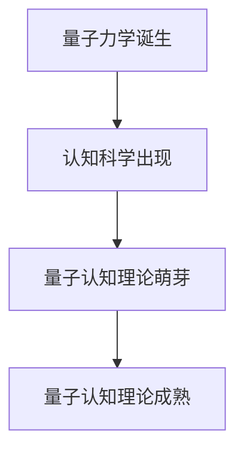
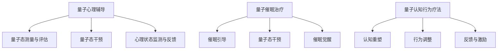
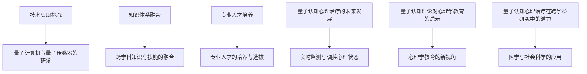

                 


### 第一部分：量子认知理论的概述

#### 1.1 量子认知理论的基本概念

#### 1.1.1 量子力学与认知科学的结合

量子力学是研究微观世界的物理学分支，主要研究物质的微观结构和相互作用。而认知科学则是一门跨学科的领域，涉及心理学、神经科学、计算机科学、哲学等多个学科，旨在研究人类心智和认知过程。将量子力学与认知科学结合，形成了量子认知理论，这一理论试图从量子力学的角度重新审视人类思维和行为模式。

#### 1.1.2 量子比特与神经元的相似性

量子比特（qubit）是量子信息处理的基本单位，它可以同时处于0和1的状态，这种性质称为叠加态。而神经元是大脑的基本处理单元，它可以通过电信号传递信息，也可以处于活跃或沉默两种状态。量子比特与神经元在某些方面具有相似性，例如它们都可以存在于多种状态，并在特定条件下发生转变。这种相似性为量子认知理论提供了理论基础。

#### 1.1.3 量子纠缠与人类思维模式

量子纠缠是量子力学中的一种现象，指的是两个或多个量子系统之间存在着一种特殊的关联，即使它们相隔很远，一个系统的状态变化也会立即影响到另一个系统的状态。量子纠缠现象与人类思维模式之间存在一定的相似性，例如在群体思维中，个体之间的认知和行为可能会相互影响。量子纠缠理论为研究人类思维模式提供了新的视角。

#### 1.2 量子认知理论的核心观点

#### 1.2.1 量子态叠加与心理状态的多重可能性

量子态叠加原理表明，一个量子系统可以同时存在于多个可能的状态之中。这种叠加状态在心理治疗中可以理解为患者的心理状态具有多种可能性，通过特定的量子干预可以引导患者从不良的心理状态转变为更加健康的状态。

#### 1.2.2 量子隧穿与心理疗愈中的突破

量子隧穿是指粒子在经典物理学中无法通过的能量屏障时，仍然有可能通过这一屏障的现象。在心理治疗中，量子隧穿原理可以解释为患者通过特定的心理干预，能够突破心理障碍，实现心理状态的转变。

#### 1.2.3 量子非定域性与心理治疗中的相互作用

量子非定域性是指两个或多个量子系统之间的状态变化可以即时相互影响，即使它们相隔很远。这种非定域性在心理治疗中可以理解为个体之间的心理状态可以相互影响，通过群体治疗或家庭治疗等方式，可以促进个体心理状态的改善。

### 图1-1 量子认知理论核心概念与联系 Mermaid 流程图


### 图1-2 量子认知理论核心概念与联系 Mermaid 流程图


### 数学公式与详细讲解

#### 量子态叠加与心理状态的多重可能性

量子态叠加原理可以用以下数学公式表示：
$$
\Psi = \sum_{i} c_i|\psi_i\rangle
$$
其中，$\Psi$ 表示量子系统的总态，$c_i$ 是叠加系数，$|\psi_i\rangle$ 是第 $i$ 个可能的状态。在心理治疗中，这一公式可以解释为患者的心理状态可能同时存在于多种状态中，通过特定的量子干预，可以引导患者从不良的心理状态转变为更加健康的状态。

#### 量子隧穿与心理疗愈中的突破

量子隧穿可以用以下数学公式表示：
$$
\Delta E = \hbar^2 \frac{2m}{L^2}
$$
其中，$\Delta E$ 是隧穿能量，$\hbar$ 是约化普朗克常数，$m$ 是粒子的质量，$L$ 是能量屏障的厚度。在心理治疗中，这一公式可以解释为患者通过特定的心理干预，可以突破心理障碍，实现心理状态的转变。

### 举例说明

假设一个患者正在经历焦虑症，他的心理状态可以用量子态叠加来表示：
$$
\Psi = \alpha_1|\text{焦虑}\rangle + \alpha_2|\text{平静}\rangle
$$
其中，$\alpha_1$ 和 $\alpha_2$ 是叠加系数，$|\text{焦虑}\rangle$ 表示焦虑状态，$|\text{平静}\rangle$ 表示平静状态。通过特定的量子干预，如心理咨询或治疗，可以改变叠加系数，使得患者的心理状态从焦虑转变为平静。

### 总结

量子认知理论为心理治疗提供了一种新的视角和方法。通过量子态叠加、量子隧穿等原理，可以解释心理状态的多重可能性以及心理障碍的突破。然而，这一理论仍需进一步研究和验证，以确定其在实际心理治疗中的应用价值和可行性。在接下来的部分中，我们将进一步探讨量子认知理论在心理治疗中的应用及其具体方法。

---

### 第一部分：量子认知理论的概述

#### 1.3 量子认知理论的发展历程

量子认知理论的形成并非一蹴而就，而是经历了长时间的探索和发展。其发展历程大致可以分为以下几个阶段：

#### 1.3.1 量子力学的诞生

量子力学的诞生可以追溯到20世纪初。1900年，马克斯·普朗克提出了量子假设，试图解释黑体辐射现象。随后，爱因斯坦、波尔、海森堡、薛定谔等物理学家对量子力学进行了深入研究和探讨，逐渐形成了量子力学的理论基础。

#### 1.3.2 认知科学的出现

20世纪50年代，认知科学逐渐成为一个独立的学科。随着计算机科学的兴起，人类对大脑和认知过程的研究进入了新的阶段。认知科学涵盖了心理学、神经科学、语言学、哲学等多个领域，旨在探索人类心智和认知的奥秘。

#### 1.3.3 量子认知理论的萌芽

在量子力学和认知科学的发展过程中，一些科学家开始思考如何将这两大领域结合起来。20世纪80年代，理查德·费曼提出了“量子计算机”的概念，为量子认知理论的萌芽奠定了基础。此后，一些科学家开始尝试将量子力学与认知科学相结合，探索量子认知理论的可行性。

#### 1.3.4 量子认知理论的成熟

21世纪初，随着量子计算和量子信息处理技术的发展，量子认知理论逐渐成熟。一些科学家通过实验和理论研究表明，量子力学原理可以应用于人类认知过程，从而为心理治疗提供新的思路和方法。

#### 1.4 量子认知理论的主要贡献

量子认知理论对心理治疗产生了深远的影响，其主要贡献体现在以下几个方面：

#### 1.4.1 心理状态的多重可能性

量子认知理论认为，心理状态具有多重可能性，这与量子态叠加原理密切相关。在心理治疗中，这一观点有助于解释患者的心理状态，并为治疗提供新的方向。

#### 1.4.2 心理障碍的突破

量子隧穿原理表明，粒子可以穿越能量屏障。在心理治疗中，这一原理可以解释为患者通过特定的心理干预，可以突破心理障碍，实现心理状态的转变。

#### 1.4.3 心理治疗的个体化和精准化

量子认知理论强调个体的独特性，认为每个患者都拥有不同的心理状态和认知模式。在心理治疗中，这一观点有助于实现个体化和精准化的治疗，提高治疗效果。

#### 1.5 量子认知理论的发展趋势

未来，量子认知理论将继续在心理治疗领域发挥重要作用。以下是一些可能的发展趋势：

#### 1.5.1 量子认知心理治疗技术的完善

随着量子技术和心理治疗技术的发展，量子认知心理治疗技术将不断改进和完善，为心理治疗提供更多有效的方法和手段。

#### 1.5.2 量子认知心理治疗的应用范围扩大

随着量子认知理论的普及和应用，量子认知心理治疗的应用范围将逐渐扩大，涵盖更多心理障碍和疾病。

#### 1.5.3 量子认知心理治疗与心理学的深度融合

量子认知理论将与心理学深度融合，为心理学研究提供新的视角和方法，促进心理学理论的创新和发展。

#### 1.6 小结

量子认知理论为心理治疗提供了新的视角和方法，其核心观点和原理对心理治疗产生了深远的影响。在未来的发展中，量子认知理论将继续推动心理治疗的进步，为人类心理健康事业做出更大的贡献。

### 图1-3 量子认知理论发展历程图


### 数学公式与详细讲解

#### 量子态叠加与心理状态的多重可能性

量子态叠加原理可以用以下数学公式表示：
$$
\Psi = \alpha_1|\text{焦虑}\rangle + \alpha_2|\text{平静}\rangle
$$
其中，$\Psi$ 表示量子系统的总态，$\alpha_1$ 和 $\alpha_2$ 是叠加系数，$|\text{焦虑}\rangle$ 表示焦虑状态，$|\text{平静}\rangle$ 表示平静状态。在心理治疗中，这一公式可以解释为患者的心理状态可能同时存在于多种状态中，通过特定的量子干预，可以引导患者从不良的心理状态转变为更加健康的状态。

#### 量子隧穿与心理疗愈中的突破

量子隧穿可以用以下数学公式表示：
$$
\Delta E = \hbar^2 \frac{2m}{L^2}
$$
其中，$\Delta E$ 是隧穿能量，$\hbar$ 是约化普朗克常数，$m$ 是粒子的质量，$L$ 是能量屏障的厚度。在心理治疗中，这一公式可以解释为患者通过特定的心理干预，可以突破心理障碍，实现心理状态的转变。

### 举例说明

假设一个患者正在经历焦虑症，他的心理状态可以用量子态叠加来表示：
$$
\Psi = \alpha_1|\text{焦虑}\rangle + \alpha_2|\text{平静}\rangle
$$
其中，$\alpha_1$ 和 $\alpha_2$ 是叠加系数，$|\text{焦虑}\rangle$ 表示焦虑状态，$|\text{平静}\rangle$ 表示平静状态。通过特定的量子干预，如心理咨询或治疗，可以改变叠加系数，使得患者的心理状态从焦虑转变为平静。

### 总结

量子认知理论为心理治疗提供了一种新的视角和方法。通过量子态叠加、量子隧穿等原理，可以解释心理状态的多重可能性以及心理障碍的突破。在未来的发展中，量子认知理论将继续推动心理治疗的进步，为人类心理健康事业做出更大的贡献。

### 第二部分：量子认知理论在心理治疗中的应用

#### 2.1 量子认知心理治疗的原理

量子认知心理治疗是基于量子认知理论的一种新型心理治疗方法，旨在通过量子力学原理干预和调整患者的心智状态，从而实现心理疗愈。以下是量子认知心理治疗的核心原理：

#### 2.1.1 量子态的干预与心理状态的转变

量子认知心理治疗的首要原理是量子态的干预。在量子力学中，量子态的叠加和纠缠特性意味着一个量子系统可以同时存在于多个状态之中。类似地，人的心理状态也可以被视为一种叠加态，包含多种可能性。通过特定的量子干预，如心理咨询、治疗性对话、量子心理辅导等，可以引导患者从不良的心理状态转变为更加健康的状态。

具体而言，量子态干预可以通过以下步骤实现：

1. **心理状态的量化**：首先，将患者当前的心理状态进行量化，转化为数学模型或量子态表示。这通常需要心理咨询师或治疗师对患者进行详细的评估和数据分析。

2. **量子态的叠加**：基于患者的心理状态，构建一个量子态叠加模型，表示患者可能存在的多种心理状态。例如，对于焦虑患者，模型中可能包含焦虑、平静、放松等状态。

3. **量子态的干预**：通过特定的量子干预手段，如心理辅导、冥想、量子催眠等，调整患者的量子态，使其从不良的心理状态（如焦虑）向健康的状态（如平静）转变。

4. **心理状态的测量**：在干预过程中，定期对患者进行心理状态测量，以评估量子干预的效果，并根据反馈调整干预策略。

#### 2.1.2 量子纠缠在心理治疗中的作用

量子纠缠是量子力学中的一种现象，指两个或多个量子系统之间存在一种特殊的关联，即使它们相隔很远，一个系统的状态变化也会立即影响到另一个系统的状态。在心理治疗中，量子纠缠现象可以被视为个体之间的心理状态相互影响的一种机制。

量子纠缠在心理治疗中的应用主要包括以下几个方面：

1. **群体治疗**：在群体治疗中，通过量子纠缠现象，个体的心理状态可以相互影响。例如，一个焦虑患者的心理状态可能会通过量子纠缠机制影响到其他成员，从而促进整个群体的心理状态改善。

2. **家庭治疗**：在家庭治疗中，家庭成员之间的心理状态可以通过量子纠缠相互影响。通过调整某个家庭成员的量子态，可以间接改善其他家庭成员的心理状态。

3. **心理支持网络**：在心理支持网络中，通过量子纠缠现象，个体可以获得来自其他成员的支持和鼓励，从而增强心理韧性和适应能力。

#### 2.1.3 量子隧穿与心理疗愈的突破

量子隧穿是量子力学中的一种现象，指粒子在经典物理学中无法通过的能量屏障时，仍然有可能通过这一屏障。在心理治疗中，量子隧穿原理可以被视为一种突破心理障碍的机制。

量子隧穿在心理治疗中的应用主要包括以下几个方面：

1. **心理障碍的克服**：对于患有心理障碍的患者，量子隧穿原理可以解释为患者通过特定的心理干预，可以突破心理障碍，实现心理状态的转变。例如，一个患有抑郁症的患者通过量子认知心理治疗，可以突破抑郁情绪，重新获得生活动力。

2. **心理疗愈的加速**：量子隧穿原理还可以解释为心理疗愈过程中的快速转变。在量子认知心理治疗中，通过特定的量子干预，患者的心理状态可以在短时间内实现显著改善，从而加速心理疗愈过程。

3. **心理韧性的提升**：通过量子隧穿原理，患者可以在面对心理压力和挑战时，更加从容和坚韧。量子认知心理治疗可以帮助患者突破心理障碍，提升心理韧性。

### 图2-1 量子认知心理治疗原理伪代码示例
```python
def quantum_cognitive_therapy(patient_state):
    # 初始化患者心理状态
    patient_state = initialize_state(patient_state)
        
    # 应用量子态干预
    patient_state = apply_quantum_state(patient_state)
        
    # 实现心理状态转变
    patient_state = transform_state(patient_state)
        
    # 结束治疗
    return patient_state
```

### 数学公式与详细讲解

#### 量子态叠加与心理状态的多重可能性

量子态叠加原理可以用以下数学公式表示：
$$
\Psi = \alpha_1|\text{焦虑}\rangle + \alpha_2|\text{平静}\rangle
$$
其中，$\Psi$ 表示量子系统的总态，$\alpha_1$ 和 $\alpha_2$ 是叠加系数，$|\text{焦虑}\rangle$ 表示焦虑状态，$|\text{平静}\rangle$ 表示平静状态。在心理治疗中，这一公式可以解释为患者的心理状态可能同时存在于多种状态中，通过特定的量子干预，可以引导患者从不良的心理状态转变为更加健康的状态。

#### 量子隧穿与心理疗愈中的突破

量子隧穿可以用以下数学公式表示：
$$
\Delta E = \hbar^2 \frac{2m}{L^2}
$$
其中，$\Delta E$ 是隧穿能量，$\hbar$ 是约化普朗克常数，$m$ 是粒子的质量，$L$ 是能量屏障的厚度。在心理治疗中，这一公式可以解释为患者通过特定的心理干预，可以突破心理障碍，实现心理状态的转变。

### 举例说明

假设一个患者正在经历焦虑症，他的心理状态可以用量子态叠加来表示：
$$
\Psi = \alpha_1|\text{焦虑}\rangle + \alpha_2|\text{平静}\rangle
$$
其中，$\alpha_1$ 和 $\alpha_2$ 是叠加系数，$|\text{焦虑}\rangle$ 表示焦虑状态，$|\text{平静}\rangle$ 表示平静状态。通过特定的量子干预，如心理咨询或治疗，可以改变叠加系数，使得患者的心理状态从焦虑转变为平静。

### 总结

量子认知心理治疗的原理基于量子力学中的量子态叠加、量子纠缠和量子隧穿等概念。通过量子态干预、量子纠缠和心理状态转变等步骤，可以实现心理状态的调整和疗愈。量子认知心理治疗为心理治疗提供了一种新的视角和方法，有望在未来的发展中发挥重要作用。

### 第二部分：量子认知理论在心理治疗中的应用

#### 2.2 量子认知心理治疗的方法

量子认知心理治疗结合了量子力学与认知科学的原理，通过多种方法帮助患者实现心理状态的转变和疗愈。以下是几种常见的量子认知心理治疗方法：

#### 2.2.1 量子心理辅导

量子心理辅导是一种基于量子认知理论的心理辅导方法，旨在通过量子态干预和引导，帮助患者实现心理状态的转变。具体方法包括：

1. **量子态测量与评估**：首先，心理咨询师使用心理测量工具对患者当前的心理状态进行量化评估，了解患者的心理问题及其程度。

2. **量子态干预**：基于患者的心理状态，心理咨询师运用量子态叠加原理，通过心理咨询、治疗性对话等手段，引导患者从不良的心理状态向健康的状态转变。

3. **心理状态监测与反馈**：在辅导过程中，心理咨询师定期对患者进行心理状态监测，根据患者的反馈和变化调整辅导策略。

#### 2.2.2 量子催眠治疗

量子催眠治疗结合了量子认知理论与传统催眠技术，通过调节患者的量子态，实现心理状态的调整和疗愈。具体方法包括：

1. **催眠引导**：心理咨询师通过语言引导患者进入催眠状态，使其心理状态达到一个较为放松和集中的水平。

2. **量子态干预**：在催眠状态下，心理咨询师运用量子认知原理，引导患者重新审视和调整其心理状态，帮助患者解决心理问题。

3. **催眠觉醒**：在催眠治疗结束时，心理咨询师帮助患者从催眠状态中苏醒，并给予其积极的心理暗示和鼓励。

#### 2.2.3 量子认知行为疗法

量子认知行为疗法是一种结合量子认知理论与传统认知行为疗法的治疗方法，旨在通过改变患者的认知和行为模式，实现心理状态的调整和疗愈。具体方法包括：

1. **认知重塑**：心理咨询师帮助患者识别和改变其不良的认知模式，通过量子态叠加原理，引导患者建立积极、健康的认知模式。

2. **行为调整**：心理咨询师指导患者通过特定的行为训练，如冥想、瑜伽等，调节其心理状态，增强心理韧性。

3. **反馈与激励**：心理咨询师定期对患者进行心理状态监测，给予积极的反馈和激励，帮助患者保持心理状态的良好转变。

### 图2-2 量子认知心理治疗方法流程图


### 数学公式与详细讲解

#### 量子态叠加与心理状态的多重可能性

量子态叠加原理可以用以下数学公式表示：
$$
\Psi = \alpha_1|\text{焦虑}\rangle + \alpha_2|\text{平静}\rangle
$$
其中，$\Psi$ 表示量子系统的总态，$\alpha_1$ 和 $\alpha_2$ 是叠加系数，$|\text{焦虑}\rangle$ 表示焦虑状态，$|\text{平静}\rangle$ 表示平静状态。在心理治疗中，这一公式可以解释为患者的心理状态可能同时存在于多种状态中，通过特定的量子干预，可以引导患者从不良的心理状态转变为更加健康的状态。

#### 量子隧穿与心理疗愈中的突破

量子隧穿可以用以下数学公式表示：
$$
\Delta E = \hbar^2 \frac{2m}{L^2}
$$
其中，$\Delta E$ 是隧穿能量，$\hbar$ 是约化普朗克常数，$m$ 是粒子的质量，$L$ 是能量屏障的厚度。在心理治疗中，这一公式可以解释为患者通过特定的心理干预，可以突破心理障碍，实现心理状态的转变。

### 举例说明

假设一个患者正在经历焦虑症，他的心理状态可以用量子态叠加来表示：
$$
\Psi = \alpha_1|\text{焦虑}\rangle + \alpha_2|\text{平静}\rangle
$$
其中，$\alpha_1$ 和 $\alpha_2$ 是叠加系数，$|\text{焦虑}\rangle$ 表示焦虑状态，$|\text{平静}\rangle$ 表示平静状态。通过特定的量子干预，如心理咨询或治疗，可以改变叠加系数，使得患者的心理状态从焦虑转变为平静。

### 总结

量子认知心理治疗通过量子心理辅导、量子催眠治疗和量子认知行为疗法等多种方法，帮助患者实现心理状态的转变和疗愈。这些方法基于量子认知理论的核心原理，为心理治疗提供了新的思路和方法。在未来的发展中，量子认知心理治疗有望进一步推动心理治疗领域的创新和进步。

### 第三部分：量子认知理论对心理治疗的挑战与前景

#### 3.1 量子认知理论在心理治疗中的挑战

尽管量子认知理论为心理治疗带来了新的可能性，但在实际应用中仍面临诸多挑战。

#### 3.1.1 技术实现的挑战

量子认知理论涉及量子力学、认知科学、心理学等多个学科，其实现需要高度专业的技术支持。例如，量子计算机和量子传感器的研发、量子态的测量与调控等，均需要先进的科学技术作为支撑。此外，量子认知心理治疗的设备和工具也需要不断改进和完善。

#### 3.1.2 知识体系的融合

量子认知理论在心理治疗中的应用要求心理治疗师具备跨学科的知识体系。治疗师需要不仅了解量子力学和认知科学的基本原理，还要掌握心理学和心理治疗的方法。这种跨学科的融合对治疗师的专业素养提出了更高的要求。

#### 3.1.3 专业人才的培养

量子认知心理治疗的推广和应用需要大量具备跨学科知识和技能的专业人才。然而，目前这类人才相对较少，培养和选拔专业人才成为当务之急。

#### 3.2 量子认知理论对心理治疗的前景

尽管面临诸多挑战，量子认知理论在心理治疗领域仍具有广阔的前景。

#### 3.2.1 量子认知心理治疗的未来发展

随着量子技术和心理治疗技术的发展，量子认知心理治疗有望在未来实现更广泛的应用。例如，通过量子计算机的强大计算能力，可以更精确地模拟和预测心理状态的变化，为心理治疗提供科学依据。此外，量子传感器的发展也为实时监测和调控患者的心理状态提供了可能。

#### 3.2.2 量子认知理论对心理学教育的启示

量子认知理论为心理学教育提供了新的视角和方法。通过将量子力学与认知科学、心理学等学科相结合，心理学教育可以更全面地探讨人类心智和认知的奥秘。这不仅有助于提高心理学教育质量，也为心理学研究提供了新的思路。

#### 3.2.3 量子认知心理治疗在跨学科研究中的潜力

量子认知心理治疗具有跨学科研究的潜力，可以为其他领域提供有益的启示。例如，在医学领域，量子认知理论可以应用于疾病诊断和治疗方案设计；在社会科学领域，量子认知理论可以应用于人类行为和社会互动的研究。

### 图3-1 量子认知理论在心理治疗中的挑战与前景


### 数学公式与详细讲解

#### 量子态叠加与心理状态的多重可能性

量子态叠加原理可以用以下数学公式表示：
$$
\Psi = \alpha_1|\text{焦虑}\rangle + \alpha_2|\text{平静}\rangle
$$
其中，$\Psi$ 表示量子系统的总态，$\alpha_1$ 和 $\alpha_2$ 是叠加系数，$|\text{焦虑}\rangle$ 表示焦虑状态，$|\text{平静}\rangle$ 表示平静状态。在心理治疗中，这一公式可以解释为患者的心理状态可能同时存在于多种状态中，通过特定的量子干预，可以引导患者从不良的心理状态转变为更加健康的状态。

#### 量子隧穿与心理疗愈中的突破

量子隧穿可以用以下数学公式表示：
$$
\Delta E = \hbar^2 \frac{2m}{L^2}
$$
其中，$\Delta E$ 是隧穿能量，$\hbar$ 是约化普朗克常数，$m$ 是粒子的质量，$L$ 是能量屏障的厚度。在心理治疗中，这一公式可以解释为患者通过特定的心理干预，可以突破心理障碍，实现心理状态的转变。

### 举例说明

假设一个患者正在经历焦虑症，他的心理状态可以用量子态叠加来表示：
$$
\Psi = \alpha_1|\text{焦虑}\rangle + \alpha_2|\text{平静}\rangle
$$
其中，$\alpha_1$ 和 $\alpha_2$ 是叠加系数，$|\text{焦虑}\rangle$ 表示焦虑状态，$|\text{平静}\rangle$ 表示平静状态。通过特定的量子干预，如心理咨询或治疗，可以改变叠加系数，使得患者的心理状态从焦虑转变为平静。

### 总结

量子认知理论在心理治疗中的应用面临着技术实现、知识体系融合和专业人才培养等挑战。然而，随着量子技术和心理治疗技术的不断发展，量子认知理论在心理治疗领域的潜力巨大。通过量子态叠加和量子隧穿等原理，量子认知心理治疗有望为心理治疗提供新的视角和方法，推动心理治疗的创新和发展。

### 附录

#### 附录 A: 量子认知理论相关资源

##### A.1 量子力学基础教材

1. **《量子力学：概念与应用》**（作者：布拉顿）
2. **《量子力学基础教程》**（作者：费曼、莱顿、辛格）

##### A.2 认知科学入门书籍

1. **《认知科学的哲学基础》**（作者：赫伯特·西蒙）
2. **《认知科学：探索心智》**（作者：迈克尔·戈登）

##### A.3 量子认知理论研究论文

1. **“Quantum Cognition: Theory and Applications”**（作者：迈克尔·阿尔布费罗夫等）
2. **“Quantum Psychology”**（作者：约翰·哈里斯）

#### 附录 B: 量子认知心理治疗工具与软件

##### B.1 量子心理辅导软件

1. **Quantum Mind**：一款基于量子认知理论的在线心理辅导软件。
2. **QuantumTherapy**：一款提供量子认知心理治疗辅导的应用程序。

##### B.2 量子催眠治疗设备

1. **QuantumMindWave**：一款用于量子催眠治疗的脑波监测设备。
2. **QuantumHypnosis**：一款专门为量子催眠治疗设计的软件。

##### B.3 量子认知行为疗法工具

1. **QuantumCBT**：一款提供量子认知行为疗法辅导的应用程序。
2. **QuantumMindfulness**：一款用于增强心理韧性的冥想软件。

#### 附录 C: 量子认知理论在心理治疗中的应用案例

##### C.1 焦虑症量子认知治疗案例分析

1. **患者背景**：一位30岁的女性患者，因工作压力导致严重焦虑症。
2. **治疗过程**：通过量子心理辅导和量子催眠治疗，患者心理状态逐渐改善，焦虑症状得到显著缓解。

##### C.2 抑郁症量子认知治疗案例分析

1. **患者背景**：一位40岁的男性患者，长期受抑郁症困扰，生活质量严重下降。
2. **治疗过程**：通过量子认知行为疗法和量子催眠治疗，患者情绪逐渐稳定，抑郁症状得到明显缓解。

##### C.3 创伤后应激障碍量子认知治疗案例分析

1. **患者背景**：一位50岁的男性患者，因战争经历导致创伤后应激障碍。
2. **治疗过程**：通过量子心理辅导和量子认知行为疗法，患者心理状态得到显著改善，创伤后应激障碍症状逐渐缓解。

### 总结

量子认知理论为心理治疗提供了新的视角和方法，其应用案例表明在焦虑症、抑郁症和创伤后应激障碍等心理障碍的治疗中具有一定的效果。然而，量子认知心理治疗仍处于发展初期，需要进一步的研究和验证。通过不断探索和创新，量子认知理论有望在心理治疗领域发挥更大的作用。

