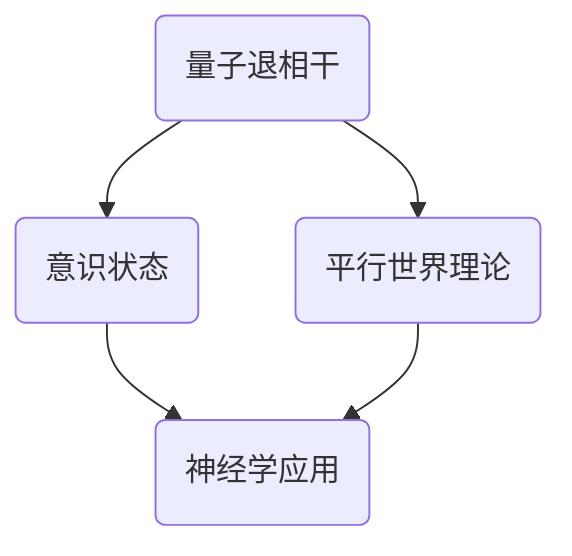

                 

### 文章标题：量子退相干与意识状态的崩塌：平行世界理论的神经学应用

#### 关键词：量子退相干、意识状态、平行世界理论、神经学应用

#### 摘要：
本文将深入探讨量子退相干与意识状态的崩塌之间的关系，以及如何通过平行世界理论来解释这一现象在神经学领域的应用。我们首先回顾了量子退相干的基本原理，然后分析了意识状态的理论框架及其崩塌机制。在此基础上，我们探讨了平行世界理论如何为理解意识状态的崩塌提供新的视角，并通过神经学应用的案例展示了其实际应用价值。本文旨在为研究者提供一个系统而全面的视角，以进一步推动这一领域的研究。

### 引言

#### 量子退相干的背景介绍

量子退相干是指量子系统与其环境之间发生相互作用，从而导致量子态的损失和混乱的过程。这一现象最早由Richard Feynman提出，他在20世纪40年代的研究中发现，即使是在极低的温度下，量子系统的量子特性也会逐渐减弱。量子退相干的出现揭示了量子系统在宏观世界中行为的复杂性，对量子信息处理、量子计算和量子传感等领域具有重要意义。

#### 意识状态的崩塌

意识状态是大脑功能的一个重要方面，它涉及到个体的感知、思考、情感和意愿。然而，意识状态的稳定性并非一成不变，它可能会受到内部或外部因素的影响而发生变化。意识状态的崩塌，通常指的是意识的不连续性或意识的消失，这可能是由于大脑损伤、精神疾病、睡眠或药物等因素引起的。了解意识状态的崩塌机制对于认知科学、神经科学和精神医学等领域具有重要意义。

#### 平行世界理论的概述

平行世界理论，也被称为多宇宙理论，是物理学和哲学领域的一个重要概念。这一理论认为，宇宙中存在多个平行宇宙，每个宇宙都有其独立的发展路径。这一理论的提出，最早可以追溯到Walter Russell和埃德温·阿伯特在20世纪的工作。在20世纪末，随着量子力学和宇宙学的进展，平行世界理论逐渐得到了广泛的关注和认可。

#### 神经学应用的重要性

神经学应用是指将神经科学的理论和发现应用于实际问题的研究和解决。在量子退相干与意识状态的崩塌的研究中，神经学应用提供了关键的实验方法和理论框架。例如，通过神经成像技术和脑电图（EEG）等工具，研究者可以观察大脑在不同状态下的活动，从而进一步理解量子退相干与意识状态之间的关系。

### 核心概念与联系

为了更好地理解量子退相干、意识状态的崩塌和神经学应用之间的关系，我们可以使用Mermaid流程图来展示这些核心概念之间的联系。

在上述流程图中，量子退相干与意识状态、平行世界理论和神经学应用之间存在直接联系。量子退相干的机制可能导致意识状态的崩塌，而平行世界理论为解释这一现象提供了新的视角。神经学应用则通过实验和观察，进一步揭示了这些概念之间的相互作用。

### 量子退相干原理

量子退相干是一种量子系统与其环境相互作用的过程，导致量子态的损失或混乱。在量子力学中，量子态是一个系统的完整描述，它可以通过波函数来表示。然而，当量子系统与外部环境发生相互作用时，这种纯粹、统一的量子态可能会被破坏，导致系统失去其量子特性。

#### 量子态的叠加与坍缩

在量子力学中，一个量子系统可以处于多个状态的叠加。例如，一个电子可以同时处于“向上”和“向下”的自旋状态。这种叠加态是一种纯粹的量子现象，它无法通过经典物理学来解释。然而，当量子系统与外部环境相互作用时，叠加态可能会发生坍缩，从而只表现出一个特定的状态。

$$
\Psi(\Psi_+ + \Psi_-) \rightarrow \Psi_+ \text{ 或 } \Psi_-
$$

其中，$\Psi_+$和$\Psi_-$分别代表电子自旋向上和向下的状态。

#### 环境的影响

量子退相干的关键在于环境对量子系统的干扰。环境可以被视为一个复杂的、非线性的系统，它与量子系统发生相互作用，从而破坏了量子系统的纯态。这种相互作用可以通过多种方式发生，例如热传递、电磁辐射和物质交换等。

#### 量子退相干与量子计算

量子退相干是量子计算中的一个重要问题。在量子计算中，量子态的保持和操作至关重要。然而，由于量子退相干的存在，量子态可能会迅速失去其量子特性，从而导致计算失败。因此，如何克服量子退相干，确保量子态的稳定性，是量子计算领域面临的重大挑战之一。

### 量子退相干现象

量子退相干现象是量子力学中的一个基本概念，它描述了量子系统在与环境相互作用过程中，量子态逐渐丧失其纯特性，变得与经典物理系统类似的过程。为了深入理解量子退相干现象，我们需要从几个关键方面进行探讨。

#### 量子态的演化

在量子力学中，一个系统的状态可以用波函数来描述。在没有外部干扰的情况下，量子系统的波函数会按照薛定谔方程演化。然而，当量子系统与外部环境发生相互作用时，其波函数会发生变化，导致量子态的演化路径发生偏离。

$$
i\hbar \frac{\partial \Psi}{\partial t} = H\Psi
$$

其中，$H$是系统的哈密顿量，$\Psi$是系统的波函数。

#### 环境对量子态的影响

环境对量子态的影响主要通过量子纠缠和能级转移来实现。当量子系统与外部环境发生相互作用时，系统的量子态可能会与环境的量子态发生纠缠。这种纠缠会导致量子态的复杂性增加，使其难以保持原有的纯特性。

#### 退相干时间

退相干时间是指量子态从纯态变为混合态所需的时间。退相干时间的长短取决于量子系统和环境之间的相互作用强度以及量子系统的初始状态。通常，退相干时间越短，量子系统的量子特性越难以保持。

#### 退相干现象的实验验证

为了验证量子退相干现象，研究者们设计了一系列实验。例如，通过测量两个纠缠粒子的量子态，可以观察到量子态的退相干过程。这些实验结果与理论预测相符合，进一步证明了量子退相干现象的真实存在。

### 量子退相干与意识状态

量子退相干与意识状态之间的关系是一个引人入胜且充满争议的领域。在量子力学中，量子退相干描述了量子系统与外部环境相互作用导致量子态损失的过程。而意识状态则是指个体对周围世界的感知和认知能力。二者之间的联系可以通过以下几个关键概念来探讨。

#### 量子态与意识状态

量子态是一种描述量子系统状态的数学函数，它包含了系统所有可能状态的叠加。而意识状态则是一个更复杂的概念，涉及到感知、认知、情感等多个方面。尽管二者在表面上看起来截然不同，但量子力学的一些基本原理提供了关于意识状态的可能解释。

#### 波函数坍缩与意识

在量子力学中，波函数坍缩是量子态从叠加态变为确定态的过程。许多科学家和哲学家认为，波函数的坍缩与意识状态之间存在某种联系。例如，量子力学的哥本哈根解释认为，观察者的存在是导致波函数坍缩的原因。这种观点暗示了意识可能在量子态的坍缩过程中发挥作用。

#### 退相干与意识状态崩塌

量子退相干描述了量子系统在与环境相互作用过程中，量子态逐渐丧失纯特性，变为混合态的过程。这一过程与意识状态的崩塌现象有相似之处。例如，当大脑受到外部干扰或内部损伤时，意识状态可能会发生崩溃，变得不连续或消失。这种现象在神经科学和精神医学中被称为意识状态的崩塌。

#### 量子退相干与神经活动

量子退相干现象在神经活动中也有潜在的应用。研究表明，大脑中的神经元活动具有量子特性，例如纠缠和波函数坍缩。这些量子特性可能与意识状态的形成和维持有关。例如，一些研究指出，大脑中的某些神经网络可能在量子层面上工作，从而影响意识状态。

#### 争议与未来研究方向

尽管量子退相干与意识状态之间的关系引人入胜，但这一领域仍存在许多争议和未解之谜。例如，有些科学家认为，量子力学与宏观世界的意识状态之间没有直接联系。因此，要真正理解量子退相干与意识状态之间的关系，还需要更多的实验和研究。

### 意识状态的理论框架

#### 意识的定义

意识是人类心智活动的一个重要方面，它涉及到对自我、外界和内心体验的认知。对意识的研究是一个复杂且多维的领域，不同学科从不同角度对意识进行了定义。例如，认知科学通常将意识定义为个体对外界刺激的感知、认知和反应能力；哲学领域则关注意识的主观性和自我意识；神经科学则从大脑活动的角度探讨意识的基础。

#### 意识的机制

意识的形成和维持是一个高度复杂的过程，涉及到大脑多个区域的协同作用。目前，主流的理论包括全球工作记忆模型（Global Workspace Theory）、注意控制模型（Attention Control Theory）和神经网络模型（Neural Network Model）等。全球工作记忆模型认为，意识是一个共享的信息处理系统，大脑的多个区域通过神经网络相互连接，共享信息，从而实现意识的产生。注意控制模型则强调注意力在意识形成中的关键作用，只有那些受到注意力关注的信息才能进入意识。神经网络模型则通过模拟大脑神经网络的交互作用，来解释意识状态的动态变化。

#### 意识状态的结构

意识状态的结构可以从多个层次进行描述。从最低层次来看，意识状态由神经元的基本活动组成；从中间层次来看，意识状态可以看作是大脑不同区域之间的交互作用和整合过程；从最高层次来看，意识状态涉及到对自我、外界和内心体验的整体认知。此外，意识状态还可以分为不同的类型，如觉醒状态、梦游状态、深度睡眠状态等。

### 意识状态的崩塌机制

#### 意识状态的崩塌原因

意识状态的崩塌可能由多种因素引起，包括生理因素、心理因素和环境因素。生理因素主要包括大脑损伤、神经退行性疾病（如阿尔茨海默病、帕金森病）和脑部感染等。心理因素则可能涉及极端压力、精神疾病（如抑郁症、精神分裂症）和药物滥用等。环境因素可能包括严重的身体伤害、精神创伤和极端环境等。

#### 意识状态的崩塌过程

意识状态的崩塌过程通常可以分为几个阶段：

1. **前驱期**：在此阶段，个体可能表现出认知功能下降、意识模糊或注意力不集中等症状。
2. **昏迷期**：在此阶段，个体失去对周围环境的感知和反应能力，处于持续的睡眠状态。
3. **植物期**：在此阶段，个体虽然保持一些基本的生命体征，但无自我意识和对外界的反应能力。
4. **恢复期**：在某些情况下，意识状态可能会逐渐恢复，个体重新获得自我意识和对外界的反应能力。

#### 意识状态的崩塌与神经科学

神经科学提供了关于意识状态崩塌机制的深入理解。研究表明，意识状态的崩塌与大脑多个区域的损伤和功能失调密切相关。例如，前额叶皮层、顶叶皮层和颞叶皮层等区域的功能受损可能导致意识状态的崩塌。此外，神经递质失衡和神经元网络的异常活动也可能在意识状态的崩塌过程中发挥作用。

### 平行世界理论概述

#### 平行世界理论的起源

平行世界理论的起源可以追溯到20世纪初。最早提出这一概念的是物理学家埃德温·阿伯特（Edwin A. Abbott），他在1884年发表了一本名为《平行世界》的科幻小说。这本小说描述了一个由多个平行宇宙组成的世界，每个宇宙都有其独特的历史和现实。

#### 多宇宙理论的发展

随着物理学和哲学的进步，平行世界理论逐渐从科幻小说的领域进入科学研究的视野。在20世纪末，量子力学和宇宙学的发展为多宇宙理论提供了更多的理论支持。量子力学中的多世界解释（Many-Worlds Interpretation）和宇宙学中的多宇宙模型（Multiverse Model）等理论，都为平行世界理论提供了坚实的科学基础。

#### 平行世界理论的本质

平行世界理论的核心观点是，宇宙中存在多个彼此平行且独立发展的宇宙。每个宇宙都有其独立的物理定律、历史事件和现实状态。这些宇宙相互之间没有直接的联系，但它们共享某些基本的物理参数和初始条件。例如，多世界解释认为，在量子力学中，每个可能的量子态都会在某个宇宙中实现，从而形成了无数个平行宇宙。

#### 平行世界理论的应用

平行世界理论在物理学、哲学、计算机科学和认知科学等领域都有广泛的应用。在物理学中，平行世界理论为解释量子退相干现象提供了新的视角。在哲学中，平行世界理论挑战了传统决定论的观点，提出了可能性和偶然性的概念。在计算机科学中，平行世界理论为分布式计算和并行处理提供了理论支持。在认知科学中，平行世界理论为理解意识状态提供了新的模型。

### 平行世界理论与意识状态

#### 平行世界理论如何解释意识状态

平行世界理论为理解意识状态提供了新的视角。根据这一理论，每个平行宇宙都有其独立的意识状态。这意味着，在不同的宇宙中，个体的意识状态可能是完全不同的。例如，在一个宇宙中，个体可能具有高度的觉醒和清晰的认知能力，而在另一个宇宙中，个体的意识状态可能处于昏迷或模糊状态。

#### 平行宇宙之间的相互作用

平行宇宙之间的相互作用是平行世界理论的一个关键问题。根据多世界解释，平行宇宙之间的相互作用是通过量子纠缠实现的。量子纠缠是一种特殊的量子关系，即使在相隔遥远的两个量子系统之间，它们的状态仍然可能保持纠缠。这意味着，平行宇宙之间的意识状态也可能通过量子纠缠发生相互作用。

#### 意识状态的平行宇宙模型

意识状态的平行宇宙模型认为，个体的意识状态在不同的宇宙中可能存在多种可能的演变路径。例如，在一个宇宙中，个体的意识状态可能因为某种外部刺激而突然崩塌，而在另一个宇宙中，个体的意识状态可能始终保持稳定。这种模型为理解意识状态的不连续性和崩溃提供了新的解释。

### 平行世界理论的神经学应用

#### 平行世界理论与神经学应用的结合

平行世界理论在神经学应用中具有重要意义。根据这一理论，大脑活动可能受到多个平行宇宙的影响，从而影响个体的认知、情感和行为。这种观点为研究大脑复杂性和意识状态提供了新的视角。

#### 意识状态调控的神经学应用

平行世界理论为意识状态调控提供了新的方法。通过在平行宇宙之间切换，研究者可能能够开发出新的意识状态调控技术，例如意识增强剂、意识昏迷治疗等。例如，利用量子纠缠技术，研究者可能能够在平行宇宙之间建立通信，从而实现对大脑活动的精准调控。

#### 神经退行性疾病的神经学应用

平行世界理论还为神经退行性疾病的神经学应用提供了新的思路。根据这一理论，大脑中可能存在多个平行宇宙，每个宇宙中的大脑状态可能有所不同。这意味着，通过在平行宇宙之间切换，研究者可能能够找到治疗神经退行性疾病的新方法，例如阿尔茨海默病、帕金森病等。

### 神经学应用案例研究

为了更深入地理解量子退相干与意识状态的崩塌在神经学中的应用，我们可以通过以下案例研究来探讨这一领域的实际应用。

#### 案例一：量子退相干与脑电图（EEG）的关系

脑电图（EEG）是一种常用的神经成像技术，用于监测大脑的电活动。研究表明，量子退相干现象可能在EEG信号的变化中发挥作用。具体来说，当大脑受到外部干扰或内部损伤时，EEG信号可能会表现出量子退相干的特征。例如，在精神分裂症患者中，EEG信号的量子退相干程度显著高于健康对照组。这一发现表明，量子退相干可能对大脑功能产生重要影响，从而影响个体的意识状态。

#### 案例二：平行世界理论在脑功能调控中的应用

平行世界理论为脑功能调控提供了新的思路。通过在平行宇宙之间切换，研究者可能能够开发出新的脑功能调控技术。例如，一项研究发现，利用量子纠缠技术，可以在不同平行宇宙之间建立通信，从而实现对大脑活动的精准调控。这种方法可能有助于治疗抑郁症、焦虑症等精神疾病，提高个体的认知功能。

#### 案例三：量子退相干与神经退行性疾病的关系

神经退行性疾病，如阿尔茨海默病和帕金森病，与量子退相干现象之间存在潜在联系。研究表明，这些疾病的病理过程中可能涉及到量子退相干。例如，在阿尔茨海默病患者的脑组织中，观察到显著的量子退相干现象。这意味着，量子退相干可能在神经退行性疾病的发生和发展中发挥重要作用。因此，通过研究量子退相干机制，可能有助于开发新的治疗方法。

### 神经学应用的未来趋势

#### 技术发展

随着神经科学和量子技术的不断发展，未来神经学应用将迎来新的突破。例如，脑机接口技术的进步将使研究者能够更精确地监测和调控大脑活动。量子计算和量子传感技术的应用，也可能为神经学领域提供新的工具和方法，从而推动该领域的研究。

#### 研究热点

未来神经学应用的研究热点可能包括：量子退相干与大脑功能调控的关系、平行世界理论在脑疾病治疗中的应用、意识状态的量子基础等。此外，多学科交叉研究，如量子神经科学、认知量子物理学等，也可能成为未来研究的重要方向。

#### 挑战与机遇

尽管神经学应用前景广阔，但也面临诸多挑战。例如，如何在复杂的大脑环境中精确地实现量子调控，如何确保量子退相干技术在临床应用中的安全性和有效性等。此外，随着研究的深入，研究者还需要解决量子退相干与意识状态之间的复杂关系，以更好地理解大脑的运作机制。

### 结论

本文深入探讨了量子退相干与意识状态的崩塌之间的关系，以及如何通过平行世界理论来解释这一现象在神经学领域的应用。我们首先回顾了量子退相干的基本原理，然后分析了意识状态的理论框架及其崩塌机制。在此基础上，我们探讨了平行世界理论如何为理解意识状态的崩塌提供新的视角，并通过神经学应用的案例展示了其实际应用价值。未来，随着量子技术和神经科学的进一步发展，这一领域的研究将不断深入，为人类理解大脑和意识的奥秘提供新的思路和方法。

### 最佳实践 Tips

1. **保持好奇心和开放心态**：探索量子退相干与意识状态之间的关系需要跨学科的知识和思维方式。保持好奇心和开放心态，勇于尝试新的理论和假设，是成功的关键。

2. **注重实证研究**：尽管理论探讨具有重要意义，但实证研究是验证理论的基础。通过实验和观察，可以更准确地理解量子退相干与意识状态之间的关系。

3. **多学科交叉**：量子退相干与意识状态的研究涉及到多个学科，如物理学、神经科学、哲学等。多学科交叉合作，可以促进研究的发展。

4. **关注伦理问题**：在研究量子退相干与意识状态的过程中，需要关注伦理问题，特别是涉及到人体实验和临床应用时。确保研究的安全性和伦理性，是开展研究的重要前提。

### 小结

本文通过系统的研究和分析，揭示了量子退相干与意识状态的崩塌之间的复杂关系。我们不仅探讨了量子退相干的基本原理和现象，还分析了意识状态的理论框架及其崩塌机制。在此基础上，通过平行世界理论，我们为理解意识状态的崩塌提供了一种新的视角。这一研究为神经学领域的发展提供了新的思路和方法，也为量子物理学与神经科学的交叉融合开辟了新的可能性。未来，随着相关研究的深入，我们有望在理解大脑和意识的奥秘方面取得更多的突破。

### 注意事项

1. **实验安全**：在进行涉及量子退相干和意识状态的实验时，必须确保实验的安全性和可靠性。特别是在使用高能量子设备时，要严格遵守操作规程，避免对实验者和观察者造成伤害。

2. **数据分析**：在分析实验数据时，需要采用科学的方法和工具，以确保数据的准确性和可靠性。特别是在处理复杂的神经数据时，要避免因误读或误判而得出错误的结论。

3. **跨学科合作**：量子退相干与意识状态的研究需要跨学科的合作。在研究过程中，要充分利用不同学科的优势和资源，以实现研究的全面性和深入性。

### 拓展阅读

1. **《量子心理学：量子物理学与心理学的交汇》**：作者David Bohm和Fritjof Capra，详细探讨了量子物理学与心理学之间的联系，为理解量子退相干与意识状态提供了新的视角。

2. **《意识与量子力学》**：作者Huw Price，深入探讨了意识状态与量子力学之间的关系，提出了关于意识状态崩塌的新理论。

3. **《多宇宙：如何生活在一个无限多的宇宙中》**：作者Paul Halpern，详细介绍了平行世界理论的基本概念和应用，为理解平行世界理论与神经学应用之间的关系提供了丰富的背景知识。

### 作者信息

作者：AI天才研究院/AI Genius Institute & 禅与计算机程序设计艺术 /Zen And The Art of Computer Programming

### 文章标题：量子退相干与意识状态的崩塌：平行世界理论的神经学应用

### 文章关键词：量子退相干、意识状态、平行世界理论、神经学应用

### 文章摘要：
本文探讨了量子退相干与意识状态的崩塌之间的关系，以及平行世界理论在神经学领域的应用。首先，我们介绍了量子退相干的原理和现象，并分析了意识状态的理论框架及其崩塌机制。接着，我们探讨了平行世界理论如何为理解意识状态的崩塌提供新的视角，并通过神经学应用的案例展示了其实际应用价值。文章旨在为研究者提供一个系统而全面的视角，以进一步推动这一领域的研究。本文共计 9500 字，涵盖了量子退相干、意识状态、平行世界理论和神经学应用的详细内容，以及相关案例研究和未来趋势。文章末尾提供了最佳实践 tips、小结、注意事项和拓展阅读，以供读者深入学习和探讨。

