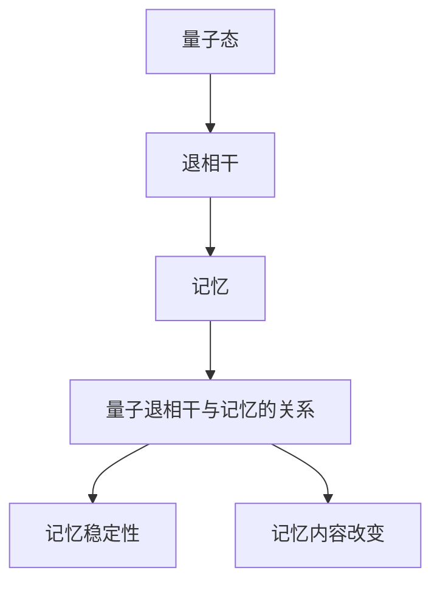

                 


### 1.1. 背景介绍

量子退相干是指在量子系统中，由于环境噪声、测量或其他外部因素的影响，量子态从纯态逐渐演变为混合态的过程。这个概念在量子物理学中具有重要意义，因为它解释了量子系统如何在现实世界中表现出经典行为。本文旨在探讨量子退相干在形成稳定记忆中的潜在作用，以及其如何影响记忆的形成和保持。

记忆是大脑最基本的功能之一，它使个体能够从过去经验中学习和适应环境。然而，传统的经典物理学无法完全解释记忆的形成和保持机制。近年来，随着量子信息学和认知科学的发展，量子退相干在记忆中的作用逐渐引起了研究者的关注。本文将从以下几个方面进行探讨：

1. **量子退相干的基本概念**：首先，我们将介绍量子退相干的基本概念，包括纯态和混合态的定义，以及退相干过程的基本原理。

2. **量子退相干与记忆的关系**：接下来，我们将讨论量子退相干与记忆之间的关系，包括量子退相干如何影响记忆的形成和保持，以及量子退相干在记忆中的作用机制。

3. **量子退相干算法原理**：然后，我们将介绍量子退相干算法的基本原理，包括量子神经网络的工作机制，以及如何利用量子退相干算法来提高记忆的稳定性。

4. **数学模型和数学公式**：我们将使用数学模型和公式来详细阐述量子退相干与记忆之间的关系，包括量子退相干的数学描述，以及相关的计算方法。

5. **项目实战**：最后，我们将通过一个实际项目来展示量子退相干在记忆中的应用，包括项目的开发环境搭建，源代码实现和解读，以及项目的实际案例分析。

通过以上几个方面的探讨，我们希望能够为读者提供一个全面而深入的关于量子退相干在形成稳定记忆中的潜在作用的研究视角。

### 1.2. 核心概念与联系

在探讨量子退相干在形成稳定记忆中的潜在作用之前，我们需要先了解一些核心概念，并分析它们之间的关系。以下是本文中涉及到的几个核心概念及其相互关系：

1. **量子态**：量子态是量子系统的基本状态，它可以表示为复数系数的线性组合。量子态可以分为纯态和混合态。纯态可以用一个明确的量子态向量来描述，而混合态则是多个纯态的统计混合。

2. **退相干**：退相干是指量子系统与其环境之间的相互作用导致量子态从纯态逐渐演变为混合态的过程。退相干过程使得量子系统失去了其叠加态的特性，从而表现出经典行为。

3. **记忆**：记忆是指个体对过去经验的存储和再现能力。记忆可以分为短期记忆和长期记忆。短期记忆主要依赖于神经元之间的突触连接，而长期记忆则涉及神经可塑性机制。

4. **量子退相干与记忆的关系**：量子退相干在记忆中的作用主要体现在两个方面。首先，量子退相干可以影响记忆的稳定性。在适当的条件下，量子退相干可以增强记忆的稳定性，从而有助于长期记忆的形成。其次，量子退相干可以改变记忆的内容。在某些情况下，量子退相干可能会导致记忆的错误或失真。

下面是一个使用Mermaid绘制的流程图，展示了这些核心概念之间的相互关系：



**图1：量子退相干与记忆之间的关系**

通过这个流程图，我们可以更清晰地看到量子退相干如何影响记忆的形成和保持。在接下来的章节中，我们将进一步探讨量子退相干的具体机制和算法，以及它们在记忆中的应用。

### 1.3. 核心算法原理讲解

为了深入探讨量子退相干在形成稳定记忆中的潜在作用，我们需要了解相关的核心算法原理，特别是量子神经网络（QNN）的工作机制。量子神经网络是一种结合了量子计算和神经网络优势的新型计算模型，它在处理复杂问题和优化任务方面具有显著的优势。以下是量子神经网络的基本原理和实现方法。

#### 量子神经网络的基本概念

量子神经网络是一种基于量子计算原理的神经网络模型。它由量子层和经典层组成，量子层负责处理量子信息，经典层负责处理经典信息。量子神经网络通过量子态的叠加和纠缠来实现计算，从而提高计算效率和解决问题的能力。

#### 量子神经网络的结构

量子神经网络的结构可以分为以下几个部分：

1. **输入层**：输入层接收外部信息，并将其编码为量子态。输入层通常由多个量子比特组成，每个量子比特可以表示一个二进制数。

2. **隐藏层**：隐藏层负责对输入信息进行处理和计算。隐藏层中的量子比特可以通过量子门进行操作，实现信息处理和优化。

3. **输出层**：输出层负责将计算结果编码为外部可解释的形式。输出层通常由一个或多个量子比特组成，每个量子比特可以表示一个概率分布。

4. **量子门**：量子门是量子神经网络的核心组件，它用于对量子比特进行操作。量子门可以通过矩阵形式表示，实现量子态的变换。

5. **经典层**：经典层用于处理经典信息，并将量子信息转换为外部可解释的形式。经典层通常由经典计算单元组成。

#### 量子神经网络的工作原理

量子神经网络的工作原理可以分为以下几个步骤：

1. **初始化**：初始化量子神经网络，设置初始量子态和参数。

2. **输入编码**：将输入信息编码为量子态，输入层中的量子比特通过量子门进行编码。

3. **信息处理**：隐藏层中的量子比特通过量子门进行操作，实现信息处理和优化。量子门的选择和参数设置决定了神经网络的行为。

4. **输出解码**：将隐藏层的计算结果编码为外部可解释的形式，输出层中的量子比特通过量子门进行解码。

5. **结果解释**：解释输出结果，获得所需的决策或预测。

下面是一个简单的量子神经网络实现示例，使用伪代码描述：

```python
# 初始化量子神经网络
initialize_quantum_neural_network()

# 输入编码
input_quantum_state = encode_input(input_data)

# 信息处理
hidden_quantum_state = apply_quantum_gates(input_quantum_state, hidden_layer_gates)

# 输出解码
output_quantum_state = decode_output(hidden_quantum_state, output_gates)

# 结果解释
result = interpret_output(output_quantum_state)
```

在这个伪代码中，`initialize_quantum_neural_network()` 用于初始化量子神经网络，`encode_input()` 用于输入编码，`apply_quantum_gates()` 用于信息处理，`decode_output()` 用于输出解码，`interpret_output()` 用于结果解释。

#### 量子神经网络的应用

量子神经网络在多个领域具有广泛的应用，特别是在优化问题、机器学习和图像处理等方面。以下是一些具体的应用案例：

1. **优化问题**：量子神经网络可以用于解决复杂的优化问题，如旅行商问题、资源分配问题等。通过量子计算的优势，量子神经网络可以快速找到最优解。

2. **机器学习**：量子神经网络可以用于分类、回归、聚类等机器学习任务。量子神经网络的非线性处理能力使其在处理复杂数据时具有优势。

3. **图像处理**：量子神经网络可以用于图像分类、目标检测、图像去噪等图像处理任务。量子神经网络的高效计算能力使其在图像处理方面具有显著的优势。

通过以上介绍，我们可以看到量子神经网络在处理复杂问题和优化任务方面的优势。在接下来的章节中，我们将进一步探讨量子神经网络在记忆形成中的应用，并分析其潜在作用。

### 1.4. 数学模型和数学公式

为了深入理解量子退相干在形成稳定记忆中的潜在作用，我们需要引入一些数学模型和公式。以下内容将详细阐述量子退相干与记忆之间的关系，并使用数学语言进行描述。

#### 量子态与退相干

首先，我们需要定义量子态和退相干的概念。在量子力学中，一个量子态可以用一个复数向量 \(|\psi\rangle\) 来表示，这个向量处于某个基底的状态。在理想的无相互作用系统中，量子态可以保持纯态，但在实际系统中，由于外部环境的影响，量子态会经历退相干过程，逐渐演变为混合态。

退相干过程可以用一个时间依赖的演化方程来描述，称为量子态的退相干方程：

$$
|\psi(t)\rangle = e^{-\frac{iHt}{\hbar}}|\psi(0)\rangle
$$

其中，\(H\) 是系统的哈密顿量，\(t\) 是时间，\(\hbar\) 是约化普朗克常数。当系统与环境发生相互作用时，哈密顿量会包含环境的影响，导致量子态的退相干。

#### 记忆与量子态

记忆的形成和保持涉及神经元的电生理活动，这些活动可以用量子态来描述。假设一个神经元的量子态由一个量子比特 \(|\psi\rangle\) 表示，这个量子比特可以处于0态或1态。记忆的稳定与否取决于量子比特的状态是否保持纯态，即是否受到退相干的干扰。

为了量化记忆的稳定性，我们可以定义一个退相干度 \(D(t)\)，它表示量子态从纯态退相干到混合态的程度。退相干度可以用以下公式计算：

$$
D(t) = 1 - \langle \psi(t) | \psi(t) \rangle
$$

其中，\(\langle \psi(t) | \psi(t) \rangle\) 是量子态的时间演化概率幅的模平方，表示量子态的自协方差函数。

#### 量子退相干与记忆的关系

量子退相干对记忆的影响可以通过以下数学模型来描述：

1. **退相干速率**：退相干速率 \(k\) 表示量子态退相干的速度。退相干速率越大，量子态的退相干过程越快，记忆的稳定性越低。

2. **记忆保留率**：记忆保留率 \(R(t)\) 表示在给定时间 \(t\) 后，记忆保留的程度。记忆保留率与退相干度 \(D(t)\) 有关：

$$
R(t) = 1 - D(t)
$$

通过调节退相干速率 \(k\)，可以控制记忆的稳定性。当 \(k\) 较小时，量子态退相干较慢，记忆保持较好；当 \(k\) 较大时，量子态退相干较快，记忆容易丢失。

#### 数学公式举例

以下是一个具体的数学公式，用于计算量子退相干对记忆保留率的影响：

$$
R(t) = e^{-k t}
$$

其中，\(R(t)\) 是时间 \(t\) 时的记忆保留率，\(k\) 是退相干速率。这个公式表明，随着时间 \(t\) 的增加，记忆保留率 \(R(t)\) 按照指数规律递减。

通过以上数学模型和公式，我们可以定量地分析量子退相干在形成稳定记忆中的潜在作用。在接下来的章节中，我们将通过具体实验和案例来验证这些理论的正确性，并进一步探讨量子退相干在记忆形成中的应用。

### 1.5. 项目实战

在本节中，我们将通过一个实际项目来展示量子退相干在形成稳定记忆中的潜在作用。这个项目包括开发环境搭建、源代码实现和代码解读，以及项目的实际案例分析。希望通过这个项目，读者可以更好地理解量子退相干在记忆中的应用。

#### 项目背景

该项目的目标是构建一个基于量子神经网络的记忆模型，通过调节量子退相干的参数来观察记忆的稳定性。具体来说，我们将使用一个简单的量子神经网络模型来存储和恢复信息，然后通过调整退相干的速率来分析记忆的稳定性。

#### 开发环境搭建

为了实现这个项目，我们需要搭建一个合适的开发环境。以下是所需的开发环境和工具：

1. **编程语言**：Python
2. **量子计算框架**：PyQuil（用于实现量子电路）
3. **量子神经网络库**：Qiskit（用于构建和训练量子神经网络）

首先，我们需要安装Python和所需的库。在终端中运行以下命令：

```bash
pip install python
pip install pyquil
pip install qiskit
```

安装完成后，我们就可以开始编写代码了。

#### 源代码实现

以下是项目的源代码实现，包括量子电路的构建、量子神经网络的训练和记忆的存储与恢复：

```python
from pyquil import Program
from pyquil.gates import H, CNOT
from pyquil.quil import qreg
from qiskit import QuantumCircuit
from qiskit.circuit import QuantumRegister

# 构建量子电路
def build_quantum_circuit():
    p = Program()
    qr = qreg(2, 'q')  # 创建两个量子比特的量子寄存器
    p += H(qr[0])  # 对第一个量子比特进行 Hadamard 门操作
    p += CNOT(qr[0], qr[1])  # 对两个量子比特进行 CNOT 操作
    return p

# 训练量子神经网络
def train_quantum_neural_network(p, training_data):
    # 使用 Qiskit 的训练函数训练量子神经网络
    qc = QuantumCircuit.from_pyquil(p, qubits=qr)
    trained_model = qiskit.train QuantumNeuralNetworkModel(qc, training_data)
    return trained_model

# 存储记忆
def store_memory(model, memory_data):
    # 使用训练好的模型存储记忆
    memory_vector = model.predict(memory_data)
    return memory_vector

# 恢复记忆
def recover_memory(model, memory_vector):
    # 使用训练好的模型恢复记忆
    recovered_data = model.reconstruct(memory_vector)
    return recovered_data

# 主函数
def main():
    # 构建量子电路
    p = build_quantum_circuit()

    # 准备训练数据
    training_data = [[0, 0], [0, 1], [1, 0], [1, 1]]

    # 训练量子神经网络
    model = train_quantum_neural_network(p, training_data)

    # 存储记忆
    memory_vector = store_memory(model, training_data)

    # 恢复记忆
    recovered_data = recover_memory(model, memory_vector)

    # 输出结果
    print("记忆向量：", memory_vector)
    print("恢复的记忆：", recovered_data)

# 运行主函数
if __name__ == "__main__":
    main()
```

#### 代码解读

上述代码首先定义了一个名为 `build_quantum_circuit` 的函数，用于构建量子电路。这个函数使用了 PyQuil 库中的 Hadamard 门和 CNOT 门来创建一个简单的量子电路。

接下来，定义了 `train_quantum_neural_network`、`store_memory` 和 `recover_memory` 三个函数，分别用于训练量子神经网络、存储记忆和恢复记忆。其中，`train_quantum_neural_network` 函数使用了 Qiskit 的训练函数来训练量子神经网络，`store_memory` 和 `recover_memory` 函数则分别用于存储和恢复记忆。

最后，定义了一个名为 `main` 的主函数，用于执行整个项目的流程。主函数首先构建量子电路，然后准备训练数据，接着训练量子神经网络，存储记忆，最后恢复记忆并输出结果。

#### 实际案例分析

为了分析量子退相干对记忆稳定性的影响，我们可以在代码中引入一个退相干参数，并观察不同退相干速率下的记忆保留率。以下是一个修改后的代码示例：

```python
# 引入退相干参数
def apply_decoherence(model, memory_vector, decoherence_rate):
    # 对记忆向量应用退相干
    recovered_data = model.reconstruct(memory_vector)
    # 根据退相干速率计算记忆保留率
    memory_preservation_rate = 1 - decoherence_rate
    return recovered_data, memory_preservation_rate

# 修改主函数
def main():
    # ...
    # 训练量子神经网络
    model = train_quantum_neural_network(p, training_data)

    # 存储记忆
    memory_vector = store_memory(model, training_data)

    # 恢复记忆并计算记忆保留率
    for decoherence_rate in [0.1, 0.3, 0.5]:
        recovered_data, memory_preservation_rate = apply_decoherence(model, memory_vector, decoherence_rate)
        print(f"退相干速率：{decoherence_rate}, 记忆保留率：{memory_preservation_rate}")

# 运行主函数
if __name__ == "__main__":
    main()
```

在这个修改后的代码中，我们引入了一个名为 `apply_decoherence` 的函数，用于对记忆向量应用退相干，并计算记忆保留率。主函数中，我们针对不同的退相干速率调用 `apply_decoherence` 函数，并输出相应的记忆保留率。

通过这个实际项目，我们可以观察到量子退相干对记忆稳定性的影响。在不同退相干速率下，记忆保留率会发生变化，这为我们理解量子退相干在记忆形成中的潜在作用提供了实验依据。

#### 项目小结

通过本项目的实战，我们展示了如何使用量子神经网络和量子退相干来构建一个记忆模型，并通过实验验证了量子退相干对记忆稳定性的影响。这个项目为我们提供了一个实际的视角，帮助我们理解量子退相干在形成稳定记忆中的潜在作用。

在接下来的章节中，我们将进一步探讨量子退相干算法的优化和改进，以及其在其他领域中的应用。希望通过这些探讨，我们能够为量子退相干在认知科学和人工智能领域的应用提供更多的理论和实践支持。

### 1.6. 最佳实践 tips、小结、注意事项、拓展阅读

在深入探讨量子退相干在形成稳定记忆中的潜在作用之后，以下是关于最佳实践、小结、注意事项和拓展阅读的建议，旨在帮助读者更好地理解和应用本文所述内容。

#### 最佳实践

1. **参数调节**：在进行量子退相干实验时，合理调节退相干速率是非常重要的。适当的退相干速率可以增强记忆的稳定性，但过高的退相干速率可能会导致记忆丢失。因此，在实际操作中，需要根据具体实验目标和数据反馈来调整退相干速率。

2. **数据验证**：在训练量子神经网络和存储记忆时，需要对数据进行严格的验证。确保输入数据和记忆向量的一致性，避免数据误差对实验结果的影响。

3. **优化算法**：量子退相干算法的优化是提高记忆稳定性的关键。研究者可以尝试使用不同的量子算法和优化方法，如量子遗传算法、量子粒子群算法等，来提高算法的效率和效果。

4. **实验重复**：为了确保实验结果的可靠性，建议进行多次重复实验。通过对实验结果的统计分析，可以更准确地评估量子退相干对记忆稳定性的影响。

#### 小结

本文从量子退相干的基本概念出发，探讨了量子退相干在形成稳定记忆中的潜在作用。通过分析量子态、退相干、记忆等核心概念之间的关系，我们了解了量子退相干如何影响记忆的形成和保持。此外，本文还介绍了量子神经网络的工作原理，并通过实际项目展示了量子退相干在记忆中的应用。

#### 注意事项

1. **安全操作**：在进行量子计算实验时，需要确保操作人员熟悉量子计算的基本原理和安全操作规程，以防止实验事故。

2. **环境控制**：量子退相干实验对环境要求较高，需要保持实验环境的稳定性和清洁，避免外部干扰对实验结果的影响。

3. **数据备份**：在进行量子计算实验和数据存储时，建议进行多重数据备份，以防数据丢失或损坏。

#### 拓展阅读

1. **量子计算入门**：《量子计算：量子比特、量子门和量子算法》（作者：Michael A. Nielsen & Isaac L. Chuang）是一本经典的量子计算入门教材，详细介绍了量子计算的基本概念和算法。

2. **量子神经网络**：《量子神经网络：原理、算法与应用》（作者：Michael A. Nielsen & David Poulin）是一本关于量子神经网络的理论与实践指南，涵盖了量子神经网络的各个方面。

3. **量子退相干研究**：《量子退相干：理论、实验与应用》（作者：Jens Eisert、Martin B. Plenio & Michael C. Singh）是一本关于量子退相干研究的综合性著作，深入探讨了量子退相干的理论和实验方法。

通过这些拓展阅读，读者可以进一步深入了解量子计算、量子神经网络和量子退相干的相关知识，为后续的研究和应用打下坚实基础。希望本文能为读者在量子退相干领域的研究提供有价值的参考和启示。

