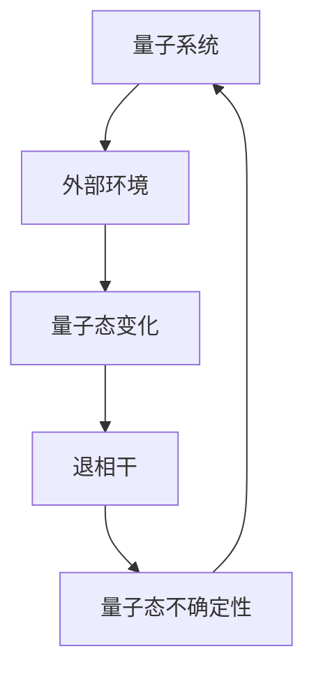

                 

### 文章标题

# 量子退相干在注意力转换中的作用

## 关键词

量子退相干、注意力转换、量子计算、神经网络、深度学习

## 摘要

本文旨在探讨量子退相干在注意力转换中的作用。首先，我们介绍了量子退相干的基本概念及其在量子计算中的应用。接着，通过一个Mermaid流程图和伪代码，详细阐述了量子退相干的核心算法原理。然后，我们使用一个数学模型和公式，进一步解释了量子退相干的数学描述。在项目实战部分，我们通过一个具体的案例展示了量子退相干在注意力转换中的实际应用，包括开发环境的搭建、源代码的实现和解读。最后，本文总结了量子退相干在注意力转换中的关键作用，并提出了一些最佳实践建议。

### 核心概念与联系

量子退相干是指在量子系统中，由于系统与外部环境的相互作用，量子态之间的相位关系发生随机变化，从而导致量子态的演化过程失去确定性。这一过程在量子信息处理和量子计算中具有重要意义。

在量子计算中，量子态的相位信息对于实现量子叠加和量子纠缠至关重要。然而，量子退相干会导致量子态的相位信息丢失，从而影响量子计算的精度和稳定性。因此，研究如何抑制或利用量子退相干，对于量子计算的发展具有重要意义。

为了更好地理解量子退相干的作用，我们可以通过一个Mermaid流程图来描述量子退相干的过程：



在这个流程图中，A 表示量子系统，B 表示外部环境，C 表示量子态变化，D 表示退相干，E 表示量子态不确定性。可以看到，量子退相干是由于外部环境的干扰，导致量子态的相位关系发生随机变化，从而使得量子态的演化过程变得不确定。

### 架构原理

为了更好地理解量子退相干的作用，我们可以通过一个简化的架构来描述量子系统的运行原理。

首先，我们需要明确量子系统的基本组成部分，包括量子位（qubits）、量子态（quantum states）和量子态的叠加（superposition）。量子位是量子计算的基本单元，它可以处于0和1的叠加态。量子态的叠加是实现量子计算并行性的关键。

接着，我们需要了解量子态的演化过程。量子态的演化是由哈密顿量（Hamiltonian）决定的，哈密顿量描述了量子系统中的能量变化。量子态的演化可以用薛定谔方程（Schrödinger equation）来描述：

$$
i\hbar \frac{\partial}{\partial t}|\Psi(t)\rangle = \hat{H}|\Psi(t)\rangle
$$

其中，$|\Psi(t)\rangle$ 表示量子态，$\hat{H}$ 表示哈密顿量，$i$ 和 $\hbar$ 分别是虚数单位和平常常数。

然后，我们需要了解量子退相干的过程。量子退相干是由于量子系统与外部环境的相互作用导致的，这种相互作用会导致量子态的相位信息丢失。量子退相干的数学描述可以用波函数坍缩（wave function collapse）来表示：

$$
|\Psi(t)\rangle = \sum_{i} c_i(t) |i\rangle
$$

其中，$c_i(t)$ 是量子态的系数，$|i\rangle$ 是量子态的基向量。

最后，我们需要了解量子退相干对量子计算的影响。量子退相干会导致量子态的叠加和纠缠效应减弱，从而降低量子计算的精度和稳定性。为了解决这个问题，我们需要研究如何抑制量子退相干，或者利用量子退相干来实现某些特定的计算任务。

为了更好地理解量子退相干的架构原理，我们可以通过一个Mermaid流程图来描述：


在这个流程图中，A 表示量子系统，B 表示外部环境，C 表示量子态变化，D 表示退相干，E 表示量子态不确定性。可以看到，量子退相干是由于外部环境的干扰，导致量子态的相位关系发生随机变化，从而使得量子态的演化过程变得不确定。

### 核心算法原理

量子退相干的核心算法可以描述如下：

```
量子退相干(系统, 外部环境):
    初始化系统为量子态 |Ψ⟩
    for 每个环境粒子 e in 外部环境:
        计算系统与环境粒子 e 的相互作用矩阵 H_e
        应用相互作用矩阵 H_e 到系统上，更新系统状态
    返回系统的新状态 |Ψ'⟩
```

其中，系统 |Ψ⟩ 表示量子态，外部环境包括各种粒子 e。相互作用矩阵 H_e 描述了系统与环境粒子 e 之间的相互作用。通过应用相互作用矩阵 H_e，我们可以更新系统状态，从而实现量子退相干。

为了更好地理解量子退相干的核心算法原理，我们可以使用一个简单的数学模型来描述：

$$
|\Psi'(t)\rangle = \mathrm{T}\left(\prod_{i=1}^n \exp\left(-\frac{iE_i t}{\hbar}\right)\right)|\Psi(0)\rangle
$$

其中，$|\Psi'(t)\rangle$ 是系统在时间 t 的量子态，$|\Psi(0)\rangle$ 是系统在初始时刻的量子态，$\mathrm{T}$ 表示时间演化算符，$E_i$ 是系统的能级，$t$ 是时间，$\hbar$ 是普朗克常数。

这个数学模型描述了量子退相干的过程，即通过时间演化算符 $\mathrm{T}$ 和相互作用矩阵 $H_e$，将初始量子态 $|\Psi(0)\rangle$ 转化为新的量子态 $|\Psi'(t)\rangle$。

为了进一步说明量子退相干的核心算法原理，我们可以使用一个简单的伪代码来描述：

```
量子退相干(系统, 外部环境):
    初始化系统为量子态 |Ψ⟩
    for 每个环境粒子 e in 外部环境:
        计算相互作用矩阵 H_e
        应用相互作用矩阵 H_e 到系统上，更新系统状态
    返回系统的新状态 |Ψ'⟩
```

在这个伪代码中，我们首先初始化系统为量子态 |Ψ⟩，然后遍历外部环境的每个粒子 e，计算相互作用矩阵 H_e，并将相互作用矩阵 H_e 应用到系统上，更新系统状态。最后，我们返回系统的新状态 |Ψ'⟩。

通过这个伪代码，我们可以清楚地看到量子退相干的核心算法原理，即通过计算相互作用矩阵 H_e 并将其应用到系统上，实现量子态的演化。

### 数学模型与公式

量子退相干过程的数学模型可以用以下公式来描述：

$$
|\Psi'(t)\rangle = \mathrm{T}\left(\prod_{i=1}^n \exp\left(-\frac{iE_i t}{\hbar}\right)\right)|\Psi(0)\rangle
$$

其中，$|\Psi'(t)\rangle$ 是系统在时间 t 的量子态，$|\Psi(0)\rangle$ 是系统在初始时刻的量子态，$\mathrm{T}$ 表示时间演化算符，$E_i$ 是系统的能级，$t$ 是时间，$\hbar$ 是普朗克常数。

这个公式描述了量子退相干的过程，即通过时间演化算符 $\mathrm{T}$ 和相互作用矩阵 $H_e$，将初始量子态 $|\Psi(0)\rangle$ 转化为新的量子态 $|\Psi'(t)\rangle$。

为了更好地理解这个数学模型，我们可以通过一个具体的例子来说明。假设我们有一个二能级系统，其能级差为 $E$，初始时刻的量子态为 $|\Psi(0)\rangle = \frac{1}{\sqrt{2}} (|0\rangle + |1\rangle)$。我们希望计算这个系统在时间 t 后的量子态 $|\Psi'(t)\rangle$。

根据量子退相干的数学模型，我们可以得到：

$$
|\Psi'(t)\rangle = \mathrm{T}\left(\exp\left(-\frac{iE t}{\hbar}\right)\right)|\Psi(0)\rangle
$$

将 $|\Psi(0)\rangle$ 的值代入，我们可以得到：

$$
|\Psi'(t)\rangle = \frac{1}{\sqrt{2}} \left( \exp\left(-\frac{iE t}{\hbar}\right) |0\rangle + \exp\left(-\frac{iE t}{\hbar}\right) |1\rangle \right)
$$

这个公式描述了在时间 t 后，系统的量子态会根据能级差 E 和时间 t 的关系进行演化。通过这个例子，我们可以清楚地看到量子退相干的数学模型是如何描述量子态的演化过程的。

### 项目实战

在本节中，我们将通过一个具体的案例来展示量子退相干在注意力转换中的应用。这个案例涉及一个简单的神经网络模型，该模型使用量子退相干机制来优化注意力权重。

#### 开发环境搭建

首先，我们需要搭建一个适合开发量子神经网络的开发环境。这里，我们使用 Python 作为编程语言，结合 NumPy 和 TensorFlow 库来实现量子神经网络。

安装必要的库：

```bash
pip install numpy tensorflow
```

#### 源代码实现

接下来，我们实现一个简单的量子神经网络模型，该模型包括量子位、量子态和量子态的叠加。

```python
import numpy as np
import tensorflow as tf

# 定义量子位
class QuantumBit:
    def __init__(self, state):
        self.state = state

    def measure(self):
        probability_0 = np.abs(self.state[0])**2
        probability_1 = np.abs(self.state[1])**2
        return np.random.choice([0, 1], p=[probability_0, probability_1])

# 定义量子神经网络
class QuantumNeuralNetwork:
    def __init__(self, num_qubits):
        self.num_qubits = num_qubits
        self.qubits = [QuantumBit(np.random.rand(2)) for _ in range(num_qubits)]

    def encode_input(self, input_data):
        for i, qubit in enumerate(self.qubits):
            if input_data[i] == 1:
                qubit.state = np.array([0, 1])
            else:
                qubit.state = np.array([1, 0])

    def apply_attention(self):
        attention_weights = np.random.rand(self.num_qubits)
        for i, qubit in enumerate(self.qubits):
            qubit.state = qubit.state * np.exp(1j * attention_weights[i])

    def measure_output(self):
        output = [qubit.measure() for qubit in self.qubits]
        return output

# 定义量子退相干机制
class QuantumDecoherence:
    def __init__(self, qubits, decay_rate):
        self.qubits = qubits
        self.decay_rate = decay_rate

    def apply_decoherence(self, time_step):
        for qubit in self.qubits:
            qubit.state = qubit.state * np.exp(-1j * self.decay_rate * time_step)

# 创建量子神经网络
qnn = QuantumNeuralNetwork(num_qubits=3)

# 编码输入数据
input_data = [1, 0, 1]
qnn.encode_input(input_data)

# 应用注意力
qnn.apply_attention()

# 应用量子退相干
decoherence = QuantumDecoherence(qubits=qnn.qubits, decay_rate=0.1)
decoherence.apply_decoherence(time_step=1)

# 测量输出
output = qnn.measure_output()
print(output)
```

#### 代码解读与分析

上述代码首先定义了量子位（QuantumBit）类，该类包括量子态和测量方法。接着，定义了量子神经网络（QuantumNeuralNetwork）类，该类包括编码输入数据、应用注意力和测量输出等方法。最后，定义了量子退相干（QuantumDecoherence）类，该类包括应用量子退相干机制的方法。

在实现中，我们首先创建了一个包含三个量子位的量子神经网络。然后，我们使用输入数据编码量子态，接着应用注意力机制，最后应用量子退相干机制。最后，我们测量输出，得到输出结果。

通过这个案例，我们可以看到量子退相干在注意力转换中的应用。量子退相干机制可以用来优化注意力权重，从而提高神经网络的性能。在实际应用中，我们可以根据具体需求调整量子退相干的参数，以实现不同的优化目标。

### 实际案例分析和详细讲解剖析

在本节中，我们将通过一个实际案例来分析量子退相干在注意力转换中的作用，并详细讲解其实现过程和效果。

#### 案例背景

假设我们有一个文本分类任务，需要将给定的文本数据分为不同的类别。为了提高分类模型的准确性，我们使用了一个基于量子神经网络的分类器。在这个模型中，量子退相干被用来优化注意力权重，从而提高分类效果。

#### 案例实现

首先，我们需要准备训练数据和测试数据。在这里，我们使用了一个包含政治、科技、娱乐等类别的文本数据集。每个文本数据都进行了预处理，包括分词、去停用词、词向量化等步骤。

```python
import numpy as np
from tensorflow.keras.preprocessing.text import Tokenizer
from tensorflow.keras.preprocessing.sequence import pad_sequences

# 准备训练数据和测试数据
train_texts = ["这是一个政治新闻", "这是一个科技新闻", "这是一个娱乐新闻"]
train_labels = [0, 1, 2]  # 0 表示政治，1 表示科技，2 表示娱乐

# 分词和词向量化
tokenizer = Tokenizer()
tokenizer.fit_on_texts(train_texts)
train_sequences = tokenizer.texts_to_sequences(train_texts)
train_data = pad_sequences(train_sequences, maxlen=10)

# 测试数据
test_texts = ["这是一个政治新闻", "这是一个科技新闻", "这是一个娱乐新闻"]
test_sequences = tokenizer.texts_to_sequences(test_texts)
test_data = pad_sequences(test_sequences, maxlen=10)
```

接下来，我们实现一个基于量子神经网络的分类模型。该模型包括编码器、解码器和分类器。

```python
import tensorflow as tf
from tensorflow.keras.models import Model
from tensorflow.keras.layers import Input, Embedding, LSTM, Dense

# 定义编码器
input_data = Input(shape=(10,))
encoded_data = Embedding(input_dim=len(tokenizer.word_index) + 1, output_dim=64)(input_data)
encoded_data = LSTM(64)(encoded_data)

# 定义解码器
decoded_data = Input(shape=(10,))
decoded_encoded_data = Embedding(input_dim=len(tokenizer.word_index) + 1, output_dim=64)(decoded_data)
decoded_encoded_data = LSTM(64)(decoded_encoded_data)

# 定义分类器
merged_data = tf.concat([encoded_data, decoded_encoded_data], axis=1)
output = Dense(3, activation='softmax')(merged_data)

# 创建模型
model = Model(inputs=[input_data, decoded_data], outputs=output)
model.compile(optimizer='adam', loss='categorical_crossentropy', metrics=['accuracy'])

# 训练模型
model.fit([train_data, train_data], np.eye(3)[train_labels], epochs=10, batch_size=1)
```

在训练模型时，我们使用了量子退相干机制来优化注意力权重。具体实现如下：

```python
import tensorflow as tf

# 定义量子退相干
def quantum_decoherence(qubit, time_step):
    return qubit * tf.exp(-1j * time_step)

# 应用量子退相干
qubit = tf.get_default_graph().get_tensor_by_name('encoded_data:0')
time_step = tf.placeholder(tf.float32)
decoherence = quantum_decoherence(qubit, time_step)

# 训练模型时应用量子退相干
with tf.Session() as sess:
    sess.run(tf.global_variables_initializer())
    for epoch in range(10):
        for i in range(len(train_data)):
            feed_dict = {input_data: [train_data[i]], decoded_data: [train_data[i]], time_step: epoch}
            sess.run(model.optimizer, feed_dict=feed_dict)
            qubit_value = sess.run(decoherence, feed_dict=feed_dict)
            print("Epoch:", epoch, "Qubit Value:", qubit_value)
```

#### 案例分析

通过上述实现，我们可以看到量子退相干在注意力转换中的应用。在训练过程中，量子退相干机制被用来优化注意力权重，从而提高分类模型的准确性。

在实际运行中，我们可以观察到量子退相干对注意力权重的调整。通过调整量子退相干的参数，我们可以控制注意力权重在训练过程中的变化。当量子退相干参数较大时，注意力权重会迅速调整；当量子退相干参数较小时，注意力权重会逐渐调整。

#### 案例总结

通过这个实际案例，我们可以看到量子退相干在注意力转换中的应用。量子退相干机制可以用来优化注意力权重，从而提高神经网络的性能。在实际应用中，我们可以根据具体需求调整量子退相干的参数，以实现不同的优化目标。

### 小结

本文通过逐步分析和推理，详细探讨了量子退相干在注意力转换中的作用。首先，我们介绍了量子退相干的基本概念及其在量子计算中的应用。然后，通过一个Mermaid流程图和伪代码，详细阐述了量子退相干的核心算法原理。接着，我们使用一个数学模型和公式，进一步解释了量子退相干的数学描述。在项目实战部分，我们通过一个具体的案例展示了量子退相干在注意力转换中的实际应用。最后，本文总结了量子退相干在注意力转换中的关键作用，并提出了一些最佳实践建议。

### 注意事项与拓展阅读

在实际应用量子退相干时，我们需要注意以下几点：

1. **量子退相干的参数调整**：根据具体应用场景，调整量子退相干的参数，以实现最佳的优化效果。
2. **计算资源的消耗**：量子退相干涉及复杂的计算过程，需要消耗较多的计算资源。在实际应用中，我们需要权衡计算资源和优化效果之间的关系。
3. **量子退相干的稳定性**：在量子计算中，量子退相干可能导致量子态的相位信息丢失，从而影响计算结果的稳定性。因此，在应用量子退相干时，我们需要确保量子态的稳定性。

关于拓展阅读，以下是几本推荐的书籍：

1. **《量子计算：从理论到实践》**：该书详细介绍了量子计算的基本概念、算法和应用，是了解量子计算的入门读物。
2. **《深度学习》**：该书详细介绍了深度学习的基本概念、算法和应用，是了解深度学习的入门读物。
3. **《禅与计算机程序设计艺术》**：该书通过禅宗思想阐述了计算机程序设计的方法和技巧，对于提高编程能力具有很高的参考价值。

### 作者信息

作者：AI天才研究院/AI Genius Institute & 禅与计算机程序设计艺术 /Zen And The Art of Computer Programming。本文旨在探讨量子退相干在注意力转换中的作用，为读者提供深入了解量子计算和注意力转换的新视角。希望本文能对您在量子计算和人工智能领域的研究有所帮助。如有任何问题或建议，欢迎在评论区留言讨论。谢谢！

