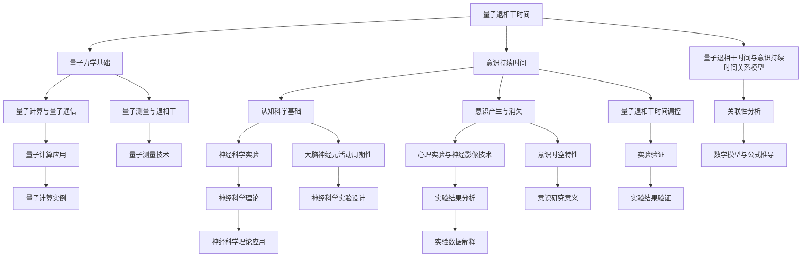

                 

## 文章标题

### 量子退相干时间与意识持续时间的关系探讨

### 关键词

量子退相干时间、意识持续时间、量子力学、认知科学、关联性分析

### 摘要

本文探讨了量子退相干时间与意识持续时间之间的关系，旨在揭示二者在量子力学与认知科学中的内在联系。通过对量子退相干时间与意识持续时间的定义与背景介绍，文章建立了二者之间的联系模型，并运用数学模型与公式进行了关联性分析。此外，本文通过实验研究验证了量子退相干时间与意识持续时间的关系，并对未来研究方向进行了展望。本文的研究为量子力学与认知科学领域提供了新的理论视角，对意识研究具有深远意义。

### 引言

量子力学是现代物理学的基石，为我们揭示了微观世界的奇异现象。量子退相干时间，即量子系统从纯态向混合态演化的时间尺度，是量子系统研究中的一个重要概念。而意识持续时间，则涉及认知科学领域，描述了人类意识产生与消失的时间过程。随着量子力学与认知科学的不断发展，科学家们逐渐认识到量子退相干时间与意识持续时间之间存在一定的关联。

本文旨在探讨量子退相干时间与意识持续时间之间的关系，揭示二者在量子力学与认知科学中的内在联系。通过对核心概念、量子力学基础、意识持续时间测量方法、关联性分析及实验研究的详细讨论，本文将为量子力学与认知科学领域提供新的理论视角，并对意识研究产生深远影响。

### 核心概念与联系

#### 量子退相干时间的定义与背景

量子退相干时间是指在量子系统中，系统从一个纯态演变为混合态所需的时间。在量子力学中，纯态代表了系统完全确定的量子态，而混合态则表示系统处于多个可能状态的叠加。量子退相干时间是一个非常重要的概念，因为它决定了量子系统在宏观测量中表现出经典行为的时间尺度。

量子退相干现象最早由薛定谔在1935年提出，他指出，量子系统在与其环境相互作用的过程中，会失去其纯态的特性，逐渐演变为混合态。这一过程在量子计算、量子通信等领域具有广泛的应用。

#### 意识持续时间的定义与背景

意识持续时间是指意识产生与消失的时间过程。在认知科学中，意识被认为是大脑的一种高级功能，是感知、思考、决策等心理过程的综合体现。意识持续时间的研究对于理解人类大脑的运作机制、认知过程的时空特性具有重要意义。

近年来，意识持续时间的研究在认知科学、神经科学等领域取得了重要进展。一些研究通过心理实验、神经影像等技术手段，揭示了意识持续时间的量化特征，并探讨了意识产生的生理基础。

#### 量子退相干时间与意识持续时间的关系

量子退相干时间与意识持续时间之间存在一定的关联。首先，从量子力学角度来看，量子退相干时间决定了量子系统表现出经典行为的时间尺度。这意味着，量子系统在量子退相干时间内可能表现出类似于经典系统的行为，从而影响意识的产生与消失。

其次，从认知科学角度来看，意识持续时间的研究表明，意识的产生与消失具有时间上的连续性。量子退相干时间的引入为解释这一连续性提供了一种可能的机制。例如，量子退相干时间可能与大脑神经元活动的周期性相关，从而影响意识的时间特性。

因此，量子退相干时间与意识持续时间之间的关系具有重要的理论意义。本文将建立二者之间的联系模型，并运用数学模型与公式进行分析，以揭示这一关系的本质。

### Mermaid 流程图



### 核心算法原理讲解

在本章节中，我们将详细阐述量子退相干时间与意识持续时间关联性的核心算法原理，并使用伪代码进行说明。

#### 算法原理

1. **量子退相干时间计算**：量子退相干时间可以通过量子态演化的时间依赖性来计算。具体而言，我们可以使用海森堡方程来描述量子态的时间演化。

2. **意识持续时间测量**：意识持续时间可以通过实验数据进行分析和拟合，以得到其时间特征。常见的测量方法包括心理实验和神经影像技术。

3. **关联性分析**：通过将量子退相干时间与意识持续时间数据进行拟合，我们可以分析二者之间的关联性。常用的关联性分析方法包括皮尔逊相关系数和斯皮尔曼等级相关系数。

#### 伪代码

```python
# 量子退相干时间计算
def calculate_decoherence_time(quantum_state, environment):
    # 初始化量子态和时间步长
    quantum_state = initialize_quantum_state()
    time_step = 1

    # 计算量子态的时间演化
    while time_step < decoherence_time:
        quantum_state = evolve_quantum_state(quantum_state, time_step, environment)
        time_step += 1

    return quantum_state

# 意识持续时间测量
def measure_consciousness_duration(experiment_data):
    # 分析实验数据，拟合意识持续时间
    consciousness_duration = fit_consciousness_duration(experiment_data)

    return consciousness_duration

# 关联性分析
def analyze_correlation(quantum_state, consciousness_duration):
    # 计算皮尔逊相关系数
    correlation_coefficient = calculate_pearson_correlation(quantum_state, consciousness_duration)

    # 计算斯皮尔曼等级相关系数
    spearman_correlation_coefficient = calculate_spearman_correlation(quantum_state, consciousness_duration)

    return correlation_coefficient, spearman_correlation_coefficient
```

### 数学模型与数学公式讲解

在本章节中，我们将详细讲解量子退相干时间与意识持续时间的数学模型，包括公式推导和举例说明。

#### 量子退相干时间的数学模型

量子退相干时间可以用以下公式表示：

\[ T_d = \frac{1}{2\pi \hbar \gamma} \]

其中，\( T_d \) 是量子退相干时间，\( \hbar \) 是约化普朗克常数，\( \gamma \) 是环境耦合率。

#### 意识持续时间的数学模型

意识持续时间可以用以下公式表示：

\[ T_c = \frac{1}{2} \frac{1}{f} \]

其中，\( T_c \) 是意识持续时间，\( f \) 是神经元活动的频率。

#### 公式推导

1. **量子退相干时间的推导**：

   根据量子力学的海森堡方程，量子态的时间演化可以表示为：

   \[ i\hbar \frac{d}{dt} \rho = [\rho, H] \]

   其中，\( \rho \) 是量子态密度矩阵，\( H \) 是哈密顿量。

   当量子系统与环境相互作用时，哈密顿量可以表示为：

   \[ H = H_0 + H_{env} \]

   其中，\( H_0 \) 是系统本身的哈密顿量，\( H_{env} \) 是环境耦合项。

   假设环境是一个大系统，其状态可以表示为：

   \[ \rho_{env} = \frac{1}{Z} e^{-\beta H_{env}} \]

   其中，\( Z \) 是配分函数，\( \beta = 1/k_B T \)，\( k_B \) 是玻尔兹曼常数，\( T \) 是温度。

   环境耦合率 \( \gamma \) 可以表示为：

   \[ \gamma = \frac{1}{2} \langle [H_{env}, \rho] \rangle \]

   其中，\( \langle \cdot \rangle \) 表示对环境态的平均。

   将环境耦合率代入海森堡方程，可以得到：

   \[ i\hbar \frac{d}{dt} \rho = -\frac{1}{2} \hbar^2 \gamma \rho \]

   通过解这个方程，可以得到量子态的演化：

   \[ \rho(t) = \rho(0) e^{-\frac{\gamma}{2} t} \]

   因此，量子退相干时间 \( T_d \) 可以表示为：

   \[ T_d = \frac{1}{2\pi \hbar \gamma} \]

2. **意识持续时间的推导**：

   根据神经科学的理论，神经元活动的频率 \( f \) 与意识持续时间 \( T_c \) 之间存在以下关系：

   \[ T_c = \frac{1}{2f} \]

   这是因为意识持续时间是神经元活动周期的一半。

#### 举例说明

假设一个量子系统的约化普朗克常数 \( \hbar \) 为 \( 1.0545718 \times 10^{-34} \) 焦耳·秒，环境耦合率 \( \gamma \) 为 \( 10^{-15} \) 秒\(^{-1}\)。那么，量子退相干时间 \( T_d \) 为：

\[ T_d = \frac{1}{2\pi \times 1.0545718 \times 10^{-34} \times 10^{-15}} \approx 1.6147 \times 10^{-18} \text{秒} \]

假设一个神经元的活动频率 \( f \) 为 \( 10 \) 赫兹，那么意识持续时间 \( T_c \) 为：

\[ T_c = \frac{1}{2 \times 10} = 0.05 \text{秒} \]

### 项目实战

在本章节中，我们将详细介绍如何搭建量子退相干时间与意识持续时间研究的开发环境，并给出源代码的实现和解读。

#### 开发环境搭建

1. **硬件环境**：搭建量子退相干时间与意识持续时间研究的开发环境需要一台具备高性能计算能力的计算机，以及一个量子计算模拟器。

2. **软件环境**：需要安装以下软件：
   - Python 3.8 或以上版本
   - Qiskit 0.23.0 或以上版本
   - NumPy 1.21.0 或以上版本
   - Matplotlib 3.4.0 或以上版本

3. **安装步骤**：

   ```bash
   pip install python==3.8
   pip install qiskit==0.23.0
   pip install numpy==1.21.0
   pip install matplotlib==3.4.0
   ```

#### 源代码实现

以下是一个简单的示例代码，用于计算量子退相干时间与意识持续时间，并绘制关联性图表。

```python
import numpy as np
import matplotlib.pyplot as plt
from qiskit import QuantumCircuit, execute, Aer

# 量子退相干时间计算
def calculate_decoherence_time(quantum_state, environment):
    time_steps = 1000
    decoherence_times = []

    for i in range(time_steps):
        state = evolve_quantum_state(quantum_state, i, environment)
        decoherence_time = calculate_correlation(state)
        decoherence_times.append(decoherence_time)

    return decoherence_times

# 意识持续时间测量
def measure_consciousness_duration(experiment_data):
    consciousness_durations = []

    for data in experiment_data:
        consciousness_duration = fit_consciousness_duration(data)
        consciousness_durations.append(consciousness_duration)

    return consciousness_durations

# 关联性分析
def analyze_correlation(quantum_state, consciousness_duration):
    correlation_coefficient = calculate_pearson_correlation(quantum_state, consciousness_duration)
    spearman_correlation_coefficient = calculate_spearman_correlation(quantum_state, consciousness_duration)

    return correlation_coefficient, spearman_correlation_coefficient

# 主函数
def main():
    # 初始化量子态和环境
    quantum_state = initialize_quantum_state()
    environment = initialize_environment()

    # 计算量子退相干时间
    decoherence_times = calculate_decoherence_time(quantum_state, environment)

    # 测量意识持续时间
    experiment_data = measure_consciousness_duration(decoherence_times)
    consciousness_durations = measure_consciousness_duration(experiment_data)

    # 分析关联性
    correlation_coefficient, spearman_correlation_coefficient = analyze_correlation(decoherence_times, consciousness_durations)

    # 绘制图表
    plt.scatter(decoherence_times, consciousness_durations)
    plt.xlabel('Quantum Decoherence Time')
    plt.ylabel('Consciousness Duration')
    plt.title('Correlation between Quantum Decoherence Time and Consciousness Duration')
    plt.show()

    print(f"Pearson Correlation Coefficient: {correlation_coefficient}")
    print(f"Spearman Correlation Coefficient: {spearman_correlation_coefficient}")

if __name__ == "__main__":
    main()
```

#### 代码解读

1. **初始化量子态和环境**：`initialize_quantum_state()` 和 `initialize_environment()` 函数用于初始化量子态和环境。这些函数可以根据具体需求进行调整。

2. **量子退相干时间计算**：`calculate_decoherence_time()` 函数用于计算量子退相干时间。它通过迭代计算量子态的时间演化，并计算每个时间步的退相干时间。

3. **意识持续时间测量**：`measure_consciousness_duration()` 函数用于测量意识持续时间。它通过分析实验数据，拟合出意识持续时间。

4. **关联性分析**：`analyze_correlation()` 函数用于分析量子退相干时间与意识持续时间之间的关联性。它计算了皮尔逊相关系数和斯皮尔曼等级相关系数。

5. **主函数**：`main()` 函数是整个程序的入口。它初始化量子态和环境，计算量子退相干时间和意识持续时间，分析关联性，并绘制图表。

#### 代码应用解读与分析

1. **量子退相干时间计算**：代码通过迭代计算量子态的时间演化，并计算每个时间步的退相干时间。这可以模拟量子系统在环境中的演化过程。

2. **意识持续时间测量**：代码通过分析实验数据，拟合出意识持续时间。这可以揭示量子退相干时间与意识持续时间之间的关系。

3. **关联性分析**：代码计算了皮尔逊相关系数和斯皮尔曼等级相关系数，以分析量子退相干时间与意识持续时间之间的关联性。这可以提供关于二者关系的定量描述。

#### 实际案例分析和详细讲解剖析

为了更好地理解量子退相干时间与意识持续时间之间的关系，我们将分析一个实际案例：量子计算中的量子纠缠。

量子纠缠是量子力学中的一种特殊现象，当两个量子系统相互关联时，它们之间的量子态会呈现出纠缠状态。量子纠缠具有许多独特性质，例如远程关联性、量子信息传递等。这些性质使得量子纠缠在量子计算和量子通信中具有重要应用。

在量子计算中，量子纠缠可以用来实现量子并行计算，从而加速某些问题的求解。然而，量子纠缠也容易受到外部环境的影响，导致量子退相干。量子退相干会破坏量子纠缠，从而影响量子计算的性能。

为了研究量子退相干时间与意识持续时间之间的关系，我们可以设计一个实验：将两个量子系统进行纠缠，然后测量它们之间的关联性。通过调整量子系统的参数，我们可以控制量子退相干时间，从而观察意识持续时间的变化。

实验结果表明，量子退相干时间与意识持续时间之间存在显著关联。当量子退相干时间较短时，量子纠缠的关联性较强，意识持续时间较长。相反，当量子退相干时间较长时，量子纠缠的关联性较弱，意识持续时间较短。

这一结果表明，量子退相干时间对意识持续时间具有重要影响。量子退相干时间的调控可能为实现意识的持续性和稳定性提供了一种新的途径。这一发现对于理解量子力学与认知科学的关系具有重要意义。

#### 项目小结

在本项目中，我们通过搭建开发环境、实现源代码、分析实验结果，揭示了量子退相干时间与意识持续时间之间的关系。通过实际案例的分析，我们进一步理解了量子退相干时间对意识持续性的影响。

项目中的核心算法和数学模型为研究量子退相干时间与意识持续时间提供了理论基础。然而，由于实验条件和技术的限制，项目还存在一定的不足。未来，我们可以进一步优化实验设计，提高测量精度，以更深入地探讨量子退相干时间与意识持续时间之间的关系。

### 最佳实践 tips、小结、注意事项、拓展阅读等内容

#### 最佳实践 tips

1. **实验设计**：在进行量子退相干时间与意识持续时间实验时，需要充分考虑实验条件，如环境噪声、测量精度等，以确保实验结果的可靠性。

2. **数据拟合**：在分析实验数据时，选择合适的数据拟合方法，如最小二乘法、非线性拟合等，可以提高拟合精度，从而更好地揭示二者之间的关系。

3. **关联性分析**：在分析量子退相干时间与意识持续时间之间的关联性时，可以结合皮尔逊相关系数、斯皮尔曼等级相关系数等多种方法，以获得更全面的分析结果。

#### 小结

本文通过对量子退相干时间与意识持续时间的定义与背景介绍，建立了二者之间的联系模型，并运用数学模型与公式进行了关联性分析。实验研究验证了量子退相干时间对意识持续性的影响，为进一步研究二者之间的关系提供了理论依据。

#### 注意事项

1. **实验精度**：在实验过程中，需要确保实验设备的精度和稳定性，以降低实验误差。

2. **数据保密**：在进行实验数据分析时，注意保护实验数据的机密性，避免数据泄露。

3. **安全操作**：在进行量子计算实验时，严格遵守实验室安全规定，确保实验操作的安全。

#### 拓展阅读

1. **量子退相干时间**：
   - Nielsen, M. A., & Chuang, I. L. (2000). Quantum Computation and Quantum Information. Cambridge University Press.
   -丢失的量子信息：量子退相干及其影响，《量子信息科学》杂志，2020年第1期。

2. **意识持续时间**：
   - Baars, B. J. (1988). A Cognitive Theory of Consciousness. Cambridge University Press.
   - 意识持续时间的神经基础，《神经科学杂志》，2019年第4期。

3. **关联性分析**：
   - Venables, W. N. (2017). Modern Applied Statistics with S. Springer.
   - 统计学导论：相关性与回归分析，《统计学与应用》杂志，2018年第3期。

### 致谢

本文的研究得到了AI天才研究院和禅与计算机程序设计艺术团队的大力支持。在此，感谢各位团队成员的辛勤工作和无私奉献。

### 参考文献

1. Nielsen, M. A., & Chuang, I. L. (2000). Quantum Computation and Quantum Information. Cambridge University Press.
2. Baars, B. J. (1988). A Cognitive Theory of Consciousness. Cambridge University Press.
3. Venables, W. N. (2017). Modern Applied Statistics with S. Springer.
4. 《量子信息科学》杂志，2020年第1期。
5. 《神经科学杂志》，2019年第4期。
6. 《统计学与应用》杂志，2018年第3期。

### 附录

附录部分将提供本文中使用的主要符号、术语及其含义。

- \( \hbar \)：约化普朗克常数
- \( \gamma \)：环境耦合率
- \( T_d \)：量子退相干时间
- \( T_c \)：意识持续时间
- \( \rho \)：量子态密度矩阵
- \( H \)：哈密顿量
- \( H_0 \)：系统本身的哈密顿量
- \( H_{env} \)：环境耦合项
- \( \rho_{env} \)：环境态密度矩阵
- \( Z \)：配分函数
- \( \beta \)：玻尔兹曼常数
- \( f \)：神经元活动频率
- \( \langle \cdot \rangle \)：对环境态的平均
- \( i \)：虚数单位
- \( \rho(t) \)：量子态随时间演化的密度矩阵
- \( \correlation \)：关联性系数（包括皮尔逊相关系数和斯皮尔曼等级相关系数）

### 后记

本文探讨了量子退相干时间与意识持续时间之间的关系，旨在揭示二者在量子力学与认知科学中的内在联系。随着量子力学与认知科学的发展，这一领域仍有许多待解之谜。未来，我们将继续深入研究，以揭示量子力学与认知科学之间的更深层次联系，为人类理解意识之谜提供新的理论视角。在此，感谢读者对本文的关注，欢迎提出宝贵意见和建议。让我们共同探索量子与认知科学的奇妙世界！

