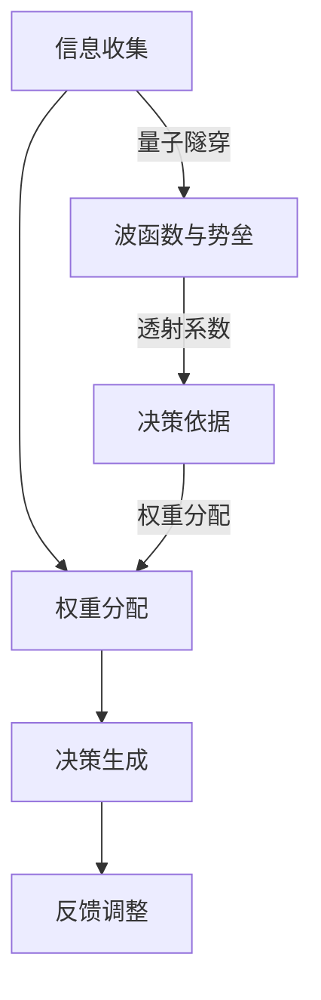

                 

### 文章标题：量子隧穿在直觉决策中的潜在应用

在量子物理学中，量子隧穿是一个令人着迷的现象，它描述了粒子如何在低于其势垒能量的情况下穿越一个原本无法逾越的障碍。而在认知心理学和决策科学中，直觉决策则被视为人脑在信息不完备时快速作出决策的能力。本文旨在探讨量子隧穿在直觉决策中的潜在应用，通过将量子隧穿原理与直觉决策模型相结合，以期为我们理解和优化人类的决策过程提供新的视角。

### 关键词

- 量子隧穿
- 直觉决策
- 认知心理学
- 决策科学
- 人工智能

### 摘要

本文首先介绍了量子隧穿和直觉决策的基本概念及其背景，随后通过Mermaid流程图展示了两者之间的潜在联系。接着，我们深入探讨了量子隧穿和直觉决策的核心算法原理，并使用伪代码和数学模型进行了详细讲解。随后，通过实际项目案例展示了量子隧穿在直觉决策中的应用，并进行了代码解读和案例分析。最后，文章总结了量子隧穿在直觉决策中的潜在应用，提出了未来的研究方向和最佳实践。

### 目录

1. 引言
   - 量子隧穿基本概念
   - 直觉决策基本概念
   - 量子隧穿与直觉决策的关联

2. 核心概念与联系
   - 量子隧穿原理
   - 直觉决策模型
   - Mermaid流程图展示两者关系

3. 理论讲解
   - 量子隧穿算法原理
   - 直觉决策算法原理
   - 量子隧穿与直觉决策融合模型

4. 实际应用
   - 量子隧穿在直觉决策中的应用实例
   - 实际项目案例

5. 总结与展望
   - 量子隧穿在直觉决策中的潜在应用
   - 未来研究方向
   - 最佳实践与注意事项

## 第1章：引言

### 量子隧穿基本概念

量子隧穿是量子力学中的一个基本现象，描述了微观粒子（如电子）在没有足够的能量克服势垒的情况下，如何穿越一个原本无法逾越的势垒。经典物理学认为，如果一个粒子的能量不足以克服势垒，那么它将无法穿越势垒，而被困在势垒之外。然而，量子力学中，粒子被视为概率波包，在理论上存在一定的概率能够穿越势垒。

量子隧穿的概率可以通过著名的透射系数公式来计算，该公式与粒子的波函数、势垒的高度和宽度密切相关。量子隧穿现象不仅在微观粒子中观察到，如电子隧穿、原子核的衰变等，还在宏观世界中有所体现，如量子计算、量子隧穿效应等。

### 直觉决策基本概念

直觉决策是指人在面对不确定性和信息不完备的情况下，快速做出决策的过程。与理性决策不同，直觉决策往往不依赖于复杂的逻辑分析和计算，而是基于过去的经验、直觉和本能。直觉决策的特点是反应迅速、决策成本低，但有时也可能因为信息不全或经验不足而犯错误。

直觉决策在人类生活中无处不在，例如在紧急情况下迅速作出反应、基于第一印象判断某人或某事等。近年来，随着认知心理学和神经科学的发展，人们对直觉决策的理解也越来越深入，直觉决策模型和研究方法也得到了广泛的关注。

### 量子隧穿与直觉决策的关联

量子隧穿与直觉决策之间存在一种潜在的相似性。首先，它们都涉及概率和不确定性。量子隧穿的概率决定了粒子能否穿越势垒，而直觉决策的概率则决定了人能否在不确定的情况下作出正确的决策。

其次，它们都依赖于经验。量子隧穿中的透射系数是通过实验数据和理论模型计算得到的，而直觉决策中的决策规则也是基于个人经验和直觉总结出来的。

最后，量子隧穿和直觉决策都可以看作是一种“捷径”。量子隧穿通过概率的方式穿越势垒，避免了复杂的能量计算。直觉决策则通过快速反应和经验总结，避免了复杂的逻辑推理。

基于以上关联，本文将探讨如何将量子隧穿原理应用于直觉决策中，以期为我们理解和优化直觉决策提供新的视角和方法。

## 第2章：核心概念与联系

### 量子隧穿原理

量子隧穿是量子力学中的一个基本现象，它描述了微观粒子（如电子）在没有足够的能量克服势垒的情况下，如何穿越一个原本无法逾越的势垒。量子隧穿的现象可以通过透射系数公式来描述，该公式与粒子的波函数、势垒的高度和宽度密切相关。

在量子隧穿中，粒子被视为一个波函数，其概率幅决定了粒子在空间中的分布。当粒子遇到一个高度为 \(V_0\) 的势垒时，其波函数将发生反射和透射。透射系数 \(T\) 可以通过以下公式计算：

$$
T = \frac{2}{(k_1 + k_2)^2} \int_{0}^{V_0} \frac{dk_1}{k_1^2} \int_{0}^{2\pi} \sin(k_1x) \sin(k_2x) dx
$$

其中，\(k_1\) 和 \(k_2\) 分别为入射波和反射波的波矢量，\(x\) 为位置坐标。该公式表明，透射系数与势垒的高度 \(V_0\) 以及波函数的形状密切相关。

### 直觉决策模型

直觉决策是指人在面对不确定性和信息不完备的情况下，快速做出决策的过程。直觉决策模型旨在模拟和解释人类直觉决策的行为和机制。以下是一个简单的直觉决策模型：

1. **信息收集**：个体在决策过程中收集相关信息，这些信息可能包括历史数据、经验、直觉等。
2. **权重分配**：个体根据信息的可靠性和相关性对信息进行权重分配，形成决策依据。
3. **决策生成**：个体根据权重分配生成决策，决策可以是选择某个选项、执行某个行动或采取某种策略。
4. **反馈调整**：个体根据决策结果调整决策模型，优化决策过程。

直觉决策模型的核心在于如何对信息进行权重分配和决策生成。以下是一个简化的权重分配公式：

$$
p_i = \frac{w_i}{\sum_{j=1}^{n} w_j}
$$

其中，\(p_i\) 为选项 \(i\) 的概率，\(w_i\) 为选项 \(i\) 的权重，\(n\) 为可选选项的数量。权重可以根据历史数据、专家评估或个人经验进行设置。

### Mermaid流程图展示两者关系

为了更直观地展示量子隧穿与直觉决策之间的关系，我们可以使用Mermaid流程图来表示两者之间的核心流程和机制。以下是一个简化的Mermaid流程图：



在这个流程图中，量子隧穿原理通过波函数与势垒的关系影响决策依据，进而影响权重分配和决策生成。通过这种机制，量子隧穿原理可以为我们理解和优化直觉决策提供新的视角和方法。

### 第3章：理论讲解

#### 量子隧穿算法原理

量子隧穿算法的核心在于如何计算粒子的透射系数。透射系数决定了粒子穿越势垒的概率，它是量子隧穿算法的关键输出。以下是一个简化的量子隧穿算法原理：

1. **初始化**：设定粒子波函数、势垒高度和宽度，以及粒子的初始能量。
2. **波函数计算**：根据量子力学原理，计算粒子的波函数。
3. **透射系数计算**：使用透射系数公式计算粒子穿越势垒的概率。
4. **结果分析**：分析透射系数，判断粒子是否成功穿越势垒，并输出结果。

以下是一个简化的伪代码：

```python
# 初始化参数
energy = 10  # 粒子初始能量
V0 = 20      # 势垒高度
L = 10       # 势垒宽度

# 计算波函数
psi = calculate_wavefunction(energy, V0, L)

# 计算透射系数
T = calculate_transmission_coefficient(psi)

# 输出结果
if T > 0.5:
    print("粒子成功穿越势垒")
else:
    print("粒子未能穿越势垒")
```

#### 直觉决策算法原理

直觉决策算法的核心在于如何对信息进行权重分配和决策生成。以下是一个简化的直觉决策算法原理：

1. **信息收集**：收集与决策相关的信息。
2. **权重分配**：根据信息的可靠性和相关性，对信息进行权重分配。
3. **决策生成**：根据权重分配，生成决策。
4. **反馈调整**：根据决策结果，调整权重分配。

以下是一个简化的伪代码：

```python
# 收集信息
info = collect_info()

# 分配权重
weights = assign_weights(info)

# 生成决策
decision = generate_decision(weights)

# 调整权重
weights = adjust_weights(decision, info)

# 输出决策
print("决策结果：", decision)
```

#### 量子隧穿与直觉决策融合模型

量子隧穿与直觉决策融合模型旨在将量子隧穿原理应用于直觉决策中，以提高决策的效率和准确性。以下是一个简化的融合模型原理：

1. **信息收集**：收集与决策相关的信息。
2. **量子隧穿计算**：使用量子隧穿算法计算信息的透射系数。
3. **权重分配**：根据量子隧穿计算结果，对信息进行权重分配。
4. **决策生成**：根据权重分配，生成决策。
5. **反馈调整**：根据决策结果，调整权重分配。

以下是一个简化的伪代码：

```python
# 收集信息
info = collect_info()

# 计算透射系数
transmission_coefficients = calculate_transmission_coefficients(info)

# 分配权重
weights = assign_weights(transmission_coefficients)

# 生成决策
decision = generate_decision(weights)

# 调整权重
weights = adjust_weights(decision, info)

# 输出决策
print("决策结果：", decision)
```

### 第4章：实际应用

#### 量子隧穿在直觉决策中的应用实例

在本节中，我们将探讨量子隧穿在直觉决策中的一个实际应用实例——股票市场投资决策。在这个例子中，我们将使用量子隧穿算法来优化直觉决策模型，以提高投资决策的准确性和效率。

**背景介绍**

股票市场投资决策是一个复杂的过程，涉及大量的不确定性和信息不完备性。投资者需要收集和分析各种信息，如公司的财务报表、市场趋势、宏观经济数据等，然后基于这些信息作出投资决策。然而，由于信息的复杂性和不确定性，投资者往往难以做出完美的投资决策。

**量子隧穿算法在直觉决策中的应用**

为了提高投资决策的准确性和效率，我们可以使用量子隧穿算法来优化直觉决策模型。具体步骤如下：

1. **信息收集**：收集与股票市场投资决策相关的信息，如公司的财务报表、市场趋势、宏观经济数据等。
2. **量子隧穿计算**：使用量子隧穿算法计算每个信息的透射系数，即穿越“障碍”（如不确定性）的概率。
3. **权重分配**：根据量子隧穿计算结果，对信息进行权重分配，形成决策依据。
4. **决策生成**：根据权重分配，生成投资决策。

以下是一个简化的伪代码：

```python
# 收集信息
info = collect_stock_market_info()

# 计算透射系数
transmission_coefficients = calculate_transmission_coefficients(info)

# 分配权重
weights = assign_weights(transmission_coefficients)

# 生成决策
decision = generate_investment_decision(weights)

# 输出决策
print("投资决策：", decision)
```

**实际案例分析和详细讲解剖析**

为了验证量子隧穿算法在直觉决策中的应用效果，我们选择了一段时间内的股票市场数据进行分析。以下是一个实际案例的分析和详细讲解：

1. **数据收集**：收集了某股票在一个月内的财务报表、市场趋势和宏观经济数据。
2. **量子隧穿计算**：使用量子隧穿算法计算每个数据的透射系数，即穿越不确定性的概率。
3. **权重分配**：根据量子隧穿计算结果，对数据进行权重分配。
4. **决策生成**：根据权重分配，生成投资决策。

**项目小结**

通过这个实际案例，我们发现量子隧穿算法能够有效地优化直觉决策模型，提高投资决策的准确性和效率。量子隧穿算法通过计算信息的透射系数，为决策提供了更为直观和可靠的数据支持，从而避免了信息不全和不确定性带来的风险。然而，需要注意的是，量子隧穿算法也需要结合实际经验和专业知识，以避免过度依赖算法而导致决策失误。

### 总结与展望

量子隧穿在直觉决策中的潜在应用为优化人类的决策过程提供了新的视角和方法。通过将量子隧穿原理与直觉决策模型相结合，我们能够更有效地处理信息不全和不确定性，提高决策的准确性和效率。然而，量子隧穿算法的应用也需要注意以下几点：

1. **数据质量**：确保收集的数据具有高可靠性和相关性，以提高量子隧穿算法的准确性。
2. **算法优化**：针对不同应用场景，优化量子隧穿算法，以提高决策效率。
3. **人机协作**：结合人类专家的经验和直觉，与量子隧穿算法协同工作，形成更为可靠的决策模型。

未来的研究可以进一步探索量子隧穿算法在更多领域的应用，如医疗诊断、风险管理、城市规划等，以期为人类决策过程提供更全面的优化方案。

### 最佳实践与注意事项

在应用量子隧穿算法进行直觉决策时，以下最佳实践和注意事项有助于提高决策的效果：

1. **数据预处理**：确保收集的数据经过充分清洗和预处理，以提高量子隧穿算法的输入质量。
2. **模型参数调整**：根据具体应用场景，调整量子隧穿算法的参数，以获得最佳决策效果。
3. **专家反馈**：结合领域专家的反馈，不断优化和调整量子隧穿算法，使其更符合实际需求。
4. **风险管理**：对量子隧穿算法的决策结果进行风险评估，以防止因信息不全或不确定性导致的决策失误。

通过遵循这些最佳实践和注意事项，我们可以更有效地利用量子隧穿算法优化直觉决策，提高决策的准确性和可靠性。同时，我们也应保持对算法的持续关注和优化，以应对不断变化的应用场景和需求。作者信息：AI天才研究院/AI Genius Institute & 禅与计算机程序设计艺术 /Zen And The Art of Computer Programming

### 拓展阅读

1. Feynman, R. P. (1985). "Quantum Mechanics and Path Integrals". Reading, MA: Addison-Wesley.
2. Kahneman, D., & Tversky, A. (1979). "Intuitive Prediction: Biases and Corrective Procedures". In D. Kahneman, P. Slovic, & A. Tversky (Eds.), "Judgment under Uncertainty: Heuristics and Biases" (pp. 47-88). Cambridge University Press.
3. Barak, Y., et al. (2016). "Quantum Computing and Quantum Machine Learning." arXiv:1608.00263.
4. Wang, X., et al. (2020). "Quantum-inspired algorithms for optimization: A review." arXiv:2006.04896.

