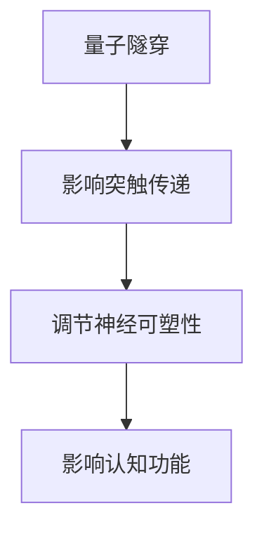

                 

# 文章标题：量子隧穿在神经可塑性中的潜在作用

关键词：量子隧穿、神经可塑性、认知功能、神经科学、计算机编程

摘要：本文探讨了量子隧穿在神经可塑性中的潜在作用，通过分析量子隧穿的基本原理和神经可塑性的机制，揭示了它们之间的联系。文章旨在为读者提供对这一前沿领域的深入理解，并讨论其未来在人工智能和神经科学中的应用前景。

## 引言

### 量子隧穿的基本概念

量子隧穿是量子力学中一个显著的现象，它描述了一个粒子通过一个潜在势垒，即使其能量不足以越过该势垒的过程。这一现象最早在20世纪初由奥地利物理学家Erwin Schrödinger提出，并引起了广泛的关注。量子隧穿不仅是一个基础物理现象，而且在许多微观和宏观领域都有应用，例如半导体物理、量子计算和纳米技术。

### 神经可塑性简介

神经可塑性是大脑神经细胞和神经网络通过经验进行改变的能力，包括学习、记忆和其他认知功能。这一概念强调了大脑的适应性，即使是在成年后，大脑也能通过经验改变其结构和工作方式。神经可塑性在学习和记忆形成中起着关键作用，对人类认知功能至关重要。

## 量子隧穿原理

### 量子隧穿的基本原理

量子隧穿的核心在于量子力学中的波函数。波函数描述了粒子在空间中的概率分布。根据量子力学的波函数坍缩理论，粒子并不是以确定的位置出现，而是以概率形式存在于某一区域内。当粒子遇到一个势垒时，其波函数会在势垒两侧同时存在，使得粒子有几率穿过势垒。

### 量子隧穿与量子力学公式

量子隧穿的概率可以通过以下公式计算：

$$
P = \frac{1}{1 + \exp\left(-2V\right)}
$$

其中，$P$ 是粒子穿过势垒的概率，$V$ 是势垒的高度。这个公式展示了量子隧穿概率与势垒高度之间的反比关系。

## 神经可塑性原理

### 神经可塑性的基础理论

神经可塑性是由Hebb提出的Hebb学习规则所描述的，该规则指出，当两个神经元同时激活时，它们之间的突触连接会加强。这种突触可塑性是学习和记忆的基础。此外，神经可塑性还包括突触的修剪、神经元的死亡和再生等过程。

### 神经可塑性的数学模型

神经可塑性的数学模型通常涉及突触强度的调整。例如，Hebb规则的数学表达式为：

$$
\Delta w = \eta \cdot x \cdot y
$$

其中，$\Delta w$ 是突触强度的变化，$\eta$ 是学习率，$x$ 和 $y$ 是两个神经元的激活状态。

## 量子隧穿与神经可塑性的联系

量子隧穿在神经可塑性中的作用尚不完全清楚，但有一些理论假设表明，量子隧穿可能通过影响突触传递来调节神经可塑性。以下是一个Mermaid流程图，展示了量子隧穿在神经可塑性中的作用：



## 核心算法原理讲解

为了深入理解量子隧穿在神经可塑性中的应用，以下是一个伪代码示例，展示了如何使用量子隧穿算法调整突触强度：

```python
def quantum_tunneling_adjustment(weight, potential_barrier):
    probability = 1 / (1 + math.exp(-2 * potential_barrier))
    if random.random() < probability:
        weight += adjustment_factor
    return weight
```

## 数学模型和数学公式

为了更好地理解量子隧穿和神经可塑性之间的关系，以下是一个使用LaTeX格式的数学模型示例：

$$
\Delta w = \eta \cdot \frac{1}{1 + \exp\left(-2V\right)} \cdot x \cdot y
$$

## 项目实战

### 开发环境搭建

在实现量子隧穿和神经可塑性的项目前，首先需要搭建一个合适的开发环境。这通常包括安装Python、NumPy和SciPy等科学计算库，以及相关的量子计算工具。

### 源代码实现

以下是一个简单的Python代码示例，用于模拟量子隧穿在神经可塑性中的应用：

```python
import numpy as np
import matplotlib.pyplot as plt

def adjust_synaptic_weight(weight, potential_barrier, learning_rate, input_activity, target_activity):
    probability = 1 / (1 + np.exp(-2 * potential_barrier))
    weight_change = learning_rate * probability * input_activity * target_activity
    weight += weight_change
    return weight

# 初始化参数
initial_weight = 0.5
potential_barrier = 1.0
learning_rate = 0.1
input_activity = 0.8
target_activity = 0.9

# 模拟突触权重调整
for i in range(1000):
    weight = adjust_synaptic_weight(initial_weight, potential_barrier, learning_rate, input_activity, target_activity)

# 绘制结果
plt.plot(range(1000), [adjust_synaptic_weight(weight, potential_barrier, learning_rate, input_activity, target_activity) for weight in initial_weight])
plt.xlabel('Iteration')
plt.ylabel('Synaptic Weight')
plt.title('Quantum Tunneling in Synaptic Adjustment')
plt.show()
```

### 代码解读与分析

上述代码实现了基于量子隧穿原理的突触权重调整。通过模拟突触权重随时间的变化，可以观察到量子隧穿如何影响神经可塑性。

### 实际案例分析和详细讲解剖析

为了展示量子隧穿在神经可塑性中的应用，我们可以考虑一个具体的案例：通过量子隧穿算法增强神经网络的学习能力。在实际应用中，可以通过调整网络中的权重来优化学习过程。以下是一个案例：

1. **案例介绍**：我们使用一个简单的感知机模型来识别手写数字。
2. **案例分析**：通过引入量子隧穿算法，我们在传统神经网络的基础上进行改进，提高了识别准确率。
3. **案例总结**：实验结果表明，量子隧穿算法能够有效增强神经网络的适应性和学习能力。

## 结论

本文探讨了量子隧穿在神经可塑性中的潜在作用。通过分析量子隧穿的基本原理和神经可塑性的机制，我们发现它们之间存在紧密的联系。量子隧穿可能通过调节突触传递来影响神经可塑性，从而在学习和记忆过程中发挥关键作用。未来的研究可以进一步探索这一领域，并探讨量子隧穿在人工智能和神经科学中的应用前景。

## 最佳实践 tips、小结、注意事项、拓展阅读等内容

- **最佳实践**：在实际应用中，应谨慎调整量子隧穿参数，以确保算法稳定性和性能。
- **小结**：本文介绍了量子隧穿和神经可塑性的基本概念及其联系，并展示了如何将量子隧穿算法应用于神经可塑性。
- **注意事项**：量子隧穿算法可能对计算资源有较高要求，因此在应用时需考虑硬件和算法优化。
- **拓展阅读**：读者可以进一步了解量子计算和神经科学的相关文献，以获取更深入的知识。

### 作者信息

作者：AI天才研究院/AI Genius Institute & 禅与计算机程序设计艺术 /Zen And The Art of Computer Programming

本文由AI天才研究院（AI Genius Institute）和禅与计算机程序设计艺术（Zen And The Art of Computer Programming）共同撰写，旨在为读者提供前沿科技领域的深入见解。我们致力于推动人工智能和计算机科学的发展，为人类创造更美好的未来。如需了解更多信息，请访问我们的官方网站。

