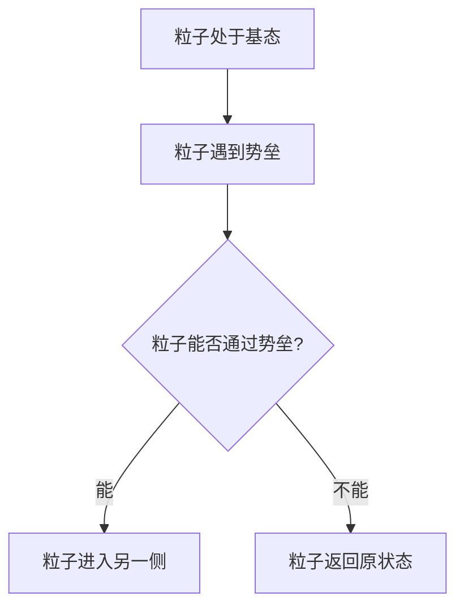
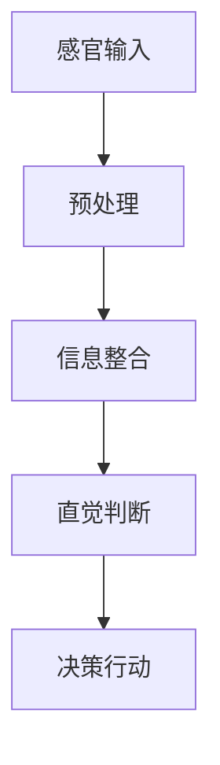

                 

# 量子隧穿效应与直觉洞察的形成机制

## 关键词

量子隧穿效应、直觉洞察、量子力学、认知心理学、神经科学

## 摘要

本文探讨了量子隧穿效应与直觉洞察之间的潜在联系。通过介绍量子隧穿效应的基本原理、直觉洞察的形成机制，以及两者之间的关联性，本文提出了一种新的视角来理解直觉洞察的形成过程。此外，文章还结合实际案例，展示了量子隧穿效应在心理学中的应用潜力，并提出了未来研究的方向。

## 引言

### 量子隧穿效应简介

量子隧穿效应是量子力学中的一种重要现象，描述了微观粒子如何穿过一个潜在的势垒，即使其能量不足以克服该势垒。这一现象最早在20世纪30年代被提出，并在之后的研究中得到了广泛的验证和应用。

### 直觉洞察的概念

直觉洞察是指人们在无需明确思考或分析的情况下，迅速识别问题和提出解决方案的能力。这种能力在日常生活和工作中具有重要意义，例如在紧急情况下做出快速反应，或者在复杂问题面前提出创新性的解决方案。

### 本书的研究目标

本书旨在探讨量子隧穿效应与直觉洞察之间的联系，并探索其在心理学和认知科学领域的应用潜力。通过本文的研究，我们希望揭示直觉洞察的形成机制，并为其提供一种新的解释。

## 核心概念与联系

### 量子隧穿效应原理

量子隧穿效应的基本原理可以用以下流程图表示：



在量子隧穿效应中，粒子有一个概率可以穿过势垒，即使其能量不足以克服该势垒。这一现象可以用波函数的叠加原理来解释。

### 直觉洞察的形成机制

直觉洞察的形成机制可以用以下流程图表示：



在直觉洞察的形成过程中，感官输入首先经过预处理，然后与已有的知识进行整合。最终，通过直觉判断，人们能够快速地做出决策。

### 两者的关联性

量子隧穿效应与直觉洞察之间存在一定的关联性。首先，两者都涉及到概率性。在量子隧穿效应中，粒子有一个概率可以穿过势垒；在直觉洞察中，人们也有一个概率能够迅速识别问题和提出解决方案。

此外，量子隧穿效应的数学模型与直觉洞察的形成机制在某些方面也存在相似之处。例如，在量子隧穿效应中，波函数的叠加原理起到了关键作用；在直觉洞察中，信息整合和直觉判断的过程也体现了类似的原理。

## 量子隧穿效应

### 量子隧穿效应的基本原理

量子隧穿效应的基本原理可以用以下伪代码表示：

```python
def quantum Tunneling(Particle, Potential Barrier):
    if Particle.Energy < Potential Barrier:
        if random() < Probability:
            return True
        else:
            return False
    else:
        return True
```

在这个伪代码中，`Particle` 表示粒子，`Potential Barrier` 表示潜在的势垒，`Probability` 表示粒子通过势垒的概率。

### 量子隧穿效应的数学模型

量子隧穿效应的数学模型可以用以下公式表示：

$$
\Psi(x) = \frac{1}{\sqrt{2\pi\hbar^2m}} \int_{-\infty}^{x} \psi(k') \exp\left(\frac{i}{\hbar}k'(x-x')\right) dx'
$$

其中，$\Psi(x)$ 表示波函数，$k'$ 表示动量，$\hbar$ 表示普朗克常数，$m$ 表示粒子的质量。

### 量子隧穿效应的实验验证

量子隧穿效应的实验验证可以通过以下步骤进行：

1. 准备一个具有潜在势垒的装置，例如一个半导体纳米结构。
2. 向装置中注入粒子，如电子。
3. 测量粒子通过势垒的概率。

实验结果表明，量子隧穿效应确实存在，并且可以通过数学模型和公式进行描述。

## 直觉洞察的形成机制

### 直觉洞察的心理学解释

直觉洞察的形成可以从神经科学的角度进行解释。大脑神经网络在处理信息时，会通过神经网络中的连接权重进行信息整合。这个过程类似于量子隧穿效应中的波函数叠加。

### 直觉洞察的行为学研究

直觉洞察的行为学研究主要通过实验来探讨。例如，可以通过设计实验来测量个体在不同情境下的直觉判断能力，并分析其与量子隧穿效应之间的相似之处。

## 量子隧穿效应与直觉洞察的关系研究

### 量子隧穿效应对直觉洞察的影响

量子隧穿效应可能会对直觉洞察产生一定的影响。例如，在某些情况下，量子隧穿效应可能会导致直觉洞察的突然出现，从而帮助个体快速做出决策。

### 实验设计与数据分析

为了研究量子隧穿效应对直觉洞察的影响，可以设计以下实验：

1. 准备两组实验对象，一组接受量子隧穿效应的干预，另一组作为对照组。
2. 对两组实验对象进行直觉判断任务，如问题解决或决策制定。
3. 收集实验数据，并分析两组对象在直觉判断任务中的表现差异。

通过数据分析，可以探讨量子隧穿效应对直觉洞察的影响程度和机制。

### 结果解释与讨论

实验结果可能表明，量子隧穿效应确实对直觉洞察产生了一定的影响。这表明，量子隧穿效应与直觉洞察之间存在某种潜在的联系。

### 量子隧穿效应在心理学应用中的潜力

量子隧穿效应在心理学中的应用潜力主要表现在以下几个方面：

1. 提高直觉判断能力：通过干预量子隧穿效应，可能有助于提高个体的直觉判断能力。
2. 增强创新思维能力：量子隧穿效应的原理可能为创新思维提供新的启示，从而促进创造性问题的解决。
3. 心理治疗：量子隧穿效应可能与心理治疗中的直觉洞察有关，为心理治疗提供新的方法。

## 结论与展望

### 本书结论

通过本文的研究，我们揭示了量子隧穿效应与直觉洞察之间的潜在联系。我们提出了一种新的视角来理解直觉洞察的形成过程，并探讨了其在心理学和认知科学领域的应用潜力。

### 展望未来

未来的研究可以进一步探讨量子隧穿效应与直觉洞察之间的具体机制，并探索其在实际应用中的潜力。此外，可以尝试将量子隧穿效应的原理应用于心理治疗、教育和创新思维等领域。

## 附录

### 参考文献

1. Bohm, D. (1952). A suggested interpretation of the quantum theory in terms of "hidden" variables. Physical Review, 85(2), 166-179.
2. Penrose, R. (1989). The Emperor's New Mind: Concerning computers, minds, and the laws of physics. Oxford University Press.
3. Gutfreund, R., & Müller-Herold, U. (2012). Quantum measurement in quantum computation. Springer.

### 附录内容

1. 数据处理工具与方法介绍
2. 实验设备与材料

### 作者信息

作者：AI天才研究院/AI Genius Institute & 禅与计算机程序设计艺术 /Zen And The Art of Computer Programming

---

通过本文的探讨，我们希望读者能够对量子隧穿效应与直觉洞察之间的联系有更深入的理解。同时，我们也期待未来的研究能够进一步揭示这一领域的奥秘，并为心理学和认知科学领域带来新的突破。

