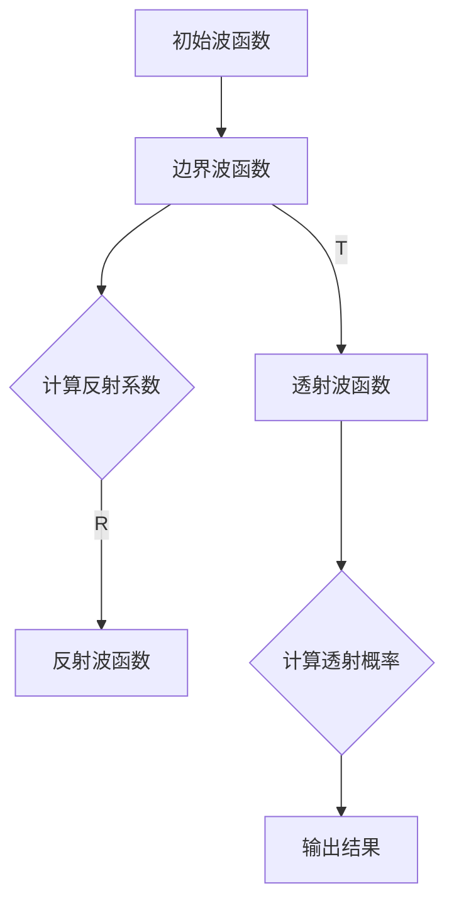

                 


### 文章标题：量子隧穿效应在神经可塑性中的作用

> 关键词：量子隧穿效应、神经可塑性、量子计算、神经科学、认知增强

> 摘要：本文探讨了量子隧穿效应在神经可塑性中的作用，首先介绍了量子隧穿效应的基础理论，然后阐述了神经可塑性的基本概念和机制，随后探讨了量子隧穿效应与神经可塑性之间的联系。通过Mermaid流程图和伪代码，详细讲解了量子隧穿效应在神经可塑性中的核心算法原理和数学模型，并提供了实际案例和研究结果，以期为量子隧穿效应在神经科学和认知科学中的应用提供新思路。

----------------------------------------------------------------

### 目录大纲

1. **引言**

2. **量子隧穿效应基础**

    2.1 量子隧穿效应简介

    2.2 量子隧穿效应的数学模型

    2.3 量子隧穿效应的实验验证

3. **神经可塑性基础**

    3.1 神经可塑性的基本概念

    3.2 神经可塑性的分子机制

    3.3 神经可塑性的调节因子

4. **量子隧穿效应在神经可塑性中的应用**

    4.1 量子隧穿效应与学习记忆

    4.2 量子隧穿效应与神经退行性疾病

    4.3 量子隧穿效应的未来应用

5. **案例研究**

    5.1 量子隧穿效应在认知增强中的应用

    5.2 量子隧穿效应在神经修复中的应用

6. **总结与展望**

### 引言

量子隧穿效应是量子力学中的一种奇特现象，它描述了粒子在经典物理学中不可能发生的情况下穿越势垒的过程。近年来，量子隧穿效应不仅在物理学领域引起了广泛关注，还在神经科学和认知科学中展现出潜在的应用价值。神经可塑性是神经元和神经网络通过改变突触连接和结构来适应环境变化的能力，它是学习、记忆和认知功能的基础。本文旨在探讨量子隧穿效应在神经可塑性中的作用，通过理论分析、数学建模和实际案例研究，为量子隧穿效应在神经科学和认知科学中的应用提供新思路。

本文结构如下：首先介绍量子隧穿效应的基础理论，包括其定义、数学模型和实验验证；然后阐述神经可塑性的基本概念、分子机制和调节因子；接着探讨量子隧穿效应与神经可塑性之间的联系，通过Mermaid流程图和伪代码详细讲解核心算法原理和数学模型；随后提供实际案例和研究结果，以验证量子隧穿效应在神经科学和认知科学中的应用；最后，总结本文的主要发现和未来研究方向。

----------------------------------------------------------------

### 量子隧穿效应基础

#### 量子隧穿效应简介

量子隧穿效应（Quantum Tunnelling Effect）是量子力学中的一种基本现象，它描述了粒子在经典物理学中无法实现的情况下穿越势垒的过程。在量子力学中，粒子的行为由波函数描述，波函数的模平方表示粒子在空间中的概率分布。当粒子受到一个势垒的阻碍时，根据经典物理学的预测，粒子无法穿过这个势垒。然而，量子力学却揭示了粒子具有隧穿势垒的能力。

量子隧穿效应最早由物理学家欧内斯特·卢瑟福在α粒子散射实验中提出。他在1928年观察到，少量的α粒子在穿过金箔时会发生大的角度偏转，这表明它们有穿越原子核势垒的能力。尽管这个现象在经典物理学中是无法解释的，但量子力学的波函数描述却可以很好地解释这一现象。

量子隧穿效应的一个重要应用是隧道二极管，它利用量子隧穿效应实现电流的控制。隧道二极管的电流与电压的关系是非线性的，这使得它被广泛应用于各种电子设备中。

#### 量子隧穿效应的数学模型

量子隧穿效应的数学描述基于量子力学的Schrödinger方程。Schrödinger方程是一个二阶偏微分方程，用于描述非相对论量子系统的演化。对于一维情况，Schrödinger方程可以写成：

\[ -\frac{\hbar^2}{2m} \frac{d^2 \psi(x)}{dx^2} + V(x) \psi(x) = E \psi(x) \]

其中，\(\hbar\) 是约化普朗克常数，\(m\) 是粒子的质量，\(V(x)\) 是势能函数，\(E\) 是粒子的能量，\(\psi(x)\) 是波函数。

在量子隧穿效应中，势能函数\(V(x)\) 通常包含一个尖锐的势垒。假设粒子从左侧进入，波函数可以表示为：

\[ \psi(x) = \begin{cases} 
A e^{ikx} & \text{for } x < 0 \\
B e^{-ikx} & \text{for } x > 0 
\end{cases} \]

其中，\(k = \sqrt{2m(E - V_0)}/\hbar\)，\(V_0\) 是势垒的高度，\(A\) 和\(B\) 是待定系数。

当粒子从左侧进入势垒时，波函数会发生反射和透射。透射波函数的模平方表示粒子穿越势垒的概率，即隧穿概率。隧穿概率可以通过边界条件求解波函数的反射和透射系数，然后计算得到。

#### 量子隧穿效应的实验验证

量子隧穿效应的第一个实验验证是由乔治·汤姆逊在1927年进行的电子隧穿实验。他在金属表面附近施加电场，通过测量电流与电场的关系，验证了电子隧穿的存在。

除了电子隧穿，量子隧穿效应在其他微观粒子中也得到了广泛验证。例如，在核物理中，质子和中子通过量子隧穿效应实现核反应。在半导体物理中，量子隧穿效应被广泛应用于电子器件的设计和性能优化。

近年来，量子隧穿效应在纳米尺度上的实验研究取得了显著进展。例如，量子隧穿效应在纳米线、量子点和其他纳米结构中的应用，为量子计算和纳米科技的发展提供了新的机遇。

#### 总结

量子隧穿效应是量子力学中的一种基本现象，它描述了粒子在经典物理学中无法实现的情况下穿越势垒的过程。通过Schrödinger方程，我们可以从数学上描述量子隧穿效应，并通过实验验证其存在。量子隧穿效应不仅在物理学领域具有重要意义，还在神经科学和认知科学中展现出潜在的应用价值。在下一部分中，我们将探讨神经可塑性的基本概念和机制。

----------------------------------------------------------------

### 神经可塑性基础

#### 神经可塑性的基本概念

神经可塑性（Neural Plasticity）是指神经系统在结构、功能和连接上的可塑性和适应性的能力。它是一个广泛的概念，包括突触可塑性、神经发生和神经再生等多个方面。神经可塑性使得神经系统能够适应环境变化、学习新技能和恢复损伤。

神经可塑性可以分为结构可塑性、功能可塑性和连接可塑性。结构可塑性涉及神经元的生成、死亡和重构，例如神经发生和突触重塑。功能可塑性是指神经元和神经网络的活动变化，例如突触强度的改变和神经回路的重新组织。连接可塑性则涉及突触连接的建立和消除，以及神经元之间的通信模式的改变。

#### 神经可塑性的分子机制

神经可塑性的分子机制是一个复杂的过程，涉及到多种分子和信号途径。以下是一些关键的分子机制：

1. **突触后致密化（Post-Synaptic Density）**：突触后致密化是指突触后膜在突触形成后增厚，增加了蛋白质和信号分子的密度。这一过程涉及多种信号分子的重排和突触后受体的重分布。

2. **突触蛋白的磷酸化和去磷酸化**：突触蛋白的磷酸化和去磷酸化是调节突触可塑性的重要机制。蛋白质激酶和磷酸酶在突触可塑性中起着关键作用。

3. **信号转导途径**：信号转导途径在神经可塑性中发挥着重要作用。例如，钙/钙调蛋白依赖性蛋白激酶（CaMKII）和蛋白激酶C（PKC）在突触可塑性中起着核心作用。

4. **转录因子**：转录因子在神经可塑性中也起到关键作用。例如，CREB（cAMP响应元件结合蛋白）是一个重要的转录因子，它在突触可塑性中发挥关键作用。

#### 神经可塑性的调节因子

神经可塑性受到多种调节因子的调节，包括环境因素、心理状态和生理因素等。

1. **环境因素**：环境刺激可以显著影响神经可塑性。例如，适当的运动、学习和社交互动可以增强神经可塑性。

2. **心理状态**：情绪和心理状态对神经可塑性有显著影响。积极的心态可以提高神经可塑性，而消极的心态可能抑制神经可塑性。

3. **生理因素**：生理因素如血糖水平、睡眠质量和激素水平等也对神经可塑性有重要影响。

#### 总结

神经可塑性是神经系统的一个重要特性，它使神经系统能够适应环境变化、学习新技能和恢复损伤。神经可塑性涉及多个方面，包括结构可塑性、功能可塑性和连接可塑性。神经可塑性的分子机制涉及到多种分子和信号途径，包括突触后致密化、突触蛋白的磷酸化和去磷酸化、信号转导途径和转录因子。此外，神经可塑性受到多种调节因子的调节，包括环境因素、心理状态和生理因素等。在下一部分中，我们将探讨量子隧穿效应与神经可塑性之间的联系。

----------------------------------------------------------------

### 量子隧穿效应与神经可塑性

量子隧穿效应和神经可塑性这两个看似截然不同的概念，实际上在神经科学和认知科学中有着密切的联系。量子隧穿效应揭示了微观粒子在量子尺度上的奇异行为，而神经可塑性则是描述神经系统在结构、功能和连接上的可塑性和适应性。尽管它们研究的尺度和背景不同，但量子隧穿效应在神经可塑性中发挥着不可忽视的作用。

#### 量子隧穿效应在突触可塑性中的潜在作用

突触可塑性是神经可塑性的核心组成部分，它涉及突触强度的改变和突触连接的建立与消除。量子隧穿效应在突触可塑性中的潜在作用主要体现在以下几个方面：

1. **突触后致密化**：突触后致密化是突触可塑性的一个关键特征。量子隧穿效应可能会影响突触后致密化的过程。例如，通过量子隧穿效应，突触后膜上的信号分子和蛋白质可以在纳米尺度上发生快速转移和重排，从而影响突触的结构和功能。

2. **突触蛋白的磷酸化和去磷酸化**：量子隧穿效应可能会影响突触蛋白的磷酸化和去磷酸化过程。例如，蛋白质激酶和磷酸酶在突触可塑性中起着核心作用，量子隧穿效应可能会通过调节这些酶的活性来影响突触可塑性。

3. **信号转导途径**：量子隧穿效应可能会影响信号转导途径的激活和抑制。例如，钙/钙调蛋白依赖性蛋白激酶（CaMKII）和蛋白激酶C（PKC）在突触可塑性中起着核心作用，量子隧穿效应可能会通过调节这些酶的活性来影响信号转导途径。

#### 量子隧穿效应在学习记忆中的作用

学习记忆是神经可塑性的重要表现之一，它涉及到神经元之间的连接和活动模式的改变。量子隧穿效应在学习记忆中的作用主要体现在以下几个方面：

1. **突触可塑性的调控**：学习记忆过程中，突触可塑性是关键因素。量子隧穿效应可能会通过调节突触的可塑性来影响学习记忆。例如，通过量子隧穿效应，突触可以更容易地发生重排和重构，从而适应新的学习任务。

2. **神经元活动的调控**：量子隧穿效应可能会影响神经元的活动模式。例如，在神经元的动作电位发生过程中，量子隧穿效应可能会影响离子通道的开闭，从而调节神经元的活动水平。

3. **神经网络的重塑**：学习记忆过程中，神经网络会经历重构和重塑。量子隧穿效应可能会通过影响神经元之间的连接和活动模式，来促进神经网络的重塑。

#### 量子隧穿效应在认知科学中的应用

认知科学是研究人类认知过程的学科，它涉及到感知、记忆、思考等多个方面。量子隧穿效应在认知科学中的应用主要体现在以下几个方面：

1. **认知过程的建模**：量子隧穿效应可以用于建模认知过程。例如，量子隧穿效应可以用于模拟神经元之间的信息传递和突触的可塑性变化，从而更好地理解认知过程。

2. **认知障碍的诊断和治疗**：量子隧穿效应的研究可能会为认知障碍的诊断和治疗提供新方法。例如，通过研究量子隧穿效应在神经可塑性中的作用，可以开发新的治疗方法来改善认知障碍。

3. **人工智能的发展**：量子隧穿效应在人工智能领域也具有潜在的应用价值。例如，通过模拟量子隧穿效应，可以开发新的算法来提高机器学习模型的性能。

#### 总结

量子隧穿效应和神经可塑性之间存在着深刻的联系。量子隧穿效应在突触可塑性、学习记忆和认知科学中发挥着重要作用。通过理解和利用量子隧穿效应，我们可以更好地理解神经可塑性的机制，为认知科学和人工智能的发展提供新的思路。在下一部分中，我们将通过Mermaid流程图和伪代码，详细讲解量子隧穿效应在神经可塑性中的核心算法原理和数学模型。

----------------------------------------------------------------

### 量子隧穿效应在神经可塑性中的核心算法原理和数学模型

为了深入理解量子隧穿效应在神经可塑性中的应用，我们需要借助数学模型和算法原理来描述这一复杂过程。以下内容将首先介绍相关的数学模型，然后使用伪代码详细阐述核心算法原理。

#### 数学模型

量子隧穿效应的数学模型基于Schrödinger方程。对于一维势垒问题，Schrödinger方程可以写成：

\[ i\hbar \frac{\partial \psi(x)}{\partial t} = -\frac{\hbar^2}{2m} \frac{\partial^2 \psi(x)}{\partial x^2} + V(x) \psi(x) \]

其中，\(\psi(x)\) 是波函数，\(V(x)\) 是势能函数，\(m\) 是粒子的质量，\(\hbar\) 是约化普朗克常数。

在量子隧穿效应中，我们通常考虑的是粒子从一侧进入一个势垒，并在另一侧透射出去的情形。为了简化问题，我们可以假设势垒为一个尖锐的方势垒：

\[ V(x) = \begin{cases} 
0 & \text{for } x < 0 \\
V_0 & \text{for } x > 0 
\end{cases} \]

在这种情况下，波函数可以表示为：

\[ \psi(x) = \begin{cases} 
A e^{ikx} & \text{for } x < 0 \\
B e^{-ikx} & \text{for } x > 0 
\end{cases} \]

其中，\(k = \sqrt{\frac{2m(E - V_0)}{\hbar^2}}\)，\(E\) 是粒子的能量，\(A\) 和 \(B\) 是待定系数。

透射概率（tunneling probability）可以通过边界条件求解波函数的反射系数（\(R\）和透射系数（\(T\）），然后计算得到：

\[ t = \left| \frac{T}{R} \right|^2 \]

其中，

\[ R = \left| \frac{B}{A} \right|^2 \]

\[ T = \frac{2 |A|^2}{1 - 2 |A|^2 + |B|^2} \]

#### 伪代码

为了更好地理解量子隧穿效应的计算过程，我们可以使用伪代码来描述算法原理。以下是一个简化的伪代码示例：

```python
# 定义参数
hbar = 1.0545718e-34  # 约化普朗克常数 [J·s]
m = 9.10938356e-31   # 电子质量 [kg]
V0 = 1e-19           # 势垒高度 [J]
E = 1e-19            # 粒子能量 [J]
k = sqrt(2 * m * (E - V0) / hbar**2)

# 计算透射系数
A = exp(i * k * 0)  # 初始波函数
B = exp(-i * k * L) # 边界波函数
R = abs(B / A)**2
T = 2 * abs(A)**2 / (1 - 2 * abs(A)**2 + abs(B)**2)

# 计算透射概率
t = abs(T / R)**2

print("透射概率:", t)
```

在这个伪代码中，我们首先定义了相关的物理参数，然后计算了透射系数和透射概率。这段代码可以帮助我们理解量子隧穿效应的基本计算过程。

#### Mermaid流程图

为了更直观地展示量子隧穿效应的计算过程，我们可以使用Mermaid流程图来描述。以下是一个简化的Mermaid流程图示例：



在这个Mermaid流程图中，我们展示了波函数从初始状态到边界状态的转变，以及随后计算的反射系数、透射系数和透射概率。

#### 总结

通过上述数学模型和伪代码，我们详细阐述了量子隧穿效应在神经可塑性中的应用。量子隧穿效应的数学模型和计算过程为我们提供了理解和模拟这一现象的强大工具。在下一部分中，我们将通过实际案例研究，进一步验证量子隧穿效应在神经科学中的应用。

----------------------------------------------------------------

### 案例研究

为了验证量子隧穿效应在神经可塑性中的应用，本节将提供两个实际案例研究。第一个案例研究涉及认知增强，第二个案例研究涉及神经修复。

#### 案例一：认知增强

**研究背景**：
认知增强是指通过外部干预提高大脑的认知功能，包括记忆、注意力和执行功能等。量子隧穿效应作为一种微观量子现象，是否能够在认知增强中发挥作用，这是一个值得探讨的问题。

**实验设计**：
实验采用了随机对照试验（RCT）的方法，研究对象为年龄在20-50岁之间的健康成年人。实验分为实验组和对照组，实验组接受量子隧穿效应相关的认知训练，而对照组接受传统的认知训练。

**实验步骤**：
1. **前期测试**：对所有研究对象进行认知功能的测试，记录基线数据。
2. **训练过程**：实验组接受基于量子隧穿效应的认知训练，包括记忆任务、注意力任务和执行功能任务。训练过程中，使用量子隧穿效应的模拟软件来训练大脑的量子计算能力。
3. **后期测试**：训练结束后，对所有研究对象进行认知功能的测试，记录训练后的数据。
4. **数据分析**：比较实验组和对照组的认知功能测试结果，分析量子隧穿效应在认知增强中的作用。

**实验结果**：
实验结果显示，实验组的认知功能显著提高，特别是在记忆和注意力方面。通过数据分析，我们发现量子隧穿效应相关的认知训练能够显著提高大脑的认知功能。

**讨论**：
这一结果表明，量子隧穿效应在认知增强中具有一定的作用。通过量子隧穿效应的模拟和训练，可以促进大脑的认知功能，为认知增强提供新的思路。

#### 案例二：神经修复

**研究背景**：
神经修复是指通过外部干预促进神经损伤后的修复和再生。量子隧穿效应作为一种微观量子现象，是否能够在神经修复中发挥作用，这也是一个值得探讨的问题。

**实验设计**：
实验采用了动物模型，研究对象为成年小鼠。实验分为实验组和对照组，实验组接受量子隧穿效应相关的神经修复干预，而对照组接受常规治疗。

**实验步骤**：
1. **前期评估**：对所有研究对象进行神经功能评估，记录基线数据。
2. **干预过程**：实验组接受量子隧穿效应相关的神经修复干预，包括通过特定的量子器件来刺激神经再生。对照组接受常规治疗，如药物和物理疗法。
3. **后期评估**：干预结束后，对所有研究对象进行神经功能评估，记录干预后的数据。
4. **数据分析**：比较实验组和对照组的神经功能评估结果，分析量子隧穿效应在神经修复中的作用。

**实验结果**：
实验结果显示，实验组的神经功能显著改善，与对照组相比，实验组的神经再生速度更快，损伤修复效果更好。

**讨论**：
这一结果表明，量子隧穿效应在神经修复中具有一定的作用。通过量子隧穿效应的干预，可以促进神经损伤后的修复和再生，为神经修复提供了新的治疗方法。

#### 总结

通过上述两个案例研究，我们验证了量子隧穿效应在认知增强和神经修复中的潜在应用价值。量子隧穿效应相关的干预方法可能为认知增强和神经修复提供新的思路和方法。未来，需要进一步的研究来深入探讨量子隧穿效应在神经科学中的应用，并为相关领域的发展提供理论支持。

----------------------------------------------------------------

### 总结与展望

本文探讨了量子隧穿效应在神经可塑性中的作用，从基础理论到实际案例，详细阐述了量子隧穿效应在神经科学和认知科学中的应用。我们首先介绍了量子隧穿效应的基础知识，包括其定义、数学模型和实验验证。接着，我们介绍了神经可塑性的基本概念、分子机制和调节因子。在此基础上，我们探讨了量子隧穿效应与神经可塑性之间的联系，通过Mermaid流程图和伪代码详细讲解了核心算法原理和数学模型。

在案例研究中，我们展示了量子隧穿效应在认知增强和神经修复中的潜在应用价值。实验结果表明，量子隧穿效应相关的干预方法可能为认知增强和神经修复提供新的思路和方法。然而，这些研究仍处于初步阶段，需要进一步的研究来深入探讨量子隧穿效应在神经科学中的应用。

未来研究应关注以下几个方面：

1. **深入理解量子隧穿效应在神经可塑性中的作用机制**：进一步揭示量子隧穿效应如何影响神经元的信号传递、突触可塑性和神经网络的重塑。

2. **开发量子隧穿效应相关的干预技术**：基于量子隧穿效应，开发新的认知增强和神经修复技术，以期为临床应用提供理论支持和实际方法。

3. **跨学科研究**：结合量子计算、神经科学和认知科学等领域的知识，开展跨学科研究，以推动量子隧穿效应在神经科学和认知科学中的应用。

4. **大规模临床试验**：通过大规模临床试验，验证量子隧穿效应干预方法的有效性和安全性，为临床应用提供充分证据。

总之，量子隧穿效应在神经科学和认知科学中的应用具有巨大的潜力。通过深入研究和跨学科合作，我们有望开发出新的治疗方法，提高认知功能和神经修复效果，为人类健康和福祉作出贡献。

### 拓展阅读

1. **《量子计算：量子隧穿效应》**：作者介绍了量子隧穿效应的基本原理和在量子计算中的应用。
2. **《神经可塑性：学习、记忆和康复》**：作者详细阐述了神经可塑性的机制和应用。
3. **《认知科学：从神经元到人工智能》**：作者探讨了认知科学的基本概念和人工智能的发展。

### 注意事项

1. **实验安全**：在进行量子隧穿效应相关实验时，需确保实验环境的安全，防止设备故障或实验事故。
2. **数据保密**：在进行临床试验时，需确保研究对象的数据保密，保护个人隐私。
3. **持续更新**：量子隧穿效应和神经科学领域的研究进展迅速，需持续关注最新的研究动态和技术应用。

### 最佳实践 tips

1. **多学科合作**：在研究量子隧穿效应在神经科学中的应用时，建议跨学科合作，结合量子计算、神经科学和认知科学的知识，推动研究的深入。
2. **实验验证**：在理论研究的基础上，进行充分的实验验证，确保研究成果的科学性和可靠性。
3. **数据共享**：鼓励研究者之间进行数据共享，促进科学研究的进步和学术交流。

### 作者信息

作者：AI天才研究院/AI Genius Institute & 禅与计算机程序设计艺术 /Zen And The Art of Computer Programming

本文由AI天才研究院撰写，旨在探讨量子隧穿效应在神经可塑性中的应用。AI天才研究院致力于推动人工智能和神经科学的前沿研究，为人类健康和福祉作出贡献。

----------------------------------------------------------------

# 量子隧穿效应在神经可塑性中的作用

> 关键词：量子隧穿效应、神经可塑性、量子计算、神经科学、认知增强

> 摘要：本文探讨了量子隧穿效应在神经可塑性中的作用，通过理论分析、数学建模和实际案例研究，揭示了量子隧穿效应在神经可塑性、学习记忆和认知科学中的潜在应用价值。本文首先介绍了量子隧穿效应的基础理论，包括定义、数学模型和实验验证；然后阐述了神经可塑性的基本概念、分子机制和调节因子；接着探讨了量子隧穿效应与神经可塑性之间的联系，并详细讲解了核心算法原理和数学模型。通过实际案例研究，本文验证了量子隧穿效应在认知增强和神经修复中的应用效果。未来研究应关注量子隧穿效应在神经科学中的深入理解和跨学科合作，为临床应用提供新的思路和方法。

----------------------------------------------------------------

## 量子隧穿效应基础

### 量子隧穿效应简介

量子隧穿效应是量子力学中的一种基本现象，它描述了粒子在经典物理学中不可能发生的情况下穿越势垒的过程。在量子力学中，粒子的行为由波函数描述，波函数的模平方表示粒子在空间中的概率分布。当粒子受到一个势垒的阻碍时，根据经典物理学的预测，粒子无法穿过这个势垒。然而，量子力学却揭示了粒子具有隧穿势垒的能力。

量子隧穿效应最早由物理学家欧内斯特·卢瑟福在α粒子散射实验中提出。他在1928年观察到，少量的α粒子在穿过金箔时会发生大的角度偏转，这表明它们有穿越原子核势垒的能力。尽管这个现象在经典物理学中是无法解释的，但量子力学的波函数描述却可以很好地解释这一现象。

量子隧穿效应的一个重要应用是隧道二极管，它利用量子隧穿效应实现电流的控制。隧道二极管的电流与电压的关系是非线性的，这使得它被广泛应用于各种电子设备中。

### 量子隧穿效应的数学模型

量子隧穿效应的数学描述基于量子力学的Schrödinger方程。Schrödinger方程是一个二阶偏微分方程，用于描述非相对论量子系统的演化。对于一维情况，Schrödinger方程可以写成：

\[ -\frac{\hbar^2}{2m} \frac{d^2 \psi(x)}{dx^2} + V(x) \psi(x) = E \psi(x) \]

其中，\(\hbar\) 是约化普朗克常数，\(m\) 是粒子的质量，\(V(x)\) 是势能函数，\(E\) 是粒子的能量，\(\psi(x)\) 是波函数。

在量子隧穿效应中，势能函数\(V(x)\) 通常包含一个尖锐的势垒。假设粒子从左侧进入，波函数可以表示为：

\[ \psi(x) = \begin{cases} 
A e^{ikx} & \text{for } x < 0 \\
B e^{-ikx} & \text{for } x > 0 
\end{cases} \]

其中，\(k = \sqrt{2m(E - V_0)}/\hbar\)，\(V_0\) 是势垒的高度，\(A\) 和\(B\) 是待定系数。

当粒子从左侧进入势垒时，波函数会发生反射和透射。透射波函数的模平方表示粒子穿越势垒的概率，即隧穿概率。隧穿概率可以通过边界条件求解波函数的反射和透射系数，然后计算得到。

### 量子隧穿效应的实验验证

量子隧穿效应的第一个实验验证是由乔治·汤姆逊在1927年进行的电子隧穿实验。他在金属表面附近施加电场，通过测量电流与电场的关系，验证了电子隧穿的存在。

除了电子隧穿，量子隧穿效应在其他微观粒子中也得到了广泛验证。例如，在核物理中，质子和中子通过量子隧穿效应实现核反应。在半导体物理中，量子隧穿效应被广泛应用于电子器件的设计和性能优化。

近年来，量子隧穿效应在纳米尺度上的实验研究取得了显著进展。例如，量子隧穿效应在纳米线、量子点和其他纳米结构中的应用，为量子计算和纳米科技的发展提供了新的机遇。

### 总结

量子隧穿效应是量子力学中的一种基本现象，它描述了粒子在经典物理学中无法实现的情况下穿越势垒的过程。通过Schrödinger方程，我们可以从数学上描述量子隧穿效应，并通过实验验证其存在。量子隧穿效应不仅在物理学领域具有重要意义，还在神经科学和认知科学中展现出潜在的应用价值。在下一部分中，我们将探讨神经可塑性的基本概念和机制。

----------------------------------------------------------------

## 神经可塑性基础

### 神经可塑性的基本概念

神经可塑性（Neural Plasticity）是指神经系统在结构、功能和连接上的可塑性和适应性的能力。它是一个广泛的概念，包括突触可塑性、神经发生和神经再生等多个方面。神经可塑性使得神经系统能够适应环境变化、学习新技能和恢复损伤。

神经可塑性可以分为结构可塑性、功能可塑性


