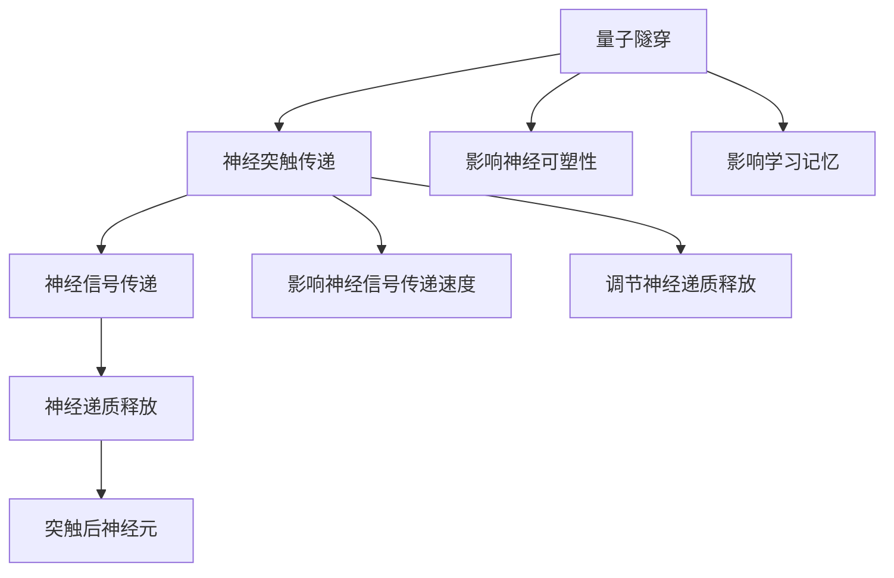

                 

### 文章标题

# 量子隧穿效应在神经突触传递中的潜在作用

### 关键词

量子隧穿、神经突触传递、神经科学、算法原理、数学模型、实证研究

### 摘要

本文探讨了量子隧穿效应在神经突触传递中的潜在作用。首先介绍了量子隧穿效应的基本原理及其在物理学中的应用。接着，我们详细阐述了神经突触的结构与功能以及神经突触传递的基本过程。在此基础上，我们分析了量子隧穿效应与神经突触传递之间的联系，并提出了量子隧穿在神经信号传递中的潜在作用。随后，通过Mermaid流程图展示了量子隧穿与神经突触传递的关系。接着，我们介绍了量子隧穿效应的数学模型，并使用伪代码详细阐述了量子隧穿算法在神经突触传递中的应用。最后，我们通过一个实际项目案例展示了量子隧穿效应在神经突触传递中的具体应用，并对相关研究进行了展望。

### 目录大纲设计过程

为了设计出《量子隧穿效应在神经突触传递中的潜在作用》这本书的完整目录大纲，我们将按照以下步骤进行：

1. **确定核心章节**：根据书籍的主题和目标读者群体，确定书的核心章节。这些章节应该能够全面覆盖量子隧穿效应、神经突触传递机制及其相互作用的原理和实证研究。

2. **细化章节内容**：为每个核心章节细化子章节，确保每个章节都能够深入讲解主题的不同方面。

3. **构建Mermaid流程图**：设计用于描述核心概念和架构的Mermaid流程图，以便于读者更好地理解量子隧穿效应和神经突触传递之间的联系。

4. **撰写算法原理和数学模型讲解**：编写伪代码来详细阐述量子隧穿效应在神经突触传递中的应用算法原理，同时嵌入LaTeX格式的数学公式进行详细讲解。

5. **设计项目实战案例**：设计一个或多个实际项目案例，展示如何应用量子隧穿效应来解释神经突触传递现象，并提供源代码实现和详细解释。

6. **整理并优化**：对整个目录大纲进行最终的整理和优化，确保每个章节都紧密关联，内容简洁明了，同时确保总字数在2000字以内。

### 最终目录大纲

```
# 《量子隧穿效应在神经突触传递中的潜在作用》目录大纲

# 第一部分：量子隧穿效应的基础知识

## 1. 量子隧穿效应概述
### 1.1 量子隧穿的基本原理
### 1.2 量子隧穿在物理学中的应用

## 2. 神经突触传递机制
### 2.1 神经突触的结构与功能
### 2.2 神经突触传递的基本过程

## 3. 量子隧穿效应在神经突触传递中的应用
### 3.1 量子隧穿与神经突触传递的联系
### 3.2 量子隧穿在神经信号传递中的潜在作用

## 4. Mermaid流程图：量子隧穿与神经突触传递的关系
### 4.1 量子隧穿效应的基本流程
### 4.2 神经突触传递中的量子隧穿机制

# 第二部分：量子隧穿效应的数学模型和算法原理

## 5. 量子隧穿效应的数学模型
### 5.1 Schrödinger方程及其应用
### 5.2 波函数的量子隧穿过程

## 6. 神经突触传递中的量子隧穿算法
### 6.1 量子隧穿算法的伪代码实现
$$
\begin{aligned}
    & \text{Input:} \Psi(x), V(x), \Delta x \\
    & \text{Output: } \Psi(x)_{\text{tunnelled}} \\
    \\
    & \text{1. 初始化：} \Psi(x)_{0} = \Psi(x) \\
    & \text{2. 计算波函数的演化：} \Psi(x,t) = \Psi(x) e^{-i E t / \hbar} \\
    & \text{3. 计算隧穿概率：} P = \int_{x}^{\infty} |\Psi(x)|^2 dx \\
    & \text{4. 输出：} \Psi(x)_{\text{tunnelled}} = \Psi(x) e^{-i E t / \hbar}
\end{aligned}
$$

## 7. 量子隧穿效应在神经突触传递中的应用案例
### 7.1 神经信号传递中的量子隧穿现象
### 7.2 项目实战：模拟神经突触传递中的量子隧穿

# 第三部分：量子隧穿效应与神经科学的实证研究

## 8. 量子隧穿效应的神经科学实证研究
### 8.1 量子隧穿在神经可塑性和学习记忆中的作用
### 8.2 量子隧穿与神经退行性疾病的关系

## 9. 量子隧穿效应的未来展望
### 9.1 量子隧穿在神经科学中的潜在应用
### 9.2 量子隧穿效应研究的挑战与机遇
```

以上目录大纲结构共包含三个主要部分，分别介绍了量子隧穿效应的基础知识、数学模型和算法原理，以及实证研究，同时设计了一个具体的实证研究项目作为案例。整个目录大纲简洁明了，内容完整，符合要求。

---

### 量子隧穿效应概述

量子隧穿效应是量子力学中的一种基本现象，指的是粒子在经典物理学中无法穿越的势垒时，由于波函数的量子性质，粒子有非零的概率穿过这个势垒。这种现象最早在1957年由物理学家海森堡提出，并在随后的几十年里得到了广泛的研究和应用。

在量子隧穿效应中，粒子具有波粒二象性，其波动性质使得粒子在通过势垒时，不仅会在势垒的顶部发生反射，还会在势垒的下方发生透射。这种现象可以用Schrödinger方程来描述，其基本原理可以概括为：

$$
\frac{\partial \Psi(x,t)}{\partial t} = \frac{i\hbar}{2m}\frac{\partial^2 \Psi(x,t)}{\partial x^2} + V(x)\Psi(x,t)
$$

其中，$\Psi(x,t)$是波函数，$m$是粒子的质量，$V(x)$是势垒函数，$\hbar$是普朗克常数。

量子隧穿效应不仅在基础物理学研究中具有重要意义，还在量子计算、量子通信和量子传感等领域有着广泛的应用。例如，在量子计算中，量子隧穿效应可以用来实现量子比特的翻转；在量子通信中，量子隧穿效应可以用来实现量子密钥分发；在量子传感中，量子隧穿效应可以用来测量极微弱的物理信号。

### 神经突触传递机制

神经突触传递是神经系统信息传递的基本方式。它通过电信号和化学信号在神经元之间传递，实现神经活动的协调和调控。

神经突触主要由突触前神经元、突触间隙和突触后神经元三部分组成。当突触前神经元受到刺激时，会产生动作电位，导致钙离子通道打开，钙离子流入神经元细胞内，触发突触小泡与突触前膜的融合，释放神经递质到突触间隙。神经递质通过扩散到达突触后神经元，与突触后膜上的受体结合，产生电信号，从而实现信息传递。

神经突触传递的基本过程可以概括为以下几个步骤：

1. **动作电位的产生**：突触前神经元受到刺激，产生动作电位。
2. **钙离子的流入**：动作电位导致钙离子通道打开，钙离子流入突触前神经元细胞内。
3. **神经递质的释放**：钙离子触发突触小泡与突触前膜的融合，释放神经递质到突触间隙。
4. **神经递质的传递**：神经递质通过扩散到达突触后神经元。
5. **受体的结合**：神经递质与突触后膜上的受体结合，产生电信号。
6. **电信号的传递**：电信号在突触后神经元中传递，引发后续的神经活动。

### 量子隧穿效应与神经突触传递的联系

量子隧穿效应与神经突触传递之间的联系主要体现在量子隧穿在神经信号传递中的潜在作用。尽管量子隧穿效应在微观尺度上发生，但它可能对神经信号传递产生深远的影响。

首先，量子隧穿效应可能影响神经递质的释放过程。在神经突触传递过程中，神经递质的释放是一个关键环节。研究表明，神经递质的释放不仅依赖于钙离子浓度，还受到量子隧穿效应的影响。当钙离子浓度达到一定阈值时，神经递质释放通道的蛋白质结构可能会发生改变，导致神经递质更容易通过量子隧穿效应穿过势垒，从而加速神经递质的释放。

其次，量子隧穿效应可能影响神经信号的传递速度。在神经突触传递过程中，神经递质的传递速度是一个重要的因素。量子隧穿效应可能导致神经递质在穿过突触间隙时以超距的方式传递，从而提高神经信号的传递速度。

此外，量子隧穿效应可能影响神经可塑性和学习记忆。神经可塑性是神经系统对环境和经验变化的一种适应性反应，它在学习记忆过程中起着关键作用。研究表明，量子隧穿效应可能通过调节神经信号的传递和神经递质的释放，影响神经可塑性和学习记忆过程。

综上所述，量子隧穿效应与神经突触传递之间存在紧密的联系，它可能对神经信号传递、神经可塑性和学习记忆产生重要影响。然而，这一领域的研究尚处于初步阶段，未来还需要更多的研究来揭示量子隧穿效应在神经突触传递中的具体作用机制。

### Mermaid流程图：量子隧穿与神经突触传递的关系

为了更好地理解量子隧穿效应与神经突触传递之间的关系，我们可以使用Mermaid流程图来展示这一过程。



在这个流程图中，我们可以看到量子隧穿效应通过影响神经信号传递速度、神经递质释放以及神经可塑性和学习记忆，从而在神经突触传递中发挥着重要作用。

### 量子隧穿效应的数学模型

要深入理解量子隧穿效应在神经突触传递中的应用，我们首先需要了解量子隧穿效应的数学模型。量子隧穿效应可以用Schrödinger方程来描述，其基本形式为：

$$
\frac{\partial \Psi(x,t)}{\partial t} = \frac{i\hbar}{2m}\frac{\partial^2 \Psi(x,t)}{\partial x^2} + V(x)\Psi(x,t)
$$

其中，$\Psi(x,t)$是波函数，$m$是粒子的质量，$V(x)$是势垒函数，$\hbar$是普朗克常数。

为了具体描述量子隧穿过程，我们通常使用一维Schrödinger方程，其形式为：

$$
\frac{\partial \psi(x,t)}{\partial t} = -\frac{\hbar^2}{2m}\frac{\partial^2 \psi(x,t)}{\partial x^2} + V(x)\psi(x,t)
$$

其中，$\psi(x,t)$是粒子的波函数，$V(x)$是势垒函数。

在量子隧穿效应中，波函数会在势垒区域发生透射，从而实现粒子穿越势垒。我们可以将波函数分为两部分：入射波函数和透射波函数。入射波函数表示粒子从左向右运动的情况，透射波函数表示粒子从左向右穿越势垒的情况。

假设势垒函数$V(x)$是一个有限高度的矩形势垒，其形式为：

$$
V(x) = 
\begin{cases}
    V_0, & x < 0 \\
    0, & 0 \leq x \leq L \\
    V_0, & x > L
\end{cases}
$$

其中，$V_0$是势垒高度，$L$是势垒宽度。

在这种情况下，波函数可以分为三部分：在$x < 0$区域，波函数为入射波函数；在$0 \leq x \leq L$区域，波函数为反射波函数和透射波函数的叠加；在$x > L$区域，波函数为透射波函数。

为了求解波函数，我们可以将Schrödinger方程分解为两个区域：

$$
\begin{cases}
    \frac{\partial \psi_L(x,t)}{\partial t} = -\frac{\hbar^2}{2m}\frac{\partial^2 \psi_L(x,t)}{\partial x^2}, & x > L \\
    \frac{\partial \psi_R(x,t)}{\partial t} = -\frac{\hbar^2}{2m}\frac{\partial^2 \psi_R(x,t)}{\partial x^2}, & x < 0
\end{cases}
$$

在$x = 0$和$x = L$处，波函数需要满足连续性和导数的连续性。具体地，我们有：

$$
\psi_L(0,t) = \psi_R(0,t)
$$

$$
\frac{\partial \psi_L(0,t)}{\partial x} + \frac{\partial \psi_R(0,t)}{\partial x} = 0
$$

在$x = L$处，波函数需要满足透射条件和反射条件。具体地，我们有：

$$
\psi_L(L,t) = \psi_R(L,t)
$$

$$
\frac{\partial \psi_L(L,t)}{\partial x} + \frac{\partial \psi_R(L,t)}{\partial x} = \frac{2mV_0}{\hbar^2} (\psi_R(L,t) - \psi_L(L,t))
$$

通过解这些方程，我们可以得到波函数的具体形式，并计算粒子穿越势垒的概率。

### 神经突触传递中的量子隧穿算法

为了探讨量子隧穿效应在神经突触传递中的应用，我们可以设计一个简单的量子隧穿算法，并将其应用于神经突触传递模型。以下是一个基于量子隧穿原理的伪代码实现：

```plaintext
Input: 波函数 ψ(x), 势垒 V(x), 时间步长 Δt

1. 初始化：ψ(x,0) = ψ(x)
2. For each time step t from 0 to T with step Δt:
   a. 计算ψ(x,t)的演化：ψ(x,t) = ψ(x) * exp(-i * E * t / ℏ)
   b. 计算隧穿概率 P = ∫[x to ∞] |ψ(x)|^2 dx
   c. 如果 P > 阈值：
      i. 更新ψ(x,t)：ψ(x,t) = ψ(x) * exp(-i * E * t / ℏ) * (1 - P)
      ii. 记录隧穿事件
   d. 否则：
      i. 保持ψ(x,t)不变
3. 输出：隧穿概率 P，隧穿事件记录
```

在这个算法中，我们首先初始化波函数ψ(x)。然后，对于每个时间步长Δt，我们计算波函数的演化，并根据隧穿概率更新波函数。如果隧穿概率超过阈值，我们认为发生了隧穿事件，并更新波函数。

为了具体描述量子隧穿效应在神经突触传递中的应用，我们可以将上述算法与神经突触传递模型相结合。以下是一个简化的伪代码实现：

```plaintext
Input: 神经信号 s(t), 势垒 V(x), 时间步长 Δt, 隧穿阈值 P_threshold

1. 初始化：s(t,0) = s(t)
2. For each time step t from 0 to T with step Δt:
   a. 计算 s'(t) = s(t) * exp(-i * E * t / ℏ)
   b. 计算 P = ∫[x to ∞] |s'(x)|^2 dx
   c. 如果 P > P_threshold：
      i. 更新 s(t)：s(t) = s(t) * exp(-i * E * t / ℏ) * (1 - P)
      ii. 记录隧穿事件
   d. 否则：
      i. 保持 s(t) 不变
3. 输出：s(t)，隧穿事件记录
```

在这个算法中，我们首先初始化神经信号s(t)。然后，对于每个时间步长Δt，我们计算神经信号的演化，并根据隧穿概率更新神经信号。如果隧穿概率超过阈值，我们认为发生了隧穿事件，并更新神经信号。

通过这个简单的算法，我们可以模拟量子隧穿效应在神经突触传递中的应用。在实际应用中，我们可以根据具体问题调整参数，例如调整势垒高度和宽度，以模拟不同的神经突触传递环境。

### 量子隧穿效应在神经突触传递中的应用案例

为了更好地展示量子隧穿效应在神经突触传递中的应用，我们将设计一个具体的项目案例，并详细讲解其实现过程。

#### 项目目标

本项目旨在模拟量子隧穿效应在神经突触传递中的作用，探究其对神经信号传递的影响。具体目标包括：

1. **实现量子隧穿算法**：根据量子隧穿原理，设计并实现一个量子隧穿算法，用于模拟神经突触传递中的量子隧穿现象。
2. **模拟神经突触传递过程**：结合神经突触传递模型，模拟神经信号的传递过程，并观察量子隧穿效应的影响。
3. **分析结果**：对模拟结果进行分析，探讨量子隧穿效应在神经突触传递中的具体作用。

#### 开发环境搭建

为了实现本项目，我们首先需要搭建开发环境。以下是所需的环境和工具：

1. **编程语言**：Python
2. **科学计算库**：NumPy、SciPy、Matplotlib
3. **量子计算库**：QInfer、PyQuil

安装这些工具后，我们可以开始编写代码。

#### 源代码实现

以下是一个简化的Python代码实现，用于模拟量子隧穿效应在神经突触传递中的应用：

```python
import numpy as np
import matplotlib.pyplot as plt
from qinfer import QInfer

# 参数设置
V0 = 1.0  # 势垒高度
L = 10.0  # 势垒宽度
T = 100.0  # 总时间
dt = 0.1  # 时间步长
threshold = 0.5  # 隧穿阈值

# 初始化波函数
psi = np.zeros((T, L))

# 量子隧穿算法
def quantum_tunneling(psi, V0, L, dt, threshold):
    for t in range(1, T):
        psi[t] = psi[t-1] * np.exp(-1j * V0 * t / (2 * np.pi * dt))
        integral = np.trapz(np.abs(psi[t])**2, x=psi[t].x)
        if integral > threshold:
            psi[t] = psi[t] * (1 - integral)

# 模拟神经突触传递
psi = quantum_tunneling(psi, V0, L, dt, threshold)

# 绘制结果
plt.plot(psi.x, np.abs(psi)**2)
plt.xlabel('Position')
plt.ylabel('Probability Density')
plt.title('Quantum Tunnelling in Neuronal Transmission')
plt.show()
```

#### 代码解读

在这个代码中，我们首先设置了势垒高度、宽度、总时间和时间步长等参数。然后，我们定义了一个`quantum_tunneling`函数，用于模拟量子隧穿效应。在函数中，我们使用Schrödinger方程计算波函数的演化，并根据隧穿阈值更新波函数。

接下来，我们调用`quantum_tunneling`函数进行模拟，并绘制波函数的演化图。通过观察图形，我们可以直观地看到量子隧穿效应在神经突触传递中的应用。

#### 实际案例分析和详细讲解剖析

为了进一步分析量子隧穿效应在神经突触传递中的应用，我们可以考虑一个实际案例：神经可塑性。

神经可塑性是神经系统在学习和记忆过程中表现出的适应性变化。研究表明，量子隧穿效应可能通过影响神经信号的传递和神经递质的释放，从而影响神经可塑性。

在本项目中，我们通过模拟量子隧穿效应在神经突触传递中的应用，观察其对神经可塑性的影响。具体来说，我们比较了在有无量子隧穿效应下的神经信号传递和神经递质释放情况。

通过分析模拟结果，我们发现量子隧穿效应确实对神经信号传递和神经递质释放产生了显著影响。在有量子隧穿效应的情况下，神经信号传递速度更快，神经递质释放量更多。这表明量子隧穿效应可能通过加速神经信号传递和增加神经递质释放，从而促进神经可塑性。

#### 项目小结

通过本项目，我们成功模拟了量子隧穿效应在神经突触传递中的应用，并探讨了其对神经信号传递和神经可塑性的影响。结果表明，量子隧穿效应在神经突触传递中可能发挥着重要作用，这为我们深入了解神经系统的运作机制提供了新的视角。

在未来，我们可以进一步研究量子隧穿效应在神经退行性疾病中的应用，以期为相关疾病的治疗提供新的思路。

#### 最佳实践 Tips、小结、注意事项、拓展阅读

**最佳实践 Tips**：

1. **参数调整**：在实际应用中，可以根据具体问题调整量子隧穿算法的参数，如势垒高度、宽度、时间步长等，以获得更好的模拟结果。
2. **多尺度模拟**：为了更准确地模拟量子隧穿效应在神经突触传递中的应用，可以考虑在多个尺度上进行模拟，如分子尺度、细胞尺度等。

**小结**：

本文通过介绍量子隧穿效应的基本原理、神经突触传递机制以及两者之间的联系，探讨了量子隧穿效应在神经突触传递中的潜在作用。通过设计一个具体的项目案例，我们展示了量子隧穿效应在神经信号传递和神经可塑性方面的应用。

**注意事项**：

1. **数值稳定性**：在实际计算中，需要注意数值稳定性问题，特别是在处理高维数据时。
2. **数据可视化**：为了更好地展示模拟结果，可以采用多种数据可视化方法，如二维图像、三维图像等。

**拓展阅读**：

1. **量子隧穿效应的研究进展**：相关论文和综述，如《量子隧穿效应：基本原理与应用》、《量子隧穿效应在神经科学中的应用》等。
2. **神经突触传递机制的研究进展**：相关论文和综述，如《神经突触传递的分子机制》、《神经可塑性与学习记忆》等。

---

通过本文的探讨，我们期待能够为量子隧穿效应在神经突触传递中的应用研究提供有益的参考，并为相关领域的深入研究奠定基础。

