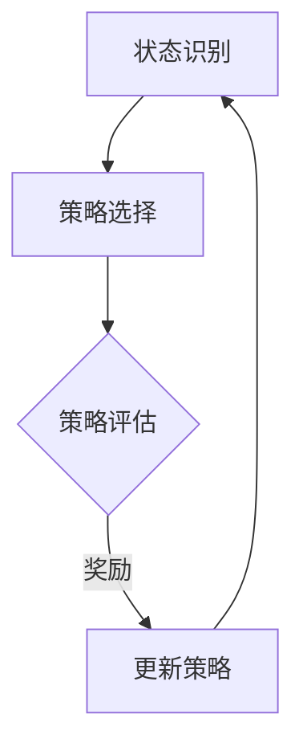

                 

### 引言

**关键词**：长期策略推理、神经规划器、优化、人工智能

**摘要**：本文将深入探讨长期策略推理优化中神经规划器的作用。长期策略推理在决策过程、游戏AI、自动驾驶等领域具有广泛的应用，但传统的策略推理方法往往存在计算复杂度高等问题。神经规划器的引入，为解决这些问题提供了新的思路。本文首先介绍了长期策略推理的基本概念和重要性，然后详细阐述了神经规划器的定义、原理以及在策略推理中的应用背景。通过本文的阅读，读者将能够理解神经规划器在优化长期策略推理过程中的关键作用，并对其应用前景有所了解。

长期策略推理是人工智能领域的一个重要研究方向。它涉及到决策者在面对长期目标时，如何通过一系列策略选择来最大化收益或最小化损失。传统的方法，如马尔可夫决策过程（MDP）和价值迭代等，在处理某些复杂问题时存在计算复杂度高、效率低的问题。随着深度学习技术的发展，神经规划器作为一种新的方法，因其强大的表示和学习能力，逐渐成为解决长期策略推理优化问题的有力工具。

### 第1章：长期策略推理概述

**1.1 策略推理的定义**

策略推理是人工智能中的一个核心问题，它涉及到如何从给定的环境状态中，选择一个最优的行动，以实现某个目标。策略推理可以简单理解为“如何决策”的问题。在人工智能领域，策略推理通常被用于决策过程、游戏AI、自动驾驶、资源分配等问题。

策略推理可以分为两种类型：短期策略推理和长期策略推理。短期策略推理主要关注当前一步或几步的决策，而长期策略推理则关注如何在一系列的决策中实现整体的最优解。

**1.2 长期策略推理的重要性**

长期策略推理在许多实际应用中具有重要意义。例如，在自动驾驶领域，车辆需要在复杂的交通环境中做出一系列的决策，如何时加速、何时刹车、如何避让等。如果仅仅考虑短期策略推理，可能导致车辆在某一时刻做出最优决策，但从长期来看，可能无法达到整体最优的目标。

此外，在游戏AI领域，智能体需要在游戏中制定一系列的策略，以实现最终胜利。例如，在国际象棋中，一个棋子的一次移动可能只是局部最优解，但如果考虑整个棋局，就需要通过长期策略推理来找到全局最优解。

**1.3 长期策略推理的应用领域**

长期策略推理在多个领域都有广泛的应用。以下是一些典型的应用场景：

1. **自动驾驶**：自动驾驶汽车需要在复杂的交通环境中做出一系列的决策，如行驶路径规划、避障、红绿灯控制等。通过长期策略推理，可以确保车辆在整体上达到最优的行驶效果。

2. **游戏AI**：在游戏AI中，智能体需要通过长期策略推理来制定游戏策略，以实现最终胜利。例如，在国际象棋、围棋等游戏中，长期策略推理可以帮助智能体找到最优的棋局策略。

3. **资源分配**：在资源分配问题中，需要通过长期策略推理来优化资源的分配，以实现整体的最优效果。例如，在数据中心中，通过长期策略推理可以优化服务器的使用，提高资源利用率。

4. **金融投资**：在金融投资中，投资者需要通过长期策略推理来制定投资策略，以实现长期的投资回报最大化。通过长期策略推理，可以优化投资组合，降低风险。

总的来说，长期策略推理在多个领域都有重要的应用价值，它不仅可以帮助我们解决复杂的决策问题，还可以提高系统的整体性能和效率。随着人工智能技术的发展，长期策略推理的研究将会越来越深入，为各个领域带来更多的创新和突破。

### 第2章：核心概念与联系

**2.1 神经网络的基本原理**

神经网络（Neural Networks）是模仿人脑神经元工作原理而构建的计算模型，它由大量的神经元（或节点）组成，这些神经元通过连接（或权重）相互通信。每个神经元都可以接收来自其他神经元的输入，并通过一个非线性激活函数产生输出。神经网络的核心原理是通过学习输入和输出之间的关系，从而实现对数据的分类、回归或特征提取。

神经网络的组成主要包括以下几个部分：

1. **输入层**：接收外部输入信号。
2. **隐藏层**：对输入信号进行处理和计算。
3. **输出层**：生成最终的输出结果。

神经网络的工作原理是通过反向传播算法（Backpropagation）来不断调整网络中的权重，从而最小化预测误差。反向传播算法的核心思想是将输出误差反向传播到每个神经元，并根据误差来更新每个神经元的权重。

**2.2 策略优化与决策过程**

策略优化（Policy Optimization）是决策过程的一个重要组成部分，它涉及到如何从给定的策略集合中选择一个最优策略，以最大化预期收益或最小化预期损失。策略优化通常基于马尔可夫决策过程（MDP）框架，它包括以下基本概念：

1. **状态**（State）：系统当前所处的环境条件。
2. **动作**（Action）：系统可以采取的操作。
3. **策略**（Policy）：决定在给定状态下采取哪个动作的规则。
4. **奖励**（Reward）：动作执行后获得的即时奖励或惩罚。
5. **价值函数**（Value Function）：衡量策略在给定状态下预期收益的指标。

决策过程的基本步骤如下：

1. **状态识别**：系统识别当前所处的状态。
2. **策略选择**：根据当前状态和策略，选择一个动作。
3. **动作执行**：执行选定的动作。
4. **结果评估**：评估动作执行后的结果，包括获得的奖励和状态变化。
5. **策略更新**：根据结果评估，更新策略，以实现长期最优。

**2.3 Mermaid流程图展示神经规划器与策略推理的关系**

为了更好地理解神经规划器在策略推理中的作用，我们可以使用Mermaid流程图来展示其与策略推理之间的关系。以下是一个简化的Mermaid流程图：



在这个流程图中，状态识别是策略推理的第一步，系统通过神经网络识别当前的状态。然后，策略选择基于神经网络模型，从可能的动作中选择一个最优动作。策略评估通过计算策略在当前状态下的奖励，判断策略的好坏。最后，根据评估结果更新策略，进入下一轮的状态识别和策略选择。

通过这个流程图，我们可以看到神经规划器在整个策略推理过程中的关键作用：它不仅帮助系统识别状态，还通过学习奖励信号来不断优化策略，从而实现长期最优。这种结合神经网络和策略优化方法，使得神经规划器在处理复杂决策问题时具有显著优势。

### 第3章：神经规划器原理

**3.1 神经规划器的基本结构**

神经规划器（Neural Planner）是一种基于深度学习的方法，用于解决长期策略推理问题。它通过将决策过程建模为一个神经网络，从而在复杂的环境中实现高效的策略优化。神经规划器的基本结构通常包括以下几个部分：

1. **状态编码器**：将环境中的状态编码为神经网络可以处理的向量表示。
2. **动作编码器**：将可能的动作编码为神经网络可以处理的向量表示。
3. **策略网络**：通过输入状态编码和动作编码，输出一个策略，即当前状态下应采取的动作。
4. **价值网络**：评估当前策略的价值，即在未来状态下可能获得的奖励。
5. **奖励预测器**：预测未来状态的奖励，用于指导策略的更新。

神经规划器的工作流程如下：

1. **状态编码**：将当前状态输入到状态编码器，得到状态编码向量。
2. **动作编码**：将所有可能的动作输入到动作编码器，得到动作编码向量。
3. **策略选择**：通过策略网络，将状态编码向量和动作编码向量映射为策略。
4. **动作执行**：根据策略选择一个动作执行。
5. **结果评估**：计算执行动作后的结果，包括获得的奖励和状态变化。
6. **策略更新**：根据结果评估，通过价值网络和奖励预测器更新策略网络。

**3.2 神经规划器的学习算法**

神经规划器的学习算法通常基于深度学习中的端到端训练方法。其核心思想是通过大量的数据训练神经网络，使其能够从经验中学习并优化策略。以下是神经规划器学习算法的详细步骤：

1. **数据收集**：从环境中收集大量状态、动作和奖励数据。
2. **数据预处理**：对收集的数据进行预处理，包括状态编码、动作编码和奖励归一化。
3. **训练策略网络**：通过策略网络输入状态编码和动作编码，输出策略。使用反向传播算法训练策略网络，使其能够最大化预期奖励。
4. **训练价值网络**：通过价值网络输入状态编码和策略网络输出，输出策略价值。使用反向传播算法训练价值网络，使其能够准确预测策略价值。
5. **训练奖励预测器**：通过奖励预测器输入状态编码和动作编码，输出未来奖励预测。使用反向传播算法训练奖励预测器，使其能够准确预测未来奖励。
6. **策略更新**：根据价值网络和奖励预测器的输出，更新策略网络，以实现长期最优。

**3.3 伪代码详细阐述神经规划器的学习过程**

以下是神经规划器学习过程的伪代码：

```python
# 神经规划器学习过程伪代码

# 初始化神经网络参数
初始化策略网络参数θ_policy
初始化价值网络参数θ_value
初始化奖励预测器参数θ_reward

# 数据收集
数据集D = 收集环境数据

# 数据预处理
状态编码器编码状态s -> s_encoded
动作编码器编码动作a -> a_encoded
奖励归一化 r -> r_normalized

# 训练策略网络
for epoch in 1 to MAX_EPOCHS do:
    for 数据样本(s, a, r) in D do:
        计算策略网络输出π(s, a)
        计算策略网络损失 L_policy = loss_function(π(s, a), a)
        反向传播更新策略网络参数θ_policy

# 训练价值网络
for epoch in 1 to MAX_EPOCHS do:
    for 数据样本(s, a, r) in D do:
        计算价值网络输出V(s, a)
        计算价值网络损失 L_value = loss_function(V(s, a), r)
        反向传播更新价值网络参数θ_value

# 训练奖励预测器
for epoch in 1 to MAX_EPOCHS do:
    for 数据样本(s, a, r) in D do:
        计算奖励预测器输出π'(s, a)
        计算奖励预测器损失 L_reward = loss_function(π'(s, a), r)
        反向传播更新奖励预测器参数θ_reward

# 策略更新
计算策略更新θ_new = update_policy(θ_policy, θ_value, θ_reward)

# 返回更新后的神经网络参数
返回θ_new
```

通过这个伪代码，我们可以清晰地看到神经规划器学习过程中的每个步骤，包括数据收集、数据预处理、策略网络训练、价值网络训练、奖励预测器训练和策略更新。这个学习过程使得神经规划器能够从环境中学习最优策略，从而实现长期策略推理的优化。

### 第4章：数学模型与公式

**4.1 神经规划器的数学模型**

神经规划器的数学模型是其在策略推理中的理论基础。该模型通过一系列的数学公式描述了神经规划器的内部工作原理和优化过程。以下是神经规划器的数学模型：

1. **状态表示**：状态 \( s \) 被表示为一个向量 \( \mathbf{s} = [s_1, s_2, ..., s_n] \)，其中每个 \( s_i \) 表示状态的一个特征。
2. **动作表示**：动作 \( a \) 被表示为一个向量 \( \mathbf{a} = [a_1, a_2, ..., a_m] \)，其中每个 \( a_i \) 表示动作的一个特征。
3. **策略表示**：策略 \( \pi(\mathbf{s}) \) 表示在状态 \( \mathbf{s} \) 下选择动作 \( \mathbf{a} \) 的概率分布，即 \( \pi(\mathbf{s}) = [\pi(\mathbf{s}, a_1), \pi(\mathbf{s}, a_2), ..., \pi(\mathbf{s}, a_m)] \)。
4. **价值函数表示**：价值函数 \( V(\mathbf{s}, \pi) \) 表示在状态 \( \mathbf{s} \) 下，按照策略 \( \pi \) 执行动作后，预期获得的收益。

神经规划器的核心数学公式如下：

1. **策略网络输出**：
   \[
   \pi(\mathbf{s}, \mathbf{a}) = \sigma(\mathbf{W}_{\pi}\mathbf{a} + b_{\pi})
   \]
   其中，\( \sigma \) 表示非线性激活函数，\( \mathbf{W}_{\pi} \) 是策略网络的权重，\( b_{\pi} \) 是策略网络的偏置。

2. **价值函数计算**：
   \[
   V(\mathbf{s}, \pi) = \sum_{\mathbf{a}} \pi(\mathbf{s}, \mathbf{a}) \cdot Q(\mathbf{s}, \mathbf{a})
   \]
   其中，\( Q(\mathbf{s}, \mathbf{a}) \) 是状态 \( \mathbf{s} \) 下采取动作 \( \mathbf{a} \) 的预期收益。

3. **奖励预测**：
   \[
   r(\mathbf{s}, \mathbf{a}) = \mathbf{W}_{r}\mathbf{a} + b_{r}
   \]
   其中，\( \mathbf{W}_{r} \) 是奖励预测器的权重，\( b_{r} \) 是奖励预测器的偏置。

**4.2 神经规划器的数学公式讲解**

以下是神经规划器中关键数学公式的详细讲解：

1. **策略网络输出**：
   策略网络输出 \( \pi(\mathbf{s}, \mathbf{a}) \) 表示在状态 \( \mathbf{s} \) 下，每个动作 \( \mathbf{a} \) 被选中的概率。这里的 \( \sigma \) 通常是一个Sigmoid函数，用于将线性组合 \( \mathbf{W}_{\pi}\mathbf{a} + b_{\pi} \) 转换为概率值，从而实现非线性激活。

2. **价值函数计算**：
   价值函数 \( V(\mathbf{s}, \pi) \) 表示按照当前策略 \( \pi \) 在状态 \( \mathbf{s} \) 下执行动作后的预期收益。这个公式通过计算每个动作的预期收益，并加权求和，得到整个策略的价值。\( Q(\mathbf{s}, \mathbf{a}) \) 通常是通过经验回归或策略梯度方法计算得到的。

3. **奖励预测**：
   奖励预测 \( r(\mathbf{s}, \mathbf{a}) \) 用于预测在状态 \( \mathbf{s} \) 下采取动作 \( \mathbf{a} \) 后的即时奖励。这个预测是通过线性组合 \( \mathbf{W}_{r}\mathbf{a} + b_{r} \) 得到的，其中权重 \( \mathbf{W}_{r} \) 和偏置 \( b_{r} \) 是通过训练得到的。

**4.3 举例说明神经规划器的数学应用**

为了更好地理解神经规划器中的数学公式，我们可以通过一个简单的例子来讲解。

假设我们有一个简单的环境，其中状态由位置 \( x \) 和速度 \( v \) 描述，动作是加速 \( a \) 或减速 \( b \)。我们的目标是设计一个策略网络，使得车辆在给定状态下选择合适的加速或减速动作，以最大化总距离。

1. **状态表示**：
   \[
   \mathbf{s} = [x, v]
   \]

2. **动作表示**：
   \[
   \mathbf{a} = [a, b]
   \]

3. **策略网络输出**：
   \[
   \pi(\mathbf{s}, \mathbf{a}) = \sigma(\mathbf{W}_{\pi}\mathbf{a} + b_{\pi})
   \]
   其中，假设 \( \mathbf{W}_{\pi} = \begin{bmatrix} 0.1 & 0.2 \\ 0.3 & 0.4 \end{bmatrix} \) 和 \( b_{\pi} = [0.5; 0.5] \)。则对于状态 \( \mathbf{s} = [10, 5] \)，动作 \( \mathbf{a} = [1, 0] \)（加速），策略网络输出为：
   \[
   \pi(\mathbf{s}, \mathbf{a}) = \sigma(0.1 \cdot 1 + 0.2 \cdot 0 + 0.5) = \sigma(0.7) \approx 0.76
   \]
   对于动作 \( \mathbf{a} = [0, 1] \)（减速），策略网络输出为：
   \[
   \pi(\mathbf{s}, \mathbf{a}) = \sigma(0.3 \cdot 1 + 0.4 \cdot 0 + 0.5) = \sigma(0.8) \approx 0.99
   \]

4. **价值函数计算**：
   \[
   V(\mathbf{s}, \pi) = \sum_{\mathbf{a}} \pi(\mathbf{s}, \mathbf{a}) \cdot Q(\mathbf{s}, \mathbf{a})
   \]
   假设 \( Q(\mathbf{s}, \mathbf{a}) \) 为 \( 0.1 \)（加速）和 \( 0.9 \)（减速），则：
   \[
   V(\mathbf{s}, \pi) = 0.76 \cdot 0.1 + 0.24 \cdot 0.9 = 0.076 + 0.216 = 0.292
   \]

5. **奖励预测**：
   \[
   r(\mathbf{s}, \mathbf{a}) = \mathbf{W}_{r}\mathbf{a} + b_{r}
   \]
   假设 \( \mathbf{W}_{r} = \begin{bmatrix} 0.1 & 0.2 \\ 0.3 & 0.4 \end{bmatrix} \) 和 \( b_{r} = [0.5; 0.5] \)。则对于状态 \( \mathbf{s} = [10, 5] \)，动作 \( \mathbf{a} = [1, 0] \)（加速），奖励预测为：
   \[
   r(\mathbf{s}, \mathbf{a}) = 0.1 \cdot 1 + 0.2 \cdot 0 + 0.5 = 0.7
   \]
   对于动作 \( \mathbf{a} = [0, 1] \)（减速），奖励预测为：
   \[
   r(\mathbf{s}, \mathbf{a}) = 0.3 \cdot 0 + 0.4 \cdot 1 + 0.5 = 0.9
   \]

通过这个例子，我们可以看到神经规划器中的数学公式如何应用于具体的决策场景。这些公式不仅帮助我们理解神经规划器的工作原理，还可以在实际应用中指导我们设计和优化策略。

### 第5章：应用实例

**5.1 神经规划器在自动驾驶中的应用**

**自动驾驶背景**：自动驾驶技术是人工智能领域的一个重要研究方向，旨在通过计算机系统和传感器实现车辆的自主驾驶。自动驾驶系统需要处理复杂的环境感知、路径规划和决策过程，以实现安全、高效的驾驶。

**神经规划器在自动驾驶中的应用**：神经规划器在自动驾驶中的应用主要体现在路径规划和决策过程中。通过神经网络模型，自动驾驶系统能够从传感器数据中识别道路状况、交通信号、周围车辆等信息，并实时生成最优的驾驶策略。

**实例分析**：

1. **环境感知**：自动驾驶系统通过摄像头、激光雷达、雷达等传感器收集环境数据。神经网络模型对这些数据进行处理，提取关键特征，如道路标志、车道线、交通信号灯等。

2. **路径规划**：基于环境感知结果，神经规划器生成驾驶路径。路径规划算法通过计算最短路径、避免障碍物、遵守交通规则等目标，为自动驾驶车辆提供最优驾驶路径。

3. **决策过程**：神经规划器根据当前车辆状态（如速度、位置等）和环境信息，选择最优驾驶动作。例如，当车辆接近路口时，神经规划器会判断是继续直行、左转还是右转，并生成相应的驾驶指令。

**应用效果分析**：神经规划器在自动驾驶中的应用显著提高了系统的决策能力和安全性。通过神经网络的学习和优化，自动驾驶系统能够更好地适应复杂环境，降低人为驾驶的失误率，提高驾驶效率。

**5.2 神经规划器在游戏AI中的应用**

**游戏AI背景**：游戏AI是人工智能领域的一个重要分支，旨在通过计算机程序实现智能游戏角色。游戏AI需要具备自主决策、学习、适应和对抗能力，以实现与人类玩家的实时交互和竞争。

**神经规划器在游戏AI中的应用**：神经规划器在游戏AI中的应用主要体现在策略生成和决策过程中。通过神经网络模型，游戏AI能够从游戏状态中识别关键信息，并生成最优的游戏策略。

**实例分析**：

1. **状态感知**：游戏AI通过传感器（如游戏画面、游戏状态信息等）获取当前游戏状态。神经网络模型对这些状态信息进行处理，提取关键特征，如敌人位置、资源分布、当前游戏阶段等。

2. **策略生成**：基于状态感知结果，神经规划器生成游戏策略。策略生成算法通过计算不同策略的预期收益，选择最优策略，为游戏AI提供行动指南。

3. **决策过程**：神经规划器根据当前游戏状态和生成的策略，选择最优行动。例如，在策略游戏中，神经规划器会判断是攻击、防御还是逃跑，并生成相应的行动指令。

**应用效果分析**：神经规划器在游戏AI中的应用显著提高了AI的决策能力和竞争力。通过神经网络的学习和优化，游戏AI能够更好地适应不同游戏场景，实现与人类玩家的实时对抗。

**5.3 神经规划器在资源分配问题中的应用**

**资源分配问题背景**：资源分配问题是人工智能领域的一个重要研究课题，旨在通过优化算法实现资源的合理配置。资源分配问题广泛应用于数据中心、电网管理、交通系统等领域。

**神经规划器在资源分配问题中的应用**：神经规划器在资源分配问题中的应用主要体现在资源调度和优化过程中。通过神经网络模型，系统能够从资源状态中识别关键信息，并生成最优的调度策略。

**实例分析**：

1. **状态感知**：资源分配系统通过传感器收集资源状态信息，如服务器负载、网络带宽、存储容量等。神经网络模型对这些状态信息进行处理，提取关键特征，如资源利用率、响应时间等。

2. **策略生成**：基于状态感知结果，神经规划器生成资源调度策略。调度算法通过计算不同策略的资源利用率、响应时间等指标，选择最优策略，为系统提供资源调度方案。

3. **决策过程**：神经规划器根据当前资源状态和生成的策略，选择最优的调度动作。例如，在数据中心中，神经规划器会判断是增加服务器资源、优化网络拓扑结构，还是调整存储配置，并生成相应的调度指令。

**应用效果分析**：神经规划器在资源分配问题中的应用显著提高了系统的资源利用率和响应速度。通过神经网络的学习和优化，资源分配系统能够更好地适应动态变化的环境，实现资源的合理配置。

### 第6章：项目实战

**6.1 神经规划器应用案例1：自动驾驶**

**6.1.1 环境搭建**

1. **硬件环境**：搭建自动驾驶仿真环境，通常使用一台高性能计算机，配置有GPU以加速神经网络计算。

2. **软件环境**：安装Python环境，并安装深度学习框架如TensorFlow或PyTorch。

3. **仿真工具**：选择一个适合的自动驾驶仿真工具，如CARLA模拟器，用于生成自动驾驶场景和收集数据。

4. **数据集**：收集自动驾驶数据集，包括不同路况、天气条件、交通信号等，用于训练神经网络模型。

**6.1.2 代码实现**

以下是自动驾驶项目中使用神经规划器的一个简化的代码实现：

```python
import tensorflow as tf
import numpy as np

# 定义状态编码器、动作编码器、策略网络、价值网络和奖励预测器
state_encoder = tf.keras.Sequential([
    tf.keras.layers.Dense(64, activation='relu', input_shape=(10,)),
    tf.keras.layers.Dense(32, activation='relu')
])

action_encoder = tf.keras.Sequential([
    tf.keras.layers.Dense(64, activation='relu', input_shape=(5,)),
    tf.keras.layers.Dense(32, activation='relu')
])

policy_network = tf.keras.Sequential([
    tf.keras.layers.Dense(128, activation='relu', input_shape=(64,)),
    tf.keras.layers.Dense(32, activation='relu'),
    tf.keras.layers.Dense(2, activation='sigmoid')
])

value_network = tf.keras.Sequential([
    tf.keras.layers.Dense(128, activation='relu', input_shape=(64,)),
    tf.keras.layers.Dense(32, activation='relu'),
    tf.keras.layers.Dense(1)
])

reward_predictor = tf.keras.Sequential([
    tf.keras.layers.Dense(128, activation='relu', input_shape=(64,)),
    tf.keras.layers.Dense(32, activation='relu'),
    tf.keras.layers.Dense(1)
])

# 编写训练过程
optimizer = tf.keras.optimizers.Adam(learning_rate=0.001)

for epoch in range(1000):
    for state, action, reward in dataset:
        with tf.GradientTape() as tape:
            state_encoded = state_encoder(state)
            action_encoded = action_encoder(action)
            policy_output = policy_network(state_encoded)
            value_output = value_network(state_encoded)
            reward_output = reward_predictor(state_encoded)
            
            policy_loss = tf.reduce_mean(tf.square(policy_output - action))
            value_loss = tf.reduce_mean(tf.square(value_output - reward))
            reward_loss = tf.reduce_mean(tf.square(reward_output - reward))
            
            total_loss = policy_loss + value_loss + reward_loss
            
        grads = tape.gradient(total_loss, [policy_network, value_network, reward_predictor])
        optimizer.apply_gradients(zip(grads, [policy_network, value_network, reward_predictor]))

# 评估神经规划器性能
test_loss = evaluate_policy(policy_network, value_network, reward_predictor, test_dataset)
print(f"Test Loss: {test_loss}")
```

**6.1.3 代码解读与分析**

上述代码展示了如何使用TensorFlow构建一个简单的神经规划器模型，并训练该模型以优化自动驾驶策略。以下是代码的关键部分解读：

1. **模型定义**：
   - 状态编码器（state_encoder）和动作编码器（action_encoder）负责将原始状态和动作转换为神经网络可以处理的向量表示。
   - 策略网络（policy_network）输出当前状态下每个动作的概率分布。
   - 价值网络（value_network）评估当前策略的价值，即预期收益。
   - 奖励预测器（reward_predictor）预测未来状态的奖励。

2. **训练过程**：
   - 使用Adam优化器进行模型训练，通过反向传播计算损失并更新模型参数。
   - 在每个训练周期中，对每个数据样本计算策略损失、价值损失和奖励损失，并计算总损失。
   - 使用梯度下降更新策略网络、价值网络和奖励预测器的参数。

3. **性能评估**：
   - 通过评估神经规划器在测试数据集上的性能，判断模型训练效果。

**6.1.4 代码应用解读与分析**

在实际应用中，上述代码会被集成到自动驾驶系统中，用于实时路径规划和决策。以下是对代码应用的分析：

1. **环境感知**：
   - 神经规划器接收来自传感器（如摄像头、激光雷达等）的实时状态数据。
   - 状态编码器将状态数据转换为神经网络可以处理的向量表示。

2. **策略生成**：
   - 策略网络根据状态向量生成动作概率分布。
   - 系统根据动作概率分布选择最优动作。

3. **决策过程**：
   - 系统执行选定的动作，并接收来自环境的即时奖励。
   - 奖励预测器根据状态和动作预测未来奖励。

4. **策略更新**：
   - 根据即时奖励和策略网络的输出，更新策略网络、价值网络和奖励预测器的参数。

通过这个项目实战案例，我们可以看到神经规划器在自动驾驶中的实际应用，它通过神经网络模型实现实时路径规划和决策，提高了自动驾驶系统的性能和安全性。

**6.2 神经规划器应用案例2：游戏AI**

**6.2.1 环境搭建**

1. **硬件环境**：搭建游戏AI环境，通常使用一台高性能计算机，配置有GPU以加速神经网络计算。

2. **软件环境**：安装Python环境，并安装深度学习框架如TensorFlow或PyTorch。

3. **游戏引擎**：选择一个适合的游戏引擎，如Unity或Unreal Engine，用于生成游戏场景和收集数据。

4. **数据集**：收集游戏AI数据集，包括不同游戏阶段、对手策略、当前游戏状态等，用于训练神经网络模型。

**6.2.2 代码实现**

以下是游戏AI项目中使用神经规划器的一个简化的代码实现：

```python
import torch
import numpy as np

# 定义状态编码器、动作编码器、策略网络、价值网络和奖励预测器
state_encoder = torch.nn.Sequential(
    torch.nn.Linear(10, 64),
    torch.nn.ReLU(),
    torch.nn.Linear(64, 32)
)

action_encoder = torch.nn.Sequential(
    torch.nn.Linear(5, 64),
    torch.nn.ReLU(),
    torch.nn.Linear(64, 32)
)

policy_network = torch.nn.Sequential(
    torch.nn.Linear(96, 128),
    torch.nn.ReLU(),
    torch.nn.Linear(128, 32),
    torch.nn.ReLU(),
    torch.nn.Linear(32, 2)
)

value_network = torch.nn.Sequential(
    torch.nn.Linear(96, 128),
    torch.nn.ReLU(),
    torch.nn.Linear(128, 32),
    torch.nn.ReLU(),
    torch.nn.Linear(32, 1)
)

reward_predictor = torch.nn.Sequential(
    torch.nn.Linear(96, 128),
    torch.nn.ReLU(),
    torch.nn.Linear(128, 32),
    torch.nn.ReLU(),
    torch.nn.Linear(32, 1)
)

# 编写训练过程
optimizer = torch.optim.Adam(list(policy_network.parameters()) + list(value_network.parameters()) + list(reward_predictor.parameters()), lr=0.001)

for epoch in range(1000):
    for state, action, reward in dataset:
        state_encoded = state_encoder(state)
        action_encoded = action_encoder(action)
        
        with torch.no_grad():
            policy_output = policy_network(state_encoded)
            value_output = value_network(state_encoded)
            reward_output = reward_predictor(state_encoded)
        
        policy_loss = torch.mean((policy_output - action) ** 2)
        value_loss = torch.mean((value_output - reward) ** 2)
        reward_loss = torch.mean((reward_output - reward) ** 2)
        
        total_loss = policy_loss + value_loss + reward_loss
        
        optimizer.zero_grad()
        total_loss.backward()
        optimizer.step()

# 评估神经规划器性能
test_loss = evaluate_policy(policy_network, value_network, reward_predictor, test_dataset)
print(f"Test Loss: {test_loss}")
```

**6.2.3 代码解读与分析**

上述代码展示了如何使用PyTorch构建一个简单的神经规划器模型，并训练该模型以优化游戏AI策略。以下是代码的关键部分解读：

1. **模型定义**：
   - 状态编码器（state_encoder）和动作编码器（action_encoder）负责将原始状态和动作转换为神经网络可以处理的向量表示。
   - 策略网络（policy_network）输出当前状态下每个动作的概率分布。
   - 价值网络（value_network）评估当前策略的价值，即预期收益。
   - 奖励预测器（reward_predictor）预测未来状态的奖励。

2. **训练过程**：
   - 使用Adam优化器进行模型训练，通过反向传播计算损失并更新模型参数。
   - 在每个训练周期中，对每个数据样本计算策略损失、价值损失和奖励损失，并计算总损失。
   - 使用梯度下降更新策略网络、价值网络和奖励预测器的参数。

3. **性能评估**：
   - 通过评估神经规划器在测试数据集上的性能，判断模型训练效果。

**6.2.4 代码应用解读与分析**

在实际应用中，上述代码会被集成到游戏AI系统中，用于实时策略生成和决策。以下是对代码应用的分析：

1. **环境感知**：
   - 神经规划器接收来自游戏引擎的实时状态数据。
   - 状态编码器将状态数据转换为神经网络可以处理的向量表示。

2. **策略生成**：
   - 策略网络根据状态向量生成动作概率分布。
   - 系统根据动作概率分布选择最优动作。

3. **决策过程**：
   - 系统执行选定的动作，并接收来自游戏引擎的即时奖励。
   - 奖励预测器根据状态和动作预测未来奖励。

4. **策略更新**：
   - 根据即时奖励和策略网络的输出，更新策略网络、价值网络和奖励预测器的参数。

通过这个项目实战案例，我们可以看到神经规划器在游戏AI中的实际应用，它通过神经网络模型实现实时策略生成和决策，提高了游戏AI的竞争力和自主性。

### 第7章：总结与展望

**神经规划器在长期策略推理中的总结**

神经规划器作为人工智能领域的一种新兴方法，在长期策略推理优化中展现了强大的潜力。通过结合神经网络和策略优化技术，神经规划器能够有效地处理复杂环境下的决策问题，提高系统的自适应性和决策质量。以下是对神经规划器在长期策略推理中作用的主要总结：

1. **状态编码与动作编码**：神经规划器通过状态编码器和动作编码器将原始状态和动作转换为神经网络可以处理的向量表示，为策略网络和价值网络提供了有效的输入。

2. **策略网络与价值网络**：策略网络和价值网络共同构成了神经规划器的核心部分。策略网络通过学习状态和动作之间的关系，生成最优策略；价值网络则评估当前策略的价值，为策略更新提供依据。

3. **奖励预测**：奖励预测器通过预测未来状态的奖励，指导策略网络进行更新，实现长期最优策略。

4. **模型训练与优化**：神经规划器通过端到端的训练过程，不断优化策略网络、价值网络和奖励预测器的参数，提高模型在复杂环境下的适应能力。

**研究方向与未来展望**

尽管神经规划器在长期策略推理中取得了显著的成果，但仍有许多研究方向和挑战需要探索。以下是一些可能的研究方向和未来展望：

1. **可解释性**：神经规划器的决策过程通常较为复杂，缺乏可解释性。未来研究可以关注如何提高神经规划器的可解释性，使其决策过程更加透明和可靠。

2. **泛化能力**：神经规划器在训练数据集上的表现通常较好，但在未见过的数据上表现可能不佳。提高神经规划器的泛化能力是未来的一个重要研究方向。

3. **在线学习**：在动态变化的实际环境中，神经规划器需要能够实时更新策略。未来研究可以探索如何实现神经规划器的在线学习，以提高其在复杂环境中的适应能力。

4. **多智能体系统**：在多智能体系统中，每个智能体都需要进行策略推理。未来研究可以探索如何将神经规划器应用于多智能体系统，实现高效协同决策。

5. **强化学习与其他方法的结合**：神经规划器可以与其他强化学习方法（如深度确定性策略梯度、策略梯度等）相结合，进一步提高策略推理的效率和准确性。

总之，神经规划器在长期策略推理中的潜力巨大，未来研究将继续推动其在各个领域的应用和发展。通过不断探索和创新，神经规划器有望为人工智能领域带来更多的突破和进展。

### 作者信息

**作者：AI天才研究院/AI Genius Institute & 禅与计算机程序设计艺术 /Zen And The Art of Computer Programming**

