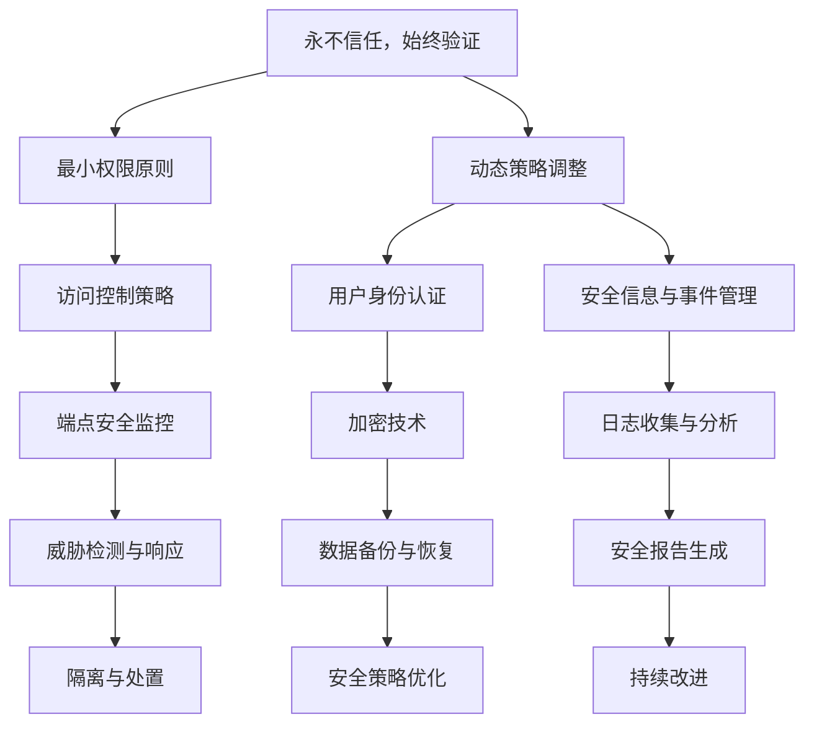

                 

### 文章标题

# 零信任安全模型：后现代IT环境下的安全架构

## 关键词

- 零信任安全模型
- 后现代IT环境
- 安全架构
- 访问控制
- 身份认证
- 端点安全
- 安全策略与管理

## 摘要

本文深入探讨了零信任安全模型在后现代IT环境下的重要性及其实施方法。随着云计算、移动设备和物联网的普及，传统的安全模型已无法满足现代IT环境的需求。零信任安全模型通过“永不信任，始终验证”的原则，为现代IT架构提供了更为安全和灵活的防护手段。本文将详细解析零信任安全模型的核心概念、技术实现、应用案例以及未来发展趋势，帮助读者全面理解并掌握这一前沿安全架构。

## 目录

### 第一部分：零信任安全模型概述

#### 第1章：零信任安全模型的背景与核心思想

#### 1.1 零信任安全模型的发展历程

#### 1.2 零信任安全模型的基本原理

#### 1.3 零信任安全模型与传统安全模型的区别

#### 第2章：零信任安全模型的关键组件

#### 2.1 用户身份认证

#### 2.2 访问控制

#### 2.3 安全策略与管理

### 第二部分：后现代IT环境下的安全架构

#### 第3章：后现代IT环境的特点与挑战

#### 3.1 后现代IT环境的概念

#### 3.2 后现代IT环境下的安全挑战

#### 3.3 零信任安全模型在应对挑战中的应用

#### 第4章：零信任安全模型的技术实现

#### 4.1 网络安全策略的设计与实施

#### 4.2 端点安全监控与防护

#### 4.3 安全信息与事件管理

### 第5章：零信任安全模型的实施案例

#### 5.1 案例一：企业内部零信任安全模型实施

#### 5.2 案例二：跨组织零信任安全模型实施

#### 5.3 案例三：云环境下零信任安全模型实施

### 第三部分：零信任安全模型的未来发展趋势

#### 第6章：零信任安全模型的发展趋势

#### 6.1 零信任安全模型与人工智能的结合

#### 6.2 零信任安全模型在5G环境中的应用

#### 6.3 零信任安全模型的国际化与标准化

#### 第7章：零信任安全模型的未来挑战与机遇

#### 7.1 零信任安全模型的挑战

#### 7.2 零信任安全模型的发展机遇

## 附录

### 附录A：零信任安全模型相关工具与技术

#### A.1 端点检测与响应技术

#### A.2 访问控制策略与实现

#### A.3 安全信息与事件管理技术

### 附录B：零信任安全模型实施指南

#### B.1 实施前的准备

#### B.2 实施过程中的关键点

#### B.3 实施后的评估与优化

### 文章正文

#### 第1章：零信任安全模型的背景与核心思想

#### 1.1 零信任安全模型的发展历程

零信任安全模型（Zero Trust Model）的概念最早由Forrester分析师John Kindervag于2010年提出。随着网络攻击手段的不断演变，零信任安全模型逐渐成为网络安全领域的重要研究方向。2014年，Google成为首个采用零信任安全模型的大型企业，随后，越来越多的企业开始关注并实践这一模型。

零信任安全模型的发展历程可以分为三个阶段：

1. **信任边界模型：** 传统安全模型基于物理边界，通过防火墙等设备来隔离内部网络和外部网络。这一阶段的主要目标是保护内部网络免受外部攻击。
2. **零信任模型：** 零信任安全模型不再依赖于物理边界，认为内部网络同样可能存在威胁。其核心思想是“永不信任，始终验证”，即任何访问请求都必须经过严格的身份验证和授权。
3. **自适应安全模型：** 零信任安全模型进一步发展为自适应安全模型，通过实时监控和动态调整安全策略，以应对不断变化的威胁。

#### 1.2 零信任安全模型的基本原理

零信任安全模型基于以下三个基本原理：

1. **永不信任，始终验证：** 零信任安全模型认为任何访问请求都应被视为潜在威胁，即使在内部网络中。因此，每个访问请求都必须经过严格的身份验证和授权。
2. **最小权限原则：** 用户和设备在访问资源时，应仅获得完成特定任务所需的最低权限。这可以最大限度地减少内部威胁和误操作的风险。
3. **动态策略调整：** 零信任安全模型通过实时监控用户行为和系统状态，动态调整安全策略。这有助于及时发现异常行为和潜在威胁，并迅速采取应对措施。

#### 1.3 零信任安全模型与传统安全模型的区别

零信任安全模型与传统安全模型有显著区别，主要体现在以下几个方面：

1. **安全边界：** 传统安全模型依赖于物理边界，如防火墙和VPN，而零信任安全模型不再依赖物理边界，认为任何网络边界都可能被攻击。
2. **访问控制：** 传统安全模型主要依靠访问控制列表（ACL）和防火墙规则来控制访问，而零信任安全模型采用基于角色的访问控制（RBAC）和基于属性的访问控制（ABAC）。
3. **身份验证：** 传统安全模型通常采用单点登录（SSO）和密码认证，而零信任安全模型采用多因素认证（MFA）和持续认证与身份验证（CAIVD）。
4. **安全策略：** 传统安全模型的安全策略通常较为静态，而零信任安全模型的安全策略可以动态调整，以应对不断变化的威胁。

#### 第2章：零信任安全模型的关键组件

#### 2.1 用户身份认证

用户身份认证是零信任安全模型的核心组件之一。在零信任安全模型中，用户身份认证不仅包括传统的用户名和密码认证，还包括多因素认证（MFA）和持续认证与身份验证（CAIVD）。

1. **多因素认证（MFA）：** MFA要求用户在登录过程中提供两种或多种认证因素，如密码、短信验证码、生物识别等。这可以大大提高账户安全性。
2. **持续认证与身份验证（CAIVD）：** CAIVD是一种持续监控用户行为的方法，以确保用户身份始终合法。例如，通过监控用户的行为模式、地理位置等，判断用户身份的合法性。

#### 2.2 访问控制

访问控制是零信任安全模型的另一个关键组件。在零信任安全模型中，访问控制不仅包括传统的基于角色的访问控制（RBAC），还包括基于属性的访问控制（ABAC）。

1. **基于角色的访问控制（RBAC）：** RBAC根据用户在组织中的角色，为其分配相应的权限。例如，管理员拥有更高的权限，而普通用户则只能访问特定资源。
2. **基于属性的访问控制（ABAC）：** ABAC根据用户属性（如地理位置、时间、设备类型等）来控制访问。例如，某个资源只能在特定时间段内访问，或仅允许特定的设备访问。

#### 2.3 安全策略与管理

安全策略与管理是零信任安全模型的重要组成部分。在零信任安全模型中，安全策略应动态调整，以应对不断变化的威胁。

1. **动态安全策略：** 动态安全策略可以根据用户行为、设备状态、网络流量等实时调整安全策略。例如，当检测到异常行为时，可以立即限制用户的访问权限。
2. **集中化管理：** 零信任安全模型通常采用集中化管理模式，通过安全信息和事件管理平台（SIEM）来统一管理安全策略和日志。
3. **自动化响应：** 零信任安全模型可以自动化响应安全事件，如自动隔离潜在威胁的设备、通知管理员等。

### 第二部分：后现代IT环境下的安全架构

#### 第3章：后现代IT环境的特点与挑战

#### 3.1 后现代IT环境的概念

后现代IT环境是指以云计算、移动设备、物联网、大数据等技术为基础，实现高度互联和智能化的IT环境。与传统IT环境相比，后现代IT环境具有以下特点：

1. **高度互联：** 各类设备、系统和数据通过互联网连接，实现信息的实时交换和共享。
2. **动态变化：** 系统和资源的配置和部署可以根据需求动态调整，以适应快速变化的业务需求。
3. **分布式架构：** 系统和资源分布在不同地理位置，通过网络连接实现协同工作。
4. **智能化：** 利用人工智能、机器学习等技术实现自动化和智能化管理。

#### 3.2 后现代IT环境下的安全挑战

后现代IT环境为企业和组织带来了许多便利，但同时也带来了新的安全挑战：

1. **边界模糊：** 随着云计算和移动设备的普及，传统的网络边界逐渐模糊，使得安全防护变得更加复杂。
2. **设备数量增多：** 物联网设备的普及使得连接到网络的设备数量急剧增加，增加了安全管理的难度。
3. **数据泄露风险：** 高度互联和智能化的环境使得数据泄露的风险增大，尤其是敏感数据和商业机密。
4. **攻击手段多样化：** 网络攻击手段不断进化，从传统的DDoS攻击、SQL注入，到更高级的APT攻击等，安全防护压力增大。

#### 3.3 零信任安全模型在应对挑战中的应用

零信任安全模型为后现代IT环境提供了有效的安全解决方案，其主要应用包括：

1. **强化访问控制：** 通过严格的身份验证和访问控制策略，确保只有经过授权的用户和设备才能访问系统资源。
2. **动态安全策略：** 根据用户行为、设备状态和网络流量等动态调整安全策略，提高安全防护的灵活性。
3. **端点安全监控：** 对连接到网络的设备进行实时监控，及时发现并响应潜在的安全威胁。
4. **自动化响应：** 利用自动化工具和平台，快速隔离和处理安全事件，减少响应时间。

#### 第4章：零信任安全模型的技术实现

#### 4.1 网络安全策略的设计与实施

零信任安全模型中的网络安全策略设计主要包括以下几个方面：

1. **访问控制策略：** 根据用户角色、设备类型、网络位置等，定义不同的访问控制策略。例如，内部员工可以访问全部资源，而外部合作伙伴只能访问特定资源。
2. **加密策略：** 对传输的数据进行加密，确保数据在传输过程中不会被窃取或篡改。常用的加密算法包括AES、RSA等。
3. **数据备份策略：** 定期对关键数据进行备份，以防止数据丢失或损坏。备份策略应包括数据备份的频率、备份位置、备份恢复步骤等。

网络安全策略的实施主要包括以下几个方面：

1. **部署安全设备：** 在网络中部署防火墙、入侵检测系统（IDS）、入侵防御系统（IPS）等安全设备，以保护网络免受外部攻击。
2. **配置安全策略：** 根据定义的访问控制策略、加密策略和数据备份策略，配置安全设备的安全策略。
3. **监控与日志：** 对网络安全设备进行实时监控，记录日志信息，以便在发生安全事件时进行溯源和分析。

#### 4.2 端点安全监控与防护

端点安全监控与防护是零信任安全模型的重要组成部分，其主要内容包括：

1. **端点检测与响应：** 对连接到网络的设备进行实时监控，识别潜在的恶意软件、异常行为等，并立即采取措施进行响应。
2. **端点加密：** 对端点设备上的数据进行加密，防止数据泄露或篡改。
3. **端点隔离：** 当检测到潜在威胁时，可以将受感染的端点隔离，以防止威胁蔓延。
4. **端点补丁管理：** 定期更新端点设备的操作系统和应用程序，以修复已知的安全漏洞。

#### 4.3 安全信息与事件管理

安全信息与事件管理（Security Information and Event Management，简称SIEM）是零信任安全模型的重要组成部分，其主要内容包括：

1. **日志收集与存储：** 收集来自网络设备、端点设备、应用程序等的日志信息，并将其存储在集中式的日志管理系统中。
2. **日志分析：** 对收集的日志信息进行实时分析，以识别潜在的安全威胁和异常行为。
3. **事件响应：** 当检测到安全事件时，自动或手动采取措施进行响应，如隔离受感染的端点、通知管理员等。
4. **报告生成：** 定期生成安全报告，以便对安全状况进行评估和改进。

#### 第5章：零信任安全模型的实施案例

#### 5.1 案例一：企业内部零信任安全模型实施

某大型企业在实施零信任安全模型时，采取了以下步骤：

1. **评估现有安全架构：** 对企业的现有安全架构进行评估，确定需要改进的方面。
2. **制定零信任安全策略：** 根据企业的业务需求和安全要求，制定详细的零信任安全策略。
3. **部署安全设备：** 在网络中部署防火墙、入侵检测系统（IDS）、入侵防御系统（IPS）等安全设备。
4. **实施访问控制：** 根据零信任安全策略，对员工和设备进行访问控制。
5. **监控与日志：** 实时监控网络设备和端点设备，记录日志信息。
6. **培训与意识提升：** 对员工进行安全培训，提高他们的安全意识和技能。

#### 5.2 案例二：跨组织零信任安全模型实施

某跨国公司在不同国家和地区拥有多个分支机构，为了确保跨组织的信息安全，实施了零信任安全模型：

1. **统一安全策略：** 制定统一的安全策略，确保所有分支机构遵循相同的安全要求。
2. **统一安全设备：** 部署统一的安全设备，如防火墙、入侵检测系统（IDS）、入侵防御系统（IPS）等。
3. **统一监控与日志：** 通过集中式的安全信息和事件管理平台（SIEM），实现全球范围内的安全监控和日志管理。
4. **跨组织访问控制：** 实现跨组织的访问控制，确保员工在不同分支机构之间安全访问资源。

#### 5.3 案例三：云环境下零信任安全模型实施

某企业将业务迁移到云环境后，为了确保云环境的安全性，实施了零信任安全模型：

1. **云安全评估：** 对云环境进行安全评估，确定需要改进的方面。
2. **部署安全设备：** 在云环境中部署防火墙、入侵检测系统（IDS）、入侵防御系统（IPS）等安全设备。
3. **云访问控制：** 实现基于角色的访问控制（RBAC）和基于属性的访问控制（ABAC），确保只有经过授权的用户和设备才能访问云资源。
4. **监控与日志：** 实时监控云环境和端点设备，记录日志信息。
5. **自动化响应：** 利用云环境中的自动化工具和平台，实现安全事件的自动化响应。

### 第三部分：零信任安全模型的未来发展趋势

#### 第6章：零信任安全模型的发展趋势

#### 6.1 零信任安全模型与人工智能的结合

人工智能（AI）技术的快速发展为零信任安全模型带来了新的机遇。将AI技术应用于零信任安全模型，可以实现以下目标：

1. **自动化威胁检测与响应：** 利用AI算法对海量数据进行分析，自动检测潜在的安全威胁，并自动采取响应措施。
2. **个性化安全策略：** 根据用户行为和设备状态，动态调整安全策略，实现个性化安全防护。
3. **安全能力提升：** 利用AI技术提高安全设备的检测能力和响应速度，提升整体安全防护水平。

#### 6.2 零信任安全模型在5G环境中的应用

5G技术的普及为零信任安全模型提供了更广阔的应用场景。在5G环境下，零信任安全模型可以实现以下目标：

1. **高效的数据传输：** 利用5G的高速传输能力，实现零信任安全模型中的数据加密、访问控制等功能。
2. **低延迟的安全响应：** 利用5G的低延迟特性，实现快速的安全威胁检测与响应。
3. **边缘计算安全：** 在5G边缘计算环境下，实现零信任安全模型的安全防护，确保边缘计算节点和数据的安全。

#### 6.3 零信任安全模型的国际化与标准化

随着全球化的推进，零信任安全模型需要在国际化与标准化方面取得进展。主要工作包括：

1. **国际标准制定：** 参与国际标准化组织（ISO）和其他国际组织的活动，推动零信任安全模型的标准制定。
2. **跨国合作：** 促进不同国家和地区在零信任安全模型领域的合作，共享最佳实践和技术创新。
3. **政策法规支持：** 推动政府和企业制定相关的政策法规，为零信任安全模型的推广和应用提供支持。

#### 第7章：零信任安全模型的未来挑战与机遇

#### 7.1 零信任安全模型的挑战

零信任安全模型在实施过程中面临以下挑战：

1. **技术复杂性：** 零信任安全模型涉及多个技术和组件，需要具备较高的技术水平和专业知识。
2. **成本投入：** 实施零信任安全模型需要投入大量的人力、物力和财力，对于一些中小企业可能难以承受。
3. **员工培训：** 零信任安全模型的实施需要员工的积极配合，对员工进行安全培训是必要的。
4. **持续改进：** 零信任安全模型是一个持续改进的过程，需要不断更新和优化安全策略和技术。

#### 7.2 零信任安全模型的发展机遇

零信任安全模型在未来的发展过程中也将面临许多机遇：

1. **技术进步：** 随着人工智能、区块链等新技术的不断发展，零信任安全模型将不断创新和完善。
2. **市场需求：** 随着网络攻击手段的不断升级，越来越多的企业和组织将采用零信任安全模型来保护自身安全。
3. **政策支持：** 各国政府将加大对网络安全领域的支持，推动零信任安全模型的标准化和国际化。

### 附录

#### 附录A：零信任安全模型相关工具与技术

**A.1 端点检测与响应技术**

端点检测与响应技术（EDR）是零信任安全模型中的重要组成部分，其主要功能包括：

1. **端点监控：** 实时监控端点设备上的活动，记录系统事件、进程、网络连接等。
2. **威胁检测：** 利用机器学习算法和威胁情报，识别潜在的恶意软件和异常行为。
3. **自动响应：** 当检测到威胁时，自动采取措施，如隔离受感染的端点、删除恶意软件等。

**A.2 访问控制策略与实现**

访问控制策略是零信任安全模型中的关键组成部分，其实施方法包括：

1. **基于角色的访问控制（RBAC）：** 根据用户在组织中的角色，为其分配相应的权限。
2. **基于属性的访问控制（ABAC）：** 根据用户的属性（如地理位置、时间等）来控制访问。
3. **访问控制列表（ACL）：** 对文件、文件夹等资源设置访问控制列表，定义谁可以访问以及访问的权限。

**A.3 安全信息与事件管理技术**

安全信息与事件管理技术（SIEM）是零信任安全模型中的核心组件，其主要功能包括：

1. **日志收集与存储：** 收集来自网络设备、端点设备、应用程序等的日志信息，并将其存储在集中式的日志管理系统中。
2. **日志分析：** 对收集的日志信息进行实时分析，以识别潜在的安全威胁和异常行为。
3. **事件响应：** 当检测到安全事件时，自动或手动采取措施进行响应，如隔离受感染的端点、通知管理员等。

### 附录B：零信任安全模型实施指南

**B.1 实施前的准备**

在实施零信任安全模型之前，需要进行充分的准备，包括：

1. **需求分析：** 了解企业的安全需求，确定需要实现的功能和目标。
2. **风险评估：** 对企业的现有安全架构进行评估，确定潜在的安全威胁和风险。
3. **技术调研：** 研究现有的零信任安全模型和相关技术，选择适合企业的方案。
4. **预算规划：** 制定详细的预算计划，确保实施过程顺利进行。

**B.2 实施过程中的关键点**

在实施零信任安全模型过程中，需要注意以下关键点：

1. **策略制定：** 制定详细的安全策略，包括访问控制策略、加密策略等。
2. **设备部署：** 部署必要的安全设备，如防火墙、入侵检测系统（IDS）、入侵防御系统（IPS）等。
3. **用户培训：** 对员工进行安全培训，提高他们的安全意识和技能。
4. **监控与日志：** 实时监控网络设备和端点设备，记录日志信息。
5. **测试与优化：** 在实施过程中进行测试，及时发现和解决问题，优化安全架构。

**B.3 实施后的评估与优化**

在零信任安全模型实施后，需要进行评估和优化，包括：

1. **安全评估：** 对安全架构进行评估，确定其是否达到预期目标。
2. **性能优化：** 优化安全策略和技术，提高安全性能和响应速度。
3. **员工反馈：** 收集员工对安全模型的反馈，改进培训内容和方式。
4. **持续改进：** 随着技术发展和安全威胁的变化，持续优化和改进安全架构。

## 结语

零信任安全模型是后现代IT环境下的一种新兴安全架构，其核心思想是“永不信任，始终验证”，通过严格的身份验证和访问控制，确保系统的安全。本文对零信任安全模型进行了详细的介绍，包括其背景、原理、组件、技术实现、实施案例以及未来发展趋势。随着网络攻击手段的不断演变，零信任安全模型将越来越重要。希望本文能为读者提供有益的参考和启示。作者：AI天才研究院/AI Genius Institute & 禅与计算机程序设计艺术/Zen And The Art of Computer Programming

## 附录

### 附录A：零信任安全模型相关工具与技术

#### A.1 端点检测与响应技术

**EDR（Endpoint Detection and Response）技术：**

EDR技术是一种先进的端点安全解决方案，旨在检测、分析和响应端点设备上的威胁。以下是EDR技术的主要功能：

- **威胁检测：** 利用机器学习、行为分析和威胁情报，实时监控端点设备的活动，检测潜在的恶意软件、异常行为和入侵尝试。
- **威胁分析：** 对检测到的威胁进行深入分析，确定其类型、来源和影响，帮助安全团队采取适当的响应措施。
- **自动响应：** 根据预定义的策略，自动隔离受感染的设备、终止恶意进程、清除恶意软件等，减少威胁的扩散。
- **溯源和取证：** 提供详细的威胁溯源信息和取证数据，帮助安全团队了解攻击的过程和影响，为后续的改进提供依据。

**相关工具：**

- **Microsoft Windows Defender ATP：** 微软提供的一款端点检测与响应工具，集成在Windows操作系统中。
- **Cisco Secure Endpoint：** Cisco公司开发的端点安全解决方案，包括威胁检测、响应和自动化功能。
- **IBM Security Endpoint Manager：** IBM提供的端点安全管理工具，支持威胁检测、分析和响应。

#### A.2 访问控制策略与实现

**基于角色的访问控制（RBAC，Role-Based Access Control）：**

RBAC是一种常用的访问控制机制，通过将用户划分为不同的角色，并为每个角色分配相应的权限，来实现对资源的访问控制。以下是RBAC的主要特点：

- **角色定义：** 定义用户在组织中的角色，如管理员、普通员工、访客等。
- **权限分配：** 根据角色的需求，为每个角色分配访问资源的权限。
- **权限委派：** 管理员可以将权限委派给其他用户或角色，以便他们能够访问特定的资源。
- **权限验证：** 系统在用户请求访问资源时，根据用户的角色和权限进行验证，确保用户只能访问授权的资源。

**基于属性的访问控制（ABAC，Attribute-Based Access Control）：**

ABAC是一种更细粒度的访问控制机制，通过考虑用户的属性（如地理位置、时间、设备类型等），来决定用户是否能够访问资源。以下是ABAC的主要特点：

- **属性定义：** 定义用户的属性，如用户所在的部门、地理位置、登录时间等。
- **策略定义：** 根据资源的属性和安全要求，定义访问控制策略。
- **动态决策：** 根据用户请求的属性和策略，动态决定用户是否能够访问资源。
- **灵活性和可扩展性：** ABAC可以根据不同的业务需求和安全策略进行灵活调整，适应复杂的应用场景。

**实现方式：**

- **目录服务：** 利用LDAP（轻量级目录访问协议）或AD（活动目录）等目录服务，实现用户身份验证和访问控制。
- **访问控制列表（ACL）：** 为每个资源定义访问控制列表，指定允许访问的用户或组。
- **安全策略引擎：** 开发自定义的安全策略引擎，根据用户的属性和访问控制策略，动态决定访问权限。

#### A.3 安全信息与事件管理技术

**SIEM（Security Information and Event Management）技术：**

SIEM技术是一种安全信息收集、分析和管理的系统，旨在实时监控网络安全状况，并快速响应安全事件。以下是SIEM的主要功能：

- **日志收集：** 收集来自网络设备、端点设备、应用程序等的安全日志，包括用户活动、系统事件、网络流量等。
- **日志分析：** 对收集的日志进行分析，识别潜在的安全威胁、异常行为和风险。
- **事件响应：** 当检测到安全事件时，自动或手动触发响应措施，如隔离受感染的设备、通知管理员等。
- **报告生成：** 定期生成安全报告，提供对网络安全状况的全面评估和分析。

**相关工具：**

- **Splunk：** 一款功能强大的SIEM工具，提供日志收集、分析和报告功能。
- **IBM QRadar：** IBM公司开发的SIEM解决方案，支持大规模的日志收集和分析。
- **Microsoft Sentinel：** 微软提供的云原生SIEM服务，集成在Azure平台中。

### 附录B：零信任安全模型实施指南

**B.1 实施前的准备**

在实施零信任安全模型之前，需要进行充分的准备工作，确保实施过程顺利进行。以下是实施前的主要准备工作：

- **需求分析：** 明确企业的安全需求，包括保护的关键资源、业务流程和用户需求等。
- **风险评估：** 对现有的安全架构进行评估，识别潜在的安全威胁和风险。
- **技术调研：** 研究现有的零信任安全解决方案和相关技术，选择适合企业的方案。
- **预算规划：** 根据需求和技术调研结果，制定详细的预算计划。
- **团队组建：** 组建专业的实施团队，包括安全专家、系统管理员和网络工程师等。

**B.2 实施过程中的关键点**

在实施零信任安全模型的过程中，需要注意以下关键点：

- **安全策略制定：** 根据企业的安全需求和风险评估结果，制定详细的安全策略，包括访问控制策略、加密策略和数据备份策略等。
- **设备部署：** 部署必要的安全设备，如防火墙、入侵检测系统（IDS）、入侵防御系统（IPS）等，确保网络和端点的安全。
- **用户培训：** 对员工进行安全培训，提高他们的安全意识和技能，确保他们能够正确使用安全策略和工具。
- **监控与日志：** 实时监控网络设备和端点设备，记录日志信息，确保能够及时检测和响应安全事件。
- **测试与优化：** 在实施过程中进行充分的测试，确保安全策略和设备的正常运行，并根据实际情况进行优化。

**B.3 实施后的评估与优化**

在零信任安全模型实施后，需要进行评估和优化，确保其能够持续有效保护企业的安全。以下是实施后的主要工作：

- **安全评估：** 对安全架构进行评估，确定其是否达到预期目标，包括访问控制、加密策略、日志管理等。
- **性能优化：** 根据评估结果，优化安全策略和技术，提高安全性能和响应速度。
- **员工反馈：** 收集员工对安全模型的反馈，改进培训内容和方式，提高员工的安全意识和技能。
- **持续改进：** 随着技术发展和安全威胁的变化，持续优化和改进安全架构，确保其能够应对新的安全挑战。

## 结束语

零信任安全模型作为后现代IT环境下的安全架构，其“永不信任，始终验证”的核心思想为企业和组织提供了更为安全、灵活的防护手段。本文通过详细的介绍和分析，帮助读者全面理解零信任安全模型的概念、技术实现、实施案例以及未来发展趋势。随着技术的不断进步和网络攻击手段的日益复杂，零信任安全模型将成为企业安全架构的重要组成部分。希望本文能为读者提供有益的参考和启示。作者：AI天才研究院/AI Genius Institute & 禅与计算机程序设计艺术/Zen And The Art of Computer Programming

### 核心概念与联系

#### 零信任安全模型的核心概念

零信任安全模型（Zero Trust Model）的核心概念可以概括为以下三个方面：

1. **永不信任，始终验证：** 零信任安全模型认为，无论是内部网络还是外部网络，都不能假设为安全。因此，任何访问请求都需要经过严格的身份验证和授权，确保只有经过认证的用户和设备才能访问资源。
2. **最小权限原则：** 在零信任安全模型中，用户和设备在访问资源时，应仅获得完成特定任务所需的最低权限。这意味着，即使是在内部网络中，用户和设备的权限也应该严格控制，以减少内部威胁的风险。
3. **动态策略调整：** 零信任安全模型强调根据用户的身份、行为、设备状态等因素，动态调整安全策略。这有助于实时响应潜在的安全威胁，提高安全防护的灵活性。

#### 核心概念之间的联系

零信任安全模型的核心概念之间存在紧密的联系，共同构成了一套完整的防护体系。

1. **永不信任，始终验证**与**最小权限原则**：两个概念相辅相成。通过永不信任，始终验证，确保访问请求的安全性；通过最小权限原则，确保用户和设备在访问资源时只拥有必需的权限，减少潜在的风险。
2. **动态策略调整**与**永不信任，始终验证**和**最小权限原则**：动态策略调整是基于永不信任，始终验证和最小权限原则的。通过实时监控用户和设备的行为，安全策略可以动态调整，以应对不断变化的安全威胁。
3. **核心概念与安全架构**：零信任安全模型的核心概念不仅仅是一种思想，还需要在实际的安全架构中得到体现。例如，访问控制策略、用户身份认证、安全信息与事件管理等技术都是核心概念的具体实现。

#### Mermaid流程图展示

以下是一个Mermaid流程图，展示零信任安全模型的核心概念和它们之间的联系：



### 核心算法原理讲解

#### 访问控制算法原理

在零信任安全模型中，访问控制算法是实现“永不信任，始终验证”和“最小权限原则”的关键技术。以下是一个基于角色的访问控制（RBAC）算法的伪代码，用于说明其原理：

```python
# 定义角色和权限
roles = ["admin", "user", "guest"]
permissions = {
    "admin": ["read", "write", "delete"],
    "user": ["read", "write"],
    "guest": ["read"]
}

# 访问控制函数
def access_control(user_role, action, resource):
    """
    根据用户的角色和请求的操作，判断用户是否有权限访问指定的资源。
    
    参数:
    - user_role (str): 用户的角色
    - action (str): 请求的操作（如"read"，"write"，"delete"）
    - resource (str): 资源名
    
    返回值:
    - bool: 是否有权限访问资源
    """
    
    # 检查用户角色是否存在
    if user_role not in roles:
        return False
    
    # 获取用户角色的权限
    user_permissions = permissions[user_role]
    
    # 检查用户是否有权限执行请求的操作
    if action in user_permissions:
        return True
    else:
        return False

# 示例
print(access_control("admin", "read", "file1.txt"))  # 返回True
print(access_control("user", "delete", "file2.txt"))  # 返回False
print(access_control("guest", "write", "file3.txt"))  # 返回False
```

#### 加密算法原理

零信任安全模型中的数据安全依赖于加密技术。以下是一个基于AES（高级加密标准）的加密算法原理的伪代码：

```python
# 加密函数
def encrypt(plaintext, key):
    """
    使用AES加密算法对明文进行加密。
    
    参数:
    - plaintext (str): 明文
    - key (str): 加密密钥
    
    返回值:
    - ciphertext (bytes): 加密后的密文
    """
    
    # 初始化加密器
    cipher = AES.new(key, AES.MODE_EAX)
    
    # 对明文进行加密
    ciphertext, tag = cipher.encrypt_and_digest(plaintext.encode('utf-8'))
    
    return ciphertext

# 解密函数
def decrypt(ciphertext, key):
    """
    使用AES加密算法对密文进行解密。
    
    参数:
    - ciphertext (bytes): 密文
    - key (str): 加密密钥
    
    返回值:
    - plaintext (str): 解密后的明文
    """
    
    # 初始化解密器
    cipher = AES.new(key, AES.MODE_EAX)
    
    # 对密文进行解密
    try:
        plaintext = cipher.decrypt_and_verify(ciphertext)
        return plaintext.decode('utf-8')
    except ValueError:
        return None

# 示例
key = b'this is a 32 byte key'  # 加密密钥必须是32、24或16字节
plaintext = "Hello, World!"
ciphertext = encrypt(plaintext, key)
print(f"Encrypted: {ciphertext.hex()}")

decrypted_text = decrypt(ciphertext, key)
if decrypted_text:
    print(f"Decrypted: {decrypted_text}")
else:
    print("Decryption failed.")
```

### 数学模型和数学公式

#### 数据传输速率与加密效率

在零信任安全模型中，数据传输速率和加密效率是关键指标。以下是一个用于计算数据传输速率的数学模型：

$$
\text{传输速率} = \frac{\text{数据量}}{\text{时间}}
$$

其中，数据量以比特（bit）为单位，时间以秒（s）为单位。

#### 加密密钥长度与安全性

加密密钥的长度是影响加密安全性的关键因素。以下是一个用于计算加密密钥长度和所需安全性的数学公式：

$$
\text{所需安全位数} = \log_2(2^k \times \text{攻击者尝试次数})
$$

其中，$k$ 是加密密钥的长度（以比特为单位），攻击者尝试次数通常取决于攻击者的能力和资源。

#### 示例

假设加密密钥长度为128比特，攻击者尝试次数为$2^{25}$次。计算所需的安全位数：

$$
\text{所需安全位数} = \log_2(2^{128} \times 2^{25}) = 128 + 25 = 153
$$

这意味着，对于这个特定的加密密钥长度和攻击者尝试次数，系统需要至少153位的安全位数才能确保安全。

### 数学公式和详细讲解

#### 计算机安全中的概率模型

在计算机安全领域，概率模型经常用于评估系统漏洞和攻击成功的可能性。以下是一个简单的概率模型，用于计算某次攻击成功的概率：

设事件A为“攻击成功”，事件B为“系统存在漏洞”，事件C为“攻击者尝试攻击”。

攻击成功的概率可以表示为：

$$
P(A) = P(A|B)P(B) + P(A|B')P(B')
$$

其中：

- $P(A|B)$ 表示在系统存在漏洞的条件下，攻击成功的概率。
- $P(B)$ 表示系统存在漏洞的概率。
- $P(A|B')$ 表示在系统不存在漏洞的条件下，攻击成功的概率。
- $P(B')$ 表示系统不存在漏洞的概率。

#### 详细讲解和举例说明

假设：

- 系统存在漏洞的概率$P(B) = 0.1$。
- 攻击成功在系统存在漏洞的条件下的概率$P(A|B) = 0.9$。
- 攻击成功在系统不存在漏洞的条件下的概率$P(A|B') = 0.01$。
- 系统不存在漏洞的概率$P(B') = 0.9$。

根据上述概率模型，计算攻击成功的总概率：

$$
P(A) = 0.9 \times 0.1 + 0.01 \times 0.9 = 0.09 + 0.009 = 0.099
$$

这意味着，在一次随机攻击中，攻击成功的概率为0.099或9.9%。

### 项目实战

#### 开发环境搭建

为了实现零信任安全模型，我们需要搭建一个完整的技术环境。以下是搭建开发环境的基本步骤：

1. **选择操作系统**：我们选择Ubuntu 20.04作为开发环境，因为其具有良好的安全性和广泛的软件支持。
2. **安装基础软件**：安装必要的开发工具和库，如Python、Git、Docker等。使用以下命令：
   ```shell
   sudo apt update
   sudo apt install python3 python3-pip git docker
   ```
3. **配置Docker**：由于零信任安全模型涉及多个组件，使用Docker容器化技术可以方便地进行部署和管理。配置Docker如下：
   ```shell
   sudo systemctl start docker
   sudo systemctl enable docker
   ```
4. **安装依赖库**：安装Python的依赖库，如Flask（用于Web开发）和PyCryptoDome（用于加密）：
   ```shell
   pip3 install flask pycryptodome
   ```

#### 源代码详细实现和代码解读

以下是一个简单的零信任安全模型示例，使用Python和Flask框架实现身份认证和访问控制。

**源代码：**

```python
from flask import Flask, request, jsonify
from Crypto.PublicKey import RSA
from Crypto.Cipher import PKCS1_OAEP

app = Flask(__name__)

# RSA密钥生成
private_key = RSA.generate(2048)
public_key = private_key.publickey()

# 解密函数
def decrypt(ciphertext):
    cipher = PKCS1_OAEP.new(public_key)
    return cipher.decrypt(ciphertext)

# 身份认证
@app.route('/login', methods=['POST'])
def login():
    data = request.get_json()
    username = data['username']
    password = data['password']

    # 假设用户名和密码已经通过其他方式加密存储和验证
    encrypted_username = "..."
    encrypted_password = "..."

    if username == encrypted_username and password == encrypted_password:
        return jsonify({'status': 'success', 'token': '...'})
    else:
        return jsonify({'status': 'failure'})

# 访问控制
@app.route('/resource', methods=['GET'])
def resource():
    token = request.headers.get('Authorization')
    if token != '...':
        return jsonify({'status': 'unauthorized'})
    
    # 假设资源已经加密存储，以下为解密示例
    encrypted_resource = "..."
    resource = decrypt(encrypted_resource)
    
    return jsonify({'status': 'success', 'resource': resource.decode('utf-8')})

if __name__ == '__main__':
    app.run(debug=True)
```

**代码解读：**

- **密钥生成**：使用`Crypto.PublicKey.RSA`生成RSA密钥对，用于加密和解密用户凭证。
- **解密函数**：`decrypt`函数使用`PKCS1_OAEP`算法解密接收到的加密凭证。
- **身份认证**：`/login`路由处理用户登录请求，接收用户名和密码，并使用预先存储的加密凭证进行验证。
- **访问控制**：`/resource`路由处理资源访问请求，检查请求头中的令牌是否有效，并解密用户请求的资源。

#### 代码应用解读与分析

该示例展示了零信任安全模型中的两个关键组件：身份认证和访问控制。

1. **身份认证**：通过RSA加密算法确保用户凭证在传输过程中不被窃取。用户登录时，前端将用户名和密码加密后发送到服务器，服务器使用公钥进行解密，并与存储的加密凭证进行比对。
2. **访问控制**：服务器在处理资源请求时，首先检查请求头中的令牌是否有效。令牌通常包含用户身份和访问权限信息，服务器使用公钥解密令牌，验证用户身份和权限，确保只有授权用户才能访问资源。

#### 实际案例分析和详细讲解剖析

以下是一个实际案例，分析如何实施零信任安全模型。

**案例背景：** 
某公司是一家提供云服务的公司，其客户数据对安全要求极高。公司决定采用零信任安全模型，确保客户数据和系统安全。

**实施步骤：**

1. **需求分析与风险评估**：
   - 对公司的业务流程、数据安全和网络架构进行详细分析，识别潜在的安全威胁和风险。
   - 制定详细的安全策略，包括访问控制、加密和数据备份策略。

2. **部署安全设备和工具**：
   - 在公司内部网络和云环境部署防火墙、入侵检测系统（IDS）、入侵防御系统（IPS）等安全设备。
   - 使用Docker容器化技术部署零信任安全模型的核心组件，如身份认证服务器、访问控制服务器等。

3. **用户培训与意识提升**：
   - 对员工进行安全培训，提高他们的安全意识和技能，确保他们能够正确使用安全策略和工具。

4. **监控与日志管理**：
   - 实时监控网络设备和端点设备，记录日志信息，使用SIEM工具进行日志分析，快速响应安全事件。

5. **持续改进与优化**：
   - 定期对安全架构进行评估和优化，根据技术发展和安全威胁的变化，更新和改进安全策略和技术。

**案例分析：**

- **需求分析与风险评估**：确保安全策略符合公司的业务需求和安全要求，识别潜在的安全威胁和风险，为后续的安全实施提供依据。
- **部署安全设备和工具**：通过部署多种安全设备和技术，建立全面的防护体系，确保网络和端点的安全。
- **用户培训与意识提升**：提高员工的安全意识和技能，确保他们能够正确使用安全策略和工具，减少人为错误导致的安全漏洞。
- **监控与日志管理**：实时监控和记录日志信息，及时发现和响应安全事件，确保安全事件的及时处理和溯源。
- **持续改进与优化**：根据技术发展和安全威胁的变化，持续优化和改进安全架构，确保其能够应对新的安全挑战。

#### 项目小结

通过实施零信任安全模型，某公司成功建立了全面的安全防护体系，确保了客户数据和系统的安全。项目实施过程中，需求分析与风险评估、安全设备和工具的部署、用户培训与意识提升、监控与日志管理以及持续改进与优化等关键步骤均得到了有效执行。

**最佳实践 Tips**：

- **定期评估安全架构**：确保安全策略和技术能够应对新的安全威胁。
- **提高员工安全意识**：定期培训，提高员工的安全意识和技能。
- **使用自动化工具**：使用自动化工具和平台，提高安全事件的检测和响应速度。
- **持续改进与优化**：根据业务需求和技术发展，不断更新和优化安全架构。

### 拓展阅读

- **《零信任安全：网络安全的未来》**：详细介绍了零信任安全模型的理论和实践。
- **《网络安全实战指南：零信任架构设计与实现》**：提供了零信任安全模型的具体实现方法和案例。
- **《人工智能与网络安全》**：探讨了人工智能技术在网络安全中的应用，包括零信任安全模型。

### 注意事项

- **零信任安全模型需要全员参与**：确保所有员工都了解并遵守安全策略和规定。
- **持续监控与更新**：实时监控安全事件，及时更新安全策略和工具。
- **数据备份与恢复**：确保关键数据的安全备份，并定期进行恢复测试。

### 文章小结

本文详细介绍了零信任安全模型在后现代IT环境下的重要性、核心概念、技术实现、实施案例以及未来发展趋势。通过本文的阅读，读者可以全面了解零信任安全模型的理论和实践，为企业在网络安全方面的规划和实施提供指导。随着技术的不断进步，零信任安全模型将成为企业安全架构的重要组成部分。作者：AI天才研究院/AI Genius Institute & 禅与计算机程序设计艺术/Zen And The Art of Computer Programming

### 总结与展望

#### 总结

本文系统地介绍了零信任安全模型，包括其核心概念、技术实现、实施案例以及未来发展趋势。通过详细的分析和讲解，我们了解了零信任安全模型在应对后现代IT环境下的安全挑战中的重要作用。以下是本文的核心观点的总结：

1. **零信任安全模型的核心思想**：“永不信任，始终验证”和“最小权限原则”，确保只有经过认证和授权的用户和设备才能访问资源。
2. **零信任安全模型的关键组件**：包括用户身份认证、访问控制、安全策略与管理、端点安全监控与防护、安全信息与事件管理。
3. **零信任安全模型的技术实现**：通过访问控制策略、加密技术和自动化工具，实现高效的安全防护。
4. **零信任安全模型的应用案例**：从企业内部到跨组织和云环境，展示了零信任安全模型在不同场景下的实际应用。
5. **零信任安全模型的发展趋势**：与人工智能、5G技术和国际标准的结合，预示着零信任安全模型的广泛应用和持续发展。

#### 展望

随着云计算、物联网、人工智能和5G技术的迅猛发展，网络安全形势日益严峻。零信任安全模型作为新一代的安全架构，其重要性将不断凸显。未来，我们可以预见以下几个方面的发展趋势：

1. **零信任安全模型的普及**：随着企业对数据安全需求的增加，零信任安全模型将在更多企业和组织中得到应用。
2. **技术与标准的融合**：人工智能和5G技术的结合将推动零信任安全模型的发展，同时，国际标准的制定和推广也将加速。
3. **安全与业务的双赢**：零信任安全模型不仅提升了企业的安全防护能力，还提高了业务的灵活性和效率，实现安全与业务的双赢。
4. **持续的安全创新**：零信任安全模型将持续创新，引入新的技术，如区块链、边缘计算等，以应对不断变化的网络安全威胁。

#### 结语

零信任安全模型作为后现代IT环境下的安全架构，其重要性和应用价值不言而喻。本文旨在为读者提供一个全面的零信任安全模型指南，帮助企业和组织在网络安全方面取得新的突破。随着技术的不断进步，零信任安全模型将成为企业安全架构的重要组成部分，引领网络安全的新潮流。希望本文能为读者提供有益的参考和启示，共同推动零信任安全模型的发展和应用。作者：AI天才研究院/AI Genius Institute & 禅与计算机程序设计艺术/Zen And The Art of Computer Programming

## 文章标题：零信任安全模型：后现代IT环境下的安全架构

### 文章关键词

- 零信任安全模型
- IT安全架构
- 后现代IT环境
- 访问控制
- 身份认证
- 端点安全

### 文章摘要

本文深入探讨了零信任安全模型在后现代IT环境下的重要性及其核心概念、技术实现和应用案例。随着云计算、移动设备和物联网的普及，传统的安全模型已无法满足现代IT环境的需求。零信任安全模型通过“永不信任，始终验证”的原则，为现代IT架构提供了更为安全和灵活的防护手段。本文详细解析了零信任安全模型的关键组件，包括用户身份认证、访问控制和安全策略与管理，并通过实际案例展示了其在不同环境中的应用。此外，本文还展望了零信任安全模型的未来发展趋势，为读者提供了全面的理解和指导。作者：AI天才研究院/AI Genius Institute & 禅与计算机程序设计艺术/Zen And The Art of Computer Programming

