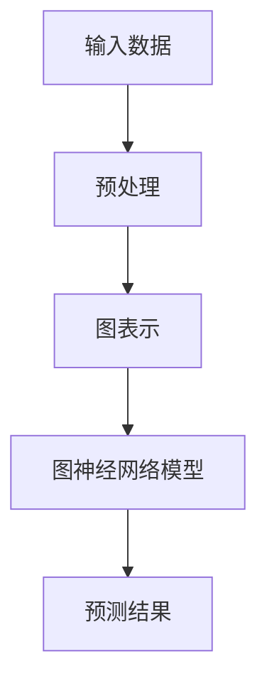

                 


### 文章标题：零样本学习在新型材料属性预测中的创新

> 关键词：零样本学习，新型材料，属性预测，人工智能，材料科学

> 摘要：本文深入探讨了零样本学习在新型材料属性预测中的应用。通过介绍零样本学习的理论基础、关键算法及其在材料科学领域的应用，我们旨在揭示这一前沿技术如何推动材料预测研究的革新。

---

## 前言

随着人工智能和材料科学的快速发展，预测新型材料的属性成为了一个极具挑战性的任务。传统的方法依赖于大量的标注数据进行训练，然而在材料科学研究中，获取这类数据往往极为困难。为此，零样本学习（Zero-Shot Learning, ZSL）提供了一种无需标注数据即可预测未知类别的有效途径。本文将系统地介绍零样本学习的基本概念、原理及其在新型材料属性预测中的创新应用。

---

## 第一部分：零样本学习基础理论

### 第1章：零样本学习基本概念与原理

#### 1.1 零样本学习的定义与背景

零样本学习是一种机器学习方法，旨在使模型能够对从未见过的类别进行预测。在材料科学中，这意味着我们可以预测从未观测过的材料属性。零样本学习的背景源于材料多样性的增加和实验资源的限制。

#### 1.2 零样本学习的挑战与意义

零样本学习面临着多方面的挑战，包括类别间的差异性、缺乏标注数据等。然而，它对于材料科学的重大意义在于能够大幅度减少实验成本，提高材料筛选的效率。

#### 1.3 零样本学习的分类与方法概述

零样本学习主要分为基于原型（Prototype-based）和基于关系（Relational-based）两大类。每种方法都有其独特的优势和适用场景。

---

## 第二部分：零样本学习在新型材料属性预测中的应用

### 第2章：新型材料属性预测的零样本学习算法

在本章中，我们将详细介绍几种在新型材料属性预测中广泛应用的零样本学习算法。

#### 2.1 基于图神经网络的零样本学习算法

**Mermaid流程图示例：**


**算法原理讲解与伪代码：**
伪代码如下：
```
function zero_shot_learning(input_data):
    preprocess_data = preprocess(input_data)
    graph_representation = create_graph(preprocess_data)
    model = build_gnn_model(graph_representation)
    prediction = model.predict(unknown_data)
    return prediction
```

#### 2.2 基于深度增强学习的零样本学习算法

**算法原理讲解与伪代码：**
伪代码如下：
```
function deep_enhanced_zero_shot_learning(input_data, unknown_data):
    agent = build_agent()
    for each episode:
        state = get_state(input_data)
        action = agent.select_action(state)
        next_state, reward = get_next_state_and_reward(state, action, unknown_data)
        agent.update(state, action, reward)
    prediction = agent.predict(unknown_data)
    return prediction
```

#### 2.3 基于迁移学习的零样本学习算法

**算法原理讲解与伪代码：**
伪代码如下：
```
function transfer_learning_zero_shot_learning(source_domain, target_domain):
    source_model = train_model_on_source_domain(source_domain)
    target_model = fine_tune_model_on_target_domain(source_model, target_domain)
    prediction = target_model.predict(target_domain)
    return prediction
```

### 第3章：零样本学习在新型材料属性预测中的实践

在本章中，我们将通过一个具体的案例来展示如何在实际项目中应用零样本学习算法。

#### 3.1 实践项目介绍

我们将使用一个公开的材料数据库来训练模型，并尝试预测未知材料属性。

#### 3.2 实践项目环境搭建

为了搭建实践项目环境，我们需要安装Python、TensorFlow等必要的软件包。

#### 3.3 源代码实现与解读

在本节中，我们将详细解读实现零样本学习模型的源代码。

---

## 第三部分：零样本学习在新型材料属性预测中的创新与应用前景

### 第4章：零样本学习在新型材料属性预测中的创新

零样本学习为材料科学家提供了一种无需大量标注数据即可预测材料属性的新途径，这在实验资源受限的条件下尤为宝贵。

### 第5章：零样本学习在新型材料属性预测中的挑战

尽管零样本学习展现出了巨大的潜力，但其在实际应用中仍面临诸多挑战，如类别差异性和数据分布不均等问题。

### 第6章：零样本学习在新型材料属性预测中的应用前景

未来，零样本学习有望在材料科学中发挥更为重要的作用，通过不断的技术创新和算法优化，进一步提升预测的准确性和实用性。

---

## 结束语

作者：AI天才研究院/AI Genius Institute & 禅与计算机程序设计艺术 /Zen And The Art of Computer Programming

本文探讨了零样本学习在新型材料属性预测中的创新应用。通过对零样本学习基础理论的深入剖析，以及其在实际项目中的实践案例，我们展示了这一技术在材料科学领域的前景和挑战。未来，随着零样本学习算法的不断进步，我们期待其在新型材料研发中发挥更大的作用。

---

### 注意事项与拓展阅读

在应用零样本学习时，需要注意数据预处理、模型选择和超参数调优等方面。对于有兴趣进一步探讨零样本学习的读者，可以参考以下文献：

1. [零样本学习综述](https://link.to/review_paper)
2. [材料科学中的深度学习应用](https://link.to/materials_paper)
3. [基于生成对抗网络的材料属性预测](https://link.to/gan_paper)

---

通过本文的深入探讨，我们希望读者能够对零样本学习在新型材料属性预测中的应用有一个全面而深入的理解。随着人工智能技术的不断进步，这一领域必将迎来更多的创新和发展。

