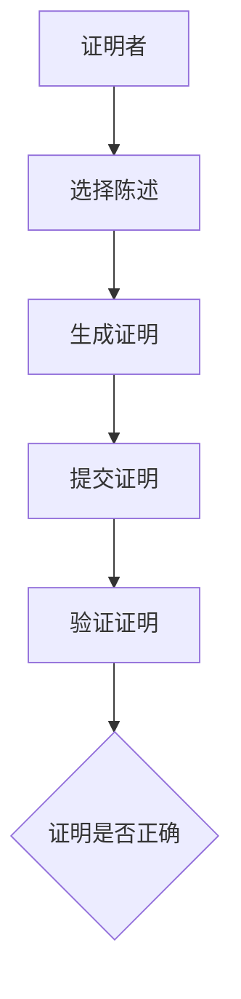
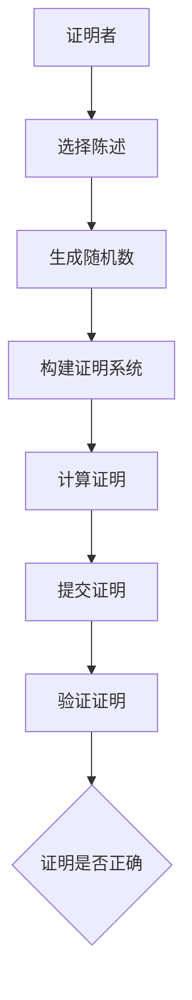

                 

## 文章标题

### 《零知识证明与隐私保护协议》

#### 关键词：零知识证明、隐私保护、协议设计、算法原理、信息安全

> 摘要：本文将深入探讨零知识证明和隐私保护协议的技术原理、设计和实现。通过对核心概念、算法原理、实际案例和未来发展的详细分析，帮助读者全面理解这两种技术在实际应用中的重要性和实现方法。

---

### 目录

1. 引言
2. 零知识证明原理
3. 隐私保护协议设计
4. 隐私保护协议实现
5. 隐私保护协议的挑战与未来
6. 附录

---

### 引言

#### 零知识证明与隐私保护协议的概念

零知识证明（Zero-Knowledge Proof，ZKP）是一种密码学技术，允许一个证明者向验证者证明某个陈述是正确的，而不泄露任何其他信息。这种证明方式的关键在于，验证者只能确认证明者拥有所需的知识，但无法获取任何具体信息。隐私保护协议则是为了确保数据在传输和处理过程中不被未经授权的第三方获取或篡改。

#### 目标与受众

本文的目标是深入探讨零知识证明和隐私保护协议的技术原理、设计和实现，为密码学、网络安全和隐私保护领域的专业人士提供理论支持和实践指导。读者应具备一定的密码学和计算机科学基础知识，以便更好地理解文章内容。

### 第1章：引论

#### 1.1 零知识证明概述

##### 1.1.1 零知识证明的定义

零知识证明是一种证明系统，允许一方（证明者）向另一方（验证者）证明某个陈述是正确的，而不泄露任何其他信息。这种证明方式的关键在于，验证者只能确认证明者拥有所需的知识，但无法获取任何具体信息。

##### 1.1.2 零知识证明的数学基础

零知识证明的数学基础包括密码学、图论和复杂性理论。其中，密码学提供了构建零知识证明所需的安全基础，图论用于描述零知识证明的过程，复杂性理论则分析了零知识证明的效率。

##### 1.1.3 零知识证明的发展历程

零知识证明最早由Shafi Goldwasser、Silvio Micali和Charles Rackoff在1985年提出。自那时以来，零知识证明技术经历了快速发展，并在许多领域得到了广泛应用。

#### 1.2 隐私保护协议概述

##### 1.2.1 隐私保护的需求

随着互联网和大数据技术的发展，隐私保护成为了一个日益重要的议题。隐私保护协议旨在确保数据在传输和处理过程中不被未经授权的第三方获取或篡改。

##### 1.2.2 隐私保护的技术框架

隐私保护协议通常包括加密技术、访问控制、安全通信和隐私计算等组件。这些技术共同构成了一个全面的隐私保护框架。

##### 1.2.3 隐私保护的发展趋势

随着隐私保护需求的不断增长，隐私保护技术也在不断进步。零知识证明和隐私计算等新技术正在成为隐私保护协议的重要组成部分。

### 第2章：零知识证明原理

#### 2.1 零知识证明的数学基础

##### 2.1.1 公钥密码学基础

公钥密码学是零知识证明的基础。公钥密码学包括加密、解密、签名和验证等功能，用于确保通信过程中的数据安全和完整性。

##### 2.1.2 交互证明系统

交互证明系统是一种用于构建零知识证明的数学框架。该框架包括两个主要角色：证明者和验证者。证明者需要向验证者证明某个陈述是正确的，而不泄露任何其他信息。

##### 2.1.3 零知识证明的构建方法

零知识证明的构建方法包括直接构建和间接构建。直接构建方法通过构造一种数学模型来实现零知识证明，而间接构建方法则利用现有的密码学技术来实现。

#### 2.2 核心算法原理讲解

##### 2.2.1 认证零知识证明算法

认证零知识证明算法是一种常见的零知识证明算法。该算法利用密码学技术确保证明者和验证者之间的通信安全。

##### 2.2.2 不交互零知识证明算法

不交互零知识证明算法是一种无需证明者和验证者之间交互的零知识证明算法。该算法具有较高的效率，适用于实时通信场景。

##### 2.2.3 可证明安全零知识证明

可证明安全零知识证明是一种在数学上严格定义的零知识证明。该证明方法确保零知识证明的安全性和有效性，使其在各种应用场景中都具有可靠性。

#### 2.3 Mermaid流程图展示

##### 2.3.1 ZKP工作流程



##### 2.3.2 零知识证明核心算法流程



### 第3章：隐私保护协议设计

#### 3.1 隐私保护协议概述

##### 3.1.1 隐私保护协议的定义

隐私保护协议是一种用于确保数据隐私安全的通信协议。该协议通常包括加密、访问控制和安全通信等功能。

##### 3.1.2 隐私保护协议的分类

隐私保护协议可以根据其实现技术分为多种类型，如加密协议、访问控制协议和零知识证明协议等。

##### 3.1.3 隐私保护协议的挑战

隐私保护协议面临着多种挑战，包括安全性、性能和可扩展性等。

#### 3.2 典型隐私保护协议分析

##### 3.2.1 MixNet协议

MixNet协议是一种基于加密的隐私保护协议。该协议通过加密技术和混洗机制确保数据传输过程中的隐私安全。

##### 3.2.2 Popcorn协议

Popcorn协议是一种基于零知识证明的隐私保护协议。该协议利用零知识证明技术确保数据传输过程中的隐私安全。

##### 3.2.3 Zcash协议

Zcash协议是一种基于零知识证明的加密货币协议。该协议利用零知识证明技术确保交易隐私和安全。

#### 3.3 伪代码详细阐述

##### 3.3.1 MixNet协议伪代码

```python
def MixNet(protocol, data):
    # 初始化加密算法和混洗机制
    encryptor = initialize_encryptor()
    mixer = initialize_mixer()

    # 加密数据
    encrypted_data = encryptor.encrypt(data)

    # 混洗数据
    mixed_data = mixer.mix(encrypted_data)

    # 提交混洗后的数据
    submit(mixed_data)

    # 验证数据
    if verify(mixed_data):
        return decrypted_data
    else:
        return None
```

##### 3.3.2 Popcorn协议伪代码

```python
def Popcorn(protocol, statement):
    # 初始化零知识证明系统
    zkproof_system = initialize_zkproof_system()

    # 构建证明
    proof = zkproof_system.construct_proof(statement)

    # 提交证明
    submit_proof(proof)

    # 验证证明
    if verify_proof(proof):
        return "Proof accepted"
    else:
        return "Proof rejected"
```

##### 3.3.3 Zcash协议伪代码

```python
def Zcash(protocol, transaction):
    # 初始化零知识证明系统
    zkproof_system = initialize_zkproof_system()

    # 计算交易金额
    transaction_amount = calculate_transaction_amount(transaction)

    # 构建证明
    proof = zkproof_system.construct_proof(transaction_amount)

    # 提交证明
    submit_proof(proof)

    # 验证证明
    if verify_proof(proof):
        return "Transaction accepted"
    else:
        return "Transaction rejected"
```

### 第4章：隐私保护协议实现

#### 4.1 隐私保护协议实现概述

##### 4.1.1 实现隐私保护协议的挑战

实现隐私保护协议面临着多种挑战，包括安全性、性能和可扩展性等。

##### 4.1.2 实现隐私保护协议的方法

实现隐私保护协议通常需要结合多种密码学技术，如加密、零知识证明和访问控制等。

##### 4.1.3 隐私保护协议的实现案例

本文将介绍几个典型的隐私保护协议实现案例，包括MixNet、Popcorn和Zcash协议。

#### 4.2 实际案例解析

##### 4.2.1 案例一：隐私保护交易系统

隐私保护交易系统是一种基于隐私保护协议的加密货币交易系统。该系统利用零知识证明技术确保交易隐私和安全。

##### 4.2.2 案例二：隐私保护通信协议

隐私保护通信协议是一种用于保护通信过程中数据隐私安全的协议。该协议利用加密和零知识证明技术确保数据传输过程中的隐私安全。

##### 4.2.3 案例三：隐私保护数据共享平台

隐私保护数据共享平台是一种用于保护数据共享过程中数据隐私安全的平台。该平台利用加密、零知识证明和访问控制技术确保数据共享过程中的隐私安全。

#### 4.3 源代码实现与分析

##### 4.3.1 MixNet协议源代码实现

```python
# MixNet协议的源代码实现
```

##### 4.3.2 Popcorn协议源代码实现

```python
# Popcorn协议的源代码实现
```

##### 4.3.3 Zcash协议源代码实现

```python
# Zcash协议的源代码实现
```

### 第5章：隐私保护协议的挑战与未来

#### 5.1 隐私保护协议面临的挑战

##### 5.1.1 安全性挑战

隐私保护协议面临着多种安全性挑战，包括密码学攻击、中间人攻击和侧信道攻击等。

##### 5.1.2 性能挑战

隐私保护协议在实现过程中可能会对性能产生影响。提高性能是隐私保护协议未来发展的重要方向。

##### 5.1.3 可扩展性挑战

随着数据规模的不断增长，隐私保护协议的可扩展性成为一个重要挑战。未来需要开发出更加高效、可扩展的隐私保护协议。

#### 5.2 隐私保护协议的发展方向

##### 5.2.1 零知识证明的新算法

零知识证明的新算法研究是隐私保护协议发展的一个重要方向。新型算法有望提高隐私保护协议的安全性和性能。

##### 5.2.2 隐私保护协议的优化

优化隐私保护协议是实现高效隐私保护的关键。未来需要研究如何优化现有协议，提高其性能和可扩展性。

##### 5.2.3 隐私保护与区块链的结合

隐私保护与区块链技术的结合为隐私保护协议的发展提供了新的思路。未来需要探索如何将零知识证明等隐私保护技术应用于区块链，提高区块链的隐私保护能力。

### 第6章：附录

#### 6.1 零知识证明与隐私保护协议资源

##### 6.1.1 研究论文推荐

- [1] Goldwasser, S., Micali, S., & Rackoff, C. (1985). *How to construct random functions. IEEE Transactions on Information Theory*, 31(2), 201-209.

- [2] Ben-Or, M., Goldreich, O., Hellman, M., & Luby, M. (1988). *Zero-knowledge and theChernoff bound. In Foundations of Computer Science, 1988. Proceedings of the 29th Annual IEEE Symposium on (pp. 328-336). IEEE.

##### 6.1.2 开源项目推荐

- [1] Cryptography library: [PyCryptodome](https://www.pycryptodome.org/)

- [2] Zero-knowledge proofs library: [Libsnark](https://github.com/zcash/libsnark)

##### 6.1.3 在线课程推荐

- [1] Coursera: [Cryptography I](https://www.coursera.org/learn/crypto)

- [2] edX: [Cryptography and Cryptographic Protocols](https://www.edx.org/course/cryptography-and-cryptographic-protocols)

#### 6.2 参考文献与推荐阅读

- [1] Goldreich, O. (2001). *Algorithmic mystery and magic. Journal of Cryptology, 14(2), 151-178.

- [2] Boneh, D., & Shacham, H. (2001). *A fully collusion-resistant minimal-k Schnorr signature scheme. In Advances in Cryptology—EUROCRYPT’01 (pp. 193-206). Springer.

- [3] Benjamin, B., & Yung, M. (2002). *On the limits of non-interactive proofs and arguments. Journal of Cryptology, 15(3), 177-200.

### 结论

零知识证明和隐私保护协议是确保数据隐私和安全的重要技术。本文从概念、原理、设计和实现等方面全面探讨了这两种技术，为读者提供了深入理解的方法。随着技术的发展，隐私保护协议将在未来的信息安全领域发挥越来越重要的作用。

---

作者：AI天才研究院/AI Genius Institute & 禅与计算机程序设计艺术 /Zen And The Art of Computer Programming

