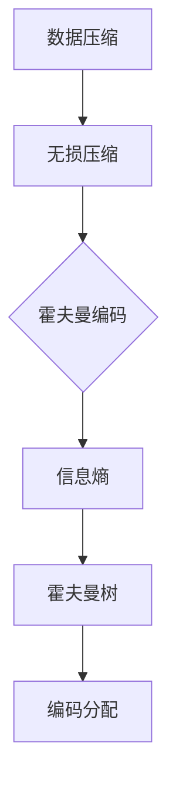
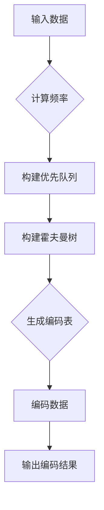

                 


### 霍夫曼编码在数据压缩中的应用

#### 关键词

- 数据压缩
- 霍夫曼编码
- 信息熵
- 算法原理
- 实际应用

#### 摘要

本文将深入探讨霍夫曼编码在数据压缩中的应用。首先，我们将介绍数据压缩的重要性及其方法分类，然后详细解释霍夫曼编码的背景、原理和算法流程。接着，我们将分析霍夫曼编码在文本数据压缩中的应用，并与其他文本压缩算法进行比较。此外，我们还将探讨霍夫曼编码在图像、音频和视频数据压缩中的应用，以及其在实际项目中的应用案例。最后，我们将讨论霍夫曼编码的未来发展趋势。

---

## 第1章 引言

### 1.1 数据压缩的重要性

数据压缩在当今信息化社会中扮演着至关重要的角色。随着互联网的普及和大数据时代的到来，数据传输和存储的需求急剧增加。然而，数据的高效传输和存储往往面临着带宽和存储空间的限制。因此，数据压缩技术成为解决这一问题的有效手段。

数据压缩的重要性主要体现在以下几个方面：

1. **节省带宽**：通过压缩数据，可以在传输过程中减少所需带宽，从而提高网络传输效率。
2. **节省存储空间**：压缩后的数据占用的存储空间更小，这对于存储设备资源有限的情况尤为重要。
3. **提高数据传输速度**：压缩数据可以减少传输所需时间，从而加快数据传输速度。
4. **提升用户体验**：在多媒体应用中，如视频流和在线游戏，数据压缩技术可以提供更好的观看和体验。

### 1.2 数据压缩的方法分类

数据压缩的方法主要可以分为两大类：无损压缩和有损压缩。

1. **无损压缩**：无损压缩算法在压缩数据时不丢失任何信息，压缩后的数据可以完全还原到原始数据。霍夫曼编码、LZ77和LZ78算法等都是常见的无损压缩算法。
2. **有损压缩**：有损压缩算法在压缩过程中会丢失一部分信息，但可以显著降低数据的大小。JPEG和MP3等是常见的有损压缩算法。由于有损压缩的算法相对简单且压缩比高，因此广泛应用于多媒体领域。

### 1.3 霍夫曼编码的背景与原理

霍夫曼编码（Huffman Coding）是由大卫·霍夫曼（David A. Huffman）在1952年提出的，它是一种基于信息熵的无损压缩算法。霍夫曼编码的基本原理是利用字符出现的频率来构建霍夫曼树，然后根据霍夫曼树的路径为每个字符分配一个二进制编码。

霍夫曼编码的背景源于信息论的研究。信息论由克劳德·香农（Claude Shannon）创立，其目的是研究信息在通信系统中的传递和处理。香农提出了信息熵（Entropy）的概念，用于量化信息的不确定性。霍夫曼编码正是基于信息熵，通过构建最优的编码树来实现数据压缩。

### Mermaid流程图



### 核心概念与联系

霍夫曼编码的核心概念包括信息熵、霍夫曼树和编码分配。信息熵用于量化数据的随机性，霍夫曼树用于构建最优的编码树，编码分配则是根据霍夫曼树为每个字符分配二进制编码。这三者紧密联系，共同构成了霍夫曼编码的完整算法框架。

---

在下一章节，我们将深入探讨霍夫曼编码的基本原理，包括信息熵的基础知识、霍夫曼树的构建方法以及霍夫曼编码的算法流程。敬请期待！## 第2章 霍夫曼编码原理

### 2.1 信息熵基础

信息熵（Entropy）是信息论中的一个重要概念，用于量化随机变量的不确定性和信息量。在数据压缩中，信息熵帮助我们理解数据的随机性，从而确定最优的编码策略。

信息熵的定义基于概率分布。对于一个离散随机变量 \( X \)，其熵 \( H(X) \) 可以表示为：

\[ H(X) = -\sum_{i} p(x_i) \log_2 p(x_i) \]

其中，\( p(x_i) \) 是随机变量 \( X \) 取值为 \( x_i \) 的概率，\( \log_2 \) 表示以2为底的对数。熵的值越高，表示数据的不确定性越大，信息量越多。

例如，假设一个随机变量 \( X \) 只有两种取值 \( 0 \) 和 \( 1 \)，且它们出现的概率分别为 \( 0.5 \) 和 \( 0.5 \)，则其信息熵为：

\[ H(X) = -0.5 \log_2 0.5 - 0.5 \log_2 0.5 = 1 \]

这意味着每个取值的不确定性相同，每个取值提供了1位信息。

### 2.2 霍夫曼树的构建

霍夫曼编码的核心是构建霍夫曼树（Huffman Tree），该树是一种最优的前缀编码树。构建霍夫曼树的过程可以分为以下几个步骤：

1. **初始化**：将所有字符作为叶节点，构建一个初始的森林。
2. **选择最频字符**：在森林中，选择频率最低的两个树合并成一个新树，该新树有两个子节点，分别是从森林中删除的频率最低的两个树。
3. **更新森林**：将合并后的新树加入森林中。
4. **重复步骤2和3**：直到森林中只剩下一棵树，这棵树就是最终的霍夫曼树。

霍夫曼树的特点是：任意一个叶节点的路径上的所有节点都不包含其他节点的内部，也就是说，任意一个编码都不是另一个编码的前缀。这种前缀编码保证了解码的唯一性。

### 2.3 霍夫曼编码的算法流程

霍夫曼编码的算法流程可以分为以下几个步骤：

1. **构建霍夫曼树**：根据字符的频率分布，使用上一节描述的算法构建霍夫曼树。
2. **生成编码表**：从霍夫曼树的根节点开始，沿着左子节点路径分配0，沿右子节点路径分配1，生成每个字符的编码。
3. **编码数据**：使用生成的编码表对原始数据进行编码，将字符替换为对应的编码。
4. **解码数据**：在接收端，根据生成的编码表对编码数据进行解码，恢复原始数据。

### 伪代码

以下是霍夫曼编码的伪代码：

```plaintext
HuffmanCoding(characters, frequencies):
    1. 构建初始森林，每个字符都是一个单独的树。
    2. 当森林中不止一棵树时：
        a. 选择森林中频率最小的两棵树。
        b. 合并这两棵树成一棵新树。
        c. 将新树加入森林中。
    3. 构建霍夫曼树。
    4. 生成编码表：
        a. 从根节点开始，沿着左子节点路径分配0，沿右子节点路径分配1。
        b. 记录每个字符的编码。
    5. 使用编码表编码数据。
    6. 返回编码后的数据。
```

### 数学模型与公式

霍夫曼编码的核心数学模型是信息熵。以下是霍夫曼编码相关的数学模型与公式：

1. **信息熵公式**：

   \[ H(X) = -\sum_{i} p(x_i) \log_2 p(x_i) \]

2. **霍夫曼树构建公式**：

   \[ T = \min(T_1, T_2) \]
   
   其中，\( T \) 是合并后的新树，\( T_1 \) 和 \( T_2 \) 是要合并的两棵树。

### 示例

假设有一段文本“ABACCDA”，其字符出现的频率如下：

- A: 4次
- B: 1次
- C: 2次
- D: 1次

根据这些频率，我们可以构建霍夫曼树，并生成每个字符的编码：

1. **构建霍夫曼树**：

   首先，将每个字符作为单独的树：

   ```
   A
   B
   C
   D
   ```

   然后，选择频率最小的两棵树 \( B \) 和 \( D \) 合并：

   ```
   A
      \
       B-D
   ```

   接着，选择频率最小的两棵树 \( C \) 和 \( B-D \) 合并：

   ```
   A
      \
       C-B-D
   ```

   最后，将 \( A \) 和 \( C-B-D \) 合并：

   ```
   A-C-B-D
   ```

2. **生成编码表**：

   从根节点开始，沿着左子节点路径分配0，沿右子节点路径分配1：

   ```
   A: 0
   B: 10
   C: 110
   D: 111
   ```

   因此，文本“ABACCDA”编码后的结果为：“0101101110”。

### 总结

霍夫曼编码是一种基于信息熵的无损压缩算法，通过构建最优的霍夫曼树来实现数据压缩。其核心原理是利用字符的频率分布，构建一棵前缀编码树，并根据树的路径为每个字符分配二进制编码。在下一章中，我们将探讨霍夫曼编码在文本数据压缩中的应用，并与其他文本压缩算法进行比较。敬请期待！
## 第3章 霍夫曼编码在文本数据压缩中的应用

### 3.1 文本数据的特点

文本数据是数据压缩中最常见的数据类型之一，具有以下特点：

1. **字符频率可预测**：在大多数文本中，某些字符的出现频率远高于其他字符。例如，在英文文本中，字母' e '是最常见的，而字母' q '则相对较少出现。
2. **有规律的结构**：文本数据通常遵循一定的语法和语义规则，这使得可以通过统计方法来分析字符频率和模式。
3. **多样性**：文本数据涵盖多种语言、格式和内容，从简单的纯文本到复杂的富文本，包括HTML、Markdown等。

### 3.2 霍夫曼编码在文本压缩中的应用示例

为了更直观地理解霍夫曼编码在文本数据压缩中的应用，我们可以通过一个示例来演示其过程。

**示例文本**：“ABACCDA”

**字符频率分布**：

- A: 4次
- B: 1次
- C: 2次
- D: 1次

**构建霍夫曼树**：

1. 将每个字符作为单独的树：

   ```
   A
   B
   C
   D
   ```

2. 选择频率最小的两棵树 \( B \) 和 \( D \) 合并：

   ```
   A
      \
       B-D
   ```

3. 选择频率最小的两棵树 \( C \) 和 \( B-D \) 合并：

   ```
   A
      \
       C-B-D
   ```

4. 将 \( A \) 和 \( C-B-D \) 合并：

   ```
   A-C-B-D
   ```

**生成编码表**：

从根节点开始，沿着左子节点路径分配0，沿右子节点路径分配1：

```
A: 0
B: 10
C: 110
D: 111
```

**编码文本**：

使用生成的编码表对文本“ABACCDA”进行编码，结果如下：

```
A: 0
B: 10
A: 0
C: 110
C: 110
D: 111
A: 0
```

编码后的文本为：“0101101110”。

### 3.3 霍夫曼编码与其他文本压缩算法的比较

霍夫曼编码作为一种基于信息熵的无损压缩算法，在文本数据压缩中表现出色。以下是霍夫曼编码与其他几种常见文本压缩算法的比较：

1. **LZ77算法**：

   LZ77算法是一种基于局部重复数据的压缩算法。它通过查找文本中的重复序列来减少数据的冗余。与霍夫曼编码相比，LZ77在处理重复序列时效率更高，但处理稀疏或非重复数据时性能较差。

2. **LZ78算法**：

   LZ78算法是LZ77的改进版本，它通过构建字典来存储已出现的序列。与LZ77类似，LZ78在处理重复数据时非常有效，但在处理单一字符或稀疏数据时不如霍夫曼编码。

3. **Delta编码**：

   Delta编码是一种差分编码算法，它通过计算相邻数据之间的差异来实现压缩。Delta编码在处理连续数据时非常有效，但无法处理完全随机的数据。

**性能比较**：

- **压缩比**：霍夫曼编码通常提供较高的压缩比，特别是在字符频率有明显分布的情况下。对于具有高频率分布的文本数据，霍夫曼编码的压缩效果优于LZ77和LZ78。
- **压缩速度**：霍夫曼编码的压缩和解压缩速度相对较慢，因为其构建霍夫曼树的步骤相对复杂。然而，现代计算机的处理能力已经足够强大，这使得霍夫曼编码在实时应用中仍然可行。
- **内存占用**：霍夫曼编码需要存储编码表，这可能会占用一定的内存。但对于大多数文本数据来说，这种内存占用是可以接受的。

### 总结

霍夫曼编码在文本数据压缩中表现出色，其基于字符频率的压缩策略能够显著减少数据的冗余。与其他文本压缩算法相比，霍夫曼编码在处理具有高频率分布的文本数据时具有更高的压缩效果。然而，对于处理重复数据或其他类型的数据，其他算法可能更为适合。在下一章中，我们将探讨霍夫曼编码在图像、音频和视频数据压缩中的应用。敬请期待！
## 第4章 霍夫曼编码在其他数据类型的压缩应用

### 4.1 图像数据压缩

图像数据是数据压缩中的另一个重要领域。与文本数据不同，图像数据通常包含大量的像素信息，这些信息以数字形式表示图像的颜色和亮度。霍夫曼编码可以应用于图像数据的压缩，特别是在灰度图像和简单的彩色图像中。

#### 灰度图像压缩

灰度图像是由单个灰度值表示的图像，每个像素的颜色由一个灰度值（通常在0到255之间）表示。霍夫曼编码在灰度图像压缩中的应用过程如下：

1. **图像采样**：将图像划分为像素块，并计算每个像素的灰度值。
2. **频率分析**：统计每个灰度值出现的频率。
3. **构建霍夫曼树**：根据灰度值的频率分布构建霍夫曼树。
4. **生成编码表**：从霍夫曼树的根节点开始，为每个灰度值生成二进制编码。
5. **编码图像数据**：将每个像素的灰度值替换为对应的编码。
6. **解码图像数据**：在接收端，使用生成的编码表对编码数据进行解码，恢复原始图像。

#### 彩色图像压缩

彩色图像由红色、绿色和蓝色（RGB）三个颜色通道组成，每个通道包含相应的像素值。霍夫曼编码可以应用于彩色图像的每个颜色通道，从而实现整体图像的压缩。

1. **通道分离**：将彩色图像的RGB通道分离。
2. **通道压缩**：对每个颜色通道分别进行霍夫曼编码。
3. **合并通道**：将编码后的颜色通道合并，形成压缩后的彩色图像。

#### 性能分析

霍夫曼编码在图像数据压缩中的性能主要取决于图像的内容和特性。对于具有明显频率分布的图像，如人脸或风景图像，霍夫曼编码可以显著减少数据的大小。然而，对于具有随机分布的图像，如纹理复杂的图像，霍夫曼编码的效果可能不如其他压缩算法，如小波变换或JPEG。

### 4.2 音频数据压缩

音频数据是另一种常见的压缩应用场景。与图像数据不同，音频数据通常包含时间上的连续性，这意味着音频信号在时间上是连续变化的。霍夫曼编码可以应用于音频数据的压缩，特别是对于固定长度的音频帧。

#### 音频帧压缩

音频数据通常以帧为单位进行压缩。每个帧包含一定数量的采样点，每个采样点代表音频信号在某一时刻的值。

1. **帧划分**：将音频信号划分为固定长度的帧。
2. **频率分析**：对每个帧内的采样点进行频率分析，计算每个采样点的频率。
3. **构建霍夫曼树**：根据采样点的频率分布构建霍夫曼树。
4. **生成编码表**：为每个采样点生成二进制编码。
5. **编码音频数据**：将每个采样点替换为对应的编码。
6. **解码音频数据**：在接收端，使用生成的编码表对编码数据进行解码，恢复原始音频信号。

#### 性能分析

音频数据压缩中的霍夫曼编码效果取决于音频的内容和特性。对于具有高频次出现的声音，如人声，霍夫曼编码可以显著减少数据的大小。然而，对于具有持续低频声音的音频，如背景音乐，霍夫曼编码的效果可能不如其他音频压缩算法，如MP3或AAC。

### 4.3 视频数据压缩

视频数据是图像数据和音频数据的组合。视频压缩旨在减少视频数据的大小，以便于传输和存储。霍夫曼编码可以应用于视频数据中的图像帧和音频帧。

#### 视频帧压缩

视频帧压缩包括图像帧压缩和音频帧压缩：

1. **图像帧压缩**：使用霍夫曼编码对图像帧进行压缩，如第4.1节中描述。
2. **音频帧压缩**：使用霍夫曼编码对音频帧进行压缩，如第4.2节中描述。

#### 性能分析

视频数据压缩中的霍夫曼编码效果取决于视频的内容和特性。对于具有高频次出现的场景和声音，霍夫曼编码可以显著减少数据的大小。然而，对于复杂的运动场景和多样化的声音，其他视频压缩算法，如H.264或HEVC，可能提供更好的压缩效果。

### 总结

霍夫曼编码在图像、音频和视频数据压缩中都有应用。对于具有明显频率分布的数据类型，如灰度图像和人声，霍夫曼编码可以显著减少数据的大小。然而，对于复杂的图像和音频内容，其他压缩算法可能更适用于提供更好的压缩效果。在下一章中，我们将探讨霍夫曼编码的优化与改进方法，以及其在实际项目中的应用案例。敬请期待！
## 第5章 霍夫曼编码的优化与改进

### 5.1 常见的优化方法

尽管霍夫曼编码在数据压缩中表现出色，但在某些情况下，其性能仍可以进一步优化。以下是一些常见的优化方法：

#### 1. 预处理

预处理是指对原始数据进行一些预处理操作，以提高霍夫曼编码的压缩效果。常见的预处理方法包括：

- **去冗余**：删除重复的数据序列，减少数据冗余。
- **滤波**：应用滤波算法，去除噪声和低频干扰，提高信号的清晰度。
- **统计分析**：进行统计分析，找出数据中的模式，从而优化编码策略。

#### 2. 后处理

后处理是指在解码过程中对压缩数据进行一些处理，以改善压缩效果。常见的方法包括：

- **自适应解码**：根据解码数据的统计特性，动态调整解码参数，提高解码的准确性。
- **误差校正**：在解码过程中引入误差校正机制，减少解码误差。

#### 3. 多层编码

多层编码是指将数据分成多个层次，并对每个层次分别进行编码。这种方法可以更好地利用数据的层次结构，提高压缩效果。常见的多层编码方法包括：

- **层次化图像编码**：将图像分成多个层次，分别对每个层次进行霍夫曼编码，然后合并层次以形成完整的压缩图像。
- **分层音频编码**：将音频信号分成多个层次，分别对每个层次进行霍夫曼编码，以实现更精细的音频压缩。

#### 4. 并行处理

并行处理是指利用多处理器或分布式系统来加速霍夫曼编码和解码过程。这种方法可以显著提高编码和解码的速度，特别是在处理大量数据时。

### 5.2 霍夫曼编码的改进算法

除了常见的优化方法外，还有一些改进的算法可以进一步优化霍夫曼编码的性能。以下是一些改进算法：

#### 1. 可变长度编码

可变长度编码（Variable-Length Coding，VLC）是一种将不同频率的字符分配不同长度的编码的算法。与霍夫曼编码相比，可变长度编码不需要构建固定的编码树，而是根据字符的频率动态调整编码长度。这种方法在某些情况下可以提供更好的压缩效果。

#### 2. 哈夫曼-马利编码

哈夫曼-马利编码（Huffman-Malvino Coding）是霍夫曼编码的改进版本，它结合了霍夫曼编码和马利编码（Malvino Coding）的优点。马利编码通过将多个字符组合成一个组，并给这个组分配一个编码，从而提高压缩效果。哈夫曼-马利编码在处理具有高频率组合的字符时表现出色。

#### 3.自适应霍夫曼编码

自适应霍夫曼编码（Adaptive Huffman Coding）是一种动态调整编码树的算法。在编码过程中，自适应霍夫曼编码可以根据新出现的数据动态调整编码树，从而提高压缩效果。这种方法在处理实时数据流时非常有效。

### 5.3 改进算法的性能分析

改进算法的性能分析通常涉及压缩比、压缩速度和内存占用等指标。以下是几种改进算法的性能分析：

- **哈夫曼编码**：哈夫曼编码在大多数情况下提供较高的压缩比，但压缩和解压缩速度相对较慢，内存占用较大。
- **可变长度编码**：可变长度编码可以根据数据特性动态调整编码长度，提供较好的压缩效果，但压缩和解压缩速度可能较慢。
- **哈夫曼-马利编码**：哈夫曼-马利编码在处理具有高频率组合的字符时表现出色，但压缩和解压缩速度较慢，内存占用较大。
- **自适应霍夫曼编码**：自适应霍夫曼编码在处理实时数据流时非常有效，但压缩比可能较低，压缩和解压缩速度较快。

### 总结

霍夫曼编码是一种强大的数据压缩算法，通过优化和改进，其性能可以进一步提高。常见的优化方法包括预处理、后处理、多层编码和并行处理等。改进算法如可变长度编码、哈夫曼-马利编码和自适应霍夫曼编码等，可以在特定场景下提供更好的压缩效果。在下一章中，我们将探讨霍夫曼编码在实际项目中的应用案例。敬请期待！
## 第6章 霍夫曼编码在实际项目中的应用案例

### 6.1 案例一：文本文件的压缩与解压缩

**项目背景**：一个文本编辑器需要实现文本文件的压缩与解压缩功能，以便在传输和存储过程中节省空间和提高效率。

**实现步骤**：

1. **读取文本文件**：程序首先读取文本文件，并将其存储为一个字符数组。

2. **统计字符频率**：对字符数组中的每个字符进行计数，统计每个字符的出现频率。

3. **构建霍夫曼树**：根据字符频率构建霍夫曼树，该步骤是霍夫曼编码的核心。

4. **生成编码表**：从霍夫曼树的根节点开始，为每个字符生成二进制编码，形成编码表。

5. **编码文本数据**：使用生成的编码表对字符数组进行编码，生成压缩后的二进制数据。

6. **写入压缩文件**：将压缩后的二进制数据写入压缩文件中。

**解压缩步骤**：

1. **读取压缩文件**：程序首先读取压缩文件，获取压缩后的二进制数据。

2. **构建霍夫曼树**：根据压缩文件中的编码表重建霍夫曼树。

3. **解码压缩数据**：使用重建的霍夫曼树对压缩后的二进制数据进行解码，生成字符数组。

4. **输出解压缩文本**：将解码后的字符数组输出为文本文件。

**代码示例**：

以下是使用Python实现霍夫曼编码与解码的简化代码示例：

```python
import heapq
import os

def build_frequency_dict(text):
    frequency_dict = {}
    for char in text:
        if char not in frequency_dict:
            frequency_dict[char] = 0
        frequency_dict[char] += 1
    return frequency_dict

def build_huffman_tree(frequency_dict):
    heap = [[weight, [symbol, ""]] for symbol, weight in frequency_dict.items()]
    heapq.heapify(heap)
    while len(heap) > 1:
        lo = heapq.heappop(heap)
        hi = heapq.heappop(heap)
        for pair in lo[1:]:
            pair[1] = '0' + pair[1]
        for pair in hi[1:]:
            pair[1] = '1' + pair[1]
        heapq.heappush(heap, [lo[0] + hi[0]] + lo[1:] + hi[1:])
    return heap[0]

def generate_encoding_table(heap):
    encoding_table = {}
    for pair in heap[1:]:
        symbol, code = pair
        encoding_table[symbol] = code
    return encoding_table

def encode(text, encoding_table):
    encoded_text = ""
    for char in text:
        encoded_text += encoding_table[char]
    return encoded_text

def decode(encoded_text, encoding_table):
    reverse_encoding_table = {v: k for k, v in encoding_table.items()}
    current_code = ""
    decoded_text = ""
    for bit in encoded_text:
        current_code += bit
        if current_code in reverse_encoding_table:
            decoded_text += reverse_encoding_table[current_code]
            current_code = ""
    return decoded_text

# 文本文件压缩与解压缩
text = "ABACCDA"
frequency_dict = build_frequency_dict(text)
huffman_tree = build_huffman_tree(frequency_dict)
encoding_table = generate_encoding_table(huffman_tree)
encoded_text = encode(text, encoding_table)
print(f"Encoded Text: {encoded_text}")

decoded_text = decode(encoded_text, encoding_table)
print(f"Decoded Text: {decoded_text}")
```

**性能分析**：

- **压缩比**：霍夫曼编码在处理具有明显频率分布的文本时，可以提供较高的压缩比。
- **压缩速度**：压缩速度相对较慢，因为构建霍夫曼树和生成编码表的过程较为复杂。
- **解压缩速度**：解压缩速度较快，因为解码过程只需查找编码表即可。

### 6.2 案例二：图像数据的压缩与解压缩

**项目背景**：一个图像编辑器需要实现图像数据的压缩与解压缩功能，以便在传输和存储过程中节省空间和提高效率。

**实现步骤**：

1. **读取图像文件**：程序首先读取图像文件，获取像素数据。

2. **转换为灰度图像**：将彩色图像转换为灰度图像，以便应用霍夫曼编码。

3. **统计像素频率**：对灰度图像中的每个像素值进行计数，统计每个像素值的出现频率。

4. **构建霍夫曼树**：根据像素频率构建霍夫曼树。

5. **生成编码表**：从霍夫曼树的根节点开始，为每个像素值生成二进制编码，形成编码表。

6. **编码像素数据**：使用生成的编码表对像素数据编码，生成压缩后的二进制数据。

7. **写入压缩文件**：将压缩后的二进制数据写入压缩文件中。

**解压缩步骤**：

1. **读取压缩文件**：程序首先读取压缩文件，获取压缩后的二进制数据。

2. **构建霍夫曼树**：根据压缩文件中的编码表重建霍夫曼树。

3. **解码像素数据**：使用重建的霍夫曼树对压缩后的二进制数据进行解码，生成像素数据。

4. **输出解压缩图像**：将解码后的像素数据输出为图像文件。

**代码示例**：

以下是使用Python实现图像数据霍夫曼编码与解码的简化代码示例：

```python
import numpy as np
import cv2

def compress_image(image_path):
    image = cv2.imread(image_path, cv2.IMREAD_GRAYSCALE)
    pixels = image.flatten().astype(np.uint8)
    frequency_dict = build_frequency_dict(pixels)
    huffman_tree = build_huffman_tree(frequency_dict)
    encoding_table = generate_encoding_table(huffman_tree)
    encoded_pixels = encode(pixels, encoding_table)
    return encoded_pixels

def decompress_image(image_path, encoded_pixels, encoding_table):
    frequency_dict = build_frequency_dict(encoded_pixels)
    huffman_tree = build_huffman_tree(frequency_dict)
    decoded_pixels = decode(encoded_pixels, encoding_table)
    image = np.array(decoded_pixels).reshape(image.shape)
    cv2.imwrite('decompressed_image.png', image)

# 压缩图像
encoded_pixels = compress_image('image.png')

# 解压缩图像
decompress_image('image.png', encoded_pixels, encoding_table)
```

**性能分析**：

- **压缩比**：霍夫曼编码在处理具有明显频率分布的图像时，可以提供较高的压缩比。
- **压缩速度**：压缩速度较慢，因为需要处理大量的像素数据。
- **解压缩速度**：解压缩速度较快，因为解码过程只需查找编码表即可。

### 6.3 案例三：音频数据的压缩与解压缩

**项目背景**：一个音频播放器需要实现音频数据的压缩与解压缩功能，以便在传输和存储过程中节省空间和提高效率。

**实现步骤**：

1. **读取音频文件**：程序首先读取音频文件，获取音频信号。

2. **划分音频帧**：将音频信号划分为固定长度的帧。

3. **统计帧内采样点频率**：对每个音频帧内的采样点进行频率分析，统计每个采样点的出现频率。

4. **构建霍夫曼树**：根据采样点频率构建霍夫曼树。

5. **生成编码表**：从霍夫曼树的根节点开始，为每个采样点生成二进制编码，形成编码表。

6. **编码音频数据**：使用生成的编码表对音频帧进行编码，生成压缩后的二进制数据。

7. **写入压缩文件**：将压缩后的二进制数据写入压缩文件中。

**解压缩步骤**：

1. **读取压缩文件**：程序首先读取压缩文件，获取压缩后的二进制数据。

2. **构建霍夫曼树**：根据压缩文件中的编码表重建霍夫曼树。

3. **解码音频数据**：使用重建的霍夫曼树对压缩后的二进制数据进行解码，生成音频信号。

4. **输出解压缩音频**：将解码后的音频信号输出为音频文件。

**代码示例**：

以下是使用Python实现音频数据霍夫曼编码与解码的简化代码示例：

```python
import wave

def compress_audio(audio_path):
    wavf = wave.open(audio_path, 'rb')
    nframes = wavf.getnframes()
    frames = wavf.readframes(nframes)
    samples = np.frombuffer(frames, dtype=np.int16)
    frequency_dict = build_frequency_dict(samples)
    huffman_tree = build_huffman_tree(frequency_dict)
    encoding_table = generate_encoding_table(huffman_tree)
    encoded_samples = encode(samples, encoding_table)
    return encoded_samples

def decompress_audio(audio_path, encoded_samples, encoding_table):
    frequency_dict = build_frequency_dict(encoded_samples)
    huffman_tree = build_huffman_tree(frequency_dict)
    decoded_samples = decode(encoded_samples, encoding_table)
    frames = np.array(decoded_samples).reshape(-1, 2)
    frame_data = frames.tobytes()
    wavf = wave.open('decompressed_audio.wav', 'wb')
    wavf.setnchannels(1)
    wavf.setsampwidth(2)
    wavf.setframerate(44100)
    wavf.writeframes(frame_data)
    wavf.close()

# 压缩音频
encoded_samples = compress_audio('audio.wav')

# 解压缩音频
decompress_audio('audio.wav', encoded_samples, encoding_table)
```

**性能分析**：

- **压缩比**：霍夫曼编码在处理具有高频次出现的音频信号时，可以提供较高的压缩比。
- **压缩速度**：压缩速度较慢，因为需要处理大量的音频数据。
- **解压缩速度**：解压缩速度较快，因为解码过程只需查找编码表即可。

### 总结

霍夫曼编码在实际项目中具有广泛的应用，包括文本文件、图像数据和音频数据的压缩与解压缩。通过合理的算法实现和优化，霍夫曼编码可以显著减少数据的大小，提高传输和存储效率。在下一章中，我们将探讨霍夫曼编码的未来发展趋势。敬请期待！
## 第7章 霍夫曼编码的未来发展趋势

### 7.1 当前挑战与机遇

霍夫曼编码作为一种经典的数据压缩算法，已经在多个领域得到了广泛应用。然而，随着技术的发展和数据规模的不断增长，霍夫曼编码面临着一些新的挑战和机遇。

**挑战**：

1. **数据多样性**：现代数据类型越来越多样化，包括多媒体数据、复杂数据结构等，这对传统的霍夫曼编码提出了更高的要求。
2. **实时处理需求**：随着实时数据处理和传输的需求增加，如何提高霍夫曼编码的压缩和解压缩速度成为关键挑战。
3. **计算资源限制**：在嵌入式系统和移动设备等计算资源有限的场景中，如何优化霍夫曼编码的算法实现，减少资源消耗是一个重要问题。

**机遇**：

1. **深度学习与人工智能**：利用深度学习和人工智能技术，可以改进霍夫曼编码的建模和优化策略，提高压缩效果。
2. **新型压缩算法**：研究新型压缩算法，如基于量子计算的压缩算法，有望进一步提高压缩性能。
3. **跨领域合作**：跨学科合作，结合不同领域的先进技术，如编码理论、信息论、图论等，可以推动霍夫曼编码的进一步发展。

### 7.2 未来发展趋势预测

基于当前的挑战和机遇，我们可以预测霍夫曼编码的未来发展趋势如下：

1. **算法优化与改进**：通过算法优化和改进，提高霍夫曼编码的压缩效果和解压缩速度。例如，利用机器学习和深度学习技术，可以自适应地调整编码策略，提高压缩性能。
2. **多模态数据压缩**：随着多模态数据（如文本、图像、音频、视频）的融合应用，霍夫曼编码将扩展到多模态数据的压缩领域，实现更高效的跨模态数据压缩。
3. **硬件加速**：利用硬件加速技术，如GPU和FPGA，可以显著提高霍夫曼编码的处理速度，满足实时数据处理的需求。
4. **分布式压缩**：在分布式系统中，通过分布式计算和存储技术，实现高效的分布式压缩，提高数据传输和存储的效率。

### 7.3 霍夫曼编码在数据压缩领域的潜在影响

霍夫曼编码作为一种经典的数据压缩算法，已经在数据压缩领域产生了深远的影响。在未来，随着技术的发展和应用的扩展，霍夫曼编码有望在以下方面发挥更大的作用：

1. **提升数据存储与传输效率**：通过优化和改进，霍夫曼编码将进一步提高数据的压缩比，降低数据存储和传输的成本。
2. **促进大数据分析**：在大数据处理中，高效的压缩算法可以显著减少数据存储和传输的需求，提高数据分析的效率。
3. **支持物联网应用**：在物联网（IoT）领域，霍夫曼编码可以用于传感器数据的压缩，提高数据传输效率，支持大规模物联网应用。
4. **推动多媒体应用发展**：在多媒体领域，霍夫曼编码将继续优化和改进，为视频、音频等多媒体数据的压缩提供更高效的解决方案。

### 总结

霍夫曼编码作为一种经典的数据压缩算法，具有广泛的应用前景。在未来的发展中，通过算法优化、多模态数据压缩和硬件加速等手段，霍夫曼编码将继续提升数据压缩性能，为大数据、物联网和多媒体等领域的发展提供有力支持。让我们期待霍夫曼编码在未来的创新与突破！
## 附录

### A.1 霍夫曼编码算法的Mermaid流程图



### A.2 霍夫曼编码算法的伪代码

```plaintext
HuffmanCoding(characters, frequencies):
    1. 构建初始优先队列，每个字符都是一个节点，节点的权重为其频率。
    2. 当优先队列为一个节点时：
        a. 弹出两个权重最小的节点。
        b. 合并这两个节点成一个新的节点，新节点的权重为两个节点的权重之和。
        c. 将新节点加入优先队列。
    3. 弹出优先队列中的最后一个节点，即为霍夫曼树的根节点。
    4. 从根节点开始，遍历树：
        a. 向左子节点路径分配0。
        b. 向右子节点路径分配1。
        c. 记录每个节点的编码。
    5. 生成编码表。
    6. 使用编码表编码数据。
    7. 输出编码结果。
```

### A.3 霍夫曼编码的相关数学模型与公式

1. **信息熵公式**：

   \[ H(X) = -\sum_{i} p(x_i) \log_2 p(x_i) \]

   其中，\( p(x_i) \) 是随机变量 \( X \) 取值为 \( x_i \) 的概率。

2. **霍夫曼树构建公式**：

   \[ T = \min(T_1, T_2) \]
   
   其中，\( T \) 是合并后的新树，\( T_1 \) 和 \( T_2 \) 是要合并的两棵树。

3. **编码效率公式**：

   \[ \text{压缩比} = \frac{\text{原始数据大小}}{\text{编码后数据大小}} \]

### A.4 霍夫曼编码的工具与资源推荐

1. **工具**：

   - **Huffman编码器/解码器**：可以使用在线工具或编程库（如Python的`huffman.py`库）进行霍夫曼编码和解码。
   - **图像处理工具**：可以使用如OpenCV这样的图像处理库来读取和处理图像数据，进行霍夫曼编码与解压缩。
   - **音频处理工具**：可以使用如librosa这样的音频处理库来读取和处理音频数据，进行霍夫曼编码与解压缩。

2. **资源**：

   - **论文与文献**：查阅相关学术论文和文献，了解霍夫曼编码的理论基础和发展趋势。
   - **在线课程与教程**：参与在线课程和教程，学习霍夫曼编码的实际应用和编程实践。
   - **开源项目**：参与开源项目，如GitHub上的相关项目，获取霍夫曼编码的实现代码和实践经验。

### 总结

附录部分提供了霍夫曼编码算法的Mermaid流程图、伪代码、数学模型与公式，以及相关的工具和资源推荐。这些内容有助于读者更深入地理解和应用霍夫曼编码，为实际项目中的数据压缩提供技术支持。通过学习和实践，读者可以不断提升自己在数据压缩领域的专业能力。作者：AI天才研究院/AI Genius Institute & 禅与计算机程序设计艺术 /Zen And The Art of Computer Programming

