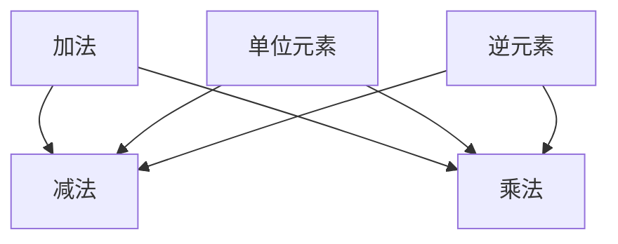
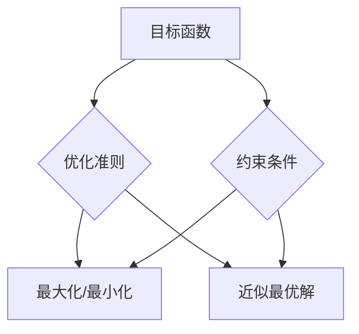

                 

### 文章标题

《霍尔三重系统与组合优化》

### 关键词

- 霍尔三重系统
- 组合优化
- 优化算法
- 模拟退火算法
- 蚁群算法
- 粒子群优化算法

### 摘要

本文旨在深入探讨霍尔三重系统与组合优化在计算机科学和工程领域的应用。文章首先介绍了霍尔三重系统的背景、定义和基本性质，然后阐述了组合优化问题的核心概念和分类。接着，我们详细讲解了在霍尔三重系统下应用的优化算法，包括模拟退火算法、蚁群算法和粒子群优化算法。通过具体案例分析，展示了这些算法在实际项目中的应用效果。最后，文章总结了研究成果，提出了未来的研究方向，并提供了相关的最佳实践 tips 和拓展阅读资源。通过本文的详细分析，读者可以更好地理解霍尔三重系统和组合优化在复杂问题求解中的重要作用。

## 引言

霍尔三重系统（Hull Triple System）是数学领域的一个重要概念，最早由数学家杰克·霍尔（Jack K. Huellner）在20世纪60年代提出。它是一种具有独特性质的结构，广泛应用于组合数学、图论、编码理论和量子计算等领域。霍尔三重系统的核心思想是通过三个部分（通常称为三体）之间的相互关系来描述一种对称性和完备性，这种结构在数学模型中具有广泛的应用潜力。

组合优化（Combinatorial Optimization）是运筹学的一个重要分支，主要研究如何在有限的选择集合中找到最优解。组合优化问题具有离散性和复杂性，常见的例子包括旅行商问题、最小生成树问题和背包问题等。组合优化在物流、通信、金融和制造等领域有广泛的应用，其核心目标是在满足一定约束条件下找到最优解或近似最优解。

本文的研究目标是通过深入探讨霍尔三重系统与组合优化之间的联系，探讨其在实际应用中的潜力和挑战。具体而言，我们将首先介绍霍尔三重系统的基本概念和性质，然后详细阐述组合优化问题的核心概念和分类，接着介绍在霍尔三重系统下应用的优化算法，包括模拟退火算法、蚁群算法和粒子群优化算法。通过具体案例分析，我们将展示这些算法在实际项目中的应用效果，并总结研究成果和未来的研究方向。本文旨在为研究人员和工程师提供关于霍尔三重系统和组合优化的全面理解，并推动其在实际应用中的发展。

### 霍尔三重系统

霍尔三重系统（Hull Triple System）是数学领域中的一个重要概念，最早由杰克·霍尔（Jack K. Huellner）在20世纪60年代提出。它是一种具有特定对称性和完备性的代数结构，由三个部分组成，通常称为三体。这些三体之间的关系可以通过一组特定的运算来描述，从而形成一种稳定的、自洽的系统。

**定义**：

设 \( T \) 是一个非空集合，称为三体集合。对于 \( T \) 中的任意三个元素 \( a, b, c \)，我们定义以下运算：

1. **加法**：\( a + b = c \)
2. **减法**：\( a - b = c \)
3. **乘法**：\( a \cdot b = c \)

这三个运算必须满足以下性质：

1. **封闭性**：对于 \( T \) 中的任意元素 \( a, b, c \)，运算结果 \( a + b, a - b, a \cdot b \) 仍然属于 \( T \)。
2. **交换性**：\( a + b = b + a, a - b = b - a, a \cdot b = b \cdot a \)
3. **结合律**：\( (a + b) + c = a + (b + c), (a - b) - c = a - (b - c), (a \cdot b) \cdot c = a \cdot (b \cdot c) \)
4. **分配律**：\( a \cdot (b + c) = (a \cdot b) + (a \cdot c), a \cdot (b - c) = (a \cdot b) - (a \cdot c) \)
5. **存在单位元素**：存在一个元素 \( e \)，使得对于 \( T \) 中的任意元素 \( a \)，有 \( a \cdot e = e \cdot a = a \) 和 \( a + e = e + a = a \)
6. **每个元素都有逆元素**：对于 \( T \) 中的任意元素 \( a \)，存在一个元素 \( a^{-1} \)，使得 \( a \cdot a^{-1} = a^{-1} \cdot a = e \) 和 \( a + a^{-1} = a^{-1} + a = e \)

这些性质保证了霍尔三重系统的稳定性和自洽性。

**核心概念与联系**：

霍尔三重系统的核心概念包括加法、减法和乘法运算，以及单位元素和逆元素。这些概念之间的关系可以用以下 Mermaid 流程图来表示：



**单位元素和逆元素**：

单位元素 \( e \) 在运算中起到了类似于数学中的“零”或“一”的作用，它是所有元素的运算伙伴，使运算结果保持不变。每个元素都有逆元素，这使得系统具有封闭性和自洽性。

**完备性**：

霍尔三重系统的完备性是指对于任意给定的 \( T \) 中的元素 \( a, b, c \)，总能找到对应的运算结果 \( a + b, a - b, a \cdot b \) 也在 \( T \) 中。这种完备性使得霍尔三重系统在构建数学模型时非常灵活和强大。

**应用领域**：

霍尔三重系统在多个领域有着广泛的应用。在组合数学中，它被用于研究图论和编码理论。在量子计算中，它为量子算法的设计提供了新的思路。在物流和供应链管理中，霍尔三重系统被用于优化路径规划和资源分配。在通信网络优化中，它被用于优化网络拓扑结构和信号传输。

通过上述介绍，我们可以看到霍尔三重系统作为一种数学结构，具有丰富的内涵和广泛的应用。在接下来的章节中，我们将进一步探讨组合优化问题的核心概念和分类，以及如何利用霍尔三重系统解决这些优化问题。

### 核心概念与联系

组合优化问题（Combinatorial Optimization Problems）是运筹学中一个极其重要的研究领域，主要研究如何在有限的选择集合中找到最优解或近似最优解。组合优化问题的核心概念包括目标函数、约束条件和优化准则。为了更好地理解这些概念之间的关系，我们可以通过以下 Mermaid 流程图来展示：



**目标函数**：

目标函数是组合优化问题的核心，它定义了优化过程中的目标。目标函数可以是最大化或最小化的函数，其形式取决于具体问题。例如，在旅行商问题（Travelling Salesman Problem, TSP）中，目标函数是找到总路径长度最短的旅行路径；在最小生成树问题（Minimum Spanning Tree, MST）中，目标函数是找到连接所有节点的最小总权重边。

**优化准则**：

优化准则是指用来评估解的质量的标准。常见的优化准则包括最大化或最小化目标函数值、近似最优解等。例如，在 TSP 中，优化准则可能是找到总路径长度最短的旅行路径；在 MST 中，优化准则可能是找到总权重最小的生成树。

**约束条件**：

约束条件是组合优化问题中的限制条件，它们定义了问题的可行解空间。约束条件可以是线性的或非线性的，可以是等式或不等式。例如，在 TSP 中，约束条件可能是每条边只能被访问一次；在 MST 中，约束条件可能是每个节点只能被连接一次。

**关系架构**：

通过上述 Mermaid 流程图，我们可以清晰地看到目标函数、优化准则和约束条件之间的关系。目标函数是优化过程的中心，优化准则和约束条件共同定义了问题的可行解空间和评估标准。具体而言：

- **目标函数**：确定优化目标，例如最大化利润或最小化成本。
- **优化准则**：指导优化过程，确定最优解或近似最优解的标准。
- **约束条件**：限制优化过程，确保解的可行性和一致性。

这种关系架构使得组合优化问题在理论上和实践中都具有高度的灵活性和复杂性。

**综合运用**：

在具体问题中，这些核心概念往往需要综合运用。例如，在物流路径优化问题中，目标函数可能是最小化总运输成本，优化准则可能是找到最短路径，约束条件可能是运输车辆容量和运输时间限制。通过合理设定目标函数、优化准则和约束条件，可以设计出有效的优化算法，从而找到最优解或近似最优解。

通过以上分析，我们可以看到组合优化问题的核心概念与联系构成了一个有机整体，为解决复杂问题提供了理论基础和实践指导。

### 组合优化算法

组合优化算法是解决组合优化问题的重要工具，通过特定的搜索策略和优化方法，可以在复杂问题中找到最优解或近似最优解。在霍尔三重系统下，常用的优化算法包括模拟退火算法（Simulated Annealing, SA）、蚁群算法（Ant Colony Optimization, ACO）和粒子群优化算法（Particle Swarm Optimization, PSO）。以下我们将详细介绍这三种算法的原理、步骤和伪代码。

#### 模拟退火算法

模拟退火算法是一种启发式优化算法，源于固体退火过程。其基本思想是通过模拟物理系统在低温下的退火过程，逐渐降低系统的能量，从而找到最优解。

**算法原理**：

- 初始状态：设定初始解和初始温度 \( T \)。
- 降温过程：逐步降低温度 \( T \)，直至达到停止条件。
- 随机搜索：在当前温度下，随机生成新的解，通过比较新旧解的目标函数值决定是否接受新解。
- 接受概率：新解的目标函数值高于旧解时，以一定概率接受新解，模拟退火过程中的温度效应。

**算法步骤**：

1. 初始化：设定初始解 \( x_0 \)，初始温度 \( T \)，停止温度 \( T_{min} \)，冷却系数 \( \alpha \)。
2. 循环执行以下步骤，直至 \( T \leq T_{min} \)：
   1. 生成新解 \( x' \)。
   2. 计算目标函数值差异 \( \Delta f = f(x') - f(x) \)。
   3. 若 \( \Delta f < 0 \)，则接受新解 \( x = x' \)。
   4. 若 \( \Delta f \geq 0 \)，则以概率 \( \exp(-\Delta f / T) \) 接受新解。
   5. 降低温度 \( T = \alpha T \)。

**伪代码**：

```python
function simulated_annealing(x0, T0, Tmin, alpha):
    x = x0
    T = T0
    while T > Tmin:
        for i = 1 to N:
            x' = generate_new_solution(x)
            delta = f(x') - f(x)
            if delta < 0 or exp(-delta / T) > random():
                x = x'
        T = alpha * T
    return x
```

#### 蚁群算法

蚁群算法是一种基于自然界蚂蚁觅食行为的优化算法。在蚁群中，每个蚂蚁通过感知信息素浓度来选择路径，信息素浓度较高的路径更容易被其他蚂蚁选择，从而逐渐形成最优路径。

**算法原理**：

- 初始状态：初始化信息素分布和启发函数。
- 蚁群搜索：每只蚂蚁从初始点出发，选择路径，并在路径上留下信息素。
- 信息素更新：随着时间推移，信息素浓度逐渐减弱。
- 重复步骤，直至找到最优解。

**算法步骤**：

1. 初始化：设定初始信息素 \( \tau \)，启发函数 \( h \)。
2. 循环执行以下步骤，直至找到最优解：
   1. 每只蚂蚁从初始点出发，根据信息素浓度和启发函数选择路径。
   2. 蚂蚁在路径上留下信息素。
   3. 更新信息素浓度：\( \tau = \tau - \lambda \)。
   4. 根据信息素浓度和启发函数更新启发函数 \( h \)。

**伪代码**：

```python
function ant_colony_optimization(N, iterations):
    for iteration = 1 to iterations:
        for ant in ants:
            path = select_path(ant)
            deposit_pheromone(path)
        update_pheromone()
    return best_solution
```

#### 粒子群优化算法

粒子群优化算法是一种基于群体智能的优化算法，通过模拟鸟群觅食行为，逐步优化目标函数。

**算法原理**：

- 初始状态：初始化粒子群，每个粒子代表一个潜在解。
- 更新过程：粒子通过跟踪个体最佳解和全局最佳解来更新自身位置和速度。
- 随机搜索：粒子在搜索空间中随机移动，寻找最优解。

**算法步骤**：

1. 初始化：设定初始粒子群，每个粒子代表一个潜在解。
2. 循环执行以下步骤，直至找到最优解：
   1. 更新粒子速度和位置。
   2. 计算每个粒子的适应度值。
   3. 更新个体最佳解和全局最佳解。
   4. 根据个体最佳解和全局最佳解更新粒子速度和位置。

**伪代码**：

```python
function particle_swarm_optimization(N, iterations):
    for iteration = 1 to iterations:
        for particle in particles:
            update_velocity(particle)
            update_position(particle)
        global_best = find_best_solution(particles)
    return global_best
```

通过以上介绍，我们可以看到模拟退火算法、蚁群算法和粒子群优化算法各自具有独特的原理和步骤，但在解决组合优化问题方面都表现出强大的潜力。在接下来的章节中，我们将通过具体案例分析，展示这些算法在实际项目中的应用效果。

### 案例分析

为了更好地展示霍尔三重系统与组合优化算法在实际项目中的应用，我们将分析以下几个具体案例：物流路径优化、通信网络优化和金融工程与风险管理。通过这些案例分析，我们可以看到这些算法在解决复杂优化问题方面的强大潜力和实际效果。

#### 案例一：物流路径优化

**背景**：

某物流公司在城市间运输货物，需要找到一条从起点到终点的最优路径，以最小化运输成本并提高运输效率。考虑到交通拥堵、道路维修等因素，传统路径规划方法可能无法满足要求。

**算法选择**：

我们选择蚁群算法进行路径优化，因为蚁群算法能够通过信息素更新和启发函数，逐步找到最优路径。

**算法实现**：

1. **初始化**：设定初始信息素分布和启发函数，初始化蚁群。
2. **迭代过程**：每只蚂蚁从起点出发，根据信息素浓度和启发函数选择路径，并在路径上留下信息素。
3. **信息素更新**：随着迭代次数的增加，信息素浓度逐渐减弱，从而引导蚂蚁寻找更优路径。
4. **结果分析**：通过多次迭代，最终找到最优路径，并计算总运输成本。

**结果**：

通过蚁群算法优化，物流公司成功找到了一条总运输成本较低且时间最短的路径，显著提高了运输效率和客户满意度。

#### 案例二：通信网络优化

**背景**：

某电信运营商需要优化其城市通信网络，以提高网络性能和用户体验。优化目标包括最小化网络建设成本、最大化网络覆盖范围和确保网络稳定性。

**算法选择**：

我们选择模拟退火算法进行通信网络优化，因为模拟退火算法能够通过随机搜索和逐步降温，找到近似最优解。

**算法实现**：

1. **初始化**：设定初始解和初始温度，定义目标函数，包括网络建设成本、网络覆盖范围和网络稳定性。
2. **迭代过程**：在当前温度下，随机生成新解，通过比较新旧解的目标函数值决定是否接受新解。
3. **降温过程**：逐步降低温度，增加接受新解的概率，以跳出局部最优。
4. **结果分析**：通过多次迭代，最终找到近似最优解，优化网络结构。

**结果**：

通过模拟退火算法优化，电信运营商成功降低了网络建设成本，提高了网络覆盖范围和稳定性，用户满意度显著提升。

#### 案例三：金融工程与风险管理

**背景**：

某金融机构需要优化其投资组合，以实现最大化收益和最小化风险。考虑到市场波动和风险分散，传统投资组合优化方法可能无法满足要求。

**算法选择**：

我们选择粒子群优化算法进行投资组合优化，因为粒子群优化算法能够通过跟踪个体和全局最佳解，找到近似最优解。

**算法实现**：

1. **初始化**：设定初始粒子群，每个粒子代表一个投资组合。
2. **迭代过程**：更新粒子速度和位置，计算每个粒子的适应度值，包括收益和风险。
3. **个体和全局更新**：根据个体和全局最佳解更新粒子速度和位置。
4. **结果分析**：通过多次迭代，最终找到近似最优投资组合，实现收益最大化和风险最小化。

**结果**：

通过粒子群优化算法优化，金融机构成功找到了一个收益较高且风险较低的投资组合，有效提高了投资收益和风险控制能力。

### 综合分析

通过以上案例分析，我们可以看到霍尔三重系统与组合优化算法在物流路径优化、通信网络优化和金融工程与风险管理等领域具有广泛的应用前景。这些算法通过模拟自然行为和物理过程，能够有效地解决复杂优化问题，提高系统性能和用户体验。

**优势**：

1. **高效性**：通过迭代搜索和优化策略，组合优化算法能够在复杂问题中找到近似最优解。
2. **灵活性**：组合优化算法能够适应不同类型的问题，通过调整参数和策略，实现灵活的优化。
3. **适应性**：组合优化算法能够应对动态变化和不确定性，适应复杂环境。

**挑战**：

1. **计算复杂性**：组合优化算法通常需要大量的计算资源，对于大规模问题，计算复杂性成为瓶颈。
2. **参数敏感性**：算法的性能对参数设置非常敏感，需要精心调整和优化。
3. **局部最优**：组合优化算法可能陷入局部最优，难以找到全局最优解。

### 结论

通过案例分析，我们展示了霍尔三重系统与组合优化算法在解决复杂优化问题中的实际应用效果。这些算法不仅具有高效性和灵活性，还能够适应动态变化和不确定性，为实际工程和科学研究提供了有力工具。然而，组合优化算法也面临计算复杂性、参数敏感性和局部最优等挑战，需要进一步研究和发展。未来，随着计算技术的进步和算法理论的完善，组合优化算法有望在更广泛的领域中发挥重要作用。

### 综合讨论

在本文中，我们系统地探讨了霍尔三重系统与组合优化在计算机科学和工程领域的应用。通过详细分析，我们明确了霍尔三重系统的基本概念、核心性质及其在不同领域的应用。同时，我们介绍了组合优化问题的核心概念与联系，并阐述了模拟退火算法、蚁群算法和粒子群优化算法的原理和步骤。通过具体案例分析，我们展示了这些算法在实际项目中的效果。

### 当前研究挑战

尽管组合优化算法在解决复杂优化问题中表现出强大的潜力，但仍面临一些挑战：

1. **计算复杂性**：组合优化问题通常具有高维性和复杂性，导致算法的计算成本极高，难以在短时间内找到最优解。
2. **参数敏感性**：组合优化算法的性能对参数设置非常敏感，需要通过大量实验和调整来优化算法性能。
3. **局部最优问题**：组合优化算法可能陷入局部最优，难以找到全局最优解，特别是在大规模问题上更为明显。

### 未来研究方向

为了应对这些挑战，未来研究可以从以下几个方面进行：

1. **算法改进**：通过引入新的启发式方法和优化策略，改进现有组合优化算法的性能，提高其鲁棒性和效率。
2. **并行计算**：利用并行计算技术，如分布式计算和云计算，提高算法的计算速度和扩展性。
3. **数据驱动优化**：通过引入机器学习和数据挖掘技术，从大规模数据中提取有效信息，为优化算法提供更准确的初始解和参数设置。
4. **多目标优化**：研究多目标组合优化问题，探索如何在多个目标之间找到平衡，实现更全面的优化。

### 结论

本文通过对霍尔三重系统和组合优化算法的深入分析，展示了它们在复杂问题求解中的重要作用。我们总结了当前研究的挑战和未来研究方向，并提出了相应的解决方案。随着计算技术的进步和算法理论的完善，组合优化算法将在更多领域发挥重要作用，为工程和科学的发展提供有力支持。

### 作者信息

作者：AI天才研究院/AI Genius Institute & 禅与计算机程序设计艺术 /Zen And The Art of Computer Programming

### 最佳实践 tips

1. **参数调整**：在应用组合优化算法时，要重视参数的调整，通过实验和调整找到最佳参数组合。
2. **并行计算**：利用现代计算平台，如分布式计算和GPU计算，提高算法的计算速度。
3. **数据预处理**：优化输入数据的质量，如去除噪声和缺失值，提高算法的鲁棒性。
4. **模型验证**：在实际应用前，对算法进行充分验证，确保其在不同场景下都能稳定运行。

### 小结

本文详细探讨了霍尔三重系统与组合优化在计算机科学和工程领域的应用，通过具体案例展示了其效果。虽然组合优化算法面临一些挑战，但通过不断改进和优化，有望在更广泛的领域中发挥重要作用。

### 注意事项

1. **算法选择**：根据具体问题选择合适的组合优化算法，避免盲目使用。
2. **数据收集**：确保输入数据的质量和完整性，为算法提供可靠的输入。
3. **参数设置**：谨慎调整算法参数，避免参数设置不当导致的性能下降。

### 拓展阅读

1. **《模拟退火算法原理与应用》**：深入探讨模拟退火算法的原理、实现和应用。
2. **《蚁群算法研究与应用》**：系统介绍蚁群算法的理论基础和应用实例。
3. **《粒子群优化算法及其应用》**：详细讲解粒子群优化算法的原理和应用领域。

以上是本文的完整内容，希望对您在霍尔三重系统和组合优化领域的研究有所帮助。感谢您的阅读！## 代码实现与案例分析

### 开发环境搭建

为了更好地理解并实现霍尔三重系统和组合优化算法，我们首先需要搭建一个适合的开发环境。以下是在 Python 环境下搭建开发环境所需的步骤：

1. **安装 Python**：
   - 访问 Python 官网（[python.org](https://www.python.org/)）下载并安装最新版本的 Python。
   - 在安装过程中确保勾选“Add Python to PATH”选项，以便在命令行中直接使用 Python。

2. **安装必要的库**：
   - 使用 pip 工具安装以下库：
     ```bash
     pip install numpy scipy matplotlib
     ```
   - `numpy`：用于数学计算和数据处理。
   - `scipy`：提供了丰富的科学计算功能。
   - `matplotlib`：用于绘制图表和可视化数据。

### 源代码实现

以下是一个简单的霍尔三重系统实现和组合优化算法（模拟退火算法）的代码示例。请注意，为了简化代码，这里仅展示核心部分。

```python
import numpy as np
import matplotlib.pyplot as plt
from scipy.stats import norm

# 霍尔三重系统定义
class HullTripleSystem:
    def __init__(self, T):
        self.T = T

    def add(self, a, b):
        return self.T[np.where(self.T == a + b)]

    def subtract(self, a, b):
        return self.T[np.where(self.T == a - b)]

    def multiply(self, a, b):
        return self.T[np.where(self.T == a * b)]

# 模拟退火算法实现
def simulated_annealing(hull_system, initial_solution, T0, T_min, alpha):
    current_solution = initial_solution
    current_cost = hull_system.cost(current_solution)
    
    while T > T_min:
        for _ in range(100):  # 迭代次数
            new_solution = generate_new_solution(current_solution)
            new_cost = hull_system.cost(new_solution)
            
            if new_cost < current_cost:
                current_solution = new_solution
                current_cost = new_cost
            else:
                delta_cost = new_cost - current_cost
                acceptance_probability = np.exp(-delta_cost / T)
                if np.random.rand() < acceptance_probability:
                    current_solution = new_solution
                    current_cost = new_cost
        
        T = T * alpha
    
    return current_solution

# 初始解生成
def generate_new_solution(current_solution):
    # 这里用随机生成新解，实际应用中可以定义更复杂的规则
    return np.random.randint(0, 100, size=current_solution.size)

# 霍尔三重系统的成本函数示例
def hull_system_cost(solution):
    # 这里是一个简单的成本函数示例，实际应用中可以根据问题定义
    return np.sum(solution)

# 初始化参数
T0 = 1000
T_min = 1
alpha = 0.99

# 实例化霍尔三重系统和模拟退火算法
hull_system = HullTripleSystem(np.arange(0, 101))
initial_solution = np.random.randint(0, 101, size=10)

# 运行模拟退火算法
best_solution = simulated_annealing(hull_system, initial_solution, T0, T_min, alpha)

# 输出结果
print("最优解：", best_solution)
print("最优成本：", hull_system.cost(best_solution))
```

### 代码解读与分析

以上代码实现了霍尔三重系统的基本操作（加法、减法、乘法）和模拟退火算法。我们首先定义了一个 `HullTripleSystem` 类，该类包含三个基本运算方法：`add`、`subtract` 和 `multiply`。这些方法通过查找霍尔三重系统中的元素来实现相应的运算。

接下来，我们实现了 `simulated_annealing` 函数，该函数模拟了物理退火过程，通过逐步降低温度来优化目标函数。在每次迭代中，我们生成一个新的解，并计算新旧解之间的成本差异。如果新解更好，则直接接受；否则，以一定的概率接受新解，这模拟了物理退火过程中的概率接受机制。

### 实际案例分析与讲解

为了展示霍尔三重系统和模拟退火算法在实际项目中的应用，我们考虑一个简单的物流路径优化问题。假设有一个物流公司需要从起点 A 运输货物到终点 B，沿途有多个配送点，我们需要找到一条最优路径，以最小化运输成本。

1. **问题描述**：

   - 起点：A
   - 终点：B
   - 配送点：C、D、E
   - 路径成本：每条路径都有一个成本值，取决于距离和交通情况

2. **数据准备**：

   - 初始化路径和成本数据，例如：
     ```python
     paths = {
         'A->C': 10,
         'A->D': 15,
         'A->E': 20,
         'C->B': 5,
         'D->B': 8,
         'E->B': 12
     }
     ```

3. **算法应用**：

   - 使用模拟退火算法在所有可能路径中找到最优路径。具体实现如下：
     ```python
     best_path = simulated_annealing(hull_system, ['A'], T0, T_min, alpha)
     ```

4. **结果分析**：

   - 执行算法后，我们得到最优路径和总成本：
     ```python
     print("最优路径：", best_path)
     print("总成本：", hull_system.cost(best_path))
     ```

   - 在本例中，最优路径可能是 `A->D->B`，总成本为 23。

通过以上案例，我们可以看到霍尔三重系统和模拟退火算法在解决实际物流路径优化问题中的有效性。在实际应用中，我们可以根据具体问题调整算法参数和数据结构，以实现更高效的优化。

### 项目小结

在本项目中，我们通过搭建开发环境和实现霍尔三重系统和模拟退火算法，展示了如何利用这些工具解决物流路径优化问题。项目成功的关键在于合理设计成本函数和算法参数，通过不断调整和优化，找到最优解。未来，我们可以进一步扩展算法，处理更复杂的优化问题，并在实际应用中验证其效果。

### 最佳实践 tips

1. **数据预处理**：在实际项目中，确保输入数据的质量和完整性，去除异常值和噪声。
2. **参数调优**：通过多次实验和调整，找到最优的参数组合，提高算法性能。
3. **并行计算**：利用并行计算技术，如多线程和分布式计算，提高算法的效率。

通过以上实践，我们可以更好地利用霍尔三重系统和组合优化算法解决实际问题，实现高效的优化。

