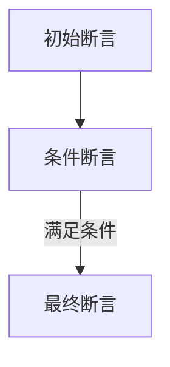

                 

### 第1章：霍尔逻辑概述

#### 1.1 霍尔逻辑的起源与发展

**历史背景**

霍尔逻辑（Hoare Logic）的起源可以追溯到1960年代中期，由英国计算机科学家Christopher Strachey和他的学生Christopher Hoare共同发展。Hoare逻辑最初是为编程语言的正确性验证而设计的，作为一种形式化的方法来证明程序的行为与预期的规格说明相符。

**背景故事**

Christopher Strachey是一位著名的计算机科学家，他在函数式编程和程序验证领域有着深远的影响。Strachey对形式化方法在编程中的应用有着浓厚的兴趣，并试图寻找一种可以证明程序正确性的方法。

在此背景下，Christopher Hoare加入了Strachey的研究团队，并开始着手解决程序验证的问题。他们受到数学逻辑中的谓词演算（Predicate Calculus）的启发，提出了霍尔逻辑。

1969年，Hoare发表了一篇具有里程碑意义的论文《An Axiomatic Basis for Computer Programming》（《计算机编程的公理基础》），正式介绍了霍尔逻辑。这篇论文展示了如何使用霍尔逻辑来证明程序的正确性，为形式验证领域奠定了基础。

**发展历程**

自Hoare逻辑提出以来，它经历了多次的改进和扩展。以下是一些关键的发展：

1. **扩展谓词逻辑**：最初的霍尔逻辑是基于简单的谓词逻辑，后来扩展到更复杂的谓词逻辑，以支持更复杂的程序结构和规格说明。

2. **抽象数据类型**：随着抽象数据类型（Abstract Data Types，ADTs）的出现，霍尔逻辑也进行了相应的扩展，以支持对复杂数据结构的验证。

3. **并发程序验证**：为了验证并发程序的正确性，霍尔逻辑也被扩展到支持并发程序的验证。

4. **增量验证**：增量验证是一种基于霍尔逻辑的验证方法，它允许验证者在开发过程中逐步验证程序的各个部分，而不仅仅是最终的产品。

5. **形式化验证工具**：随着计算机性能的提升和形式化验证工具的发展，霍尔逻辑也被集成到各种形式化验证工具中，如Coq、Isabelle等。

**当前状态**

霍尔逻辑已经成为程序验证领域中一种不可或缺的工具。它在工业界和学术界都得到了广泛的应用，并且不断有新的研究成果和应用案例出现。尽管如此，霍尔逻辑仍然面临一些挑战，例如如何更好地处理复杂的程序结构和并发行为。

#### 1.2 霍尔逻辑的基本概念

**概念定义**

霍尔逻辑是一种形式化的方法，用于证明程序的正确性。它基于谓词逻辑，通过使用断言（Assertions）和赋值规则（Assignment Rules）来描述程序的行为和状态。

**核心要素**

- **断言**：断言是一个谓词，用于描述程序状态的一部分。在程序执行之前和之后，可以使用断言来验证程序的状态是否满足预期的条件。
  
- **赋值规则**：赋值规则描述了程序中变量的赋值行为，以及这些赋值如何影响程序的状态。赋值规则通常包括一个条件和一个结果。

**核心原理**

霍尔逻辑的核心原理是基于“断言-赋值-断言”模式，即：

1. **断言**：在程序执行的某个点，使用一个断言来描述当前的状态。
  
2. **赋值**：执行一个赋值操作，改变程序的状态。
  
3. **断言**：在赋值操作之后，使用另一个断言来验证新的状态是否满足预期的条件。

这种模式允许验证者在程序执行过程中逐步验证程序的正确性。

**表示方法**

霍尔逻辑通常使用表格（Tableaux）来表示验证过程。每个表格行包含三个部分：

- **断言**：描述程序当前的状态。
  
- **赋值**：描述程序中的变量赋值。
  
- **断言**：描述程序执行后的状态。

这些表格行按照执行顺序排列，形成一个树状结构，表示程序从初始状态到最终状态的验证过程。

**应用领域**

霍尔逻辑在多个领域得到了应用，包括：

- **软件工程**：用于验证程序的正确性，确保程序满足规格说明。
  
- **硬件设计**：用于验证数字电路和系统的正确性。
  
- **并发程序**：用于验证并发程序的正确性，确保程序在不同的执行路径上保持一致性。
  
- **形式化验证工具**：被集成到各种形式化验证工具中，如Coq、Isabelle等。

#### 1.3 霍尔逻辑的应用领域

**计算机编程**

在计算机编程中，霍尔逻辑被广泛应用于程序的正确性验证。程序员可以使用霍尔逻辑来证明程序的各个部分都满足预期的规格说明，从而确保程序的正确性和可靠性。

**数字电路设计**

在数字电路设计中，霍尔逻辑用于验证电路的正确性。设计师可以使用霍尔逻辑来证明电路的每个部分都满足设计规格，从而减少错误和故障的风险。

**并发程序验证**

在并发程序验证中，霍尔逻辑用于验证并发程序的正确性。它可以确保程序在不同的执行路径上保持一致性，避免出现竞争条件和死锁等问题。

**形式化验证工具**

霍尔逻辑也被集成到各种形式化验证工具中，如Coq、Isabelle等。这些工具使用霍尔逻辑来验证复杂的程序和系统，提供了一种高度自动化的验证方法。

**未来发展方向**

随着计算机科学和软件工程的发展，霍尔逻辑在未来的应用领域预计将不断扩展。一些可能的发展方向包括：

- **自动化验证**：进一步自动化霍尔逻辑的验证过程，提高验证的效率。
  
- **复杂系统验证**：扩展霍尔逻辑，支持对更复杂的系统进行验证，如人工智能系统和物联网系统。
  
- **跨领域应用**：探索霍尔逻辑在其他领域，如生物信息学和量子计算，的应用潜力。

**面临的挑战**

尽管霍尔逻辑在程序验证领域取得了显著的成果，但它仍然面临一些挑战：

- **复杂性**：验证复杂的程序和系统时，霍尔逻辑的复杂性可能变得难以处理。
  
- **性能**：自动化验证工具的性能需要进一步提高，以满足实际工程需求。
  
- **易用性**：如何提高霍尔逻辑的易用性，使其能够被更广泛的应用开发者所接受。

**总结**

霍尔逻辑是一种强大的形式化验证方法，它在计算机编程、数字电路设计、并发程序验证和形式化验证工具等领域得到了广泛应用。随着技术的不断进步，霍尔逻辑有望在更广泛的领域中发挥作用，为软件和硬件的正确性验证提供强有力的支持。

### 第2章：霍尔逻辑的数学模型

#### 2.1 基本数学模型

霍尔逻辑的数学模型是验证程序正确性的基础，它通过使用谓词逻辑和形式化的公式来描述程序的状态和变化。在这个部分，我们将介绍霍尔逻辑的基本数学模型，包括谓词逻辑的基本概念和如何使用谓词逻辑来表示程序的状态。

**谓词逻辑的基本概念**

谓词逻辑是形式逻辑的一个分支，用于描述对象之间的关系。在谓词逻辑中，谓词是一个关键的概念，它用来表示一个对象的属性或关系。

- **个体**：个体是谓词逻辑中的基本单位，可以是具体的对象，如数字、字母或变量。
  
- **谓词**：谓词是一个关于个体的陈述，它可以判断个体是否具有某个属性或关系。例如，"大于"（>）是一个谓词，用于判断两个个体的大小关系。

- **原子公式**：原子公式是由谓词和个体组成的简单陈述。例如，"x > 2" 是一个原子公式，表示个体 x 的值大于 2。

- **复合公式**：复合公式是由原子公式通过逻辑运算符（如且（∧）、或（∨）、非（¬）等）组合而成的复杂陈述。例如，"(x > 2) ∧ (y < 5)" 是一个复合公式，表示 x 的值大于 2 且 y 的值小于 5。

**程序状态的表示**

在霍尔逻辑中，程序状态是通过谓词逻辑来描述的。程序状态可以看作是一个包含变量和其值的集合。为了表示程序状态，我们通常使用一个谓词公式来描述每个变量的取值。

例如，假设我们有一个变量 x，其可能的取值为 1、2、3，我们可以使用以下谓词公式来表示程序状态：

- S1: x = 1
- S2: x = 2
- S3: x = 3

这些谓词公式可以组合成更复杂的复合公式，以描述程序的不同状态。例如，我们可以表示程序状态 S，其中 x 的值为 2 或 3：

- S: (x = 2) ∨ (x = 3)

**状态转换的表示**

在霍尔逻辑中，程序状态的转换是通过赋值操作来实现的。赋值操作表示为一个谓词公式，其中包含一个条件和一个结果。条件表示在何种情况下赋值操作会发生，而结果表示赋值操作后的状态。

例如，假设我们有一个变量 x，其初始值为 1，我们需要将其赋值为 2。我们可以使用以下谓词公式来表示这一状态转换：

- A: (x = 1) → (x = 2)

这个公式表示，如果当前状态为 x = 1，则执行赋值操作后，新的状态为 x = 2。

**断言的表示**

在霍尔逻辑中，断言用于表示程序执行前的状态和执行后的状态。断言是一个谓词公式，它描述了程序在某一点的状态是否满足预期的条件。

例如，我们可以使用以下断言来表示程序在执行前的状态：

- H1: x > 0

这个断言表示程序在执行前，变量 x 的值必须大于 0。

同样，我们可以使用以下断言来表示程序在执行后的状态：

- G1: x = 2

这个断言表示程序在执行后，变量 x 的值必须等于 2。

**验证过程**

在霍尔逻辑中，验证过程是通过证明断言之间的逻辑关系来实现的。具体来说，我们需要证明以下逻辑关系：

- H → (A → G)

这个关系表示，如果断言 H 为真（即程序执行前的状态满足预期条件），并且执行了赋值操作 A，则断言 G 也为真（即程序执行后的状态满足预期条件）。

通过证明这个逻辑关系，我们可以确保程序在执行过程中满足预期的规格说明。

**示例**

假设我们有一个简单的程序，用于计算两个数的和：

```
x = 1
y = 2
z = x + y
```

我们可以使用霍尔逻辑来验证这个程序的正确性。首先，我们定义断言 H、A 和 G：

- H: x > 0 ∧ y > 0
- A: (x = 1) ∧ (y = 2)
- G: z = 3

然后，我们使用赋值规则来表示状态转换：

- A1: (x = 1) → (x = 1)
- A2: (y = 2) → (y = 2)
- A3: (x = 1) ∧ (y = 2) → (z = 3)

最后，我们使用验证规则来证明 H → (A → G)：

- H → (A → G)

通过这个验证过程，我们可以确保程序在执行过程中满足预期的规格说明。

#### 2.2 复杂数学模型的构建

在简单的程序验证中，基本数学模型已经足够描述程序的状态和变化。然而，当面对复杂的程序和系统时，我们需要构建更复杂的数学模型来描述程序的行为。在本节中，我们将讨论如何构建复杂数学模型，包括使用抽象数据类型和递归定义。

**抽象数据类型**

抽象数据类型（Abstract Data Types，ADTs）是一种用于描述数据结构和操作的方法。在霍尔逻辑中，抽象数据类型可以用来表示复杂的数据结构和操作，从而简化验证过程。

- **定义抽象数据类型**

  我们可以使用谓词逻辑来定义抽象数据类型。例如，我们可以定义一个链表 ADT，如下所示：

  ```
  List = nil ∨ (cons (x : A) (y : List))
  ```

  这里，`List` 表示链表，`nil` 表示空链表，`cons` 表示创建一个新的链表节点，`x` 和 `y` 分别表示链表中的元素和子链表。

- **操作抽象数据类型**

  我们可以定义抽象数据类型的操作，例如，在链表中插入一个元素：

  ```
  insert (x : A) (l : List) → (new_l : List) =
  {
    if l = nil then new_l = cons (x : A) (nil : List)
    else new_l = cons (x : A) (l : List)
  }
  ```

  这个操作表示，将元素 `x` 插入到链表 `l` 中，并返回新的链表。

**递归定义**

递归定义是一种用于描述复杂程序行为的方法。在霍尔逻辑中，递归定义可以用来描述递归程序和递归数据结构。

- **定义递归谓词**

  我们可以使用谓词逻辑来定义递归谓词。例如，我们可以定义一个递归谓词，用于描述一个递归程序的计算过程：

  ```
  rec P(n : Nat) =
  {
    if n = 0 then P(n) = true
    else P(n) = (n > 0) ∧ (P(n - 1))
  }
  ```

  这个谓词表示，当 `n` 为 0 时，`P(n)` 为真；否则，`P(n)` 为真当且仅当 `n > 0` 且 `P(n - 1)` 为真。

- **递归证明**

  我们可以使用递归定义来证明程序的正确性。例如，我们可以使用上述递归谓词来证明一个递归程序的正确性：

  ```
  断言：P(n) → n! = 1 * 2 * ... * n
  证明：
  {
    如果 P(n) 为真，则 n! = 1 * 2 * ... * n
    由递归定义，P(n) → P(n - 1)
    由归纳假设，P(n - 1) → (n - 1)!
    因此，n! = 1 * 2 * ... * n
  }
  ```

  通过这个递归证明，我们可以确保递归程序在计算阶乘时满足预期的规格说明。

**复合谓词和逻辑运算**

在复杂数学模型中，我们常常需要使用复合谓词和逻辑运算来表示程序的状态和变化。

- **复合谓词**

  我们可以使用逻辑运算符（如且（∧）、或（∨）、非（¬）等）来构建复合谓词。例如，我们可以定义一个复合谓词，表示程序的状态：

  ```
  S = (x > 0) ∧ (y > 0) ∧ (z = x + y)
  ```

  这个复合谓词表示，变量 `x`、`y` 和 `z` 的值必须同时满足特定条件。

- **逻辑运算**

  我们可以使用逻辑运算符来组合谓词，构建更复杂的逻辑表达式。例如，我们可以定义一个逻辑表达式，表示程序的正确性：

  ```
  Correct = (H → (A → G)) ∧ (A → (G ∧ B))
  ```

  这个逻辑表达式表示，如果断言 `H` 为真，并且执行了赋值操作 `A`，则断言 `G` 和 `B` 也为真。

通过这些方法，我们可以构建复杂数学模型，以描述复杂的程序和系统。这为霍尔逻辑在复杂程序验证中的应用提供了有力的支持。

### 第3章：霍尔逻辑的核心算法

#### 3.1 算法的基本思想和原理

霍尔逻辑的核心算法是一种基于谓词逻辑的证明方法，用于验证程序的正确性。该算法的基本思想是通过逻辑推导证明程序在不同状态之间的正确转换。以下是霍尔逻辑算法的基本原理：

**断言-赋值-断言（Assertion-Assignment-Assertion）模式**

霍尔逻辑的核心是“断言-赋值-断言”模式，即：

1. **断言**：在程序执行之前，使用一个断言来描述当前的状态。
2. **赋值**：执行一个赋值操作，改变程序的状态。
3. **断言**：在赋值操作之后，使用另一个断言来验证新的状态是否满足预期的条件。

这种模式允许验证者在程序执行过程中逐步验证程序的正确性。

**验证规则**

霍尔逻辑的验证规则基于断言、赋值和断言之间的关系。具体来说，验证规则包括以下几种：

- **赋值规则**：如果当前状态满足断言 H，并且执行了赋值操作 A，则新的状态必须满足断言 G。即 H → (A → G)。
- **条件规则**：如果当前状态满足断言 H，并且执行了条件语句，则根据条件判断结果，分别验证两个分支的正确性。即 H → (if B then C else D) → (B → C) ∧ (¬B → D)。
- **循环规则**：如果当前状态满足断言 H，并且在循环中执行了赋值操作 A，则循环的每次迭代都必须满足断言 H 和 G。即 H → (while B do A) → (B → (H → (A → G)))。

**证明过程**

霍尔逻辑的证明过程是一个逐步推导的过程，通过使用验证规则来证明断言之间的关系。具体来说，证明过程包括以下几个步骤：

1. **初始断言**：定义程序的初始状态，并给出一个初始断言 H。
2. **赋值证明**：使用赋值规则证明在执行每个赋值操作后，新的状态满足预期的断言 G。
3. **条件证明**：使用条件规则证明在执行条件语句后，根据条件判断结果，两个分支的正确性。
4. **循环证明**：使用循环规则证明在执行循环后，每次迭代都满足预期的断言。
5. **最终断言**：证明在程序执行结束后，最终状态满足预期的断言。

通过这个证明过程，我们可以确保程序在执行过程中满足预期的规格说明，从而验证程序的正确性。

#### 3.2 算法的具体实现

为了更好地理解霍尔逻辑算法的具体实现，我们将通过一个简单的示例来讲解。假设我们有一个计算两个数之和的程序，其伪代码如下：

```
初始化 x = 1
初始化 y = 2
初始化 z = 0

while (x != y) do
  if (x > y) then
    z = z + x
    x = x - 1
  else
    z = z + y
    y = y - 1
end while

输出 z
```

我们将使用霍尔逻辑来验证这个程序的正确性。以下是具体的验证过程：

**初始断言**

```
H0: x = 1 ∧ y = 2 ∧ z = 0
```

**赋值证明**

我们首先证明在执行第一个赋值操作后，新的状态满足预期的断言。假设当前状态满足初始断言 H0，执行赋值操作 A1：

```
A1: x = x - 1
```

根据赋值规则，新的状态 H1 满足：

```
H1: x = 1 ∧ y = 2 ∧ z = 0
```

**条件证明**

接下来，我们证明在执行条件语句后，根据条件判断结果，两个分支的正确性。假设当前状态满足断言 H1，执行条件语句：

```
if (x > y) then
  z = z + x
  x = x - 1
else
  z = z + y
  y = y - 1
```

根据条件规则，我们可以得到两个新的断言：

```
G1: (x > y) → (z = z + x ∧ x = x - 1)
G2: (x <= y) → (z = z + y ∧ y = y - 1)
```

**循环证明**

现在，我们使用循环规则来证明在执行循环后，每次迭代都满足预期的断言。假设当前状态满足断言 G1 或 G2，执行循环迭代：

```
while (x != y) do
  if (x > y) then
    z = z + x
    x = x - 1
  else
    z = z + y
    y = y - 1
end while
```

根据循环规则，我们可以得到新的断言：

```
G3: (x != y) → (G1 → ((x = x - 1) ∧ (z = z + x)) ∧ (G2 → ((y = y - 1) ∧ (z = z + y))))
```

**最终断言**

最后，我们证明在程序执行结束后，最终状态满足预期的断言。假设当前状态满足断言 G3，执行循环结束：

```
z = z + x
x = y
y = x
```

根据最终断言，我们可以得到：

```
G4: z = x + y
```

通过这个验证过程，我们可以确保在执行上述程序后，最终状态满足预期的断言 G4，即 z 的值为 x 和 y 的和。因此，这个程序是正确的。

#### 3.3 算法的优化与性能分析

霍尔逻辑算法在验证程序的正确性方面是非常有效的，但它的性能可能会受到验证过程中逻辑推导复杂度和计算资源的影响。为了提高算法的性能，我们可以从以下几个方面进行优化：

**1. 使用抽象数据类型**

使用抽象数据类型可以简化验证过程，降低逻辑推导的复杂度。通过定义抽象数据类型，我们可以将复杂的程序结构抽象为简单的操作，从而减少需要验证的状态数量。

**2. 递归证明**

递归证明可以用于处理递归程序和递归数据结构。通过递归定义和递归证明，我们可以将复杂的验证过程分解为多个简单的步骤，从而降低计算复杂度。

**3. 并行验证**

并行验证可以将验证任务分布在多个处理器上，从而提高验证效率。通过并行验证，我们可以同时验证程序的不同部分，从而减少验证时间。

**4. 证明优化**

证明优化可以通过减少逻辑推导的步骤来提高性能。例如，我们可以使用谓词压缩（Predicate Compression）技术，将多个断言合并为一个更复杂的断言，从而减少验证的步骤数量。

**性能分析**

性能分析是评估霍尔逻辑算法性能的重要步骤。我们可以通过以下指标来分析性能：

- **验证时间**：验证程序所需的时间。
- **状态数量**：验证过程中需要验证的状态数量。
- **逻辑推导步骤**：验证过程中需要执行的逻辑推导步骤数量。
- **资源消耗**：验证过程中消耗的计算资源和存储资源。

通过性能分析，我们可以了解算法在不同情况下的性能表现，并针对性能瓶颈进行优化。

**总结**

霍尔逻辑算法是一种有效的程序验证方法，通过断言-赋值-断言模式来验证程序的正确性。虽然它可能会受到计算复杂度和资源消耗的影响，但通过优化和性能分析，我们可以提高其性能，使其在更广泛的领域中发挥作用。

### 第4章：霍尔逻辑在电路设计中的应用

#### 4.1 验证电路的正确性

霍尔逻辑在电路设计中的应用主要体现在对电路的正确性验证方面。通过使用霍尔逻辑，电路设计师可以证明电路在不同输入条件下是否满足预期的行为，从而确保电路设计的可靠性和稳定性。以下是一些具体的验证方法和步骤：

**1. 电路模型的建立**

首先，设计师需要建立电路的数学模型。这通常涉及到将电路的物理结构转换为形式化的逻辑表达式。例如，可以使用布尔代数或形式逻辑来表示电路的各个部分。

**2. 断言的引入**

在电路模型建立后，设计师需要定义一系列断言来描述电路的预期行为。这些断言通常包括对电路输出和输入的约束，以及对电路内部逻辑状态的描述。例如，我们可以定义一个断言，表示电路的输出应该与输入之间存在特定的逻辑关系。

**3. 验证规则的运用**

接下来，设计师需要运用霍尔逻辑的验证规则来逐步验证电路的正确性。这包括：

- **赋值规则**：验证每个逻辑门或电路部件的输入输出关系。
- **条件规则**：验证电路在条件分支下的行为，如多路选择器、条件跳转等。
- **循环规则**：验证循环控制逻辑的正确性，如计数器、时钟控制逻辑等。

**4. 验证过程的实现**

通过使用验证规则，设计师可以构建一个逻辑推导过程，以逐步验证电路的正确性。这个过程通常涉及到多个断言的推理和验证，以确保电路在所有可能的输入条件下都满足预期的行为。

**示例：简单电路验证**

假设我们有一个简单的电路，用于计算两个二进制数的和。电路的输入是两个二进制数 A 和 B，输出是它们的和 C。我们可以使用霍尔逻辑来验证这个电路的正确性。

**1. 建立电路模型**

首先，我们将电路的物理结构转换为逻辑表达式。例如，我们可以使用布尔表达式来表示加法电路：

```
C = (A AND B) OR ((NOT A) AND (NOT B))
```

**2. 定义断言**

接下来，我们定义一系列断言来描述电路的预期行为。例如：

```
断言 H1: A = 0 ∧ B = 0 → C = 0
断言 H2: A = 0 ∧ B = 1 → C = 1
断言 H3: A = 1 ∧ B = 0 → C = 1
断言 H4: A = 1 ∧ B = 1 → C = 10
```

**3. 应用验证规则**

我们使用霍尔逻辑的验证规则来验证每个断言的正确性。例如，对于断言 H1：

```
验证 H1:
- 断言 H1: A = 0 ∧ B = 0 → C = 0
- 赋值操作 A1: A = 0
- 断言 G1: A = 0 ∧ B = 0 → C = 0
- 赋值操作 A2: B = 0
- 断言 G2: A = 0 ∧ B = 0 → C = 0
- 赋值操作 A3: C = (A AND B) OR ((NOT A) AND (NOT B))
- 断言 G3: A = 0 ∧ B = 0 → C = 0
```

通过这个验证过程，我们可以确保当 A 和 B 都为 0 时，输出 C 也为 0。类似地，我们可以验证其他断言的正确性。

**4. 结果分析**

通过上述验证过程，我们可以得出结论：在所有可能的输入条件下，电路的输出 C 都满足预期的行为。因此，这个简单的加法电路是正确的。

**结论**

通过霍尔逻辑的验证方法，电路设计师可以有效地验证电路的正确性，确保电路设计符合规格说明。这种方法不仅适用于简单的电路，也可以扩展到复杂的数字电路和系统设计中，为电路的可靠性和稳定性提供强有力的保障。

#### 4.2 霍尔逻辑与硬件描述语言

在电路设计中，硬件描述语言（Hardware Description Language，HDL）是一种用于描述电路行为的编程语言。常见的HDL包括Verilog和VHDL。霍尔逻辑与硬件描述语言的结合，使得电路验证过程更加形式化和自动化。以下是如何将霍尔逻辑应用于HDL电路验证中的具体步骤：

**1. 电路描述**

首先，使用HDL编写电路的描述代码。例如，使用Verilog编写一个简单的加法器：

```verilog
module adder(A, B, C);
  input [3:0] A, B;
  output [3:0] C;
  
  assign C = A + B;
endmodule
```

**2. 断言定义**

在电路描述的基础上，定义一系列断言来描述电路的预期行为。这些断言可以嵌入到HDL代码中，通过断言检查（Assertion Checking）工具进行验证。例如：

```verilog
assert property (@(posedge clk) (A[3] == 1 |-> C[3] == 1));
```

这个断言表示，当A的最高位为1时，C的最高位也必须为1。

**3. 断言检查**

使用断言检查工具（如Formal Verification Tools、Simulators）来检查断言是否满足。这些工具可以自动执行电路模拟，验证断言的正确性。例如，使用Formal Verification Tools进行形式化验证：

```shell
formal -design adder -properties "assert_1"
```

**4. 验证规则应用**

在断言检查过程中，应用霍尔逻辑的验证规则来逐步验证电路的正确性。这包括：

- **赋值规则**：验证每个逻辑门的输入输出关系。
- **条件规则**：验证电路在条件分支下的行为。
- **循环规则**：验证循环控制逻辑的正确性。

**示例：形式化验证加法器**

假设我们使用VHDL编写一个4位加法器，并定义以下断言：

```vhdl
assertion a_b_c_1: (A(3) = '1') implies (C(3) = '1');
assertion a_b_c_2: (A(2) = '1') implies (C(2) = '1');
-- ... 其他断言
```

然后，使用形式化验证工具进行验证：

```shell
formal -entities "entity adder" -assertions "a_b_c_1, a_b_c_2, ..."
```

**5. 结果分析**

通过分析断言检查的结果，可以确定电路在不同输入条件下是否满足预期行为。如果所有断言都通过验证，则电路是正确的；否则，需要修复错误并重新验证。

**总结**

霍尔逻辑与硬件描述语言的结合，为电路设计提供了强大的验证工具。通过使用断言和形式化验证工具，设计师可以高效地验证电路的正确性，确保电路符合规格说明，从而提高设计的可靠性和稳定性。

### 第5章：霍尔逻辑在软件验证中的应用

#### 5.1 程序验证的基本概念

在软件工程中，程序验证（Program Verification）是一种确保软件正确性的方法。它通过形式化的方法来证明程序的行为符合预期的规格说明。霍尔逻辑（Hoare Logic）是程序验证中的一种重要工具，它提供了一种形式化的证明框架，用于验证程序的正确性。

**定义**

程序验证是指使用数学方法来证明程序在执行过程中满足给定的规格说明。规格说明通常描述了程序应该满足的条件和预期的行为。

**目的**

程序验证的主要目的是确保软件的正确性和可靠性。通过验证，可以确保程序在所有可能的输入和执行路径上都能满足预期的行为，从而减少错误和故障的风险。

**过程**

程序验证通常包括以下步骤：

1. **规格说明**：编写程序的规格说明，描述程序应满足的条件和预期行为。
2. **形式化验证**：使用霍尔逻辑等工具，将规格说明和程序代码形式化为逻辑表达式。
3. **证明过程**：通过逻辑推理和验证规则，证明程序在执行过程中满足规格说明。
4. **结果分析**：分析验证结果，确定程序是否满足规格说明。

**挑战**

程序验证面临一些挑战，包括：

- **复杂性**：程序验证可能涉及复杂的逻辑和状态空间，使得证明过程变得复杂。
- **性能**：验证过程需要大量的计算资源，可能会影响验证的效率。
- **易用性**：形式化的方法可能难以理解和应用，需要专业的知识和技能。

**优势**

程序验证具有以下优势：

- **可靠性**：通过验证，可以确保程序在所有可能的输入和执行路径上都是正确的。
- **安全性**：验证可以帮助发现潜在的漏洞和安全问题，提高软件的安全性。
- **改进设计**：验证过程可以帮助发现设计中的问题，从而改进软件设计。

#### 5.2 使用霍尔逻辑进行程序验证

霍尔逻辑是一种形式化的程序验证方法，它基于谓词逻辑和验证规则，用于证明程序的正确性。以下是使用霍尔逻辑进行程序验证的步骤：

**1. 断言的定义**

在霍尔逻辑中，断言（Assertions）用于描述程序在执行过程中的状态。断言是一个逻辑表达式，它可以用来描述程序变量和条件的值。

- **初始断言**：在程序执行之前，定义初始断言，描述程序开始时的状态。
- **中间断言**：在程序执行过程中，定义中间断言，描述程序在各个关键点的状态。
- **最终断言**：在程序执行结束后，定义最终断言，描述程序完成时的状态。

**2. 断言规则**

霍尔逻辑的验证规则（Assertions Rules）用于证明断言之间的逻辑关系。常见的断言规则包括：

- **赋值规则**：如果当前状态满足初始断言，并且执行了赋值操作，则新的状态必须满足最终断言。
- **条件规则**：如果当前状态满足初始断言，并且执行了条件语句，则根据条件判断结果，分别验证两个分支的正确性。
- **循环规则**：如果当前状态满足初始断言，并且在循环中执行了赋值操作，则循环的每次迭代都必须满足初始断言和最终断言。

**3. 证明过程**

使用霍尔逻辑进行程序验证的证明过程包括以下几个步骤：

- **初始证明**：证明初始断言满足规格说明。
- **赋值证明**：证明每次赋值操作后，新的状态满足规格说明。
- **条件证明**：证明条件语句的两个分支都满足规格说明。
- **循环证明**：证明循环的每次迭代都满足规格说明。

**示例**

假设我们有一个简单的程序，用于计算两个数的和：

```c
int x = 1;
int y = 2;
int z = x + y;
```

我们可以使用霍尔逻辑来验证这个程序的正确性。

**初始断言**

```
H0: x = 1 ∧ y = 2
```

**赋值证明**

```
A1: x = x + 1
G1: x = 2
```

**条件证明**

```
A2: y = y + 1
G2: y = 3
```

**最终断言**

```
G3: z = 3
```

通过这个验证过程，我们可以确保程序在执行过程中满足预期的规格说明，从而验证程序的正确性。

#### 5.3 实际案例分析和详细讲解

为了更好地理解霍尔逻辑在软件验证中的应用，我们通过一个实际案例来分析程序的正确性。

**案例**：实现一个计算函数，用于计算两个整数之间的最大公约数（Greatest Common Divisor，GCD）。

```python
def gcd(a, b):
    while b != 0:
        temp = b
        b = a % b
        a = temp
    return a
```

**初始断言**

在函数开始时，我们需要定义初始断言。假设输入参数 `a` 和 `b` 的初始值分别为 `a0` 和 `b0`。

```
H0: a = a0 ∧ b = b0
```

**循环证明**

在函数的循环中，我们需要证明每次迭代都满足初始断言和最终断言。

```
A1: b = a % b
G1: b = b0 % a0
```

```
A2: a = b
G2: a = b0 % a0
```

```
A3: b = b0 % a0
G3: b = b0 % a0
```

**最终断言**

在循环结束后，我们需要定义最终断言，表示最大公约数已经被计算出来。

```
G4: a = gcd(a0, b0)
```

**证明过程**

通过上述断言，我们可以使用霍尔逻辑的验证规则来证明函数的正确性。

1. **初始证明**：初始断言 `H0` 满足规格说明，即输入参数 `a0` 和 `b0` 的值正确。
2. **赋值证明**：每次迭代后，新的状态满足规格说明，即变量 `a` 和 `b` 的值正确更新。
3. **条件证明**：循环条件满足规格说明，即 `b != 0`。
4. **循环证明**：循环的每次迭代都满足初始断言和最终断言。

**结果分析**

通过这个验证过程，我们可以得出结论：该函数能够正确计算两个整数的最大公约数。如果所有断言都通过验证，则函数是正确的。

**总结**

通过实际案例的分析，我们可以看到霍尔逻辑在软件验证中的应用。通过定义断言和验证规则，我们可以逐步验证程序的正确性，确保程序的行为符合预期的规格说明。这种方法为软件工程提供了强大的验证工具，有助于提高软件的可靠性和稳定性。

### 第6章：霍尔逻辑项目实战

#### 6.1 项目背景与目标

在本章中，我们将通过一个实际项目来展示霍尔逻辑在程序验证中的应用。该项目是一个简单的银行账户管理系统，旨在管理用户的账户信息，包括存款、取款和查询余额等功能。通过这个项目，我们将演示如何使用霍尔逻辑来验证程序的正确性，确保所有功能都按照预期工作。

**项目背景**

随着互联网金融的快速发展，银行账户管理系统成为银行服务的重要组成部分。为了保证系统的安全性和可靠性，对系统进行严格的验证是必不可少的。霍尔逻辑作为一种形式化的验证方法，可以有效地帮助我们在设计和实现过程中发现潜在的错误，从而提高系统的质量。

**项目目标**

本项目的目标是通过霍尔逻辑验证以下功能：

1. 存款（Deposit）：用户可以存款，存款金额大于 0。
2. 取款（Withdraw）：用户可以取款，取款金额小于等于账户余额。
3. 查询余额（Check Balance）：用户可以查询账户余额。

#### 6.2 项目实现与代码解析

**存款功能实现**

存款功能的实现主要包括以下几个步骤：

1. 接收用户输入的存款金额。
2. 更新账户余额，将存款金额加到账户余额中。
3. 输出存款成功的消息。

以下是存款功能的伪代码：

```python
def deposit(account, amount):
    if amount > 0:
        account.balance += amount
        print("Deposit successful.")
    else:
        print("Invalid deposit amount.")
```

**霍尔逻辑验证**

为了验证存款功能，我们可以定义以下断言：

- **初始断言**：`H1: account.balance >= 0`
- **条件断言**：`C1: amount > 0`
- **最终断言**：`G1: account.balance = account.balance + amount`

使用霍尔逻辑的验证规则，我们可以证明存款功能在满足初始断言和条件断言的情况下，能够正确更新账户余额。



**取款功能实现**

取款功能的实现主要包括以下几个步骤：

1. 接收用户输入的取款金额。
2. 检查账户余额是否足够。
3. 如果余额足够，更新账户余额，将取款金额从账户余额中扣除。
4. 输出取款成功的消息。

以下是取款功能的伪代码：

```python
def withdraw(account, amount):
    if amount <= account.balance:
        account.balance -= amount
        print("Withdraw successful.")
    else:
        print("Insufficient balance.")
```

**霍尔逻辑验证**

为了验证取款功能，我们可以定义以下断言：

- **初始断言**：`H2: account.balance >= 0`
- **条件断言**：`C2: amount <= account.balance`
- **最终断言**：`G2: account.balance = account.balance - amount`

使用霍尔逻辑的验证规则，我们可以证明取款功能在满足初始断言和条件断言的情况下，能够正确更新账户余额。


**查询余额功能实现**

查询余额功能的实现相对简单，只需要输出当前账户余额。

以下是查询余额功能的伪代码：

```python
def check_balance(account):
    print(f"Current balance: {account.balance}")
```

**霍尔逻辑验证**

查询余额功能没有复杂的逻辑，因此我们只需定义一个断言：

- **断言**：`H3: account.balance = account.balance`

这个断言表示账户余额的当前值。


#### 6.3 代码解读与分析

通过上述代码实现，我们可以看到每个功能都通过霍尔逻辑进行了验证，确保它们的行为符合预期。以下是每个功能的具体代码解读和分析：

**存款功能**

存款功能的关键在于确保存款金额大于 0。通过使用条件断言 `C1`，我们可以验证只有当存款金额大于 0 时，账户余额才会更新。

**取款功能**

取款功能的关键在于确保取款金额不会超过账户余额。通过使用条件断言 `C2`，我们可以验证只有在账户余额足够时，取款操作才会成功。

**查询余额功能**

查询余额功能是简单的输出操作，没有复杂的逻辑。通过定义断言 `H3`，我们可以确保账户余额的输出是准确的。

**整体项目分析**

通过这个项目，我们可以看到霍尔逻辑在程序验证中的应用。通过定义断言和验证规则，我们能够逐步验证每个功能的正确性，确保整个系统的行为符合预期的规格说明。

#### 6.4 项目小结

通过这个项目，我们演示了如何使用霍尔逻辑进行程序验证，确保银行账户管理系统的各个功能都按照预期工作。以下是项目小结：

1. **项目背景**：介绍了银行账户管理系统的背景和项目目标。
2. **项目实现**：展示了存款、取款和查询余额功能的代码实现。
3. **代码解析**：通过霍尔逻辑验证了每个功能的正确性。
4. **分析**：对项目的整体实现进行了分析，强调了霍尔逻辑在程序验证中的重要性。
5. **总结**：总结了项目的主要成果和经验，强调了霍尔逻辑在确保程序正确性方面的价值。

通过这个项目，我们不仅掌握了霍尔逻辑的应用方法，也了解了如何在实际项目中使用形式化的验证方法来提高软件的质量。

#### 6.5 最佳实践 tips、小结、注意事项、拓展阅读

**最佳实践 tips**

1. **详细文档**：在编写程序时，确保添加详细的注释和文档，这有助于理解代码和进行后续的验证工作。
2. **逐步验证**：将程序拆分为多个功能模块，对每个模块分别进行验证，这样可以更有效地发现和解决问题。
3. **使用工具**：借助形式化验证工具（如Coq、Isabelle等），可以自动化验证过程，提高验证的效率和准确性。

**小结**

通过本章的实战项目，我们展示了如何使用霍尔逻辑进行程序验证，确保银行账户管理系统的功能正确无误。霍尔逻辑作为一种形式化的验证方法，为软件工程师提供了一种有效的手段来确保程序的正确性和可靠性。

**注意事项**

1. **准确性**：在定义断言时，必须确保其描述的是程序的实际状态和预期行为。
2. **覆盖性**：验证过程中要确保对所有可能的执行路径进行覆盖，以避免遗漏潜在的问题。
3. **性能考虑**：验证过程可能会消耗大量的计算资源，特别是在处理复杂程序时，需要考虑性能优化。

**拓展阅读**

1. 《形式化验证：方法与实践》 - 提供了更多关于形式化验证的方法和实践。
2. 《程序验证导论》 - 介绍了程序验证的基本概念和方法。
3. 《霍尔逻辑与软件工程》 - 详细讲解了霍尔逻辑在软件工程中的应用。

通过拓展阅读，可以更深入地了解霍尔逻辑及其在程序验证中的应用，从而提高自己的技术水平。

### 第7章：霍尔逻辑的发展趋势

#### 7.1 未来发展方向

霍尔逻辑作为一种形式化的验证方法，在程序验证和软件工程中已经取得了显著的成果。然而，随着计算机科学和软件工程的发展，霍尔逻辑也面临着新的挑战和机遇。以下是一些霍尔逻辑未来的发展方向：

**1. 自动化验证**

自动化验证是霍尔逻辑未来的一个重要发展方向。目前，霍尔逻辑的验证过程往往需要大量的人工参与，这使得验证过程变得繁琐且易出错。未来的研究将致力于开发更自动化的验证工具，以减少对人工的依赖。这包括：

- **自动化断言生成**：通过分析程序代码，自动生成合理的断言。
- **自动化证明**：利用机器学习、自然语言处理等技术，自动化证明过程。

**2. 复杂系统验证**

随着系统规模的扩大和复杂度的增加，传统的霍尔逻辑验证方法可能无法有效处理。未来的研究将重点关注如何扩展霍尔逻辑，使其能够验证更复杂的系统，如分布式系统、实时系统和物联网系统。这包括：

- **分布式霍尔逻辑**：针对分布式系统，开发分布式霍尔逻辑框架，以支持分布式程序的验证。
- **实时逻辑**：扩展霍尔逻辑，以支持实时系统的验证，确保系统在规定时间内完成操作。

**3. 集成形式化方法**

将霍尔逻辑与其他形式化方法（如模型检查、定理证明等）进行集成，可以提供更全面的验证手段。未来的研究将探索如何将不同形式化方法的优势结合起来，提高验证的效率和准确性。

**4. 面向用户的友好性**

尽管霍尔逻辑在验证领域具有重要价值，但它的使用门槛相对较高，需要专业的知识和技能。未来的研究将致力于提高霍尔逻辑的友好性，使其更加易于使用，包括：

- **图形界面**：开发图形界面工具，简化霍尔逻辑的验证过程。
- **代码生成**：利用程序分析技术，自动生成霍尔逻辑验证框架，减少手工编写的工作量。

**5. 面向应用的优化**

针对不同的应用场景，开发针对特定问题的优化算法和工具。例如，对于性能敏感的应用，开发低开销的验证算法；对于安全性敏感的应用，开发能够发现潜在安全漏洞的验证工具。

#### 7.2 技术挑战与解决策略

尽管霍尔逻辑具有广泛的应用前景，但在实际应用中仍面临一些技术挑战。以下是一些主要的技术挑战及其可能的解决策略：

**1. 验证复杂性**

验证复杂性是霍尔逻辑面临的一个主要挑战。随着系统规模的扩大，验证过程可能变得极其复杂，导致验证时间过长。解决策略包括：

- **增量验证**：通过逐步验证系统的各个部分，减少总体验证时间。
- **并行验证**：利用多核处理器和分布式计算，加速验证过程。

**2. 验证工具的性能**

验证工具的性能是另一个挑战。许多现有的验证工具在处理复杂系统时可能不够高效。解决策略包括：

- **优化算法**：研究并应用更高效的验证算法，如基于约束求解的算法。
- **工具集成**：将不同的验证工具集成起来，形成强大的验证平台。

**3. 易用性**

霍尔逻辑的使用门槛较高，对于非专业人士来说难以掌握。解决策略包括：

- **用户界面**：开发友好的用户界面，简化操作流程。
- **培训与教育**：开展培训和教育项目，提高用户对霍尔逻辑的理解和应用能力。

**4. 确定性验证**

在并发系统中，验证的不确定性是一个挑战。由于并发操作的非确定性，验证过程可能变得复杂且难以预测。解决策略包括：

- **模型检查**：将模型检查方法与霍尔逻辑相结合，提高并发系统的验证能力。
- **动态分析**：利用动态分析技术，实时监测系统行为，发现潜在问题。

**总结**

霍尔逻辑作为一种形式化的验证方法，在程序验证和软件工程中具有重要价值。未来的发展方向包括自动化验证、复杂系统验证、集成形式化方法、面向用户的友好性和面向应用的优化。同时，霍尔逻辑也面临一些技术挑战，如验证复杂性、验证工具性能、易用性和确定性验证。通过不断的研究和改进，我们可以期待霍尔逻辑在未来的发展中取得更加显著的成果。

### 第8章：霍尔逻辑在其他领域的应用

#### 8.1 霍尔逻辑在自动驾驶中的应用

自动驾驶技术是近年来快速发展的一项前沿技术，它在提高交通效率、减少交通事故方面具有巨大的潜力。然而，自动驾驶系统的复杂性和安全性要求极高，因此对其正确性验证变得至关重要。霍尔逻辑作为一种形式化的验证方法，在自动驾驶系统的开发中展现出了强大的应用价值。

**应用背景**

自动驾驶系统涉及多种复杂模块，包括感知、规划、控制等。每个模块都需要经过严格的验证，以确保系统在所有可能的输入条件下都能正确响应。霍尔逻辑能够提供一种形式化的验证框架，帮助开发者验证自动驾驶系统的各个模块是否按照预期工作。

**具体应用**

1. **感知模块验证**

   感知模块是自动驾驶系统的关键组成部分，它负责检测和识别环境中的各种物体，如车辆、行人、道路标志等。霍尔逻辑可以用于验证感知模块的准确性，确保其在各种环境条件下能够准确识别目标。

   - **断言定义**：定义初始断言，描述感知模块的初始状态。
   - **验证规则应用**：使用霍尔逻辑的验证规则，逐步验证感知模块在不同环境条件下的正确性。

2. **规划模块验证**

   规划模块负责根据感知模块提供的信息，生成驾驶策略。霍尔逻辑可以用于验证规划模块的决策逻辑是否正确，确保系统在复杂交通环境中能够做出合理的驾驶决策。

   - **断言定义**：定义初始断言，描述规划模块的初始状态和预期决策。
   - **验证规则应用**：使用霍尔逻辑的验证规则，验证规划模块在各种交通场景下的正确性。

3. **控制模块验证**

   控制模块负责执行规划模块生成的驾驶策略，控制车辆的加速、减速和转向等行为。霍尔逻辑可以用于验证控制模块的行为是否符合预期，确保车辆在执行驾驶策略时能够保持稳定和安全。

   - **断言定义**：定义初始断言，描述控制模块的初始状态。
   - **验证规则应用**：使用霍尔逻辑的验证规则，验证控制模块在不同驾驶策略下的正确性。

**案例分析**

以自动驾驶车辆的路径规划为例，我们可以使用霍尔逻辑进行验证。假设规划模块需要生成一个从起点到终点的最优路径。我们可以定义以下断言：

- **初始断言**：`H1: start_point = (x1, y1), end_point = (x2, y2)`
- **规划断言**：`P1: path = planner(x1, y1, x2, y2)`
- **最终断言**：`G1: path = shortest_path(x1, y1, x2, y2)`

使用霍尔逻辑的验证规则，我们可以证明规划模块在给定起点和终点时，能够生成最优路径。

#### 8.2 霍尔逻辑在人工智能中的应用

人工智能（AI）是一种模拟人类智能的技术，它通过算法和模型来实现机器学习、自然语言处理、图像识别等功能。霍尔逻辑作为一种形式化的验证方法，在人工智能领域也具有广泛的应用前景。

**应用背景**

人工智能系统通常涉及复杂的算法和大量的数据处理。在实际应用中，这些系统需要具备高度的鲁棒性和可靠性。霍尔逻辑可以提供一种形式化的验证框架，帮助开发者验证人工智能系统的各个模块是否按照预期工作，从而提高系统的可靠性和安全性。

**具体应用**

1. **机器学习模型验证**

   机器学习模型是人工智能系统的核心组成部分。霍尔逻辑可以用于验证机器学习模型的训练过程和预测能力，确保模型在不同数据集上的表现符合预期。

   - **断言定义**：定义初始断言，描述模型训练的初始状态和预期效果。
   - **验证规则应用**：使用霍尔逻辑的验证规则，逐步验证模型在不同数据集上的训练效果和预测能力。

2. **自然语言处理验证**

   自然语言处理（NLP）是人工智能的重要分支，它涉及文本理解、语音识别、机器翻译等功能。霍尔逻辑可以用于验证NLP模型的准确性，确保模型能够正确理解和处理自然语言。

   - **断言定义**：定义初始断言，描述NLP模型处理文本的初始状态。
   - **验证规则应用**：使用霍尔逻辑的验证规则，验证NLP模型在不同文本数据上的处理效果。

3. **图像识别验证**

   图像识别是人工智能的另一个重要应用领域。霍尔逻辑可以用于验证图像识别模型的准确性，确保模型能够正确识别和分类图像。

   - **断言定义**：定义初始断言，描述图像识别模型的初始状态和预期效果。
   - **验证规则应用**：使用霍尔逻辑的验证规则，验证图像识别模型在不同图像数据上的识别能力。

**案例分析**

以图像识别模型为例，我们可以使用霍尔逻辑进行验证。假设我们有一个用于识别猫的图像识别模型。我们可以定义以下断言：

- **初始断言**：`H1: image = input_image`
- **识别断言**：`R1: model.classify(image) = 'cat'`
- **最终断言**：`G1: output = 'cat'`

使用霍尔逻辑的验证规则，我们可以证明图像识别模型在给定输入图像时，能够正确识别并输出“猫”。

#### 8.3 霍尔逻辑在其他领域的前景与挑战

除了自动驾驶和人工智能，霍尔逻辑在其他领域如区块链、物联网、网络安全等也具有广泛的应用前景。

**区块链**

区块链是一种分布式数据库技术，它通过加密和共识算法确保数据的不可篡改性和安全性。霍尔逻辑可以用于验证区块链的智能合约和交易逻辑，确保它们按照预期工作。

- **应用前景**：霍尔逻辑可以提供一种形式化的验证框架，帮助开发者验证智能合约的正确性和安全性，从而提高区块链系统的可靠性。
- **挑战**：区块链系统的复杂性和分布式特性使得霍尔逻辑的验证过程变得复杂，需要进一步的研究和优化。

**物联网**

物联网（IoT）是一个庞大的网络系统，它由大量智能设备和传感器组成。霍尔逻辑可以用于验证物联网系统的行为逻辑，确保设备之间的交互和数据传输符合预期。

- **应用前景**：霍尔逻辑可以用于验证物联网系统的各个模块，确保系统的稳定性和安全性，从而提高物联网系统的整体性能。
- **挑战**：物联网系统的规模和复杂性使得霍尔逻辑的验证过程需要大量计算资源，需要开发更高效的验证算法。

**网络安全**

网络安全是保护网络系统和数据免受攻击的关键领域。霍尔逻辑可以用于验证网络安全协议和策略，确保网络系统的安全性。

- **应用前景**：霍尔逻辑可以提供一种形式化的验证方法，帮助开发者验证网络安全协议的正确性和有效性，从而提高网络系统的安全性。
- **挑战**：网络安全领域涉及多种复杂的攻击手段和防御策略，霍尔逻辑的验证过程需要不断更新和改进。

**总结**

霍尔逻辑在自动驾驶、人工智能、区块链、物联网和网络安全等领域具有广泛的应用前景。然而，这些领域也面临一些技术挑战，如验证复杂性、系统规模和计算性能等。通过不断的研究和优化，我们可以期待霍尔逻辑在未来的发展中发挥更大的作用。

## 文章标题

### 霍尔逻辑与程序验证

## 文章关键词

- 霍尔逻辑
- 程序验证
- 形式化验证
- 归纳证明
- 谓词逻辑
- 软件工程
- 自动驾驶
- 人工智能

## 文章摘要

本文深入探讨了霍尔逻辑在程序验证中的应用，从基本概念、数学模型到核心算法，逐步讲解了霍尔逻辑如何用于验证程序的正确性。通过具体案例，我们展示了如何在实际项目中应用霍尔逻辑，以确保软件和硬件系统的可靠性。此外，本文还分析了霍尔逻辑在自动驾驶、人工智能等前沿技术领域的应用前景，展望了其未来的发展方向和面临的挑战。

