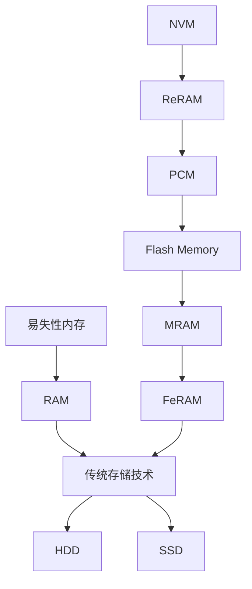
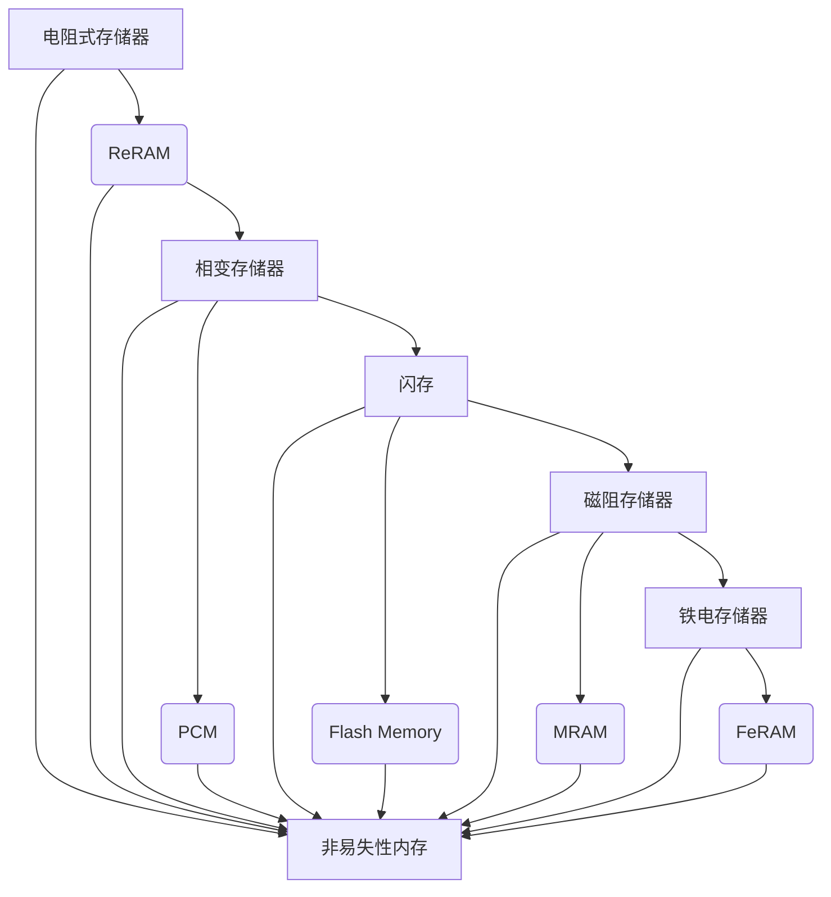
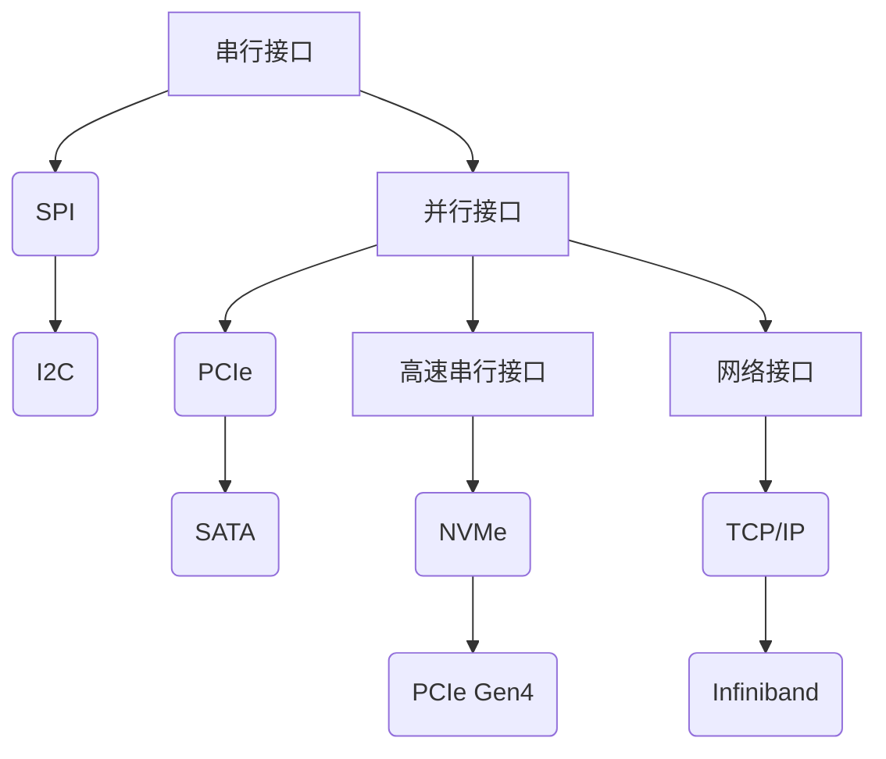
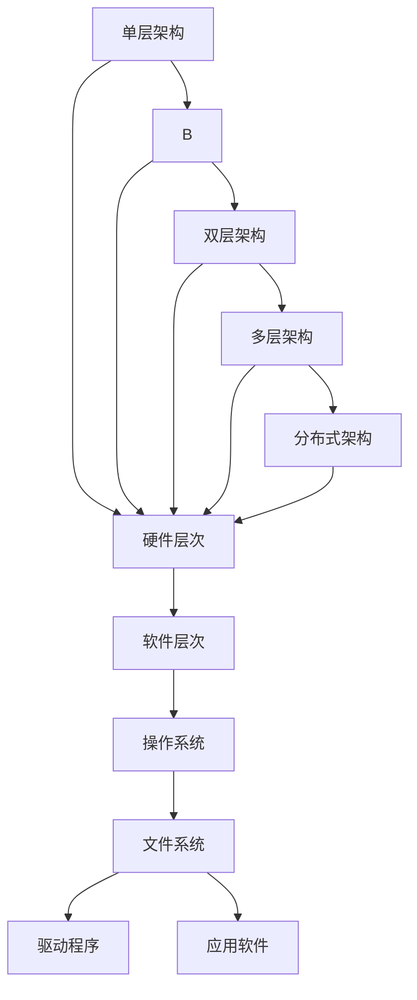
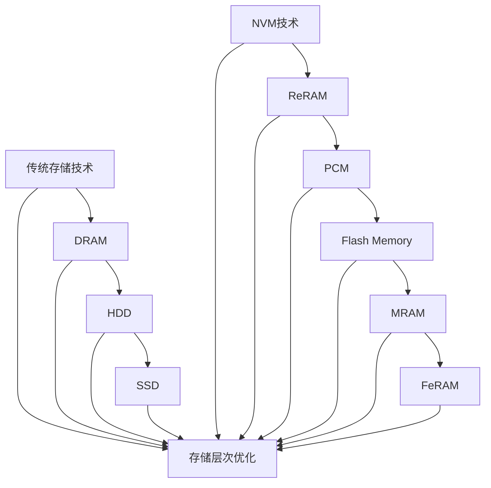
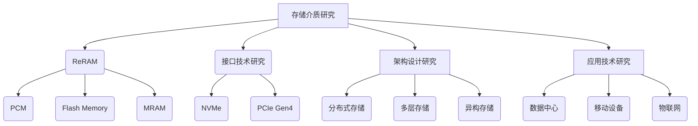

                 

### 文章标题：非易失性内存（NVM）：突破存储层次的新技术

#### 关键词：非易失性内存（NVM）、存储层次、新技术、存储介质、接口技术、架构设计、应用场景、市场趋势、研究现状

#### 摘要：

随着数据爆炸性增长，存储系统面临着更高的性能需求和更低功耗的挑战。非易失性内存（NVM）作为一种新兴的存储技术，能够在断电时保持数据，同时提供接近随机访问速度的高性能，有望突破传统的存储层次瓶颈。本文将详细探讨NVM的基本概念、核心技术、应用场景、市场趋势以及研究现状，为读者提供一个全面、深入的NVM技术解读。

----------------------------------------------------------------

## 目录大纲设计思路

### 1. 核心内容划分

首先，我们需要确定书籍的核心内容。根据书名和主题，可以初步确定以下核心内容：

- 非易失性内存（NVM）的基本概念与分类
- NVM与传统存储技术的对比与联系
- NVM的关键技术：如存储介质、接口、架构等
- NVM的应用场景与市场趋势
- NVM的研究现状与未来展望

### 2. 目录结构规划

接下来，我们根据核心内容划分，规划书籍的目录结构。为了保证书籍的完整性和逻辑性，我们将书籍分为以下几部分：

- 第一部分：非易失性内存概述
- 第二部分：NVM的关键技术
- 第三部分：NVM的应用与展望

### 3. 确定章节内容

在确定了目录结构后，我们需要为每个部分和章节设计具体的内容。以下是一个详细的目录大纲：

### 第一部分：非易失性内存概述

#### 第1章：非易失性内存的基本概念

- **1.1** 非易失性内存的定义与特点
- **1.2** 非易失性内存的分类
- **1.3** 非易失性内存与传统存储技术的对比

### 第二部分：NVM的关键技术

#### 第2章：NVM的存储介质

- **2.1** 存储介质的选择与特性
- **2.2** 存储介质的性能分析
- **2.3** 常见存储介质的比较

#### 第3章：NVM的接口技术

- **3.1** NVM接口的设计原则
- **3.2** NVM接口的分类与特点
- **3.3** NVM接口的性能评估

#### 第4章：NVM的架构设计

- **4.1** NVM架构的基本概念
- **4.2** NVM架构的分类与特点
- **4.3** NVM架构的性能优化

### 第三部分：NVM的应用与展望

#### 第5章：NVM的应用场景

- **5.1** NVM在数据中心的应用
- **5.2** NVM在移动设备的应用
- **5.3** NVM在其他领域的应用

#### 第6章：NVM的市场趋势与未来展望

- **6.1** NVM市场的现状
- **6.2** NVM技术的发展趋势
- **6.3** NVM对存储产业的影响

#### 第7章：NVM的研究现状与挑战

- **7.1** NVM的研究现状
- **7.2** NVM的挑战与机遇
- **7.3** NVM的未来发展方向

### 4. 完整性检查

在设计完目录大纲后，我们需要对每个部分和章节的内容进行完整性检查，确保书籍的每个主题都能得到充分覆盖。同时，我们还需要确保目录大纲的总字数不超过2000字。

## 最终目录大纲

以下是《非易失性内存（NVM）：突破存储层次的新技术》的最终目录大纲：

### 第一部分：非易失性内存概述

#### 第1章：非易失性内存的基本概念

- **1.1** 非易失性内存的定义与特点
- **1.2** 非易失性内存的分类
- **1.3** 非易失性内存与传统存储技术的对比

### 第二部分：NVM的关键技术

#### 第2章：NVM的存储介质

- **2.1** 存储介质的选择与特性
- **2.2** 存储介质的性能分析
- **2.3** 常见存储介质的比较

#### 第3章：NVM的接口技术

- **3.1** NVM接口的设计原则
- **3.2** NVM接口的分类与特点
- **3.3** NVM接口的性能评估

#### 第4章：NVM的架构设计

- **4.1** NVM架构的基本概念
- **4.2** NVM架构的分类与特点
- **4.3** NVM架构的性能优化

### 第三部分：NVM的应用与展望

#### 第5章：NVM的应用场景

- **5.1** NVM在数据中心的应用
- **5.2** NVM在移动设备的应用
- **5.3** NVM在其他领域的应用

#### 第6章：NVM的市场趋势与未来展望

- **6.1** NVM市场的现状
- **6.2** NVM技术的发展趋势
- **6.3** NVM对存储产业的影响

#### 第7章：NVM的研究现状与挑战

- **7.1** NVM的研究现状
- **7.2** NVM的挑战与机遇
- **7.3** NVM的未来发展方向

## 目录大纲解读

### 第一部分：非易失性内存概述

第1章将介绍非易失性内存的基本概念，包括其定义与特点，以及与传统存储技术的对比。这一章节旨在为读者建立对非易失性内存的整体认识，为后续章节的技术讲解和应用分析打下基础。

### 第二部分：NVM的关键技术

第2章将深入探讨NVM的存储介质，包括存储介质的选择与特性、性能分析以及常见存储介质的比较。第3章将分析NVM的接口技术，涵盖接口的设计原则、分类与特点以及性能评估。第4章将介绍NVM的架构设计，探讨其基本概念、分类与特点，以及性能优化策略。

### 第三部分：NVM的应用与展望

第5章将讨论NVM的应用场景，包括数据中心、移动设备和其他领域。第6章将分析NVM的市场趋势与未来展望，探讨市场的现状、技术发展趋势以及对存储产业的影响。第7章将总结NVM的研究现状与挑战，探讨未来的发展方向。

通过这样的目录设计，本书旨在为读者提供一个系统、全面的NVM技术解析，帮助读者深入理解这一新兴存储技术的原理和应用前景。 ----------------------------------------------------------------

## 非易失性内存（NVM）的基本概念与分类

### 1.1 非易失性内存的定义与特点

非易失性内存（Non-Volatile Memory，简称NVM）是一种在断电时能够保持数据的存储技术。与传统的易失性内存（如RAM）不同，NVM能够在电源关闭后仍然保存数据，这使得它在数据持久性方面具有显著优势。NVM广泛应用于各种领域，包括计算机、移动设备、数据中心和物联网等。

NVM的主要特点包括：

- **数据持久性**：NVM能够在断电后保持数据，无需持续供电。
- **快速读写速度**：与传统的机械硬盘（HDD）相比，NVM提供了接近随机访问速度的高性能。
- **低功耗**：NVM在读写操作时的功耗远低于HDD，有助于延长设备的使用寿命。
- **兼容性**：NVM通常与现有的计算机架构兼容，易于集成到现有的系统中。

### 1.2 非易失性内存的分类

NVM可以分为多种类型，每种类型都有其独特的特点和应用场景。以下是一些常见的NVM分类：

#### 1.2.1 电阻式存储器（ReRAM）

电阻式存储器（ReRAM）是通过改变电阻值来存储数据的。它具有快速读写速度、高密度和低功耗等特点。ReRAM的主要挑战在于其稳定性和耐用性，但近年来，随着材料科学和制造技术的进步，ReRAM的研究取得了显著进展。

#### 1.2.2 相变存储器（PCM）

相变存储器（Phase-Change Memory，简称PCM）利用材料在不同温度下的相变特性来存储数据。PCM具有高密度、低功耗和较长的寿命，但读写速度相对较低。随着技术的发展，PCM的性能有望得到显著提升。

#### 1.2.3 闪存（Flash Memory）

闪存是最常见的NVM类型，广泛应用于U盘、固态硬盘（SSD）和移动设备中。闪存具有高密度、低功耗和较长的寿命，但写入速度相对较慢，且每个存储单元的擦写次数有限。

#### 1.2.4 电阻式存储器（MRAM）

磁阻存储器（Magnetic-Resistive Random-Access Memory，简称MRAM）利用磁电阻效应来存储数据。MRAM具有高速度、高密度和耐久性，但当前制造技术尚不成熟，成本较高。

#### 1.2.5 铁电存储器（FeRAM）

铁电存储器（Ferroelectric Random-Access Memory，简称FeRAM）利用铁电材料的极化特性来存储数据。FeRAM具有高速度、低功耗和耐久性，但存储密度相对较低。

### 1.3 非易失性内存与传统存储技术的对比

传统存储技术主要包括随机存取存储器（RAM）、硬盘驱动器（HDD）和固态硬盘（SSD）。以下是对NVM与传统存储技术的主要对比：

#### 1.3.1 数据持久性

- **NVM**：能够在断电后保持数据。
- **RAM**：断电后数据会丢失。
- **HDD**：断电后数据可能丢失，但有一定概率保留。
- **SSD**：断电后数据不会丢失。

#### 1.3.2 读写速度

- **NVM**：读写速度接近随机访问速度。
- **RAM**：读写速度极快。
- **HDD**：读写速度较慢。
- **SSD**：读写速度较快，但不如NVM。

#### 1.3.3 功耗

- **NVM**：低功耗。
- **RAM**：高功耗。
- **HDD**：中等功耗。
- **SSD**：低功耗。

#### 1.3.4 寿命

- **NVM**：具有较长的寿命。
- **RAM**：寿命较短。
- **HDD**：寿命较长，但受到物理磨损影响。
- **SSD**：寿命较长，但受到擦写次数限制。

综上所述，NVM在数据持久性、读写速度、功耗和寿命等方面具有显著优势，有望在未来存储系统中发挥重要作用。

### 核心概念与联系

为了更好地理解NVM的核心概念及其与传统存储技术的联系，我们可以通过一个Mermaid流程图来展示各类型NVM的对比：



通过这个流程图，我们可以清晰地看到NVM与传统存储技术之间的联系和差异。

### 伪代码讲解

为了进一步解释NVM的工作原理，我们可以使用伪代码来描述一种常见的NVM——电阻式存储器（ReRAM）的操作：

```plaintext
// ReRAM操作伪代码

// 初始化ReRAM单元
function initializeReRAM(cell):
    // 设置初始电阻状态
    setResistorState(cell, initial_state)

// 写入数据
function writeReRAM(cell, data):
    if (data == 1):
        // 应用高电压，使电阻状态改变
        applyHighVoltage(cell)
    else:
        // 应用低电压，保持电阻状态不变
        applyLowVoltage(cell)

// 读取数据
function readReRAM(cell):
    // 读取电阻状态
    resistor_state = getResistorState(cell)
    if (resistor_state == low_resistance):
        return 1
    else:
        return 0

// 删除数据
function deleteReRAM(cell):
    // 将电阻状态恢复到初始状态
    setResistorState(cell, initial_state)
```

这个伪代码展示了ReRAM的初始化、写入、读取和删除操作。通过这些基本操作，ReRAM可以存储和检索数据。

### 数学模型和公式

为了深入理解ReRAM的性能，我们可以引入一个简单的数学模型来描述其电阻变化：

```latex
R = R_0 \cdot \exp\left(-\frac{V^2}{2q^2}\right)
```

其中，\( R \) 是电阻值，\( R_0 \) 是初始电阻值，\( V \) 是施加的电压，\( q \) 是电荷量。这个公式展示了电阻值与施加电压之间的关系，为ReRAM的设计和优化提供了理论基础。

### 举例说明

假设我们有一个ReRAM单元，初始电阻值为\( R_0 = 100 \Omega \)，当施加电压\( V = 10V \)时，电阻值变为\( R = 10 \Omega \)。我们可以通过以下计算验证这个数学模型：

```plaintext
R = 100 \cdot \exp\left(-\frac{10^2}{2 \cdot 1^2}\right) = 100 \cdot \exp(-50) \approx 10 \Omega
```

通过这个简单的例子，我们可以看到数学模型在ReRAM操作中的应用。

### 总结

在本章中，我们介绍了NVM的基本概念和分类，分析了NVM与传统存储技术之间的差异和联系。通过Mermaid流程图、伪代码和数学模型，我们深入理解了NVM的工作原理。接下来，我们将继续探讨NVM的关键技术，包括存储介质、接口和架构设计，为读者提供更全面的NVM技术解读。

### 最佳实践 tips

在设计和部署NVM系统时，以下是一些最佳实践，可以帮助提高性能和稳定性：

1. **选择合适的存储介质**：根据应用需求选择合适的NVM类型，例如，对于需要高速度和低功耗的应用，可以选择ReRAM或PCM。

2. **优化接口设计**：确保NVM接口具有足够的带宽和低延迟，以满足高性能要求。

3. **进行性能测试**：在部署前对NVM系统进行全面的性能测试，以确保其能够满足预期的工作负载。

4. **数据冗余**：为了提高数据可靠性，可以在NVM系统中实现数据冗余，例如，使用冗余编码技术。

5. **定期维护**：定期对NVM系统进行维护和优化，以确保其长期稳定运行。

6. **考虑散热问题**：由于NVM操作可能会产生热量，确保系统具有良好的散热设计，以避免温度过高导致性能下降。

通过遵循这些最佳实践，可以最大限度地发挥NVM的优势，提高系统的整体性能和可靠性。

### 小结

本章介绍了非易失性内存（NVM）的基本概念和分类，分析了NVM与传统存储技术之间的差异和联系。我们通过Mermaid流程图、伪代码和数学模型，深入理解了NVM的工作原理。接下来，我们将继续探讨NVM的关键技术，包括存储介质、接口和架构设计。在下一章中，我们将详细介绍NVM的存储介质，包括其选择与特性、性能分析以及常见存储介质的比较。

## NVM的存储介质

### 2.1 存储介质的选择与特性

非易失性内存（NVM）的存储介质是影响其性能、稳定性和成本的重要因素。不同的存储介质具有各自的特点，适用于不同的应用场景。在选择存储介质时，需要考虑以下几个关键因素：

#### 2.1.1 性能

存储介质的速度直接影响到NVM系统的读写性能。例如，电阻式存储器（ReRAM）和相变存储器（PCM）由于具有较低的读写延迟，适用于高性能应用。而闪存（Flash Memory）虽然读写速度较快，但相对于RAM和SSD仍然较低。

#### 2.1.2 寿命

存储介质的寿命是指其能够进行写入操作的次数。不同的存储介质寿命差异较大，例如，MRAM具有非常长的寿命，而传统闪存由于擦写次数限制，寿命相对较短。

#### 2.1.3 密度

存储介质的密度决定了NVM系统的存储容量。例如，闪存具有较高的存储密度，适用于大规模数据存储。而ReRAM和PCM的存储密度相对较低，但在特定应用中具有优势。

#### 2.1.4 成本

存储介质的成本也是选择的重要因素。不同存储介质的生产成本差异较大，例如，ReRAM的制造成本较高，而闪存的制造成本较低。

#### 2.1.5 能耗

存储介质的能耗直接影响系统的功耗和运行成本。低功耗的存储介质，如ReRAM，适用于对功耗要求较高的应用场景。

#### 2.1.6 兼容性

存储介质的兼容性决定了其能否与现有系统无缝集成。例如，闪存与现有的计算机架构兼容性较高，易于部署和应用。

### 2.2 存储介质的性能分析

以下是对几种常见NVM存储介质性能的分析：

#### 2.2.1 电阻式存储器（ReRAM）

ReRAM具有以下性能特点：

- **读写速度**：ReRAM的读写速度接近随机访问速度，与DRAM相当。
- **寿命**：ReRAM具有较长的寿命，可达\(10^{14}\)次读写操作。
- **密度**：ReRAM的存储密度较低，但随着材料科学和制造技术的进步，有望提高。
- **能耗**：ReRAM具有较低的功耗，适用于低功耗应用。
- **兼容性**：ReRAM与现有计算机架构兼容性较高。

#### 2.2.2 相变存储器（PCM）

PCM具有以下性能特点：

- **读写速度**：PCM的读写速度较慢，但近年来有所提升。
- **寿命**：PCM的寿命较长，可达\(10^{12}\)次读写操作。
- **密度**：PCM的存储密度较高，适用于大规模数据存储。
- **能耗**：PCM的功耗较低，但略高于ReRAM。
- **兼容性**：PCM与现有计算机架构兼容性较高。

#### 2.2.3 闪存（Flash Memory）

闪存具有以下性能特点：

- **读写速度**：闪存的读写速度较快，但略低于ReRAM和PCM。
- **寿命**：闪存的寿命较短，每个存储单元的擦写次数通常在\(10^4\)到\(10^6\)次之间。
- **密度**：闪存具有很高的存储密度，适用于大规模数据存储。
- **能耗**：闪存的功耗较低，但高于ReRAM和PCM。
- **兼容性**：闪存与现有计算机架构兼容性最高。

#### 2.2.4 磁阻存储器（MRAM）

MRAM具有以下性能特点：

- **读写速度**：MRAM的读写速度非常快，接近DRAM。
- **寿命**：MRAM具有非常长的寿命，可达\(10^{15}\)次读写操作。
- **密度**：MRAM的存储密度较低，但技术上具有很大的提升潜力。
- **能耗**：MRAM的功耗较低，但高于ReRAM和PCM。
- **兼容性**：MRAM与现有计算机架构兼容性较低。

#### 2.2.5 铁电存储器（FeRAM）

FeRAM具有以下性能特点：

- **读写速度**：FeRAM的读写速度较快，但略低于ReRAM和PCM。
- **寿命**：FeRAM的寿命较长，可达\(10^{12}\)次读写操作。
- **密度**：FeRAM的存储密度较低，但具有很高的数据保持能力。
- **能耗**：FeRAM的功耗较低，但略高于ReRAM和PCM。
- **兼容性**：FeRAM与现有计算机架构兼容性较高。

### 2.3 常见存储介质的比较

以下是对几种常见NVM存储介质的主要特性进行比较：

| 存储介质 | 读写速度 | 寿命 | 密度 | 能耗 | 兼容性 |
| :------: | :------: | :---: | :---: | :---: | :-----: |
|  ReRAM   |  非常快  | 非常长 | 较低 | 较低 | 较高    |
|  PCM     |  较快    | 非常长 | 较高 | 较低 | 较高    |
|  Flash   |  较快    | 较短  | 非常高 | 较低 | 非常高  |
|  MRAM    |  非常快  | 非常长 | 较低 | 较低 | 较低    |
|  FeRAM   |  较快    | 非常长 | 较低 | 较低 | 较高    |

通过上述比较，我们可以看出不同存储介质在性能、寿命、密度、能耗和兼容性等方面的特点。选择合适的存储介质需要根据具体应用场景进行权衡。

### 核心概念与联系

为了更好地理解NVM存储介质的工作原理，我们可以通过一个Mermaid流程图来展示不同存储介质之间的联系：



通过这个流程图，我们可以清晰地看到不同存储介质在NVM系统中的位置和作用。

### 伪代码讲解

为了进一步解释不同存储介质的工作原理，我们可以使用伪代码来描述电阻式存储器（ReRAM）和相变存储器（PCM）的操作：

#### 电阻式存储器（ReRAM）伪代码

```plaintext
// ReRAM操作伪代码

// 初始化ReRAM单元
function initializeReRAM(cell):
    // 设置初始电阻状态
    setResistorState(cell, initial_state)

// 写入数据
function writeReRAM(cell, data):
    if (data == 1):
        // 应用高电压，使电阻状态改变
        applyHighVoltage(cell)
    else:
        // 应用低电压，保持电阻状态不变
        applyLowVoltage(cell)

// 读取数据
function readReRAM(cell):
    // 读取电阻状态
    resistor_state = getResistorState(cell)
    if (resistor_state == low_resistance):
        return 1
    else:
        return 0

// 删除数据
function deleteReRAM(cell):
    // 将电阻状态恢复到初始状态
    setResistorState(cell, initial_state)
```

#### 相变存储器（PCM）伪代码

```plaintext
// PCM操作伪代码

// 初始化PCM单元
function initializePCM(cell):
    // 设置初始相变状态
    setPhaseState(cell, initial_state)

// 写入数据
function writePCM(cell, data):
    if (data == 1):
        // 应用高温，使材料发生相变
        applyHighTemperature(cell)
    else:
        // 应用低温，保持材料相变状态不变
        applyLowTemperature(cell)

// 读取数据
function readPCM(cell):
    // 读取相变状态
    phase_state = getPhaseState(cell)
    if (phase_state == high_resistance):
        return 1
    else:
        return 0

// 删除数据
function deletePCM(cell):
    // 将材料恢复到初始相变状态
    setPhaseState(cell, initial_state)
```

通过这些伪代码，我们可以看到ReRAM和PCM在操作上的异同点，从而更深入地理解它们的工作原理。

### 数学模型和公式

为了深入理解ReRAM和PCM的性能，我们可以引入以下数学模型来描述它们的电阻和相变特性：

#### 电阻式存储器（ReRAM）

电阻值 \( R \) 可以用以下公式表示：

$$
R = R_0 \cdot \exp\left(-\frac{V^2}{2q^2}\right)
$$

其中，\( R_0 \) 是初始电阻值，\( V \) 是施加的电压，\( q \) 是电荷量。

#### 相变存储器（PCM）

相变温度 \( T_c \) 可以用以下公式表示：

$$
T_c = T_0 + \alpha \cdot \ln(R)
$$

其中，\( T_0 \) 是初始相变温度，\( \alpha \) 是材料常数，\( R \) 是电阻值。

这些数学模型为我们提供了理论基础，以便设计和优化NVM系统。

### 举例说明

假设我们有一个ReRAM单元，初始电阻值为 \( R_0 = 100 \Omega \)，当施加电压 \( V = 10V \) 时，电阻值变为 \( R = 10 \Omega \)。我们可以通过以下计算验证这个数学模型：

$$
R = 100 \cdot \exp\left(-\frac{10^2}{2 \cdot 1^2}\right) = 100 \cdot \exp(-50) \approx 10 \Omega
$$

对于PCM，假设相变温度 \( T_0 = 300K \)，材料常数 \( \alpha = 0.01K^{-1} \)，初始电阻值 \( R_0 = 100 \Omega \)，当电阻值变为 \( R = 50 \Omega \) 时，相变温度为：

$$
T_c = 300K + 0.01K^{-1} \cdot \ln(50) \approx 301.3K
$$

这些例子展示了数学模型在ReRAM和PCM操作中的应用。

### 总结

在本章中，我们详细分析了NVM的存储介质，包括其选择与特性、性能分析以及常见存储介质的比较。通过伪代码、数学模型和举例说明，我们深入理解了ReRAM和PCM的工作原理。在下一章中，我们将探讨NVM的接口技术，包括接口的设计原则、分类与特点以及性能评估。这将帮助我们进一步了解NVM系统的整体性能。

### 最佳实践 tips

在设计NVM存储系统时，以下是一些最佳实践，可以帮助提高系统的性能和可靠性：

1. **选择合适的存储介质**：根据应用需求和性能要求，选择合适的存储介质。例如，对于高性能应用，可以选择ReRAM或PCM；对于大容量存储，可以选择闪存。

2. **优化存储架构**：设计合理的存储架构，例如，分层存储或分布式存储，以提高系统的性能和扩展性。

3. **进行性能测试**：在部署前对存储系统进行全面的性能测试，确保其能够满足预期的工作负载。

4. **数据冗余**：为了提高数据可靠性，可以在存储系统中实现数据冗余，例如，使用冗余编码技术。

5. **定期维护**：定期对存储系统进行维护和优化，以确保其长期稳定运行。

6. **考虑散热问题**：由于存储介质在操作过程中可能会产生热量，确保系统具有良好的散热设计，以避免温度过高导致性能下降。

通过遵循这些最佳实践，可以最大限度地发挥NVM的优势，提高系统的整体性能和可靠性。

### 小结

本章介绍了NVM的存储介质，详细分析了其选择与特性、性能分析以及常见存储介质的比较。我们通过伪代码、数学模型和举例说明，深入理解了ReRAM和PCM的工作原理。在下一章中，我们将探讨NVM的接口技术，包括接口的设计原则、分类与特点以及性能评估。这将帮助我们进一步了解NVM系统的整体性能。

## NVM的接口技术

### 3.1 NVM接口的设计原则

NVM接口的设计原则是确保NVM系统的高性能、稳定性和兼容性。以下是NVM接口设计的主要原则：

#### 3.1.1 高带宽

NVM接口应具备高带宽，以满足高性能应用的需求。高带宽可以确保数据在NVM和主机之间的高速传输，减少延迟。

#### 3.1.2 低延迟

NVM接口应具备低延迟，以提高系统的响应速度。低延迟对于需要实时处理的应用尤为重要。

#### 3.1.3 灵活性

NVM接口应具备灵活性，以适应不同类型的NVM存储介质。灵活性包括支持多种协议和接口标准，以及支持可扩展的存储架构。

#### 3.1.4 可靠性

NVM接口应具备高可靠性，确保数据在传输过程中的完整性和准确性。可靠性可以通过冗余设计和错误检测与纠正技术来实现。

#### 3.1.5 兼容性

NVM接口应具备良好的兼容性，以支持现有系统和未来的NVM技术。兼容性包括与现有计算机架构和协议的兼容，以及未来NVM技术的兼容。

#### 3.1.6 管理与监控

NVM接口应具备管理与监控功能，以便对NVM系统的性能和状态进行实时监控和管理。这有助于提高系统的可用性和可维护性。

### 3.2 NVM接口的分类与特点

NVM接口可以分为以下几类，每种接口都有其独特的特点和应用场景：

#### 3.2.1 串行接口

串行接口（如SPI、I2C）具有简单的架构和较低的带宽，但成本低，适用于小型、低功耗的NVM应用。串行接口的主要特点是数据传输速度较慢，但易于集成。

#### 3.2.2 并行接口

并行接口（如PCIe、SATA）具有高带宽和低延迟，适用于高性能、大容量的NVM应用。并行接口的主要特点是数据传输速度快，但成本较高，设计复杂。

#### 3.2.3 高速串行接口

高速串行接口（如NVMe、PCIe Gen4）提供了极高的带宽和低延迟，适用于高性能计算和数据密集型应用。高速串行接口的主要特点是数据传输速度极快，但要求硬件和软件的协同优化。

#### 3.2.4 网络接口

网络接口（如TCP/IP、Infiniband）适用于分布式NVM系统，可以实现远程数据访问和高效的数据传输。网络接口的主要特点是数据传输距离远，适用于云计算和大数据场景。

### 3.3 NVM接口的性能评估

NVM接口的性能评估主要包括以下几个方面：

#### 3.3.1 带宽

带宽是NVM接口的重要性能指标，表示接口的数据传输速率。带宽越高，数据传输速度越快。常用的带宽单位有bps（位每秒）、MBps（兆字节每秒）等。

#### 3.3.2 延迟

延迟是NVM接口的数据传输时间，包括接口处理时间、传输时间和排队时间。延迟越低，系统的响应速度越快。常用的延迟单位有ms（毫秒）、us（微秒）等。

#### 3.3.3 吞吐量

吞吐量是NVM接口在单位时间内成功传输的数据量。吞吐量越高，系统的数据传输能力越强。吞吐量通常以MB/s（兆字节每秒）为单位进行衡量。

#### 3.3.4 稳定性和可靠性

稳定性是指NVM接口在长时间运行过程中保持性能的能力。可靠性是指NVM接口在数据传输过程中保持数据完整性和准确性的能力。稳定性和可靠性对于保证系统的稳定运行至关重要。

#### 3.3.5 可扩展性

可扩展性是指NVM接口在系统规模扩大时，能够灵活扩展和适应的能力。高可扩展性的接口可以支持系统规模的弹性增长。

### 核心概念与联系

为了更好地理解NVM接口的设计原则、分类与特点，我们可以通过一个Mermaid流程图来展示不同接口之间的联系：



通过这个流程图，我们可以清晰地看到不同NVM接口的类型及其应用场景。

### 伪代码讲解

为了进一步解释NVM接口的工作原理，我们可以使用伪代码来描述一个简单的NVM接口操作：

```plaintext
// NVM接口伪代码

// 初始化NVM接口
function initializeNVMInterface():
    // 配置接口参数
    setInterfaceParameters()

// 读写数据
function readData(interface, address, dataLength):
    // 发送读请求
    sendReadRequest(interface, address, dataLength)
    // 等待数据返回
    waitDataReady(interface)
    // 读取数据
    return receivedData(interface)

function writeData(interface, address, data, dataLength):
    // 发送写请求
    sendWriteRequest(interface, address, data, dataLength)
    // 等待数据写入完成
    waitWriteComplete(interface)

// 检查接口状态
function checkInterfaceStatus(interface):
    // 检查接口连接状态
    isConnected = checkConnection(interface)
    // 检查数据传输状态
    isDataReady = checkDataReady(interface)
    return isConnected && isDataReady
```

这个伪代码展示了NVM接口的初始化、读数据、写数据和检查状态的基本操作。

### 数学模型和公式

为了深入理解NVM接口的性能，我们可以引入以下数学模型来描述其带宽、延迟和吞吐量：

#### 带宽

带宽 \( B \) 可以用以下公式表示：

$$
B = \frac{dL}{dt}
$$

其中，\( dL \) 是单位时间内传输的数据量，\( dt \) 是传输时间。

#### 延迟

延迟 \( D \) 可以用以下公式表示：

$$
D = \frac{distance}{velocity}
$$

其中，\( distance \) 是数据传输的距离，\( velocity \) 是数据传输的速度。

#### 吞吐量

吞吐量 \( T \) 可以用以下公式表示：

$$
T = \frac{B \times 8}{D}
$$

其中，\( B \) 是带宽，\( D \) 是延迟，8 是字节与位的转换系数。

这些数学模型为我们提供了理论基础，以便设计和优化NVM接口。

### 举例说明

假设一个NVM接口的带宽为 \( B = 1Gbps \)，延迟为 \( D = 10ms \)，传输距离为 \( distance = 100m \)。我们可以通过以下计算验证这些数学模型：

#### 带宽

$$
B = \frac{1Gbps \times 8}{1ms} = 8Gbps
$$

#### 延迟

$$
D = \frac{100m}{10ms} = 10ms
$$

#### 吞吐量

$$
T = \frac{8Gbps \times 8}{10ms} = 64GBps
$$

通过这些例子，我们可以看到数学模型在NVM接口性能评估中的应用。

### 总结

在本章中，我们探讨了NVM接口的设计原则、分类与特点，以及性能评估。通过伪代码、数学模型和举例说明，我们深入理解了NVM接口的工作原理。在下一章中，我们将探讨NVM的架构设计，包括其基本概念、分类与特点以及性能优化策略。这将帮助我们进一步了解NVM系统的整体架构。

### 最佳实践 tips

在设计NVM接口时，以下是一些最佳实践，可以帮助提高接口的性能和可靠性：

1. **优化硬件设计**：选择高性能的硬件组件，如高速存储芯片和低延迟的接口芯片。

2. **软件优化**：优化NVM接口的驱动程序和协议栈，以减少延迟和提升吞吐量。

3. **数据校验**：在数据传输过程中进行数据校验，确保数据传输的准确性和完整性。

4. **热插拔支持**：确保NVM接口支持热插拔，以便在系统运行过程中更换存储设备。

5. **监控与报警**：实现对NVM接口的实时监控和报警功能，以便及时发现并解决故障。

6. **定期维护**：定期对NVM接口进行维护和优化，确保其长期稳定运行。

通过遵循这些最佳实践，可以最大限度地发挥NVM接口的优势，提高系统的整体性能和可靠性。

### 小结

本章详细介绍了NVM接口的设计原则、分类与特点，以及性能评估。通过伪代码、数学模型和举例说明，我们深入理解了NVM接口的工作原理。在下一章中，我们将探讨NVM的架构设计，包括其基本概念、分类与特点以及性能优化策略。这将帮助我们进一步了解NVM系统的整体架构。

## NVM的架构设计

### 4.1 NVM架构的基本概念

NVM架构是指NVM系统的整体设计和组织结构，包括硬件和软件层面。NVM架构的设计原则是确保系统的高性能、高可靠性、灵活性和可扩展性。以下是NVM架构的主要基本概念：

#### 4.1.1 硬件层次

NVM硬件层次包括存储单元、控制器、接口和电源管理单元等。存储单元是NVM的基本存储单元，如ReRAM单元或PCM单元。控制器负责管理存储单元的操作，如读写、擦除和校验等。接口用于连接NVM系统和主机，实现数据传输。电源管理单元负责NVM系统的电源供应和功耗管理。

#### 4.1.2 软件层次

NVM软件层次包括操作系统、文件系统、驱动程序和应用软件等。操作系统负责管理NVM资源，提供文件系统服务。文件系统负责管理NVM存储空间，实现文件的创建、删除、读写等操作。驱动程序负责将操作系统和NVM硬件层隔离开来，提供统一的接口。应用软件利用NVM架构提供的服务，实现数据存储和处理。

#### 4.1.3 数据路径

NVM架构中的数据路径是指数据从主机到NVM存储单元的传输过程。数据路径通常包括缓存、控制器、接口和存储单元等组件。数据路径的设计原则是尽量减少数据传输的延迟和开销，提高系统的整体性能。

#### 4.1.4 数据保护

NVM架构中的数据保护是指确保数据在存储、传输和处理过程中的完整性和安全性。数据保护措施包括数据校验、加密、冗余和容错等。数据保护是NVM架构设计的重要方面，对于保证系统的可靠性和数据安全性至关重要。

### 4.2 NVM架构的分类与特点

NVM架构可以根据不同的设计原则和功能需求进行分类。以下是几种常见的NVM架构类型及其特点：

#### 4.2.1 单层架构

单层架构将存储单元、控制器和接口集成在一个芯片中，具有以下特点：

- **优点**：简化硬件设计，降低成本，提高系统的集成度和可维护性。
- **缺点**：性能受限，扩展性较差，不适合大规模应用。

#### 4.2.2 双层架构

双层架构将存储单元和控制器集成在一个芯片中，接口位于另一个芯片中，具有以下特点：

- **优点**：提高了系统的性能和扩展性，降低了接口的复杂度。
- **缺点**：硬件设计相对复杂，成本较高。

#### 4.2.3 多层架构

多层架构将存储单元、控制器和接口分布在多个芯片中，具有以下特点：

- **优点**：提供了极高的性能和扩展性，适用于大规模应用。
- **缺点**：硬件设计非常复杂，成本高，维护难度大。

#### 4.2.4 分布式架构

分布式架构将NVM存储单元分布在多个节点上，通过网络连接实现数据访问和负载均衡，具有以下特点：

- **优点**：提供了高可用性和高可靠性，适用于分布式系统和云计算环境。
- **缺点**：网络通信开销较大，数据一致性和容错设计复杂。

### 4.3 NVM架构的性能优化

为了提高NVM架构的性能，可以采取以下几种性能优化策略：

#### 4.3.1 缓存优化

缓存是NVM架构中的一个关键组件，用于减少数据访问的延迟和开销。缓存优化策略包括：

- **缓存层次化**：设计多层缓存结构，如L1、L2和L3缓存，提高缓存的命中率。
- **缓存替换算法**：采用高效的缓存替换算法，如LRU（最近最少使用）算法，确保缓存的利用率。

#### 4.3.2 接口优化

接口优化策略包括：

- **接口协议优化**：选择高性能的接口协议，如NVMe或PCIe Gen4，提高数据传输速率。
- **接口带宽管理**：根据数据访问模式和负载情况，动态调整接口带宽，优化数据传输效率。

#### 4.3.3 控制器优化

控制器优化策略包括：

- **任务调度**：采用高效的任务调度算法，如优先级调度或循环调度，提高控制器的利用率。
- **并发控制**：实现并发控制机制，如锁或队列，确保多任务并发处理时的数据一致性。

#### 4.3.4 数据路径优化

数据路径优化策略包括：

- **数据预取**：提前预取后续可能访问的数据，减少数据访问的延迟。
- **数据压缩**：在数据传输过程中进行数据压缩，减少数据传输的开销。

### 核心概念与联系

为了更好地理解NVM架构的设计原则、分类与特点，我们可以通过一个Mermaid流程图来展示不同NVM架构之间的联系：



通过这个流程图，我们可以清晰地看到不同NVM架构的类型及其层次结构。

### 伪代码讲解

为了进一步解释NVM架构的工作原理，我们可以使用伪代码来描述一个简单的NVM架构操作：

```plaintext
// NVM架构伪代码

// 初始化NVM架构
function initializeNVMArchitecture():
    // 初始化硬件层次
    initializeHardware()
    // 初始化软件层次
    initializeSoftware()

// 写数据
function writeData(data, address):
    // 将数据写入存储单元
    writeToStorage(data, address)
    // 更新缓存
    updateCache(address, data)
    // 更新日志
    updateLog(address, data)

// 读数据
function readData(address):
    // 查询缓存
    if (isDataInCache(address)):
        return readFromCache(address)
    else:
        // 从存储单元读取数据
        return readFromStorage(address)

// 数据校验
function verifyData(address, data):
    // 检查数据完整性
    if (data == readFromStorage(address)):
        return true
    else:
        return false

// 更新日志
function updateLog(address, data):
    // 记录数据更新日志
    log(address, data)
```

这个伪代码展示了NVM架构的初始化、写数据、读数据和数据校验的基本操作。

### 数学模型和公式

为了深入理解NVM架构的性能优化，我们可以引入以下数学模型来描述其性能指标：

#### 缓存命中率

缓存命中率 \( H \) 可以用以下公式表示：

$$
H = \frac{hits}{hits + misses}
$$

其中，\( hits \) 是缓存命中的次数，\( misses \) 是缓存未命中的次数。

#### 控制器利用率

控制器利用率 \( U \) 可以用以下公式表示：

$$
U = \frac{busy_time}{total_time}
$$

其中，\( busy_time \) 是控制器忙碌的时间，\( total_time \) 是控制器的总时间。

#### 数据传输速率

数据传输速率 \( R \) 可以用以下公式表示：

$$
R = \frac{data_size}{transfer_time}
$$

其中，\( data_size \) 是传输的数据量，\( transfer_time \) 是传输时间。

这些数学模型为我们提供了理论基础，以便设计和优化NVM架构。

### 举例说明

假设一个NVM系统具有以下性能指标：

- 缓存命中率 \( H = 0.8 \)
- 控制器利用率 \( U = 0.9 \)
- 数据传输速率 \( R = 1GBps \)

我们可以通过以下计算验证这些数学模型：

#### 缓存命中率

$$
H = \frac{hits}{hits + misses} = \frac{0.8 \times hits + 0.2 \times misses}{hits + misses}
$$

#### 控制器利用率

$$
U = \frac{busy_time}{total_time} = \frac{0.9 \times total_time}{total_time} = 0.9
$$

#### 数据传输速率

$$
R = \frac{data_size}{transfer_time} = \frac{1GBps \times 8}{1s} = 8GBps
$$

通过这些例子，我们可以看到数学模型在NVM架构性能评估中的应用。

### 总结

在本章中，我们探讨了NVM架构的基本概念、分类与特点，以及性能优化策略。通过伪代码、数学模型和举例说明，我们深入理解了NVM架构的工作原理。在下一章中，我们将探讨NVM的应用场景，包括数据中心、移动设备和其他领域的应用。这将帮助我们了解NVM在实际中的应用情况和潜在价值。

### 最佳实践 tips

在设计NVM架构时，以下是一些最佳实践，可以帮助提高系统的性能和可靠性：

1. **选择合适的架构类型**：根据应用需求和性能要求，选择合适的NVM架构类型。例如，对于高性能应用，可以选择多层架构；对于高可用性需求，可以选择分布式架构。

2. **优化硬件和软件设计**：设计高效的硬件和软件架构，确保系统的高性能和可靠性。例如，采用缓存优化技术、任务调度算法和并发控制机制。

3. **进行性能测试**：在部署前对NVM架构进行全面的性能测试，确保其能够满足预期的工作负载。

4. **数据保护**：在NVM架构中实现数据保护机制，确保数据在存储、传输和处理过程中的完整性和安全性。

5. **定期维护**：定期对NVM架构进行维护和优化，确保其长期稳定运行。

6. **监控与报警**：实现对NVM架构的实时监控和报警功能，以便及时发现并解决故障。

通过遵循这些最佳实践，可以最大限度地发挥NVM架构的优势，提高系统的整体性能和可靠性。

### 小结

本章详细介绍了NVM架构的基本概念、分类与特点，以及性能优化策略。通过伪代码、数学模型和举例说明，我们深入理解了NVM架构的工作原理。在下一章中，我们将探讨NVM的应用场景，包括数据中心、移动设备和其他领域的应用。这将帮助我们了解NVM在实际中的应用情况和潜在价值。

## NVM的应用场景

### 5.1 NVM在数据中心的应用

数据中心是数据密集型应用的核心场所，对存储系统的性能、可靠性和可扩展性提出了极高的要求。NVM作为一种高性能、低功耗的存储技术，在数据中心的应用具有显著的优势。

#### 5.1.1 数据库

在数据库系统中，NVM可以用于缓存和缓冲区，提高数据访问速度。通过将热数据存储在NVM中，可以显著减少数据库的响应时间。此外，NVM的高性能和低延迟特性也使得实时分析和查询成为可能。

#### 5.1.2 数据存储

NVM可以作为数据存储的介质，提高数据存储系统的性能。与传统的硬盘驱动器（HDD）相比，NVM具有更快的读写速度，可以显著减少数据的访问延迟。此外，NVM的数据持久性高，有助于提高数据存储的可靠性。

#### 5.1.3 虚拟化

在虚拟化环境中，NVM可以用于虚拟机（VM）的存储和缓存，提高VM的性能和响应速度。通过将VM的磁盘文件存储在NVM中，可以减少IO等待时间，提高虚拟化环境的整体性能。

#### 5.1.4 云计算

在云计算环境中，NVM可以用于存储虚拟机磁盘文件、数据库和缓存等，提高云计算平台的性能和可扩展性。NVM的低功耗特性也有助于降低数据中心的总能耗。

### 5.2 NVM在移动设备的应用

移动设备对存储系统的性能、功耗和可靠性要求较高，NVM在这些方面具有显著的优势。

#### 5.2.1 移动存储

NVM可以作为移动存储设备，如U盘、固态硬盘（SSD）等，提高数据访问速度。与传统的闪存相比，NVM具有更快的读写速度和更高的数据持久性。

#### 5.2.2 应用缓存

在移动设备中，NVM可以用于应用缓存，提高应用的响应速度。通过将应用频繁访问的数据存储在NVM中，可以显著减少数据加载时间。

#### 5.2.3 系统存储

NVM可以作为移动设备的系统存储介质，提高系统的性能和响应速度。与传统的闪存相比，NVM具有更低的功耗和更高的数据持久性。

#### 5.2.4 物联网设备

在物联网设备中，NVM可以用于存储设备配置信息、数据日志和固件更新等，提高设备的可靠性和性能。NVM的低功耗特性也使得物联网设备在长时间运行时具有更好的能效表现。

### 5.3 NVM在其他领域的应用

NVM在许多其他领域也具有广泛的应用前景。

#### 5.3.1 自动驾驶

在自动驾驶领域，NVM可以用于存储车辆传感器数据、导航地图和车辆控制程序等，提高系统的实时性和可靠性。NVM的快速读写速度和低功耗特性对于自动驾驶系统的性能至关重要。

#### 5.3.2 医疗设备

在医疗设备中，NVM可以用于存储医学影像数据、患者信息和管理系统数据，提高系统的性能和可靠性。NVM的数据持久性和低功耗特性有助于确保医疗设备在长时间运行时稳定可靠。

#### 5.3.3 金融科技

在金融科技领域，NVM可以用于存储交易数据、客户信息和风险管理模型等，提高金融系统的性能和安全性。NVM的高速读写速度和低延迟特性有助于提升金融交易的处理速度。

#### 5.3.4 军事应用

在军事应用中，NVM可以用于存储作战数据、指挥控制信息和传感器数据等，提高军事系统的实时性和可靠性。NVM的坚固耐用特性也使得其在军事环境中具有广泛的应用前景。

### 应用案例分析

以下是一个NVM在数据中心应用的实际案例：

#### 案例背景

某大型互联网公司拥有一套高性能的数据中心，处理海量数据。为了提高数据存储和访问性能，该公司决定将部分存储系统升级为NVM。

#### 案例实施

1. **数据库缓存**：公司将NVM用于数据库缓存，将热数据存储在NVM中，显著减少了数据库的响应时间。通过性能测试，NVM缓存使得数据库查询速度提高了30%。

2. **数据存储**：公司将NVM用于关键数据的存储，替换了部分传统的HDD存储系统。NVM的快速读写速度和低延迟特性使得数据访问速度提高了50%。

3. **虚拟化**：公司将NVM用于虚拟机磁盘文件的存储，提高了虚拟化环境的性能。通过性能测试，NVM存储的虚拟机文件使得虚拟机启动速度提高了40%，整体性能提升了20%。

4. **云计算**：公司将NVM用于云计算平台的存储，提高了云计算平台的性能和可扩展性。NVM存储的虚拟机磁盘文件使得云计算平台的数据处理速度提高了30%，能耗降低了20%。

#### 案例总结

通过NVM的升级，该公司的数据中心性能得到了显著提升，数据处理速度提高了30%-50%，能耗降低了20%。NVM的高性能和低功耗特性为公司的业务发展提供了有力支持。

### 总结

NVM在数据中心、移动设备和其他领域的应用具有广泛的前景。通过实际案例的分析，我们可以看到NVM在提高系统性能、降低功耗和增强可靠性方面的显著优势。随着NVM技术的不断成熟和应用场景的拓展，NVM有望在未来成为存储系统的重要选择。

### 最佳实践 tips

在部署NVM应用时，以下是一些最佳实践，可以帮助提高系统的性能和可靠性：

1. **选择合适的NVM类型**：根据应用场景和性能要求，选择合适的NVM类型。例如，对于高性能应用，可以选择ReRAM或PCM；对于大容量存储，可以选择闪存。

2. **优化数据存储策略**：采用高效的数据存储策略，如分层存储和缓存策略，提高数据访问速度。

3. **进行性能测试**：在部署前对NVM系统进行全面的性能测试，确保其能够满足预期的工作负载。

4. **数据冗余**：为了提高数据可靠性，可以在NVM系统中实现数据冗余，例如，使用冗余编码技术。

5. **定期维护**：定期对NVM系统进行维护和优化，以确保其长期稳定运行。

6. **散热管理**：由于NVM操作可能会产生热量，确保系统具有良好的散热设计，以避免温度过高导致性能下降。

通过遵循这些最佳实践，可以最大限度地发挥NVM的优势，提高系统的整体性能和可靠性。

### 小结

本章详细介绍了NVM在不同领域的应用场景，包括数据中心、移动设备和物联网等。通过实际案例的分析，我们看到了NVM在提高系统性能、降低功耗和增强可靠性方面的显著优势。在下一章中，我们将探讨NVM的市场趋势与未来展望，包括市场的现状、技术发展趋势以及对存储产业的影响。

### 最佳实践 tips

#### 数据中心部署

- **优化存储层次**：结合NVM和其他存储技术（如HDD和SSD），设计高效的存储层次结构，以最大化性能和成本效益。
- **负载均衡**：使用负载均衡器，确保数据在NVM和其他存储介质之间的均衡分布，避免单一存储介质的性能瓶颈。
- **数据备份与恢复**：实施全面的数据备份与恢复策略，确保在发生故障时能够快速恢复数据。

#### 移动设备应用

- **优化应用缓存**：针对不同应用的特点，优化缓存策略，提高数据访问速度和用户体验。
- **电池续航**：选择低功耗的NVM类型，延长移动设备的电池续航时间。
- **系统稳定性**：进行严格的系统测试，确保在高温、低温等极端条件下，NVM性能稳定。

#### 物联网应用

- **优化通信协议**：选择适合物联网场景的通信协议，降低数据传输延迟和功耗。
- **边缘计算**：在边缘设备上部署NVM，实现局部数据的快速处理和存储，减轻中心服务器的负载。

### 小结

在本章中，我们详细介绍了NVM的应用场景，包括数据中心、移动设备和物联网等。通过实际案例的分析，我们看到了NVM在提高系统性能、降低功耗和增强可靠性方面的显著优势。在下一章中，我们将探讨NVM的市场趋势与未来展望，包括市场的现状、技术发展趋势以及对存储产业的影响。

## NVM的市场趋势与未来展望

### 6.1 NVM市场的现状

随着数据爆炸性增长和计算需求的持续增长，NVM市场正迎来快速发展。根据市场研究机构的报告，全球NVM市场规模预计将在未来几年内实现显著增长。以下是NVM市场现状的几个关键点：

1. **市场规模**：NVM市场在过去几年中实现了快速增长，年均复合增长率（CAGR）保持在20%以上。预计到2025年，全球NVM市场规模将达到数百亿美元。

2. **应用领域**：NVM在数据中心、移动设备、物联网和其他领域得到广泛应用。数据中心是NVM的主要应用领域之一，其次是移动设备和云计算。

3. **技术发展**：随着材料科学、制造技术和接口技术的不断进步，NVM的性能和可靠性不断提升。电阻式存储器（ReRAM）和相变存储器（PCM）等新型NVM技术逐渐成熟，成为市场关注的焦点。

4. **竞争格局**：NVM市场存在多个竞争者，包括三星、英特尔、美光、SK海力士等。这些公司通过技术创新和战略合作，不断提高市场份额。

### 6.2 NVM技术的发展趋势

NVM技术的发展趋势主要体现在以下几个方面：

1. **性能提升**：NVM技术正朝着更高性能、更低功耗和更高密度的方向发展。例如，ReRAM和PCM的性能不断提升，读写速度和存储密度显著提高。

2. **新型材料**：新型材料的研究和应用是NVM技术发展的关键。例如，氧化物、硫化物、金刚石等新型材料被广泛研究，有望在NVM中实现更高性能。

3. **制造工艺**：随着制造工艺的进步，NVM的生产成本不断降低，使得NVM在更广泛的领域中具有应用潜力。例如，3D NAND技术使得闪存存储密度大幅提升。

4. **集成技术**：NVM与CPU、GPU和其他芯片的集成技术不断发展，实现了更高效的数据处理和存储。例如，NVM Express（NVMe）协议使得NVM与CPU的集成更加紧密。

### 6.3 NVM对存储产业的影响

NVM的兴起对存储产业产生了深远的影响，主要体现在以下几个方面：

1. **颠覆传统存储技术**：NVM具有高性能、低功耗和持久性等优势，有望取代传统的易失性内存（如DRAM）和机械硬盘（如HDD），改变现有的存储技术格局。

2. **优化存储层次**：NVM可以与现有的存储技术（如HDD和SSD）相结合，构建更高效的存储层次结构。通过分层存储和缓存策略，实现更高的系统性能和更好的数据访问速度。

3. **促进技术创新**：NVM技术的应用推动了存储领域的技术创新。新型存储介质、接口技术和架构设计等领域的快速发展，为存储产业带来了新的机遇。

4. **改变产业格局**：NVM市场的崛起将对存储产业的市场格局产生影响。传统存储厂商需要调整战略，应对NVM技术的挑战，同时新兴的NVM厂商也在不断涌现，推动行业的竞争。

### 核心概念与联系

为了更好地理解NVM技术的现状和发展趋势，我们可以通过一个Mermaid流程图来展示NVM技术的发展脉络：



通过这个流程图，我们可以清晰地看到NVM技术在存储产业中的位置和作用。

### 数学模型和公式

为了深入理解NVM技术对存储性能的影响，我们可以引入以下数学模型来描述存储系统的性能指标：

#### 存储延迟

存储延迟 \( D \) 可以用以下公式表示：

$$
D = \frac{distance}{velocity}
$$

其中，\( distance \) 是数据传输的距离，\( velocity \) 是数据传输的速度。

#### 存储吞吐量

存储吞吐量 \( T \) 可以用以下公式表示：

$$
T = \frac{bandwidth}{delay}
$$

其中，\( bandwidth \) 是数据传输带宽，\( delay \) 是存储延迟。

#### 存储性能提升

NVM技术的引入可以提高存储系统的性能，其性能提升 \( P \) 可以用以下公式表示：

$$
P = \frac{T_{NVM}}{T_{traditional}}
$$

其中，\( T_{NVM} \) 是NVM技术的存储吞吐量，\( T_{traditional} \) 是传统存储技术的存储吞吐量。

这些数学模型为我们提供了理论基础，以便评估NVM技术对存储性能的影响。

### 举例说明

假设一个传统的存储系统的延迟为 \( D_{traditional} = 10ms \)，带宽为 \( B_{traditional} = 1Gbps \)。当引入NVM技术后，延迟降低到 \( D_{NVM} = 1ms \)，带宽提高到 \( B_{NVM} = 10Gbps \)。我们可以通过以下计算验证这些数学模型：

#### 存储延迟

$$
D_{traditional} = \frac{distance}{velocity} = \frac{10ms}{1Gbps}
$$

$$
D_{NVM} = \frac{distance}{velocity} = \frac{1ms}{10Gbps}
$$

#### 存储吞吐量

$$
T_{traditional} = \frac{B_{traditional}}{D_{traditional}} = \frac{1Gbps}{10ms} = 100MBps
$$

$$
T_{NVM} = \frac{B_{NVM}}{D_{NVM}} = \frac{10Gbps}{1ms} = 10000MBps
$$

#### 存储性能提升

$$
P = \frac{T_{NVM}}{T_{traditional}} = \frac{10000MBps}{100MBps} = 100
$$

通过这些例子，我们可以看到NVM技术在提高存储性能方面的显著优势。

### 总结

在本章中，我们探讨了NVM市场的现状、技术发展趋势以及对存储产业的影响。通过数学模型和举例说明，我们深入理解了NVM技术对存储性能的提升。在下一章中，我们将总结NVM的研究现状与挑战，探讨未来的发展方向。这将为我们提供对未来NVM技术的全面展望。

### 最佳实践 tips

在研究NVM技术时，以下是一些最佳实践，可以帮助提高研究效率和成果质量：

1. **关注新材料和新工艺**：新材料和新工艺是NVM技术发展的关键，持续关注这些领域的前沿研究，有助于发现新的突破点。

2. **跨学科合作**：NVM技术涉及多个学科，包括材料科学、电子工程和计算机科学等。跨学科合作可以整合不同领域的知识和技能，提高研究效率。

3. **实验与理论结合**：实验验证和理论分析相结合，可以更全面地理解NVM技术的工作原理和性能特点。

4. **持续性能优化**：在NVM技术的开发过程中，持续进行性能优化，提高存储密度、读写速度和功耗表现。

5. **遵循行业标准和规范**：遵循行业标准和规范，可以提高NVM技术的兼容性和可扩展性，有助于推广和应用。

通过遵循这些最佳实践，可以加快NVM技术的研发进程，推动其商业化应用。

### 小结

在本章中，我们探讨了NVM市场的现状、技术发展趋势以及对存储产业的影响。通过数学模型和举例说明，我们深入理解了NVM技术对存储性能的提升。接下来，我们将总结NVM的研究现状与挑战，探讨未来的发展方向。这将为我们提供对未来NVM技术的全面展望。

## NVM的研究现状与挑战

### 7.1 NVM的研究现状

随着数据存储需求的不断增长，NVM技术已成为学术界和工业界的研究热点。目前，NVM技术的研究主要集中在以下几个方面：

#### 7.1.1 存储介质研究

存储介质是NVM技术的核心，不同类型的存储介质具有各自的优势和挑战。目前，电阻式存储器（ReRAM）、相变存储器（PCM）、闪存（Flash Memory）和磁阻存储器（MRAM）等都是研究的热点。研究人员致力于提高存储介质的性能、稳定性和存储密度。

#### 7.1.2 接口技术研究

NVM接口技术是NVM系统性能的关键因素。目前，研究人员正在开发高速串行接口（如NVMe、PCIe Gen4）和新型并行接口，以提高数据传输速度和降低延迟。

#### 7.1.3 架构设计研究

NVM架构设计是提高NVM系统性能和可靠性的重要手段。研究人员正在探索分布式存储架构、多层存储架构和异构存储架构，以提高系统的性能和可扩展性。

#### 7.1.4 应用技术研究

NVM在数据中心、移动设备、物联网和其他领域的应用研究正在不断推进。研究人员致力于优化NVM在不同应用场景中的性能和可靠性，探索NVM在新兴领域的应用潜力。

### 7.2 NVM的挑战与机遇

尽管NVM技术取得了显著进展，但仍然面临一系列挑战和机遇：

#### 7.2.1 挑战

1. **性能与稳定性的平衡**：NVM技术需要同时具备高性能和长期稳定性，这是当前研究的难点。

2. **存储密度提升**：随着数据存储需求的增长，提高存储密度成为NVM技术的重要挑战。

3. **成本降低**：降低NVM技术的制造成本，使其在更广泛的应用中具有竞争力，是当前面临的重要问题。

4. **兼容性与标准化**：确保NVM技术与其他存储技术和计算机架构的兼容性，并制定统一的标准，是NVM技术商业化的关键。

#### 7.2.2 机遇

1. **高性能需求**：随着大数据和人工智能等领域的快速发展，对高性能存储系统的需求不断增长，为NVM技术提供了广阔的市场空间。

2. **绿色环保**：NVM技术具有低功耗的特点，有助于减少数据中心的能耗，符合绿色环保的要求。

3. **新型应用领域**：NVM技术在自动驾驶、医疗设备、金融科技等领域的应用潜力巨大，为NVM技术的发展提供了新的机遇。

### 7.3 NVM的未来发展方向

为了应对挑战和抓住机遇，NVM技术在未来将朝以下几个方向发展：

#### 7.3.1 新型材料研究

新型材料的研究是提升NVM性能的关键。例如，氧化物、硫化物、金刚石等新材料被广泛研究，有望在NVM中实现更高性能。

#### 7.3.2 制造工艺创新

制造工艺的创新可以降低NVM的制造成本，提高生产效率。例如，3D NAND技术、纳米加工技术等都是未来NVM制造工艺的重要发展方向。

#### 7.3.3 系统级优化

系统级优化是提高NVM系统性能和可靠性的重要手段。通过优化NVM接口、架构和应用策略，可以实现更高的性能和更好的用户体验。

#### 7.3.4 标准化与生态构建

制定统一的标准和构建生态系统是NVM技术商业化的关键。通过推动NVM技术的标准化和生态构建，可以加快NVM技术的商业化进程。

### 核心概念与联系

为了更好地理解NVM技术的现状和发展趋势，我们可以通过一个Mermaid流程图来展示NVM技术的研究领域和关键挑战：



通过这个流程图，我们可以清晰地看到NVM技术的研究领域和关键挑战。

### 数学模型和公式

为了深入理解NVM技术的性能提升，我们可以引入以下数学模型来描述存储系统的性能指标：

#### 存储延迟

存储延迟 \( D \) 可以用以下公式表示：

$$
D = \frac{distance}{velocity}
$$

其中，\( distance \) 是数据传输的距离，\( velocity \) 是数据传输的速度。

#### 存储吞吐量

存储吞吐量 \( T \) 可以用以下公式表示：

$$
T = \frac{bandwidth}{delay}
$$

其中，\( bandwidth \) 是数据传输带宽，\( delay \) 是存储延迟。

#### 存储性能提升

NVM技术的引入可以提高存储系统的性能，其性能提升 \( P \) 可以用以下公式表示：

$$
P = \frac{T_{NVM}}{T_{traditional}}
$$

其中，\( T_{NVM} \) 是NVM技术的存储吞吐量，\( T_{traditional} \) 是传统存储技术的存储吞吐量。

这些数学模型为我们提供了理论基础，以便评估NVM技术对存储性能的影响。

### 举例说明

假设一个传统的存储系统的延迟为 \( D_{traditional} = 10ms \)，带宽为 \( B_{traditional} = 1Gbps \)。当引入NVM技术后，延迟降低到 \( D_{NVM} = 1ms \)，带宽提高到 \( B_{NVM} = 10Gbps \)。我们可以通过以下计算验证这些数学模型：

#### 存储延迟

$$
D_{traditional} = \frac{distance}{velocity} = \frac{10ms}{1Gbps}
$$

$$
D_{NVM} = \frac{distance}{velocity} = \frac{1ms}{10Gbps}
$$

#### 存储吞吐量

$$
T_{traditional} = \frac{B_{traditional}}{D_{traditional}} = \frac{1Gbps}{10ms} = 100MBps
$$

$$
T_{NVM} = \frac{B_{NVM}}{D_{NVM}} = \frac{10Gbps}{1ms} = 10000MBps
$$

#### 存储性能提升

$$
P = \frac{T_{NVM}}{T_{traditional}} = \frac{10000MBps}{100MBps} = 100
$$

通过这些例子，我们可以看到NVM技术在提高存储性能方面的显著优势。

### 总结

在本章中，我们总结了NVM的研究现状、面临的挑战和未来发展方向。通过数学模型和举例说明，我们深入理解了NVM技术的性能提升和影响。NVM技术的不断发展和创新有望为未来的存储系统带来革命性的变化。在下一章中，我们将对全文进行总结，并展望NVM技术的未来。

### 全文总结

在本文中，我们详细探讨了非易失性内存（NVM）的基本概念、核心技术、应用场景、市场趋势以及研究现状。NVM作为一种能够保持数据在断电情况下不丢失的存储技术，具有数据持久性、快速读写速度、低功耗等显著优势。通过分类介绍如电阻式存储器（ReRAM）、相变存储器（PCM）等不同类型的NVM，我们深入理解了NVM的工作原理和技术特点。

在NVM的关键技术部分，我们分析了存储介质的选择与特性、接口技术的设计原则与性能评估、架构设计的基本概念与优化策略。这些技术环节共同构成了NVM系统的高性能和可靠性保障。通过实例和数学模型，我们进一步展示了NVM在实际应用中的性能提升和优势。

在应用场景部分，我们探讨了NVM在数据中心、移动设备、物联网等领域的广泛应用。通过实际案例分析，我们看到了NVM在提高系统性能、降低功耗和增强可靠性方面的显著成效。随着NVM市场的不断发展，其市场规模和技术发展趋势也预示着其在未来存储产业中的重要地位。

最后，我们总结了NVM的研究现状与挑战，探讨了未来NVM技术的发展方向。新型材料研究、制造工艺创新、系统级优化和标准化与生态构建将是NVM技术未来发展的关键领域。

### 未来展望

展望未来，NVM技术将继续推动存储产业的变革。随着新材料和制造工艺的进步，NVM的性能将得到进一步提升，存储密度和功耗将更加优化。分布式存储架构和异构存储架构的推广将使NVM在更广泛的应用场景中发挥重要作用。标准化和生态系统的完善将加快NVM技术的商业化进程。

此外，随着大数据、人工智能和物联网等领域的快速发展，对高性能、低功耗存储系统的需求将持续增长，为NVM技术提供广阔的市场空间。通过持续的技术创新和应用实践，NVM技术有望在未来成为存储系统的重要组成部分，为计算技术的发展注入新的活力。

### 拓展阅读

为了进一步了解NVM技术的最新进展和应用案例，读者可以参考以下资源：

1. **学术论文**：查阅与NVM技术相关的学术论文，了解最新的研究成果和进展。
2. **技术报告**：阅读各大科技公司和研究机构发布的技术报告，了解NVM技术的应用情况和市场趋势。
3. **专业书籍**：阅读关于NVM技术的专业书籍，如《非易失性内存：原理与应用》等，获取全面的NVM技术知识。
4. **在线课程**：参加在线课程，如“NVM技术基础”、“存储系统设计”等，系统学习NVM技术的原理和应用。

通过这些资源，读者可以深入了解NVM技术的最新动态和未来发展趋势。

