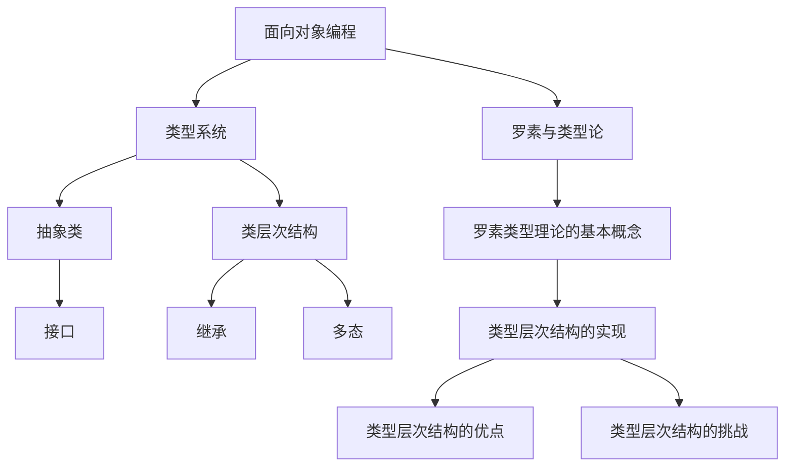

                 


## 文章标题：面向对象编程中的类型层次结构：追溯到罗素

> 关键词：面向对象编程、类型层次结构、罗素、类型理论、抽象类、接口、继承、多态

> 摘要：本文将探讨面向对象编程中的类型层次结构，从其根源——罗素的类型论出发，逐步深入分析类型系统的核心概念和实现原理，并结合数学模型和实际项目案例，为读者呈现一个清晰、系统的类型层次结构理解。

---

### 目录大纲设计思路

在深入探讨面向对象编程中的类型层次结构之前，我们需要首先梳理出与类型层次结构相关的主要概念，并明确它们之间的逻辑关系。以下是一个详细的目录大纲设计思路：

#### 核心概念与联系

1. **面向对象编程**：介绍面向对象编程的基本概念，包括对象、类、继承、多态等。
2. **类型系统**：解释类型系统的基本原理，包括类型、类型检查、类型安全等。
3. **层次结构**：阐述层次结构的概念，包括抽象类、接口、继承、多态等。
4. **罗素与类型论**：追溯罗素类型论的起源，解释罗素类型理论的基本概念，如类型层次结构的实现和优点。

#### 输出格式

使用 Mermaid 流程图来展示类型层次结构的组成和相互关系。以下是一个示例：



### 核心算法原理讲解

在类型层次结构中，有几个核心算法和概念至关重要，如抽象类、接口、继承和多态。以下将使用伪代码进行详细阐述，以帮助读者理解这些概念的工作原理。

#### 抽象类

```python
class AbstractClass {
    function abstractMethod() {
        throw "AbstractMethodError";
    }
}
```

#### 接口

```python
interface Interface {
    function method();
}
```

#### 继承

```python
class ChildClass : public ParentClass {
    // 继承自 ParentClass 的属性和方法
    function childMethod() {
        // 实现特定的方法
    }
}
```

#### 多态

```python
class BaseClass {
    function method() {
        print("BaseClass method");
    }
}

class DerivedClass : public BaseClass {
    function method() {
        print("DerivedClass method");
    }
}
```

### 数学模型和数学公式

在类型层次结构中，数学模型和公式起着至关重要的作用。以下将介绍类型安全的数学模型和类型检查的例子。

#### 类型安全的数学模型

类型安全通常指的是在类型层次结构中，类型之间的转换和操作不会导致意外的结果。在面向对象编程中，类型安全可以通过以下数学模型来描述：

$$
\text{type safety} = \left\{
    \begin{array}{ll}
        \text{true} & \text{if } \text{type conversions and operations do not cause unexpected results} \\
        \text{false} & \text{otherwise}
    \end{array}
\right.
$$

#### 类型检查的例子

假设我们有以下两个类型：

$$
T_1 = \text{Integer}
$$

$$
T_2 = \text{String}
$$

我们尝试将类型 $T_1$ 转换为 $T_2$：

$$
\text{try} {
    \text{String } s = T_1 \to T_2;
} \\
\text{catch} (\text{TypeConversionError}) {
    \text{print("Type conversion error from } T_1 \text{ to } T_2 \text{ failed.");
}
```

### 项目实战

为了更好地理解类型层次结构的应用，我们将设计一个实际的项目案例。在这个案例中，我们将展示如何使用面向对象编程中的类型层次结构来解决实际问题。

#### 项目背景和目标

假设我们需要开发一个图书管理系统，其中包括书籍的添加、删除、查询和分类等功能。我们的目标是使用面向对象编程和类型层次结构来实现这个系统。

#### 开发环境搭建

1. 选择合适的编程语言和开发工具，例如 Java 和 Eclipse。
2. 创建一个新项目，并设置项目的基本结构和依赖库。

#### 源代码实现

1. 定义书籍类（Book）和图书管理类（LibraryManager）。
2. 实现书籍类的属性和方法，如标题、作者、ISBN等。
3. 实现图书管理类的功能，如添加书籍、删除书籍、查询书籍、分类书籍等。

#### 代码解读与分析

1. 分析书籍类中的属性和方法，解释它们的作用和实现原理。
2. 分析图书管理类中的功能实现，解释如何使用类型层次结构来管理书籍。

#### 代码应用解读与分析

1. 演示图书管理类中的各个功能，并解释它们是如何实现的。
2. 分析类型层次结构在图书管理系统中的应用，探讨其优点和挑战。

#### 项目小结

通过对图书管理系统的开发，我们深入了解了面向对象编程中的类型层次结构。类型层次结构使得代码更加模块化、可维护和可扩展。同时，我们也认识到类型层次结构在实现过程中的挑战，如类型安全性和类型检查。

### 最佳实践 tips、小结、注意事项、拓展阅读等内容

在本文中，我们首先介绍了面向对象编程中的类型层次结构，并追溯了其根源——罗素的类型论。接着，我们分析了类型系统的核心概念和实现原理，并通过数学模型和实际项目案例进行了详细讲解。通过本文的学习，读者应该能够：

1. 理解面向对象编程的基本概念和类型系统的原理。
2. 掌握抽象类、接口、继承和多态等核心算法。
3. 使用 Mermaid 流程图来展示类型层次结构的组成和相互关系。
4. 使用 LaTeX 格式嵌入数学公式，并进行详细讲解和举例说明。
5. 实际项目案例中应用类型层次结构，提高代码的可维护性和可扩展性。

在未来的实践中，读者可以尝试：

1. 深入学习罗素类型论的基本概念和原理。
2. 探索其他面向对象编程语言中的类型层次结构，如 C++、Python 等。
3. 在实际项目中应用类型层次结构，提高代码质量和开发效率。
4. 阅读相关技术文献和书籍，如《禅与计算机程序设计艺术》、《类型系统与类型检查》等。

通过不断学习和实践，读者将能够更好地掌握面向对象编程中的类型层次结构，并在实际项目中发挥其优势。

---

作者：AI天才研究院/AI Genius Institute & 禅与计算机程序设计艺术 /Zen And The Art of Computer Programming

