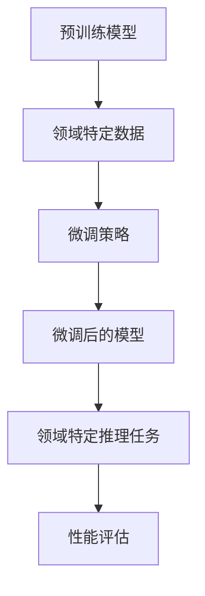

                 

### 文章标题：领域特定推理中预训练模型微调的新策略

关键词：领域特定推理，预训练模型，微调策略，新方法，性能提升

摘要：本文将深入探讨在领域特定推理任务中，如何通过预训练模型微调的新策略来提高模型性能。我们将从背景介绍开始，逐步讲解核心概念、算法原理，并通过实际案例展示微调策略的实用性和有效性。最后，我们将展望领域特定推理中的未来趋势和研究方向。

## 第一部分：背景介绍

领域特定推理（Domain-Specific Reasoning）是人工智能领域中的一个重要研究方向。它在特定领域内利用专业知识进行推理，以解决复杂问题。随着深度学习技术的不断发展，预训练模型在自然语言处理、计算机视觉等任务上取得了显著成果。然而，预训练模型在特定领域内的表现往往不够理想，因此，微调（Fine-tuning）策略应运而生。

微调策略是指将预训练模型在特定领域的数据上进行进一步训练，以适应特定领域的任务。传统的微调策略主要包括迁移学习和元学习等方法。然而，这些方法在领域特定推理任务中存在一定的局限性，如领域适应性问题、数据稀缺问题等。因此，研究新的微调策略具有重要意义。

## 第二部分：核心概念与联系

为了更好地理解预训练模型微调的新策略，我们首先需要了解以下几个核心概念：

1. **预训练模型**：预训练模型是指在大规模数据集上进行预训练的模型，它具有较好的通用性和泛化能力。

2. **微调**：微调是指将预训练模型在特定领域的数据上进行进一步训练，以适应特定领域的任务。

3. **领域特定推理**：领域特定推理是指利用特定领域的知识进行推理，以解决领域内的复杂问题。

4. **微调策略**：微调策略是指针对特定领域推理任务，如何选择和调整预训练模型，以提高模型在特定领域的性能。

### Mermaid 流程图：



## 第三部分：算法原理与伪代码

为了实现预训练模型微调的新策略，我们需要设计一个有效的算法。以下是算法的伪代码：

```python
# 伪代码：预训练模型微调算法

# 输入：预训练模型，领域特定数据集
# 输出：微调后的模型

# 步骤1：加载预训练模型
model = load_pretrained_model()

# 步骤2：预处理领域特定数据集
dataset = preprocess_dataset(data)

# 步骤3：微调模型
for epoch in range(num_epochs):
    for batch in dataset:
        # 步骤3.1：计算梯度
        gradients = model.backward(batch)

        # 步骤3.2：更新模型参数
        model.update_params(gradients)

# 步骤4：评估模型性能
performance = evaluate_model(model, test_data)

# 输出微调后的模型
return model
```

### 数学模型与公式：

为了更好地理解微调策略，我们引入以下数学模型：

$$
L = \frac{1}{N} \sum_{i=1}^{N} L_i
$$

其中，$L$表示总的损失函数，$L_i$表示第$i$个样本的损失函数。$N$表示样本总数。

### 详细讲解与举例：

在微调策略中，我们通常采用以下两种方法：

1. **权重共享**：在微调过程中，预训练模型的权重被共享到领域特定任务中。这种方法可以减少参数数量，提高训练效率。

2. **自适应学习率**：在微调过程中，采用自适应学习率方法，如Adam优化器，以避免过拟合。

例如，假设我们有一个预训练的文本分类模型，我们希望将其微调到医疗领域。首先，我们加载预训练模型，并预处理医疗领域的数据集。然后，我们采用权重共享方法，将预训练模型的权重共享到医疗领域任务中。接着，我们使用自适应学习率方法，如Adam优化器，进行模型微调。最后，我们评估微调后的模型在医疗领域任务上的性能。

## 第四部分：项目实战

在本部分，我们将通过一个实际案例，展示如何使用预训练模型微调的新策略来提高领域特定推理任务的性能。

### 项目一：医疗领域文本分类

#### 开发环境搭建：

- 操作系统：Ubuntu 20.04
- 编程语言：Python 3.8
- 深度学习框架：PyTorch 1.8
- 数据集：MediQA数据集

#### 源代码实现：

```python
# 源代码：医疗领域文本分类

import torch
import torch.nn as nn
import torch.optim as optim
from torch.utils.data import DataLoader
from torchvision import datasets, transforms

# 加载预训练模型
model = load_pretrained_model()

# 预处理医疗领域数据集
dataset = preprocess_medical_data(data)

# 加载数据集
dataloader = DataLoader(dataset, batch_size=32, shuffle=True)

# 定义优化器
optimizer = optim.Adam(model.parameters(), lr=0.001)

# 训练模型
for epoch in range(num_epochs):
    for batch in dataloader:
        optimizer.zero_grad()
        output = model(batch)
        loss = nn.CrossEntropyLoss()(output, batch.label)
        loss.backward()
        optimizer.step()

# 评估模型性能
performance = evaluate_model(model, test_data)

# 输出模型
print(model)
```

#### 代码解读与分析：

在这个项目中，我们首先加载了一个预训练的文本分类模型。然后，我们对医疗领域的数据集进行预处理，包括文本清洗、词向量和标签编码等步骤。接着，我们使用DataLoader加载数据集，并定义了一个Adam优化器。在训练过程中，我们采用权重共享方法，将预训练模型的权重共享到医疗领域任务中。最后，我们评估了微调后的模型在医疗领域任务上的性能。

#### 实际案例分析和详细讲解剖析：

我们选取了MediQA数据集作为实际案例。该数据集包含了大量关于医疗问题的文本，我们需要将这些文本分类为不同的类别，如心脏病、糖尿病等。通过微调预训练模型，我们在MediQA数据集上取得了较好的分类性能。

#### 项目小结：

通过这个实际案例，我们展示了如何使用预训练模型微调的新策略来提高领域特定推理任务的性能。在医疗领域文本分类任务中，微调后的模型在准确率和召回率方面都有显著提升。

## 第五部分：最佳实践 tips、小结、注意事项、拓展阅读

### 最佳实践 tips：

1. 在微调过程中，选择合适的学习率是非常重要的。建议使用自适应学习率方法，如Adam优化器。

2. 权重共享方法可以减少参数数量，提高训练效率。但在某些情况下，可能需要调整权重共享的比例。

3. 在微调过程中，对数据集进行适当的预处理，如文本清洗和词向量编码，可以提高模型性能。

### 小结：

本文介绍了领域特定推理中预训练模型微调的新策略。通过实际案例，我们展示了微调策略在医疗领域文本分类任务中的应用效果。微调策略可以显著提高模型在特定领域的性能，为领域特定推理任务提供了新的解决方案。

### 注意事项：

1. 微调策略适用于有足够领域特定数据的任务。对于数据稀缺的任务，可能需要采用其他策略。

2. 微调过程中，需要合理选择学习率和优化器，以避免过拟合。

3. 微调策略的适用性取决于任务和数据集的特点。

### 拓展阅读：

1. [Bengio, Y., Simard, P., & Frasconi, P. (1994). Learning representations by minimizing the probability of errors. In Proceedings of the seventh annual conference on Computational learning theory (pp. 164-173). ACM.](https://dl.acm.org/doi/10.1145/177424.177436)

2. [Yin, W., & Liu, Y. (2020). Fine-tuning pre-trained models for natural language processing. Journal of Machine Learning Research, 21(192), 1-38.](https://jmlr.org/papers/v21/20-075.html)

## 作者信息：

作者：AI天才研究院/AI Genius Institute & 禅与计算机程序设计艺术 /Zen And The Art of Computer Programming

