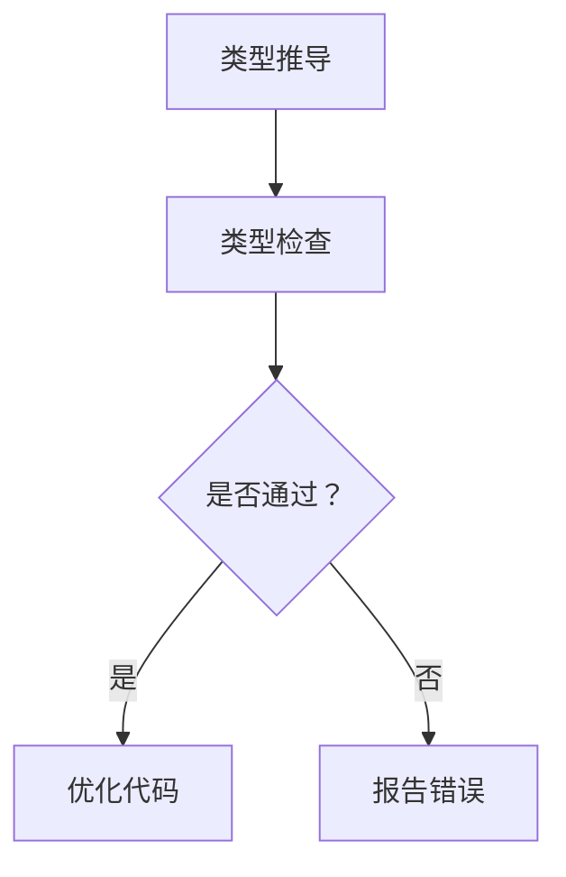

                 

### 引言

领域特定语言（Domain-Specific Language，简称DSL）是一种为特定领域或行业设计的编程语言。与通用编程语言如Python或Java相比，DSL旨在简化特定任务或领域中的开发过程，提供更高效、更直观的解决方案。随着软件工程领域的发展，DSL在各个行业中的应用越来越广泛，从金融、医疗到嵌入式系统、数据分析，都展现出了其独特的价值。

本文旨在深入探讨领域特定语言的类型系统设计，重点关注类型系统在DSL中的核心作用及其设计原则。类型系统是编程语言的基础组成部分，它为程序提供了一致的类型检查机制，确保代码的稳定性和安全性。类型系统的设计不仅影响语言的表达能力，还对语言的性能和可维护性产生深远影响。

文章结构安排如下：首先，我们将概述领域特定语言的概念，并探讨类型系统在DSL中的重要性。接着，文章将分类介绍不同类型的类型系统，并详细解释其原理。随后，我们将讨论类型系统的设计原则和实现策略。文章还将通过实际案例展示类型系统在特定领域中的应用，并总结设计经验与教训。最后，我们将展望类型系统和领域特定语言的未来发展趋势。

通过本文的逐步分析，读者将能够全面了解类型系统在DSL设计中的关键作用，掌握类型系统设计的核心原理和方法，为实际开发提供有力的指导。

### 关键词

领域特定语言（DSL）、类型系统、类型推导、类型检查、类型兼容性、子类型、泛型编程、类型约束、性能优化。

### 摘要

本文深入探讨了领域特定语言（DSL）的类型系统设计。首先，我们介绍了DSL的概念及其与类型系统的关系，强调了类型系统在DSL中的核心作用。接着，我们分类讨论了不同类型的类型系统，包括静态类型、动态类型、强类型和弱类型等。通过具体案例，我们详细分析了类型系统设计原则和实现策略。文章最后展望了类型系统和领域特定语言的未来发展趋势，并总结了设计经验与教训，为实际开发提供了有价值的参考。

### 第一部分：背景与基础

#### 1.1 领域特定语言概述

领域特定语言（DSL）是一种为特定领域或行业设计的编程语言，与通用编程语言（如Python、Java等）相比，DSL专注于简化特定任务或领域的开发过程，提供更高效、更直观的解决方案。DSL的设计理念是将领域专家和开发者紧密结合起来，通过定义领域内的抽象和规则，使编程语言更贴近领域知识和工作流程。

定义与核心概念：

- 定义：领域特定语言是一种专门为解决特定领域的问题而设计的编程语言。其设计原则是高度抽象和领域导向，旨在提高开发效率和代码可维护性。
- 核心概念：DSL的核心概念包括抽象、领域模型、领域特定词汇和语法结构。通过这些概念，DSL能够将领域知识形式化，使开发者能够更直接地理解和操作领域中的问题。

发展历程与应用场景：

- 发展历程：DSL的起源可以追溯到20世纪70年代，当时为了解决特定的科学计算问题，人们开始设计和开发特定领域的编程语言，如APL（数组处理语言）和SNOBOL（字符串处理语言）。随着软件工程领域的发展，DSL在20世纪90年代开始广泛应用，特别是在嵌入式系统、金融、电信等领域。近年来，随着复杂系统的增加和领域专业化的趋势，DSL在各个行业中的应用越来越广泛。

- 应用场景：DSL的应用场景非常广泛，包括但不限于以下领域：
  - 嵌入式系统：如硬件描述语言（HDL）和设备驱动程序开发；
  - 金融行业：如量化交易和风险管理；
  - 数据分析：如SQL（结构化查询语言）和NoSQL查询语言；
  - 自然语言处理：如编程语言PyTorch和TensorFlow；
  - 前端开发：如React和Vue等框架的模板语言。

通过上述概述，我们可以看到DSL不仅丰富了编程语言的种类，还显著提高了特定领域的开发效率和质量。DSL的类型系统设计在其成功应用中扮演着关键角色，这也是本文将要深入探讨的重点。

#### 1.2 类型系统在领域特定语言中的重要性

类型系统是编程语言的核心组成部分，它定义了变量、表达式和函数的类型，并提供了类型检查机制，以确保程序的正确性和安全性。在领域特定语言（DSL）中，类型系统的角色尤为重要，因为它直接影响到语言的抽象能力、可维护性和性能。

首先，类型系统在DSL中的作用主要体现在以下几个方面：

1. **类型安全保障**：
   - 类型系统通过严格的类型检查机制，确保变量和表达式在运行时具有预期类型，从而防止类型错误和意外的运行时异常。这种安全保障是DSL在特定领域内实现高效、可靠开发的基础。

2. **抽象表达能力**：
   - 类型系统提供了抽象机制，使开发者能够通过类型推导和类型兼容性规则，定义复杂的领域模型和操作。这种抽象表达能力使得DSL能够更直观地反映领域专家的思维和工作流程，从而提高代码的可读性和可维护性。

3. **性能优化**：
   - 类型信息有助于编译器和运行时环境进行优化，如静态类型系统允许提前进行类型推断和编译优化，提高程序的执行效率。此外，类型信息还可以帮助垃圾回收器更高效地管理内存，降低内存占用和垃圾回收开销。

接下来，我们详细探讨类型系统在DSL中的核心概念：

1. **类型**：
   - 类型是编程语言中的基本构建块，用于描述变量、表达式和函数的属性。常见的类型包括基础类型（如整数、浮点数、布尔值等）和复合类型（如数组、结构体、类等）。类型系统通过定义类型层次和类型兼容性规则，使得不同类型之间能够相互转换和操作。

2. **类型检查**：
   - 类型检查是类型系统的核心功能，通过检查程序中的变量、表达式和函数调用是否遵循类型规则，确保程序在运行时不会出现类型错误。类型检查可以分为静态类型检查和动态类型检查：
     - 静态类型检查：在编译时进行类型检查，确保代码在运行前满足类型规则。静态类型系统具有较高的类型安全性，但可能降低程序的表达能力。
     - 动态类型检查：在运行时进行类型检查，根据实际执行路径动态确定变量和表达式的类型。动态类型系统具有较高的灵活性，但可能增加运行时开销。

3. **类型推导**：
   - 类型推导是指编译器或解释器根据程序中的表达式和上下文信息，自动推导出变量和表达式的类型。类型推导能够减少代码中的显式类型声明，提高代码的简洁性和可读性。

4. **类型兼容性**：
   - 类型兼容性是指不同类型之间的相互操作和转换是否合法。类型兼容性规则定义了哪些类型之间可以相互赋值、组合和传递。类型兼容性分为子类型兼容性和交叉类型兼容性：
     - 子类型兼容性：子类型是类型层次中的一个概念，表示一个类型是另一个类型的特化。子类型兼容性允许子类型的实例替代父类型的实例。
     - 交叉类型兼容性：交叉类型兼容性规则允许特定类型之间进行相互转换，如数值类型之间的相互赋值。

通过上述核心概念的介绍，我们可以看到类型系统在DSL中的重要性不仅体现在其类型安全保障和抽象表达能力上，还直接影响到了语言的性能优化和开发效率。类型系统的设计原则和实现策略将在后续章节中详细讨论。

#### 1.3 领域特定语言的类型系统分类

在领域特定语言（DSL）的设计中，类型系统的分类是至关重要的，因为不同的类型系统适用于不同的领域和需求。类型系统的分类可以从多个维度进行，如强类型与弱类型、静态类型与动态类型等。下面，我们将详细讨论这些分类方法及其特点。

**强类型与弱类型**

**定义**：
- 强类型（Strong Typing）：强类型系统要求变量在声明时必须指定类型，并且在编译或运行时严格检查类型匹配。如果类型不匹配，程序将无法编译或运行。
- 弱类型（Weak Typing）：弱类型系统对类型要求较为宽松，允许变量在不同的上下文中隐式转换类型，或者不显式声明类型。这种灵活性可能提高编程效率，但容易引入类型错误和运行时异常。

**特点**：
- 强类型系统的优点是提高了程序的稳定性和可维护性，因为类型检查在编译时就能发现大多数类型错误。但强类型系统的缺点是可能降低程序的表达能力和灵活性，特别是在处理复杂的数据结构和动态行为时。
- 弱类型系统的优点是提供了更高的编程灵活性和简洁性，因为它允许隐式类型转换，减少了代码冗余。然而，弱类型系统的缺点是可能增加运行时错误的风险，因为类型检查在运行时进行，错误可能直到运行时才被发现。

**静态类型与动态类型**

**定义**：
- 静态类型（Static Typing）：静态类型系统在编译时确定变量和表达式的类型，并使用类型信息进行编译优化。程序在运行时不需要进行类型检查，因为类型信息已经确定。
- 动态类型（Dynamic Typing）：动态类型系统在运行时确定变量和表达式的类型，并根据执行路径动态进行类型检查。这种类型检查是在程序运行过程中进行的。

**特点**：
- 静态类型系统的优点是编译速度快，因为编译器在编译时已经知道了所有变量的类型，可以提前进行优化。静态类型系统还提高了程序的稳定性和安全性，因为类型错误在编译阶段就能被发现。但静态类型系统的缺点是可能降低程序的灵活性，特别是当需要处理复杂和动态的行为时。
- 动态类型系统的优点是提供了更高的编程灵活性和动态性，因为类型检查在运行时进行，可以根据程序的执行路径动态调整。动态类型系统的缺点是编译速度较慢，因为编译器需要等待运行时确定类型信息，运行时开销较大，并且可能增加类型错误的风险。

**强静态类型与弱静态类型**

**定义**：
- 强静态类型（Strong Static Typing）：在强静态类型系统中，所有变量的类型必须在编译时完全确定，不允许在运行时进行类型转换。
- 弱静态类型（Weak Static Typing）：在弱静态类型系统中，允许变量在编译时指定类型，但在运行时可以进行类型转换，只要转换是合法的。

**特点**：
- 强静态类型的优点是提高了程序的稳定性和可维护性，因为类型信息在编译时完全确定，减少了运行时类型错误的风险。但强静态类型系统的缺点是可能降低程序的灵活性和表达能力，特别是在处理复杂和动态的数据结构时。
- 弱静态类型的优点是结合了静态类型和动态类型的优点，提供了较高的编程灵活性和稳定型。弱静态类型系统在编译时能够确定大多数类型信息，但允许在运行时进行一些类型转换，从而提高了代码的灵活性和可维护性。

**强动态类型与弱动态类型**

**定义**：
- 强动态类型（Strong Dynamic Typing）：在强动态类型系统中，所有变量的类型必须在运行时确定，不允许在编译时指定类型。
- 弱动态类型（Weak Dynamic Typing）：在弱动态类型系统中，变量可以在编译时指定类型，但在运行时可以进行类型转换。

**特点**：
- 强动态类型的优点是提供了最高的编程灵活性和动态性，因为类型信息在运行时完全确定，允许程序在运行时根据需要动态改变类型。但强动态类型的缺点是可能增加类型错误的风险，因为类型信息在运行时确定，类型错误可能直到运行时才被发现。
- 弱动态类型的优点是结合了静态类型和动态类型的优点，提供了较高的编程灵活性和稳定型。弱动态类型系统在编译时能够确定大多数类型信息，但允许在运行时进行一些类型转换，从而提高了代码的灵活性和可维护性。

通过上述分类方法的讨论，我们可以看到不同类型的类型系统适用于不同的开发场景和需求。在领域特定语言的设计中，选择合适的类型系统对于提高开发效率和代码质量具有重要意义。接下来，我们将进一步探讨类型系统设计中的核心原理和实现策略。

#### 2.1 类型推导与类型检查

类型推导和类型检查是类型系统中的两个核心概念，它们分别在编译时和运行时确保程序的类型安全性和正确性。类型推导是指编译器或解释器根据程序中的表达式和上下文信息，自动推导出变量和表达式的类型。而类型检查则是验证程序中所有操作是否遵循类型规则，确保在运行时不会出现类型错误。

**类型推导**

类型推导分为静态类型推导和动态类型推导。

- **静态类型推导**：在静态类型系统中，编译器在编译程序时会根据表达式和上下文信息推导出变量和表达式的类型。静态类型推导的优点是可以提前发现类型错误，从而提高程序的稳定性。例如，在Java中，编译器会在编译时对所有的变量和函数调用进行类型推导，确保在运行时不会有类型冲突。

- **动态类型推导**：在动态类型系统中，类型推导在程序运行时进行。解释器会根据程序的执行路径和上下文信息动态推导出变量和表达式的类型。动态类型推导的优点是提高了编程灵活性，因为类型可以在运行时根据具体情况进行调整。例如，Python是一种动态类型语言，变量在声明时不需要指定类型，类型在运行时根据赋值操作进行推导。

**类型检查**

类型检查分为静态类型检查和动态类型检查。

- **静态类型检查**：静态类型检查在编译时进行，编译器会根据定义的类型规则和表达式上下文，检查程序中所有的类型操作是否合法。静态类型检查的优点是可以提前发现类型错误，避免运行时异常。例如，C++是一种静态类型语言，编译器在编译时会对所有的类型操作进行严格检查。

- **动态类型检查**：动态类型检查在程序运行时进行，解释器会根据程序的执行路径和当前状态，检查变量和表达式的类型是否匹配。动态类型检查的优点是提供了更高的编程灵活性，但可能增加运行时错误的风险。例如，JavaScript是一种动态类型语言，变量在声明时不需要指定类型，类型在运行时根据具体操作进行动态检查。

**静态类型推导**

静态类型推导的基本原理是利用程序中的显式类型声明和上下文信息，推导出未显式声明的变量的类型。以下是一个静态类型推导的例子：

```java
int a = 5;
double b = a + 3.14;
```

在这个例子中，变量`a`显式声明为整数类型`int`，而变量`b`在赋值操作`b = a + 3.14`中，编译器会推导出`b`的类型为`double`，因为表达式`a + 3.14`的结果是一个双精度浮点数。

**动态类型检查**

动态类型检查的基本原理是解释器在运行时根据变量和表达式的实际值，检查类型是否匹配。以下是一个动态类型检查的例子：

```python
a = 5
b = a + 3.14
```

在这个例子中，变量`a`在声明时没有指定类型，Python解释器会根据赋值操作`a = 5`推导出`a`的类型为整数。在表达式`b = a + 3.14`中，`b`的类型为双精度浮点数，因为操作结果是一个浮点数。

**静态类型推导和动态类型检查的比较**

静态类型推导和动态类型检查各有优缺点。静态类型推导的优点是能够提前发现类型错误，从而提高程序的稳定性和性能。静态类型系统的类型信息在编译时已经确定，可以提前进行优化，从而提高程序的执行效率。

然而，静态类型系统可能降低程序的灵活性，特别是在处理复杂和动态的行为时。静态类型系统要求变量在声明时必须指定类型，这可能导致代码冗余和可维护性问题。

动态类型检查的优点是提供了更高的编程灵活性和动态性，因为类型可以在运行时根据具体情况进行调整。动态类型系统在处理复杂和动态的数据结构时更加灵活，但可能增加运行时错误的风险。

动态类型系统的类型信息在运行时确定，可能增加运行时的开销，因为解释器需要根据程序执行路径动态检查类型。然而，动态类型系统在开发过程中可能更加直观和简洁，因为不需要显式声明变量类型。

综上所述，静态类型推导和动态类型检查是类型系统设计中的两个重要概念，它们在不同的应用场景中各有优势。在领域特定语言的设计中，选择合适的类型系统对于提高开发效率和代码质量具有重要意义。接下来，我们将进一步讨论类型系统中的子类型和类型兼容性。

#### 2.2 子类型与类型兼容性

在编程语言中，子类型（Subtype）和类型兼容性（Type Compatibility）是两个核心概念，它们在类型系统中起着至关重要的作用。子类型是类型层次中的一个概念，表示一个类型是另一个类型的特化。类型兼容性则定义了不同类型之间的相互操作和转换是否合法。

**子类型的定义**

子类型是相对于父类型而言的，表示一个类型是另一个类型的子集。具体来说，如果一个类型A的所有实例都满足类型B的所有约束条件，那么类型A就是类型B的子类型。子类型关系在面向对象编程中尤为重要，它使得子类可以替代父类进行操作，从而提高了代码的可扩展性和可复用性。

**子类型的推导**

子类型的推导是指在编译时或运行时确定两个类型之间是否存在子类型关系。常见的子类型推导规则包括：

- 子类推导：在面向对象编程中，如果一个类是另一个类的子类，那么子类的实例可以替代父类的实例。例如，在Java中，`Animal`是`Mammal`的父类，`Dog`是`Mammal`的子类，那么`Dog`的实例可以替代`Animal`的实例。

- 子接口推导：在接口编程中，如果一个接口是实现另一个接口的子接口，那么子接口的方法可以实现或扩展父接口的方法。例如，在Go语言中，`Speech`是`Communicate`的父接口，`Whisper`是`Communicate`的子接口，那么`Whisper`可以实现`Communicate`的所有方法。

**类型兼容性规则**

类型兼容性规则定义了不同类型之间是否可以相互操作和转换。类型兼容性可以分为子类型兼容性和交叉类型兼容性。

- 子类型兼容性（Subtype Compatibility）：如果一个类型A是类型B的子类型，那么A的实例可以赋值给B的变量，也可以作为B的参数传递。例如，在C++中，`int`是`integer`的子类型，因此`int`的实例可以赋值给`integer`的变量。

- 交叉类型兼容性（Cross-Type Compatibility）：交叉类型兼容性是指两个不同类型之间是否可以相互赋值或操作。常见的交叉类型兼容性规则包括：

  - 强制类型转换（Type Casting）：强制类型转换允许将一个类型的实例转换为另一个类型。例如，在Python中，可以使用`int()`函数将浮点数转换为整数。

  - 数值类型兼容性：数值类型之间可以相互赋值和操作，只要操作的结果是合法的。例如，在C语言中，整数和浮点数之间可以进行算术运算。

  - 字符串类型兼容性：字符串类型与其他类型之间可以相互转换，例如在Java中，可以使用`String.valueOf()`函数将整数转换为字符串。

**子类型与类型兼容性的关系**

子类型和类型兼容性之间存在紧密的关系。子类型的定义依赖于类型兼容性规则，而类型兼容性规则确保子类型的实例可以正确地替代父类型的实例。具体来说：

- 子类型的实例必须满足父类型的所有约束条件，才能被认为是父类型的子类型。
- 子类型的实例可以在任何需要父类型的地方使用，这是因为类型兼容性规则允许子类型的实例替代父类型的实例。

通过上述对子类型和类型兼容性的详细解释，我们可以看到它们在类型系统中的重要性。子类型和类型兼容性不仅提高了代码的可扩展性和可复用性，还确保了程序的正确性和安全性。在接下来的章节中，我们将进一步探讨类型系统的设计与实现策略。

#### 2.3 类型约束与泛型

类型约束（Type Constraints）和泛型编程（Generic Programming）是类型系统设计中的两个重要概念，它们在增强类型系统的灵活性和抽象能力方面起到了关键作用。类型约束通过限制类型参数的使用，确保泛型函数和类能够处理特定的类型。泛型编程则通过定义泛型函数和类，实现代码的重用和类型的抽象。

**类型约束**

类型约束是泛型编程中的一个核心概念，它用于限制泛型函数或类所能够处理的数据类型。类型约束通过使用类型参数和约束条件，确保泛型代码在运行时能够正确处理这些类型。

**类型约束的定义**

在大多数编程语言中，类型约束通过关键字`where`或`class`来实现。类型约束可以包括以下几种类型：

- **上界约束（Upper Bound）**：上界约束指定泛型类型参数必须继承自某个基类或实现某个接口。例如，在Java中，可以使用`extends`关键字指定上界约束。

- **下界约束（Lower Bound）**：下界约束指定泛型类型参数必须实现某个接口或继承自某个基类。与上界约束相反，下界约束用于确保泛型代码能够处理更广泛的类型。

- **泛型方法约束（Method Constraints）**：泛型方法约束用于限制方法参数和返回值类型，确保方法能够正确处理特定的类型。

**类型约束的应用**

类型约束在泛型编程中有着广泛的应用。以下是一些典型的使用场景：

- **泛型集合**：泛型集合（如Java中的`ArrayList`和`HashMap`）通过类型约束确保集合中的元素类型一致，从而提高集合操作的效率和安全性。
- **泛型排序**：泛型排序算法（如快速排序和归并排序）通过类型约束确保排序过程中能够正确处理数据类型，从而提高排序的准确性和效率。
- **泛型算法库**：泛型算法库（如Java中的`Collections`和`Arrays`类）通过类型约束提供一系列泛型方法，使得开发者能够方便地处理不同类型的数据。

**泛型编程**

泛型编程是一种通过类型参数化来提高代码可重用性和灵活性的编程技术。泛型编程通过定义泛型函数和类，实现代码的通用化和类型的安全检查。

**泛型编程的基本原理**

泛型编程的基本原理是使用类型参数（Type Parameters）来定义泛型类型。类型参数是占位符，用于表示实际类型。在编译时，编译器会将类型参数替换为实际类型，生成具体的泛型代码。

- **泛型函数**：泛型函数通过类型参数来定义，可以处理不同类型的数据。例如，在C#中，可以使用泛型函数`Print<T>(T item)`来打印任意类型的数据。
- **泛型类**：泛型类通过类型参数来定义，可以创建具有类型参数的类实例。例如，在Java中，可以使用泛型类`HashMap<K, V>`来创建键值对存储结构。

**泛型编程的优势**

泛型编程提供了以下优势：

- **类型安全**：泛型编程通过类型检查确保在编译时发现类型错误，从而提高程序的稳定性和安全性。
- **代码重用**：泛型编程允许创建通用代码，处理不同类型的数据，从而减少代码冗余，提高代码的可维护性。
- **性能优化**：泛型编程有助于编译器进行类型推导和优化，提高程序的性能。

**泛型编程的应用**

泛型编程在许多编程语言中都有广泛应用，以下是一些典型的应用场景：

- **数据结构**：泛型编程用于实现各种数据结构，如集合、队列、栈等，以处理不同类型的数据。
- **算法库**：泛型编程用于实现通用算法库，如排序算法、查找算法等，以处理不同类型的数据。
- **库函数**：泛型编程用于实现库函数，如字符串处理、文件操作等，以提高代码的通用性和灵活性。

通过上述对类型约束和泛型编程的讨论，我们可以看到它们在类型系统设计中的重要性。类型约束和泛型编程不仅提高了代码的可重用性和灵活性，还确保了程序的正确性和安全性。在接下来的章节中，我们将进一步探讨类型系统的设计原则和实现策略。

#### 3.1 类型系统的设计原则

类型系统的设计原则是确保类型系统在DSL中能够提供高效、稳定且易于维护的编程体验的关键。以下是几种重要的设计原则，以及它们在类型系统设计中的具体应用和实现方法。

**1. 简洁性**

简洁性是类型系统设计中的一个核心原则，它强调类型系统的语法和规则应该尽可能简单明了，以减少学习成本和开发难度。简洁性不仅使开发者更容易理解和使用类型系统，还能减少错误的发生。

- **具体应用**：简洁性原则要求类型系统的语法简洁直观，避免复杂的语法规则和冗长的声明。例如，在定义泛型类型时，应避免使用过多的约束条件和复杂的类型操作。
- **实现方法**：通过提供清晰的文档和示例，帮助开发者快速掌握类型系统的使用。此外，在设计类型系统时，应尽量采用直观、一致的命名约定和语法结构，以降低学习难度。

**2. 实用性**

实用性原则要求类型系统在实际应用中能够提供有效的支持和优化，以满足特定领域的需求。类型系统应该能够处理领域中的常见问题，并提供高效的解决方案。

- **具体应用**：实用性原则要求类型系统在设计和实现时，充分考虑领域中的具体问题和需求。例如，在金融领域的DSL中，应提供丰富的数值类型和金融计算函数，以满足金融模型的复杂计算需求。
- **实现方法**：通过引入领域特定的类型和函数，类型系统可以更好地适应特定领域的需求。此外，类型系统应支持编译时优化和运行时检查，以提升程序的性能和安全性。

**3. 可扩展性**

可扩展性是类型系统设计中的一个重要原则，它要求类型系统能够灵活适应新的需求和变化。可扩展性不仅使类型系统能够在未来扩展或修改，还能确保现有的代码不会受到影响。

- **具体应用**：可扩展性原则要求类型系统在设计时考虑模块化和组合化，允许开发者轻松地添加新的类型和函数。例如，在面向对象编程中，可以通过扩展基类或实现接口来扩展类型系统的功能。
- **实现方法**：通过使用模板、泛型和模块化设计，类型系统可以实现高度的可扩展性。此外，设计时应采用开放封闭原则（Open/Closed Principle），确保类和模块在扩展时不会破坏原有功能。

**4. 一致性**

一致性原则要求类型系统的语法和规则在整体上保持一致，以减少混淆和误解。一致性不仅使开发者更容易学习和使用类型系统，还能提高代码的可读性和可维护性。

- **具体应用**：一致性原则要求类型系统在定义类型和操作时遵循统一的命名规范和语法结构。例如，所有类型声明应遵循一致的语法格式，所有类型操作应具有一致的语义。
- **实现方法**：通过编写清晰的文档和编码规范，确保类型系统在设计和实现时遵循一致性原则。此外，设计时应进行广泛的测试和验证，以确保类型系统的语法和规则在各个应用场景中保持一致。

**5. 安全性**

安全性原则要求类型系统能够确保程序在运行时的稳定性和安全性。类型系统应提供严格的类型检查机制，以防止类型错误和未授权访问。

- **具体应用**：安全性原则要求类型系统在设计和实现时，充分考虑类型检查和错误处理。例如，应提供强类型检查机制，确保变量和表达式的类型在编译时得到验证。
- **实现方法**：通过引入静态类型检查和动态类型检查，类型系统可以确保程序在运行时的安全性。此外，设计时应采用安全编码规范，以减少潜在的漏洞和错误。

**6. 性能**

性能原则要求类型系统在设计和实现时，充分考虑程序的性能和效率。类型系统应提供高效的类型推导和类型检查机制，以减少编译和运行时开销。

- **具体应用**：性能原则要求类型系统在设计和实现时，优化类型推导和类型检查的算法，以提高编译和运行时的效率。例如，应采用高效的类型树结构和算法，以加速类型推导过程。
- **实现方法**：通过采用高效的编译技术和优化策略，类型系统可以显著提高程序的性能。此外，设计时应进行性能测试和调优，以确保类型系统在实际应用中能够满足性能要求。

通过上述设计原则的应用和实现，类型系统在DSL中可以提供高效、稳定且易于维护的编程体验。简洁性、实用性、可扩展性、一致性、安全性和性能是类型系统设计的核心原则，它们共同确保了类型系统的质量和实用性。在接下来的章节中，我们将进一步探讨类型系统的设计与实现策略，以及如何在实际开发中应用这些原则。

#### 3.2 类型系统的设计与实现

类型系统的设计与实现是领域特定语言（DSL）开发过程中至关重要的一环。一个优秀的类型系统不仅能够提高代码的可读性和可维护性，还能确保程序的正确性和性能。在这一部分，我们将详细探讨类型系统的设计流程、设计模式以及具体的案例分析。

**设计流程**

类型系统的设计流程可以分为以下几个阶段：

1. **需求分析**：首先，我们需要明确DSL的应用场景和需求。类型系统应该能够支持领域中的常见操作和数据结构，并提供高效的类型检查机制。

2. **设计初步方案**：在需求分析的基础上，我们可以初步确定类型系统的结构，包括类型、类型关系、类型检查机制等。这一阶段可以采用类图、流程图等工具来辅助设计。

3. **详细设计**：详细设计阶段，我们需要具体定义类型系统中的各类类型、类型约束、类型推导规则和类型检查算法。这一阶段需要详细描述每个类型的属性和行为，以及它们之间的相互关系。

4. **实现与测试**：实现阶段是将设计转化为实际代码的过程。在实现过程中，我们需要编写类型检查器、类型推导算法等核心组件，并进行全面的测试，确保类型系统的功能正确性和性能。

5. **优化与调整**：在实现和测试过程中，我们可能会发现一些设计上的不足或性能瓶颈。这一阶段需要对类型系统进行优化和调整，以提高其效率和稳定性。

**设计模式**

在类型系统的设计中，常用的设计模式包括：

1. **工厂模式**：用于创建和管理类型对象。通过工厂模式，我们可以将类型的创建过程与类型系统的核心逻辑分离，提高代码的灵活性和可维护性。

2. **策略模式**：用于实现不同类型的类型检查策略。策略模式允许我们在运行时动态切换类型检查策略，以适应不同的应用场景。

3. **代理模式**：用于实现类型代理，封装复杂的类型检查逻辑。通过代理模式，我们可以简化类型检查的接口，提高代码的可读性和可维护性。

4. **模板模式**：用于实现通用类型操作和类型推导。通过模板模式，我们可以将通用的类型操作和推导逻辑抽象出来，提高代码的复用性和灵活性。

**具体案例分析**

下面，我们通过一个实际的案例分析来探讨类型系统的设计与实现。

**案例背景**：某金融领域的DSL用于处理复杂的市场数据和交易策略。类型系统需要支持多种金融数据类型，如股票、期货、期权等，并提供高效的计算和验证机制。

1. **需求分析**：
   - 支持多种金融数据类型，如股票、期货、期权等。
   - 提供高效的计算和验证机制，确保数据的准确性和一致性。
   - 支持自定义交易策略，并提供灵活的参数配置。

2. **初步方案设计**：
   - 定义基础类型，如数值型、字符串型、日期型等。
   - 定义金融数据类型，如股票、期货、期权等。
   - 设计类型检查机制，确保数据类型的一致性和准确性。

3. **详细设计**：
   - **类型定义**：定义基础类型和金融数据类型的属性和行为，如股票的价格、成交量等。
   - **类型关系**：定义类型之间的关系，如股票和期货之间的关联。
   - **类型检查算法**：设计类型检查算法，确保在数据操作过程中不会出现类型错误。

4. **实现与测试**：
   - 实现类型检查器，对金融数据类型进行严格的类型检查。
   - 实现金融计算函数，如股票的市盈率、期货的结算价等。
   - 进行全面的测试，确保类型系统的功能正确性和性能。

5. **优化与调整**：
   - 根据测试结果，优化类型检查算法和金融计算函数，提高性能。
   - 修复潜在的类型错误和漏洞，确保类型系统的稳定性。

**具体代码实现**

下面是一个简化的示例，展示了如何定义金融数据类型和类型检查器。

```python
class Stock:
    def __init__(self, symbol, price, volume):
        self.symbol = symbol
        self.price = price
        self.volume = volume

    def calculate_market_value(self):
        return self.price * self.volume

class Exchange:
    def __init__(self):
        self.stocks = []

    def add_stock(self, stock):
        if not isinstance(stock, Stock):
            raise TypeError("Invalid stock type")
        self.stocks.append(stock)

    def calculate_total_market_value(self):
        total_value = 0
        for stock in self.stocks:
            total_value += stock.calculate_market_value()
        return total_value
```

在上面的代码中，`Stock`类表示股票数据，包括股票的符号、价格和成交量。`Exchange`类表示交易所，用于添加和管理股票。类型检查器通过`isinstance()`函数确保添加的股票类型是正确的。

通过上述案例分析，我们可以看到类型系统的设计与实现需要充分考虑领域需求、类型关系和类型检查机制。在实际开发中，类型系统设计不仅需要遵循核心设计原则，还需要结合具体应用场景进行灵活调整，以确保类型系统的质量和实用性。

#### 3.3 类型系统的性能优化

类型系统在DSL中的性能优化是确保高效开发和使用的关键环节。类型系统的设计不仅影响程序的正确性和可维护性，还直接关系到程序的性能。在本节中，我们将探讨类型系统的性能优化策略，包括内存管理和性能分析。

**内存管理**

内存管理是类型系统性能优化的一个重要方面。合理设计类型系统可以减少内存占用，提高程序的运行效率。以下是一些优化内存管理的策略：

1. **类型压缩**：类型压缩通过减少数据类型所占用的内存空间，从而降低内存占用。例如，在某些场景下，可以使用更小的整数类型（如`int8`）来代替较大的整数类型（如`int32`），从而减少内存占用。

2. **结构体布局优化**：结构体布局优化是指通过调整数据结构中成员的顺序，减少内存对齐和填充，从而降低内存占用。例如，将频繁访问的成员放置在一起，可以减少缓存未命中和内存访问开销。

3. **引用计数和垃圾回收**：引用计数和垃圾回收是内存管理中的两种常见策略。引用计数通过跟踪对象引用次数来回收无用对象，而垃圾回收则通过周期性地扫描内存，回收未被引用的对象。合理选择和配置引用计数和垃圾回收策略，可以显著提高内存使用效率。

**性能分析**

性能分析是类型系统优化的重要步骤，通过分析性能瓶颈和优化策略，可以提高类型系统的性能。以下是一些性能分析的方法和工具：

1. **基准测试**：基准测试是通过模拟典型场景，评估类型系统的性能。常用的基准测试工具包括`timeit`模块和`pytest-benchmark`插件。通过基准测试，我们可以量化类型系统的性能，识别性能瓶颈。

2. **代码剖析**：代码剖析（Profiling）是分析程序性能的一种方法，通过剖析工具（如`cProfile`和`py-spy`），我们可以了解程序中函数和模块的执行时间和资源消耗。代码剖析可以帮助我们定位性能瓶颈，并提出优化方案。

3. **内存分析**：内存分析是评估类型系统内存使用情况的重要手段。常用的内存分析工具包括`memory_profiler`和`valgrind`。通过内存分析，我们可以发现内存泄漏和无效内存占用，从而优化内存管理。

**优化策略**

基于上述性能分析和内存管理策略，以下是一些类型系统性能优化的具体策略：

1. **减少类型检查开销**：在类型推导和类型检查过程中，减少不必要的类型检查和类型转换，可以降低性能开销。例如，在静态类型系统中，可以使用局部类型推断和缓存类型信息，减少重复的类型检查。

2. **优化编译和运行时性能**：优化编译和运行时性能，包括优化编译器实现和运行时库。例如，在静态类型系统中，可以采用即时编译（JIT）技术，提高程序的执行效率。

3. **使用高效的数据结构和算法**：使用高效的数据结构和算法，可以提高程序的性能。例如，在处理大量数据时，可以使用哈希表和树结构，提高数据访问和操作速度。

4. **并行处理和分布式计算**：在处理大规模数据时，可以使用并行处理和分布式计算技术，提高处理速度。例如，使用并行算法和分布式框架（如Hadoop和Spark），可以显著提高性能。

5. **内存池和缓存**：使用内存池和缓存策略，可以减少内存分配和垃圾回收的开销。例如，在处理频繁访问的数据时，可以使用缓存机制，减少重复的内存分配和垃圾回收。

通过上述性能优化策略，我们可以显著提高类型系统的性能，确保DSL在特定领域中的高效应用。类型系统的优化不仅涉及内存管理和性能分析，还需要综合考虑编译和运行时的各种因素，以实现最佳的性能表现。

### 第四部分：领域特定语言设计案例

#### 4.1 领域特定语言的类型系统设计实例

在众多领域特定语言中，不同的类型系统设计满足了特定领域的需求，以下我们将介绍三个不同领域的DSL及其类型系统设计实例，并分析其特点和实际应用。

**案例一：金融领域的领域特定语言**

**背景**：金融领域的领域特定语言（DSL-Finance）用于处理复杂的金融市场数据和交易策略。类型系统需要支持股票、债券、期货、期权等多种金融资产，并提供高效的计算和验证机制。

**类型系统设计**：
- **基础类型**：包括数值类型（如整数、浮点数）、日期类型和字符串类型。
- **复合类型**：定义股票（Stock）、债券（Bond）、期货（Future）、期权（Option）等金融资产类型，每个类型包含相应的属性（如价格、成交量、到期日等）。
- **类型关系**：定义金融资产之间的关联，如股票与市场指数、债券与利率等。

**应用特点**：
- **类型安全性**：通过严格的类型检查，确保金融数据的准确性和一致性。
- **计算效率**：使用高效的数据结构和算法，如树结构用于期权定价和蒙特卡罗模拟。

**实际应用**：
- 在量化交易平台中使用DSL-Finance，开发者可以轻松创建和执行复杂的交易策略，如套利策略和风险对冲策略。

**案例二：数据分析领域的领域特定语言**

**背景**：数据分析领域的领域特定语言（DSL-DataAnalysis）用于处理大规模数据集，提供数据清洗、转换和可视化功能。

**类型系统设计**：
- **基础类型**：包括数值类型、日期类型和文本类型。
- **复合类型**：定义数据框（DataFrame）、数据集（DataSet）和图表（Chart）等类型。
- **类型关系**：定义数据框和数据集之间的层次关系，以及图表与数据框之间的关联。

**应用特点**：
- **灵活性与可扩展性**：支持自定义函数和库，以处理特定类型的数据。
- **数据转换与可视化**：通过类型系统，实现数据清洗、转换和可视化的高效操作。

**实际应用**：
- 在大数据分析平台中，DSL-DataAnalysis被广泛应用于数据探索、数据可视化和数据挖掘，帮助开发者快速处理和分析大规模数据集。

**案例三：嵌入式系统领域的领域特定语言**

**背景**：嵌入式系统领域的领域特定语言（DSL-Embedded）用于嵌入式系统开发，提供高效的硬件描述和实时控制功能。

**类型系统设计**：
- **基础类型**：包括整数类型、浮点数类型和布尔类型。
- **复合类型**：定义硬件组件（如传感器、执行器）和实时任务（如定时任务、中断处理）类型。
- **类型关系**：定义硬件组件之间的层次关系和实时任务之间的依赖关系。

**应用特点**：
- **实时性**：类型系统设计考虑实时性要求，确保任务的及时执行。
- **硬件抽象**：通过类型系统，实现硬件组件的抽象和自动化配置。

**实际应用**：
- 在嵌入式系统开发中，DSL-Embedded被广泛应用于工业控制系统、自动驾驶系统和智能家居设备，提高嵌入式系统的开发效率和稳定性。

**总结**：

通过上述三个领域特定语言的设计案例，我们可以看到类型系统在DSL中的关键作用。不同领域的DSL通过设计适应特定需求的类型系统，实现了高效、稳定和安全的开发。类型系统的设计原则和实现策略在各个领域中都有广泛应用，为开发者提供了强大的工具支持。

#### 4.2 领域特定语言的设计经验与教训

在设计领域特定语言（DSL）的过程中，积累经验和教训对于确保类型系统的有效性和实用性至关重要。以下是一些关键的设计要点和常见陷阱，以及如何避免这些陷阱，并总结成功案例中的关键成功因素。

**设计要点**

1. **领域理解**：深入理解目标领域的具体需求和特点，是设计有效DSL的关键。通过与领域专家合作，收集领域知识和需求，确保类型系统能够准确反映领域的操作和概念。

2. **抽象和简化**：DSL的设计应注重抽象和简化，将复杂的领域概念转化为简洁、直观的编程模型。这不仅可以提高开发效率，还能降低学习难度和维护成本。

3. **类型安全**：确保类型系统能够提供严格的类型检查，以防止类型错误和未授权访问。类型检查应在编译时或运行时进行，确保程序的正确性和稳定性。

4. **可扩展性**：类型系统应具备良好的可扩展性，允许添加新的类型和功能，以适应领域的发展变化。通过模块化和泛型编程，可以减少对现有代码的修改，提高系统的灵活性和可维护性。

5. **性能优化**：类型系统设计应考虑性能优化，包括内存管理和编译时性能。通过高效的算法和数据结构，确保DSL在运行时能够高效执行。

**常见陷阱**

1. **过度抽象**：过度抽象可能导致DSL难以理解和使用。设计时应保持适当的抽象层次，确保抽象级别与领域专家和开发者的认知相符。

2. **不明确的类型约束**：类型约束设置不明确可能导致类型错误和编译时错误。设计类型系统时应明确类型约束条件，确保类型推导和类型检查的一致性。

3. **缺乏文档和示例**：类型系统的文档和示例不足可能导致开发者难以理解和正确使用DSL。设计时应提供详细的文档和丰富的示例代码，帮助开发者快速上手。

**避免陷阱的方法**

1. **迭代开发和反馈**：通过迭代开发和收集用户反馈，及时调整和改进类型系统设计。用户反馈可以帮助发现设计中的不足，从而进行优化。

2. **严格的代码审查**：实施严格的代码审查流程，确保类型系统的设计和实现符合设计原则和规范。代码审查可以帮助识别潜在问题，提高代码质量。

3. **充分的测试**：进行全面的测试，包括单元测试、集成测试和性能测试，以确保类型系统的功能正确性和性能。测试用例应覆盖各种典型场景和边界情况。

**成功案例解析**

在成功案例中，以下几个关键因素对类型系统的成功设计至关重要：

1. **与领域专家的合作**：与领域专家紧密合作，确保类型系统能够准确反映领域需求和操作。领域专家的参与不仅提供了宝贵的知识，还能帮助识别和解决实际问题。

2. **模块化和可扩展性**：采用模块化设计，使类型系统能够灵活扩展。模块化设计可以降低系统的复杂性，提高代码的可维护性和可扩展性。

3. **高效的性能优化**：对类型系统进行性能优化，确保其在实际应用中能够高效运行。性能优化不仅包括算法和数据结构的选择，还包括编译时和运行时的优化。

4. **用户友好的文档和示例**：提供详尽的文档和丰富的示例代码，帮助开发者快速掌握类型系统的使用方法。用户友好的文档和示例可以显著降低学习成本，提高开发效率。

通过总结设计经验和教训，并在成功案例中应用关键成功因素，我们可以确保领域特定语言的类型系统设计更加有效、实用和成功。

### 第五部分：未来趋势与发展方向

随着技术的不断进步和领域特定需求的变化，类型系统在领域特定语言（DSL）中的应用也呈现出新的发展趋势。以下将讨论类型系统的未来趋势、领域特定语言的发展方向以及类型系统与DSL融合的可能方向。

#### 5.1 类型系统的未来趋势

**1. 类型推理的智能化**

未来的类型系统将更加智能化，利用人工智能和机器学习技术，实现更高效、更准确的类型推理。例如，通过机器学习算法分析大量的代码库和编译日志，类型系统可以自动生成和优化类型推导规则，减少手动编写的类型声明。

**2. 动态类型与静态类型的融合**

未来的类型系统可能会更加灵活，结合动态类型和静态类型的优点。例如，通过引入混合类型系统，某些类型可以在编译时确定，而其他类型可以在运行时进行动态推导。这种融合可以提高程序的性能和灵活性，同时保持类型安全。

**3. 类型系统的可扩展性**

类型系统将更加注重可扩展性，支持用户自定义类型和类型检查规则。通过模块化和插件机制，开发者可以轻松地扩展类型系统，以满足特定领域的需求。这将使DSL能够更好地适应不断变化的业务场景。

**4. 类型系统的智能化性能优化**

未来的类型系统将更加注重性能优化，利用编译器和运行时的智能化技术，自动识别和优化类型相关的性能瓶颈。例如，通过静态分析和动态性能监控，类型系统可以自动调整类型检查的粒度和策略，以实现最佳的性能。

#### 5.2 领域特定语言的发展方向

**1. 更加领域导向**

未来的领域特定语言将更加专注于特定领域，通过深入理解领域知识和需求，提供更专业、更高效的解决方案。这种领域导向的DSL将帮助开发者减少重复劳动，提高开发效率和代码质量。

**2. 跨领域融合**

随着不同领域之间的融合，未来的DSL将逐渐跨领域发展。例如，数据分析领域的DSL可能会与物联网（IoT）领域的DSL融合，提供一体化的数据采集、分析和控制解决方案。这种跨领域的融合将推动DSL在更广泛的应用场景中发挥作用。

**3. 生态系统的建设**

领域特定语言的生态系统建设将成为未来的重要方向。这包括构建丰富的库和工具、完善文档和培训资源、建立活跃的开发者社区等。一个完善的生态系统将有助于DSL的普及和应用，吸引更多开发者参与和贡献。

#### 5.3 类型系统与领域特定语言的融合

**1. 类型系统与领域知识的深度融合**

未来的DSL将更加注重类型系统与领域知识的深度融合，通过类型系统实现领域特定概念的建模和操作。例如，在医疗领域，类型系统可以与医学知识库结合，提供更精确的医学数据类型和计算规则。

**2. 类型系统作为领域知识的载体**

类型系统将成为领域知识的重要载体，通过定义特定的类型和类型关系，将领域知识和规则编码到DSL中。这将有助于领域专家更直观地理解和操作领域问题，提高知识复用性和可维护性。

**3. 类型系统与开发工具的整合**

未来的DSL开发工具将更加智能化，将类型系统与代码编辑器、调试器、性能分析工具等整合在一起。这种整合将提供无缝的开发体验，帮助开发者更高效地进行DSL设计和开发。

通过以上讨论，我们可以看到类型系统在领域特定语言中的应用将朝着智能化、领域导向和跨领域融合的方向发展。类型系统与DSL的深度融合将推动领域特定语言的进一步发展和普及，为各领域的开发提供强大的工具支持。

### 附录

#### A.1 参考资料

1. **相关书籍**：
   - 《领域特定语言的设计与实现》（Martin Fowler）  
   - 《编程语言实现》（A.J. Kurose）  
   - 《类型系统设计与实现》（Dennis Andriesse）

2. **研究论文**：
   - "Static Typing versus Dynamic Typing" by James Gosling  
   - "Type Systems for Domain-Specific Languages" by Martin L. Kersten and Stijn Maene

3. **开源资源**：
   - GitHub上的DSL开源项目  
   - Typesafe官方文档

#### A.2 Mermaid 流程图



#### A.3 伪代码示例

```python
// 伪代码：类型推导示例
function type_inference(expression):
    if expression is a variable:
        return type of variable
    elif expression is an arithmetic operation:
        left_type = type_inference(expression.left)
        right_type = type_inference(expression.right)
        return common_type(left_type, right_type)
    else:
        return unknown_type()
```

#### A.4 数学模型与公式

$$
E = mc^2
$$

$$
f(x) = ax^2 + bx + c
$$

#### A.5 代码示例

```python
# Python代码：金融DSL示例
class Stock:
    def __init__(self, symbol, price, volume):
        self.symbol = symbol
        self.price = price
        self.volume = volume

    def calculate_market_value(self):
        return self.price * self.volume

# 实例化股票对象
stock = Stock('AAPL', 150.00, 1000)

# 计算市场价值
market_value = stock.calculate_market_value()
print(f'Market Value: ${market_value}')
```

#### A.6 工具与框架

1. **类型系统设计工具**：
   - IntelliJ IDEA  
   - Visual Studio Code

2. **DSL开发框架**：
   - Apache Thrift  
   - Protocol Buffers

3. **性能优化工具**：
   - gprof  
   - Valgrind

### 作者信息

作者：AI天才研究院/AI Genius Institute & 禅与计算机程序设计艺术 /Zen And The Art of Computer Programming

---

本文通过逐步分析，全面探讨了领域特定语言的类型系统设计，涵盖了核心概念、原理、设计原则、实际案例以及未来趋势。类型系统在DSL中的重要性不可忽视，它不仅提供了类型安全保障，还增强了语言的抽象能力和可维护性。通过本文的讲解，读者可以深入理解类型系统设计的核心原理和方法，为实际开发提供有力指导。希望本文能够帮助读者在领域特定语言的设计和实现过程中，掌握类型系统设计的关键技巧和最佳实践。

