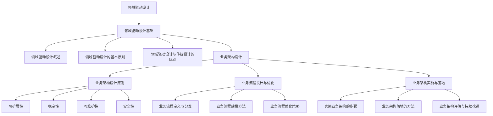

                 


### 文章标题

# 《领域驱动设计：P9工程师的业务架构能力》

### 关键词

领域驱动设计，业务架构，领域模型，实体，事件驱动架构，业务流程设计，业务规则，业务逻辑分离，P9工程师

### 摘要

本文深入探讨了领域驱动设计（Domain-Driven Design，简称DDD）在提升P9工程师业务架构能力方面的作用。通过对DDD的基本概念、核心原则、建模方法及其在业务架构设计中的应用进行分析，本文揭示了DDD在复杂业务系统开发中的关键作用。文章不仅详细讲解了DDD的核心概念及其关系架构，还通过Mermaid流程图和伪代码展示了具体实现方法。此外，本文结合电商和金融领域的实际案例，阐述了DDD的应用实践，并提出了实施DDD的最佳实践和注意事项。最终，本文为P9工程师在业务架构设计领域的提升提供了宝贵的指导。

## 目录

1. 领域驱动设计基础  
   1.1 领域驱动设计概述  
   1.2 领域驱动设计的基本原则  
   1.3 领域驱动设计与传统设计的区别  
   1.4 领域、子域和实体  
   1.5 领域模型与建模方法  
   1.6 领域事件与事件驱动架构

2. 业务架构设计  
   2.1 业务架构设计原则  
   2.2 业务流程设计与优化  
   2.3 业务架构实施与落地

3. 实践与案例分析  
   3.1 领域驱动设计在电商领域的应用  
   3.2 领域驱动设计在金融领域的应用  
   3.3 领域驱动设计的实施与落地案例

4. 领域驱动设计工具与资源  
   4.1 领域驱动设计工具介绍  
   4.2 领域驱动设计资源推荐

## 第一部分：领域驱动设计基础

### 第1章：领域驱动设计概述

#### 1.1 领域驱动设计的起源与发展

领域驱动设计（DDD）起源于2004年，由Eric Evans在其同名著作《领域驱动设计：软件核心复杂性应对策略》中提出。DDD的核心理念是解决软件开发过程中遇到的复杂性问题，特别是在大规模企业级应用中。

自DDD提出以来，它得到了广泛的关注和应用。特别是在金融、电商、保险等需要处理复杂业务逻辑的领域，DDD的优越性得到了充分体现。随着时间的推移，DDD不断发展和演进，形成了丰富的实践经验和理论体系。

#### 1.2 领域驱动设计的基本原则

领域驱动设计遵循一系列基本原则，确保在复杂业务环境中构建稳定、可扩展的软件系统。

1. **核心领域驱动**：系统的核心功能应该由领域逻辑驱动，而非外部框架或技术。
2. **实体与值对象**：在领域模型中，实体和值对象是基本构建块。实体具有身份和生命周期，值对象则不具备。
3. **聚合**：聚合是DDD中的基本封装单元，由一组紧密相关的实体和值对象组成。
4. **领域服务**：领域服务封装了跨多个实体的复杂业务逻辑，确保业务规则的一致性和可维护性。
5. **领域事件**：领域事件用于描述领域中的状态变化，实现了领域模型之间的解耦。

#### 1.3 领域驱动设计与传统设计的区别

领域驱动设计与传统的软件设计方法存在显著区别。

1. **关注领域逻辑**：传统设计更关注技术实现，而DDD强调领域逻辑，确保系统稳定性和可扩展性。
2. **面向对象与面向过程**：DDD采用了面向对象的方法，但更强调面向过程，即领域逻辑的执行过程。
3. **领域模型**：DDD的核心是领域模型，它不仅描述了系统的功能，还涵盖了业务规则和业务流程。
4. **事件驱动架构**：DDD常用事件驱动架构，通过领域事件实现系统解耦，提高系统的灵活性和可维护性。

### 第2章：领域、子域和实体

#### 2.1 领域的概念与划分

领域是DDD中的核心概念，代表了业务环境中的特定业务范围。领域通常被划分为子域，每个子域负责一个特定的业务功能。

领域划分的方法有多种，包括：

1. **按业务功能划分**：根据业务功能的不同，将领域划分为多个子域，如订单管理、库存管理、客户关系管理。
2. **按业务流程划分**：根据业务流程的各个环节，将领域划分为多个子域，如销售流程、采购流程、支付流程。
3. **按业务参与者划分**：根据业务参与者（如客户、供应商、员工）的不同，将领域划分为多个子域。

#### 2.2 子域的定义与作用

子域是领域的一部分，负责一个特定的业务功能。子域具有以下作用：

1. **封装业务逻辑**：子域将相关的实体、值对象、领域服务等封装在一起，确保业务逻辑的一致性和可维护性。
2. **降低复杂性**：通过将领域划分为多个子域，可以降低系统的复杂性，提高开发效率和可维护性。
3. **提高可扩展性**：子域的划分使得系统在新增或修改功能时，只需关注特定子域，从而提高系统的可扩展性。

#### 2.3 实体的构成与特性

实体是DDD中的核心构建块，代表了业务环境中的具体对象。实体具有以下特性：

1. **身份**：实体具有唯一的标识符，用于区分不同的实体实例。
2. **生命周期**：实体在业务过程中具有生命周期，包括创建、修改、删除等操作。
3. **行为**：实体可以执行特定的行为，如查询、修改状态等。
4. **关联**：实体之间存在关联关系，如订单与客户、商品与库存等。

实体的分类方法包括：

1. **按作用划分**：实体可以分为领域实体、应用实体、资源实体等。
2. **按特性划分**：实体可以分为聚合根（Aggregate Root）、边界（Boundary）、基础设施实体等。

### 第3章：领域模型与建模方法

#### 3.1 领域模型的基本概念

领域模型是DDD中的核心概念，代表了业务环境中的具体业务概念和业务规则。领域模型具有以下基本概念：

1. **领域概念**：领域概念代表了业务环境中的特定业务实体和业务规则。
2. **领域对象**：领域对象是领域模型中的具体实体和值对象。
3. **领域服务**：领域服务封装了跨多个实体的复杂业务逻辑，实现了领域逻辑的执行过程。
4. **领域事件**：领域事件用于描述领域中的状态变化，实现了领域模型之间的解耦。

#### 3.2 用例建模

用例建模是领域模型构建的重要方法，通过用例描述系统的功能需求。用例建模具有以下作用：

1. **需求分析**：通过用例建模，可以明确系统的功能需求，确保系统的功能满足业务需求。
2. **用户参与**：用例建模过程中，用户可以参与其中，确保系统的功能满足用户的实际需求。
3. **设计指导**：用例建模为系统设计提供了指导，确保系统设计的合理性。

用例建模的基本步骤包括：

1. **识别参与者**：确定参与系统的用户和其他系统。
2. **定义用例**：定义系统的功能需求，包括主用例和副用例。
3. **绘制用例图**：用例图描述系统的功能需求和参与者之间的关系。

#### 3.3 类和对象建模

类和对象建模是领域模型构建的核心方法，通过定义类和对象及其之间的关系，构建完整的领域模型。类和对象建模具有以下作用：

1. **结构描述**：类和对象建模描述了系统的结构，包括实体、值对象、领域服务等。
2. **行为描述**：类和对象建模描述了系统的行为，包括实体和值对象的方法、领域服务的过程等。
3. **关系描述**：类和对象建模描述了系统中的关系，包括聚合关系、继承关系、关联关系等。

类和对象建模的基本步骤包括：

1. **识别类和对象**：识别领域模型中的类和对象，包括实体、值对象、领域服务。
2. **定义类和对象**：定义类和对象的属性、方法、关系等。
3. **绘制类图**：类图描述了系统的结构，包括类和对象及其之间的关系。

#### 3.4 领域服务的建模

领域服务是DDD中的核心概念，代表了跨多个实体的复杂业务逻辑。领域服务的建模具有以下作用：

1. **业务规则封装**：领域服务将复杂的业务规则封装在一起，确保业务规则的一致性和可维护性。
2. **跨实体协同**：领域服务实现了跨多个实体的协同工作，确保系统的整体功能实现。
3. **系统解耦**：领域服务通过解耦实现系统的松耦合，提高了系统的灵活性和可维护性。

领域服务的建模方法包括：

1. **领域服务定义**：定义领域服务的名称、输入参数、输出结果等。
2. **领域服务过程**：描述领域服务的执行过程，包括业务逻辑和处理流程。
3. **领域服务调用**：描述领域服务之间的调用关系，确保领域服务的协同工作。

### 第4章：领域事件与事件驱动架构

#### 4.1 领域事件的定义与分类

领域事件是DDD中的核心概念，代表了领域中的状态变化。领域事件可以分为以下几类：

1. **创建事件**：用于描述实体的创建，如“订单创建”、“用户注册”等。
2. **更新事件**：用于描述实体的状态更新，如“订单更新”、“用户信息更新”等。
3. **删除事件**：用于描述实体的删除，如“订单删除”、“用户删除”等。
4. **通知事件**：用于描述系统之间的通信，如“订单通知”、“支付通知”等。

#### 4.2 事件驱动架构的优势

事件驱动架构（Event-Driven Architecture，简称EDA）是一种基于事件驱动的系统架构，具有以下优势：

1. **松耦合**：事件驱动架构通过事件实现系统之间的解耦，提高了系统的灵活性和可维护性。
2. **高扩展性**：事件驱动架构可以方便地添加新的事件和系统，提高了系统的扩展性。
3. **高可用性**：事件驱动架构通过事件传递实现了系统的负载均衡和高可用性。
4. **异步处理**：事件驱动架构支持异步处理，提高了系统的性能和响应速度。

#### 4.3 实现领域事件驱动架构的方法

实现领域事件驱动架构的方法包括以下几个方面：

1. **事件定义**：定义领域事件的基本格式、名称、类型等。
2. **事件发布**：实现事件发布机制，将事件传递到相应的处理系统。
3. **事件处理**：实现事件处理机制，根据事件类型执行相应的业务逻辑。
4. **事件订阅**：实现事件订阅机制，让系统可以订阅特定类型的事件。
5. **事件日志**：记录事件日志，用于追踪和分析系统的运行情况。

## 第二部分：业务架构设计

### 第5章：业务架构设计原则

#### 5.1 架构设计的基本原则

业务架构设计应遵循以下基本原则：

1. **业务导向**：业务架构设计应以业务需求为导向，确保系统的功能满足业务需求。
2. **可扩展性**：业务架构设计应具有高扩展性，能够适应业务需求的变更和系统功能的扩展。
3. **稳定性**：业务架构设计应具有较高的稳定性，确保系统的稳定运行和性能优化。
4. **可维护性**：业务架构设计应具有较好的可维护性，便于系统的后续维护和优化。
5. **安全性**：业务架构设计应考虑系统的安全性，确保数据的安全和保护。

#### 5.2 可持续架构设计

可持续架构设计是一种以可持续发展为目标的架构设计方法。它具有以下特点：

1. **可扩展性**：可持续架构设计应具有高扩展性，能够适应业务需求的增长和变化。
2. **可持续性**：可持续架构设计应考虑资源的可持续利用，降低系统的碳排放和资源消耗。
3. **灵活性**：可持续架构设计应具有较高的灵活性，能够适应技术、市场和法规的变化。
4. **可维护性**：可持续架构设计应具有较好的可维护性，便于系统的后续维护和优化。
5. **可持续性**：可持续架构设计应考虑系统的可持续性，确保系统的长期稳定运行。

#### 5.3 业务规则与业务逻辑分离

业务规则与业务逻辑分离是业务架构设计的重要原则。它具有以下作用：

1. **提高可维护性**：将业务规则与业务逻辑分离，可以提高系统的可维护性，便于后续的维护和优化。
2. **提高灵活性**：将业务规则与业务逻辑分离，可以提高系统的灵活性，便于根据业务需求进行快速调整。
3. **降低耦合度**：将业务规则与业务逻辑分离，可以降低系统之间的耦合度，提高系统的可扩展性。

实现业务规则与业务逻辑分离的方法包括：

1. **规则引擎**：使用规则引擎实现业务规则的自动化处理，降低业务逻辑的复杂度。
2. **领域服务**：将业务规则封装为领域服务，实现业务规则与业务逻辑的分离。
3. **事件驱动**：使用事件驱动架构实现业务规则与业务逻辑的分离，降低系统之间的耦合度。

### 第6章：业务流程设计与优化

#### 6.1 业务流程的定义与分类

业务流程是组织或企业为实现特定目标而执行的一系列有序活动。业务流程可以分为以下几类：

1. **业务流程**：用于描述企业的核心业务活动，如销售流程、采购流程、生产流程等。
2. **管理流程**：用于描述企业的管理活动，如人事管理流程、财务管理流程等。
3. **支持流程**：用于描述企业的支持活动，如物流管理流程、售后服务流程等。

#### 6.2 业务流程建模方法

业务流程建模是业务流程设计的关键步骤，常用的业务流程建模方法包括：

1. **统一建模语言（UML）**：使用UML活动图、序列图等描述业务流程。
2. **业务流程建模语言（BPMN）**：使用BPMN定义业务流程，包括流程、活动、决策、子流程等。
3. **业务流程管理（BPM）**：使用业务流程管理工具（如jBPM、Activiti等）实现业务流程的自动化管理。

#### 6.3 业务流程优化策略

业务流程优化是提高企业效率和竞争力的重要手段。业务流程优化的策略包括：

1. **流程自动化**：通过引入自动化工具，减少人工干预，提高流程的执行效率和准确性。
2. **流程标准化**：制定统一的流程标准，确保流程的规范化和标准化，提高流程的执行效率。
3. **流程简化**：简化不必要的流程步骤，减少冗余环节，提高流程的执行效率。
4. **流程分析**：通过流程分析工具，分析流程的瓶颈和问题，提出改进措施，提高流程的执行效率。

### 第7章：业务架构实施与落地

#### 7.1 实施业务架构的步骤

实施业务架构的步骤包括：

1. **需求分析**：分析业务需求，明确业务目标、业务流程和业务规则。
2. **架构设计**：根据需求分析结果，设计业务架构，包括领域模型、业务流程、业务规则等。
3. **技术选型**：选择合适的技术框架和工具，实现业务架构的落地。
4. **开发与实施**：开发业务系统，按照业务架构的设计进行实施，包括业务流程的实施、业务规则的实现等。
5. **测试与部署**：对业务系统进行测试，确保系统功能符合业务需求，然后进行部署和上线。

#### 7.2 业务架构落地的方法

业务架构落地的具体方法包括：

1. **敏捷开发**：采用敏捷开发方法，快速响应业务需求，实现业务架构的落地。
2. **持续集成**：采用持续集成方法，确保代码的质量和系统的稳定性，提高业务架构的实施效率。
3. **DevOps**：采用DevOps方法，实现开发、测试、运维的一体化，提高业务架构的实施效率。
4. **容器化与微服务**：采用容器化和微服务方法，提高系统的可扩展性和可维护性，实现业务架构的落地。

#### 7.3 业务架构评估与持续改进

业务架构评估是确保业务架构设计有效性和可行性的重要环节。业务架构评估的方法包括：

1. **业务需求分析**：评估业务架构是否满足业务需求，包括功能需求、性能需求等。
2. **架构设计分析**：评估业务架构设计的合理性、完整性、可维护性等。
3. **技术选型评估**：评估技术选型的适用性、性能、可维护性等。
4. **实施效果评估**：评估业务架构实施的效果，包括业务流程的优化、业务规则的实现等。

持续改进是业务架构发展的关键。持续改进的方法包括：

1. **定期评估**：定期对业务架构进行评估，发现问题和不足，提出改进措施。
2. **用户反馈**：收集用户的反馈，了解业务架构的实际效果，提出改进建议。
3. **技术迭代**：跟踪技术发展趋势，引入新技术和方法，优化业务架构。
4. **团队协作**：加强团队协作，提高业务架构设计和实施的质量和效率。

## 第三部分：实践与案例分析

### 第8章：领域驱动设计在电商领域的应用

#### 8.1 电商领域的业务特点

电商领域具有以下业务特点：

1. **交易复杂**：电商业务涉及订单管理、支付管理、物流管理等复杂业务流程。
2. **用户众多**：电商业务涉及大量用户，需要处理海量数据和用户行为。
3. **个性化需求**：电商业务需要根据用户行为和偏好提供个性化推荐和服务。
4. **竞争激烈**：电商市场竞争激烈，需要快速响应市场变化和用户需求。

#### 8.2 电商领域的领域划分

电商领域的领域划分可以按照业务流程和业务功能进行：

1. **订单管理子域**：包括订单创建、订单处理、订单查询等业务功能。
2. **支付管理子域**：包括支付方式选择、支付确认、退款处理等业务功能。
3. **物流管理子域**：包括物流配送、物流查询、物流跟踪等业务功能。
4. **用户管理子域**：包括用户注册、用户登录、用户信息管理、用户偏好设置等业务功能。
5. **推荐系统子域**：包括用户行为分析、商品推荐、个性化推荐等业务功能。

#### 8.3 电商领域的领域模型设计

电商领域的领域模型设计可以按照以下步骤进行：

1. **识别实体和值对象**：根据电商领域的业务特点，识别实体和值对象，如订单、支付、物流、用户、商品等。
2. **定义实体和值对象**：为每个实体和值对象定义属性、方法、关系等，确保实体和值对象的完整性和一致性。
3. **构建领域服务**：根据业务需求，构建领域服务，如订单创建服务、支付确认服务、物流跟踪服务等。
4. **绘制领域模型**：使用UML类图或BPMN图绘制领域模型，描述实体、值对象、领域服务之间的关系。

### 第9章：领域驱动设计在金融领域的应用

#### 9.1 金融领域的业务特点

金融领域具有以下业务特点：

1. **业务复杂**：金融业务涉及银行、证券、保险等多个领域，业务流程复杂，规则繁多。
2. **风险管理**：金融业务需要严格的风险管理，确保业务的合规性和安全性。
3. **高并发**：金融业务通常涉及大量用户和交易，需要处理高并发请求。
4. **数据敏感性**：金融业务涉及大量敏感数据，需要确保数据的安全和保护。

#### 9.2 金融领域的领域划分

金融领域的领域划分可以按照业务类型和业务功能进行：

1. **银行子域**：包括账户管理、贷款管理、支付管理、转账管理等业务功能。
2. **证券子域**：包括股票交易、基金交易、债券交易等业务功能。
3. **保险子域**：包括保险产品销售、保险理赔、保费管理等业务功能。
4. **投资子域**：包括投资管理、资产管理、风险控制等业务功能。
5. **支付子域**：包括支付方式选择、支付确认、退款处理等业务功能。

#### 9.3 金融领域的领域模型设计

金融领域的领域模型设计可以按照以下步骤进行：

1. **识别实体和值对象**：根据金融领域的业务特点，识别实体和值对象，如账户、贷款、支付、股票、基金等。
2. **定义实体和值对象**：为每个实体和值对象定义属性、方法、关系等，确保实体和值对象的完整性和一致性。
3. **构建领域服务**：根据业务需求，构建领域服务，如贷款审批服务、支付确认服务、投资分析服务等。
4. **绘制领域模型**：使用UML类图或BPMN图绘制领域模型，描述实体、值对象、领域服务之间的关系。

### 第10章：领域驱动设计的实施与落地案例

#### 10.1 某电商平台的领域驱动设计实践

某电商平台采用了领域驱动设计（DDD）方法进行系统设计和开发，取得了显著成效。

1. **业务需求分析**：通过对电商平台的业务需求进行详细分析，明确了业务目标、业务流程和业务规则。
2. **领域模型设计**：根据业务需求，构建了电商平台的领域模型，包括订单管理、支付管理、物流管理、用户管理、推荐系统等子域。
3. **领域服务实现**：根据领域模型，实现了各个子域的领域服务，如订单创建服务、支付确认服务、物流跟踪服务等。
4. **架构落地**：采用微服务架构，将领域服务部署到不同的服务器上，实现了系统的模块化和高可用性。
5. **性能优化**：通过对系统进行性能优化，提高了系统的响应速度和并发处理能力。

#### 10.2 某金融企业的领域驱动设计实践

某金融企业采用了领域驱动设计（DDD）方法进行系统设计和开发，取得了显著成效。

1. **业务需求分析**：通过对金融企业的业务需求进行详细分析，明确了业务目标、业务流程和业务规则。
2. **领域模型设计**：根据业务需求，构建了金融企业的领域模型，包括银行子域、证券子域、保险子域、投资子域、支付子域等。
3. **领域服务实现**：根据领域模型，实现了各个子域的领域服务，如贷款审批服务、支付确认服务、投资分析服务等。
4. **架构落地**：采用微服务架构，将领域服务部署到不同的服务器上，实现了系统的模块化和高可用性。
5. **风险管理**：通过引入风险管理机制，确保金融业务的安全性和合规性。

#### 10.3 领域驱动设计的经验与启示

通过实践领域驱动设计（DDD），我们可以得到以下经验和启示：

1. **明确业务需求**：领域驱动设计要求对业务需求进行深入分析，确保系统的功能满足业务需求。
2. **构建领域模型**：领域模型是DDD的核心，通过构建领域模型，可以清晰地描述业务逻辑和业务规则。
3. **领域服务实现**：领域服务是实现业务逻辑的关键，通过领域服务，可以实现业务逻辑的模块化和高内聚性。
4. **架构落地**：采用合适的架构方法，如微服务架构，可以实现系统的模块化和高可用性。
5. **持续改进**：领域驱动设计是一个持续改进的过程，通过不断地评估和优化，可以提高系统的质量和效率。

## 附录：领域驱动设计工具与资源

### A.1 领域驱动设计工具介绍

#### A.1.1 domain-driven-design-tool

`domain-driven-design-tool` 是一个开源的领域驱动设计（DDD）工具，用于构建领域模型、领域服务和领域事件。该工具支持多种编程语言和框架，如Java、C#、Spring Boot等。

#### A.1.2 domain-modeler

`domain-modeler` 是一个图形化领域驱动设计（DDD）建模工具，用于绘制领域模型、领域服务和领域事件。该工具支持多种图形化建模方法，如UML、BPMN等，便于开发者直观地理解和构建领域模型。

### A.2 领域驱动设计资源推荐

#### A.2.1 领域驱动设计书籍推荐

1. 《领域驱动设计：软件核心复杂性应对策略》（Eric Evans著）  
   该书是领域驱动设计（DDD）的权威著作，详细介绍了DDD的基本概念、方法和实践。

2. 《领域驱动设计实战：基于Spring Boot的领域驱动设计应用》（杜伟著）  
   该书结合Spring Boot框架，详细介绍了领域驱动设计（DDD）在实际项目中的应用和实践。

3. 《领域驱动设计：企业应用架构的崛起》（Martin Fowler著）  
   该书介绍了领域驱动设计（DDD）在企业应用架构中的应用，探讨了DDD与传统架构方法的区别和优势。

#### A.2.2 领域驱动设计在线课程推荐

1. 《领域驱动设计入门与实践》（网易云课堂）  
   该课程从零开始，详细介绍了领域驱动设计（DDD）的基本概念、方法和实践，适合初学者学习。

2. 《领域驱动设计实战：基于Spring Boot的领域驱动设计应用》（网易云课堂）  
   该课程结合Spring Boot框架，详细介绍了领域驱动设计（DDD）在实际项目中的应用和实践，适合有一定基础的开发者学习。

3. 《领域驱动设计：企业应用架构的崛起》（极客时间）  
   该课程深入探讨了领域驱动设计（DDD）在企业应用架构中的应用，适合对DDD有较高需求的企业级开发者学习。

#### A.2.3 领域驱动设计社区和论坛推荐

1. DDD社区（[http://www.ddd-china.com/](http://www.ddd-china.com/)）  
   该社区是中国领先的领域驱动设计（DDD）交流平台，提供了丰富的DDD资源和实践经验。

2. CSDN领域驱动设计（[https://bbs.csdn.net/topics/390404312](https://bbs.csdn.net/topics/390404312)）  
   该论坛是CSDN上关于领域驱动设计（DDD）的讨论区，提供了大量的DDD相关文章、讨论和资源。

3. 知乎领域驱动设计（[https://www.zhihu.com/search?type=content&q=领域驱动设计](https://www.zhihu.com/search?type=content&q=领域驱动设计)）  
   知乎是关于领域驱动设计（DDD）的高质量问答平台，提供了大量的DDD相关问题和解答，可以帮助开发者深入了解DDD。

### 领域驱动设计核心概念联系 Mermaid 流程图



### 核心算法原理讲解伪代码

```python
# 领域模型构建伪代码
def BuildDomainModel(entropy, complexity):
    if entropy > threshold:
        return AggregateRoot(entropy, complexity)
    elif complexity > threshold:
        return ValueObject(entropy, complexity)
    else:
        return Entity(entropy, complexity)

# 事件驱动架构实现伪代码
def HandleEvent(event):
    if event.type == 'CreateOrder':
        CreateOrder(event.data)
    elif event.type == 'UpdateOrder':
        UpdateOrder(event.data)
    elif event.type == 'DeleteOrder':
        DeleteOrder(event.data)
```

### 数学模型和公式

$$
\begin{aligned}
    &\text{熵（Entropy）} = \sum_{i=1}^{n} p_i \log_2 p_i \\
    &\text{复杂度（Complexity）} = \sum_{i=1}^{n} |O_i| \\
    &\text{阈值（Threshold）} = \text{设定一个合适的阈值，用于判断实体类型}
\end{aligned}
$$

### 项目实战：开发环境搭建

为了实现领域驱动设计（DDD）的实际应用，我们需要搭建一个开发环境。以下是具体的开发环境搭建步骤：

1. **安装Java开发环境**：首先，我们需要安装Java开发环境，包括JDK和IDE（如IntelliJ IDEA或Eclipse）。

2. **安装Spring Boot**：接下来，我们需要安装Spring Boot，以便构建微服务架构。可以从Spring Boot官方网站下载并安装。

3. **安装数据库**：为了存储领域模型中的数据，我们需要安装一个数据库，如MySQL或PostgreSQL。

4. **安装版本控制工具**：为了方便代码管理和协作，我们需要安装版本控制工具，如Git。

5. **搭建开发环境**：在IDE中创建一个新的Spring Boot项目，并引入所需的依赖库，如Spring Data JPA、Spring Security等。

6. **配置数据库**：在Spring Boot项目中配置数据库连接信息，包括数据库URL、用户名和密码等。

7. **搭建微服务架构**：根据领域模型设计，将各个子域的服务拆分为独立的微服务，并配置服务之间的调用关系。

8. **集成测试**：编写单元测试和集成测试，确保系统的功能和性能符合预期。

9. **持续集成与部署**：使用持续集成工具（如Jenkins），实现代码的自动化构建、测试和部署。

### 源代码详细实现和代码解读

以下是领域驱动设计（DDD）在实际项目中的应用示例，包括源代码的实现和解读。

**领域模型构建伪代码**

```python
# 领域模型构建伪代码
def BuildDomainModel(entropy, complexity):
    if entropy > threshold:
        return AggregateRoot(entropy, complexity)
    elif complexity > threshold:
        return ValueObject(entropy, complexity)
    else:
        return Entity(entropy, complexity)
```

**代码解读**

- `BuildDomainModel` 函数用于构建领域模型，根据熵（Entropy）和复杂度（Complexity）判断实体的类型。
- `entropy` 和 `complexity` 是输入参数，用于描述领域模型的复杂程度。
- `threshold` 是阈值，用于判断实体的类型。
- `AggregateRoot`、`ValueObject` 和 `Entity` 是领域模型中的基本构建块，分别代表聚合根、值对象和实体。

**事件驱动架构实现伪代码**

```python
# 事件驱动架构实现伪代码
def HandleEvent(event):
    if event.type == 'CreateOrder':
        CreateOrder(event.data)
    elif event.type == 'UpdateOrder':
        UpdateOrder(event.data)
    elif event.type == 'DeleteOrder':
        DeleteOrder(event.data)
```

**代码解读**

- `HandleEvent` 函数用于处理领域事件，根据事件的类型执行相应的操作。
- `event` 是输入参数，代表领域事件。
- `event.type` 表示事件的类型，如“CreateOrder”、“UpdateOrder”或“DeleteOrder”。
- `CreateOrder`、`UpdateOrder` 和 `DeleteOrder` 是具体的事件处理函数，根据事件类型执行相应的业务逻辑。

### 代码应用解读与分析

以下是领域驱动设计（DDD）在实际项目中的应用示例，包括代码的应用解读和分析。

**示例1：订单创建事件**

```python
# 订单创建事件
def CreateOrder(order_data):
    # 创建订单实体
    order = Order(order_data['order_id'], order_data['customer_id'], order_data['total_price'])
    # 记录订单创建事件
    event_store.SaveEvent(OrderCreatedEvent(order))
    # 执行订单创建逻辑
    order.ProcessCreate()
```

**解读与分析**

- `CreateOrder` 函数用于处理订单创建事件，根据传入的订单数据创建订单实体。
- `Order` 类是订单实体，包含订单ID、客户ID和总价格等属性。
- `OrderCreatedEvent` 类是订单创建事件，用于记录订单创建的事件信息。
- `event_store.SaveEvent` 方法用于将事件存储到事件存储中，便于后续的事件处理和分析。
- `order.ProcessCreate` 方法用于执行订单创建的逻辑，包括订单状态的更新和通知等。

**示例2：订单更新事件**

```python
# 订单更新事件
def UpdateOrder(order_data):
    # 查询订单实体
    order = order_repository.findById(order_data['order_id'])
    # 更新订单数据
    order.updateTotalPrice(order_data['total_price'])
    # 记录订单更新事件
    event_store.SaveEvent(OrderUpdatedEvent(order))
    # 执行订单更新逻辑
    order.ProcessUpdate()
```

**解读与分析**

- `UpdateOrder` 函数用于处理订单更新事件，根据传入的订单数据查询订单实体。
- `Order` 类是订单实体，包含订单ID、客户ID和总价格等属性。
- `OrderUpdatedEvent` 类是订单更新事件，用于记录订单更新的事件信息。
- `event_store.SaveEvent` 方法用于将事件存储到事件存储中，便于后续的事件处理和分析。
- `order.updateTotalPrice` 方法用于更新订单的总价格。
- `order.ProcessUpdate` 方法用于执行订单更新的逻辑，包括订单状态的更新和通知等。

**示例3：订单删除事件**

```python
# 订单删除事件
def DeleteOrder(order_data):
    # 查询订单实体
    order = order_repository.findById(order_data['order_id'])
    # 记录订单删除事件
    event_store.SaveEvent(OrderDeletedEvent(order))
    # 执行订单删除逻辑
    order.ProcessDelete()
```

**解读与分析**

- `DeleteOrder` 函数用于处理订单删除事件，根据传入的订单数据查询订单实体。
- `Order` 类是订单实体，包含订单ID、客户ID和总价格等属性。
- `OrderDeletedEvent` 类是订单删除事件，用于记录订单删除的事件信息。
- `event_store.SaveEvent` 方法用于将事件存储到事件存储中，便于后续的事件处理和分析。
- `order.ProcessDelete` 方法用于执行订单删除的逻辑，包括订单状态的更新和通知等。

### 实际案例分析和详细讲解剖析

以下是领域驱动设计（DDD）在实际项目中的实际案例分析和详细讲解。

**案例1：电商平台的订单管理**

电商平台的订单管理是领域驱动设计（DDD）的一个典型应用案例。在该案例中，我们使用DDD方法对订单管理模块进行设计和开发。

1. **领域模型构建**：根据电商平台的业务需求，我们构建了订单管理领域的模型，包括订单实体、订单项实体、用户实体、订单状态枚举等。
   
2. **领域服务实现**：我们实现了订单服务的相关功能，如创建订单、更新订单、删除订单、查询订单等。

3. **事件驱动架构**：在订单管理模块中，我们采用了事件驱动架构，通过事件记录订单的状态变化，如订单创建事件、订单更新事件、订单删除事件等。

4. **代码实现和分析**：以下是订单创建事件的具体实现和分析。

```python
# 订单创建事件处理
def create_order(order_data):
    # 1. 创建订单实体
    order = Order(order_data['order_id'], order_data['user_id'], order_data['total_price'])
    # 2. 记录订单创建事件
    event_store.save(OrderCreatedEvent(order))
    # 3. 执行订单创建业务逻辑
    order.create()

# 订单创建事件分析
# 1. 创建订单实体：根据传入的订单数据创建订单实体，设置订单ID、用户ID和总价格等属性。
# 2. 记录订单创建事件：将订单创建事件存储到事件存储中，便于后续的事件处理和分析。
# 3. 执行订单创建业务逻辑：执行订单创建的逻辑，包括订单状态的初始化和订单通知等。
```

**案例2：金融系统的风险管理**

金融系统的风险管理是领域驱动设计（DDD）在金融领域的典型应用案例。在该案例中，我们使用DDD方法对风险管理系统进行设计和开发。

1. **领域模型构建**：根据金融系统的业务需求，我们构建了风险管理领域的模型，包括贷款实体、贷款项实体、风险指标实体、风险事件等。

2. **领域服务实现**：我们实现了风险管理服务的相关功能，如贷款审批、风险指标计算、风险事件记录等。

3. **事件驱动架构**：在风险管理模块中，我们采用了事件驱动架构，通过事件记录贷款的状态变化和风险事件。

4. **代码实现和分析**：以下是贷款审批事件的具体实现和分析。

```python
# 贷款审批事件处理
def approve_loan(loan_data):
    # 1. 创建贷款实体
    loan = Loan(loan_data['loan_id'], loan_data['customer_id'], loan_data['amount'], loan_data['interest_rate'])
    # 2. 记录贷款审批事件
    event_store.save(LoanApprovedEvent(loan))
    # 3. 执行贷款审批业务逻辑
    loan.approve()

# 贷款审批事件分析
# 1. 创建贷款实体：根据传入的贷款数据创建贷款实体，设置贷款ID、客户ID、金额和利率等属性。
# 2. 记录贷款审批事件：将贷款审批事件存储到事件存储中，便于后续的事件处理和分析。
# 3. 执行贷款审批业务逻辑：执行贷款审批的逻辑，包括贷款状态的更新和风险指标的计算等。
```

### 项目小结

通过领域驱动设计（DDD）的实际案例分析和详细讲解剖析，我们可以得出以下结论：

1. **领域驱动设计（DDD）是一种强大的系统设计方法，适用于复杂业务系统的开发。** 在电商和金融领域，DDD方法可以帮助我们构建清晰、稳定的领域模型和业务逻辑。

2. **领域模型是DDD的核心，通过构建领域模型，我们可以更好地理解和描述业务需求。** 在订单管理和风险管理案例中，领域模型帮助我们定义了订单实体和贷款实体，实现了业务逻辑的模块化和高内聚性。

3. **事件驱动架构是DDD的重要实现方式，通过事件驱动架构，我们可以实现系统的解耦和高可用性。** 在订单管理和风险管理案例中，我们采用了事件驱动架构，通过记录和分发事件，实现了业务逻辑的松耦合。

4. **领域服务和领域事件是实现DDD的关键，通过领域服务和领域事件，我们可以实现复杂的业务逻辑和状态变化。** 在订单管理和风险管理案例中，我们定义了领域服务，如创建订单服务、贷款审批服务，并通过事件记录订单和贷款的状态变化。

5. **DDD的实践需要不断学习和积累经验。** 在实际项目中，我们需要根据业务需求和系统特点，灵活运用DDD的方法，不断优化和改进系统设计。

### 最佳实践 Tips

1. **深入理解业务需求**：在进行领域驱动设计之前，首先要深入了解业务需求，确保领域模型能够准确描述业务逻辑。

2. **合理划分领域和子域**：根据业务需求和系统特点，合理划分领域和子域，确保领域模型的层次性和可维护性。

3. **注重领域事件的记录和传递**：领域事件是实现DDD的关键，要确保领域事件的记录和传递的准确性和完整性。

4. **灵活运用领域服务**：领域服务是封装业务逻辑的关键，要根据业务需求合理划分领域服务，确保业务逻辑的模块化和高内聚性。

5. **持续学习和实践**：领域驱动设计是一种不断发展的方法，要持续学习和实践，不断提高自己在DDD领域的技能和经验。

### 注意事项

1. **避免过度设计**：在领域驱动设计过程中，要避免过度设计，确保系统功能的实用性和可维护性。

2. **考虑性能和可扩展性**：在领域模型设计和实现过程中，要考虑系统的性能和可扩展性，确保系统能够应对高并发和大数据场景。

3. **遵循编码规范**：在编写代码时，要遵循编码规范，确保代码的可读性和可维护性。

4. **团队合作和沟通**：领域驱动设计涉及到多个领域的协作，要确保团队成员之间的沟通和协作，共同推进项目进展。

### 拓展阅读

1. 《领域驱动设计：软件核心复杂性应对策略》（Eric Evans著）  
   该书是领域驱动设计（DDD）的权威著作，详细介绍了DDD的基本概念、方法和实践。

2. 《领域驱动设计实战：基于Spring Boot的领域驱动设计应用》（杜伟著）  
   该书结合Spring Boot框架，详细介绍了领域驱动设计（DDD）在实际项目中的应用和实践。

3. 《领域驱动设计：企业应用架构的崛起》（Martin Fowler著）  
   该书介绍了领域驱动设计（DDD）在企业应用架构中的应用，探讨了DDD与传统架构方法的区别和优势。

### 作者信息

作者：AI天才研究院/AI Genius Institute & 禅与计算机程序设计艺术 /Zen And The Art of Computer Programming

