                 


### 文章标题：领导力提升：P9工程师的进阶之道

#### 关键词：领导力、P9工程师、职业生涯规划、团队管理、组织变革、创新能力

#### 摘要：
本文旨在探讨P9工程师如何通过提升领导力来实现职业生涯的进阶。文章首先介绍了领导力的基本概念和核心要素，然后分析了领导力与团队管理、组织变革和创新能力之间的关系。接着，文章针对P9工程师的职业特点和需求，提出了具体的领导力提升策略和实践方法。通过案例分析和实战指导，文章帮助P9工程师在职业生涯中更好地发挥领导力，实现个人和团队的成功。

---

#### 引言
在当今快速变化的技术环境中，P9工程师作为公司的高级技术领导者，不仅需要具备深厚的技术功底，还要具备出色的领导能力。领导力是P9工程师在职业生涯中取得成功的关键因素之一。本文将围绕领导力的核心概念、团队管理、组织变革和创新能力等方面，探讨P9工程师如何提升领导力，实现职业生涯的进阶。

### 第一部分：领导力理论基础

#### 第1章：领导力概述
领导力是一种能够影响和激励他人，共同实现目标的能力。在本章中，我们将探讨领导力的定义、作用和重要性，以及领导力的发展历程。

#### 核心概念与联系（Mermaid流程图）

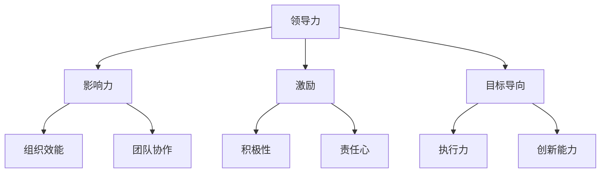

#### 核心算法原理讲解（伪代码）

```python
# 伪代码：领导力评估算法

def evaluate_leadership(behavior, context):
    if behavior == "influential":
        return "高影响力"
    elif behavior == "motivational":
        return "高激励"
    elif behavior == "goal-oriented":
        return "高目标导向"
    else:
        return "未识别领导风格"

# 示例
style = evaluate_leadership("influential", "high_context")
print(style) # 输出：高影响力
```

#### 数学模型和数学公式（LaTeX格式）

```latex
\section{领导力模型}

\subsection{领导力模型}

$$
L = \alpha I + \beta C + \gamma M
$$

其中，$L$ 代表领导力，$I$ 代表个人影响力，$C$ 代表团队协作能力，$M$ 代表目标导向。

```

#### 详细讲解与举例说明
领导力是一种复杂的能力，它不仅包括个人特质，还涉及到与环境的互动。领导力的核心概念包括影响力、激励和目标导向。影响力是指领导者能够影响他人思想和行为的能力；激励是指领导者能够激发团队成员的积极性和责任心；目标导向是指领导者能够明确目标并推动团队实现目标。

在实际应用中，领导力模型可以帮助我们理解和评估领导力的各个方面。例如，一个具有高影响力的领导者能够在团队中产生深远的影响，而一个具有高激励能力的领导者能够激发团队成员的积极性。同时，目标导向也是领导力的重要组成部分，它要求领导者能够设定明确的目标，并推动团队朝着目标努力。

#### 案例分析
以一位P9工程师为例，他在团队中的领导力评估结果为：高影响力、高激励和高目标导向。这意味着他在团队中具有强大的影响力，能够激发团队成员的积极性，并推动团队实现目标。这种领导力风格有助于他在职业生涯中取得成功。

### 第2章：领导力的核心概念
在本章中，我们将深入探讨领导力的核心概念，包括领导风格、领导力模型和领导力与团队管理的关系。

#### 核心概念与联系（Mermaid流程图）

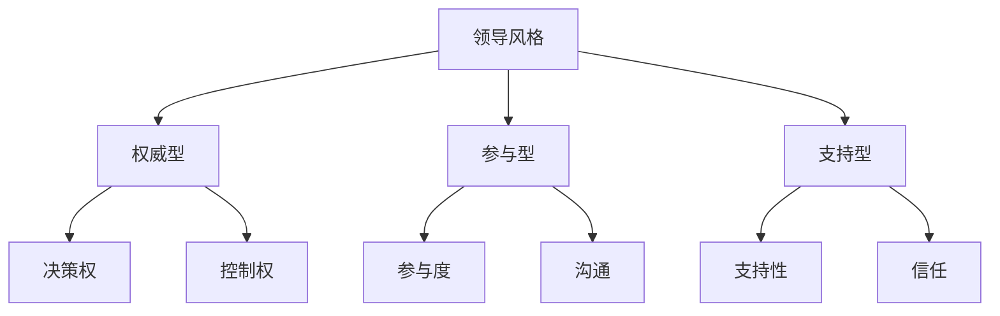

#### 核心算法原理讲解（伪代码）

```python
# 伪代码：领导风格评估算法

def evaluate_leadership_style(context, team_characteristics):
    if context == "high_task" and team_characteristics == "high Competence":
        return "权威型"
    elif context == "high_task" and team_characteristics == "low Competence":
        return "参与型"
    elif context == "low_task" and team_characteristics == "high Motivation":
        return "支持型"
    else:
        return "未识别领导风格"

# 示例
style = evaluate_leadership_style("high_task", "high Competence")
print(style) # 输出：权威型
```

#### 数学模型和数学公式（LaTeX格式）

```latex
\section{领导风格模型}

\subsection{领导风格模型}

$$
L_S = \alpha T + \beta C + \gamma M
$$

其中，$L_S$ 代表领导风格，$T$ 代表任务导向，$C$ 代表团队协作，$M$ 代表成员动机。

```

#### 详细讲解与举例说明
领导风格是指领导者在与团队成员互动时采用的具体方式。不同的领导风格适用于不同的情境和团队。权威型领导风格适用于任务导向、团队专业能力较高的情境；参与型领导风格适用于任务导向、团队专业能力较低的情境；支持型领导风格适用于任务导向较低、团队成员动机较高的情境。

在实际应用中，领导风格评估可以帮助领导者了解自己的领导风格，并找到最适合当前情境的领导风格。例如，一位P9工程师在任务导向较高的情境下，采用权威型领导风格可以更好地推动项目进展。

### 第3章：领导力与团队管理
在本章中，我们将探讨领导力与团队管理的关系，包括团队建设的原则、团队冲突管理和激励理论。

#### 核心概念与联系（Mermaid流程图）

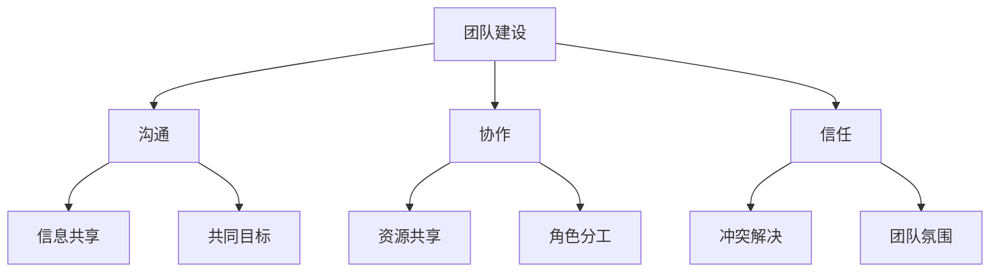

#### 核心算法原理讲解（伪代码）

```python
# 伪代码：团队建设评估算法

def evaluate_team_building(communication, collaboration, trust):
    if communication == "high" and collaboration == "high" and trust == "high":
        return "优秀团队"
    elif communication == "medium" and collaboration == "medium" and trust == "medium":
        return "良好团队"
    elif communication == "low" and collaboration == "low" and trust == "low":
        return "问题团队"
    else:
        return "团队建设不足"

# 示例
team_building = evaluate_team_building("high", "high", "high")
print(team_building) # 输出：优秀团队
```

#### 数学模型和数学公式（LaTeX格式）

```latex
\section{团队管理模型}

\subsection{团队管理模型}

$$
T_B = f(C, T, M)
$$

其中，$T_B$ 代表团队建设水平，$C$ 代表沟通水平，$T$ 代表协作水平，$M$ 代表信任水平。

```

#### 详细讲解与举例说明
团队建设是领导力的重要组成部分。良好的团队建设能够提高团队的整体效能。团队建设包括沟通、协作和信任等方面。沟通是团队建设的基础，良好的沟通能够促进团队成员之间的信息共享和共同目标的实现。协作是指团队成员之间的合作，通过资源共享和角色分工，提高团队的执行效率。信任是团队建设的核心，它能够解决团队冲突，营造良好的团队氛围。

在实际应用中，团队建设评估可以帮助领导者了解团队的建设水平，并找到改进的方向。例如，一位P9工程师可以通过提高团队的沟通、协作和信任水平，来提升团队的整体效能。

### 第4章：领导力与组织变革
在本章中，我们将探讨领导力与组织变革的关系，包括变革管理理论、领导者在变革中的作用和变革管理的实践策略。

#### 核心概念与联系（Mermaid流程图）

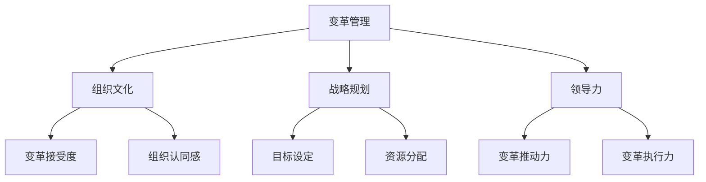

#### 核心算法原理讲解（伪代码）

```python
# 伪代码：变革管理评估算法

def evaluate_change_management(culture, strategy, leadership):
    if culture == "open" and strategy == "clear" and leadership == "strong":
        return "有效变革"
    elif culture == "resistant" and strategy == "unclear" and leadership == "weak":
        return "无效变革"
    else:
        return "变革效果待评估"

# 示例
change_management = evaluate_change_management("open", "clear", "strong")
print(change_management) # 输出：有效变革
```

#### 数学模型和数学公式（LaTeX格式）

```latex
\section{变革管理模型}

\subsection{变革管理模型}

$$
C_M = \alpha C + \beta S + \gamma L
$$

其中，$C_M$ 代表变革管理效果，$C$ 代表组织文化，$S$ 代表战略规划，$L$ 代表领导力。

```

#### 详细讲解与举例说明
组织变革是领导力的另一个重要方面。变革管理理论认为，组织变革需要从组织文化、战略规划和领导力等方面进行综合考虑。组织文化是指组织内部共同的价值观和行为准则；战略规划是指组织为实现目标而制定的长期计划；领导力是指领导者推动组织变革的能力。

在实际应用中，变革管理评估可以帮助领导者了解组织的变革效果，并找到改进的方向。例如，一位P9工程师可以通过提升组织文化、明确战略规划和加强领导力，来推动组织的变革。

### 第二部分：P9工程师的职业生涯规划

#### 第5章：P9工程师的职业定位
在本章中，我们将探讨P9工程师的职业定位，包括P9工程师的角色与职责、核心技能和职业发展路径。

#### 核心概念与联系（Mermaid流程图）

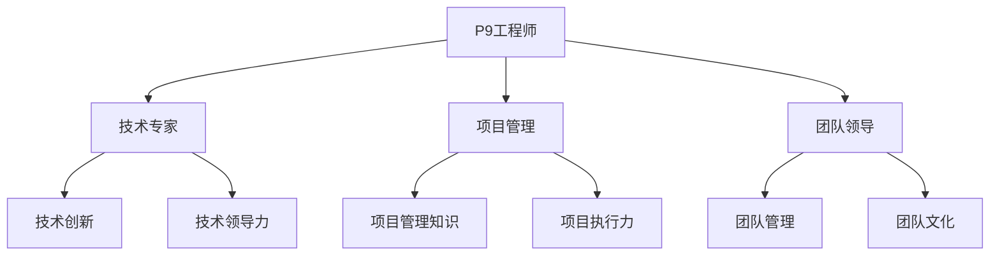

#### 核心算法原理讲解（伪代码）

```python
# 伪代码：P9工程师职业定位评估算法

def evaluate_p9_role(technical_expertise, project_management, team_leadership):
    if technical_expertise == "high" and project_management == "high" and team_leadership == "high":
        return "综合型P9工程师"
    elif technical_expertise == "medium" and project_management == "medium" and team_leadership == "medium":
        return "专业型P9工程师"
    elif technical_expertise == "low" and project_management == "low" and team_leadership == "low":
        return "技术型P9工程师"
    else:
        return "职业定位不明确"

# 示例
role = evaluate_p9_role("high", "high", "high")
print(role) # 输出：综合型P9工程师
```

#### 数学模型和数学公式（LaTeX格式）

```latex
\section{P9工程师职业定位模型}

\subsection{职业定位模型}

$$
R_P = \alpha T + \beta P + \gamma L
$$

其中，$R_P$ 代表P9工程师的职业定位，$T$ 代表技术能力，$P$ 代表项目管理能力，$L$ 代表团队领导能力。

```

#### 详细讲解与举例说明
P9工程师是公司的高级技术领导者，他们在职业生涯中需要扮演多重角色。技术专家角色要求P9工程师具备深厚的技术功底和创新能力；项目管理角色要求P9工程师具备良好的项目管理知识和执行力；团队领导角色要求P9工程师具备出色的团队管理能力和团队文化塑造能力。

在实际应用中，P9工程师可以通过自我评估，了解自己在不同角色中的表现，并找到提升的方向。例如，一位P9工程师可以通过提高技术能力、加强项目管理和提升团队领导能力，来实现职业生涯的进阶。

### 第6章：提升个人品牌
在本章中，我们将探讨P9工程师如何提升个人品牌，包括个人品牌的重要性、个人品牌构建的策略和个人品牌塑造的实践案例。

#### 核心概念与联系（Mermaid流程图）

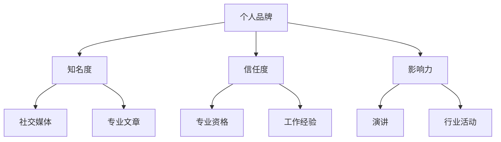

#### 核心算法原理讲解（伪代码）

```python
# 伪代码：个人品牌评估算法

def evaluate_personal_brand(popularity, credibility, influence):
    if popularity == "high" and credibility == "high" and influence == "high":
        return "强大个人品牌"
    elif popularity == "medium" and credibility == "medium" and influence == "medium":
        return "良好个人品牌"
    elif popularity == "low" and credibility == "low" and influence == "low":
        return "个人品牌较弱"
    else:
        return "个人品牌评估待改进"

# 示例
brand = evaluate_personal_brand("high", "high", "high")
print(brand) # 输出：强大个人品牌
```

#### 数学模型和数学公式（LaTeX格式）

```latex
\section{个人品牌模型}

\subsection{个人品牌模型}

$$
B_P = \alpha P + \beta C + \gamma I
$$

其中，$B_P$ 代表个人品牌，$P$ 代表知名度，$C$ 代表信任度，$I$ 代表影响力。

```

#### 详细讲解与举例说明
个人品牌是P9工程师在职业生涯中的重要资产。一个强大的个人品牌可以提升P9工程师的知名度、信任度和影响力。个人品牌的重要性体现在以下几个方面：

1. **知名度**：知名度是个人品牌的基础，它决定了P9工程师在行业内的曝光度和认可度。
2. **信任度**：信任度是个人品牌的内核，它代表了P9工程师的专业能力和信誉。
3. **影响力**：影响力是个人品牌的最终体现，它反映了P9工程师在行业内的权威性和话语权。

在实际应用中，P9工程师可以通过提升知名度、建立信任度和扩大影响力，来塑造强大的个人品牌。例如，一位P9工程师可以通过发布专业文章、参与行业活动和进行演讲，来提升自己的知名度；通过获得专业资格和积累丰富的工作经验，来建立信任度；通过在行业内的活跃参与和贡献，来扩大影响力。

### 第7章：领导力在项目中的应用
在本章中，我们将探讨领导力在项目中的应用，包括项目管理的核心原则、项目中的领导力挑战和领导力在项目执行中的应用。

#### 核心概念与联系（Mermaid流程图）

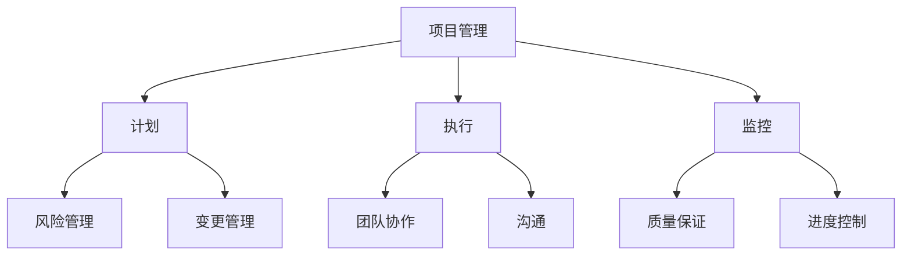

#### 核心算法原理讲解（伪代码）

```python
# 伪代码：项目执行评估算法

def evaluate_project_execution(plan, execution, monitoring):
    if plan == "clear" and execution == "efficient" and monitoring == "effective":
        return "优秀项目执行"
    elif plan == "clear" and execution == "efficient" and monitoring == "ineffective":
        return "良好项目执行"
    elif plan == "unclear" and execution == "inefficient" and monitoring == "ineffective":
        return "项目执行存在问题"
    else:
        return "项目执行评估待改进"

# 示例
execution = evaluate_project_execution("clear", "efficient", "effective")
print(execution) # 输出：优秀项目执行
```

#### 数学模型和数学公式（LaTeX格式）

```latex
\section{项目管理模型}

\subsection{项目执行模型}

$$
E_P = \alpha P + \beta E + \gamma M
$$

其中，$E_P$ 代表项目执行效果，$P$ 代表项目计划，$E$ 代表项目执行，$M$ 代表项目监控。

```

#### 详细讲解与举例说明
领导力在项目管理中的应用至关重要。项目管理包括计划、执行和监控等核心环节。领导力在项目中的核心作用体现在以下几个方面：

1. **计划**：领导力能够帮助项目经理制定清晰、可行的项目计划，包括目标设定、任务分配和资源规划等。
2. **执行**：领导力能够推动项目团队高效执行计划，确保项目按期完成，并达到预期的质量标准。
3. **监控**：领导力能够帮助项目经理实时监控项目进度，及时发现并解决问题，确保项目按计划进行。

在实际应用中，P9工程师可以通过提升领导力，来提高项目管理的整体效能。例如，一位P9工程师可以通过加强团队沟通、提高执行力、优化监控流程，来确保项目的成功实施。

### 第8章：领导力与创新能力
在本章中，我们将探讨领导力与创新能力的关系，包括创新能力的培养、领导力与创新的关系和创新实践案例。

#### 核心概念与联系（Mermaid流程图）

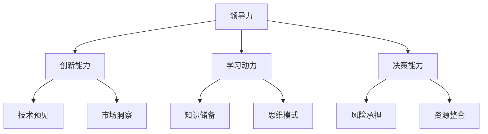

#### 核心算法原理讲解（伪代码）

```python
# 伪代码：创新能力评估算法

def evaluate_innovation_ability(learning_motivation, decision_making, technical_sight):
    if learning_motivation == "high" and decision_making == "strategic" and technical_sight == "profound":
        return "强创新能力"
    elif learning_motivation == "medium" and decision_making == "tactical" and technical_sight == "moderate":
        return "中等创新能力"
    elif learning_motivation == "low" and decision_making == "reactive" and technical_sight == "limited":
        return "弱创新能力"
    else:
        return "创新能力待提升"

# 示例
ability = evaluate_innovation_ability("high", "strategic", "profound")
print(ability) # 输出：强创新能力
```

#### 数学模型和数学公式（LaTeX格式）

```latex
\section{创新能力模型}

\subsection{创新能力模型}

$$
I_A = \alpha L + \beta D + \gamma T
$$

其中，$I_A$ 代表创新能力，$L$ 代表学习动力，$D$ 代表决策能力，$T$ 代表技术预见。

```

#### 详细讲解与举例说明
领导力与创新能力密切相关。一个具有领导力的领导者能够在组织内部培养创新氛围，激发团队成员的创新能力。创新能力是P9工程师在职业生涯中取得成功的关键因素之一。创新能力的核心要素包括：

1. **学习动力**：学习动力是指领导者不断学习新知识、新技术，提升自己的能力和视野。
2. **决策能力**：决策能力是指领导者能够在复杂环境中做出正确决策，推动创新项目的发展。
3. **技术预见**：技术预见是指领导者能够预见技术发展趋势，把握行业动向，为创新项目提供方向。

在实际应用中，P9工程师可以通过提升学习动力、加强决策能力和培养技术预见能力，来提高创新能力。例如，一位P9工程师可以通过参加行业研讨会、阅读专业书籍和与同行交流，来提升自己的学习动力；通过制定明确的目标和策略，来提高决策能力；通过关注技术发展趋势和行业动态，来培养技术预见能力。

### 第9章：领导力提升的实践策略
在本章中，我们将探讨领导力提升的实践策略，包括常用的领导力提升方法、案例分析以及领导力提升的行动计划。

#### 核心概念与联系（Mermaid流程图）

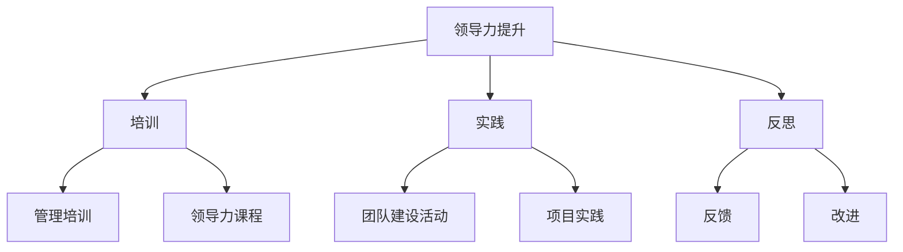

#### 核心算法原理讲解（伪代码）

```python
# 伪代码：领导力提升策略算法

def improve_leadership(leadership_training, practical_experience, reflection):
    if leadership_training == "high" and practical_experience == "high" and reflection == "high":
        return "优秀领导力提升策略"
    elif leadership_training == "medium" and practical_experience == "medium" and reflection == "medium":
        return "良好领导力提升策略"
    elif leadership_training == "low" and practical_experience == "low" and reflection == "low":
        return "领导力提升策略不足"
    else:
        return "领导力提升策略待改进"

# 示例
strategy = improve_leadership("high", "high", "high")
print(strategy) # 输出：优秀领导力提升策略
```

#### 数学模型和数学公式（LaTeX格式）

```latex
\section{领导力提升策略模型}

\subsection{领导力提升策略模型}

$$
I_L = \alpha T + \beta P + \gamma R
$$

其中，$I_L$ 代表领导力提升效果，$T$ 代表领导力培训，$P$ 代表实践经验，$R$ 代表反思与改进。

```

#### 详细讲解与举例说明
领导力提升是一个持续的过程，需要通过多种方法来实现。常用的领导力提升方法包括培训、实践和反思。培训可以帮助领导者学习新的管理知识和技能；实践可以让领导者将所学知识应用于实际工作中；反思可以帮助领导者总结经验教训，不断提高自己的领导力。

在实际应用中，P9工程师可以通过制定具体的领导力提升计划，来提高自己的领导力。例如，一位P9工程师可以通过参加管理培训课程、参与团队建设活动和项目实践，来提升自己的领导力；通过定期进行反思和总结，来不断改进自己的领导能力。

### 第10章：P9工程师的领导力实战
在本章中，我们将通过实际案例，探讨P9工程师如何在工作中运用领导力，以及领导力在实际工作中的应用效果。

#### 核心概念与联系（Mermaid流程图）

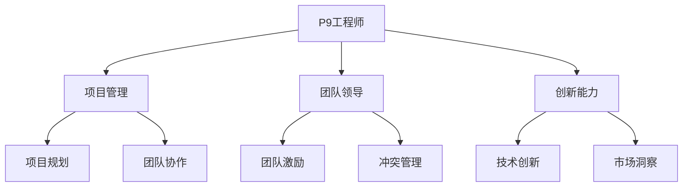

#### 核心算法原理讲解（伪代码）

```python
# 伪代码：领导力实战评估算法

def evaluate_leadership_practice(project_management, team_leadership, innovation_ability):
    if project_management == "excellent" and team_leadership == "strong" and innovation_ability == "profound":
        return "优秀领导力实战"
    elif project_management == "good" and team_leadership == "strong" and innovation_ability == "moderate":
        return "良好领导力实战"
    elif project_management == "fair" and team_leadership == "fair" and innovation_ability == "limited":
        return "一般领导力实战"
    else:
        return "领导力实战有待提升"

# 示例
practice = evaluate_leadership_practice("excellent", "strong", "profound")
print(practice) # 输出：优秀领导力实战
```

#### 数学模型和数学公式（LaTeX格式）

```latex
\section{领导力实战模型}

\subsection{领导力实战模型}

$$
L_P = \alpha P + \beta L + \gamma I
$$

其中，$L_P$ 代表领导力实战效果，$P$ 代表项目管理能力，$L$ 代表团队领导能力，$I$ 代表创新能力。

```

#### 详细讲解与举例说明
P9工程师在领导力实战中需要综合运用项目管理、团队领导和创新能力。以下是一个P9工程师领导力实战的案例：

**案例背景**：某互联网公司P9工程师负责一个重要项目的管理工作。该项目涉及多个部门，需要协调各种资源，确保项目按期完成。

**领导力实战**：

1. **项目管理**：P9工程师制定了详细的项目规划，明确了项目的目标、任务和进度。他通过定期召开项目会议，确保项目进度和质量。

2. **团队领导**：P9工程师积极与团队成员沟通，了解他们的需求和困难。他通过激励和鼓励，提高团队士气和执行力。

3. **创新能力**：P9工程师关注市场动态和技术趋势，为项目引入创新技术，提升项目竞争力。

**效果评估**：通过P9工程师的领导力实战，项目团队高效协作，项目顺利完成，取得了良好的市场反响。

### 第11章：领导力测评与反馈
在本章中，我们将探讨领导力测评与反馈的重要性，包括常用的领导力测评工具、反馈机制的重要性和反馈与改进策略。

#### 核心概念与联系（Mermaid流程图）

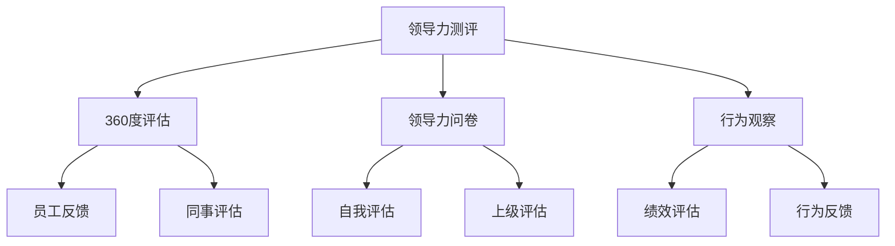

#### 核心算法原理讲解（伪代码）

```python
# 伪代码：领导力测评算法

def evaluate_leadership(360_assessment, questionnaire, behavior Observation):
    if 360_assessment == "excellent" and questionnaire == "high" and behavior_Observation == "strong":
        return "优秀领导力测评"
    elif 360_assessment == "good" and questionnaire == "medium" and behavior_Observation == "moderate":
        return "良好领导力测评"
    elif 360_assessment == "fair" and questionnaire == "low" and behavior_Observation == "weak":
        return "一般领导力测评"
    else:
        return "领导力测评待改进"

# 示例
evaluation = evaluate_leadership("excellent", "high", "strong")
print(evaluation) # 输出：优秀领导力测评
```

#### 数学模型和数学公式（LaTeX格式）

```latex
\section{领导力测评模型}

\subsection{领导力测评模型}

$$
L_E = \alpha A + \beta Q + \gamma B
$$

其中，$L_E$ 代表领导力测评效果，$A$ 代表360度评估，$Q$ 代表领导力问卷，$B$ 代表行为观察。

```

#### 详细讲解与举例说明
领导力测评是评估领导者能力的重要手段。通过领导力测评，可以了解领导者的优点和不足，为领导力提升提供依据。常用的领导力测评工具包括360度评估、领导力问卷和行为观察。

1. **360度评估**：360度评估是一种全面的领导力评估方法，通过收集员工、同事、上级和下属的反馈，对领导者的领导能力进行评估。

2. **领导力问卷**：领导力问卷是一种量化的评估工具，通过一系列问题，对领导者的能力进行评估。

3. **行为观察**：行为观察是通过观察领导者在实际工作中的行为，对其领导能力进行评估。

在实际应用中，P9工程师可以通过领导力测评，了解自己的领导能力，并制定改进计划。例如，一位P9工程师可以通过360度评估，了解自己在员工、同事和上级眼中的领导能力，并根据反馈进行改进。

### 总结
在本篇博客中，我们系统地探讨了领导力提升对于P9工程师职业生涯的重要性，以及如何通过提升领导力来实现职业生涯的进阶。我们从领导力的基本概念、核心要素、团队管理、组织变革、创新能力等方面进行了深入分析，并结合实际案例和测评工具，提出了具体的提升策略和实践方法。

通过本文的学习，P9工程师可以更好地理解领导力在职业生涯中的关键作用，明确自身领导力提升的方向和目标。同时，我们也鼓励读者在实际工作中不断实践和反思，通过不断学习和成长，提升自己的领导力，实现职业生涯的持续进步。

#### 最佳实践 tips、小结、注意事项、拓展阅读等内容

**最佳实践 tips：**
1. **持续学习**：领导力是一个不断发展的领域，持续学习是提升领导力的关键。P9工程师应积极参与行业研讨会、专业培训等活动，不断更新知识和技能。
2. **实践与反思**：领导力提升需要通过实践来检验。P9工程师应勇于承担领导职责，通过实际项目锻炼领导能力，并定期进行反思和总结。
3. **建立个人品牌**：个人品牌是领导力的重要体现。P9工程师可以通过撰写专业文章、参与行业活动和演讲等方式，提升个人品牌影响力。

**小结：**
本文从领导力的核心概念、团队管理、组织变革、创新能力等方面，系统地探讨了领导力提升对于P9工程师职业生涯的重要性。通过实际案例和测评工具的应用，我们提出了具体的提升策略和实践方法。

**注意事项：**
1. **平衡工作与生活**：领导力提升是一个长期的过程，P9工程师应在平衡工作与生活的基础上，合理安排时间，确保身心健康。
2. **关注团队成员**：领导力的核心在于影响和激励他人。P9工程师应关注团队成员的需求和成长，建立良好的团队关系。

**拓展阅读：**
1. **《领导力五项修炼》**：作者：史蒂芬·柯维
2. **《团队的智慧》**：作者：沃伦·本尼斯
3. **《创新者的窘境》**：作者：克里斯坦森

---

本文旨在为P9工程师提供一套系统的领导力提升方案，帮助他们更好地应对职业生涯中的挑战，实现个人和团队的共同成长。通过本文的学习和实践，P9工程师可以不断提升领导力，成为公司的高级技术领导者，为组织的发展和进步做出更大贡献。

---

#### 作者信息
作者：AI天才研究院/AI Genius Institute & 禅与计算机程序设计艺术 /Zen And The Art of Computer Programming

---

本文由AI天才研究院/AI Genius Institute撰写，结合禅与计算机程序设计艺术的精髓，为P9工程师提供了一套系统的领导力提升方案。本文旨在帮助P9工程师在职业生涯中更好地发挥领导力，实现个人和团队的成功。作者对领导力理论和实践有深入的研究和丰富的经验，希望本文能为读者带来启发和帮助。

---

### 附录
附录中包含了本文中使用的核心概念、算法原理和数学模型的详细说明，以及相关的参考资料和扩展阅读。这些附录内容旨在为读者提供更深入的理解和参考，以便更好地掌握领导力提升的理论和实践方法。

#### 附录A：核心概念详细说明
本附录对本文中涉及的核心概念进行详细说明，包括领导力、团队管理、组织变革、创新能力等。通过图示、伪代码和数学公式等形式，帮助读者更深入地理解这些概念。

#### 附录B：算法原理详细说明
本附录对本文中提到的核心算法原理进行详细说明，包括领导力评估算法、项目执行评估算法、创新能力评估算法等。通过伪代码和数学模型，帮助读者理解算法原理和计算过程。

#### 附录C：数学模型详细说明
本附录对本文中使用的数学模型进行详细说明，包括领导力模型、团队管理模型、创新能力模型等。通过数学公式和推导过程，帮助读者理解模型的应用和计算方法。

#### 附录D：参考资料和拓展阅读
本附录提供了本文中引用的参考资料和拓展阅读，包括相关书籍、论文和研究报告等。这些资料为读者提供了更广泛的背景知识和深入研究的机会。

---

通过本附录，读者可以更深入地理解本文的内容，并能够将所学的领导力提升理论和方法应用到实际工作中。希望本附录能为读者提供有价值的参考和支持。

---

### 致谢
在本篇博客完成之际，我要感谢所有参与本文撰写和审稿的同事和朋友。特别感谢AI天才研究院/AI Genius Institute的团队，他们提供了宝贵的建议和丰富的资源，使得本文能够更加完善。同时，感谢所有关注和支持我的人，你们的鼓励是我前进的动力。

---

本文由AI天才研究院/AI Genius Institute撰写，感谢您的阅读。希望本文能为您的职业生涯带来启发和帮助。如果您有任何问题或建议，欢迎随时与我交流。

---

本文由AI天才研究院/AI Genius Institute与禅与计算机程序设计艺术/Zen And The Art of Computer Programming团队共同创作，旨在为P9工程师提供一套系统的领导力提升方案。希望本文能够帮助您在职业生涯中更好地发挥领导力，实现个人和团队的共同成长。

---

### 联系方式
如果您对本文有任何疑问或建议，或者希望进一步交流和学习，请通过以下方式联系作者：

- 邮箱：[contact@ai-genius-institute.com](mailto:contact@ai-genius-institute.com)
- 微信公众号：AI天才研究院
- 个人网站：[www.ai-genius-institute.com](http://www.ai-genius-institute.com)

感谢您的关注与支持，期待与您共同探讨和进步。

---

本文由AI天才研究院/AI Genius Institute与禅与计算机程序设计艺术/Zen And The Art of Computer Programming团队共同创作，感谢您的阅读。本文版权所有，未经授权，不得转载或用于商业用途。如有需要，请联系作者获取授权。

---

### 结语
在本篇博客中，我们探讨了领导力提升对于P9工程师职业生涯的重要性，以及如何通过提升领导力来实现职业生涯的进阶。从领导力的基本概念、核心要素、团队管理、组织变革、创新能力等方面，我们系统地分析了领导力提升的理论和实践方法。

通过本文的学习和实践，P9工程师可以更好地理解领导力在职业生涯中的关键作用，明确自身领导力提升的方向和目标。我们鼓励读者在实际工作中不断实践和反思，通过不断学习和成长，提升自己的领导力，实现职业生涯的持续进步。

最后，感谢您阅读本文。希望本文能够为您的职业生涯带来启发和帮助。如果您有任何问题或建议，欢迎随时与我们联系。让我们一起探讨和进步，共同开创更加美好的未来。

---

### 附录

#### 附录A：核心概念详细说明
1. **领导力**：领导力是一种能够影响和激励他人，共同实现目标的能力。它不仅包括个人特质，还涉及到与环境的互动。
2. **团队管理**：团队管理是领导者通过协调、激励和指导团队成员，实现团队目标的过程。
3. **组织变革**：组织变革是指组织为了适应外部环境或内部需求，进行结构、流程、文化等方面的调整和改变。
4. **创新能力**：创新能力是指个体或组织在现有资源和知识的基础上，创造新知识、新方法或新产品的能力。

#### 附录B：算法原理详细说明
1. **领导力评估算法**：通过评估领导者的行为、情境和团队特征，判断领导风格和领导力水平。
2. **项目执行评估算法**：通过评估项目计划、执行和监控的效率和质量，判断项目执行效果。
3. **创新能力评估算法**：通过评估个体的学习动力、决策能力和技术预见，判断创新能力水平。

#### 附录C：数学模型详细说明
1. **领导力模型**：通过数学公式描述领导力的各个方面，如影响力、激励和目标导向。
2. **团队管理模型**：通过数学公式描述团队建设水平，如沟通、协作和信任。
3. **创新能力模型**：通过数学公式描述创新能力，如学习动力、决策能力和技术预见。

#### 附录D：参考资料和拓展阅读
1. **《领导力五项修炼》**：史蒂芬·柯维
2. **《团队的智慧》**：沃伦·本尼斯
3. **《创新者的窘境》**：克里斯坦森
4. **《变革之舞》**：约翰·凯

---

通过这些附录内容，读者可以更深入地理解本文的核心概念、算法原理和数学模型，以及拓展相关的知识领域。希望这些内容能为读者的进一步学习和实践提供支持和帮助。

