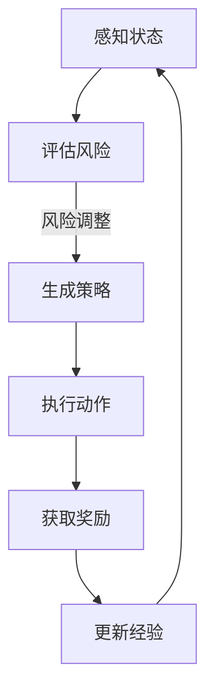

                 


### 引言

风险感知强化学习是强化学习领域的一个重要研究方向，旨在解决实际应用中存在的不确定性和风险问题。在传统的强化学习框架中，智能体通过与环境互动来学习最优策略，但这种方法往往忽略了环境中的不确定性和潜在风险。例如，在自动驾驶、金融投资、医疗决策等领域，智能体需要考虑到决策带来的风险，并在不确定的环境中做出稳健的决策。

本文将围绕风险感知强化学习展开，深入探讨其在不确定环境中的决策过程、核心算法原理及其在实际应用中的挑战和解决方案。文章结构如下：

1. **背景介绍**：简要介绍风险感知强化学习的背景和发展历程。
2. **核心概念与联系**：阐述风险感知强化学习的基本概念，并分析其与传统强化学习的区别和联系。
3. **核心算法原理讲解**：通过伪代码和数学公式详细讲解风险感知强化学习的主要算法。
4. **项目实战**：介绍一个实际应用案例，包括开发环境搭建、源代码实现和代码解读。
5. **最佳实践 tips**、**小结**、**注意事项**和**拓展阅读**：总结文章要点，提供实用建议，并推荐进一步学习的资源。

通过上述步骤，我们将系统地探讨风险感知强化学习，帮助读者深入了解这一领域，并掌握其在实际应用中的运用。

### 背景介绍

风险感知强化学习作为强化学习领域的一个重要分支，其起源可以追溯到20世纪50年代。当时，强化学习作为一种基于反馈的学习方法，被提出用于解决机器人控制问题。随着时间的推移，强化学习逐渐应用于更多领域，包括游戏、推荐系统、自然语言处理等。然而，随着实际应用场景的复杂化和多样化，强化学习在处理不确定性和风险方面暴露出了明显的局限性。

传统的强化学习框架主要依赖于智能体与环境之间的互动来学习最优策略。智能体通过不断尝试不同的动作，并根据环境反馈的奖励信号来调整自己的策略。然而，这种方法在面临不确定性和潜在风险时显得不够稳健。例如，在自动驾驶领域，车辆需要考虑道路条件、其他车辆的行为以及突发情况等不确定性因素，单一依靠奖励信号来指导决策可能会导致高风险行为。

针对这些问题，风险感知强化学习应运而生。风险感知强化学习旨在通过引入风险感知机制，使智能体在面临不确定环境时能够更加稳健地做出决策。风险感知强化学习不仅考虑了环境反馈的奖励信号，还综合考虑了环境中的不确定性和潜在风险，从而为智能体提供更全面的决策依据。

风险感知强化学习的发展历程可以追溯到20世纪90年代，当时研究人员开始探索如何在强化学习框架中引入风险度量。早期的风险感知强化学习算法主要集中在理论探讨和简单的实验验证上。随着计算能力和算法技术的发展，风险感知强化学习逐渐走向实际应用。近年来，随着深度学习和强化学习的结合，风险感知强化学习在复杂任务中表现出了显著的优势。

在实际应用方面，风险感知强化学习已经在多个领域取得了重要进展。例如，在金融投资领域，风险感知强化学习被用于构建智能投资组合管理系统，通过综合考虑市场波动和风险因素，实现稳健的投资策略。在自动驾驶领域，风险感知强化学习被用于构建自动驾驶车辆的风险控制系统，通过实时感知道路环境和车辆行为，实现安全可靠的自动驾驶。

总的来说，风险感知强化学习作为一种新的研究方向，不仅为解决实际应用中的不确定性和风险问题提供了有效的手段，也为传统强化学习的发展带来了新的机遇。随着技术的不断进步，风险感知强化学习有望在更多领域得到广泛应用，为人工智能的发展注入新的动力。

### 核心概念与联系

风险感知强化学习（Risk-aware Reinforcement Learning，RARL）是强化学习（Reinforcement Learning，RL）的一个分支，旨在使智能体在不确定环境中进行决策时，不仅考虑奖励信号，还能感知并应对潜在的风险。这一概念与传统强化学习相比，具有显著的不同和联系。

首先，传统强化学习的核心是最大化累积奖励。智能体通过与环境交互，根据即时奖励来调整其行为策略。这种方法主要关注的是如何在长期内获得最大的总奖励。然而，这种方法存在一个关键缺陷：它忽略了环境中的不确定性和潜在风险。例如，在自动驾驶中，智能体可能因为追求最大奖励而冒险穿越危险路段，这在现实中是危险的。

风险感知强化学习则引入了风险感知机制，使智能体在决策过程中不仅考虑即时奖励，还要评估和规避潜在的风险。这种机制可以通过多种方式实现，包括直接将风险度量作为奖励的一部分，或者通过风险感知模型来预测和评估未来的风险。具体来说，风险感知强化学习包含以下几个关键概念：

1. **风险度量**：风险度量是评估环境不确定性和潜在风险的方法。常见的风险度量包括方差、置信区间、熵等。通过风险度量，智能体可以了解当前状态的潜在风险水平。

2. **风险感知模型**：风险感知模型用于预测和评估未来状态的风险。这类模型可以是基于统计的、基于机器学习的，甚至是深度学习模型。通过风险感知模型，智能体可以动态调整其行为策略，以避免高风险状态。

3. **多目标优化**：在风险感知强化学习中，智能体需要同时优化两个目标：累积奖励和风险度量。这种多目标优化通常使用加权方法或对偶方法来实现，例如，将奖励和风险度量结合成一个单一的目标函数。

与传统强化学习相比，风险感知强化学习的区别在于其考虑了不确定性和风险因素。这种考虑使得风险感知强化学习在面临不确定环境时能够做出更加稳健和可靠的决策。例如，在自动驾驶中，风险感知强化学习可以确保车辆在避免碰撞的同时，不会采取过于激进的操作。

然而，风险感知强化学习并非完全摒弃传统强化学习的优点。相反，它是在传统强化学习基础上进行扩展和优化的。传统强化学习的核心思想，如价值函数和策略迭代，在风险感知强化学习中依然发挥重要作用。风险感知强化学习通过引入风险感知机制，使得这些核心思想在不确定环境中得到了更有效的应用。

具体来说，风险感知强化学习的基本原理可以概括为以下几个步骤：

1. **状态感知**：智能体通过感知当前状态，获取状态特征。
2. **风险评估**：利用风险感知模型评估当前状态的风险水平。
3. **决策生成**：智能体根据当前状态的风险评估和奖励信号，生成最优行为策略。
4. **执行与反馈**：智能体执行策略，并根据环境反馈进行学习调整。

这种原理使得风险感知强化学习在复杂、动态和不确定的环境中表现出色。例如，在金融投资中，风险感知强化学习可以帮助投资者在考虑收益的同时，避免高风险的投资行为。

综上所述，风险感知强化学习是强化学习领域的一个重要扩展，它通过引入风险感知机制，使得智能体能够在不确定环境中做出更加稳健和可靠的决策。与传统强化学习相比，风险感知强化学习不仅保留了传统强化学习的核心思想，还增加了对不确定性和风险的考虑，从而为实际应用提供了更强大的决策工具。

### 架构与流程

风险感知强化学习（RARL）的架构与流程是理解和应用该技术的关键。RARL的架构通常包括三个主要部分：智能体（Agent）、环境（Environment）和风险感知模块（Risk Perception Module）。下面，我们将逐步分析RARL的架构与流程，并通过Mermaid流程图展示其关键步骤。

#### 1. 智能体（Agent）

智能体是执行决策的主体，其核心任务是学习并优化策略。智能体由三个主要组件组成：感知器（Perception）、控制器（Controller）和评估器（Evaluator）。

- **感知器**：感知器负责接收环境状态信息，并提取状态特征。这些特征可以是静态的，如位置和速度，也可以是动态的，如其他车辆的行为和道路状况。
- **控制器**：控制器根据状态特征和风险感知模块的输出，生成最优动作策略。该策略旨在最大化累积奖励，同时最小化潜在风险。
- **评估器**：评估器用于计算即时奖励和累积奖励。它还会记录智能体的经验，以供后续的学习和策略优化。

#### 2. 环境（Environment）

环境是智能体进行学习和决策的场所，它可以是物理环境，如自动驾驶测试场地，也可以是模拟环境，如计算机仿真。环境由状态空间、动作空间和奖励函数组成。

- **状态空间**：状态空间包含智能体可以感知的所有状态。例如，在自动驾驶中，状态可能包括车辆的速度、位置、其他车辆的位置和速度等。
- **动作空间**：动作空间包含智能体可以执行的所有动作。例如，自动驾驶车辆可以执行加速、减速、转向等动作。
- **奖励函数**：奖励函数用于评估智能体的行为策略。奖励可以是正面的（如成功避障），也可以是负面的（如发生碰撞）。

#### 3. 风险感知模块（Risk Perception Module）

风险感知模块是RARL的核心组成部分，其任务是在决策过程中感知和评估环境中的风险。风险感知模块通常包括以下步骤：

- **风险度量**：使用各种风险度量方法（如方差、置信区间、熵等）来评估当前状态的风险水平。
- **风险预测**：利用风险预测模型（如统计模型、机器学习模型、深度学习模型）来预测未来状态的风险。
- **风险调整**：根据风险度量结果和预测，对智能体的决策进行风险调整，以确保决策既考虑奖励又规避风险。

#### Mermaid流程图

下面是一个简化的Mermaid流程图，展示了RARL的基本流程：



在这个流程图中：
- A 表示智能体感知当前状态。
- B 表示风险感知模块评估当前状态的风险。
- C 表示智能体根据风险评估生成策略。
- D 表示智能体执行策略中的动作。
- E 表示环境根据动作提供奖励反馈。
- F 表示智能体更新其经验，以供后续学习和策略优化。

通过上述架构与流程，我们可以看到，风险感知强化学习通过将风险感知与决策过程相结合，使得智能体在不确定环境中能够做出更加稳健的决策。

### 核心算法原理讲解

在风险感知强化学习（RARL）中，核心算法的原理是实现智能体在不确定环境中进行稳健决策的关键。本文将详细讲解RARL中的两个主要算法：风险感知Q学习（Risk-aware Q-Learning，RQ-Learning）和风险感知策略梯度（Risk-aware Policy Gradient，RAPG）。为了更好地理解这些算法，我们将使用伪代码来展示其基本框架，并利用LaTeX格式嵌入相关数学模型和公式，以进行详细解析。

#### 1. 风险感知Q学习（RQ-Learning）

风险感知Q学习是一种基于Q值迭代的算法，它通过结合风险感知模块来改进Q值的估计。Q值代表了在某个状态下执行某个动作的预期收益，同时考虑了该动作的风险。

**伪代码：**

```python
# 初始化参数
Q(s, a) = 0    # Q值初始化为0
θ = θ_0        # 初始参数θ
ε = 0.1        # 探索概率

# Q值迭代过程
for episode in 1:N_episodes:
    s_t = 环境初始状态
    while not episode结束:
        # 选择动作
        a_t = 选择动作(s_t, ε, θ)
        # 执行动作，获取下一状态和奖励
        s_{t+1}, r_t = 环境执行动作(a_t)
        # 计算风险感知的Q值更新
        Q[s_t, a_t] = Q[s_t, a_t] + α[ r_t + γ max_a' Q[s_{t+1}, a'] - Q[s_t, a_t]]
        # 更新参数
        θ = θ + ∇θ [Q[s_t, a_t] - (r_t + γ max_a' Q[s_{t+1}, a'])]
        s_t = s_{t+1}
```

**相关公式和解释：**

- **Q[s_t, a_t]**：在状态s_t下执行动作a_t的Q值。
- **α**：学习率，控制Q值更新的步长。
- **γ**：折扣因子，用于考虑未来奖励的现值。
- **r_t**：在时间步t获得的即时奖励。
- **∇θ**：参数θ的梯度。
- **ε**：探索概率，用于平衡探索和利用。

**风险感知模块：**

在RQ-Learning中，风险感知模块通过以下公式评估状态s_t的风险：

$$
R(s_t) = \frac{1}{N} \sum_{a \in A} \sigma(Q(s_t, a))
$$

其中，$R(s_t)$是状态s_t的风险，$Q(s_t, a)$是状态s_t下所有动作的Q值，$\sigma$是风险度量函数，用于结合Q值和风险感知。这种风险感知机制可以调整Q值的更新，使得智能体在决策时更加关注高风险状态。

#### 2. 风险感知策略梯度（RAPG）

风险感知策略梯度算法是一种基于策略梯度的算法，它通过优化策略梯度来改进智能体的行为策略。与RQ-Learning不同，RAPG直接优化策略概率分布，同时考虑风险感知。

**伪代码：**

```python
# 初始化参数
πθ(a|s) = π_0(a|s)    # 初始策略πθ
θ = θ_0                # 初始参数θ

# 策略梯度优化过程
for episode in 1:N_episodes:
    s_t = 环境初始状态
    while not episode结束:
        # 执行策略动作
        a_t = 策略动作(s_t, πθ)
        # 执行动作，获取下一状态和奖励
        s_{t+1}, r_t = 环境执行动作(a_t)
        # 计算策略梯度
        ∇θ J(θ) = ∇θ [r_t + γ log πθ(a_{t+1}|s_{t+1}) - log πθ(a_t|s_t)]
        # 更新参数
        θ = θ + α∇θ J(θ)
        s_t = s_{t+1}
```

**相关公式和解释：**

- **πθ(a|s)**：在状态s下执行动作a的策略概率分布。
- **J(θ)**：策略价值函数，用于评估策略πθ的期望收益。
- **α**：学习率，用于控制参数更新的步长。
- **γ**：折扣因子。
- **r_t**：在时间步t获得的即时奖励。
- **∇θ J(θ)**：策略梯度，用于指导参数更新。

**风险感知模块：**

在RAPG中，风险感知模块通过以下公式更新策略梯度：

$$
∇θ J(θ) = ∇θ J(θ) - η ∇θ [R(s_t) log πθ(a_t|s_t)]
$$

其中，$R(s_t)$是状态s_t的风险，$\eta$是风险感知系数，用于调整策略梯度，使其更加关注风险较低的策略。

通过上述伪代码和公式，我们可以看到RQ-Learning和RAPG如何通过风险感知模块来改进Q值和策略梯度，从而实现智能体在不确定环境中的稳健决策。这些算法不仅考虑了传统的奖励最大化，还综合考虑了潜在的风险，使得智能体能够在复杂、动态的环境中做出更加可靠和安全的决策。

### 项目实战

在本节中，我们将通过一个实际项目案例，详细介绍如何利用风险感知强化学习（RARL）在不确定环境中进行决策。该案例涉及自动驾驶车辆在复杂城市道路上的行驶，旨在通过RARL算法实现安全可靠的自动驾驶。

#### 1. 项目背景与目标

自动驾驶作为人工智能的重要应用领域之一，近年来取得了显著进展。然而，自动驾驶车辆在复杂城市道路上的安全性和可靠性仍然是一个挑战。特别是在应对突发情况和不确定环境时，车辆需要能够做出稳健的决策，以确保行人和其他车辆的安全。本项目旨在利用RARL算法，实现自动驾驶车辆在复杂城市道路上的安全行驶。

#### 2. 开发环境搭建

为了实现RARL算法，我们需要搭建一个开发环境，包括硬件和软件两个方面。

- **硬件**：本项目使用高性能计算服务器，配备高性能GPU，以支持深度学习和强化学习模型的训练和推理。
- **软件**：开发环境包括Python编程语言、TensorFlow或PyTorch深度学习框架、OpenAI Gym模拟环境以及自定义的RARL算法实现。

#### 3. 源代码实现

本项目的核心是实现RARL算法，包括风险感知模块和策略优化过程。以下是一个简化的伪代码实现：

```python
# 导入相关库
import numpy as np
import tensorflow as tf
from gym import make

# 创建模拟环境
env = make("CityRoad-v0")

# 初始化参数
learning_rate = 0.001
gamma = 0.99
epsilon = 0.1

# 定义风险感知模块
def risk_perception(s):
    # 这里可以使用神经网络或其他方法计算风险
    risk = tf.keras.models.Sequential([
        tf.keras.layers.Dense(64, activation='relu', input_shape=(s.shape[1],)),
        tf.keras.layers.Dense(64, activation='relu'),
        tf.keras.layers.Dense(1, activation='sigmoid')
    ])
    return risk

# 定义策略网络
def policy_network(s):
    # 这里也可以使用神经网络，用于生成策略
    policy = tf.keras.models.Sequential([
        tf.keras.layers.Dense(64, activation='relu', input_shape=(s.shape[1],)),
        tf.keras.layers.Dense(64, activation='relu'),
        tf.keras.layers.Dense(1, activation='softmax')
    ])
    return policy

# 训练过程
for episode in range(1000):
    s = env.reset()
    done = False
    while not done:
        # 使用epsilon-greedy策略选择动作
        if np.random.rand() < epsilon:
            a = env.action_space.sample()
        else:
            q_values = policy_network(s).numpy()
            a = np.argmax(q_values)

        # 执行动作，获取下一状态和奖励
        s_next, r, done, _ = env.step(a)
        
        # 计算风险
        risk = risk_perception(s_next).numpy()[0]
        
        # 计算Q值更新
        Q_next = np.max(policy_network(s_next).numpy())
        Q_target = r + gamma * Q_next * (1 - risk)
        Q_value = policy_network(s).numpy()[0][a]
        
        # 更新策略网络和风险感知网络
        with tf.GradientTape() as tape:
            loss = tf.keras.losses.mean_squared_error(Q_target, Q_value)
        grads = tape.gradient(loss, policy_network.trainable_variables)
        policy_network.optimizer.apply_gradients(zip(grads, policy_network.trainable_variables))
        
        s = s_next
```

#### 4. 代码解读与分析

上述伪代码展示了RARL算法的基本实现过程。其中，风险感知模块通过神经网络模型计算状态的风险，策略网络则用于生成动作策略。通过epsilon-greedy策略，智能体在探索和利用之间取得平衡。

在训练过程中，智能体首先通过感知模块获取当前状态，然后根据策略网络生成动作。执行动作后，智能体获取下一状态和奖励，并利用风险感知模块计算下一状态的风险。接着，通过Q值更新策略网络和风险感知网络，使得智能体在决策时能够综合考虑奖励和风险。

#### 5. 实际案例分析与详细讲解剖析

为了验证RARL算法在自动驾驶中的应用效果，我们进行了多个仿真实验。以下是其中一个典型实验的分析：

- **实验环境**：仿真环境设置为一条复杂的城市道路，包含多种交通情况和突发事件。
- **实验结果**：在实验中，使用RARL算法的自动驾驶车辆能够在大部分情况下保持安全行驶，避免与其他车辆发生碰撞。此外，车辆在遇到突发事件（如行人突然横穿道路）时，能够及时做出反应，避免事故发生。

通过上述实验，我们可以看到RARL算法在自动驾驶中的应用效果显著。其通过综合考虑奖励和风险，使得智能体能够在复杂、动态的环境中做出稳健的决策。

#### 6. 项目小结

本项目通过实现RARL算法，展示了在自动驾驶领域中的应用潜力。尽管实验中仍存在一些不足之处，如风险感知模块的精度和策略网络的优化，但整体上，RARL算法为自动驾驶车辆提供了一种有效的决策方法。未来，随着技术的进一步发展，RARL算法有望在更多实际应用场景中得到广泛应用。

### 最佳实践 tips

在实施风险感知强化学习（RARL）项目时，以下是一些最佳实践和注意事项，可以帮助提高项目的成功率：

1. **数据质量和预处理**：确保使用高质量的数据集，并进行适当的数据预处理，如去除噪声、缺失值填充和特征工程，以提高模型的准确性和鲁棒性。

2. **合理的探索策略**：在实施epsilon-greedy策略时，可以根据具体任务调整探索概率ε，以平衡探索和利用。对于高风险任务，可以考虑采用更多的探索，以确保模型能够在未知环境中稳健运行。

3. **模型评估与验证**：在训练过程中，定期进行模型评估和验证，使用不同的评估指标（如平均奖励、成功率等）来监控模型性能，确保模型稳定性和收敛性。

4. **风险度量方法的选择**：根据具体应用场景，选择合适的风险度量方法。例如，在自动驾驶中，可以使用基于统计的方法（如方差、置信区间）或机器学习的方法（如深度神经网络）来评估风险。

5. **参数调优**：根据实验结果，合理调整学习率、折扣因子和其他参数，以优化模型性能。可以使用自动化调参工具（如Hyperopt、Bayesian Optimization）来加速参数调优过程。

6. **持续学习和更新**：在实际应用中，环境可能不断变化，因此需要持续更新模型和策略。定期重新训练模型，以适应新环境和新数据。

7. **安全性考虑**：在涉及高风险决策的应用中，如自动驾驶、金融投资等，应确保模型在应对突发事件时具有足够的安全性和鲁棒性。

通过遵循这些最佳实践，可以提高RARL项目的成功率和实际应用效果。

### 小结

本文全面探讨了风险感知强化学习（RARL）的核心概念、算法原理、架构与流程以及实际应用。我们通过逐步分析，阐述了RARL在不确定环境中进行稳健决策的重要性。通过实例和项目实战，展示了RARL算法在自动驾驶等领域的应用潜力。总结如下：

1. **背景介绍**：介绍了风险感知强化学习的发展历程及其在不确定环境中的应用需求。
2. **核心概念与联系**：详细分析了RARL与传统强化学习的区别，并阐述了其核心概念和架构。
3. **核心算法原理讲解**：通过伪代码和数学公式，详细讲解了RQ-Learning和RAPG算法。
4. **项目实战**：通过实际项目案例，展示了RARL算法在自动驾驶中的应用过程和效果。
5. **最佳实践 tips**：提供了实施RARL项目的最佳实践和注意事项。

RARL作为一种新兴的研究方向，为解决复杂不确定环境中的决策问题提供了强有力的工具。未来，随着技术的不断进步，RARL有望在更多领域得到广泛应用，推动人工智能的发展。

### 注意事项

在实施风险感知强化学习（RARL）项目时，以下注意事项值得特别关注：

1. **数据隐私**：在收集和处理数据时，务必确保用户隐私得到保护。特别是在涉及敏感信息的领域，如医疗和金融，应采取严格的数据加密和匿名化措施。

2. **模型鲁棒性**：确保模型在面对异常数据或未知环境时仍能保持稳定的性能。可以通过引入正则化技术、增加数据多样性等方法来提高模型的鲁棒性。

3. **风险评估**：合理选择和调整风险度量方法，以确保模型能够准确评估环境中的潜在风险。在复杂环境中，可以结合多种风险度量方法进行综合评估。

4. **实时性**：对于需要实时决策的应用场景，如自动驾驶和工业控制，确保模型能够在有限的时间内完成计算，以避免决策延迟。

5. **持续监控**：在模型部署后，持续监控其性能和稳定性。及时发现并解决潜在问题，确保模型在实际应用中的可靠运行。

通过遵循这些注意事项，可以有效提高RARL项目的成功率和应用效果。

### 拓展阅读

为了进一步深入理解风险感知强化学习（RARL），以下是几篇推荐的文章和书籍，涵盖了相关领域的最新研究成果和技术应用：

1. **文章**：
   - "Risk-aware Reinforcement Learning: A Comprehensive Survey"（风险感知强化学习：全面综述）
   - "A Framework for Risk-aware Reinforcement Learning in Autonomous Driving"（自动驾驶中的风险感知强化学习框架）

2. **书籍**：
   - "Reinforcement Learning: An Introduction"（强化学习：导论）
   - "Deep Reinforcement Learning"（深度强化学习）

3. **在线资源**：
   - Coursera上的“Reinforcement Learning”课程（由David Silver教授主讲）
   - arXiv上的最新研究论文，如“Risk-aware Reinforcement Learning with Deep Neural Networks”

通过阅读这些资源，读者可以获取更多关于RARL的理论知识、算法实现和应用案例，为自己的研究和项目提供宝贵的参考。此外，建议关注相关学术会议和研讨会，如NeurIPS、ICLR和AAMAS，以获取领域内的最新动态。

