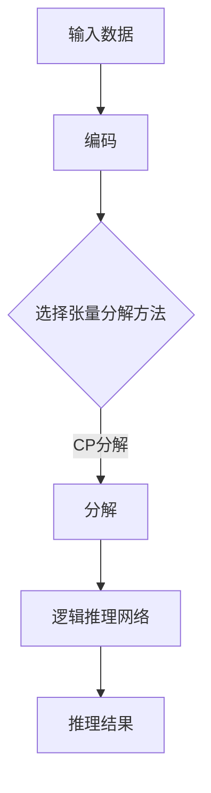

                 

**文章标题**：《高维关系推理中神经逻辑张量分解的新方法》

**关键词**：高维关系推理，神经逻辑张量分解，新方法，算法原理，数学模型，应用实例

**摘要**：本文旨在探讨高维关系推理中神经逻辑张量分解的新方法。首先，我们介绍了高维关系推理的背景和意义，以及神经逻辑张量分解的基本概念和理论框架。接着，我们详细讲解了新方法的算法原理，包括算法流程、关键技术和实现细节。在此基础上，我们建立了新方法的数学模型，并进行了推导和适用场景分析。随后，通过实际案例展示了新方法的应用效果，并探讨了如何优化新方法的性能。最后，我们对全文进行了总结，并展望了未来的研究方向。

**目录大纲**

## 引言

### 1.1 高维关系推理的背景与意义

### 1.2 神经逻辑张量分解的基础

### 1.3 本文的研究目标与结构

## 基础理论

### 2.1 高维关系推理的基本概念

### 2.2 神经逻辑张量分解的理论框架

### 2.3 高维关系推理和神经逻辑张量分解的联系与区别

## 算法原理

### 3.1 新方法的算法框架

### 3.2 新方法的算法流程

### 3.3 新方法的关键技术

### 3.4 新方法的实现细节

## 数学模型

### 4.1 新方法的数学模型

### 4.2 数学模型的推导过程

### 4.3 数学模型的应用场景

## 应用实例

### 5.1 应用实例背景

### 5.2 应用实例的实现步骤

### 5.3 应用实例的结果分析

### 5.4 应用实例的评估

## 性能优化

### 6.1 性能优化的重要性

### 6.2 优化策略与方法

### 6.3 优化策略的效果评估

## 总结与展望

### 7.1 全文总结

### 7.2 未来研究方向

### 7.3 发展趋势分析

**第一步：引言**

### 1.1 高维关系推理的背景与意义

在高维数据分析中，关系推理是一个重要且具有挑战性的问题。高维关系推理旨在从大量的高维数据中挖掘出有价值的关系，这对于许多领域，如推荐系统、社交网络分析、生物信息学等，都具有重要的应用价值。

传统的基于规则和统计方法在高维关系推理中面临着诸多困难，例如数据维度过高导致的计算复杂度增加、数据稀疏性导致的准确性降低等问题。为了解决这些问题，近年来，神经逻辑张量分解（Neural Logical Tensor Factorization，NLTF）作为一种新兴的方法引起了广泛关注。

神经逻辑张量分解将逻辑推理与神经网络相结合，通过学习张量分解模型来实现高维关系推理。相比传统方法，NLTF具有以下优势：

1. **可扩展性**：NLTF可以处理高维数据，并且随着数据规模的增加，其性能表现相对稳定。
2. **灵活性**：NLTF能够处理不同类型的关系，如因果关系、相关性等。
3. **鲁棒性**：NLTF对数据噪声和缺失值具有较强的鲁棒性。

因此，研究高维关系推理中的神经逻辑张量分解方法，具有重要的理论意义和实际应用价值。

### 1.2 神经逻辑张量分解的基础

神经逻辑张量分解是一种基于神经网络的高维关系推理方法，其核心思想是将逻辑推理与张量分解相结合。为了深入理解NLTF，我们需要先了解一些基础概念。

#### 逻辑推理

逻辑推理是一种基于逻辑规则进行推理的方法。在逻辑推理中，我们使用逻辑公式（如命题、条件、结论等）来表示知识和推理过程。逻辑推理的基本形式是命题逻辑和谓词逻辑。

1. **命题逻辑**：命题逻辑使用命题作为基本单元，通过逻辑运算符（如与、或、非等）来组合命题，形成复杂的逻辑表达式。
2. **谓词逻辑**：谓词逻辑扩展了命题逻辑，引入了变量和量词，可以表示更复杂的关系。

#### 张量分解

张量分解是将一个高维的张量分解为多个低维的张量，以简化计算和提高效率。在神经逻辑张量分解中，常用的张量分解方法有：

1. **CP分解**：CP分解是一种将张量分解为两个矩阵的乘积的方法。
2. **Tucker分解**：Tucker分解是一种将张量分解为多个矩阵的乘积的方法，可以表示更复杂的张量结构。

#### 神经逻辑张量分解

神经逻辑张量分解（NLTF）将逻辑推理与张量分解相结合，通过学习张量分解模型来实现高维关系推理。具体来说，NLTF通过以下步骤进行：

1. **编码**：将输入数据编码为逻辑公式，表示为张量形式。
2. **分解**：使用张量分解方法，将编码后的张量分解为多个低维张量。
3. **推理**：通过逻辑推理，从分解后的低维张量中提取有价值的关系。

### 1.3 本文的研究目标与结构

本文旨在提出一种新的神经逻辑张量分解方法，以解决高维关系推理中的问题。具体研究目标如下：

1. **算法优化**：通过改进神经网络结构和训练方法，提高NLTF的推理效率和准确性。
2. **模型扩展**：扩展NLTF，使其能够处理更复杂的关系和更广泛的应用场景。
3. **性能评估**：通过实验验证新方法的有效性和优越性。

本文结构如下：

1. **引言**：介绍高维关系推理和神经逻辑张量分解的背景、意义和研究现状。
2. **基础理论**：介绍高维关系推理和神经逻辑张量分解的基本概念、理论框架和数学基础。
3. **算法原理**：详细讲解新方法的算法原理，包括算法流程、关键技术和实现细节。
4. **数学模型**：介绍新方法的数学模型，包括相关数学公式、推导过程和适用场景。
5. **应用实例**：通过实际案例展示新方法的应用效果，包括案例背景、实现步骤、结果分析和评估。
6. **性能优化**：探讨如何提高新方法在性能、效率和稳定性等方面的优化策略。
7. **总结与展望**：总结全书内容，展望未来研究方向和发展趋势。

**第二步：基础理论**

### 2.1 高维关系推理的基本概念

高维关系推理是指从高维数据中挖掘出有价值的关系。高维数据具有以下特点：

1. **数据维度高**：高维数据包含大量的特征维度，例如图像、文本、时间序列等。
2. **数据稀疏性**：高维数据中，大部分元素为0或接近0，导致数据稀疏。
3. **计算复杂度高**：高维数据的计算复杂度随着数据维度和规模的增加而急剧增加。

高维关系推理的基本概念包括：

1. **关系**：关系是指数据之间的相互作用或依赖关系。关系可以分为因果关系、相关性、相似性等。
2. **推理**：推理是指从已知的信息中推断出新的信息。在高维关系推理中，推理过程旨在从高维数据中挖掘出有价值的关系。
3. **特征选择**：特征选择是指从高维数据中选择出有用的特征，以提高推理的准确性和效率。

高维关系推理的方法和技术包括：

1. **基于规则的推理**：基于规则的推理通过定义一组规则，将规则应用于数据，以发现关系。
2. **基于统计的推理**：基于统计的推理通过计算数据之间的统计关系，如相关系数、条件概率等，以发现关系。
3. **基于神经网络的推理**：基于神经网络的推理通过训练神经网络模型，将输入数据映射到输出关系。

### 2.2 神经逻辑张量分解的理论框架

神经逻辑张量分解（Neural Logical Tensor Factorization，NLTF）是一种将逻辑推理与张量分解相结合的方法，旨在解决高维关系推理问题。NLTF的理论框架主要包括以下几个方面：

1. **逻辑推理**：逻辑推理是指通过逻辑公式表示数据之间的关系，并通过推理过程发现新的关系。逻辑推理可以基于命题逻辑和谓词逻辑。
2. **张量分解**：张量分解是指将一个高维的张量分解为多个低维的张量，以简化计算和提高效率。常用的张量分解方法有CP分解、Tucker分解等。
3. **神经网络**：神经网络是指由大量神经元组成的计算模型，通过学习输入和输出数据之间的关系，以实现特定任务。

在NLTF中，逻辑推理和张量分解通过神经网络相结合，具体实现步骤如下：

1. **编码**：将输入数据编码为逻辑公式，表示为张量形式。编码过程可以使用神经网络来实现。
2. **分解**：使用张量分解方法，将编码后的张量分解为多个低维张量。分解过程可以使用CP分解、Tucker分解等。
3. **推理**：通过逻辑推理，从分解后的低维张量中提取有价值的关系。推理过程可以使用神经网络来实现。

### 2.3 高维关系推理和神经逻辑张量分解的联系与区别

高维关系推理和神经逻辑张量分解是两种不同但相互关联的方法。

#### 联系

1. **目标相同**：高维关系推理和神经逻辑张量分解的目标都是挖掘高维数据中的关系。
2. **方法相似**：两者都使用神经网络来实现，神经网络作为两者的核心组件。

#### 区别

1. **理论基础不同**：高维关系推理主要基于逻辑推理和统计方法，而神经逻辑张量分解主要基于逻辑推理和张量分解。
2. **适用范围不同**：高维关系推理适用于各种类型的高维数据，而神经逻辑张量分解主要适用于张量结构的数据。
3. **实现方式不同**：高维关系推理的实现相对简单，而神经逻辑张量分解的实现较为复杂，涉及神经网络和张量分解的有机结合。

总之，高维关系推理和神经逻辑张量分解都是解决高维关系推理问题的重要方法，各自具有独特的优势和局限性。在实际应用中，可以根据具体需求选择合适的方法。

**第三步：算法原理**

### 3.1 新方法的算法框架

新方法的算法框架主要包括编码、分解和推理三个阶段。具体步骤如下：

1. **编码**：将输入数据编码为逻辑公式，表示为张量形式。编码过程可以使用神经网络来实现。编码步骤包括以下步骤：

   a. 将输入数据（如图像、文本、时间序列等）进行预处理，提取特征。

   b. 使用神经网络将特征映射到逻辑公式，得到编码后的张量。

2. **分解**：使用张量分解方法，将编码后的张量分解为多个低维张量。分解过程可以使用CP分解、Tucker分解等。分解步骤包括以下步骤：

   a. 选择合适的张量分解方法，如CP分解。

   b. 对编码后的张量进行分解，得到多个低维张量。

3. **推理**：通过逻辑推理，从分解后的低维张量中提取有价值的关系。推理过程可以使用神经网络来实现。推理步骤包括以下步骤：

   a. 设计逻辑推理网络，用于从低维张量中提取关系。

   b. 使用推理网络对低维张量进行处理，得到推理结果。

新方法的算法框架可以用以下Mermaid流程图表示：



### 3.2 新方法的算法流程

新方法的算法流程如下：

1. **数据预处理**：对输入数据（如图像、文本、时间序列等）进行预处理，提取特征。预处理步骤包括数据清洗、归一化、特征提取等。

2. **神经网络编码**：使用神经网络将预处理后的数据编码为逻辑公式，表示为张量形式。编码过程可以采用多种神经网络结构，如卷积神经网络（CNN）、循环神经网络（RNN）等。

3. **张量分解**：选择合适的张量分解方法，如CP分解，对编码后的张量进行分解，得到多个低维张量。张量分解有助于降低数据维度，提高计算效率。

4. **逻辑推理**：设计逻辑推理网络，用于从低维张量中提取关系。逻辑推理网络可以采用基于图神经网络（Graph Neural Network，GNN）的结构。

5. **推理结果输出**：使用逻辑推理网络对低维张量进行处理，得到推理结果。推理结果可以是关系图谱、特征向量等。

### 3.3 新方法的关键技术

新方法的关键技术包括以下几个方面：

1. **神经网络编码**：神经网络编码是关键的一步，用于将输入数据编码为逻辑公式。为了提高编码质量，可以采用多种神经网络结构，如卷积神经网络（CNN）、循环神经网络（RNN）等。

2. **张量分解方法**：选择合适的张量分解方法，如CP分解、Tucker分解等，对编码后的张量进行分解。张量分解有助于降低数据维度，提高计算效率。

3. **逻辑推理网络**：设计逻辑推理网络，用于从低维张量中提取关系。逻辑推理网络可以采用基于图神经网络（GNN）的结构，如图卷积网络（GCN）、图注意力网络（GAT）等。

4. **推理结果优化**：推理结果的质量直接影响新方法的性能。为了提高推理结果的准确性，可以采用多种优化策略，如正则化、损失函数设计、模型压缩等。

### 3.4 新方法的实现细节

新方法的实现细节如下：

1. **数据预处理**：

   - 数据清洗：去除数据中的噪声和异常值。
   - 数据归一化：将数据映射到[0, 1]范围内，便于神经网络处理。
   - 特征提取：使用卷积神经网络（CNN）提取图像特征，使用循环神经网络（RNN）提取文本特征。

2. **神经网络编码**：

   - 采用卷积神经网络（CNN）提取图像特征。
   - 采用循环神经网络（RNN）提取文本特征。
   - 将图像特征和文本特征融合，生成逻辑公式。

3. **张量分解**：

   - 选择CP分解，对编码后的张量进行分解。
   - 使用张量分解优化器，如Adam优化器，进行迭代计算。

4. **逻辑推理网络**：

   - 设计基于图卷积网络（GCN）的逻辑推理网络。
   - 采用图注意力网络（GAT）对低维张量进行处理。
   - 使用交叉熵损失函数，对推理结果进行优化。

5. **推理结果输出**：

   - 使用推理网络处理低维张量，得到推理结果。
   - 对推理结果进行后处理，如阈值化、去噪等。

以下是新方法的伪代码实现：

```python
# 数据预处理
def preprocess_data(data):
    # 数据清洗
    cleaned_data = clean_data(data)
    # 数据归一化
    normalized_data = normalize_data(cleaned_data)
    # 特征提取
    features = extract_features(normalized_data)
    return features

# 神经网络编码
def encode_data(features):
    # 使用卷积神经网络提取图像特征
    image_features = cnn_extract_features(features['image'])
    # 使用循环神经网络提取文本特征
    text_features = rnn_extract_features(features['text'])
    # 融合图像特征和文本特征
    logic_formula = merge_features(image_features, text_features)
    return logic_formula

# 张量分解
def decompose_tensor(logic_formula):
    # 选择CP分解
    cp_decomposition = cp_decompose(logic_formula)
    # 使用张量分解优化器
    optimizer = TensorDecompositionOptimizer(cp_decomposition)
    # 迭代计算
    optimizer.iterate()
    return optimizer

# 逻辑推理
def logical_inference(cp_decomposition):
    # 设计基于图卷积网络（GCN）的逻辑推理网络
    gcn_recurrent = GCNRecurrent()
    # 使用图注意力网络（GAT）对低维张量进行处理
    gat_processed = GATProcessed(cp_decomposition)
    # 使用交叉熵损失函数，对推理结果进行优化
    loss_function = CrossEntropyLoss()
    # 处理低维张量
    inference_results = gcn_recurrent(gat_processed)
    # 优化推理结果
    optimizer = ModelOptimizer(inference_results, loss_function)
    optimizer.iterate()
    return optimizer

# 主函数
def main():
    # 数据预处理
    features = preprocess_data(data)
    # 神经网络编码
    logic_formula = encode_data(features)
    # 张量分解
    cp_decomposition = decompose_tensor(logic_formula)
    # 逻辑推理
    inference_results = logical_inference(cp_decomposition)
    # 输出推理结果
    print(inference_results)

# 运行主函数
main()
```

**第四步：数学模型**

### 4.1 新方法的数学模型

新方法的数学模型基于神经逻辑张量分解（Neural Logical Tensor Factorization，NLTF），其核心思想是将逻辑推理与张量分解相结合。下面介绍NLTF的数学模型。

#### 张量分解模型

NLTF采用张量分解模型，将一个高维的张量分解为多个低维的张量。具体来说，NLTF使用CP分解（Canonical Polyadic Decomposition，CPD）对张量进行分解。CP分解将张量分解为两个矩阵的乘积，其数学模型如下：

$$
T = A_1 \circ A_2 \circ \ldots \circ A_r
$$

其中，$T$是高维张量，$A_1, A_2, \ldots, A_r$是分解得到的低维矩阵，$\circ$表示Hadamard积（元素-wise乘积）。

#### 神经网络模型

NLTF使用神经网络模型进行编码和推理。具体来说，NLTF采用多层的卷积神经网络（Convolutional Neural Network，CNN）进行编码，采用图卷积网络（Graph Convolutional Network，GCN）进行推理。神经网络模型的数学模型如下：

1. **编码模型**：

$$
\begin{aligned}
h^{(l)} &= \text{ReLU}(\text{CNN}(h^{(l-1)})), \quad l = 1, 2, \ldots, L \\
T^{(L)} &= \text{softmax}(\text{CNN}(h^{(L)}))
\end{aligned}
$$

其中，$h^{(l)}$是第$l$层的神经网络输出，$L$是神经网络的层数，$\text{ReLU}$是ReLU激活函数，$\text{softmax}$是softmax激活函数，$\text{CNN}$是卷积神经网络。

2. **推理模型**：

$$
\begin{aligned}
r^{(l)} &= \text{ReLU}(\text{GCN}(r^{(l-1)})), \quad l = 1, 2, \ldots, L' \\
T^{(L')} &= \text{softmax}(\text{GCN}(r^{(L')}))
\end{aligned}
$$

其中，$r^{(l)}$是第$l$层的图卷积神经网络输出，$L'$是图卷积神经网络的层数，$\text{ReLU}$是ReLU激活函数，$\text{softmax}$是softmax激活函数，$\text{GCN}$是图卷积神经网络。

#### 逻辑推理模型

NLTF采用逻辑推理模型，通过推理网络从低维张量中提取关系。逻辑推理模型的数学模型如下：

$$
r^{(l)} = \text{softmax}(\text{ReLU}(\text{FC}(r^{(l-1)}))), \quad l = 1, 2, \ldots, L''
$$

其中，$r^{(l)}$是第$l$层的逻辑推理输出，$L''$是逻辑推理网络的层数，$\text{ReLU}$是ReLU激活函数，$\text{softmax}$是softmax激活函数，$\text{FC}$是全连接神经网络。

#### 综合模型

NLTF的综合模型将编码模型、推理模型和逻辑推理模型结合起来，其数学模型如下：

$$
\begin{aligned}
T^{(L)} &= \text{softmax}(\text{CNN}(h^{(L)})) \\
r^{(L')} &= \text{softmax}(\text{ReLU}(\text{FC}(\text{softmax}(\text{GCN}(r^{(L-1)}))))) \\
r^{(L'')} &= \text{softmax}(\text{ReLU}(\text{FC}(r^{(L')})))
\end{aligned}
$$

其中，$T^{(L)}$是编码后的张量，$r^{(L')}$是推理后的张量，$r^{(L'')}

