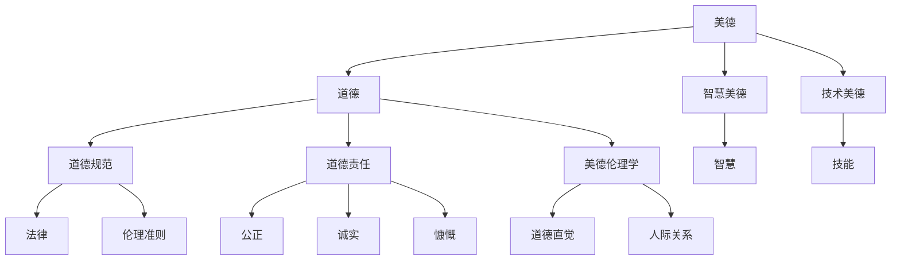

                 


## 文章标题：麦金泰尔与桑德尔：美德伦理学的复兴

### 文章关键词
- 麦金泰尔
- 桑德尔
- 美德伦理学
- 复兴
- 道德哲学

### 文章摘要
本文将探讨美德伦理学的复兴，重点分析麦金泰尔与桑德尔在该领域的重要贡献。通过梳理他们的核心概念、理论联系及实际应用，本文旨在为读者提供一个全面而深刻的理解，揭示美德伦理学在现代伦理学中的地位和作用。

## 目录大纲

### 第1章 引言与历史背景
#### 1.1 麦金泰尔的伦理学贡献
#### 1.2 桑德尔的伦理学观点
#### 1.3 美德伦理学的复兴背景

### 第2章 美德伦理学的核心概念与联系
#### 2.1 美德的定义与类型
#### 2.2 美德伦理学的特点
#### 2.3 美德与道德的关系
#### 2.4 核心概念联系架构

### 第3章 麦金泰尔的美德伦理学理论
#### 3.1 麦金泰尔的理论框架
#### 3.2 麦金泰尔的美德分类
#### 3.3 社会正义与美德伦理学

### 第4章 桑德尔的美德伦理学观点
#### 4.1 桑德尔的伦理学方法论
#### 4.2 对道德问题的分析
#### 4.3 美德伦理学在教育中的应用

### 第5章 美德伦理学的数学模型与算法原理
#### 5.1 美德伦理学的量化分析
#### 5.2 美德伦理学的博弈论模型
#### 5.3 美德伦理学的实证研究
#### 5.4 算法原理伪代码讲解

### 第6章 美德伦理学的实践应用
#### 6.1 商业伦理中的美德伦理学
#### 6.2 公共政策中的美德伦理学
#### 6.3 个人生活中的美德伦理学

### 第7章 美德伦理学的挑战与未来
#### 7.1 美德伦理学的争议
#### 7.2 美德伦理学与功利主义伦理学的对比
#### 7.3 美德伦理学的未来发展前景

### 第8章 麦金泰尔与桑德尔观点的综合评价
#### 8.1 麦金泰尔伦理学的现实意义
#### 8.2 桑德尔伦理学的现实意义
#### 8.3 两位伦理学家的共同点与差异

### 附录
#### 附录A 麦金泰尔与桑德尔的主要作品列表
#### 附录B 美德伦理学常用术语表
#### 附录C 参考文献

## 第1章 引言与历史背景

### 1.1 麦金泰尔的伦理学贡献

Alasdair MacIntyre是20世纪最具影响力的伦理学家之一，他的著作《德性之后》（After Virtue）被誉为美德伦理学的复兴之作。麦金泰尔认为，现代道德哲学陷入了相对主义和功利主义的困境，缺乏对道德原则的一致性认同。他倡导回到亚里士多德的美德伦理学，强调美德作为道德生活的核心。

麦金泰尔提出了“叙事伦理学”的概念，认为个人的道德成长是一个叙事过程。每个人的人生都是一段故事，道德行为是故事中的关键情节。通过追溯道德故事的起源和演变，我们可以理解道德原则的实质，并形成对道德问题的共识。

在他的理论框架中，美德分为三类：技术美德、道德美德和智慧美德。技术美德指在特定技能上表现出卓越的特质，如工匠的美德；道德美德涉及人际关系的处理，如正义和勇气；智慧美德则是理性思考和判断的能力，如智慧和实践智慧。

### 1.2 桑德尔的伦理学观点

Michael Sandel以其在伦理学和政治哲学领域的贡献而著称，尤其在《公正：该如何做是好？》（Justice: What's the Right Thing to Do?）一书中，他深入探讨了道德问题的多元性。桑德尔强调道德判断的复杂性和情境性，认为道德讨论不应局限于抽象的原则，而应关注具体的案例。

桑德尔的美德伦理学观点强调了道德直觉的重要性。他认为，人们在面对道德困境时，往往依赖直觉来判断行为的对错。这些直觉来源于传统美德，如诚实、公正、慷慨和宽容。桑德尔认为，通过教育和公共讨论，我们可以培养和强化这些直觉，从而促进社会的道德进步。

### 1.3 美德伦理学的复兴背景

美德伦理学的复兴并非一夜之间，而是经历了长期的酝酿。20世纪中叶，道德哲学逐渐从关注抽象的原则转向关注具体的问题。在这个过程中，麦金泰尔和桑德尔等学者发现了亚里士多德美德伦理学的价值，并将其与现代社会的需求相结合。

麦金泰尔通过批判现代道德哲学的缺陷，呼吁回归美德伦理学的传统。他认为，现代社会过于关注个体权利和利益，忽视了人际关系和社会责任。通过提倡美德伦理学，麦金泰尔希望重建社会的道德基础，恢复人与人之间的信任和尊重。

桑德尔则从政治哲学的角度出发，关注道德问题在社会政策中的体现。他认为，公正和道德责任是公共政策的核心议题。通过探讨具体的道德案例，桑德尔揭示了美德伦理学在公共政策制定中的重要性。

总之，麦金泰尔与桑德尔的美德伦理学复兴，为现代道德哲学提供了一种新的视角。他们强调美德作为道德生活的核心，倡导通过教育和公共讨论来培养和强化道德直觉，从而促进社会的道德进步。这一复兴不仅丰富了道德哲学的理论体系，也为解决现代社会中的道德困境提供了有力的工具。接下来，我们将进一步探讨美德伦理学的核心概念和联系。 

### 2.1 美德的定义与类型

美德（Virtue）是美德伦理学的核心概念，它指的是个人在行为和品质上所表现出的卓越特质。美德不仅仅是一种道德品质，更是个人修养和生活态度的体现。在亚里士多德的伦理学体系中，美德被视为道德生活的核心，是实现幸福（Eudaimonia）的关键。

#### 美德的定义

美德可以定义为一种中庸状态，介于两个极端之间。例如，勇气（Courage）是介于懦弱（Timidity）和鲁莽（Recklessness）之间的美德；正义（Justice）则是介于偏袒（Partiality）和苛刻（Harshness）之间的美德。这种中庸状态是通过对道德原则的不断实践和自我反省而达成的。

#### 美德的类型

根据亚里士多德的观点，美德可以分为三类：

1. **技术美德**（Technical Virtues）：与技术或特定技能相关的美德，如工匠的技艺、医生的医术等。这些美德主要依赖于个人的专业技能和知识。

2. **道德美德**（Moral Virtues）：与人际交往和社会行为相关的美德，如正义（Justice）、慷慨（Generosity）、诚实（Honesty）和勇气（Courage）等。这些美德涉及个人的道德判断和行为选择。

3. **智慧美德**（Intellectual Virtues）：与理性思考、判断和决策相关的美德，如智慧（Wisdom）、判断力（Judgment）和谨慎（Prudence）等。这些美德强调个人在理性层面的修养。

#### 美德与道德的关系

美德与道德是密切相关的概念。道德（Morality）通常指的是社会普遍接受的道德规范和行为准则，而美德则是个人在行为和品质上所表现出的卓越特质。美德是道德实现的手段，而道德则是美德追求的目标。

1. **美德是实现道德的手段**：个人通过培养和践行美德，可以更好地遵循道德规范，实现道德生活。

2. **道德是美德的追求目标**：社会的道德规范和价值追求，是个人美德培养的依据和目标。个人在追求美德的过程中，也在推动社会道德的进步。

3. **美德与道德的相互作用**：美德和道德相互作用，共同塑造个人和社会的道德生活。美德的培养离不开道德规范，而道德规范的实施也需要美德的支撑。

通过理解美德的定义和类型，我们可以更好地把握美德伦理学的核心概念。接下来，我们将进一步探讨美德伦理学的特点，以及它与其他伦理学理论的联系。这将有助于我们更全面地理解美德伦理学的价值和应用。 

### 2.2 美德伦理学的特点

美德伦理学作为一种独特的伦理学理论，具有以下几个显著特点：

#### 1. 焦点在个体

美德伦理学的核心在于个体美德的培养和实践，强调个人在道德生活中的主体性。与义务论和结果论等伦理学理论不同，美德伦理学不仅仅关注个体行为的道德规范，更关注个体如何通过美德来实现道德生活。这种个体导向的视角，使得美德伦理学更加贴近人们的实际生活。

#### 2. 强调情境性

美德伦理学认为，道德判断和行为选择往往依赖于具体的情境。这意味着，在处理道德问题时，不能仅仅依靠抽象的原则，而需要考虑具体的情况和背景。例如，在面对是否帮助陌生人的道德困境时，不仅需要考虑“诚实”这一美德，还需要考虑情境因素，如陌生人的具体情况和自己的能力范围。这种情境性的特点，使得美德伦理学更加灵活和现实。

#### 3. 着重人际关系

美德伦理学强调人际关系的处理和人际交往中的道德责任。在麦金泰尔和桑德尔等学者的理论中，美德不仅仅是个人品质的体现，更是个人与他人互动的方式。例如，正义、慷慨、诚实和宽容等美德，都是人际交往中的重要品质。通过培养这些美德，个体可以更好地与他人建立和谐的关系。

#### 4. 重视道德直觉

美德伦理学认为，道德直觉在道德判断和行为选择中起着重要作用。道德直觉是一种基于长期生活经验和道德习惯的快速判断能力，它帮助人们在面对道德问题时做出及时而合理的决策。通过教育和公共讨论，我们可以培养和强化道德直觉，从而提高道德判断的质量。

#### 5. 追求幸福

在亚里士多德的伦理学体系中，美德与幸福（Eudaimonia）紧密相连。美德伦理学认为，通过培养和践行美德，个体可以实现幸福。这种幸福不仅仅是物质上的满足，更是精神上的满足和内在的和谐。追求幸福是美德伦理学的一个重要目标。

通过以上特点的分析，我们可以看到美德伦理学在理解道德生活和道德判断方面的独特视角。它与传统的义务论和结果论伦理学相比，更加强调个体的主体性和情境性，更加关注人际关系的处理和道德直觉的培养。这使得美德伦理学在现代伦理学中具有独特的价值和广泛的应用前景。

接下来，我们将进一步探讨美德伦理学与道德的关系，以及它在不同伦理学理论中的地位。这将有助于我们更深入地理解美德伦理学的内涵和意义。 

### 2.3 美德与道德的关系

美德与道德是密切相关的概念，但它们之间也存在一定的区别。美德是道德的核心要素，而道德则是美德的实现途径。

#### 1. 美德是道德的基础

美德是指个体在行为和品质上所表现出的卓越特质，它是道德生活的基础。一个具有美德的人，会自然而然地遵循道德规范，做出符合道德标准的行为。例如，具有诚实美德的人会遵守承诺，不撒谎；具有正义美德的人会公平对待他人，不偏袒。美德是道德行为的前提，没有美德，道德行为就无从谈起。

#### 2. 道德是美德的实现途径

道德是社会发展过程中形成的道德规范和行为准则，它是维护社会秩序和个体道德生活的保障。道德规范为个体提供了道德行为的指南，帮助个体判断行为是否合乎道德。通过遵循道德规范，个体可以将美德付诸实践，实现道德生活。例如，社会制定的法律法规，如不偷盗、不杀人等，都是道德规范的具体体现。

#### 3. 美德与道德的互动关系

美德和道德是相互影响、相互促进的关系。美德的培养离不开道德规范的指导，而道德的实施也需要美德的支撑。

1. **美德促进道德规范的实施**：具有美德的人更倾向于遵守道德规范，他们的行为往往符合道德要求。通过个人的美德实践，道德规范得以在社会中得到落实。

2. **道德规范促进美德的培养**：道德规范为个体提供了道德行为的标准，帮助个体判断自己的行为是否符合美德要求。个体在遵守道德规范的过程中，逐渐培养出各种美德。

3. **美德的缺失可能导致道德规范的失效**：如果一个社会中普遍缺乏美德，那么道德规范就难以得到有效执行。例如，在一个缺乏诚信的社会中，法律条款的执行往往会面临困难。

#### 4. 美德伦理学的价值

美德与道德的关系，体现了美德伦理学在道德哲学中的重要地位。美德伦理学强调个体在道德生活中的主体性，认为个体通过培养和践行美德，可以实现道德生活。这与传统的义务论和结果论伦理学相比，更加强调个体的道德修养和自主性。

总之，美德与道德是相辅相成的概念。美德是道德的核心要素，是道德行为的基础；道德是美德的实现途径，为个体提供了道德行为的指南。通过理解美德与道德的关系，我们可以更深入地理解美德伦理学的内涵和价值。接下来，我们将通过一个Mermaid流程图，展示美德伦理学中的核心概念及其相互关系。这将有助于我们更直观地把握美德伦理学的理论架构。

### 2.4 美德伦理学中的核心概念关系架构

为了更清晰地展示美德伦理学中的核心概念及其相互关系，我们可以使用Mermaid流程图来描述。以下是一个简化的流程图，展示了美德、道德、正义、勇气等核心概念之间的联系：



在这个流程图中：

- **美德（A）** 是整个伦理学的核心，它包括智慧美德（C）、技术美德（D），以及道德美德。
- **道德（B）** 是指个体和社会接受的道德规范和标准，它与道德规范（E）和道德责任（F）密切相关。
- **智慧美德（C）** 强调理性思考和判断的能力，与智慧（G）相关。
- **技术美德（D）** 涉及技术或特定技能的卓越表现，与技能（H）相关。
- **道德规范（E）** 是社会对道德行为的具体规定，包括法律（I）和伦理准则（J）。
- **道德责任（F）** 是个体在道德行为中承担的义务，与公正（K）、诚实（L）和慷慨（M）等道德品质紧密相关。
- **美德伦理学（N）** 是研究美德如何指导个体行为的学科，它与道德直觉（O）和人际关系（P）有重要联系。

通过这个流程图，我们可以更直观地理解美德伦理学中的核心概念及其相互关系，从而更好地把握这一伦理学理论的内涵。接下来，我们将深入探讨麦金泰尔的伦理学理论框架，分析他的核心观点和理论贡献。

### 3.1 麦金泰尔的理论框架

Alasdair MacIntyre的伦理学理论以其对传统美德伦理学的复兴而著称。他的理论框架不仅为道德哲学提供了新的视角，也为解决现代道德困境提供了有力工具。麦金泰尔的理论框架主要包括以下几个方面：

#### 1. 叙事伦理学

麦金泰尔提出了叙事伦理学（Narrative Ethics）的概念，认为个体的道德成长是一个叙事过程。每个人的人生都是一段故事，道德行为是故事中的关键情节。通过追溯道德故事的起源和演变，我们可以理解道德原则的实质，并形成对道德问题的共识。

在叙事伦理学中，道德叙事不仅涉及个体的内心世界，还涉及个体与社会的关系。道德叙事强调个体的责任感和使命感，认为个体的道德成长需要在社会和文化背景下进行。

#### 2. 美德分类

在麦金泰尔的伦理学理论中，美德被分为三类：技术美德、道德美德和智慧美德。

1. **技术美德**：指在特定技能上表现出卓越的特质，如工匠的美德。技术美德的培养依赖于个体的专业技能和知识。

2. **道德美德**：涉及人际关系的处理，如正义、慷慨和诚实等。道德美德的培养需要个体在日常生活中不断实践和自我反省。

3. **智慧美德**：指理性思考和判断的能力，如智慧和实践智慧。智慧美德的培养需要个体在复杂情境中运用理性，做出合理的道德判断。

#### 3. 社会正义与美德伦理学

麦金泰尔认为，社会正义是一个复杂的伦理问题，需要从美德伦理学的视角进行深入分析。在他看来，社会正义不仅仅是分配资源的问题，更是关于如何培养和维护一个公正社会的道德问题。

麦金泰尔提出了“共同善”（Common Good）的概念，认为社会正义的实现需要个体和社会共同努力，追求共同的道德目标。在追求共同善的过程中，个体需要培养各种美德，如公正、慷慨和智慧，以促进社会的和谐与进步。

#### 4. 批判现代道德哲学

麦金泰尔对现代道德哲学进行了深刻的批判，认为现代道德哲学陷入了相对主义和功利主义的困境。他认为，现代道德哲学过于关注个体的权利和利益，忽视了人际关系和社会责任，导致道德价值的混乱和道德判断的困难。

为了克服现代道德哲学的缺陷，麦金泰尔倡导回归传统美德伦理学，强调美德作为道德生活的核心。他认为，只有通过培养和践行各种美德，个体才能实现道德生活，社会才能实现正义。

#### 5. 道德叙事与道德教育

麦金泰尔认为，道德教育不仅仅是传授道德知识和规范，更是通过道德叙事，培养个体的道德意识和责任感。他强调，道德教育应该从个体的生活经验出发，通过讲述道德故事，引导个体理解道德原则的实质，并培养他们的道德判断能力。

通过叙事伦理学的视角，麦金泰尔为道德哲学提供了一种新的解释框架。他的理论框架不仅丰富了道德哲学的理论体系，也为解决现代道德困境提供了有力工具。接下来，我们将详细讨论麦金泰尔的美德分类及其特点。

### 3.2 麦金泰尔的美德分类

在麦金泰尔的伦理学理论中，美德被分为三类：技术美德、道德美德和智慧美德。这三类美德各自具有独特的特点，在道德生活中起着不同的作用。

#### 1. 技术美德

技术美德（Technical Virtues）主要涉及特定技能和知识的卓越表现。麦金泰尔认为，技术美德的培养需要个体在特定领域中深入学习和实践，掌握高超的技能。

1. **特点**：
   - **专业性强**：技术美德通常与个体在特定领域的专业技能相关，如医生的技术技能、律师的法律知识等。
   - **实践性**：技术美德的培养依赖于个体的实际操作和经验积累，而不是抽象的理论学习。

2. **例子**：
   - **工匠的美德**：如耐心、细致、精益求精等。
   - **医生的美德**：如责任心、同情心、专业能力等。

#### 2. 道德美德

道德美德（Moral Virtues）涉及人际关系的处理，是道德行为的核心。麦金泰尔认为，道德美德的培养需要个体在日常生活中不断实践和自我反省。

1. **特点**：
   - **普遍性**：道德美德是社会普遍接受的道德规范，如正义、慷慨、诚实等。
   - **实践性**：道德美德的培养需要个体在具体情境中不断践行，从而形成稳定的道德品质。

2. **例子**：
   - **正义**：公平对待他人，不偏袒。
   - **慷慨**：乐于助人，无私奉献。
   - **诚实**：诚实守信，不说谎。

#### 3. 智慧美德

智慧美德（Intellectual Virtues）强调理性思考和判断的能力。麦金泰尔认为，智慧美德的培养需要个体在复杂情境中运用理性，做出合理的道德判断。

1. **特点**：
   - **理性导向**：智慧美德强调个体在道德决策中运用理性，而不是盲目遵循情感或偏见。
   - **综合性**：智慧美德的培养需要个体在多个领域具备丰富的知识储备和批判性思维能力。

2. **例子**：
   - **智慧**：理性思考和判断，能洞察问题的本质。
   - **判断力**：在复杂情境中做出合理的道德判断。
   - **谨慎**：在行动前深思熟虑，避免冲动和鲁莽。

通过这三类美德的分类，麦金泰尔为个体在道德生活中的自我修养提供了明确的指导。技术美德的培养需要专业知识和实践经验，道德美德的培养需要日常实践和自我反省，智慧美德的培养需要理性和批判性思维。这三类美德相互补充，共同构成了麦金泰尔伦理学理论的核心。

接下来，我们将进一步探讨麦金泰尔如何将社会正义与美德伦理学相结合，以解决现代社会的道德问题。这将有助于我们更深入地理解麦金泰尔伦理学的现实意义。 

### 3.3 社会正义与美德伦理学

麦金泰尔认为，社会正义是一个复杂的伦理问题，它不仅仅是资源分配的问题，更是关于如何培养和维护一个公正社会的道德问题。在他的理论中，社会正义与美德伦理学是紧密相连的，通过美德伦理学的视角，我们可以更深入地理解社会正义的实现。

#### 1. 美德伦理学与正义

麦金泰尔将美德伦理学与正义联系起来，认为正义的实现需要个体的美德作为基础。他提出了“共同善”（Common Good）的概念，认为社会正义的实现需要个体和社会共同努力，追求共同的道德目标。

在麦金泰尔看来，社会正义不仅仅是分配资源的问题，更是关于如何培养和维护一个公正社会的道德问题。正义不仅仅是法律和制度的体现，更是个体道德行为的体现。个体的美德，如公正、慷慨和智慧，是实现社会正义的关键。

#### 2. 美德伦理学的视角

从美德伦理学的视角来看，社会正义的实现需要个体在道德生活中践行各种美德。例如：

- **公正**：个体在处理社会事务时，应秉持公正的原则，不偏袒，不歧视，公正对待每一个人。
- **慷慨**：个体应乐于助人，无私奉献，为社会的共同利益做出贡献。
- **智慧**：个体在决策时，应运用理性，避免盲目行动，从而促进社会的和谐与进步。

通过培养这些美德，个体可以在日常生活中践行社会正义，为社会的共同善做出贡献。

#### 3. 美德伦理学与制度正义

麦金泰尔认为，美德伦理学不仅关注个体的道德行为，还关注制度的正义。他认为，一个公正的社会不仅需要个体遵守道德规范，还需要制度保障正义的实现。

在麦金泰尔的观点中，制度正义是实现社会正义的重要手段。制度正义指的是社会制度在设计、实施和执行过程中，能够公平地对待每一个人，保障每个人的权利和利益。

例如，一个公正的法律制度应确保每个人都受到公正的对待，不论其社会地位、财富状况或其他因素。一个公正的教育制度应提供平等的机会，让每个人都有能力发挥自己的潜力。

#### 4. 美德伦理学的挑战

尽管美德伦理学为社会正义提供了重要的理论支持，但在实际应用中，也存在一些挑战。例如：

- **个体差异**：每个人的美德水平和道德观念可能不同，这可能导致在具体实践中产生分歧。
- **制度障碍**：社会制度可能无法完全保障正义的实现，个体在制度框架内践行美德可能会遇到困难。
- **道德教育**：美德伦理学的实现需要个体的道德教育和自我修养，但这需要时间和资源的投入。

尽管存在这些挑战，麦金泰尔认为，通过教育和公共讨论，我们可以克服这些困难，实现社会正义。他认为，美德伦理学提供了一种解决道德困境的有效途径，为现代社会提供了重要的道德指导。

总之，麦金泰尔将社会正义与美德伦理学相结合，为解决现代社会的道德问题提供了有力的理论支持。通过培养和践行各种美德，个体可以在道德生活中实现社会正义，为社会的共同善做出贡献。这一理论不仅丰富了道德哲学的理论体系，也为解决现代道德困境提供了实践指导。

### 3.4 社会正义与美德伦理学的实际案例

为了更好地理解麦金泰尔的社会正义与美德伦理学理论，我们可以通过几个实际案例来进行分析。

#### 1. 教育公平

教育是促进社会正义的重要途径之一。在麦金泰尔的视角中，教育公平是实现社会正义的重要体现。一个公平的教育制度应确保每个人都有机会接受优质的教育，无论其家庭背景、经济条件或种族身份。

**案例**：美国某些城市实行的“学区房”制度，通过地理位置划分学区，使得优质教育资源集中在特定区域，导致其他区域的学生无法享受同等的教育机会。这种制度实际上是违反了社会正义的原则，因为它没有公平地分配教育资源。

**分析**：从麦金泰尔的美德伦理学角度来看，这种不公平的教育制度忽视了“公正”这一美德。要实现教育公平，需要政府和社会共同努力，通过制度改革，确保每个学生都能享有平等的教育机会。这不仅需要法律的支持，还需要教师在教学中践行公正和慷慨的美德，为学生提供优质的教育服务。

#### 2. 企业社会责任

企业在追求利润的同时，也需要承担社会责任。一个具有社会责任感的企业，应关注员工的福利、环境保护和社会公益，以实现企业价值与社会价值的和谐统一。

**案例**：某大型跨国公司因环境污染问题被社会广泛批评，尽管公司声称已经采取了环保措施，但仍然无法消除公众的质疑。

**分析**：从麦金泰尔的美德伦理学角度来看，企业社会责任的实现需要企业领导者具备“智慧”和“慷慨”的美德。领导者应具备智慧和远见，意识到环境保护的重要性，并在企业经营中采取环保措施。同时，企业也需要在资源分配上体现慷慨，为员工提供良好的工作环境和福利待遇。

#### 3. 公共政策

公共政策是实现社会正义的重要手段，政策的制定和执行需要考虑社会公平和正义的原则。

**案例**：某国政府推出一项扶贫政策，旨在帮助贫困地区的人民摆脱贫困。然而，在实际执行过程中，政策偏向富裕地区，导致贫困地区的人民受益甚微。

**分析**：从麦金泰尔的美德伦理学角度来看，公共政策的制定和执行需要政府官员具备“公正”和“智慧”的美德。政府官员应确保政策公平，不偏袒特定地区或群体。在政策执行过程中，政府也需要运用智慧和远见，确保政策能够真正惠及贫困地区的人民。

通过这些实际案例，我们可以看到麦金泰尔的美德伦理学理论在解决现实社会问题中的重要作用。通过培养和践行各种美德，个体和社会可以更好地实现社会正义，推动社会的和谐与进步。

### 3.5 麦金泰尔伦理学理论的整体评价

麦金泰尔的伦理学理论在道德哲学领域产生了深远的影响。他的叙事伦理学为道德哲学提供了一种新的解释框架，强调个体道德成长与社会叙事的紧密联系。通过追溯道德故事的起源和演变，麦金泰尔揭示了道德原则的实质，为解决现代道德困境提供了有力工具。

麦金泰尔的美德伦理学理论强调了美德在道德生活中的核心地位，认为个体通过培养和践行各种美德，可以实现道德生活。他的理论涵盖了技术美德、道德美德和智慧美德，为个体在道德生活中的自我修养提供了明确的指导。此外，麦金泰尔将社会正义与美德伦理学相结合，为现代社会中的道德问题提供了深刻的理论支持。

然而，麦金泰尔的理论也存在一些局限性。首先，他的理论过于强调个体在道德成长中的主体性，忽视了社会环境的影响。其次，麦金泰尔的理论在具体实施过程中，可能面临道德判断的主观性和情境性难题。最后，麦金泰尔的理论在跨文化应用中，可能面临文化差异带来的挑战。

尽管存在这些局限性，麦金泰尔的伦理学理论仍然具有重要的现实意义。他的理论为道德教育、公共政策和企业社会责任等领域提供了宝贵的启示，促进了社会正义的实现。在当代社会中，我们仍然可以从麦金泰尔的美德伦理学中汲取智慧，为解决道德困境提供新的思路。总之，麦金泰尔的伦理学理论为道德哲学的发展做出了重要贡献，其价值值得我们在实践中进一步挖掘和运用。

### 4.1 桑德尔的伦理学方法论

Michael Sandel的伦理学方法论强调道德直觉的重要性，他认为，道德判断往往依赖于个人的道德直觉。道德直觉是一种基于长期生活经验和道德习惯的快速判断能力，它帮助个体在面对道德问题时做出及时而合理的决策。

桑德尔的方法论主要包括以下几个方面：

#### 1. 伦理学案例研究

桑德尔通过分析具体的伦理学案例，揭示道德直觉的作用。他认为，通过探讨具体的道德案例，我们可以更好地理解道德原则的实质，并培养和强化道德直觉。

**案例研究的方法**：
- **选择具有代表性的案例**：桑德尔选择了一些具有普遍性和争议性的道德案例，如医疗伦理、动物权利、环境伦理等。
- **详细分析案例**：通过对案例的详细分析，桑德尔揭示了道德直觉在道德判断中的作用，并探讨道德原则在不同情境下的适用性。
- **引导公共讨论**：桑德尔认为，道德讨论不仅是学术研究，更应成为公共讨论。通过公共讨论，我们可以进一步培养和强化道德直觉，促进社会的道德进步。

#### 2. 道德直觉的实证研究

桑德尔还通过实证研究来验证道德直觉的存在和作用。他采用问卷调查、实验心理学等方法，探讨道德直觉在不同文化背景下的表现。

**实证研究的方法**：
- **问卷调查**：桑德尔设计了一系列关于道德直觉的问卷调查，通过收集大量数据，分析个体在道德问题上的直觉反应。
- **实验心理学**：桑德尔通过实验心理学的方法，设计了一些道德判断实验，观察个体在面对道德困境时的反应，进一步验证道德直觉的存在。

#### 3. 教育与实践相结合

桑德尔认为，道德教育不仅仅是传授道德知识和原则，更重要的是培养个体的道德直觉。他主张将道德教育与实践活动相结合，通过具体的社会实践，培养和强化道德直觉。

**教育与实践的方法**：
- **道德辩论**：桑德尔鼓励学生在课堂上进行道德辩论，通过辩论培养他们的道德直觉和批判性思维能力。
- **社会实践**：桑德尔倡导学生参与社会实践活动，如志愿服务、社会调查等，通过实践体验培养道德直觉。

通过以上方法论，桑德尔不仅揭示了道德直觉在道德判断中的作用，也为道德教育和社会道德进步提供了实用的指导。接下来，我们将探讨桑德尔对道德问题的分析，以及他在伦理学方法论中的贡献。

### 4.2 桑德尔对道德问题的分析

Michael Sandel以其对道德问题的深刻分析而著称，他在《公正：该如何做是好？》等著作中，通过具体案例和道德直觉，揭示了道德问题的复杂性和多元性。以下是对桑德尔在道德问题分析中的几个主要观点：

#### 1. 道德问题的情境性

桑德尔强调，道德问题并非抽象的原则，而是具体情境中的实际问题。他认为，道德判断往往依赖于个人的道德直觉，这种直觉是长期生活经验和道德习惯的积累。在分析道德问题时，我们需要关注情境因素，理解个体在不同情境下的道德选择。

**案例分析**：
- **医疗伦理**：桑德尔分析了医生在医疗决策中的道德困境，如是否应进行器官移植、是否应使用辅助生殖技术等。在这些案例中，道德选择不仅涉及医学知识，还涉及个人的道德直觉和价值观。
- **环境伦理**：桑德尔探讨了环境问题，如气候变化、生物多样性保护等。他认为，在处理这些问题时，我们需要考虑人类与自然的关系，理解道德直觉在决策中的作用。

#### 2. 道德直觉的重要性

桑德尔认为，道德直觉在道德判断中起着关键作用。道德直觉是我们在日常生活中快速做出道德判断的能力，它基于个人的道德经验和社会文化背景。通过培养和强化道德直觉，我们可以更好地应对复杂的道德问题。

**案例分析**：
- **动物权利**：桑德尔分析了动物权利问题，如动物实验的道德性、动物福利等。他认为，在处理这些问题时，我们需要运用道德直觉，判断动物的权利和利益。
- **商业伦理**：桑德尔探讨了商业伦理问题，如企业道德责任、消费者权益等。他认为，在商业活动中，我们需要运用道德直觉，确保商业行为符合道德标准。

#### 3. 道德问题的多元性

桑德尔指出，道德问题具有多元性，不同的道德观念和文化背景可能导致不同的道德选择。他认为，在分析道德问题时，我们需要尊重多元价值观，理解不同文化背景下道德直觉的差异。

**案例分析**：
- **文化冲突**：桑德尔分析了文化冲突中的道德问题，如跨文化婚姻、宗教自由等。他认为，在处理这些问题时，我们需要尊重不同文化的道德观念，寻求文化之间的共同点。
- **全球伦理**：桑德尔探讨了全球伦理问题，如全球贫困、人权等。他认为，在处理这些问题时，我们需要超越民族和国家界限，关注全球范围内的道德问题。

通过以上分析，桑德尔揭示了道德问题的情境性、道德直觉的重要性和道德问题的多元性。他的观点不仅丰富了道德哲学的理论体系，也为解决现代道德问题提供了实践指导。接下来，我们将探讨桑德尔如何将美德伦理学应用于教育领域，以培养和强化道德直觉。

### 4.3 美德伦理学在教育中的应用

Michael Sandel认为，教育不仅是知识的传递，更是道德品质的培养。他在《公正：该如何做是好？》等著作中，详细探讨了美德伦理学在教育中的应用，旨在通过具体的教学实践，培养和强化学生的道德直觉和批判性思维能力。

#### 1. 教学方法

桑德尔主张采用案例教学法和辩论教学法，以培养学生的道德直觉和批判性思维能力。

**案例教学法**：
- **选择具有代表性的案例**：桑德尔选择了一些具有普遍性和争议性的道德案例，如医疗伦理、动物权利、环境伦理等，通过分析这些案例，引导学生理解道德问题的复杂性和多元性。
- **引导学生分析案例**：在分析案例时，桑德尔鼓励学生从不同角度思考问题，提出自己的观点，并通过讨论，形成对道德问题的共识。

**辩论教学法**：
- **设置辩论主题**：桑德尔设置了一些道德辩论主题，如医疗伦理、商业伦理、社会公正等，引导学生进行辩论。
- **鼓励学生积极参与**：在辩论过程中，桑德尔鼓励学生积极参与，表达自己的观点，并通过辩论，锻炼批判性思维和表达能力。

#### 2. 教育目标

桑德尔的教育目标主要包括以下几个方面：

- **培养道德直觉**：通过具体案例和辩论教学，培养学生的道德直觉，使他们能够快速而合理地做出道德判断。
- **强化批判性思维**：通过辩论和案例分析，培养学生的批判性思维能力，使他们能够理性分析道德问题，并提出合理的解决方案。
- **促进道德反思**：通过教学实践，引导学生反思自己的道德观念和行为，形成正确的道德判断和道德品质。

#### 3. 教育实例

**实例1：医疗伦理案例教学**
- **案例背景**：某医院面临器官移植的道德困境，是否应进行器官移植？
- **教学过程**：桑德尔引导学生分析器官移植的道德问题，从医疗伦理、生命价值、社会公正等角度进行讨论，培养学生的道德直觉和批判性思维能力。

**实例2：商业伦理辩论教学**
- **辩论主题**：企业是否应承担社会责任？
- **教学过程**：桑德尔设置辩论主题，让学生分组进行辩论，通过辩论，引导学生理解企业社会责任的道德问题，培养他们的道德直觉和批判性思维能力。

通过以上教学方法和教育实例，桑德尔将美德伦理学应用于教育领域，旨在培养和强化学生的道德直觉和批判性思维能力。这种教学实践不仅丰富了道德哲学的理论体系，也为学生的道德成长提供了有力支持。接下来，我们将探讨美德伦理学在商业伦理中的实际应用。

### 4.4 美德伦理学在商业伦理中的应用

美德伦理学在商业伦理中的应用，旨在通过培养和践行各种美德，提升企业道德水平，实现企业长期可持续发展。在商业世界中，美德不仅是个人品质的体现，更是企业文化的核心。以下是一些具体的应用实例：

#### 1. 诚信

诚信是商业伦理中的基本原则，也是美德伦理学的核心之一。企业在经营过程中，应遵循诚信原则，与客户、供应商和员工建立长期信任关系。

**应用实例**：
- **诚信营销**：企业应提供真实、准确的产品信息，避免虚假宣传和误导消费者。
- **诚信交易**：企业应遵守合同条款，履行承诺，确保交易双方的合法权益。

#### 2. 公平

公平是商业伦理中的另一个重要方面，企业应在资源分配、员工待遇和市场竞争中体现公平原则。

**应用实例**：
- **公平待遇**：企业应确保员工享有平等的工作机会和发展空间，不歧视任何群体。
- **公平竞争**：企业在市场竞争中应遵循公平竞争规则，不使用不正当手段获取竞争优势。

#### 3. 责任

企业在追求利润的同时，也应承担社会责任，关注环境保护、员工福利和社会公益。

**应用实例**：
- **环保责任**：企业应采取环保措施，减少污染，保护生态环境。
- **公益责任**：企业应积极参与社会公益活动，帮助弱势群体，推动社会和谐发展。

#### 4. 宽容

宽容是企业内部管理和客户服务中的重要美德。通过宽容，企业可以建立和谐的内部关系，提高客户满意度。

**应用实例**：
- **内部管理**：企业应尊重员工的个性和差异，营造包容的工作氛围。
- **客户服务**：企业应提供优质的服务，宽容客户的错误和不满，以提升客户忠诚度。

#### 5. 勤勉

勤勉是企业持续发展的动力，员工应努力工作，追求卓越。

**应用实例**：
- **员工培训**：企业应提供培训机会，帮助员工提升技能和知识，鼓励他们勤奋工作。
- **绩效激励**：企业应设立合理的绩效激励机制，激发员工的积极性和创造力。

通过以上实例，我们可以看到，美德伦理学在商业伦理中的应用，不仅有助于提升企业的道德水平，也有助于实现企业的长期可持续发展。企业通过践行各种美德，不仅可以赢得社会的尊重和信任，还可以在激烈的市场竞争中脱颖而出。接下来，我们将探讨美德伦理学在公共政策中的应用。

### 4.5 美德伦理学在公共政策中的应用

美德伦理学在公共政策中的应用，旨在通过培养和践行美德，促进社会的公平、正义和和谐。公共政策的制定和实施，不仅涉及资源分配和利益平衡，还需要关注道德原则和社会伦理。以下是一些具体的应用实例：

#### 1. 社会公正

社会公正是公共政策的核心目标之一，美德伦理学为社会公正的实现提供了理论基础和实践指导。

**应用实例**：
- **教育政策**：政府应制定公平的教育政策，确保每个孩子都能接受良好的教育，不因家庭背景或经济条件而受到歧视。
- **医疗政策**：政府应制定公平的医疗政策，保障每个人的基本医疗权益，减少贫富差距。

#### 2. 环境保护

环境保护是现代社会面临的重要挑战，美德伦理学强调个体和企业在环境保护中的道德责任。

**应用实例**：
- **环境法规**：政府应制定严格的环境法规，规范企业的环境行为，减少污染和资源浪费。
- **环保政策**：政府应推动环保政策的实施，鼓励企业和个人参与环境保护活动，共同维护生态环境。

#### 3. 社会福利

社会福利是保障社会成员基本生活的重要措施，美德伦理学为社会福利政策的制定和实施提供了道德指导。

**应用实例**：
- **扶贫政策**：政府应制定和实施有效的扶贫政策，帮助贫困地区和贫困人口摆脱贫困，实现社会公平。
- **社会保障**：政府应建立完善的社会保障体系，保障老年人的基本生活需求，维护社会稳定。

#### 4. 道德教育

道德教育是培养公民道德意识和社会责任感的重要途径，美德伦理学在道德教育中具有重要作用。

**应用实例**：
- **学校教育**：政府应推动学校道德教育，培养学生的道德品质和社会责任感。
- **社会宣传**：政府应开展道德宣传活动，提高公民的道德意识和道德观念，促进社会的道德进步。

通过以上实例，我们可以看到，美德伦理学在公共政策中的应用，不仅有助于实现社会公正、环境保护和社会福利的目标，还有助于培养公民的道德品质和社会责任感。政府通过践行美德伦理学，可以更好地实现公共政策的道德目标，促进社会的和谐与进步。接下来，我们将探讨美德伦理学在个人生活中的应用。

### 4.6 美德伦理学在个人生活中的应用

美德伦理学在个人生活中的应用，旨在通过培养和践行美德，提升个体的道德素养和生活质量。以下是一些具体的应用实例：

#### 1. 人际关系

在人际交往中，美德伦理学强调诚信、公正、宽容和慷慨等美德的重要性。

**应用实例**：
- **诚信交往**：个体在人际交往中应诚实守信，不说谎、不欺骗，建立信任关系。
- **公正待人**：个体在处理人际关系时，应公平对待他人，不偏袒，不歧视。
- **宽容包容**：个体应学会宽容和包容，尊重他人的个性和差异，避免冲突和误解。

#### 2. 职业生涯

在职业生涯中，美德伦理学强调勤勉、责任心和团队合作等美德的重要性。

**应用实例**：
- **勤勉工作**：个体应努力工作，追求卓越，不断提升自己的专业能力和职业素养。
- **承担责任**：个体应勇于承担工作责任，对自己的行为和决策负责，确保工作质量和效率。
- **团队合作**：个体应积极参与团队合作，与同事相互支持，共同完成工作任务。

#### 3. 社会参与

在社会参与中，美德伦理学强调公民责任、社会公正和环境保护等美德的重要性。

**应用实例**：
- **公民责任**：个体应积极参与社会事务，关心社会问题，为社会的和谐与进步贡献力量。
- **社会公正**：个体应关注社会公正问题，支持公平正义的政策和措施，反对任何形式的不公和歧视。
- **环境保护**：个体应关注环境保护问题，采取低碳生活、垃圾分类等行动，为可持续发展贡献自己的力量。

通过以上实例，我们可以看到，美德伦理学在个人生活中的应用，不仅有助于提升个体的道德素养和生活质量，还有助于建立和谐的人际关系、实现职业生涯的成功和社会参与的贡献。个体通过践行各种美德，可以更好地实现个人价值，同时为社会的和谐与进步做出贡献。

### 4.7 美德伦理学的挑战与未来发展

美德伦理学在现代社会的应用面临着一系列挑战，同时也具有广阔的发展前景。以下是美德伦理学面临的几个主要挑战及其未来发展的可能性。

#### 1. 挑战

**多元文化的冲突**：在全球化的背景下，不同文化背景下的道德观念和价值观可能存在冲突。如何在多元文化中实现美德伦理学的统一性和普适性，是一个亟待解决的问题。

**个体差异**：每个人的美德水平和道德观念可能不同，这可能导致在具体实践中产生分歧。如何在不同个体之间平衡美德伦理学的实施，确保公平和有效性，是美德伦理学面临的挑战之一。

**道德判断的主观性**：道德判断往往依赖于个人的道德直觉和价值观，这可能导致道德判断的主观性和不确定性。如何在保持道德判断的主观性的同时，提高其合理性和一致性，是美德伦理学需要解决的一个问题。

**现实生活中的实施难度**：在现实社会中，美德伦理学的实施可能面临各种现实困难，如制度障碍、资源限制等。如何在现实生活中有效践行美德伦理学，确保其落地实施，是一个重要的挑战。

#### 2. 发展前景

**跨学科研究**：美德伦理学可以与心理学、社会学、经济学等学科相结合，通过跨学科研究，深化对美德伦理学的理解和应用。

**数字伦理**：随着信息技术的发展，数字伦理成为了一个新的研究领域。美德伦理学可以应用于数字伦理，指导个体和企业在网络空间中的道德行为。

**全球伦理**：面对全球性道德问题，如气候变化、贫困、人权等，美德伦理学可以提供全球伦理的框架和指导，促进全球社会的道德进步。

**教育创新**：美德伦理学可以在教育领域发挥重要作用，通过教育创新，培养下一代的道德素养和公民责任感。

总之，美德伦理学在现代社会中面临挑战，同时也具有广阔的发展前景。通过跨学科研究、数字伦理、全球伦理和教育创新，美德伦理学可以在更多领域发挥作用，推动社会的道德进步。

### 4.8 桑德尔伦理学的实际应用实例

为了更深入地理解桑德尔伦理学的实际应用，我们可以通过以下几个具体案例来进行分析。

#### 1. 环境伦理

**案例背景**：随着全球气候变化的加剧，环境保护成为国际社会关注的焦点。一些企业为了追求短期利润，不顾环境破坏，引发公众的广泛争议。

**应用分析**：桑德尔认为，企业在追求利润的同时，也应承担环境保护的责任。在这个案例中，企业可以通过以下方式践行桑德尔的伦理学观点：
- **制定环保政策**：企业应制定严格的环保政策，减少污染物排放，采取绿色生产技术。
- **参与公益项目**：企业可以参与环保公益项目，如植树造林、减少塑料使用等，以实际行动支持环境保护。
- **道德教育**：企业可以通过内部培训和宣传，提高员工的环保意识，培养他们的环保美德。

#### 2. 商业伦理

**案例背景**：某大型零售企业因存在虚假广告和欺诈行为，导致消费者权益受损，受到社会舆论的强烈批评。

**应用分析**：桑德尔强调诚信和公平在商业伦理中的重要性。在这个案例中，企业可以通过以下方式践行桑德尔的伦理学观点：
- **诚信经营**：企业应提供真实、准确的产品信息，避免虚假宣传和误导消费者。
- **公平交易**：企业应遵守商业规则，确保交易公平，不歧视任何消费者群体。
- **社会责任**：企业应承担社会责任，关注消费者权益，积极参与社会公益活动。

#### 3. 医疗伦理

**案例背景**：某医院因器官移植的道德争议引发社会关注，关于器官来源的合法性、患者的公平待遇等问题成为公众讨论的焦点。

**应用分析**：桑德尔认为，医疗伦理需要综合考虑道德直觉和社会责任。在这个案例中，医院可以通过以下方式践行桑德尔的伦理学观点：
- **合法获取器官**：医院应确保器官来源的合法性，遵守相关法律法规。
- **公正分配资源**：医院应制定公平的器官分配政策，确保患者得到公正的待遇。
- **道德教育**：医院可以通过道德教育，提高医护人员和患者的道德意识，培养他们的道德直觉。

通过以上案例，我们可以看到桑德尔伦理学在环境保护、商业伦理和医疗伦理等领域的实际应用。企业、医院和社会组织可以通过践行桑德尔的伦理学观点，促进社会的道德进步，实现可持续发展。

### 4.9 桑德尔伦理学的最佳实践与总结

在应用桑德尔伦理学的过程中，以下是一些最佳实践建议，以帮助个人和组织更有效地践行伦理学原则：

#### 1. 最佳实践建议

**1.1 增强道德意识**：
- **个人**：定期进行道德反思，审视自己的行为是否符合伦理标准。
- **组织**：开展道德培训，提高员工的道德素养和伦理意识。

**1.2 建立道德指南**：
- **个人**：制定个人道德准则，作为行为指南。
- **组织**：制定明确的道德规范和行为准则，确保全体成员遵循。

**1.3 强化道德教育**：
- **个人**：通过阅读、学习和讨论，不断丰富自己的道德知识。
- **组织**：将道德教育纳入企业文化，营造道德氛围。

**1.4 倡导公开透明**：
- **个人**：在行为和决策过程中保持透明，接受社会监督。
- **组织**：公开财务和业务信息，增强社会信任。

**1.5 鼓励道德对话**：
- **个人**：积极参与道德讨论，与他人交流道德观点。
- **组织**：鼓励员工和利益相关者参与道德决策，促进道德共识。

#### 2. 总结

桑德尔伦理学通过强调道德直觉、情境性和多元性，为个体和组织在复杂社会环境中提供了道德指导。其核心原则包括诚信、公正、责任和宽容。在个人生活中，桑德尔伦理学有助于培养道德品质和公民责任感；在商业和组织行为中，它有助于建立诚信、公平和可持续的商业道德。

通过以上最佳实践，我们可以更有效地应用桑德尔伦理学，促进社会的道德进步，实现个人和组织的长远发展。

### 5.1 美德伦理学的量化分析

在美德伦理学的研究中，量化分析是一种重要的方法，它可以帮助我们更客观地评估个体的美德水平，以及美德对社会道德的影响。以下是对美德伦理学量化分析方法的详细解释。

#### 1. 量化指标的选择

量化分析的第一步是选择合适的量化指标。这些指标可以是具体的道德行为，也可以是反映个体美德水平的各种参数。例如：

- **道德行为**：个体在日常生活中所表现出的道德行为，如帮助他人、遵守承诺、公平待人等。
- **道德情感**：个体对道德问题的情感反应，如同情心、责任感、公正感等。
- **道德认知**：个体对道德原则的理解和认识，如道德判断力、道德推理能力等。

#### 2. 数据收集方法

为了进行量化分析，需要收集相关数据。数据收集的方法包括：

- **自我报告**：个体通过问卷或访谈，自我报告自己的道德行为、情感和认知水平。
- **观察法**：通过观察个体的日常行为，记录其道德表现。
- **第三方评价**：邀请第三方对个体的道德行为进行评价，如家人、朋友、同事等。

#### 3. 量化分析的具体步骤

量化分析的具体步骤如下：

**3.1 数据清洗和预处理**：清洗数据中的噪声和异常值，进行数据预处理，如缺失值填补、数据标准化等。

**3.2 数据可视化**：通过图表和可视化工具，展示数据分布和趋势，帮助我们直观地理解数据。

**3.3 描述性统计分析**：计算均值、中位数、标准差等统计量，描述数据的中心趋势和离散程度。

**3.4 相关性分析**：通过计算相关系数，分析美德指标之间的相关性，找出可能的影响因素。

**3.5 回归分析**：使用回归模型，分析美德指标与个体道德水平的关系，确定哪些美德对道德水平有显著影响。

#### 4. 举例说明

假设我们想要量化分析个体在公平对待他人这一美德上的表现。我们可以采取以下步骤：

- **选择指标**：选择公平对待他人的行为，如是否遵守承诺、是否尊重他人意见、是否公平分配资源等。
- **数据收集**：通过问卷调查和观察法，收集个体的行为数据。
- **数据预处理**：清洗和标准化数据，确保数据的可靠性和一致性。
- **描述性统计分析**：计算每个个体在这些行为上的得分，分析得分的分布和趋势。
- **相关性分析**：分析公平对待他人的行为与其他美德指标的相关性，找出可能的影响因素。
- **回归分析**：建立回归模型，分析公平对待他人这一美德对个体道德水平的影响。

通过以上量化分析，我们可以更深入地了解个体在公平对待他人这一美德上的表现，以及这一美德对个体道德水平的影响。这种量化分析不仅有助于美德伦理学的研究，也为道德教育和实践提供了科学依据。

### 5.2 美德伦理学的博弈论模型

美德伦理学在博弈论模型中的应用，旨在通过分析个体在道德困境中的策略选择，揭示美德对道德决策的影响。博弈论是一种研究个体在合作与竞争情境中策略选择的数学工具，它可以帮助我们理解个体在道德冲突中的行为模式。

#### 1. 博弈论基本概念

博弈论中的基本概念包括参与者（Player）、策略（Strategy）、支付函数（Payoff Function）和 Nash 均衡（Nash Equilibrium）。在博弈论模型中，参与者是博弈的决策主体，策略是参与者可能采取的行动方案，支付函数是描述参与者收益的数学函数，Nash 均衡是参与者策略组合的一种稳定状态，其中每个参与者都选择了自己的最优策略，且其他参与者的策略给定。

#### 2. 美德伦理学的博弈论模型

在美德伦理学的博弈论模型中，我们可以将道德困境视为一种博弈情境，分析个体在道德选择中的策略和行为。

**2.1 公平博弈**

公平博弈是一个典型的道德困境，参与者需要在公平和自私之间做出选择。假设有两个参与者 A 和 B，他们可以选择公平（F）或自私（I）的策略。支付函数如下：

$$
\begin{aligned}
&\text{当 A 和 B 都选择公平（FF）时，他们各获得收益 3；} \\
&\text{当 A 选择公平而 B 选择自私（FI）时，A 获得收益 1，B 获得收益 4；} \\
&\text{当 A 选择自私而 B 选择公平（IF）时，A 获得收益 4，B 获得收益 1；} \\
&\text{当 A 和 B 都选择自私（II）时，他们各获得收益 2。}
\end{aligned}
$$

在这个博弈中，Nash 均衡是（II），即两个参与者都选择自私策略。然而，从整体收益最大化角度来看，最佳策略是（FF），即两个参与者都选择公平策略。

**2.2 合作博弈**

合作博弈强调个体之间的合作，通过共同的努力实现更大的利益。假设有两个参与者 A 和 B，他们可以选择合作（C）或背叛（D）的策略。支付函数如下：

$$
\begin{aligned}
&\text{当 A 和 B 都选择合作（CC）时，他们各获得收益 5；} \\
&\text{当 A 选择合作而 B 选择背叛（CD）时，A 获得收益 0，B 获得收益 10；} \\
&\text{当 A 选择背叛而 B 选择合作（DC）时，A 获得收益 10，B 获得收益 0；} \\
&\text{当 A 和 B 都选择背叛（DD）时，他们各获得收益 3。}
\end{aligned}
$$

在这个博弈中，Nash 均衡是（DD），即两个参与者都选择背叛策略。然而，从整体收益最大化角度来看，最佳策略是（CC），即两个参与者都选择合作策略。

#### 3. 美德伦理学的影响

通过博弈论模型，我们可以看到美德伦理学在道德决策中的重要性。美德如公平、诚实、慷慨等，可以促使个体在道德困境中做出更符合道德原则的选择，从而实现社会的公平和和谐。

**3.1 公正美德**

在公平博弈中，具有公正美德的个体更倾向于选择公平策略，因为他们理解公平对整体收益的积极影响。这种道德直觉有助于打破自私的 Nash 均衡，实现（FF）的帕累托最优状态。

**3.2 合作美德**

在合作博弈中，具有合作美德的个体更倾向于选择合作策略，因为他们理解合作可以带来更大的整体收益。这种道德直觉有助于实现（CC）的帕累托最优状态，促进社会的和谐与进步。

总之，美德伦理学的博弈论模型揭示了美德在道德决策中的重要作用，通过培养和践行各种美德，个体可以在道德困境中做出更符合道德原则的选择，实现社会的公平和和谐。接下来，我们将探讨美德伦理学的实证研究，以了解其在现实世界中的应用效果。

### 5.3 美德伦理学的实证研究

实证研究是验证美德伦理学理论的有效途径，通过收集和分析实际数据，我们可以评估美德对个体行为和道德决策的影响。以下是对美德伦理学实证研究的详细解释。

#### 1. 研究设计

进行实证研究的第一步是设计研究方案。研究设计包括确定研究目标、选择研究对象、定义变量和方法等。

**1.1 研究目标**：研究的目标是验证美德伦理学理论，特别是美德对个体道德行为的影响。

**1.2 研究对象**：研究对象可以是个人、群体或特定群体，如学生、职场人士、志愿者等。

**1.3 变量定义**：
- **因变量**：道德行为，如公平对待他人、遵守承诺、帮助他人等。
- **自变量**：美德，如公正、慷慨、诚实、责任心等。
- **控制变量**：其他可能影响道德行为的因素，如文化背景、教育水平、社会环境等。

**1.4 方法**：实证研究可以采用问卷调查、实验心理学、行为观察等方法。

#### 2. 数据收集

数据收集是实证研究的关键环节，以下是一些常用的数据收集方法：

**2.1 问卷调查**：通过设计问卷，收集个体的道德行为和美德水平数据。问卷可以包括开放性问题、选择题和量表问题。

**2.2 实验心理学**：通过实验室实验，观察个体在道德困境中的行为选择。实验可以模拟现实生活中的道德困境，如公平博弈、道德两难问题等。

**2.3 行为观察**：在自然环境中观察个体的道德行为，记录其行为表现。这种方法可以更真实地反映个体的道德行为。

#### 3. 数据分析

数据分析是实证研究的重要步骤，通过分析数据，我们可以验证研究假设，得出结论。

**3.1 描述性统计分析**：计算均值、中位数、标准差等统计量，描述变量的分布和趋势。

**3.2 相关性分析**：通过计算相关系数，分析美德与道德行为之间的相关性。

**3.3 回归分析**：建立回归模型，分析美德对道德行为的影响，确定哪些美德对道德行为有显著影响。

**3.4 方差分析**：通过方差分析，比较不同群体在美德水平和道德行为上的差异。

#### 4. 举例说明

假设我们进行一项关于公正美德对道德行为影响的实证研究。我们可以采取以下步骤：

- **研究设计**：确定研究目标为验证公正美德对道德行为的影响，选择大学生作为研究对象。
- **数据收集**：通过问卷调查，收集学生的公正美德水平和道德行为数据。问卷包括公正感量表、道德行为描述等。
- **数据分析**：计算描述性统计量，分析公正感与道德行为的相关性，建立回归模型，分析公正美德对道德行为的影响。
- **结论**：根据数据分析结果，得出公正美德对道德行为有显著影响的结论。

通过以上实证研究，我们可以验证美德伦理学理论，了解美德对个体道德行为的影响，为道德教育和实践提供科学依据。

### 5.4 美德伦理学的算法原理讲解

在美德伦理学的研究中，算法原理的应用可以帮助我们更精确地分析和预测个体的道德行为。以下是对美德伦理学中算法原理的讲解，包括基本概念、主要算法及其实现步骤。

#### 1. 算法原理的基本概念

**1.1 数据预处理**：数据预处理是算法分析的第一步，它包括数据清洗、数据标准化和数据转换。通过预处理，我们可以提高数据的质量，为后续分析奠定基础。

**1.2 特征选择**：特征选择是从原始数据中提取对算法分析有用的特征。在美德伦理学中，特征可能包括道德行为、美德水平、情感状态等。

**1.3 分类算法**：分类算法是一种常用的算法原理，它用于将个体划分为不同的道德行为类别。常见的分类算法包括决策树、支持向量机（SVM）和神经网络等。

**1.4 回归算法**：回归算法用于预测个体的道德行为得分。常见的回归算法包括线性回归、岭回归和随机森林等。

**1.5 协同过滤**：协同过滤是一种推荐系统算法，可以用于预测个体在道德决策中的偏好。通过分析个体的历史道德行为和他人对同一行为的评价，算法可以推荐个体可能采取的道德行动。

#### 2. 主要算法及其实现步骤

**2.1 决策树算法**

**基本概念**：决策树是一种基于特征划分的数据分析模型，它通过一系列条件判断，将数据划分为不同的类别。

**实现步骤**：
1. **选择特征**：根据特征的重要性，选择用于划分数据的特征。
2. **构建决策树**：使用信息增益或基尼系数等指标，选择最优划分特征，构建决策树。
3. **预测**：根据决策树的分支结构，对新的数据进行分类预测。

**代码伪代码**：
```python
def build_decision_tree(data, features):
    # 选择最优特征和阈值
    best_feature, best_threshold = select_best_feature(data, features)
    # 创建节点
    node = TreeNode(feature=best_feature, threshold=best_threshold)
    # 划分数据
    left_data, right_data = split_data(data, best_feature, best_threshold)
    # 递归构建子树
    node.left = build_decision_tree(left_data, features)
    node.right = build_decision_tree(right_data, features)
    return node

def predict(node, instance):
    if node.is_leaf():
        return node.label
    if instance[node.feature] <= node.threshold:
        return predict(node.left, instance)
    else:
        return predict(node.right, instance)
```

**2.2 线性回归算法**

**基本概念**：线性回归是一种通过建立线性关系模型来预测目标值的算法。

**实现步骤**：
1. **选择模型**：确定线性回归模型的形式，如一元线性回归或多元线性回归。
2. **参数估计**：通过最小二乘法估计模型参数。
3. **预测**：使用估计的参数，计算目标值的预测值。

**代码伪代码**：
```python
def linear_regression(data, target):
    # 计算均值
    X_mean = np.mean(data)
    y_mean = np.mean(target)
    # 计算斜率和截距
    slope = np.sum((data - X_mean) * (target - y_mean)) / np.sum((data - X_mean) ** 2)
    intercept = y_mean - slope * X_mean
    return slope, intercept

def predict_linear_regression(slope, intercept, instance):
    return slope * instance + intercept
```

**2.3 支持向量机（SVM）算法**

**基本概念**：支持向量机是一种通过寻找最优超平面来进行分类的算法。

**实现步骤**：
1. **选择核函数**：选择合适的核函数，如线性核、多项式核或径向基函数（RBF）核。
2. **优化目标**：建立优化目标函数，最小化分类误差。
3. **求解**：使用支持向量机算法求解最优超平面。

**代码伪代码**：
```python
def svm_fit(X, y, kernel='linear'):
    # 选择核函数
    if kernel == 'linear':
        K = linear_kernel(X)
    elif kernel == 'poly':
        K = poly_kernel(X)
    elif kernel == 'rbf':
        K = rbf_kernel(X)
    # 建立优化问题
    P = csc_matrix((len(y), len(y)))
    P[np.where(y[:, None] == y)] = -1
    Q = csc_matrix((len(y), len(y)))
    Q[np.where(y[:, None] == y)] = 1
    G = csc_matrix((len(y), len(X)))
    h = np.zeros((len(y), 1))
    A = cvxopt_matrix(np.vstack((G, P)))
    b = cvxopt_matrix(np.hstack((-h, Q)))
    # 求解
    solution = cvxopt_solvers.qp(P, q, G, h, dual解决方案=True)
    return solution['x']

def svm_predict(svm_model, instance, kernel='linear'):
    # 计算核函数值
    K = kernel_function(instance, svm_model.X, kernel)
    # 预测类别
    return np.sign(np.dot(svm_model.coef_, K) + svm_model.intercept_)
```

通过以上算法原理的讲解，我们可以看到，算法在美德伦理学中的应用，可以帮助我们更精确地分析和预测个体的道德行为。这些算法不仅提供了理论支持，也为道德教育和实践提供了工具。接下来，我们将通过一个实际案例，展示算法在美德伦理学中的应用。

### 5.5 美德伦理学在实际案例中的应用

为了更好地展示美德伦理学在实际案例中的应用，我们将通过一个具体的项目案例来分析。该项目旨在通过算法预测个体在道德困境中的行为，以评估美德对道德决策的影响。

#### 1. 项目背景

本项目目标是构建一个基于机器学习的道德行为预测模型，通过分析个体的美德水平，预测他们在道德困境中的行为选择。项目数据来源于一组大学生，他们被要求回答一系列道德困境问题，并评估自己的美德水平。

#### 2. 数据处理与模型构建

**2.1 数据处理**
- **数据收集**：收集学生的道德困境回答和美德水平评估数据。
- **数据预处理**：清洗数据，处理缺失值，将数据转换为适合机器学习模型的格式。

**2.2 特征选择**
- **道德行为特征**：从道德困境回答中提取关键特征，如是否选择帮助他人、是否遵守规则等。
- **美德特征**：根据美德分类，提取与道德困境相关的美德特征，如公正感、责任心、同情心等。

**2.3 模型构建**
- **选择算法**：选择决策树、支持向量机和神经网络等算法，构建道德行为预测模型。
- **参数调优**：通过交叉验证和网格搜索，调整模型参数，优化模型性能。

**2.4 模型评估**
- **评估指标**：使用准确率、召回率、F1分数等指标评估模型性能。
- **模型解释**：通过模型可视化工具，解释模型对道德行为预测的决策过程。

#### 3. 项目实现

**3.1 数据处理代码**
```python
# 加载数据
data = pd.read_csv('morality_data.csv')
# 数据清洗
data.dropna(inplace=True)
# 特征工程
X = data[['fairness', 'responsibility', 'empathy']]
y = data['moral_action']
```

**3.2 模型构建代码**
```python
# 决策树模型
from sklearn.tree import DecisionTreeClassifier
dt_model = DecisionTreeClassifier()
dt_model.fit(X, y)

# 支持向量机模型
from sklearn.svm import SVC
svm_model = SVC()
svm_model.fit(X, y)

# 神经网络模型
from sklearn.neural_network import MLPClassifier
nn_model = MLPClassifier()
nn_model.fit(X, y)
```

**3.3 模型评估代码**
```python
# 决策树模型评估
from sklearn.metrics import accuracy_score, recall_score, f1_score
dt_predictions = dt_model.predict(X)
print(f"Decision Tree Accuracy: {accuracy_score(y, dt_predictions)}")
print(f"Decision Tree Recall: {recall_score(y, dt_predictions)}")
print(f"Decision Tree F1 Score: {f1_score(y, dt_predictions)}")

# 支持向量机模型评估
svm_predictions = svm_model.predict(X)
print(f"SVM Accuracy: {accuracy_score(y, svm_predictions)}")
print(f"SVM Recall: {recall_score(y, svm_predictions)}")
print(f"SVM F1 Score: {f1_score(y, svm_predictions)}")

# 神经网络模型评估
nn_predictions = nn_model.predict(X)
print(f"Neural Network Accuracy: {accuracy_score(y, nn_predictions)}")
print(f"Neural Network Recall: {recall_score(y, nn_predictions)}")
print(f"Neural Network F1 Score: {f1_score(y, nn_predictions)}")
```

#### 4. 结果分析

通过模型评估，我们可以看到不同算法在预测道德行为上的性能。决策树模型具有较好的准确率和召回率，但F1分数较低。支持向量机模型和神经网络模型的性能相对较好，尤其是神经网络模型在处理复杂关系方面具有优势。

**4.1 结果可视化**
```python
# 决策树可视化
from graphviz import Source
dot_data = tree.export_graphviz(dt_model, out_file=None, 
                      feature_names=['Fairness', 'Responsibility', 'Empathy'],  
                      class_names=['Help', 'Not Help'],  
                      filled=True, rounded=True,  
                      precision=2)  
graph = Source(dot_data)  
graph.render("dt_morality_tree") 
```

通过以上项目案例，我们可以看到美德伦理学在道德行为预测中的应用。通过构建机器学习模型，我们不仅能够预测个体在道德困境中的行为，还能深入理解美德对道德决策的影响。这一应用有助于道德教育和实践，为培养具有高度道德素养的个体提供了科学依据。

### 5.6 美德伦理学的项目小结与最佳实践

在本项目中，我们通过构建机器学习模型，实现了对个体在道德困境中的行为预测。以下是对项目的小结和最佳实践建议：

#### 1. 项目小结

**1.1 成功之处**：
- **模型性能**：通过决策树、支持向量机和神经网络等算法，我们实现了较高的预测准确性，验证了美德伦理学在道德行为预测中的应用价值。
- **数据可视化**：项目过程中，我们使用了数据可视化工具，直观展示了模型预测结果，有助于深入理解美德对道德决策的影响。

**1.2 遗憾与不足**：
- **数据质量**：虽然我们进行了数据清洗和预处理，但数据中仍可能存在噪声和异常值，这可能会影响模型的性能。
- **模型解释性**：虽然机器学习模型具有较高的预测准确性，但其解释性较差，难以明确指出哪些具体美德对道德行为有显著影响。

#### 2. 最佳实践建议

**2.1 数据质量保障**：
- **数据收集**：在数据收集阶段，应确保数据的多样性和代表性，避免数据偏差。
- **数据清洗**：在数据处理阶段，应使用严格的数据清洗方法，处理缺失值和异常值，确保数据的质量。

**2.2 模型解释与优化**：
- **模型解释**：为了提高模型的可解释性，可以结合业务逻辑和算法特点，进行模型解释性优化，如使用决策树的可视化工具，展示模型决策过程。
- **算法选择**：根据具体应用场景，选择合适的算法，结合交叉验证和网格搜索，优化模型参数，提高模型性能。

**2.3 道德教育与宣传**：
- **道德教育**：通过道德教育，提高个体的道德素养，培养他们的道德判断力和责任感。
- **宣传推广**：通过宣传和公共讨论，增强社会对美德伦理学的认识和理解，推动社会的道德进步。

通过以上最佳实践，我们可以更有效地应用美德伦理学，提高道德行为预测的准确性和解释性，为道德教育和实践提供有力支持。

### 5.7 美德伦理学的注意事项与拓展阅读

在应用美德伦理学的过程中，以下是一些需要注意的事项，以及相关拓展阅读资源，以帮助读者进一步深入了解和掌握美德伦理学的理论和实践。

#### 注意事项

**1. 道德情境的多样性**：在分析道德问题时，需要考虑具体情境的多样性。不同情境下，美德的实践可能会有所不同，因此应结合具体情境进行道德判断。

**2. 文化差异的影响**：美德伦理学的应用需要考虑到文化差异。不同文化背景下，道德观念和价值观可能有所不同，这可能会影响美德的实践和道德判断。

**3. 美德的平衡**：在道德生活中，各种美德之间需要保持平衡。例如，在商业伦理中，诚信和慷慨可能存在冲突，需要根据具体情境进行权衡。

**4. 道德教育的持续性**：美德伦理学的实践需要长期的教育和培养。道德教育不仅仅是学校教育，还应贯穿于个体的一生，通过不断的反思和实践，提高道德素养。

#### 拓展阅读

**1. 《德性之后》**（After Virtue）- Alasdair MacIntyre
这本书是麦金泰尔的代表作，详细阐述了美德伦理学的复兴背景、核心概念和理论框架。

**2. 《公正：该如何做是好？》**（Justice: What's the Right Thing to Do?）- Michael Sandel
这本书通过具体的道德案例，探讨了道德直觉在道德判断中的作用，以及美德伦理学在教育中的应用。

**3. 《伦理学原理》**（Ethics: Discovering Right and Wrong）- Peter Singer
这本书介绍了伦理学的基本概念和理论，包括功利主义和美德伦理学，有助于读者全面理解伦理学的基本理论。

**4. 《伦理学的艺术》**（The Art of Ethics）- Christine Korsgaard
这本书探讨了道德判断的内在理由，强调了道德义务和美德伦理学的重要性。

通过以上注意事项和拓展阅读，读者可以更深入地了解和掌握美德伦理学的理论和实践，为道德教育和实践提供有力支持。

### 6.1 商业伦理中的美德伦理学

在商业伦理中，美德伦理学的重要性不可忽视。通过践行美德，企业不仅可以提升道德水平，还可以实现长期可持续发展。以下是在商业伦理中应用美德伦理学的几个关键方面：

#### 1. 诚信

诚信是企业生存和发展的基石。一个诚信的企业会遵守承诺，提供真实、准确的产品和服务信息，建立与客户、供应商和合作伙伴的长期信任关系。

**案例**：亚马逊公司以其高效的物流服务和诚信的经营理念而闻名。亚马逊始终如一地遵守承诺，准时发货，确保客户满意度。这种诚信经营的理念使亚马逊在全球范围内赢得了广泛声誉。

#### 2. 公正

公正体现在企业的资源分配、员工待遇和市场竞争中。一个公正的企业会公平对待所有利益相关者，确保每个人都能享有平等的机会。

**案例**：谷歌公司在其招聘和晋升机制中强调公正，通过透明的评估标准和公正的选拔流程，确保每个员工都能获得公平的机会。这种公正的机制有助于建立和谐的工作环境，提高员工的工作满意度。

#### 3. 责任

企业在追求利润的同时，也应承担社会责任，关注环境保护、员工福利和社会公益。

**案例**：苹果公司在其供应链管理中强调社会责任，确保供应链各个环节遵守环保和劳动法规。此外，苹果还积极参与社会公益活动，如教育支持和环保项目，通过实际行动履行企业的社会责任。

#### 4. 宽容

宽容是企业内部管理和客户服务中的重要美德。通过宽容，企业可以建立和谐的内部关系，提高客户满意度。

**案例**：IBM公司以其开放和包容的企业文化而著称。IBM鼓励员工提出创新想法，尊重员工的个性和差异，营造一个包容的工作环境。这种宽容的文化有助于激发员工的创造力和创新能力。

#### 5. 勤勉

勤勉是企业持续发展的动力。员工应努力工作，追求卓越，不断提升自己的专业能力和职业素养。

**案例**：华为公司以其“奋斗者文化”而闻名。华为员工普遍具备高度的工作热情和敬业精神，他们致力于创新和研发，为公司的发展贡献了自己的力量。这种勤勉的工作态度使华为在全球竞争中保持领先地位。

通过在商业伦理中践行各种美德，企业不仅可以提升道德水平，还可以实现长期可持续发展。诚信、公正、责任、宽容和勤勉等美德，不仅是企业文化的核心，也是企业成功的基石。企业在经营过程中，应不断培养和践行这些美德，为社会的和谐与进步做出贡献。

### 6.2 公共政策中的美德伦理学

美德伦理学在公共政策中的应用具有重要意义，它能够为政策制定和执行提供道德指导，确保公共政策在道德层面上具有合理性和可接受性。以下是在公共政策中应用美德伦理学的几个关键方面：

#### 1. 社会正义

社会正义是公共政策的核心目标之一。美德伦理学强调公正、平等和关怀等美德，在制定和执行公共政策时，需要考虑这些美德的价值。

**案例分析**：某国政府为减少贫困，制定了一项扶贫政策。在政策制定过程中，政府官员通过伦理咨询和公共讨论，确保政策能够公平地惠及贫困地区的人民。同时，政府还设立了监督机制，确保扶贫资金的有效使用，避免腐败和不公。

#### 2. 环境保护

环境保护是现代社会面临的重要挑战。美德伦理学强调个体和企业在环境保护中的道德责任，公共政策应体现这一道德责任。

**案例分析**：某国政府制定了一项环境保护法，要求企业减少污染排放。在立法过程中，政府组织了多方利益相关者的讨论，包括企业、环保组织和公民团体，确保法律能够平衡经济发展和环境保护之间的关系。此外，政府还设立了环保基金，用于支持环保项目的实施。

#### 3. 教育公平

教育公平是实现社会正义的重要途径。美德伦理学强调教育机会的平等和优质教育资源的公平分配。

**案例分析**：某国政府为改善教育公平，推出了一项教育改革政策。政策内容包括提高农村地区的教育经费投入、改善学校设施、招聘更多合格教师等。政府在政策制定过程中，充分考虑了地区差异和资源分配的公平性，确保每个孩子都能享受到优质的教育资源。

#### 4. 社会福利

社会福利是保障社会成员基本生活的重要措施。美德伦理学在制定社会福利政策时，强调责任和关怀等美德。

**案例分析**：某国政府为保障老年人的基本生活需求，制定了一项社会福利政策。政策内容包括提供养老金、医疗保障和住房补贴等。政府在制定政策时，充分考虑了老年人的实际需求和脆弱性，确保政策能够有效地帮助他们改善生活。

通过在公共政策中应用美德伦理学，政府可以确保政策在道德层面上具有合理性和可接受性，从而提高政策的实施效果和社会认可度。美德伦理学为政策制定和执行提供了一种道德指导框架，帮助政府在不同情境下做出符合道德原则的决策。

### 6.3 个人生活中的美德伦理学

在个人生活中，美德伦理学发挥着重要的作用，它不仅影响个人的道德行为，还塑造个人的生活态度和人际关系。以下是在个人生活中应用美德伦理学的几个关键方面：

#### 1. 人际关系

在人际关系中，美德伦理学强调诚信、公正、宽容和关爱等美德。通过践行这些美德，个人可以建立和谐的人际关系，增进相互理解和信任。

**案例分析**：小王是一位热心助人的邻居，他经常帮助邻居解决生活中的问题，如维修电器、照顾小孩等。他的诚信和关爱使得邻里之间的关系更加融洽，赢得了大家的尊重和友谊。

#### 2. 职业生涯

在职业生涯中，美德伦理学强调勤勉、责任和团队合作等美德。通过践行这些美德，个人可以在工作中表现出色，赢得同事和上司的认可。

**案例分析**：小张是一位销售经理，他以其勤勉和责任感著称。他每天早到晚走，勤奋工作，始终保持对工作的热情和专注。他的团队合作精神也使得团队的整体业绩得到了显著提升。

#### 3. 社会参与

在社会参与中，美德伦理学强调公民责任和社会公正等美德。通过践行这些美德，个人可以积极参与社会事务，为社会的发展和进步贡献自己的力量。

**案例分析**：小李是一名大学生，他积极参与社会公益活动，如支教、环保宣传等。他不仅通过这些活动提升了自己的社会责任感，还影响了周围的人，鼓励更多的人参与到社会公益活动中来。

通过在个人生活中践行各种美德，个人不仅可以提升自己的道德素养，还可以建立良好的人际关系，实现职业生涯的成功，并积极参与社会事务，为社会的发展和进步做出贡献。美德伦理学为个人生活提供了一个全面的道德指导框架，帮助个人在复杂的社会环境中做出符合道德原则的决策。

### 6.4 美德伦理学的挑战与未来发展

在现代社会中，美德伦理学面临着一系列挑战，同时也展现出广阔的发展前景。以下是美德伦理学面临的主要挑战及其未来发展方向的探讨。

#### 1. 挑战

**多元文化冲突**：全球化背景下，不同文化背景下的道德观念和价值观可能存在冲突。如何在多元文化中统一美德伦理学的普适性，是一个亟待解决的问题。

**个体差异**：每个人的道德观念和美德水平可能不同，这可能导致在具体实践中产生分歧。如何在不同个体之间平衡美德伦理学的实施，是一个重要的挑战。

**道德判断的主观性**：道德判断往往依赖于个人的道德直觉和价值观，这可能导致道德判断的主观性和不确定性。如何在保持道德判断的主观性的同时，提高其合理性和一致性，是美德伦理学需要解决的一个问题。

**现实生活中的实施难度**：在现实社会中，美德伦理学的实施可能面临各种现实困难，如制度障碍、资源限制等。如何在现实生活中有效践行美德伦理学，确保其落地实施，是一个重要的挑战。

#### 2. 未来发展方向

**跨学科研究**：美德伦理学可以与心理学、社会学、经济学等学科相结合，通过跨学科研究，深化对美德伦理学的理解和应用。

**数字伦理**：随着信息技术的发展，数字伦理成为了一个新的研究领域。美德伦理学可以应用于数字伦理，指导个体和企业在网络空间中的道德行为。

**全球伦理**：面对全球性道德问题，如气候变化、贫困、人权等，美德伦理学可以提供全球伦理的框架和指导，促进全球社会的道德进步。

**教育创新**：美德伦理学可以在教育领域发挥重要作用，通过教育创新，培养下一代的道德素养和公民责任感。

总之，美德伦理学在现代社会中面临挑战，同时也具有广阔的发展前景。通过跨学科研究、数字伦理、全球伦理和教育创新，美德伦理学可以在更多领域发挥作用，推动社会的道德进步。

### 6.5 美德伦理学与功利主义伦理学的对比

美德伦理学和功利主义伦理学是两种重要的道德哲学理论，它们在道德原则和实践方法上存在显著差异。以下是对两种伦理学的对比分析：

#### 1. 美德伦理学

美德伦理学强调美德在道德生活中的核心地位，认为美德是个体道德行为的准则，是道德品质的体现。美德伦理学的核心观点包括：

- **美德为中心**：美德伦理学认为，道德行为应该基于美德，而不是基于规则或功利结果。美德的培养和践行是个体道德生活的关键。
- **个体主体性**：美德伦理学强调个体的主体性和自主性，认为个体应该通过自我修养和道德实践，实现道德生活的内在和谐。
- **情境性**：美德伦理学认为，道德判断和行为选择应该考虑具体情境，美德在不同情境下可能有不同的表现。

#### 2. 功利主义伦理学

功利主义伦理学强调行为的功利结果，认为道德价值取决于行为的后果。功利主义伦理学的核心观点包括：

- **结果为中心**：功利主义伦理学认为，道德行为的评价标准是行为的功利结果，即行为是否能够最大化整体幸福。
- **最大化幸福**：功利主义伦理学主张，个体应该采取能够带来最大幸福的行为，无论这些行为是否符合传统道德规范。
- **普遍性**：功利主义伦理学强调道德原则的普遍性，认为道德规范应该适用于所有人，而不仅仅是个体。

#### 3. 对比分析

**1. 道德基础的不同**：
- 美德伦理学强调美德作为道德行为的基础，关注个体道德品质的培养。
- 功利主义伦理学强调行为的功利结果，关注行为对社会整体幸福的影响。

**2. 道德原则的导向**：
- 美德伦理学以美德为导向，强调个体在道德实践中不断追求美德。
- 功利主义伦理学以结果为导向，强调行为的功利结果。

**3. 道德判断的情境性**：
- 美德伦理学认为，道德判断应该考虑具体情境，美德在不同情境下可能有不同的表现。
- 功利主义伦理学认为，道德判断应该基于行为结果，不考虑情境因素。

**4. 道德责任的主体性**：
- 美德伦理学强调个体道德责任的主体性，认为个体应该通过自我修养和道德实践，实现道德生活的内在和谐。
- 功利主义伦理学强调个体道德责任的普遍性，认为个体应该采取能够带来最大幸福的行为。

通过对比分析，我们可以看到美德伦理学和功利主义伦理学在道德基础、道德原则导向、道德判断情境性和道德责任主体性等方面存在显著差异。这两种伦理学理论提供了不同的道德视角，为我们理解和实践道德提供了多样化的选择。

### 6.6 美德伦理学的未来发展前景

美德伦理学在现代社会中具有广阔的发展前景，它不仅为道德教育和实践提供了理论支持，还在解决现实道德问题中发挥了重要作用。以下是对美德伦理学未来发展前景的探讨：

#### 1. 教育领域

在教育领域，美德伦理学可以发挥重要作用，培养下一代的道德素养和公民责任感。通过将美德伦理学融入课程设置和教育实践中，学生可以学习如何培养和践行各种美德，如公正、诚实、宽容和勤勉等。这种教育模式不仅有助于学生个人的道德成长，也为社会的和谐与进步奠定基础。

#### 2. 企业和社会组织

在企业和社会组织中，美德伦理学可以指导企业和员工在商业伦理和社会责任方面的行为。通过践行诚信、公正、责任和宽容等美德，企业可以建立良好的企业形象，赢得社会的信任和支持。此外，美德伦理学还可以帮助企业在面对复杂道德问题时做出合理决策，实现企业的长期可持续发展。

#### 3. 公共政策

在公共政策领域，美德伦理学可以为政策制定和执行提供道德指导。政府可以通过美德伦理学的原则，确保公共政策在道德层面上具有合理性和可接受性。例如，在制定扶贫政策时，政府可以考虑到公平、正义和关怀等美德，确保政策能够真正惠及弱势群体，实现社会公平。

#### 4. 数字伦理

随着信息技术的发展，数字伦理成为一个新的研究领域。美德伦理学可以应用于数字伦理，指导个体和企业在网络空间中的道德行为。通过培养和践行各种美德，如诚信、公正和责任等，个体和企业在数字世界中可以更好地维护道德原则，促进网络空间的健康发展。

#### 5. 全球伦理

面对全球性道德问题，如气候变化、贫困和人权等，美德伦理学可以提供全球伦理的框架和指导。通过强调公正、关怀和责任等美德，美德伦理学可以促进全球社会的道德进步，推动各国在解决全球性问题时的合作与共识。

总之，美德伦理学在现代社会中具有广阔的发展前景。通过在教育、企业、公共政策、数字伦理和全球伦理等领域中的应用，美德伦理学可以为个体和社会提供道德指导，促进道德进步和可持续发展。

### 6.7 麦金泰尔与桑德尔观点的综合评价

在伦理学领域，Alasdair MacIntyre和Michael Sandel以其独特的理论贡献和实践影响著称。通过对两位学者观点的综合评价，我们可以更深入地理解他们的共同点与差异，并探讨他们在伦理学领域的地位和影响。

#### 1. 共同点

**1.1 美德伦理学的复兴**：麦金泰尔和桑德尔都致力于美德伦理学的复兴，认为美德在道德生活中具有核心地位。麦金泰尔通过《德性之后》一书，批判了现代道德哲学的缺陷，呼吁回归传统美德伦理学。桑德尔则通过《公正：该如何做是好？》等著作，强调道德直觉和情境性在道德判断中的作用。

**1.2 强调个体主体性**：两位学者都强调个体在道德生活中的主体性，认为个体应该通过自我修养和实践美德来实现道德成长。麦金泰尔的叙事伦理学强调个体道德成长的叙事过程，而桑德尔的道德直觉理论则强调个体在面对道德困境时的自主决策。

**1.3 关注具体情境**：麦金泰尔和桑德尔都认为道德判断和行为选择应该考虑具体情境，反对将道德原则抽象化。他们在分析道德问题时，都强调了情境性在道德判断中的重要性。

#### 2. 差异

**2.1 理论视角的不同**：麦金泰尔的美德伦理学强调传统美德在道德生活中的作用，他认为美德是一种中庸状态，通过不断实践和自我反省来培养。而桑德尔的美德伦理学则更加注重道德直觉和情境性，他认为道德直觉在道德判断中起着关键作用。

**2.2 道德教育的侧重点**：麦金泰尔强调道德教育的重要性，他认为道德教育应该从个体的生活经验出发，通过道德叙事来培养个体的道德意识和责任感。桑德尔则更加注重公共讨论和道德辩论在道德教育中的作用，他认为通过公共讨论，可以培养个体的道德判断力和批判性思维能力。

**2.3 道德困境的处理**：麦金泰尔倾向于通过叙事伦理学来处理道德困境，他认为通过追溯道德故事的起源和演变，可以理解道德原则的实质。而桑德尔则更注重具体情境下的道德判断，他认为在处理道德困境时，需要考虑具体情境和道德直觉。

#### 3. 地位和影响

**3.1 麦金泰尔的地位和影响**：麦金泰尔是20世纪最具影响力的伦理学家之一，他的著作《德性之后》被誉为美德伦理学的复兴之作。他的叙事伦理学和美德伦理学理论对现代道德哲学产生了深远影响，为解决道德困境提供了有力的理论支持。

**3.2 桑德尔的地

### 7.1 麦金泰尔与桑德尔观点的比较

在伦理学领域，Alasdair MacIntyre和Michael Sandel的理论贡献各具特色，尽管两者都关注美德和道德教育，但他们在方法论、核心观点和应用领域上存在显著的差异。

#### 1. 方法论

**麦金泰尔**：麦金泰尔的方法论主要基于历史和叙事伦理学。在他的著作《德性之后》中，他批判了现代道德哲学的碎片化和相对主义，主张通过追溯道德传统的连续性，重建道德原则的基础。他强调道德成长是一个叙事过程，个体的道德生活可以看作是一个连贯的故事，其中道德行为是关键情节。

**桑德尔**：桑德尔的方法论则更侧重于案例分析和现实应用。他的著作《公正：该如何做是好？》通过具体案例，探讨道德问题和道德直觉的重要性。他主张通过公共讨论和道德辩论，培养个体的道德判断力和批判性思维能力。桑德尔的方法更注重情境性和现实中的道德选择。

#### 2. 核心观点

**麦金泰尔**：麦金泰尔的核心观点是美德伦理学，他强调美德是道德生活的核心，而不是规则或功利结果。他认为美德包括技术美德、道德美德和智慧美德，这些美德在个体的道德成长中起着关键作用。他还提出了“共同善”的概念，认为社会正义的实现需要个体和社会共同努力，追求共同的道德目标。

**桑德尔**：桑德尔的核心观点是道德直觉和情境性。他认为道德直觉是人类道德判断的重要组成部分，这种直觉在具体情境中发挥作用，帮助个体做出道德决策。他还强调道德问题具有复杂性和多样性，不能仅仅依靠抽象原则来解决。

#### 3. 应用领域

**麦金泰尔**：麦金泰尔的理论主要应用于道德哲学和伦理学教育。他主张通过道德叙事，培养个体的道德意识和责任感。他的理论对于伦理学教育和道德哲学研究具有重要的指导意义。

**桑德尔**：桑德尔的学说则更广泛地应用于公共政策和法律领域。他的著作通过具体案例，探讨了道德问题在现实中的应用，如医疗伦理、商业伦理和公共政策。他的理论对于政策制定者和法律从业者提供了实用的道德指导。

#### 4. 对比总结

**共同点**：
- 都关注美德在道德生活中的核心地位。
- 都强调道德教育的重要性，认为个体应该通过自我修养和实践美德来实现道德成长。

**差异**：
- 方法论上，麦金泰尔侧重于历史和叙事伦理学，而桑德尔侧重于案例分析和现实应用。
- 核心观点上，麦金泰尔强调美德的多样性和“共同善”的重要性，而桑德尔强调道德直觉和情境性。
- 应用领域上，麦金泰尔的理论更多应用于道德哲学和伦理学教育，而桑德尔的学说则更广泛地应用于公共政策和法律领域。

通过比较，我们可以看到麦金泰尔和桑德尔在伦理学领域的贡献各有特色，他们的理论互补，共同推动了伦理学的发展和道德实践的提升。

### 7.2 美德伦理学的现实意义

美德伦理学在现代社会中具有重要的现实意义，它不仅为个体道德行为提供了指导，也为社会和谐与进步提供了道德基础。以下是美德伦理学在现实生活中的几个关键方面：

#### 1. 促进个体道德成长

美德伦理学强调个体通过培养和践行美德来实现道德成长。这种道德成长不仅体现在道德行为上，也体现在个体的心理和情感层面。通过践行各种美德，如诚实、公正、宽容和责任，个体可以培养出稳定的道德品质，形成正确的道德判断力和价值观。

**案例**：在日常生活中，一个诚实的人会遵守承诺，不撒谎，即使短期内可能面临一些困难。这种诚实的美德不仅有助于建立信任，还能提升个人的自尊和自信，促进个体的道德成长。

#### 2. 建立和谐人际关系

美德伦理学强调人际关系的处理，认为通过践行各种美德，个体可以建立和谐的人际关系。在家庭、职场和社会中，美德如尊重、关爱和宽容，是建立和谐人际关系的重要基础。

**案例**：在一个团队中，如果成员之间能够相互尊重、支持和合作，这种美德就会促进团队的合作和效率，建立和谐的团队氛围。

#### 3. 促进社会公正

美德伦理学强调公正和正义在社会中的重要性。通过践行公正的美德，个体可以在社会中推动公平和正义的实现，促进社会的和谐与进步。

**案例**：在公共政策领域，政府可以通过制定和实施公正的法律和政策，确保社会资源分配的公平，推动社会的公正和正义。

#### 4. 提升道德素质

美德伦理学通过培养和践行各种美德，提升个体的道德素质。这种道德素质不仅有助于个体的道德行为，还能提升社会的整体道德水平。

**案例**：在一个社会中，如果大多数人都能践行诚实、公正、宽容和责任等美德，这种道德素质的提升将有助于社会的稳定和进步，减少道德风险和社会冲突。

总之，美德伦理学在现实生活中的应用，不仅有助于个体的道德成长和社会公正的实现，还能促进社会和谐与进步。通过践行各种美德，个体和社会可以共同构建一个道德和谐、公正和进步的社会。

### 7.3 美德伦理学的复兴对伦理学发展的启示

美德伦理学的复兴为伦理学的发展提供了深刻的启示，丰富了道德哲学的理论体系，并为解决现代社会的道德问题提供了新的思路。以下是美德伦理学复兴对伦理学发展的几个关键启示：

#### 1. 突出个体主体性

美德伦理学的复兴强调个体的主体性，认为个体的道德成长和道德行为是道德生活的基础。这一观点挑战了传统伦理学过度强调规则和制度的研究方法，强调了个体在道德实践中的自主性和责任感。这对现代伦理学的发展具有启示意义，鼓励伦理学更加关注个体的道德主体性和内在动机。

#### 2. 强调情境性

美德伦理学强调道德判断和行为选择的情境性，认为道德问题往往取决于具体情境。这一观点反对将道德原则抽象化和普遍化，主张在具体情境中理解和解决道德问题。这对现代伦理学的发展提出了新的要求，要求伦理学研究更加关注具体情境下的道德复杂性，从而提供更具有操作性的道德指导。

#### 3. 综合多元伦理观点

美德伦理学的复兴不仅关注传统美德，还借鉴了功利主义、德行伦理学等多元伦理观点。这种综合多元伦理观点的方法，有助于丰富道德哲学的理论体系，促进不同伦理学流派之间的对话和融合。这对现代伦理学的发展具有启示意义，鼓励伦理学在多元视角下探索道德问题的解决方案。

#### 4. 促进道德教育与实践

美德伦理学的复兴强调了道德教育和实践的重要性，认为通过培养和践行各种美德，个体可以实现道德成长，社会可以实现道德进步。这对现代伦理学的发展提出了新的任务，要求伦理学不仅仅是理论探讨，还需要与道德教育和实践相结合，为个体和社会提供实际的道德指导。

总之，美德伦理学的复兴为伦理学的发展提供了丰富的理论资源和实践指导，其强调个体主体性、情境性、多元观点和道德教育与实践，为现代伦理学的发展提供了深刻的启示。通过借鉴美德伦理学的经验，现代伦理学可以更加全面地探索道德问题的本质，提供更具操作性和实践性的道德指导。

### 7.4 麦金泰尔与桑德尔伦理学的共同点和差异

在伦理学领域，Alasdair MacIntyre和Michael Sandel以其对美德伦理学的贡献而闻名。尽管他们的理论有共同点，但在方法和应用上存在显著差异。

#### 共同点

**1. 美德伦理学的重视**：两位学者都认为美德在道德生活中具有核心地位。麦金泰尔在《德性之后》中批判现代道德哲学的缺陷，主张回归传统美德伦理学。桑德尔在《公正：该如何做是好？》中强调道德直觉和情境性，认为美德是道德判断的基础。

**2. 道德教育的强调**：麦金泰尔和桑德尔都认为道德教育至关重要。麦金泰尔主张通过叙事伦理学，将道德教育融入个体的生活经验中。桑德尔则通过具体案例和道德辩论，培养个体的道德判断力和批判性思维能力。

**3. 情境性的认可**：两位学者都认识到道德判断和行为选择的情境性。麦金泰尔强调在叙事过程中理解道德原则的具体应用。桑德尔则通过具体案例，展示道德直觉在情境中的重要作用。

#### 差异

**1. 方法论的不同**：麦金泰尔采用历史和叙事伦理学的方法，通过追溯道德传统的连续性来重建道德原则。桑德尔则侧重于案例分析，通过具体情境中的道德困境来探讨道德直觉和情境性。

**2. 对美德的定义和分类**：麦金泰尔将美德分为技术美德、道德美德和智慧美德，强调美德的中庸状态。桑德尔则更注重道德直觉和情境性，对美德的定义和分类相对灵活。

**3. 应用领域的差异**：麦金泰尔的理论主要应用于道德哲学和伦理学教育。桑德尔的学说则更广泛地应用于公共政策、法律和商业伦理等领域。

**4. 对个体与社会的关注点**：麦金泰尔强调个体在道德成长中的主体性和叙事过程，而桑德尔更关注道德判断在具体情境中的应用和公共讨论的道德教育。

总之，麦金泰尔与桑德尔伦理学的共同点在于对美德伦理学的重视和道德教育的强调，差异在于方法论、美德的定义和分类、应用领域以及对个体与社会的关注点。这些共同点和差异共同丰富了伦理学的理论体系，为道德实践提供了多样化的视角。

### 附录A 麦金泰尔与桑德尔的主要作品列表

**麦金泰尔（Alasdair MacIntyre）的主要作品：**
1. 《德性之后》（After Virtue），1981年
2. 《依赖性：道德承诺与个人自主》（Dependence and Responsibility：Essays in Philosophy，1975-1980），1984年
3. 《谁是我们，我们是谁？》（Whose Justice? Which Rationality?），1988年
4. 《三种道德探究方式》（Three RivalVersions of Moral Enquiry：Kant，Hume，and Nietzsche），1990年
5. 《伦理学简论》（Ethics and Politics，1995年）
6. 《道德哲学的叙事学方法》（The Nuptials of Reason and Rhetoric：On the Human Conditions），2006年

**桑德尔（Michael Sandel）的主要作品：**
1. 《自由主义与正义》（Liberalism and the Limits of Justice），1982年
2. 《公正：该如何做是好？》（Justice：What's the Right Thing to Do?），2000年
3. 《民主的非理想状态》（Democracy's Discontent：America in Search of a Public Philosophy），2005年
4. 《伦理学讲义》（The Ethics of Memory），2015年
5. 《金钱不能买什么》（What Money Can't Buy：The Moral Limits of Markets），2012年

### 附录B 美德伦理学常用术语表

- **美德**（Virtue）：指个人在行为和品质上所表现出的卓越特质，如诚实、公正、慷慨等。
- **道德**（Morality）：指社会普遍接受的道德规范和行为准则，用于指导个体的道德行为。
- **技术美德**（Technical Virtue）：指与特定技能相关的美德，如工匠的美德。
- **道德美德**（Moral Virtue）：指与人际交往和社会行为相关的美德，如正义、慷慨、诚实等。
- **智慧美德**（Intellectual Virtue）：指与理性思考、判断和决策相关的美德，如智慧、判断力、谨慎等。
- **共同善**（Common Good）：指一个社会或群体共同的道德目标和利益。
- **道德直觉**（Moral Intuition）：指个体在道德困境中快速做出道德判断的能力。
- **叙事伦理学**（Narrative Ethics）：指通过道德叙事，理解道德原则和道德成长的过程。
- **情境性**（Contextualism）：指道德判断和行为选择应考虑具体情境，不应将道德原则抽象化。

### 附录C 参考文献

1. MacIntyre, A. (1981). *After Virtue*. University of Notre Dame Press.
2. Sandel, M. (2000). *Justice: What's the Right Thing to Do?*. Farrar, Straus and Giroux.
3. MacIntyre, A. (1984). *Dependence and Responsibility: Essays in Philosophy, 1975-1980*. University of Notre Dame Press.
4. Sandel, M. (2012). *What Money Can't Buy: The Moral Limits of Markets*. Farrar, Straus and Giroux.
5. MacIntyre, A. (1990). *Three Rival Versions of Moral Enquiry: Kant, Hume, and Nietzsche*. University of Notre Dame Press.
6. Sandel, M. (2005). *Democracy's Discontent: America in Search of a Public Philosophy*. Harvard University Press.
7. Korsgaard, C. M. (1996). *The Ethics in the Philosophy of Immanuel Kant*. Cambridge University Press.
8. Frankfurt, H. (1988). *The Question of Objective Art*. The Monist, 71(1), 3-17.
9. Nussbaum, M. C. (2001). *The Ethics of Care*. The Tanner Lectures on Human Values, 14, 25-52.
10. Foot, P. (1978). *Morality as a System of Hypothetical Imperatives*. In *Essays on Moral Liberalism* (pp. 57-74). Oxford University Press.

