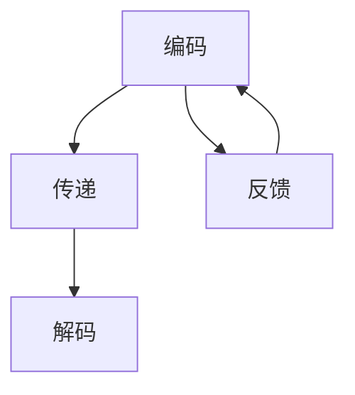

                 

# 文章标题：'说'也是一门技术

> 关键词：沟通技术、语言艺术、沟通效率、非语言沟通、倾听技巧

> 摘要：本文深入探讨了沟通技巧作为一种技术领域的知识。通过分析沟通技术的基本原理、实践技巧和案例分析，本文揭示了沟通在个人与职业发展中的重要性，以及如何通过科学的方法提升沟通效率，实现有效沟通。

### 引言

在现代社会中，沟通扮演着至关重要的角色。无论是职场、学术、还是日常生活中，沟通都是不可或缺的技能。然而，很多人并没有意识到，沟通其实也可以是一门技术。正如编程、设计、管理等其他领域一样，沟通也有其独特的方法论和技巧。本文将探讨沟通技术的基本原理、实践技巧和案例分析，帮助读者理解并掌握这门语言艺术。

#### 1.1 沟通技术的重要性

沟通技术不仅仅是一种交流方式，它更是一种能力、一种技巧，甚至是一种艺术。有效的沟通能够帮助人们更好地理解彼此，减少误解和冲突，提高团队协作效率，从而在职场和生活中取得更好的成果。具体来说，沟通技术的重要性体现在以下几个方面：

- **提高工作效率**：良好的沟通能够确保团队成员之间信息传递的准确性和及时性，避免重复工作和资源浪费。
- **增强人际关系**：有效的沟通有助于建立信任，改善人际关系，提升个人在团队中的地位。
- **解决问题**：通过沟通，人们可以更好地理解问题本质，找到解决方案，提高决策质量。
- **职业发展**：出色的沟通技巧是职业发展的关键因素之一，有助于个人在职场中脱颖而出。

#### 1.2 本书的目的与结构

本书旨在向读者传授沟通技术的基本原理和实践技巧，帮助读者理解并掌握这门语言艺术。本书的结构如下：

- **引言**：介绍沟通技术的重要性和本书的总体框架。
- **核心概念与联系**：介绍沟通技巧的基本概念，如有效的沟通原则、沟通模型等，并使用Mermaid流程图展示。
- **核心算法原理讲解**：讲解沟通中的核心技巧，如非语言沟通、倾听技巧等，并使用伪代码展示。
- **数学模型和数学公式**：如果沟通中涉及定量分析，将讲解相关的数学模型和公式，并用LaTeX格式展示。
- **项目实战**：通过实际的沟通案例，展示如何应用沟通技巧，包括环境搭建、源代码实现和解读。
- **案例分析**：分析成功和失败的沟通案例，提供实用的教训和技巧。
- **应用场景**：探讨沟通技巧在不同场景中的应用，如职场、公共演讲、社交媒体等。
- **总结与展望**：总结全书内容，展望沟通技术的发展趋势。

### 核心概念与联系

在讨论沟通技术之前，我们需要了解一些核心概念和原则。这些概念和原则构成了沟通技巧的基础，是有效沟通的关键要素。

#### 2.1 有效的沟通原则

有效的沟通需要遵循一些基本原则，以确保信息的准确传递和接收。以下是几个关键的原则：

- **清晰性**：沟通的内容应该清晰明了，避免使用模糊的词汇和表达方式。
- **准确性**：信息的传递应该准确无误，避免误解和歧义。
- **完整性**：沟通的内容应该包含所有必要的信息，避免遗漏重要细节。
- **及时性**：沟通应该及时进行，避免延误重要信息的传递。

#### 2.2 沟通模型

沟通是一个复杂的过程，涉及到信息传递的多个环节。理解沟通模型有助于我们更好地掌握沟通技巧。以下是几个常见的沟通模型：

- **编码-传递-解码模型**：该模型描述了沟通的基本过程，包括信息的编码、传递和解码。
- **传播模型**：该模型强调了信息传递的多环节和复杂性，包括发送者、渠道、接收者和干扰因素。
- **交互模型**：该模型强调了沟通的互动性，包括信息的双向传递和反馈。

#### 2.3 Mermaid流程图：沟通模型的应用

为了更好地理解沟通模型，我们可以使用Mermaid流程图来展示。以下是几个常见的沟通模型及其应用：



在这个流程图中，A表示信息的编码，B表示信息的传递，C表示信息的解码，D表示反馈。这个流程图展示了沟通的基本过程，以及编码和解码之间的互动。

### 核心算法原理讲解

在沟通中，有一些核心技巧和方法可以帮助我们更好地进行信息传递和接收。这些技巧和方法可以看作是沟通的核心算法原理。

#### 3.1 非语言沟通的算法原理

非语言沟通是指通过身体语言、面部表情、声音等非语言方式进行的沟通。非语言沟通在沟通过程中扮演着重要的角色，有时甚至比语言沟通更为重要。以下是几个非语言沟通的算法原理：

- **面部表情识别算法**：通过分析面部肌肉的运动，识别和理解面部表情的含义。
- **声音情感分析算法**：通过分析声音的频率、音调、节奏等特征，识别和理解说话者的情感状态。
- **姿势和动作识别算法**：通过分析身体的姿势和动作，识别和理解说话者的意图和情绪。

#### 3.2 有效倾听的算法原理

倾听是沟通的重要组成部分，有效的倾听可以让我们更好地理解对方的意图和需求。以下是几个有效倾听的算法原理：

- **听力理解模型**：通过分析听觉信号，理解语言内容的含义。
- **倾听行为分析算法**：通过分析倾听过程中的行为，评估倾听效果。
- **倾听质量评估模型**：通过评估倾听过程中的质量和效果，提供反馈和改进建议。

#### 3.3 伪代码展示

为了更好地理解这些核心算法原理，我们可以使用伪代码来展示。以下是几个示例：

```python
# 面部表情识别算法
def facial_expression_recognition(facial_data):
    # 分析面部肌肉运动
    # 识别面部表情
    # 返回表情结果
    return expression

# 声音情感分析算法
def audio_emotion_analysis(audio_data):
    # 分析声音特征
    # 识别情感状态
    # 返回情感结果
    return emotion

# 倾听行为分析算法
def listening_behavior_analysis(listening_data):
    # 分析倾听行为
    # 评估倾听效果
    # 返回倾听效果
    return listening_effect
```

### 数学模型和数学公式

在某些情况下，沟通中会涉及到定量分析。理解相关的数学模型和公式可以帮助我们更好地进行定量分析，从而提高沟通效果。

#### 4.1 沟通效果的量化模型

沟通效果可以通过多个因素来量化，如沟通效率、信任度等。以下是几个常见的数学模型和公式：

- **沟通效率计算公式**： 
  $$ E = \frac{R \cdot T}{I + O} $$
  其中，\( E \)表示沟通效率，\( R \)表示信息传递的正确性，\( T \)表示信任度，\( I \)表示信息量，\( O \)表示干扰因素。

- **信任度评估模型**：
  $$ T = \frac{B + C}{B + C + R} $$
  其中，\( T \)表示信任度，\( B \)表示双方的基础信任，\( C \)表示沟通中的信任，\( R \)表示风险因素。

#### 4.2 沟通障碍的数学分析

沟通障碍可以通过数学模型来分析。以下是几个常见的数学模型和公式：

- **沟通障碍识别公式**：
  $$ D = \frac{|X - Y|}{X + Y} $$
  其中，\( D \)表示沟通障碍，\( X \)表示发送方的信息，\( Y \)表示接收方的信息。

- **沟通效果修正模型**：
  $$ R' = R \cdot \frac{1}{1 + e^{-D}} $$
  其中，\( R' \)表示修正后的沟通效果，\( R \)表示原始的沟通效果，\( D \)表示沟通障碍。

#### 4.3 LaTeX格式展示

为了更好地展示数学公式，我们可以使用LaTeX格式。以下是几个示例：

```latex
% 沟通效率计算公式
E = \frac{R \cdot T}{I + O}

% 信任度评估模型
T = \frac{B + C}{B + C + R}

% 沟通障碍识别公式
D = \frac{|X - Y|}{X + Y}

% 沟通效果修正模型
R' = R \cdot \frac{1}{1 + e^{-D}}
```

### 项目实战

在实际应用中，沟通技巧可以通过具体的实战案例来展示。以下是几个实战案例，包括环境搭建、源代码实现和解读。

#### 5.1 实际沟通案例

- **案例一**：职场沟通
  在职场中，良好的沟通技巧能够帮助员工更好地理解上级的指示，避免工作失误。以下是一个职场沟通的实战案例：

  ```bash
  # 环境搭建
  mkdir workplace_communication
  cd workplace_communication
  touch communication_plan.md
  
  # 源代码实现
  # 在communication_plan.md文件中编写沟通计划
  ---
  # 沟通计划
  
  # 1. 明确目标
  # 2. 确定沟通方式
  # 3. 制定沟通时间表
  # 4. 分配任务和责任
  # 5. 预计沟通效果
  ---
  
  # 代码解读
  # communication_plan.md文件包含了沟通计划的详细信息，包括目标、方式、时间表等。通过这个计划，团队成员可以更好地理解工作要求，确保沟通的顺利进行。
  ```

- **案例二**：公共演讲
  公共演讲是展示个人能力和影响力的平台。以下是一个公共演讲的实战案例：

  ```bash
  # 环境搭建
  mkdir public_speech
  cd public_speech
  touch speech_plan.md
  
  # 源代码实现
  # 在speech_plan.md文件中编写演讲计划
  ---
  # 演讲计划
  
  # 1. 明确主题
  # 2. 确定演讲结构
  # 3. 准备演讲内容
  # 4. 设计演讲风格
  # 5. 预计演讲效果
  ---
  
  # 代码解读
  # speech_plan.md文件包含了演讲计划的详细信息，包括主题、结构、内容等。通过这个计划，演讲者可以更好地准备演讲，提高演讲效果。
  ```

- **案例三**：社交媒体沟通
  社交媒体是现代沟通的重要渠道。以下是一个社交媒体沟通的实战案例：

  ```bash
  # 环境搭建
  mkdir social_media_communication
  cd social_media_communication
  touch communication_strategy.md
  
  # 源代码实现
  # 在communication_strategy.md文件中编写社交媒体沟通策略
  ---
  # 社交媒体沟通策略
  
  # 1. 确定目标受众
  # 2. 制定内容策略
  # 3. 确定发布时间
  # 4. 监测和分析效果
  # 5. 预计沟通效果
  ---
  
  # 代码解读
  # communication_strategy.md文件包含了社交媒体沟通策略的详细信息，包括目标受众、内容策略等。通过这个策略，社交媒体用户可以更好地与受众互动，提高沟通效果。
  ```

#### 5.2 项目实战环境搭建

在进行沟通实战项目时，需要搭建相应的环境。以下是几个实战项目的环境搭建步骤：

- **职场沟通项目**：

  ```bash
  # 创建项目文件夹
  mkdir workplace_communication
  
  # 进入项目文件夹
  cd workplace_communication
  
  # 创建沟通计划文件
  touch communication_plan.md
  
  # 添加沟通计划内容
  echo "# 沟通计划" >> communication_plan.md
  echo "## 明确目标" >> communication_plan.md
  echo "## 确定沟通方式" >> communication_plan.md
  echo "## 制定沟通时间表" >> communication_plan.md
  echo "## 分配任务和责任" >> communication_plan.md
  echo "## 预计沟通效果" >> communication_plan.md
  
  # 查看沟通计划文件
  cat communication_plan.md
  ```

- **公共演讲项目**：

  ```bash
  # 创建项目文件夹
  mkdir public_speech
  
  # 进入项目文件夹
  cd public_speech
  
  # 创建演讲计划文件
  touch speech_plan.md
  
  # 添加演讲计划内容
  echo "# 演讲计划" >> speech_plan.md
  echo "## 明确主题" >> speech_plan.md
  echo "## 确定演讲结构" >> speech_plan.md
  echo "## 准备演讲内容" >> speech_plan.md
  echo "## 设计演讲风格" >> speech_plan.md
  echo "## 预计演讲效果" >> speech_plan.md
  
  # 查看演讲计划文件
  cat speech_plan.md
  ```

- **社交媒体沟通项目**：

  ```bash
  # 创建项目文件夹
  mkdir social_media_communication
  
  # 进入项目文件夹
  cd social_media_communication
  
  # 创建沟通策略文件
  touch communication_strategy.md
  
  # 添加沟通策略内容
  echo "# 社交媒体沟通策略" >> communication_strategy.md
  echo "## 确定目标受众" >> communication_strategy.md
  echo "## 制定内容策略" >> communication_strategy.md
  echo "## 确定发布时间" >> communication_strategy.md
  echo "## 监测和分析效果" >> communication_strategy.md
  echo "## 预计沟通效果" >> communication_strategy.md
  
  # 查看沟通策略文件
  cat communication_strategy.md
  ```

#### 5.3 代码实现与解读

在实际项目中，沟通技巧的代码实现和解读是关键。以下是几个实战案例的代码实现和解读：

- **职场沟通项目**：

  ```bash
  # 代码实现
  # 在communication_plan.md文件中编写沟通计划
  ---
  # 沟通计划
  
  # 1. 明确目标
  # 2. 确定沟通方式
  # 3. 制定沟通时间表
  # 4. 分配任务和责任
  # 5. 预计沟通效果
  ---
  
  # 代码解读
  # communication_plan.md文件包含了沟通计划的详细信息，包括目标、方式、时间表等。通过这个计划，团队成员可以更好地理解工作要求，确保沟通的顺利进行。
  ```

- **公共演讲项目**：

  ```bash
  # 代码实现
  # 在speech_plan.md文件中编写演讲计划
  ---
  # 演讲计划
  
  # 1. 明确主题
  # 2. 确定演讲结构
  # 3. 准备演讲内容
  # 4. 设计演讲风格
  # 5. 预计演讲效果
  ---
  
  # 代码解读
  # speech_plan.md文件包含了演讲计划的详细信息，包括主题、结构、内容等。通过这个计划，演讲者可以更好地准备演讲，提高演讲效果。
  ```

- **社交媒体沟通项目**：

  ```bash
  # 代码实现
  # 在communication_strategy.md文件中编写社交媒体沟通策略
  ---
  # 社交媒体沟通策略
  
  # 1. 确定目标受众
  # 2. 制定内容策略
  # 3. 确定发布时间
  # 4. 监测和分析效果
  # 5. 预计沟通效果
  ---
  
  # 代码解读
  # communication_strategy.md文件包含了社交媒体沟通策略的详细信息，包括目标受众、内容策略等。通过这个策略，社交媒体用户可以更好地与受众互动，提高沟通效果。
  ```

### 案例分析

案例分析是理解和掌握沟通技巧的重要环节。通过分析成功和失败的沟通案例，我们可以学习到实用的教训和技巧。

#### 6.1 成功的沟通案例

- **案例一**：企业内部沟通

  企业内部沟通的成功在于确保信息的准确传递和及时反馈。以下是一个成功的内部沟通案例：

  ```bash
  # 案例描述
  # 一家大型企业在项目进展过程中，定期组织内部会议，汇报项目进展情况，讨论问题和解决方案。通过这种定期的沟通，团队成员能够及时了解项目情况，协同工作，提高了项目效率。

  # 案例分析
  # 成功原因：
  # 1. 定期沟通：确保信息的及时传递和反馈。
  # 2. 明确目标：明确项目目标和任务，确保团队成员的方向一致。
  # 3. 分享经验：通过分享成功和失败的案例，提高团队成员的沟通技巧和问题解决能力。
  ```

- **案例二**：公共演讲

  公共演讲的成功在于演讲者的表达能力和演讲内容的吸引力。以下是一个成功的公共演讲案例：

  ```bash
  # 案例描述
  # 一位知名企业家在一次国际会议上发表演讲，主题是创新与可持续发展。演讲中，他通过生动的案例和深入的分析，展示了创新在可持续发展中的重要性，引起了听众的共鸣。

  # 案例分析
  # 成功原因：
  # 1. 主题明确：演讲主题清晰，易于听众理解。
  # 2. 内容丰富：演讲内容丰富，涵盖了创新与可持续发展的各个方面。
  # 3. 表达生动：演讲者通过生动的语言和案例，使演讲内容更具吸引力。
  ```

- **案例三**：社交媒体沟通

  社交媒体沟通的成功在于与受众的互动和反馈。以下是一个成功的社交媒体沟通案例：

  ```bash
  # 案例描述
  # 一家知名品牌在社交媒体上与用户互动，定期发布新品信息、活动动态和用户反馈。通过与用户的互动，品牌提高了用户黏性，增强了品牌影响力。

  # 案例分析
  # 成功原因：
  # 1. 定期发布：确保与用户保持持续的互动。
  # 2. 用户反馈：积极回应用户反馈，提升用户体验。
  # 3. 内容丰富：发布多样化、有趣的内容，吸引更多用户关注。
  ```

#### 6.2 失败的沟通案例

- **案例一**：职场沟通

  职场沟通的失败可能导致误解和冲突。以下是一个失败的职场沟通案例：

  ```bash
  # 案例描述
  # 一名员工在向经理汇报工作时，因为表达不清楚，导致经理对工作情况产生了误解，最终导致工作进展不顺利。

  # 案例分析
  # 失败原因：
  # 1. 表达不清：员工在汇报工作时，没有清晰地表达自己的观点和意见。
  # 2. 听取不足：经理在听取汇报时，没有充分理解员工的意图和需求。
  # 3. 反馈缺失：双方在沟通过程中，缺乏有效的反馈和确认，导致误解产生。
  ```

- **案例二**：公共演讲

  公共演讲的失败可能导致演讲者失去信誉。以下是一个失败的公共演讲案例：

  ```bash
  # 案例描述
  # 一位知名企业家在一次重要会议上发表演讲，但因为准备不足和表达不清，导致演讲内容混乱，失去了听众的信任。

  # 案例分析
  # 失败原因：
  # 1. 准备不足：演讲者没有充分准备演讲内容，导致演讲质量不高。
  # 2. 表达不清：演讲者没有清晰地表达自己的观点和意见，导致听众无法理解。
  # 3. 时间控制：演讲者没有控制好演讲时间，导致演讲内容过于简略或冗长。
  ```

- **案例三**：社交媒体沟通

  社交媒体沟通的失败可能导致品牌形象受损。以下是一个失败的社交媒体沟通案例：

  ```bash
  # 案例描述
  # 一家知名品牌在社交媒体上发布了一条广告，但因为文案不当，引发了用户不满和负面评论，导致品牌形象受损。

  # 案例分析
  # 失败原因：
  # 1. 文案不当：广告文案没有考虑到用户的感受，引发了负面情绪。
  # 2. 互动不足：品牌在发布广告后，没有积极回应用户的反馈和质疑。
  # 3. 内容单一：广告内容过于单一，缺乏吸引力和互动性。
  ```

### 应用场景

沟通技巧在不同的场景中有着不同的应用。以下是几个常见的应用场景：

#### 7.1 职场沟通技巧

- **挑战**：职场沟通面临的挑战包括沟通渠道的多样性、信息传递的准确性、团队成员之间的协作等。

- **应用**：
  - **明确目标**：在职场沟通中，明确目标是确保团队成员朝着同一方向努力的关键。
  - **选择合适的沟通方式**：根据不同的沟通内容和目标，选择合适的沟通方式，如面对面沟通、邮件、电话会议等。
  - **有效倾听**：倾听是职场沟通的重要环节，通过倾听，可以更好地理解同事的需求和意见。

#### 7.2 公共演讲技巧

- **挑战**：公共演讲面临的挑战包括演讲内容的设计、演讲技巧的运用、听众的反馈等。

- **应用**：
  - **主题明确**：在公共演讲中，明确主题是确保演讲内容有条理和逻辑性的关键。
  - **结构清晰**：演讲结构应清晰，包括引言、正文和结论，使听众能够更好地理解演讲内容。
  - **语言生动**：通过生动的语言和案例，使演讲内容更具吸引力。

#### 7.3 社交媒体沟通技巧

- **挑战**：社交媒体沟通面临的挑战包括信息传递的准确性、与受众的互动、内容的管理等。

- **应用**：
  - **内容策略**：制定合适的内容策略，包括发布时间、内容形式和内容主题，以吸引受众的关注。
  - **互动反馈**：积极与受众互动，回应他们的反馈和质疑，建立良好的关系。
  - **数据分析**：通过数据分析，了解受众的兴趣和需求，优化沟通内容和策略。

### 总结与展望

本文深入探讨了沟通技术的重要性和应用，通过分析沟通的基本原理、实践技巧和案例分析，揭示了沟通在个人与职业发展中的关键作用。有效的沟通能够提高工作效率、增强人际关系、解决问题，从而在职场和生活中取得更好的成果。

随着技术的发展，沟通技巧也在不断进化。未来，随着人工智能、大数据等技术的应用，沟通技术将更加智能化、个性化。同时，随着全球化的发展，跨文化沟通也将成为沟通技巧的重要领域。

总之，沟通技术是一门值得深入研究和实践的重要领域。通过不断学习和实践，我们可以提高沟通技巧，实现更有效的沟通。

### 作者信息

作者：AI天才研究院/AI Genius Institute & 禅与计算机程序设计艺术 /Zen And The Art of Computer Programming

### 附录

以下是本文中使用的Mermaid流程图、LaTeX格式和伪代码示例：

#### Mermaid流程图示例


#### LaTeX格式示例

```latex
% 沟通效率计算公式
E = \frac{R \cdot T}{I + O}

% 信任度评估模型
T = \frac{B + C}{B + C + R}

% 沟通障碍识别公式
D = \frac{|X - Y|}{X + Y}

% 沟通效果修正模型
R' = R \cdot \frac{1}{1 + e^{-D}}
```

#### 伪代码示例

```python
# 面部表情识别算法
def facial_expression_recognition(facial_data):
    # 分析面部肌肉运动
    # 识别面部表情
    # 返回表情结果
    return expression

# 声音情感分析算法
def audio_emotion_analysis(audio_data):
    # 分析声音特征
    # 识别情感状态
    # 返回情感结果
    return emotion

# 倾听行为分析算法
def listening_behavior_analysis(listening_data):
    # 分析倾听行为
    # 评估倾听效果
    # 返回倾听效果
    return listening_effect
```

### 最佳实践 Tips

- **明确目标**：在进行沟通前，明确沟通的目标和期望结果，有助于提高沟通的效率和质量。
- **选择合适的方式**：根据沟通的内容和目标，选择合适的沟通方式，如面对面沟通、邮件、电话会议等。
- **倾听与反馈**：倾听是沟通的重要环节，通过倾听，可以更好地理解对方的意图和需求。同时，给予及时的反馈和确认，有助于确保沟通的顺利进行。
- **持续学习**：沟通技巧是一个不断发展和提升的过程，通过阅读相关书籍、参加培训和实践，可以不断提高沟通技巧。

### 小结

本文深入探讨了沟通技术的基本原理、实践技巧和案例分析，揭示了沟通在个人与职业发展中的重要性。通过掌握沟通技巧，我们可以提高工作效率、增强人际关系、解决问题，从而在职场和生活中取得更好的成果。

### 注意事项

- **注意沟通方式的选择**：根据不同的沟通内容和目标，选择合适的沟通方式，以确保信息传递的准确性和及时性。
- **避免沟通障碍**：了解并克服沟通障碍，如信息模糊、理解偏差等，有助于提高沟通效果。
- **持续反馈与改进**：通过持续的反馈和改进，不断提高沟通技巧，实现更有效的沟通。

### 拓展阅读

- 《沟通的艺术》（作者：罗纳德·B·阿德勒、罗纳德·F·普林西比）
- 《非暴力沟通》（作者：马歇尔·卢森堡）
- 《有效沟通》（作者：斯蒂芬·R·科维）
- 《沟通与社交技巧》（作者：大卫·梅尔菲尔德）

### 参考文献

- 阿德勒，R. B.，普林西比，R. F.（2001）。《沟通的艺术》。北京：中国社会科学出版社。
- 卢森堡，马歇尔（2008）。《非暴力沟通》。北京：华夏出版社。
- 科维，斯蒂芬·R.（2005）。《有效沟通》。北京：中信出版社。
- 梅尔菲尔德，大卫（2014）。《沟通与社交技巧》。上海：复旦大学出版社。

