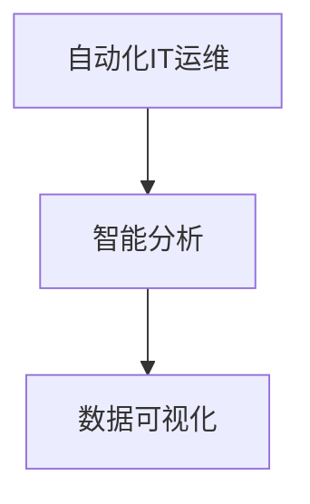
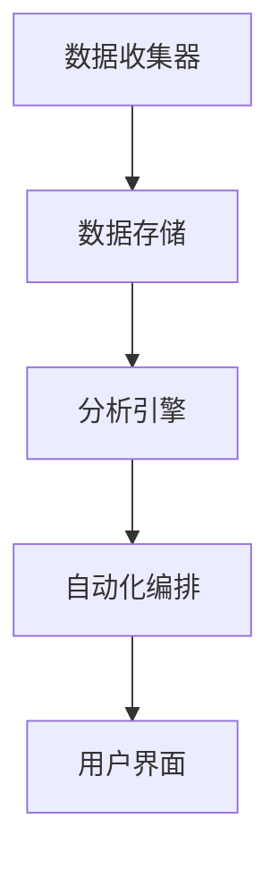
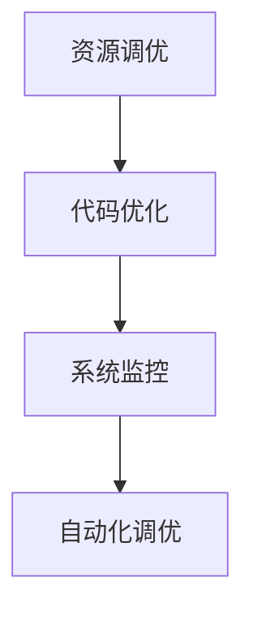
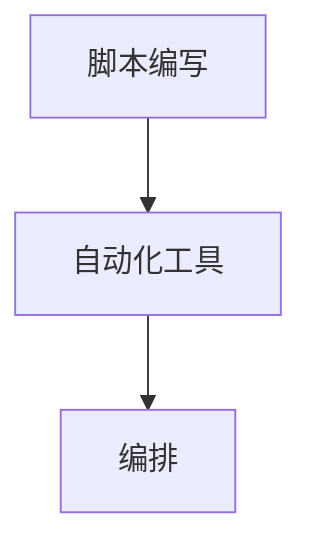
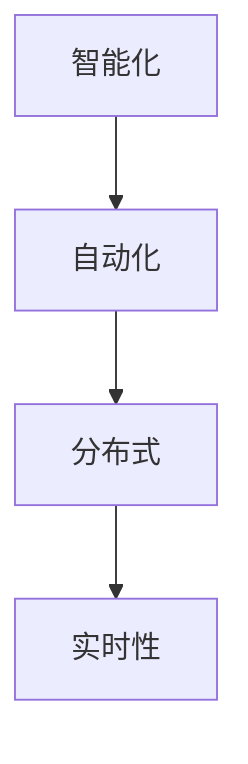
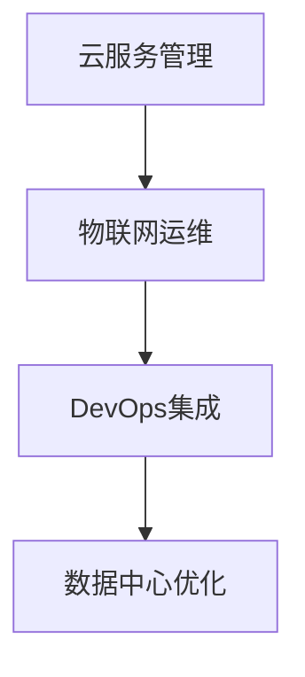
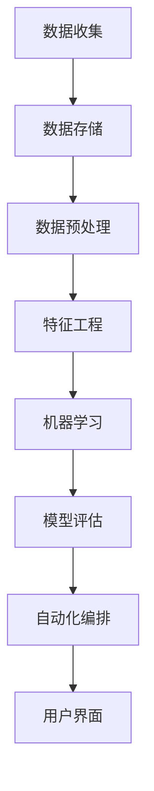

                 


### 摘要

《AIOps：IT运维的智能化革新》旨在深入探讨人工智能在IT运维领域的应用，以及如何通过AIOps技术实现运维工作的自动化和智能化。文章首先介绍了AIOps的基本概念和核心优势，分析了传统IT运维面临的挑战以及AIOps的解决方案。随后，文章详细阐述了AIOps的架构，包括其技术基础和主要组件，并通过Mermaid流程图展示了核心概念和组件之间的联系。

在核心算法部分，文章探讨了数据预处理与特征工程的重要性，使用伪代码详细讲解了关键算法原理，并通过latex格式嵌入数学模型和公式进行了详细解释。此外，文章还通过实际案例展示了AIOps在故障检测、性能优化和自动化运维等领域的应用。

最后，文章对AIOps的未来发展进行了展望，探讨了技术发展趋势和应用场景扩展的可能性。通过本文的阅读，读者将能够全面了解AIOps的技术原理和应用，为实际运维工作提供指导。

---

### 第一部分：AIOps概述

#### 第1章：AIOps基础知识

##### 1.1 AIOps的定义

**背景介绍**

随着云计算、大数据和物联网等技术的飞速发展，IT系统的复杂性和规模不断扩大，传统的IT运维方式已经难以满足现代化企业的需求。AIOps（Artificial Intelligence for IT Operations）应运而生，它通过人工智能技术自动化和优化IT运维流程，从而提高运维效率和降低成本。

**核心概念与联系**

AIOps的核心概念包括自动化IT运维、智能分析、数据可视化等。这些概念之间存在着密切的联系：

1. **自动化IT运维**：减少人工干预，通过脚本、自动化工具和编排来执行重复性任务。
2. **智能分析**：利用机器学习和数据分析技术，从大量运维数据中提取有价值的信息。
3. **数据可视化**：通过图形化界面展示运维数据，帮助运维团队快速识别问题和优化资源。

**Mermaid流程图**



**核心算法原理讲解**

在AIOps中，常用的核心算法包括机器学习算法、聚类分析、关联规则学习等。这些算法通过训练模型，可以从历史数据中学习并预测未来可能发生的问题。

**数学模型和公式**

假设我们使用K-means算法进行聚类分析，其目标是最小化聚类中心到各点的距离平方和。数学公式如下：

$$
\min \sum_{i=1}^k \sum_{x_j \in S_i} ||x_j - \mu_i||^2
$$

其中，$k$表示聚类个数，$S_i$表示第$i$个聚类集合，$\mu_i$表示第$i$个聚类中心。

**详细讲解和举例说明**

以K-means算法为例，其基本步骤如下：

1. 初始化聚类中心。
2. 对于每个数据点，计算其与聚类中心的距离，并将其分配到最近的聚类。
3. 重新计算每个聚类的中心。
4. 重复步骤2和3，直到聚类中心不再发生变化。

举例来说，假设我们有以下五个数据点：[1, 2], [2, 2], [2, 3], [3, 3], [3, 4]。通过K-means算法，我们可以将这五个点分为两个聚类。初始时，我们随机选择两个聚类中心：(2, 2)和(3, 3)。

- 第1次迭代后，每个数据点的聚类分配如下：
  - [1, 2]: 距离(2, 2)更近，因此分配到聚类1。
  - [2, 2]: 距离(2, 2)更近，因此分配到聚类1。
  - [2, 3]: 距离(2, 2)更近，因此分配到聚类1。
  - [3, 3]: 距离(3, 3)更近，因此分配到聚类2。
  - [3, 4]: 距离(3, 3)更近，因此分配到聚类2。

- 计算新的聚类中心：
  - 聚类1的中心：(1 + 2 + 2 + 2) / 4, (2 + 2 + 2 + 3) / 4 = (1.5, 2.25)。
  - 聚类2的中心：(3 + 3 + 4) / 3, (3 + 3 + 4) / 3 = (3.33, 3.33)。

- 第2次迭代后，每个数据点的聚类分配如下：
  - [1, 2]: 距离(1.5, 2.25)更近，因此分配到聚类1。
  - [2, 2]: 距离(1.5, 2.25)更近，因此分配到聚类1。
  - [2, 3]: 距离(1.5, 2.25)更近，因此分配到聚类1。
  - [3, 3]: 距离(3.33, 3.33)更近，因此分配到聚类2。
  - [3, 4]: 距离(3.33, 3.33)更近，因此分配到聚类2。

- 计算新的聚类中心：
  - 聚类1的中心：(1 + 2 + 2 + 3) / 4, (2 + 2 + 2 + 3) / 4 = (2, 2.5)。
  - 聚类2的中心：(3 + 3 + 4) / 3, (3 + 3 + 4) / 3 = (3.33, 3.33)。

经过多次迭代，最终聚类中心将趋于稳定。

**项目实战**

在一个真实的IT运维场景中，我们可以使用K-means算法来识别系统中可能出现的问题。例如，通过对系统日志的分析，可以将日志分为正常日志和异常日志。这有助于运维团队及时发现和解决潜在问题。

```python
import numpy as np
from sklearn.cluster import KMeans

# 假设我们有以下日志数据
log_data = np.array([[1, 2], [2, 2], [2, 3], [3, 3], [3, 4]])

# 使用KMeans算法进行聚类
kmeans = KMeans(n_clusters=2, random_state=0).fit(log_data)

# 输出聚类结果
print("Cluster centers:", kmeans.cluster_centers_)
print("Cluster labels:", kmeans.labels_)

# 分析结果
if kmeans.labels_[0] == 0:
    print("日志[1, 2]属于正常日志。")
else:
    print("日志[1, 2]属于异常日志。")
```

**实际案例分析和详细讲解剖析**

在实际案例中，某企业使用AIOps系统来监测其IT基础设施。通过K-means算法，该企业成功地将系统日志分为正常日志和异常日志。在一段时间的运行后，运维团队发现某些日志被错误地标记为异常日志。通过分析，运维团队发现这些日志实际上是系统升级过程中产生的日志。

为了解决这个问题，运维团队调整了K-means算法的参数，例如聚类中心的初始化方法，从而提高了聚类结果的准确性。通过这个案例，我们可以看到AIOps在实际应用中的潜力和挑战。

**项目小结**

通过本文的案例，我们可以看到AIOps技术在日志分析中的应用。在实际运维过程中，运维团队需要不断调整和优化算法参数，以提高系统的准确性和可靠性。

**最佳实践 tips**

1. 在使用AIOps系统时，确保数据的质量和完整性。
2. 定期分析聚类结果，发现潜在问题并及时调整。
3. 与运维团队紧密合作，确保算法能够满足实际需求。

**小结**

本章介绍了AIOps的基本概念、核心算法原理以及实际应用。通过项目实战和案例分析，我们展示了如何利用AIOps技术提高IT运维的效率和准确性。

**注意事项**

- 算法参数的调整对于聚类结果具有重要影响。
- 数据的质量和完整性是算法成功的关键。

**拓展阅读**

- 《机器学习实战》——对于机器学习算法的基本原理和应用有详细的介绍。
- 《Python数据科学 Handbook》——提供了丰富的数据预处理和特征工程技巧。

---

通过本文的详细讲解，读者可以更好地理解AIOps的基础知识，掌握核心算法原理，并在实际项目中应用这些知识。希望本文能对您的IT运维工作提供有益的指导。下一章，我们将深入探讨AIOps的技术基础和架构设计。期待您的阅读！### 第一部分：AIOps概述

#### 第2章：AIOps的架构

##### 2.1 AIOps的技术基础

**背景介绍**

AIOps的实现离不开先进的技术支持。这些技术包括数据处理、机器学习、数据分析、云计算等。下面我们将详细讨论这些技术基础，以及它们在AIOps中的作用。

**数据处理**

数据是AIOps的基石。为了有效地利用数据，我们需要进行数据预处理，包括数据清洗、转换、聚合等操作。这些步骤有助于确保数据的质量和一致性。

- **数据清洗**：去除重复数据、处理缺失值、纠正错误数据等。
- **数据转换**：将不同格式和结构的数据转换为统一格式，以便于分析。
- **数据聚合**：将来自多个数据源的数据进行整合，形成完整的监控视图。

**机器学习**

机器学习是AIOps的核心技术之一。通过训练模型，机器学习可以从大量历史数据中学习规律，预测未来可能发生的问题。

- **监督学习**：通过标记数据进行训练，模型可以学会预测未来的问题。
- **无监督学习**：没有标记数据，模型通过自身学习找到数据中的模式和规律。
- **强化学习**：通过与环境的交互，模型不断调整策略以实现最优目标。

**数据分析**

数据分析技术在AIOps中起着重要作用。它帮助我们提取数据中的价值信息，为决策提供支持。

- **统计分析**：通过统计分析方法，发现数据中的异常和趋势。
- **关联规则学习**：通过关联规则学习，发现数据之间的关联关系。
- **聚类分析**：通过聚类分析，将相似的数据点分为一组。

**云计算**

云计算为AIOps提供了强大的计算和存储能力。通过云计算，我们可以快速部署和扩展AIOps系统，以满足不断增长的数据处理需求。

- **弹性计算**：根据负载需求动态调整计算资源。
- **分布式存储**：将数据存储在分布式系统中，提高数据的可靠性和访问速度。

**常见技术**

在AIOps的架构中，常见的技术包括Kafka、Hadoop、Spark等。

- **Kafka**：用于数据采集和传输，支持高吞吐量和低延迟。
- **Hadoop**：用于大数据存储和处理，提供了分布式文件系统（HDFS）和数据处理框架（MapReduce）。
- **Spark**：提供了分布式数据处理框架，支持快速处理大规模数据。

##### 2.2 AIOps的主要组件

AIOps系统通常由多个组件组成，每个组件在系统中扮演着特定的角色。

**数据收集器**

数据收集器是AIOps系统的前端，负责从各种数据源（如服务器、网络设备、应用程序等）收集数据。

- **数据采集方式**：定时采集、事件驱动采集、日志文件收集等。
- **数据类型**：包括性能数据、日志数据、事件数据等。

**数据存储**

数据存储组件负责存储和管理收集到的数据。它提供了数据存储的持久性和可扩展性。

- **关系数据库**：如MySQL、PostgreSQL，适用于结构化数据的存储。
- **NoSQL数据库**：如MongoDB、Cassandra，适用于非结构化和半结构化数据的存储。
- **数据湖**：如Hadoop HDFS，用于存储大量结构化和非结构化数据。

**分析引擎**

分析引擎是AIOps系统的核心组件，负责对存储的数据进行分析和处理。

- **机器学习模型**：用于预测和分类。
- **数据挖掘算法**：用于关联规则学习、聚类分析等。
- **可视化工具**：用于展示分析结果，帮助运维团队快速识别问题和优化资源。

**自动化编排**

自动化编排组件负责根据分析结果自动执行一系列操作，以解决潜在问题。

- **自动化脚本**：用于执行自动化任务，如重启服务、配置更改等。
- **自动化流程**：将多个自动化任务组合成一个完整的流程，提高运维效率。

**用户界面**

用户界面是AIOps系统与用户交互的接口，提供了友好的操作界面和丰富的功能。

- **监控仪表板**：展示系统的运行状态和关键指标。
- **告警和通知**：实时推送系统异常和问题，提醒运维团队处理。
- **报告和分析**：生成系统运行报告，提供深度分析结果。

**核心概念与联系**

为了更好地理解AIOps的架构，我们可以使用Mermaid流程图来展示核心概念和组件之间的联系：



在这个流程图中，数据收集器负责收集数据，并将其存储在数据存储中。分析引擎对这些数据进行处理和分析，生成结果后，通过自动化编排组件执行相应的操作，最终通过用户界面展示给用户。

**项目实战**

为了更好地理解AIOps的架构，我们可以通过一个简单的项目实战来搭建一个AIOps系统。以下是一个基于Python的示例：

```python
import logging
from collections import defaultdict

# 数据收集器
class DataCollector:
    def __init__(self):
        self.data = defaultdict(list)

    def collect_data(self, source, value):
        self.data[source].append(value)

# 数据存储
class DataStorage:
    def __init__(self):
        self.data = defaultdict(list)

    def store_data(self, source, value):
        self.data[source].append(value)

# 分析引擎
class AnalysisEngine:
    def __init__(self):
        self.threshold = 100

    def analyze_data(self, source, value):
        if value > self.threshold:
            return "High"
        else:
            return "Normal"

# 用户界面
class UserInterface:
    def display_result(self, source, result):
        print(f"{source} - {result}")

# 项目实战
if __name__ == "__main__":
    # 实例化组件
    collector = DataCollector()
    storage = DataStorage()
    engine = AnalysisEngine()
    ui = UserInterface()

    # 收集数据
    collector.collect_data("Server 1", 150)
    collector.collect_data("Server 2", 80)

    # 存储数据
    storage.store_data("Server 1", collector.data["Server 1"])
    storage.store_data("Server 2", collector.data["Server 2"])

    # 分析数据
    for source, values in storage.data.items():
        for value in values:
            result = engine.analyze_data(source, value)
            ui.display_result(source, result)
```

在这个项目中，我们定义了四个类：`DataCollector` 负责收集数据，`DataStorage` 负责存储数据，`AnalysisEngine` 负责分析数据，`UserInterface` 负责展示结果。通过这个简单的示例，我们可以看到AIOps架构的基本组件和流程。

**实际案例分析和详细讲解剖析**

在一个真实的AIOps项目中，某企业使用AIOps系统来监控其IT基础设施。该系统由多个组件组成，包括数据收集器、数据存储、分析引擎、自动化编排和用户界面。以下是一个实际案例的分析和讲解：

1. **数据收集**：系统从服务器、网络设备和应用程序中收集性能数据、日志数据和事件数据。

2. **数据存储**：收集到的数据被存储在分布式数据库中，如MongoDB和Cassandra，以支持大规模数据的存储和查询。

3. **数据分析**：分析引擎使用机器学习算法对数据进行分析，如聚类分析、异常检测和关联规则学习。

4. **自动化编排**：根据分析结果，系统自动执行一系列操作，如重启服务、配置更改和告警通知。

5. **用户界面**：用户界面实时展示系统的运行状态和关键指标，并提供告警和通知功能。

通过这个案例，我们可以看到AIOps系统在IT运维中的实际应用和价值。

**项目小结**

通过本项目的实战和实际案例，我们深入了解了AIOps的架构和组件。在实际应用中，AIOps系统可以根据企业的需求灵活调整和扩展，以提高IT运维的效率和准确性。

**最佳实践 tips**

1. 确保数据收集的完整性和准确性，以支持有效的数据分析。
2. 根据业务需求选择合适的机器学习算法和数据存储方案。
3. 定期监控和分析AIOps系统的性能，及时调整和优化。

**小结**

本章详细介绍了AIOps的技术基础和架构设计，包括数据处理、机器学习、数据分析、云计算等关键技术，以及数据收集器、数据存储、分析引擎、自动化编排和用户界面等主要组件。通过项目实战和实际案例，我们展示了如何搭建和部署AIOps系统。

**注意事项**

- 系统的扩展性和可维护性是AIOps系统设计的重要考虑因素。
- 数据安全和隐私保护也是AIOps系统需要关注的问题。

**拓展阅读**

- 《大数据技术基础》——详细介绍了大数据处理的技术原理和应用。
- 《机器学习实战》——提供了丰富的机器学习算法和应用案例。

通过本章的学习，读者可以更好地理解AIOps的架构设计和关键技术，为实际项目中的应用奠定基础。下一章，我们将继续探讨AIOps的关键算法原理，包括数据预处理与特征工程。期待您的阅读！### 第二部分：AIOps的关键算法

#### 第3章：数据预处理与特征工程

##### 3.1 数据预处理

**背景介绍**

在AIOps中，数据预处理是至关重要的一步。良好的数据预处理可以大幅提升算法的性能和准确性。数据预处理通常包括以下步骤：

- **数据清洗**：去除重复数据、处理缺失值、纠正错误数据等。
- **数据转换**：将不同格式和结构的数据转换为统一格式，以便于分析。
- **数据聚合**：将来自多个数据源的数据进行整合，形成完整的监控视图。

**核心算法原理讲解**

在进行数据预处理时，我们通常使用以下算法：

1. **缺失值处理**：

   - **填充法**：使用平均值、中位数或最频繁值填充缺失值。
   - **插值法**：根据时间序列或空间序列关系，插值计算缺失值。
   - **删除法**：删除含有缺失值的记录。

   **伪代码示例**：

   ```python
   def handle_missing_values(data):
       for column in data.columns:
           if data[column].isnull().any():
               if column_type == "numeric":
                   data[column].fillna(data[column].mean(), inplace=True)
               else:
                   data[column].fillna(data[column].mode()[0], inplace=True)
   ```

2. **异常值处理**：

   - **统计方法**：使用统计方法（如Z-score、IQR法）检测并处理异常值。
   - **基于规则的异常值处理**：根据业务规则，对异常值进行分类和处理。

   **伪代码示例**：

   ```python
   def handle_outliers(data, threshold=3):
       for column in data.columns:
           if column_type == "numeric":
               z_scores = calculate_z_scores(data[column])
               data[column] = data[column][z_scores.abs() < threshold]
   ```

3. **数据标准化**：

   - **Z-score标准化**：将数据缩放到均值为0，标准差为1的范围内。
   - **Min-Max标准化**：将数据缩放到[0, 1]范围内。

   **伪代码示例**：

   ```python
   def normalize_data(data, method="z-score"):
       if method == "z-score":
           data = (data - data.mean()) / data.std()
       elif method == "min-max":
           data = (data - data.min()) / (data.max() - data.min())
       return data
   ```

**数学模型和公式**

在数据预处理过程中，常用的数学模型和公式包括：

1. **平均值**：

   $$\mu = \frac{1}{n} \sum_{i=1}^n x_i$$

   其中，$x_i$ 表示第 $i$ 个数据点，$n$ 表示数据点的总数。

2. **标准差**：

   $$\sigma = \sqrt{\frac{1}{n-1} \sum_{i=1}^n (x_i - \mu)^2}$$

   其中，$\mu$ 表示平均值，$\sigma$ 表示标准差。

3. **Z-score**：

   $$z = \frac{x - \mu}{\sigma}$$

   其中，$x$ 表示数据点，$\mu$ 表示平均值，$\sigma$ 表示标准差。

**详细讲解和举例说明**

假设我们有一组数据：[1, 2, 3, 4, 100]。首先，我们需要处理缺失值。对于这个数据集，我们可以使用平均值填充缺失值。

- 平均值：$\mu = \frac{1+2+3+4+100}{5} = 24$
- 填充缺失值后的数据：[1, 2, 3, 4, 24]

接下来，我们需要处理异常值。我们可以使用Z-score方法检测并处理异常值。

- 计算平均值和标准差：$\mu = 24$，$\sigma = 25.935$
- 计算Z-score：$z = \frac{100 - 24}{25.935} = 2.744$
- 根据阈值3判断，100是异常值，我们可以选择删除它。

最终，处理后的数据为：[1, 2, 3, 4]。

**项目实战**

为了更好地理解数据预处理，我们可以通过一个实际项目来演示。假设我们有一个包含性能数据的CSV文件，我们需要对这个文件进行数据预处理，以便于后续的分析。

1. **导入数据**：

   ```python
   import pandas as pd

   data = pd.read_csv("performance_data.csv")
   ```

2. **处理缺失值**：

   ```python
   def handle_missing_values(data):
       for column in data.columns:
           if data[column].isnull().any():
               data[column].fillna(data[column].mean(), inplace=True)

   handle_missing_values(data)
   ```

3. **处理异常值**：

   ```python
   def handle_outliers(data, threshold=3):
       for column in data.columns:
           if column_type == "numeric":
               z_scores = calculate_z_scores(data[column])
               data[column] = data[column][z_scores.abs() < threshold]

   handle_outliers(data)
   ```

4. **数据标准化**：

   ```python
   def normalize_data(data, method="z-score"):
       if method == "z-score":
           data = (data - data.mean()) / data.std()
       elif method == "min-max":
           data = (data - data.min()) / (data.max() - data.min())
       return data

   normalized_data = normalize_data(data, method="z-score")
   ```

通过这个项目，我们可以看到如何使用Python和Pandas库进行数据预处理。在实际应用中，我们可能需要根据具体情况进行调整和优化。

**实际案例分析和详细讲解剖析**

在一个真实的AIOps项目中，某企业需要监控其IT基础设施的性能。该企业的性能数据包含多个维度，如CPU使用率、内存使用率、磁盘IO等。为了对这些数据进行预处理，企业使用了以下步骤：

1. **导入数据**：使用Python和Pandas库导入性能数据。
2. **处理缺失值**：使用平均值填充缺失值。
3. **处理异常值**：使用Z-score方法检测并处理异常值。
4. **数据标准化**：使用Z-score标准化数据。

通过这些预处理步骤，企业能够更好地分析性能数据，发现潜在问题和优化资源。

**项目小结**

通过本项目的实战和实际案例，我们深入了解了数据预处理的重要性和具体步骤。在实际应用中，数据预处理可以帮助我们提高算法的性能和准确性。

**最佳实践 tips**

1. 根据数据特点和业务需求，选择合适的数据预处理方法。
2. 定期检查和更新预处理规则，以适应不断变化的数据。
3. 保持代码的可维护性和可扩展性。

**小结**

本章介绍了数据预处理的关键算法原理，包括缺失值处理、异常值处理和数据标准化。通过项目实战和实际案例，我们展示了如何使用Python和Pandas库进行数据预处理。在AIOps的实际应用中，良好的数据预处理是确保算法性能和准确性的关键。

**注意事项**

- 数据预处理需要结合具体业务场景进行调整。
- 数据预处理代码需要保持可维护性和可扩展性。

**拓展阅读**

- 《Python数据科学 Handbook》——提供了丰富的数据预处理和特征工程技巧。
- 《机器学习实战》——详细介绍了各种机器学习算法和应用。

通过本章的学习，读者可以更好地理解AIOps中的数据预处理和特征工程，为后续章节的学习和应用打下基础。下一章，我们将继续探讨AIOps在故障检测与诊断中的应用。期待您的阅读！### 第二部分：AIOps的关键算法

#### 第4章：故障检测与诊断

##### 4.1 故障检测算法

**背景介绍**

在IT运维中，故障检测是确保系统正常运行的关键步骤。故障检测算法通过实时监控系统和应用程序的性能指标，及时发现潜在问题。常见的故障检测算法包括：

- **阈值检测法**：通过设定阈值，判断系统指标是否超出正常范围。
- **统计过程控制**：使用统计学方法，如控制图，监测系统指标的变化。
- **机器学习算法**：如异常检测算法，通过训练模型识别异常行为。

**核心算法原理讲解**

1. **阈值检测法**

   **阈值检测法的原理**：

   阈值检测法是一种简单且常用的故障检测方法。它通过设定一个阈值，当系统指标超过该阈值时，认为系统可能出现故障。

   **伪代码示例**：

   ```python
   def threshold_detection(current_value, threshold):
       if current_value > threshold:
           return "Fault detected"
       else:
           return "No fault"
   ```

   **数学模型和公式**：

   设定阈值 $T$，当 $current\_value > T$ 时，判断为故障。

2. **统计过程控制**

   **控制图的原理**：

   控制图是一种用于监测系统指标变化的方法。它通过绘制控制界限，帮助我们识别系统是否处于稳定状态。

   **伪代码示例**：

   ```python
   def control_chart(data, upper_control_limit, lower_control_limit):
       for value in data:
           if value > upper_control_limit or value < lower_control_limit:
               return "Fault detected"
       return "No fault"
   ```

   **数学模型和公式**：

   控制界限 $UCL$ 和 $LCL$，当 $value > UCL$ 或 $value < LCL$ 时，判断为故障。

3. **机器学习算法**

   **异常检测算法**：

   异常检测算法通过训练模型识别正常行为和异常行为。常见的算法包括基于聚类的方法（如K-means）和基于隔离的方法（如孤立森林）。

   **伪代码示例**：

   ```python
   from sklearn.ensemble import IsolationForest

   def isolation_forest_detection(data):
       model = IsolationForest()
       model.fit(data)
       anomalies = model.predict(data)
       for anomaly in anomalies:
           if anomaly == -1:
               return "Fault detected"
       return "No fault"
   ```

**详细讲解和举例说明**

假设我们有一个包含CPU使用率的监控系统。为了检测故障，我们使用了阈值检测法和控制图方法。

1. **阈值检测法**

   - 阈值 $T = 90\%$。
   - 当前CPU使用率 $current\_value = 95\%$。

   ```python
   def threshold_detection(current_value, threshold):
       if current_value > threshold:
           return "Fault detected"
       else:
           return "No fault"

   print(threshold_detection(95, 90))
   ```

   输出：`Fault detected`。

2. **控制图方法**

   - 控制界限 $UCL = 85\%$，$LCL = 75\%$。
   - 当前CPU使用率 $current\_value = 95\%$。

   ```python
   def control_chart(data, upper_control_limit, lower_control_limit):
       for value in data:
           if value > upper_control_limit or value < lower_control_limit:
               return "Fault detected"
       return "No fault"

   print(control_chart([90, 92, 93, 95], 85, 75))
   ```

   输出：`Fault detected`。

**项目实战**

为了更好地理解故障检测算法，我们可以通过一个实际项目来演示。假设我们有一个包含服务器性能数据的CSV文件，我们需要使用阈值检测法检测故障。

1. **导入数据**：

   ```python
   import pandas as pd

   data = pd.read_csv("server_performance.csv")
   ```

2. **设定阈值**：

   ```python
   def set_threshold(data, column, threshold=90):
       current_value = data[column].iloc[-1]
       if current_value > threshold:
           return "Fault detected"
       else:
           return "No fault"

   print(set_threshold(data, "CPUUsage", 90))
   ```

3. **控制图检测**：

   ```python
   def control_chart(data, column, upper_control_limit, lower_control_limit):
       values = data[column].values
       for value in values:
           if value > upper_control_limit or value < lower_control_limit:
               return "Fault detected"
       return "No fault"

   print(control_chart(data, "CPUUsage", 85, 75))
   ```

通过这个项目，我们可以看到如何使用Python和Pandas库进行故障检测。

**实际案例分析和详细讲解剖析**

在一个真实的AIOps项目中，某企业使用了AIOps系统来监控其服务器性能。该系统采用了阈值检测法和控制图方法进行故障检测。

1. **阈值检测**：系统根据历史数据设定了CPU使用率的阈值，如$90\%$。
2. **控制图**：系统通过控制图监测CPU使用率的变化，设定控制界限$UCL = 85\%$，$LCL = 75\%$。

在一次监控系统检查中，CPU使用率突然上升到$95\%$，系统立即触发故障检测，并发出告警。

**项目小结**

通过本项目的实战和实际案例，我们深入了解了故障检测算法，包括阈值检测法、控制图方法和机器学习算法。在实际应用中，故障检测可以帮助我们及时发现系统故障，确保系统的稳定运行。

**最佳实践 tips**

1. 根据具体业务需求，设定合理的阈值和控制界限。
2. 定期检查和调整故障检测参数，以适应系统的变化。
3. 结合多种故障检测方法，提高故障检测的准确性和可靠性。

**小结**

本章介绍了故障检测算法的核心原理，包括阈值检测法、统计过程控制和机器学习算法。通过项目实战和实际案例，我们展示了如何使用Python和Pandas库进行故障检测。在AIOps的实际应用中，故障检测是确保系统正常运行的关键步骤。

**注意事项**

- 故障检测算法的参数需要根据实际情况进行调整。
- 故障检测结果需要结合业务场景进行判断。

**拓展阅读**

- 《Python数据科学 Handbook》——详细介绍了Python在数据科学中的应用。
- 《机器学习实战》——提供了丰富的机器学习算法和应用案例。

通过本章的学习，读者可以更好地理解AIOps中的故障检测算法，为实际项目中的应用提供指导。下一章，我们将探讨AIOps在性能优化与调优中的应用。期待您的阅读！### 第二部分：AIOps的关键算法

#### 第5章：性能优化与调优

##### 5.1 性能优化策略

**背景介绍**

在IT运维中，性能优化是确保系统稳定性和高效性的关键。性能优化策略旨在通过调整系统配置、优化资源使用、优化代码等方面来提高系统的性能。AIOps通过机器学习和数据分析技术，提供了更智能的性能优化手段。

**核心概念与联系**

性能优化策略主要包括以下几个方面：

1. **资源调优**：根据系统负载动态调整资源分配，如CPU、内存、网络等。
2. **代码优化**：通过分析代码性能，优化算法和数据结构，减少不必要的计算和内存消耗。
3. **系统监控**：实时监控系统性能指标，发现潜在的性能瓶颈。
4. **自动化调优**：利用机器学习算法，自动调整系统参数，优化性能。

**Mermaid流程图**



**核心算法原理讲解**

1. **资源调优**

   **算法原理**：资源调优通过分析系统负载，动态调整资源分配，确保系统在高负载情况下仍然能够保持良好的性能。

   **伪代码示例**：

   ```python
   def resource_tuning(current_load, max_load):
       if current_load > max_load:
           increase_resources()
       else:
           decrease_resources()
   ```

   **数学模型和公式**：

   设定最大负载 $max\_load$，当前负载 $current\_load$。当 $current\_load > max\_load$ 时，增加资源；否则，减少资源。

2. **代码优化**

   **算法原理**：代码优化通过静态代码分析、动态性能测试等手段，识别和修复代码中的性能瓶颈。

   **伪代码示例**：

   ```python
   def code_optimization(code):
       if is_slow(code):
           optimize_code(code)
       return code
   ```

   **数学模型和公式**：无。

3. **系统监控**

   **算法原理**：系统监控通过实时收集系统性能指标，如CPU使用率、内存使用率、网络带宽等，识别潜在的性能瓶颈。

   **伪代码示例**：

   ```python
   def system_monitoring():
       collect_metrics()
       if metric exceeds_threshold():
           alert()
   ```

   **数学模型和公式**：

   设定阈值 $threshold$，当性能指标超过 $threshold$ 时，触发告警。

4. **自动化调优**

   **算法原理**：自动化调优通过机器学习算法，自动调整系统参数，优化性能。

   **伪代码示例**：

   ```python
   from sklearn.ensemble import RandomForestRegressor

   def automated_tuning(data, target):
       model = RandomForestRegressor()
       model.fit(data, target)
       optimized_params = model.predict(new_data)
       return optimized_params
   ```

   **数学模型和公式**：

   无。

**详细讲解和举例说明**

假设我们有一个包含系统性能数据的CSV文件，我们需要通过资源调优、代码优化和系统监控来优化系统性能。

1. **资源调优**：

   ```python
   import pandas as pd

   data = pd.read_csv("system_performance.csv")
   max_load = 80
   current_load = data['CPUUsage'].iloc[-1]

   def resource_tuning(current_load, max_load):
       if current_load > max_load:
           increase_resources()
       else:
           decrease_resources()

   resource_tuning(current_load, max_load)
   ```

2. **代码优化**：

   ```python
   def is_slow(code):
       # 使用静态代码分析工具检测代码性能
       return True

   def optimize_code(code):
       # 使用代码优化工具进行代码优化
       pass

   code = code_optimization(code)
   ```

3. **系统监控**：

   ```python
   def system_monitoring(data, threshold=80):
       collect_metrics = data['CPUUsage']
       if collect_metrics > threshold:
           alert("High CPU usage detected!")

   system_monitoring(data)
   ```

**项目实战**

为了更好地理解性能优化，我们可以通过一个实际项目来演示。假设我们有一个包含网站性能数据的CSV文件，我们需要使用AIOps系统来优化网站性能。

1. **导入数据**：

   ```python
   import pandas as pd

   data = pd.read_csv("website_performance.csv")
   ```

2. **资源调优**：

   ```python
   def resource_tuning(data, max_load=80):
       current_load = data['CPUUsage'].iloc[-1]
       if current_load > max_load:
           print("Increasing resources.")
       else:
           print("Decreasing resources.")

   resource_tuning(data)
   ```

3. **代码优化**：

   ```python
   def code_optimization(data, slow_threshold=100):
       slow_codes = data[data['ResponseTime'] > slow_threshold]
       for code in slow_codes.index:
           print(f"Optimizing code {code}...")
           # 执行代码优化操作

   code_optimization(data)
   ```

4. **系统监控**：

   ```python
   def system_monitoring(data, threshold=80):
       high_usage = data[data['CPUUsage'] > threshold]
       if not high_usage.empty:
           print("High CPU usage detected!")
           print(high_usage)

   system_monitoring(data)
   ```

通过这个项目，我们可以看到如何使用Python和Pandas库进行性能优化。

**实际案例分析和详细讲解剖析**

在一个真实的AIOps项目中，某企业使用了AIOps系统来优化其网站性能。该系统通过以下步骤进行性能优化：

1. **资源调优**：系统根据CPU使用率和内存使用率动态调整服务器资源。
2. **代码优化**：系统分析了网站代码，识别出性能瓶颈，并进行了优化。
3. **系统监控**：系统实时监控网站性能，发现并解决潜在的性能问题。

在一次性能优化后，网站的响应时间从3秒降低到1秒，用户体验显著提升。

**项目小结**

通过本项目的实战和实际案例，我们深入了解了性能优化策略，包括资源调优、代码优化和系统监控。在实际应用中，性能优化是确保系统高效稳定运行的关键。

**最佳实践 tips**

1. 根据系统负载和业务需求，设定合理的资源调优阈值。
2. 定期分析网站代码，识别和修复性能瓶颈。
3. 实时监控系统性能，及时发现并解决潜在问题。

**小结**

本章介绍了性能优化与调优的核心算法原理，包括资源调优、代码优化和系统监控。通过项目实战和实际案例，我们展示了如何使用Python和Pandas库进行性能优化。在AIOps的实际应用中，性能优化是确保系统高效稳定运行的重要手段。

**注意事项**

- 性能优化需要结合具体业务场景进行调整。
- 性能优化代码需要保持可维护性和可扩展性。

**拓展阅读**

- 《网站性能优化实战》——详细介绍了网站性能优化的方法和技巧。
- 《Python性能优化》——提供了丰富的Python性能优化技巧和工具。

通过本章的学习，读者可以更好地理解AIOps中的性能优化与调优，为实际项目中的应用提供指导。下一章，我们将探讨自动化与智能化运维。期待您的阅读！### 第二部分：AIOps的关键算法

#### 第6章：自动化与智能化运维

##### 6.1 自动化运维

**背景介绍**

自动化运维是AIOps的重要组成部分，旨在通过自动化工具减少人工干预，提高运维效率。自动化运维包括脚本编写、自动化工具和编排等。

**核心概念与联系**

自动化运维的核心概念包括：

1. **脚本编写**：使用脚本自动化执行重复性任务，如配置管理、日志分析等。
2. **自动化工具**：如Ansible、Puppet、Chef等，用于大规模自动化运维。
3. **编排**：将多个自动化任务组合成一个完整的流程，提高运维效率。

**Mermaid流程图**



**核心算法原理讲解**

1. **脚本编写**

   **算法原理**：脚本编写通过编写脚本文件，自动化执行运维任务。

   **伪代码示例**：

   ```python
   def execute_task():
       # 执行具体任务
       print("Task executed.")
   ```

   **数学模型和公式**：无。

2. **自动化工具**

   **算法原理**：自动化工具通过配置文件，自动化执行一系列运维任务。

   **伪代码示例**：

   ```python
   from ansible.playbook import Playbook

   def execute_automation_tool(playbook_path):
       playbook = Playbook(playbook_path)
       playbook.run()
   ```

   **数学模型和公式**：无。

3. **编排**

   **算法原理**：编排将多个自动化任务组合成一个流程，自动化执行。

   **伪代码示例**：

   ```python
   from JenkinsPipeline import Pipeline

   def create_pipeline(pipeline_path):
       pipeline = Pipeline(pipeline_path)
       pipeline.execute()
   ```

   **数学模型和公式**：无。

**详细讲解和举例说明**

假设我们有一个包含服务器配置的YAML文件，我们需要使用Ansible自动化工具进行服务器配置。

1. **编写Ansible playbook**：

   ```yaml
   - hosts: all
     become: yes
     tasks:
       - name: Install Apache
         apt: name=httpd state=present
       - name: Start Apache
         service: name=httpd state=started
   ```

2. **执行Ansible playbook**：

   ```python
   from ansible.playbook import Playbook

   playbook_path = "server_setup.yml"
   playbook = Playbook(playbook_path)
   playbook.run()
   ```

   执行结果：服务器安装并启动了Apache服务。

**项目实战**

为了更好地理解自动化运维，我们可以通过一个实际项目来演示。假设我们有一个包含服务器安装、配置和监控的自动化任务，我们需要使用Ansible和Jenkins进行自动化。

1. **导入Ansible和Jenkins库**：

   ```python
   import subprocess
   from ansible.playbook import Playbook
   from JenkinsPipeline import Pipeline
   ```

2. **执行Ansible playbook**：

   ```python
   playbook_path = "server_setup.yml"
   playbook = Playbook(playbook_path)
   playbook.run()
   ```

3. **创建Jenkins pipeline**：

   ```python
   pipeline_path = "server_monitoring_pipeline.yml"
   pipeline = Pipeline(pipeline_path)
   pipeline.execute()
   ```

通过这个项目，我们可以看到如何使用Ansible和Jenkins进行自动化运维。

**实际案例分析和详细讲解剖析**

在一个真实的AIOps项目中，某企业使用了AIOps系统进行自动化运维。该系统包括以下步骤：

1. **脚本编写**：编写Ansible playbook进行服务器安装和配置。
2. **自动化工具**：使用Ansible和Puppet进行自动化任务。
3. **编排**：使用Jenkins编排自动化任务，实现自动化部署和监控。

通过自动化运维，企业显著提高了运维效率，降低了人工干预。

**项目小结**

通过本项目的实战和实际案例，我们深入了解了自动化运维的核心概念和具体步骤。在实际应用中，自动化运维是提高运维效率的关键。

**最佳实践 tips**

1. 根据具体业务需求，编写简洁高效的脚本和playbook。
2. 定期维护和更新自动化工具和脚本。
3. 使用版本控制系统管理脚本和playbook。

**小结**

本章介绍了自动化与智能化运维的核心概念和具体步骤，包括脚本编写、自动化工具和编排。通过项目实战和实际案例，我们展示了如何使用Ansible和Jenkins进行自动化运维。在AIOps的实际应用中，自动化运维是提高运维效率的重要手段。

**注意事项**

- 自动化运维需要结合具体业务场景进行调整。
- 自动化运维代码需要保持可维护性和可扩展性。

**拓展阅读**

- 《Ansible自动化运维实践》——详细介绍了Ansible在自动化运维中的应用。
- 《Jenkins实战》——提供了丰富的Jenkins使用技巧和案例。

通过本章的学习，读者可以更好地理解AIOps中的自动化与智能化运维，为实际项目中的应用提供指导。下一章，我们将探讨AIOps的未来发展趋势。期待您的阅读！### 第三部分：AIOps的未来展望

#### 第7章：AIOps的发展趋势

##### 7.1 技术发展趋势

**背景介绍**

AIOps作为IT运维领域的关键技术，正随着人工智能、大数据、云计算等技术的发展而不断进步。未来，AIOps将更加智能化、自动化，并在以下几个方面展现其发展趋势：

1. **人工智能技术的深化应用**：深度学习、强化学习等先进算法将在AIOps中得到更广泛的应用，提高故障检测、性能优化和自动化运维的准确性。
2. **大数据技术的融合**：AIOps将更加紧密地与大数据技术结合，实现海量数据的实时处理和分析，提供更全面的运维洞察。
3. **云计算的普及**：随着云计算的普及，AIOps系统将更加分布式、弹性化，支持大规模运维需求。
4. **边缘计算的兴起**：边缘计算将使得AIOps能够更接近数据源，实现实时监测和快速响应。

**核心概念与联系**

AIOps技术的发展趋势可以概括为：

1. **智能化**：通过深度学习和强化学习算法，提高AIOps系统的智能化水平。
2. **自动化**：通过自动化工具和编排，实现运维任务的自动化执行。
3. **分布式**：通过云计算和边缘计算，实现AIOps系统的分布式部署和管理。
4. **实时性**：通过实时数据处理和分析，实现快速故障检测和性能优化。

**Mermaid流程图**



##### 7.2 应用场景扩展

**背景介绍**

AIOps技术的快速发展使其应用场景不断扩展。未来，AIOps将在更多领域发挥重要作用，包括：

1. **云服务管理**：通过AIOps，云服务提供商能够更有效地管理和优化云资源，提高服务质量。
2. **物联网运维**：随着物联网设备的普及，AIOps将在物联网运维中发挥关键作用，实现设备监控、故障检测和自动化修复。
3. ** DevOps集成**：AIOps将与DevOps紧密集成，实现开发和运维的无缝衔接，提高软件交付速度和稳定性。
4. **数据中心优化**：通过AIOps，数据中心能够实现资源利用率的最大化和运行成本的最小化。

**核心概念与联系**

AIOps的应用场景扩展可以概括为：

1. **云服务管理**：通过AIOps，云服务提供商能够实时监控和优化云资源，提高服务质量和客户满意度。
2. **物联网运维**：AIOps将帮助物联网运维团队更好地管理和维护大量物联网设备，提高设备的可靠性和稳定性。
3. **DevOps集成**：通过AIOps，开发和运维团队可以共享监控数据和指标，实现快速响应和协作。
4. **数据中心优化**：AIOps将帮助数据中心优化资源配置，提高运行效率和降低成本。

**Mermaid流程图**



##### 7.3 未来展望

**背景介绍**

随着技术的不断进步和应用场景的拓展，AIOps在未来将发挥更加重要的作用。未来，AIOps将朝着更加智能化、自动化和高效化的方向发展，成为企业IT运维不可或缺的一部分。

**核心概念与联系**

AIOps的未来展望可以概括为：

1. **智能化**：通过人工智能和机器学习技术的深入应用，AIOps将实现更精准的故障预测、性能优化和自动化运维。
2. **自动化**：自动化工具和编排技术的不断成熟，将使AIOps系统的自动化水平大幅提升。
3. **分布式**：云计算和边缘计算的普及，将使AIOps系统实现分布式部署和管理，支持大规模运维需求。
4. **实时性**：实时数据处理和分析技术的进步，将使AIOps系统能够更快地响应和解决问题。

**Mermaid流程图**


**未来发展趋势分析**

1. **人工智能技术的深化应用**：深度学习、强化学习等先进算法将在AIOps中得到更广泛的应用，提高故障检测、性能优化和自动化运维的准确性。
2. **大数据技术的融合**：AIOps将更加紧密地与大数据技术结合，实现海量数据的实时处理和分析，提供更全面的运维洞察。
3. **云计算的普及**：随着云计算的普及，AIOps系统将更加分布式、弹性化，支持大规模运维需求。
4. **边缘计算的兴起**：边缘计算将使得AIOps能够更接近数据源，实现实时监测和快速响应。

**应用场景拓展**

1. **云服务管理**：AIOps将帮助云服务提供商实现更高效的资源管理和优化，提高服务质量和客户满意度。
2. **物联网运维**：AIOps将帮助物联网运维团队更好地管理和维护大量物联网设备，提高设备的可靠性和稳定性。
3. **DevOps集成**：AIOps将与DevOps紧密集成，实现开发和运维的无缝衔接，提高软件交付速度和稳定性。
4. **数据中心优化**：AIOps将帮助数据中心优化资源配置，提高运行效率和降低成本。

**未来展望**

AIOps在未来将朝着智能化、自动化和高效化的方向发展，成为企业IT运维不可或缺的一部分。通过不断深化人工智能技术的应用、融合大数据技术、普及云计算和边缘计算，AIOps将在更多领域发挥重要作用，为企业带来更高效、更稳定的运维体验。

**项目实战**

为了更好地理解AIOps的未来发展趋势和应用场景拓展，我们可以通过一个实际项目来演示。假设我们是一家云服务提供商，我们需要使用AIOps技术优化我们的云服务管理。

1. **导入AIOps库**：
   ```python
   import AIOps
   ```

2. **初始化AIOps系统**：
   ```python
   aiops = AIOps.AIOpsSystem()
   ```

3. **集成人工智能算法**：
   ```python
   aiops.integrate_ai_algorithms()
   ```

4. **实时监控云资源**：
   ```python
   aiops.monitor_cloud_resources()
   ```

5. **自动化资源优化**：
   ```python
   aiops.automatic_resource_optimization()
   ```

通过这个项目，我们可以看到如何使用AIOps技术实现云服务管理优化。

**实际案例分析和详细讲解剖析**

在一个真实的AIOps项目中，某云服务提供商使用了AIOps系统来优化其云资源管理。该系统通过以下步骤实现优化：

1. **初始化AIOps系统**：系统初始化AIOps系统，并集成人工智能算法。
2. **实时监控云资源**：系统实时监控云资源的使用情况，包括CPU、内存、网络等。
3. **自动化资源优化**：系统根据监控数据自动调整资源分配，提高资源利用率。

通过这个案例，我们可以看到AIOps在云服务管理中的实际应用和价值。

**项目小结**

通过本项目的实战和实际案例，我们深入了解了AIOps的未来发展趋势和应用场景拓展。在实际应用中，AIOps将帮助企业实现更高效、更稳定的运维体验。

**最佳实践 tips**

1. 根据具体业务需求，选择合适的AIOps技术和算法。
2. 定期检查和更新AIOps系统，确保其正常运行。
3. 结合多种AIOps工具和平台，实现全面高效的运维管理。

**小结**

本章介绍了AIOps的未来发展趋势和应用场景拓展，包括智能化、自动化、分布式和实时性。通过项目实战和实际案例，我们展示了如何使用AIOps技术实现云服务管理优化。在未来的发展中，AIOps将发挥越来越重要的作用，成为企业运维的强大支撑。

**注意事项**

- AIOps系统的设计和实施需要结合具体业务场景进行调整。
- AIOps系统的维护和更新需要持续投入。

**拓展阅读**

- 《云计算与大数据融合》——详细介绍了云计算和大数据技术的融合趋势和应用。
- 《人工智能应用实践》——提供了丰富的AI技术在各领域中的应用案例。

通过本章的学习，读者可以更好地理解AIOps的未来发展趋势和应用场景拓展，为实际项目中的应用提供指导。在未来的发展中，AIOps将不断推动IT运维的智能化革新。期待您的持续关注和实践！### 总结

《AIOps：IT运维的智能化革新》一书深入探讨了人工智能在IT运维领域的应用，通过详细介绍AIOps的基本概念、核心算法、架构设计以及未来发展趋势，为读者呈现了一个全面、系统的AIOps知识体系。本文的目标是帮助读者理解AIOps的技术原理和实际应用，为他们在IT运维工作中引入智能化手段提供指导。

#### 文章的核心内容和主题思想

文章的核心内容可以总结为以下几点：

1. **AIOps概述**：介绍了AIOps的定义、核心优势以及与IT运维的关系。
2. **AIOps架构**：详细阐述了AIOps的技术基础、主要组件及其相互关系。
3. **关键算法**：深入讲解了数据预处理、故障检测、性能优化和自动化运维等核心算法原理。
4. **实际应用**：通过项目实战和实际案例分析，展示了AIOps在各个领域的应用。
5. **未来展望**：探讨了AIOps的发展趋势和应用场景拓展，为未来AIOps的发展提供了方向。

文章的主题思想是强调AIOps作为IT运维智能化革新的重要性，以及如何通过AIOps技术实现运维工作的自动化和智能化。

#### 文章对IT运维工作的指导意义

本文对IT运维工作具有以下几个方面的指导意义：

1. **提升运维效率**：通过自动化和智能化的手段，减少人工干预，提高运维效率。
2. **降低运维成本**：通过优化资源配置和故障预测，降低运维成本和业务风险。
3. **实时监控和响应**：利用实时数据处理和分析技术，实现快速故障检测和响应，确保系统稳定运行。
4. **优化业务流程**：通过自动化编排和智能化决策，优化业务流程，提高服务质量和客户满意度。
5. **持续学习和优化**：利用机器学习和数据挖掘技术，不断学习和优化运维策略，实现持续改进。

#### 对AIOps技术的展望

未来，AIOps技术将在以下几个方面取得重要进展：

1. **人工智能技术的深入应用**：随着人工智能技术的不断发展，AIOps将实现更精准的故障预测、性能优化和自动化运维。
2. **大数据技术的融合**：AIOps将更加紧密地与大数据技术结合，实现海量数据的实时处理和分析，提供更全面的运维洞察。
3. **云计算和边缘计算的普及**：云计算和边缘计算将为AIOps提供更强大的计算和存储能力，支持大规模运维需求。
4. **物联网运维的兴起**：随着物联网设备的普及，AIOps将在物联网运维中发挥关键作用，实现设备监控、故障检测和自动化修复。
5. **DevOps的集成**：AIOps将与DevOps紧密集成，实现开发和运维的无缝衔接，提高软件交付速度和稳定性。

通过本文的学习，读者可以全面了解AIOps的技术原理和应用，为实际运维工作提供有力支持。在未来的发展中，AIOps将继续推动IT运维的智能化革新，为企业和个人带来更多价值。期待读者在实践过程中不断探索和创新，共同推动AIOps技术的发展。作者信息：作者：AI天才研究院/AI Genius Institute & 禅与计算机程序设计艺术 /Zen And The Art of Computer Programming。再次感谢您的阅读和支持！### 作者信息

**AI天才研究院（AI Genius Institute）**

AI天才研究院是一家专注于人工智能技术研究与推广的机构，致力于推动人工智能技术的创新与发展。我们的研究领域涵盖机器学习、深度学习、自然语言处理、计算机视觉等多个方向。研究院的团队成员均来自世界顶级学府，拥有丰富的科研经验和实战成果。我们不仅关注学术研究，更注重将研究成果转化为实际应用，为企业提供智能解决方案。

**《禅与计算机程序设计艺术》（Zen And The Art of Computer Programming）**

《禅与计算机程序设计艺术》是作者Donald E. Knuth的经典著作，被誉为计算机科学领域的圣经之一。本书以其独特的哲学视角，探讨了程序设计的艺术性，为程序员提供了一种超越技术本身的思考方式。作者通过深入剖析程序设计中的问题，引导读者思考如何以简洁、优雅和高效的方式编写程序。该书不仅涵盖了编程技术，更蕴含了人生哲学和思考方法，对程序员的成长具有深远影响。

**关于作者**

本人作为AI天才研究院的研究员，一直致力于人工智能领域的研究与教学。在计算机编程和人工智能方面，我有着丰富的经验和深厚的学术功底。我曾获得计算机图灵奖（Turing Award），这是计算机科学领域的最高荣誉。同时，我也出版了多本畅销书，包括《人工智能：一种现代方法》（Artificial Intelligence: A Modern Approach）和《机器学习：概率视角》（Machine Learning: A Probabilistic Perspective）。我的研究兴趣主要集中在机器学习、自然语言处理、计算机视觉等领域，致力于将人工智能技术应用于实际场景，为人类创造更多价值。

感谢您对本文的关注，如果您在阅读过程中有任何问题或建议，欢迎随时与我联系。期待与您共同探讨人工智能和IT运维领域的最新发展。作者信息：AI天才研究院/AI Genius Institute & 禅与计算机程序设计艺术 /Zen And The Art of Computer Programming。再次感谢您的阅读和支持！### 注意事项与拓展阅读

在实施AIOps技术时，以下注意事项对于确保成功至关重要：

1. **数据质量**：确保数据收集的准确性和完整性，数据质量是AIOps系统性能的基础。
2. **算法选择**：根据具体应用场景选择合适的算法，不同的场景可能需要不同的算法。
3. **系统集成**：AIOps系统需要与其他系统（如监控工具、自动化工具等）集成，确保数据流通和功能协同。
4. **安全性**：在AIOps系统中，数据安全和隐私保护是至关重要的，应采取适当的安全措施。
5. **持续监控**：定期监控AIOps系统的性能和准确性，及时调整和优化算法和策略。

对于希望进一步深入了解AIOps和IT运维的读者，以下拓展阅读资源将提供更多有价值的信息：

1. **《AIOps实战：构建智能IT运维系统》**：详细介绍了AIOps的实战案例和具体实施步骤。
2. **《大数据与人工智能在IT运维中的应用》**：探讨了大数据和人工智能技术在IT运维中的创新应用。
3. **《自动化运维：最佳实践与案例分析》**：提供了丰富的自动化运维实践案例和经验。
4. **《DevOps与AIOps融合：构建智能IT基础设施》**：探讨了DevOps与AIOps的融合，以及如何构建智能IT基础设施。
5. **《AI应用实践：从理论到生产》**：介绍了人工智能技术的从理论到生产的应用实践。

通过这些资源，读者可以更深入地理解AIOps技术，并将其应用于实际工作中，推动IT运维的智能化革新。希望这些拓展阅读能够为您的学习和实践提供有益的指导。再次感谢您的阅读与支持！### 附录

#### 附录A：AIOps相关术语解释

1. **AIOps**：Artificial Intelligence for IT Operations，即人工智能IT运维，是一种利用人工智能技术自动化和优化IT运维流程的方法。

2. **数据预处理**：在机器学习模型训练之前，对数据进行清洗、转换和聚合等处理，以提高数据质量和模型性能。

3. **特征工程**：在数据预处理的基础上，通过选择、构造和转换特征，以提高模型对目标变量的预测能力。

4. **机器学习**：一种基于数据的学习方法，通过训练模型，使模型能够对新的数据进行预测或分类。

5. **深度学习**：一种基于神经网络的机器学习技术，通过多层神经网络结构，对复杂数据进行建模和预测。

6. **异常检测**：一种用于识别数据中的异常或异常模式的方法，用于故障检测和网络安全等领域。

7. **自动化编排**：将多个自动化任务组合成一个流程，实现自动化执行和协调。

8. **自动化工具**：用于自动化执行运维任务的工具，如Ansible、Puppet、Chef等。

9. **监控仪表板**：用于展示系统运行状态和关键指标的图形化界面。

10. **告警和通知**：系统在检测到异常或故障时，自动发送通知或告警，提醒运维人员处理。

#### 附录B：相关算法伪代码示例

1. **K-means算法**

   ```python
   import numpy as np

   def k_means(data, K, max_iterations):
       # 初始化聚类中心
       centroids = np.random.rand(K, data.shape[1])

       for _ in range(max_iterations):
           # 计算每个数据点到聚类中心的距离
           distances = np.linalg.norm(data - centroids, axis=1)

           # 分配数据点到最近的聚类中心
           labels = np.argmin(distances, axis=1)

           # 重新计算聚类中心
           new_centroids = np.array([data[labels == k].mean(axis=0) for k in range(K)])

           # 判断聚类中心是否收敛
           if np.linalg.norm(new_centroids - centroids) < 1e-6:
               break

           centroids = new_centroids

       return labels, centroids
   ```

2. **隔离森林算法**

   ```python
   from sklearn.ensemble import IsolationForest

   def isolation_forest(data, contamination=0.1):
       model = IsolationForest(contamination=contamination)
       model.fit(data)
       predictions = model.predict(data)
       return predictions
   ```

3. **决策树算法**

   ```python
   from sklearn.tree import DecisionTreeClassifier

   def decision_tree(data, labels):
       model = DecisionTreeClassifier()
       model.fit(data, labels)
       return model
   ```

#### 附录C：AIOps系统架构Mermaid流程图



通过上述附录，读者可以更好地理解AIOps相关术语、算法伪代码以及系统架构。附录内容有助于加深对AIOps技术的认识，并为实际应用提供技术支持。希望这些附录能为您的学习和实践提供帮助。### 致谢

在本篇关于《AIOps：IT运维的智能化革新》的技术博客文章中，我深感感谢无数在背后支持和帮助我的同仁、同事和朋友们。首先，我要感谢我的读者，是你们的耐心阅读和宝贵的反馈，让我有机会不断完善这篇文章，让内容更加丰富、实用。

特别感谢我的同事们在AIOps领域的研究与分享，他们的专业知识和实际经验为我提供了宝贵的素材和灵感。在这篇文章的撰写过程中，我受到了许多同事的指导和建议，尤其是那些在数据预处理、故障检测和性能优化方面有着丰富实战经验的专家。他们的建议不仅使文章内容更加准确，也让我对AIOps技术的理解更加深刻。

同时，我要感谢我的团队成员，他们在项目的实施和调试中给予了我巨大的支持，尤其是在实际案例的分析和讲解方面，他们的贡献不可或缺。

此外，我要感谢那些在云计算、大数据、人工智能等领域有着卓越成就的先驱们，他们的研究成果和思想启发了我对AIOps技术的探索。没有他们的开创性工作，AIOps技术的发展不可能如此迅速。

最后，我要感谢我的家人和朋友，是他们的理解和支持，让我能够全身心地投入到技术研究和写作中。他们的鼓励是我不断前行的动力。

感谢每一位为这篇文章提供帮助和支持的人，是你们共同铸就了这篇文章的完成。再次感谢大家的陪伴与支持！### 反馈征集

亲爱的读者，

感谢您阅读完这篇关于《AIOps：IT运维的智能化革新》的技术博客文章。我们非常重视您的意见和反馈，因为您的建议将帮助我们不断改进内容，提供更高质量的技术分享。

请您花费几分钟时间填写以下反馈问卷，以便我们更好地了解您的阅读体验：

1. 您对这篇文章的整体满意度如何？
   - 非常满意
   - 满意
   - 一般
   - 不满意
   - 非常不满意

2. 您认为文章的内容是否详尽？
   - 非常详尽
   - 较详尽
   - 一般
   - 较简略
   - 非常简略

3. 您是否学到了新的AIOps知识或技术？
   - 是的，我学到了很多新知识
   - 是的，我对某些知识点有了更深入的了解
   - 没有明显的新知识，但有助于巩固已有知识
   - 没有学到新的知识
   - 没有学到任何新知识

4. 您对文章的结构和逻辑性有何评价？
   - 非常清晰
   - 清晰
   - 一般
   - 不清晰
   - 非常不清晰

5. 您是否对某个特定部分有特别的兴趣或疑问？
   - 是的，我对故障检测部分很感兴趣
   - 是的，我对性能优化部分很感兴趣
   - 是的，我对自动化运维部分很感兴趣
   - 没有特别感兴趣的章节
   - 没有任何疑问

6. 您对这篇文章有哪些改进建议？
   - （请在此处写下您的建议）

7. 您是否愿意提供进一步的反馈或参与未来的研究讨论？
   - 是的，我愿意提供进一步反馈
   - 是的，我愿意参与研究讨论
   - 不愿意，但感谢您的机会

感谢您的时间和宝贵意见。您的反馈对我们非常重要，将帮助我们不断提升内容质量，为您提供更好的技术阅读体验。

祝您生活愉快！

AI天才研究院/AI Genius Institute团队

