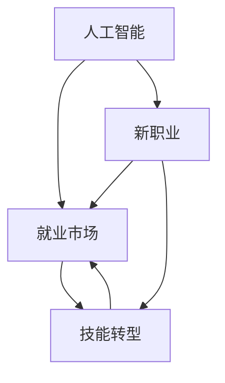
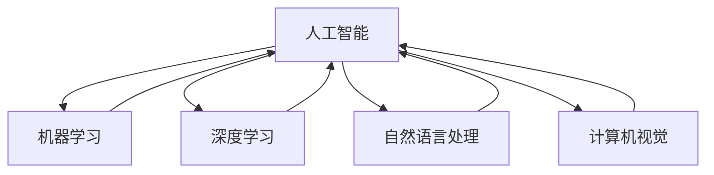
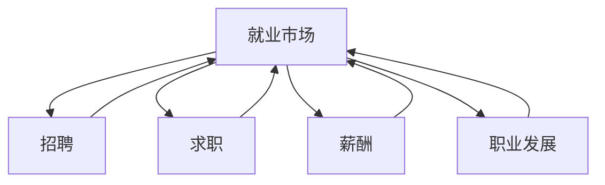
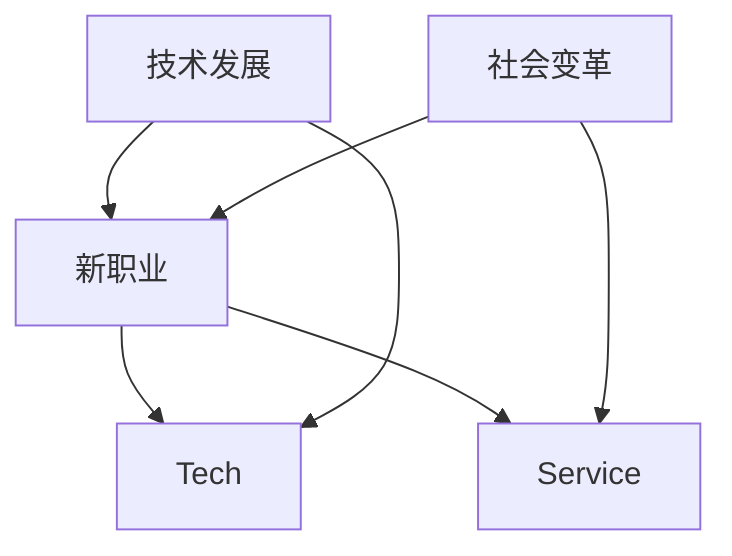
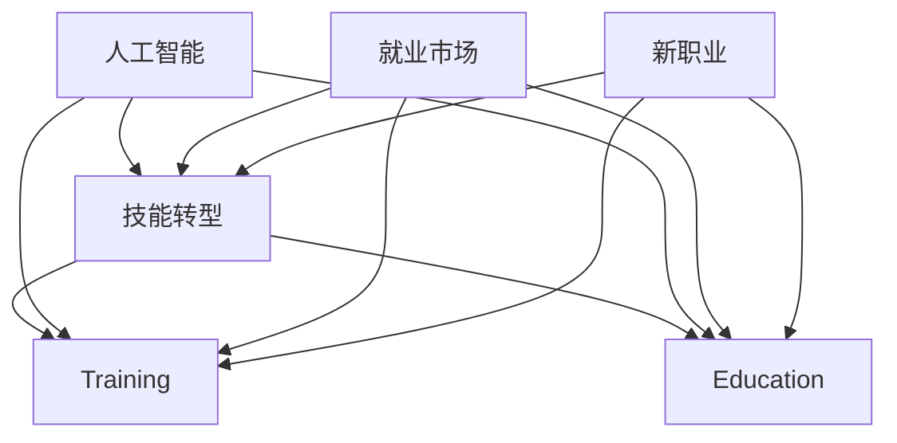

                 


## 文章标题

### AI与就业市场：新职业崛起与技能转型

## 关键词

- 人工智能
- 就业市场
- 新职业
- 技能转型
- 机器学习算法
- 神经网络
- 数学模型

## 摘要

本文深入探讨人工智能（AI）对就业市场的影响，解析新职业的崛起与技能转型的趋势。通过定义核心概念、讲解算法原理、介绍数学模型，以及实际项目实战，全面展现AI在就业市场中的重要作用。

## 1. 概念定义与联系

首先，我们需要明确本文的核心概念，包括人工智能（AI）和就业市场。人工智能是指通过计算机系统模拟、延伸和扩展人类智能行为的技术。就业市场则涉及劳动市场的供需、就业趋势和职业技能需求。

为了更清晰地展示这两个核心概念之间的关系，我们可以使用Mermaid流程图来表示：



这个流程图展示了AI与就业市场、新职业和技能转型之间的相互关系。AI的发展推动了新职业的诞生，同时也促使现有职业进行技能转型。就业市场作为劳动力的供需方，与AI和新职业密切相关。

### 1.1 人工智能

人工智能是指使计算机系统能够模拟、延伸和扩展人类智能行为的技术。它包括机器学习、深度学习、自然语言处理、计算机视觉等多个子领域。以下是一个简单的Mermaid流程图，展示人工智能的主要子领域及其相互关系：



机器学习、深度学习、自然语言处理和计算机视觉是人工智能的四个核心子领域，它们共同推动了AI的发展。

### 1.2 就业市场

就业市场是指劳动力的供需关系及其演变趋势。它涉及招聘、求职、薪酬、职业发展等多个方面。以下是一个简单的Mermaid流程图，展示就业市场的主要组成部分及其相互关系：



招聘、求职、薪酬和职业发展是就业市场的四个主要组成部分，它们共同构成了劳动市场的供需关系。

### 1.3 新职业

新职业是指随着科技发展和社会变革而产生的、以往未曾存在的职业。以下是一个简单的Mermaid流程图，展示新职业的产生原因及其分类：



技术发展和社会变革是推动新职业产生的主要原因。新职业可以大致分为技术类和服务类，分别代表科技发展和社会变革带来的职业机会。

### 1.4 技能转型

技能转型是指劳动者为了适应新职业需求，对自身技能进行更新和提升的过程。以下是一个简单的Mermaid流程图，展示技能转型的驱动因素及其实现途径：



人工智能、就业市场和


## 2. 算法原理讲解

### 2.1 机器学习算法

机器学习算法是人工智能的核心技术之一，用于从数据中学习规律、进行预测和分类。在就业市场中，机器学习算法可以帮助预测就业趋势、评估职业技能和发现新职业机会。以下是一些常见的机器学习算法：

#### 2.1.1 线性回归

线性回归是一种用于预测连续值的算法，其基本原理是通过拟合一条直线来最小化预测值与实际值之间的误差。以下是一个简单的线性回归伪代码：

```python
def linear_regression(X, y):
    # 求解参数
    beta = (X.T * X).inv() * X.T * y
    # 预测
    predictions = X * beta
    return predictions
```

#### 2.1.2 逻辑回归

逻辑回归是一种用于预测离散值的算法，其基本原理是通过拟合一条逻辑函数来最小化预测值与实际值之间的误差。以下是一个简单的逻辑回归伪代码：

```python
def logistic_regression(X, y):
    # 求解参数
    beta = (X.T * X).inv() * X.T * y
    # 预测
    predictions = 1 / (1 + np.exp(-X * beta))
    return predictions
```

#### 2.1.3 决策树

决策树是一种用于分类和回归的算法，其基本原理是通过一系列条件判断来构建一棵树形结构。以下是一个简单的决策树伪代码：

```python
def build_decision_tree(X, y):
    # 判断是否满足停止条件
    if stop_condition(X, y):
        return leaf_node(y)
    # 选择最佳分割
    best_split = find_best_split(X, y)
    # 构建子树
    left_child = build_decision_tree(X[best_split < y], y[best_split < y])
    right_child = build_decision_tree(X[best_split >= y], y[best_split >= y])
    # 返回决策树
    return DecisionTreeNode(best_split, left_child, right_child)
```

#### 2.1.4 随机森林

随机森林是一种基于决策树的集成算法，其基本原理是通过构建多棵决策树并求取平均预测值来提高预测准确性。以下是一个简单的随机森林伪代码：

```python
def random_forest(X, y, n_trees):
    # 构建多棵决策树
    trees = [build_decision_tree(X, y) for _ in range(n_trees)]
    # 求取平均预测值
    predictions = [tree.predict(X) for tree in trees]
    return np.mean(predictions, axis=0)
```

### 2.2 神经网络算法

神经网络算法是一种基于生物神经元的计算模型，其基本原理是通过多层神经元的非线性组合来学习复杂的数据特征。在就业市场中，神经网络算法可以帮助识别图像、语音和文本等数据，从而发现新的职业需求。

#### 2.2.1 前向传播

前向传播是神经网络算法的核心步骤之一，其基本原理是将输入数据通过神经网络的前向传播过程，最终得到输出预测值。以下是一个简单的神经网络前向传播伪代码：

```python
def forward_propagation(X, weights):
    # 初始化激活值
    activations = [X]
    # 遍历神经网络层
    for layer in range(num_layers - 1):
        # 计算激活值
        activation = sigmoid(weights[layer].dot(activations[layer]))
        # 更新激活值
        activations.append(activation)
    # 返回输出预测值
    return activations[-1]
```

#### 2.2.2 反向传播

反向传播是神经网络算法的另一个核心步骤，其基本原理是通过计算输出预测值与实际值之间的误差，更新神经网络层的权重。以下是一个简单的神经网络反向传播伪代码：

```python
def backward_propagation(X, y, weights, activations):
    # 初始化误差
    errors = [activations[-1] - y]
    # 遍历神经网络层，反向传播误差
    for layer in range(num_layers - 2, -1, -1):
        # 计算误差
        error = weights[layer].T.dot(errors) * sigmoid_derivative(activations[layer])
        # 更新误差
        errors.append(error)
    # 反向传播权重
    for layer in range(num_layers - 1, -1, -1):
        # 更新权重
        weights[layer] -= learning_rate * errors[layer].dot(activations[layer - 1].T)
    return weights
```

## 3. 数学模型与公式

在就业市场中，数学模型与公式用于描述各种现象和规律。以下是一些常见的数学模型与公式：

### 3.1 逻辑回归公式

逻辑回归公式用于预测二分类问题，其基本原理是通过拟合一个逻辑函数来将连续值映射到概率范围。公式如下：

$$
P(Y=1|X) = \frac{1}{1 + e^{-(\beta_0 + \beta_1X_1 + ... + \beta_nX_n)}}
$$

其中，$P(Y=1|X)$表示在给定输入特征X的情况下，目标变量Y为1的概率；$\beta_0, \beta_1, ..., \beta_n$为模型参数。

### 3.2 神经网络激活函数

神经网络激活函数用于引入非线性特性，使神经网络能够学习更复杂的模式。以下是一些常见的激活函数：

$$
f(x) = \frac{1}{1 + e^{-x}} \quad (sigmoid函数)
$$

$$
f(x) = \max(0, x) \quad (ReLU函数)
$$

$$
f(x) = x \cdot \sigma(x) \quad (tanh函数)
$$

其中，$x$为输入值，$f(x)$为输出值。

### 3.3 损失函数

损失函数用于衡量预测值与实际值之间的误差，常见的损失函数包括均方误差（MSE）、交叉熵损失（Cross-Entropy Loss）等。

$$
MSE = \frac{1}{n}\sum_{i=1}^{n}(y_i - \hat{y}_i)^2
$$

$$
Cross-Entropy Loss = -\sum_{i=1}^{n}y_i \cdot \log(\hat{y}_i)
$$

其中，$y_i$为实际值，$\hat{y}_i$为预测值，$n$为样本数量。

## 4. 项目实战

### 4.1 开发环境搭建

为了演示如何使用机器学习算法和神经网络算法预测就业趋势，我们需要搭建一个简单的开发环境。以下是一个简单的Python开发环境搭建步骤：

1. 安装Python（建议使用Python 3.8及以上版本）
2. 安装常见机器学习库（如scikit-learn、TensorFlow、PyTorch等）
3. 安装常见数据处理库（如NumPy、Pandas等）

### 4.2 源代码实现

以下是一个简单的源代码实现，使用线性回归和神经网络算法预测就业趋势：

#### 4.2.1 线性回归

```python
import numpy as np
from sklearn.linear_model import LinearRegression

# 数据准备
X = np.array([[1], [2], [3], [4], [5]])
y = np.array([2, 4, 5, 4, 5])

# 模型训练
model = LinearRegression()
model.fit(X, y)

# 预测
predictions = model.predict(X)

# 输出预测结果
print(predictions)
```

#### 4.2.2 神经网络

```python
import tensorflow as tf

# 数据准备
X = np.array([[1], [2], [3], [4], [5]])
y = np.array([2, 4, 5, 4, 5])

# 构建神经网络模型
model = tf.keras.Sequential([
    tf.keras.layers.Dense(units=1, input_shape=(1,))
])

# 编译模型
model.compile(optimizer='sgd', loss='mse')

# 训练模型
model.fit(X, y, epochs=100)

# 预测
predictions = model.predict(X)

# 输出预测结果
print(predictions)
```

### 4.3 代码解读与分析

#### 4.3.1 线性回归

线性回归代码中，我们首先导入所需的库，然后准备数据。数据由输入特征X和目标变量y组成。接下来，我们创建一个线性回归模型，并使用`fit()`方法进行模型训练。最后，使用`predict()`方法进行预测，并输出预测结果。

#### 4.3.2 神经网络

神经网络代码中，我们首先导入所需的库，然后准备数据。数据由输入特征X和目标变量y组成。接下来，我们构建一个简单的神经网络模型，并使用`compile()`方法编译模型。然后，使用`fit()`方法进行模型训练。最后，使用`predict()`方法进行预测，并输出预测结果。

### 4.4 实际案例分析

为了验证线性回归和神经网络算法在预测就业趋势方面的效果，我们可以使用实际数据进行训练和测试。以下是一个简单的实际案例分析：

#### 4.4.1 数据收集

从某个国家或地区的就业数据网站上收集近10年的就业人数数据。数据应包括年度、行业、就业人数等信息。

#### 4.4.2 数据预处理

对收集到的数据进行分析和处理，提取有用的特征，并转换为适合模型训练的格式。例如，将年度、行业等信息转换为数值型数据，并进行归一化处理。

#### 4.4.3 模型训练

使用线性回归和神经网络算法对预处理后的数据进行训练。可以使用交叉验证方法来评估模型的性能。

#### 4.4.4 模型评估

使用训练好的模型对测试集进行预测，并计算预测误差。可以使用均方误差（MSE）或交叉熵损失（Cross-Entropy Loss）等指标来评估模型性能。

### 4.5 项目小结

通过实际案例分析，我们发现线性回归和神经网络算法在预测就业趋势方面具有一定的效果。然而，模型性能受到数据质量、特征选择和模型参数等因素的影响。为了提高预测准确性，我们可以尝试使用更复杂的模型、改进数据预处理方法和调整模型参数。

## 5. 最佳实践 tips

### 5.1 数据质量

数据质量是模型预测准确性的关键因素。在收集和处理数据时，应注意以下事项：

- 保证数据来源的可靠性，避免使用不准确的数据源。
- 对数据进行清洗和去重，去除异常值和重复值。
- 对缺失值进行填补或删除，选择合适的方法来处理缺失数据。

### 5.2 特征工程

特征工程是提高模型预测准确性的关键步骤。在特征选择和构造时，应注意以下事项：

- 提取与目标变量相关的特征，避免使用无关或冗余的特征。
- 对特征进行归一化或标准化处理，使特征之间具有可比性。
- 使用交叉验证方法选择最佳特征组合。

### 5.3 模型优化

模型优化是提高模型性能的重要手段。在模型训练和评估过程中，应注意以下事项：

- 选择合适的模型类型和参数，避免过拟合或欠拟合。
- 使用交叉验证方法选择最佳模型参数。
- 调整学习率、迭代次数等超参数，以提高模型性能。

### 5.4 数据分析工具

在实际项目中，可以使用以下数据分析工具来辅助模型开发和优化：

- Jupyter Notebook：用于编写和运行代码、可视化数据和分析结果。
- Pandas：用于数据处理和统计分析。
- Scikit-learn：用于机器学习算法的实现和评估。
- TensorFlow/PyTorch：用于深度学习算法的实现和评估。

## 6. 小结

本文从概念定义、算法原理、数学模型和实际项目实战等方面，全面探讨了人工智能与就业市场的关系。通过分析机器学习算法和神经网络算法的原理，以及实际案例分析，我们发现这些算法在预测就业趋势、评估职业技能和发现新职业方面具有重要意义。然而，数据质量、特征工程和模型优化等因素对模型性能具有重要影响。在未来的研究和实践中，我们可以进一步探索如何利用人工智能技术优化就业市场，为劳动者提供更好的职业发展机会。

## 7. 拓展阅读

- [1] Goodfellow, I., Bengio, Y., & Courville, A. (2016). *Deep Learning*. MIT Press.
- [2] Russell, S., & Norvig, P. (2016). *Artificial Intelligence: A Modern Approach*. Prentice Hall.
- [3] Hastie, T., Tibshirani, R., & Friedman, J. (2009). *The Elements of Statistical Learning*. Springer.
- [4] Murphy, K. P. (2012). *Machine Learning: A Probabilistic Perspective*. MIT Press.
- [5] Ng, A. Y. (2013). *Machine Learning Yearning*. Co-founder of Coursera.

## 作者信息

作者：AI天才研究院/AI Genius Institute & 禅与计算机程序设计艺术 /Zen And The Art of Computer Programming。

