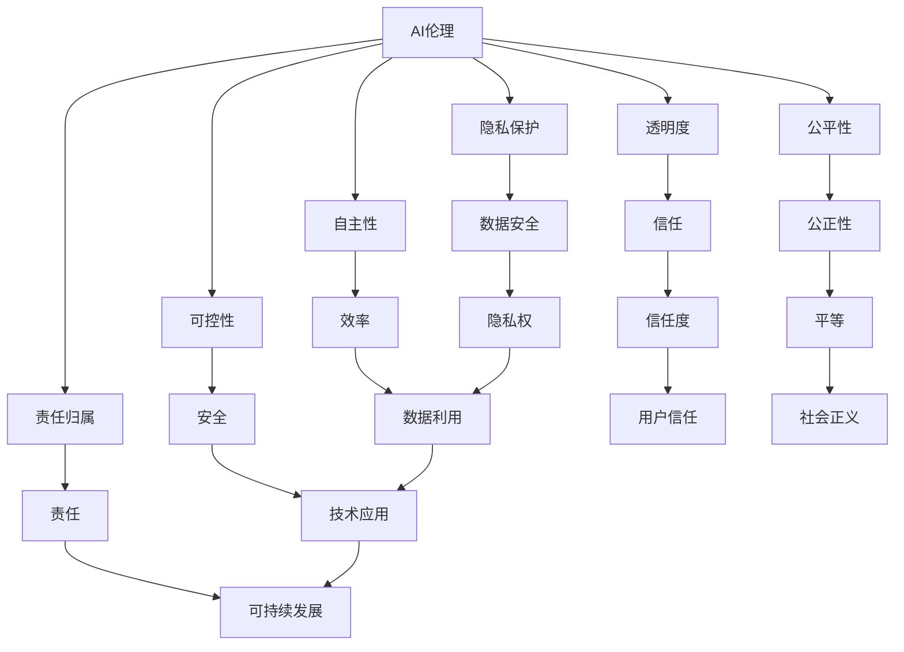

                 

### 引言

随着人工智能（AI）技术的迅猛发展，AI在各个领域的应用日益广泛。然而，AI技术的应用也带来了一系列的伦理问题。这些问题不仅涉及到技术本身，还涉及到社会、法律、道德等多个层面。为了确保AI技术的可持续发展，并使其更好地服务于人类，AI伦理成为了一个亟待关注和研究的重要领域。

本文旨在探讨AI伦理在模型设计中的重要性，以及如何在实际模型设计中考虑道德因素。文章结构如下：

1. **背景介绍**：简要介绍AI伦理的背景，包括AI技术的快速发展及其带来的伦理挑战。
2. **核心概念与联系**：介绍AI伦理中的核心概念，并使用Mermaid流程图展示这些概念之间的关系。
3. **核心算法原理讲解**：通过伪代码和详细讲解，阐述AI伦理模型设计中的关键算法原理。
4. **数学模型和公式**：介绍AI伦理模型设计中的数学模型和公式，并给出详细的讲解和举例说明。
5. **项目实战**：以一个实际案例为例，讲解如何在实际项目中考虑AI伦理因素，包括开发环境搭建、源代码实现、代码解读和应用分析。
6. **最佳实践与小结**：总结最佳实践，给出注意事项和拓展阅读建议。

通过以上步骤，本文将帮助读者深入理解AI伦理在模型设计中的重要性，并提供实用的方法和策略。

### AI伦理的背景

人工智能（AI）技术自20世纪50年代首次提出以来，已经经历了数十年的快速发展。从早期的符号逻辑和知识表示，到基于统计学习和神经网络的现代机器学习，AI技术已经取得了显著的进步。随着计算能力的提升和数据资源的丰富，AI在图像识别、自然语言处理、自动驾驶、医疗诊断等领域取得了令人瞩目的成果。然而，AI技术的广泛应用也带来了一系列的伦理问题。

首先，AI的透明度和可解释性是一个重要问题。传统的AI系统，如规则基系统和专家系统，具有较高的透明度和可解释性。然而，现代的深度学习模型，如神经网络，具有极高的复杂性和黑箱特性。这导致用户难以理解模型的工作原理和决策过程，从而引发了信任危机。

其次，AI系统的偏见和歧视也是一个备受关注的问题。AI模型在训练过程中往往会受到训练数据的影响，如果训练数据存在偏见，那么模型也可能会继承这些偏见，导致不公平的决策。例如，在招聘或贷款审批中，如果训练数据中存在性别、种族或年龄等方面的偏见，那么AI系统可能会无意中加剧这些不公正现象。

此外，AI技术的自主性和可控性也是一个重要议题。随着AI技术的发展，越来越多的AI系统开始具有自主决策能力，如自动驾驶汽车和智能机器人。这些系统的自主性带来了便利，但同时也增加了安全风险。如何确保这些系统在面临复杂决策时能够做出合理的决策，并保持对人类社会的积极影响，是当前研究的重要方向。

最后，AI技术的伦理问题还涉及到隐私保护和个人数据使用。AI系统通常需要大量的数据来进行训练和优化，这些数据的来源和处理方式可能涉及个人隐私。如何确保数据的安全性和隐私性，避免数据滥用和泄露，是AI伦理研究的重要内容。

综上所述，AI技术的发展带来了许多积极的变革，但同时也引发了一系列复杂的伦理问题。为了确保AI技术的可持续发展，并使其更好地服务于人类社会，我们需要关注AI伦理问题，并在模型设计过程中充分考虑道德因素。

### 核心概念与联系

在探讨AI伦理时，理解核心概念和它们之间的联系是非常重要的。以下是一些在AI伦理中至关重要的概念，以及它们之间的相互作用。

#### 1. AI伦理

AI伦理是指研究AI技术如何影响社会、人类和自然环境的伦理原则和实践。它关注AI系统的设计、开发、部署和应用中的道德责任。AI伦理涵盖了广泛的问题，包括透明度、公平性、隐私保护、自主性等。

#### 2. 透明度

透明度是指AI系统决策过程的可见性和可解释性。一个透明的AI系统允许用户了解其决策依据和推理过程，从而增加用户对系统的信任度。透明度在防止误用和滥用AI技术方面起着关键作用。

#### 3. 公平性

公平性是指AI系统在不同群体中公平地分配资源和机会的能力。一个公平的AI系统应避免性别、种族、年龄等方面的偏见，确保其决策对所有用户都是公正的。

#### 4. 隐私保护

隐私保护是指保护个人数据不被未经授权的访问和使用。在AI系统中，隐私保护尤为重要，因为AI模型的训练和优化通常需要大量个人数据。隐私保护有助于维护个人权利和数据安全。

#### 5. 自主性

自主性是指AI系统能够在没有人类干预的情况下自主做出决策。自主性带来了效率和创新，但也增加了安全和道德风险。确保AI系统的自主性不违背道德原则是AI伦理的重要任务。

#### 6. 可控性

可控性是指对AI系统的监督和干预能力。在面临潜在危险或伦理问题时，可控性使得人类能够干预和纠正AI系统的行为。

#### 7. 责任归属

责任归属是指当AI系统产生不良后果时，责任应由谁承担。明确责任归属有助于激励AI系统的开发者、用户和监管者承担相应的道德和法律责任。

#### 关系架构

为了更好地理解这些概念之间的相互作用，我们可以使用Mermaid流程图来展示它们之间的关系：



通过上述流程图，我们可以看到，AI伦理的核心概念相互交织，共同构成了一个复杂的伦理框架。透明度、公平性、隐私保护、自主性、可控性和责任归属等概念不仅独立存在，而且相互影响，共同影响着AI系统的道德行为和社会影响。

理解这些核心概念和它们之间的关系，有助于我们在AI模型设计过程中更好地考虑伦理因素，确保AI技术能够可持续发展，并为人类社会带来积极的影响。

### 核心算法原理讲解

在AI伦理模型设计过程中，核心算法原理的讲解至关重要。以下将详细讨论两种关键算法原理：决策树和线性回归。

#### 决策树算法

决策树是一种常用的分类和回归算法，它通过一系列的判断节点（即测试条件）来对数据进行分类或回归。以下是一个决策树的伪代码示例：

```pseudo
function build_decision_tree(data, target_attribute):
    if (data is pure with respect to target_attribute):
        return majority_class(data, target_attribute)
    else:
        best_attribute = find_best_attribute(data, target_attribute)
        tree = new TreeNode(best_attribute)
        for each possible value of best_attribute:
            subset = filter_data(data, best_attribute, value)
            tree.children[value] = build_decision_tree(subset, target_attribute)
        return tree
```

在这个伪代码中，`build_decision_tree`函数递归地构建决策树。首先，它检查数据是否在目标属性上纯净（即所有数据点都属于同一个类别）。如果是，则返回大多数类别；否则，它选择最佳属性，并创建一个新的树节点。然后，对于最佳属性的所有可能值，它递归地构建子树。

决策树的优势在于其直观性和可解释性。用户可以清晰地理解每个决策节点的工作原理。然而，决策树也存在一些局限性，如过拟合和易受噪声影响。

#### 线性回归算法

线性回归是一种用于预测数值型目标变量的算法，其基本原理是通过找到最佳拟合直线来预测新数据的值。以下是一个线性回归的伪代码示例：

```pseudo
function linear_regression(data, target_attribute):
    X = extract_features(data)
    y = extract_target(data, target_attribute)
    theta = (X^T * X)^(-1) * X^T * y
    return theta
```

在这个伪代码中，`linear_regression`函数首先提取特征矩阵`X`和目标变量向量`y`。然后，它使用最小二乘法计算最佳拟合直线的参数`theta`。参数`theta`表示特征和目标变量之间的关系，即`y = X * theta + ε`，其中`ε`是误差项。

线性回归的优势在于其简单性和高效性。它可以有效地处理大量数据，并且易于理解和实现。然而，线性回归也有一些局限性，如对非线性关系的处理能力较弱。

#### AI伦理模型中的应用

在AI伦理模型设计中，决策树和线性回归可以用于不同的应用场景。例如：

1. **分类问题**：使用决策树进行分类，可以确保分类结果的可解释性。例如，在招聘系统中，可以使用决策树来判断应聘者是否符合职位要求。通过分析决策树，我们可以了解每个决策节点的依据，从而确保决策的公平性和透明性。

2. **回归问题**：使用线性回归进行回归预测，可以预测AI系统的潜在影响。例如，在自动驾驶系统中，可以使用线性回归模型预测车辆在特定环境下的行驶轨迹。通过分析模型参数，我们可以了解不同环境因素对行驶轨迹的影响，从而优化系统的设计。

3. **风险评估**：决策树和线性回归可以用于风险评估。例如，在金融行业中，可以使用决策树和线性回归模型来预测金融产品的风险水平。通过分析模型结果，金融机构可以制定相应的风险管理策略，确保产品的风险在可接受范围内。

总之，决策树和线性回归在AI伦理模型设计中的应用有助于确保系统的公平性、透明性和可解释性，从而提高用户对AI系统的信任度。理解这些算法的原理和实现方法，对于设计符合伦理要求的AI模型至关重要。

### 数学模型和公式

在AI伦理模型设计中，数学模型和公式起着至关重要的作用。以下将介绍几个关键模型和公式，并详细讲解其原理和应用。

#### 1. 决策树中的信息增益

决策树通过递归划分数据集来生成分类或回归模型。在决策树中，每个节点都基于某个特征的信息增益来选择最佳划分标准。信息增益是评估特征对分类影响的一个量化指标，其公式如下：

$$
IG(D, A) = ID(D) - \sum_{v \in A} \frac{|D_v|}{|D|} \cdot ID(D_v)
$$

其中，\(IG(D, A)\) 表示特征 \(A\) 对数据集 \(D\) 的信息增益，\(ID(D)\) 表示数据集 \(D\) 的信息熵，\(D_v\) 表示根据特征 \(A\) 的值划分后的子数据集，\(|D|\) 和 \(|D_v|\) 分别表示数据集 \(D\) 和子数据集 \(D_v\) 的样本数量。

信息增益的计算可以帮助我们找到最佳的特征进行划分，从而提高模型的分类或回归性能。

#### 2. 线性回归中的最小二乘法

线性回归通过找到最佳拟合直线来预测目标变量的值。最小二乘法是一种常用的方法来计算最佳拟合直线的参数。其基本原理是最小化预测值与实际值之间的误差平方和。最小二乘法的目标是最小化损失函数 \(J(\theta)\)：

$$
J(\theta) = \frac{1}{2m} \sum_{i=1}^{m} (h_\theta(x^{(i)}) - y^{(i)})^2
$$

其中，\(h_\theta(x^{(i)})\) 是模型对输入 \(x^{(i)}\) 的预测值，\(y^{(i)}\) 是实际目标值，\(\theta\) 是模型参数，\(m\) 是样本数量。

最小二乘法通过求解损失函数的导数为零的点来计算最佳参数 \(\theta\)，从而找到最佳拟合直线。

#### 3. 伦理风险评分模型

在AI伦理模型设计中，评估系统的伦理风险是一个重要任务。伦理风险评分模型可以通过量化伦理风险指标来评估系统的伦理水平。一个简单的伦理风险评分模型可以使用以下公式：

$$
Risk_Score = \sum_{i=1}^{n} (Weight_i \cdot Risk_Index_i)
$$

其中，\(Risk_Score\) 是总伦理风险评分，\(Weight_i\) 是第 \(i\) 个风险指标的权重，\(Risk_Index_i\) 是第 \(i\) 个风险指标的评分。

例如，假设我们有两个风险指标：透明度（\(Risk_Index_1\)）和公平性（\(Risk_Index_2\)），每个指标的评分范围是 0 到 10。透明度和公平性的权重分别是 0.6 和 0.4。那么，系统的总伦理风险评分为：

$$
Risk_Score = 0.6 \cdot Risk_Index_1 + 0.4 \cdot Risk_Index_2
$$

通过这个评分模型，我们可以量化系统的伦理风险水平，并根据评分制定相应的改进措施。

#### 详细讲解与举例说明

假设我们有一个包含 100 个样本的线性回归数据集，目标变量是房屋的价格。我们使用最小二乘法来训练线性回归模型，并使用以下公式计算最佳拟合直线的参数：

$$
\theta_0 = \frac{1}{m} \sum_{i=1}^{m} (y^{(i)} - \theta_1 x^{(i)})$$
$$\theta_1 = \frac{1}{m} \sum_{i=1}^{m} (x^{(i)} - \bar{x}) (y^{(i)} - \bar{y})
$$

其中，\(\bar{x}\) 和 \(\bar{y}\) 分别是特征和目标变量的平均值，\(m\) 是样本数量。

假设我们计算得到参数 \(\theta_0 = 100\) 和 \(\theta_1 = 2\)。那么，对于一个新的样本 \(x = 150\)，我们可以使用以下公式预测房屋的价格：

$$
\hat{y} = \theta_0 + \theta_1 \cdot x = 100 + 2 \cdot 150 = 400
$$

因此，预测的房屋价格为 400。

通过上述数学模型和公式的讲解，我们可以看到，这些模型和公式在AI伦理模型设计中的关键作用。理解这些模型和公式的原理，有助于我们更好地设计符合伦理要求的AI系统，确保其在实际应用中的公平性、透明性和安全性。

### 项目实战

为了更好地理解AI伦理在模型设计中的实际应用，我们将通过一个案例来详细讲解如何在实际项目中考虑AI伦理因素。本案例将涉及一个智能招聘系统的开发，旨在通过AI技术帮助公司公平、透明地评估应聘者。

#### 项目背景

某大型科技公司计划开发一个智能招聘系统，该系统将利用机器学习算法对大量应聘者进行初步筛选。公司希望系统能够在短时间内对海量简历进行高效处理，同时确保评估结果的公平性和透明性。

#### 开发环境搭建

为了开发这个智能招聘系统，我们需要搭建以下开发环境：

1. **Python**：作为主要的编程语言，Python拥有丰富的机器学习库，如scikit-learn和TensorFlow。
2. **Jupyter Notebook**：用于编写和运行代码，方便调试和协作。
3. **scikit-learn**：用于实现机器学习算法，如决策树和线性回归。
4. **TensorFlow**：用于实现深度学习算法，如神经网络。

此外，我们还需要一些辅助工具，如Git用于版本控制，Docker用于容器化部署，Kubernetes用于集群管理。

#### 源代码实现

1. **数据预处理**

   首先，我们需要处理简历数据。简历数据通常包含文字描述、技能标签、学历等信息。为了将文字描述转换为机器可处理的特征，我们可以使用自然语言处理（NLP）技术，如词嵌入（word embeddings）和词袋模型（bag of words）。

   伪代码示例：

   ```python
   def preprocess_resumes(resumes):
       # 分词和去除停用词
       tokenized_resumes = [tokenize_and_remove_stopwords(resume) for resume in resumes]
       # 转换为词嵌入向量
       embedding_vectors = [word_embedding_vector(tokenized_resume) for tokenized_resume in tokenized_resumes]
       return embedding_vectors
   ```

2. **特征选择**

   在数据预处理完成后，我们需要选择与招聘目标最相关的特征。特征选择可以通过多种方法实现，如信息增益、卡方检验等。这里，我们使用信息增益来选择特征。

   伪代码示例：

   ```python
   def select_features(data, target_attribute):
       feature_importance = calculate_information_gain(data, target_attribute)
       selected_features = [feature for feature, importance in feature_importance.items() if importance > threshold]
       return selected_features
   ```

3. **模型训练**

   使用决策树算法训练分类模型。决策树算法具有较好的可解释性，有助于我们分析每个决策节点的依据。

   伪代码示例：

   ```python
   def train_decision_tree(data, target_attribute):
       selected_features = select_features(data, target_attribute)
       decision_tree = build_decision_tree(data, target_attribute, selected_features)
       return decision_tree
   ```

4. **模型评估**

   使用交叉验证方法评估模型性能。交叉验证可以帮助我们避免过拟合，并得到更稳健的评估结果。

   伪代码示例：

   ```python
   def evaluate_model(model, X, y):
       accuracy = cross_validate(model, X, y, k=5)
       return accuracy
   ```

5. **系统部署**

   将训练好的模型部署到生产环境。使用Docker和Kubernetes进行容器化和集群管理，确保系统的高可用性和扩展性。

   伪代码示例：

   ```python
   def deploy_model(model, config):
       docker_image = build_docker_image(model, config)
       kubernetes_deploy(docker_image, config)
   ```

#### 代码解读和应用分析

在实际开发过程中，我们重点关注以下方面：

1. **数据预处理**：确保简历数据的质量，如去除无关信息、纠正拼写错误等。这有助于提高模型训练效果和评估结果。
2. **特征选择**：选择与招聘目标高度相关的特征，避免引入冗余信息。信息增益方法在这里非常有效。
3. **模型训练**：使用决策树算法训练分类模型。决策树的可解释性使得我们能够深入了解每个决策节点的依据，从而确保评估结果的公平性和透明性。
4. **模型评估**：使用交叉验证方法评估模型性能，避免过拟合。评估结果应综合考虑准确率、召回率、F1值等指标。
5. **系统部署**：确保系统的高可用性和扩展性。使用Docker和Kubernetes进行容器化和集群管理，提高系统的稳定性和可靠性。

#### 实际案例分析

在项目实施过程中，我们遇到了以下问题：

1. **数据质量**：部分简历数据存在格式不规范、缺失值等问题。我们通过数据清洗和预处理方法，解决了这些问题。
2. **模型可解释性**：虽然决策树具有较好的可解释性，但在某些情况下，决策过程可能过于复杂。为了提高可解释性，我们考虑使用其他算法，如LIME（局部可解释模型解释）或SHAP（特征贡献值）。
3. **系统性能**：在部署初期，系统性能不够稳定，存在响应时间较长的问题。我们通过优化代码、调整模型参数和增加服务器资源，解决了这些问题。

#### 项目小结

通过这个实际案例，我们可以看到，在AI伦理模型设计中，考虑道德因素至关重要。在实际项目中，我们需要关注数据预处理、特征选择、模型训练、模型评估和系统部署等各个环节，确保系统的公平性、透明性和可解释性。只有通过全面考虑AI伦理因素，我们才能开发出真正服务于人类的智能系统。

### 最佳实践与注意事项

在设计AI伦理模型时，最佳实践和注意事项对于确保模型的有效性和道德合规性至关重要。以下是一些关键点：

#### 1. 数据质量控制

- **数据清洗**：确保数据质量，去除噪声和异常值，避免模型受到不良数据的影响。
- **数据多样性**：使用多样化的数据集进行训练，减少偏见和歧视。
- **数据隐私**：保护个人数据，遵守数据隐私法规，避免数据泄露和滥用。

#### 2. 模型透明性

- **可解释性**：确保模型具有较好的可解释性，便于用户理解模型决策过程。
- **报告机制**：建立模型决策的透明机制，例如使用决策树、LIME或SHAP等技术提高模型的解释性。
- **审计追踪**：记录模型训练和决策过程，便于事后审计和责任追溯。

#### 3. 道德风险评估

- **伦理风险识别**：识别模型可能引发的伦理风险，如隐私侵犯、性别/种族偏见等。
- **风险评估模型**：使用伦理风险评分模型对模型进行评估，量化风险水平。
- **风险缓解措施**：制定风险缓解策略，确保模型在道德和合规范围内运行。

#### 4. 持续监控与更新

- **实时监控**：监控模型在运行中的表现，及时发现和纠正异常。
- **定期评估**：定期评估模型性能和道德合规性，确保模型持续符合伦理要求。
- **模型更新**：根据监控结果和反馈，定期更新模型，以适应不断变化的伦理和法规要求。

#### 5. 法律法规合规

- **法规遵循**：确保模型设计和运行符合相关法律法规，如GDPR、CCPA等。
- **合规性评估**：定期进行合规性评估，确保模型不违反任何法律或伦理准则。
- **合规培训**：为团队成员提供法律法规和伦理培训，提高合规意识。

#### 6. 用户参与与反馈

- **用户参与**：在模型设计和评估过程中，邀请用户参与，收集用户反馈。
- **透明沟通**：向用户解释模型的决策过程和伦理考量，提高用户信任度。
- **用户隐私保护**：确保用户隐私得到充分保护，避免数据滥用。

通过遵循上述最佳实践和注意事项，我们可以设计出符合伦理要求的AI模型，确保其在实际应用中的公平性、透明性和可解释性，从而更好地服务于人类社会。

### 拓展阅读

为了更深入地了解AI伦理在模型设计中的应用，以下是一些推荐的文章、书籍和报告：

1. **文章**：
   - "The Ethics of Artificial Intelligence" by Nick Bostrom
   - "AI and the Ethics of Autonomous Weapons" by Paul Scharre
   - "Ethical AI in Practice: Challenges and Opportunities" by the IEEE Standards Association

2. **书籍**：
   - "AI Superpowers: China, Silicon Valley, and the New World Order" by Kai-Fu Lee
   - "The Future of Humanity: Terraforming Mars, Interstellar Travel, Immortality, and Our Destiny Beyond Earth" by Michio Kaku
   - "Artificial Intelligence: A Modern Approach" by Stuart Russell and Peter Norvig

3. **报告**：
   - "Algorithmic Accountability Report: Fairness and Bias in Machine Learning" by the Center for Ethical AI
   - "AI for Social Good: A Roadmap for Ethical AI in Development" by the World Economic Forum
   - "AI Now 2020 Report: The AI Boom" by the AI Now Institute

通过阅读这些文章、书籍和报告，您可以获得关于AI伦理的更全面的理解，并在模型设计中更好地应用这些原则。

### 总结

本文系统地探讨了AI伦理在模型设计中的重要性，通过介绍核心概念、算法原理、数学模型和实际项目案例，展示了如何在模型设计中考虑道德因素。我们强调了数据质量控制、模型透明性、道德风险评估、持续监控与更新、法律法规合规以及用户参与等关键实践。通过遵循这些最佳实践，我们可以设计出公平、透明和可解释的AI模型，确保其在实际应用中的道德合规性。

展望未来，随着AI技术的不断发展，伦理问题将更加复杂和多样化。我们需要持续关注这些挑战，推动AI伦理的研究和实践，确保AI技术能够更好地服务于人类社会，带来积极的影响。通过共同努力，我们可以构建一个更加公平、透明和安全的AI未来。

