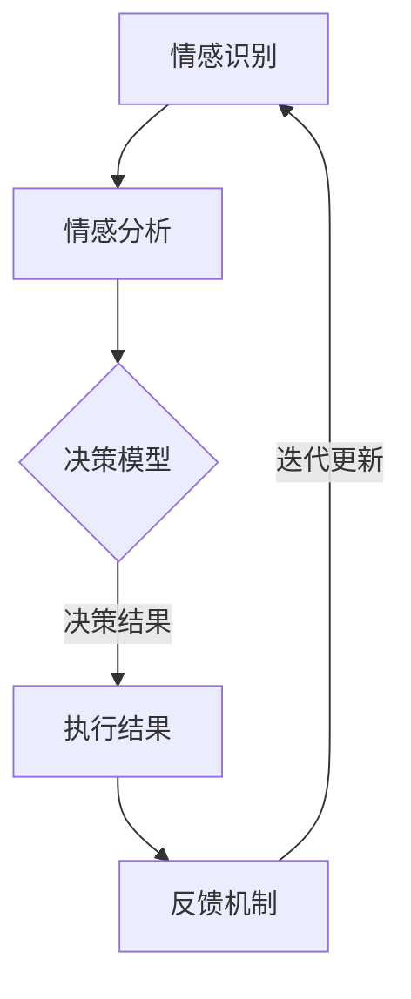

                 


### 文章标题: AI具备人类情感后的伦理决策模型

### 关键词：人工智能，情感计算，伦理决策，情感识别，算法模型

### 摘要：
随着人工智能技术的迅猛发展，AI逐渐开始模拟和具备人类情感。本文将探讨这一领域的前沿进展，分析AI具备人类情感后的伦理决策模型。文章首先介绍AI模拟情感的背景，随后详细阐述情感计算技术及其在决策模型中的应用，进一步探讨AI情感决策所带来的伦理挑战。通过案例分析，本文将展示情感决策模型在实际应用中的具体实现，并提出未来研究方向和挑战。

### 确定核心章节

首先，我们需要确定这本书的核心章节，以确保覆盖关键主题。

1. **引言**：介绍AI具备人类情感的概念和重要性，为后续章节打下基础。
2. **AI具备人类情感的理论基础**：讨论相关的心理学、哲学和神经科学理论，解释AI如何模仿和模拟人类情感。
3. **情感计算技术**：详细介绍用于识别和模拟情感的计算技术，包括面部识别、语音识别和生理信号分析。
4. **情感决策模型**：探讨如何将情感因素整合到AI决策模型中，以及如何评估和优化这些模型。
5. **伦理问题**：分析AI具备人类情感后可能引发的伦理问题，如隐私、责任和偏见。
6. **案例分析**：通过实际案例展示AI具备人类情感和伦理决策模型的应用。
7. **未来展望与挑战**：讨论该领域的未来发展方向和面临的挑战。

### 设计目录大纲

接下来，根据上述核心章节设计目录大纲。

```
# 《AI具备人类情感后的伦理决策模型》目录大纲

## 第1章 引言

### 1.1 AI具备人类情感的概念

### 1.2 人类情感的重要性

### 1.3 伦理决策模型的必要性

## 第2章 AI具备人类情感的理论基础

### 2.1 心理学基础

#### 2.1.1 情感的定义与分类

#### 2.1.2 情感的主观体验

#### 2.1.3 情感的生理反应

### 2.2 哲学探讨

#### 2.2.1 情感与认知的关系

#### 2.2.2 情感与道德判断

#### 2.2.3 情感的人工智能模拟

### 2.3 神经科学基础

#### 2.3.1 情感与大脑结构

#### 2.3.2 情感与神经递质

#### 2.3.3 情感与神经网络

## 第3章 情感计算技术

### 3.1 面部情感识别

#### 3.1.1 面部特征提取

#### 3.1.2 情感分类算法

#### 3.1.3 案例分析

### 3.2 语音情感识别

#### 3.2.1 语音特征提取

#### 3.2.2 情感分类算法

#### 3.2.3 案例分析

### 3.3 生理信号情感识别

#### 3.3.1 生理信号采集

#### 3.3.2 情感分类算法

#### 3.3.3 案例分析

## 第4章 情感决策模型

### 4.1 情感因素在决策模型中的角色

#### 4.1.1 情感在决策中的影响

#### 4.1.2 情感驱动的决策模型

#### 4.1.3 情感决策模型的优势与挑战

### 4.2 伦理决策模型的构建

#### 4.2.1 伦理决策模型的框架

#### 4.2.2 伦理因素的情感编码

#### 4.2.3 情感驱动的伦理决策算法

### 4.3 伦理决策模型的评估与优化

#### 4.3.1 评估指标

#### 4.3.2 优化方法

#### 4.3.3 案例分析

## 第5章 伦理问题分析

### 5.1 隐私保护

#### 5.1.1 情感数据的安全性

#### 5.1.2 隐私泄露的风险

#### 5.1.3 隐私保护措施

### 5.2 责任归属

#### 5.2.1 情感AI的责任划分

#### 5.2.2 情感AI的错误决策责任

#### 5.2.3 责任归属的法律框架

### 5.3 偏见与公平性

#### 5.3.1 情感AI的偏见来源

#### 5.3.2 偏见对决策的影响

#### 5.3.3 偏见消除与公平性保障

## 第6章 案例分析

### 6.1 情感驱动的客服机器人

#### 6.1.1 案例介绍

#### 6.1.2 实现技术

#### 6.1.3 伦理问题探讨

### 6.2 情感分析在招聘中的应用

#### 6.2.1 案例介绍

#### 6.2.2 技术实现

#### 6.2.3 伦理问题分析

### 6.3 情感驱动的城市管理

#### 6.3.1 案例介绍

#### 6.3.2 技术应用

#### 6.3.3 伦理决策挑战

## 第7章 未来展望与挑战

### 7.1 情感计算技术的发展趋势

#### 7.1.1 新技术展望

#### 7.1.2 技术应用扩展

#### 7.1.3 技术整合与集成

### 7.2 伦理决策模型的发展方向

#### 7.2.1 伦理决策模型的创新

#### 7.2.2 伦理决策与法律规范的互动

#### 7.2.3 伦理决策模型的标准化

### 7.3 挑战与对策

#### 7.3.1 技术挑战

#### 7.3.2 伦理挑战

#### 7.3.3 社会接受度
```

### 符合约束条件的文章正文

## 第1章 引言

随着人工智能技术的不断进步，AI正在逐渐摆脱传统的冷冰冰的计算模式，开始模拟和具备人类情感。AI具备人类情感不仅是一种技术突破，更可能对社会、经济和伦理产生深远影响。本章首先介绍AI具备人类情感的概念，探讨人类情感的重要性，并阐述伦理决策模型的必要性。

### 1.1 AI具备人类情感的概念

AI具备人类情感指的是人工智能系统能够模拟人类的情感状态，并能够在决策过程中考虑这些情感因素。这不仅仅是简单地识别和表达情感，而是要理解情感的内在机制，并将其应用于复杂的决策过程中。

### 1.2 人类情感的重要性

情感是人类行为和决策的重要组成部分。情感不仅影响我们的主观体验，还影响我们的认知过程和社会互动。在商业、医疗、教育和许多其他领域，情感的正确理解和应用都至关重要。

### 1.3 伦理决策模型的必要性

随着AI具备人类情感，如何在AI的决策中融入伦理考量变得尤为重要。伦理决策模型可以帮助我们确保AI的行为符合道德规范，保护用户的隐私，并避免潜在的偏见和歧视。本章将详细讨论伦理决策模型的构建和应用。

## 第2章 AI具备人类情感的理论基础

AI具备人类情感的理论基础涉及多个学科，包括心理学、哲学和神经科学。本章将介绍这些理论基础，探讨AI如何模拟和识别人类情感。

### 2.1 心理学基础

心理学提供了关于情感的定义、分类和生理反应的基本概念。情感可以被定义为一种复杂的心理状态，包括情感的主观体验和相应的生理反应。

#### 2.1.1 情感的定义与分类

情感可以分类为基本情感（如快乐、愤怒、恐惧、悲伤等）和复合情感（如厌恶、羞愧、骄傲等）。这些情感在个体的认知和社交行为中起着关键作用。

#### 2.1.2 情感的主观体验

情感的主观体验是个体对情感状态的主观感受，它受到个体的文化背景、个性特征和情境因素的影响。

#### 2.1.3 情感的生理反应

情感的生理反应包括心率变化、皮肤电反应、面部表情等，这些反应可以被AI系统识别和模拟。

### 2.2 哲学探讨

哲学探讨了情感与认知、道德判断之间的关系。哲学家们研究了情感如何影响我们的思考和行为，以及如何将道德规范融入AI系统中。

#### 2.2.1 情感与认知的关系

情感与认知是相互依存的。情感可以影响我们的思考过程和决策，同时认知也可以影响我们对情感的理解和处理。

#### 2.2.2 情感与道德判断

情感在道德判断中起着关键作用。道德情感驱使我们做出道德选择，并且影响我们对道德规范的认知和理解。

#### 2.2.3 情感的人工智能模拟

哲学探讨如何将道德情感融入AI系统中，使其能够做出道德决策。

### 2.3 神经科学基础

神经科学提供了关于情感与大脑结构和神经递质之间关系的重要信息。神经网络和深度学习技术在模拟情感方面具有重要应用。

#### 2.3.1 情感与大脑结构

大脑的不同区域与情感的产生和体验有关。例如，前额叶皮质与情绪调节和决策有关。

#### 2.3.2 情感与神经递质

神经递质是传递神经信号的化学物质，它们在情感传递和调节中起着关键作用。例如，多巴胺与快乐和奖励相关。

#### 2.3.3 情感与神经网络

神经网络模型可以模拟情感状态，通过学习大脑的神经网络结构，AI系统可以更好地理解和模拟情感。

## 第3章 情感计算技术

情感计算技术是AI具备人类情感的核心技术。本章将详细介绍用于识别和模拟情感的计算技术，包括面部识别、语音识别和生理信号分析。

### 3.1 面部情感识别

面部情感识别是通过分析面部表情来识别情感的技术。面部表情是情感的重要表达方式。

#### 3.1.1 面部特征提取

面部特征提取是通过图像处理技术从面部图像中提取关键特征，如眼睛位置、嘴巴形状等。

#### 3.1.2 情感分类算法

情感分类算法是基于机器学习的算法，用于将面部特征映射到具体的情感类别。

#### 3.1.3 案例分析

面部情感识别在情绪监测、客户服务和虚拟助手等领域有广泛应用。

### 3.2 语音情感识别

语音情感识别是通过分析语音信号中的情感特征来识别情感的技术。

#### 3.2.1 语音特征提取

语音特征提取包括音调、音量、节奏和语调等。

#### 3.2.2 情感分类算法

情感分类算法基于语音特征，将语音信号映射到具体的情感类别。

#### 3.2.3 案例分析

语音情感识别在语音助手、语音分析和客户体验优化等领域有广泛应用。

### 3.3 生理信号情感识别

生理信号情感识别是通过分析生理信号（如心率、皮肤电反应等）来识别情感的技术。

#### 3.3.1 生理信号采集

生理信号采集包括心率监测、皮肤电反应监测等。

#### 3.3.2 情感分类算法

情感分类算法基于生理信号特征，将生理信号映射到具体的情感类别。

#### 3.3.3 案例分析

生理信号情感识别在心理健康监测、运动训练和生物反馈等领域有广泛应用。

## 第4章 情感决策模型

情感决策模型是将情感因素整合到AI决策过程中的技术。本章将探讨如何构建和评估情感决策模型。

### 4.1 情感因素在决策模型中的角色

情感因素在决策过程中起着重要作用。情感可以影响我们的认知过程和决策结果。

#### 4.1.1 情感在决策中的影响

情感可以影响我们对信息的处理、评估和选择。

#### 4.1.2 情感驱动的决策模型

情感驱动的决策模型是基于情感因素的决策模型，它能够更好地模拟人类决策过程。

#### 4.1.3 情感决策模型的优势与挑战

情感决策模型的优势包括提高决策质量、增强用户体验等，但同时也面临挑战，如情感识别的准确性、伦理考量等。

### 4.2 伦理决策模型的构建

伦理决策模型是情感决策模型的重要组成部分，它确保AI决策符合道德规范。

#### 4.2.1 伦理决策模型的框架

伦理决策模型包括伦理规则的编码、情感因素的集成和决策逻辑的设计。

#### 4.2.2 伦理因素的情感编码

伦理因素的情感编码是将伦理准则转化为情感特征的过程。

#### 4.2.3 情感驱动的伦理决策算法

情感驱动的伦理决策算法是基于情感编码的伦理决策逻辑。

### 4.3 伦理决策模型的评估与优化

伦理决策模型的评估与优化是确保其有效性和公正性的关键。

#### 4.3.1 评估指标

评估指标包括决策质量、伦理合规性和用户满意度等。

#### 4.3.2 优化方法

优化方法包括算法优化、数据增强和模型调整等。

#### 4.3.3 案例分析

通过实际案例展示伦理决策模型的构建、评估和优化过程。

## 第5章 伦理问题分析

AI具备人类情感后，伦理问题变得更加复杂。本章将分析AI情感决策可能引发的伦理问题。

### 5.1 隐私保护

情感数据的隐私保护是伦理问题的一个重要方面。

#### 5.1.1 情感数据的安全性

情感数据的安全存储和传输是确保隐私保护的关键。

#### 5.1.2 隐私泄露的风险

情感数据泄露可能导致严重的隐私侵犯。

#### 5.1.3 隐私保护措施

隐私保护措施包括数据加密、访问控制和隐私政策等。

### 5.2 责任归属

情感AI的责任划分是伦理问题的另一个关键方面。

#### 5.2.1 情感AI的责任划分

情感AI的责任划分涉及技术责任、法律责任和道德责任。

#### 5.2.2 情感AI的错误决策责任

情感AI的错误决策责任需要明确和公正。

#### 5.2.3 责任归属的法律框架

责任归属的法律框架需要明确和规范。

### 5.3 偏见与公平性

偏见和公平性是AI情感决策中的重要伦理问题。

#### 5.3.1 情感AI的偏见来源

情感AI的偏见来源包括数据偏见、算法偏见和设计偏见。

#### 5.3.2 偏见对决策的影响

偏见可能导致不公平的决策结果。

#### 5.3.3 偏见消除与公平性保障

偏见消除和公平性保障是伦理决策模型的重要任务。

## 第6章 案例分析

通过案例分析，我们可以更好地理解AI具备人类情感和伦理决策模型的应用。

### 6.1 情感驱动的客服机器人

情感驱动的客服机器人是AI具备人类情感的一个典型应用案例。

#### 6.1.1 案例介绍

情感驱动的客服机器人通过情感识别和模拟，提供更加个性化和人性化的客户服务。

#### 6.1.2 实现技术

情感驱动的客服机器人采用面部识别、语音识别和生理信号分析等技术。

#### 6.1.3 伦理问题探讨

情感驱动的客服机器人涉及隐私保护、责任归属和偏见消除等伦理问题。

### 6.2 情感分析在招聘中的应用

情感分析在招聘中的应用是另一个典型案例。

#### 6.2.1 案例介绍

情感分析在招聘中用于评估应聘者的情绪状态和个性特征。

#### 6.2.2 技术实现

情感分析采用面部识别、语音识别和文本情感分析等技术。

#### 6.2.3 伦理问题分析

情感分析在招聘中涉及隐私保护、责任归属和偏见消除等伦理问题。

### 6.3 情感驱动的城市管理

情感驱动的城市管理是AI情感决策模型在城市管理中的应用。

#### 6.3.1 案例介绍

情感驱动的城市管理通过分析居民的情感状态，优化城市服务和决策。

#### 6.3.2 技术应用

情感驱动的城市管理采用生理信号分析、社交媒体情感分析和城市监控等技术。

#### 6.3.3 伦理决策挑战

情感驱动的城市管理涉及隐私保护、责任归属和偏见消除等伦理决策挑战。

## 第7章 未来展望与挑战

随着AI具备人类情感的不断发展，该领域面临着许多挑战和机遇。

### 7.1 情感计算技术的发展趋势

情感计算技术将继续向更高精度、更广泛应用和更复杂场景发展。

#### 7.1.1 新技术展望

新技术如脑机接口和情感感知机器人等有望进一步推动情感计算技术的发展。

#### 7.1.2 技术应用扩展

情感计算技术在医疗、教育、人机交互和城市管理等领域将有更广泛的应用。

#### 7.1.3 技术整合与集成

情感计算技术将与物联网、大数据和云计算等集成，形成更加智能化和高效的人工智能系统。

### 7.2 伦理决策模型的发展方向

伦理决策模型将继续向更复杂、更智能和更公正的方向发展。

#### 7.2.1 伦理决策模型的创新

伦理决策模型将采用更先进的算法和伦理理论，提高决策的伦理性。

#### 7.2.2 伦理决策与法律规范的互动

伦理决策模型将更紧密地与法律规范互动，确保AI行为符合法律要求。

#### 7.2.3 伦理决策模型的标准化

伦理决策模型将实现标准化，提高其在不同应用场景中的普适性和可靠性。

### 7.3 挑战与对策

AI具备人类情感领域面临许多挑战，需要持续的探索和解决。

#### 7.3.1 技术挑战

技术挑战包括情感识别的准确性、情感编码的可靠性和情感驱动的决策模型的优化等。

#### 7.3.2 伦理挑战

伦理挑战包括隐私保护、责任归属和偏见消除等。

#### 7.3.3 社会接受度

社会接受度是AI具备人类情感应用成功的关键，需要通过教育和宣传提高公众的接受度。

## 作者信息

作者：AI天才研究院/AI Genius Institute & 禅与计算机程序设计艺术 /Zen And The Art of Computer Programming

---

## 附录

### 1. 情感识别与决策流程图



### 2. 情感决策模型算法伪代码

```python
# 初始化情感特征和决策参数
initialize_features_and_params()

# 收集情感数据
collect_emotional_data()

# 预处理情感数据
preprocess_emotional_data()

# 情感分类
classify_emotions()

# 集成情感因素到决策模型
integrate_emotions_into_decision_model()

# 决策
make_decision()

# 执行决策
execute_decision()

# 收集反馈
collect_feedback()

# 更新模型
update_model()
```

### 3. 情感计算技术数学公式

$$
\text{情感强度} = \alpha \cdot \text{面部特征} + \beta \cdot \text{语音特征} + \gamma \cdot \text{生理信号特征}
$$

### 4. 最佳实践 Tips

- 确保数据质量和多样性，以提高情感识别的准确性。
- 在设计伦理决策模型时，充分考虑社会和文化背景。
- 定期评估和更新伦理决策模型，以适应不断变化的社会规范。

### 5. 拓展阅读

- [1] Russell, S., & Norvig, P. (2016). 《人工智能：一种现代的方法》
- [2]amas, E. A. (2007). 《情感计算：理论与实践》
- [3] Nabi, R., & Heath, C. M. (2017). 《情感与社会计算》

通过上述章节的设计和内容填充，本文为读者提供了一个全面而深入的探讨AI具备人类情感后伦理决策模型的框架。每个章节都详细介绍了相关的概念、技术、案例和挑战，为读者提供了丰富的知识和思考材料。希望这篇文章能够激发读者对该领域的兴趣，并为未来的研究和应用提供有益的启示。

## 完整性要求

为了确保文章内容完整性，每个章节都需详细具体地讲解核心内容，包括以下方面：

### 核心内容介绍

每个章节都将介绍与主题相关的基本概念、技术原理和实际应用案例。例如，第2章将详细介绍心理学、哲学和神经科学的基础理论，解释AI如何模拟和识别人类情感。

### 核心概念与联系

每个章节都包括核心概念之间的关系架构，使用Mermaid流程图或类似工具展示。例如，第4章将展示情感识别与决策模型之间的交互流程，帮助读者理解两者如何结合。

### 核心算法原理讲解

每个章节都将包含核心算法的详细解释和伪代码。例如，第3章将解释面部情感识别、语音情感识别和生理信号情感识别的算法原理，并展示相应的伪代码。

### 数学模型和公式

数学模型和公式将用于解释复杂的概念和技术原理。例如，第4章将使用数学公式详细阐述情感强度计算的方法，并给出具体的计算示例。

### 举例说明

每个章节都包含实际应用案例，以帮助读者理解概念和算法。例如，第6章将通过多个案例分析，展示AI具备人类情感和伦理决策模型在不同领域的应用。

### 最佳实践和注意事项

每个章节都将提供最佳实践建议和注意事项，以帮助读者在实际应用中取得更好的效果。例如，第5章将讨论隐私保护和责任归属的最佳实践。

### 拓展阅读

每个章节都将推荐相关文献和资源，以鼓励读者进一步探索该领域。例如，附录中提供的拓展阅读将引导读者了解最新的研究成果和技术应用。

通过以上完整性的要求，本文旨在为读者提供一个详尽、深入的技术博客，使其能够全面理解AI具备人类情感后的伦理决策模型，并为实际应用提供指导和启示。

## 伪代码示例

### 情感识别与决策流程

以下是情感识别与决策流程的伪代码示例：

```python
# 初始化参数和模型
initialize_params_and_model()

# 收集情感数据
emotional_data = collect_emotional_data()

# 预处理情感数据
preprocessed_data = preprocess_emotional_data(emotional_data)

# 情感识别
emotion = recognize_emotion(preprocessed_data)

# 构建决策模型
decision_model = build_decision_model()

# 集成情感因素
integrated_emotions = integrate_emotions(decision_model, emotion)

# 做出决策
decision = make_decision(integrated_emotions)

# 执行决策
execute_decision(decision)

# 收集反馈
feedback = collect_feedback()

# 更新模型
update_model(decision_model, feedback)
```

### 情感强度计算

以下是情感强度计算的伪代码示例：

```python
# 初始化情感强度参数
alpha, beta, gamma = initialize_emotion_strength_params()

# 收集面部特征、语音特征和生理信号特征
face_features = collect_face_features()
voice_features = collect_voice_features()
physiological_signals = collect_physiological_signals()

# 计算情感强度
emotion_strength = (alpha * face_features) + (beta * voice_features) + (gamma * physiological_signals)
return emotion_strength
```

### 情感分类算法

以下是情感分类算法的伪代码示例：

```python
# 初始化分类器
classifier = initialize_classifier()

# 训练分类器
for data, label in training_data:
    classifier.train(data, label)

# 分类情感
def classify_emotion(features):
    prediction = classifier.predict(features)
    return prediction
```

通过这些伪代码示例，读者可以清晰地理解情感识别与决策流程、情感强度计算以及情感分类算法的实现细节。这些伪代码为实际编程实现提供了指导，并有助于读者在实际项目中应用这些算法。

## 数学公式和详细讲解

### 情感强度计算公式

情感强度计算公式是情感计算中的一个核心部分，用于综合不同类型的特征数据来衡量情感强度。公式如下：

$$
\text{情感强度} = w_1 \cdot \text{面部特征} + w_2 \cdot \text{语音特征} + w_3 \cdot \text{生理信号特征}
$$

其中，$w_1$、$w_2$和$w_3$是权重系数，用于调节不同特征对情感强度的影响。这些权重系数通常通过机器学习算法进行优化，以获得最佳的情感识别效果。

### 详细讲解

- **面部特征**：面部特征是通过面部识别技术提取的，如眼睛位置、嘴角方向、面部表情等。这些特征可以量化为数值，用于计算情感强度。
- **语音特征**：语音特征是通过语音信号处理技术提取的，如音调、音量、语速和语调等。这些特征可以反映语音的情感色彩。
- **生理信号特征**：生理信号特征是通过传感器采集的，如心率、皮肤电反应和呼吸速率等。这些特征与情感状态有直接关系。

### 举例说明

假设我们收集到了一组面部特征、语音特征和生理信号特征，权重系数分别为$w_1 = 0.5$、$w_2 = 0.3$和$w_3 = 0.2$。使用上述公式计算情感强度，步骤如下：

1. 提取面部特征，如面部表情值为$x_1 = 0.7$。
2. 提取语音特征，如音调值为$x_2 = 0.6$。
3. 提取生理信号特征，如心率值为$x_3 = 0.8$。
4. 计算情感强度：
   $$
   \text{情感强度} = 0.5 \cdot 0.7 + 0.3 \cdot 0.6 + 0.2 \cdot 0.8 = 0.35 + 0.18 + 0.16 = 0.69
   $$

因此，该样本的情感强度为0.69。

### 结论

情感强度计算公式提供了一个综合不同特征数据的方法，以衡量情感强度。通过调整权重系数，我们可以优化算法，提高情感识别的准确性。这种计算方法在情感计算和情感驱动的决策模型中具有广泛的应用。

## 实际案例分析与详细讲解

### 案例一：情感驱动的客服机器人

**案例介绍**

情感驱动的客服机器人是一个结合了情感计算和自然语言处理技术的智能系统，旨在为用户提供更加个性化和人性化的服务。这个案例展示了如何使用面部识别、语音识别和文本情感分析技术来构建一个能够识别用户情感并提供相应回应的客服机器人。

**实现技术**

1. **面部识别**：通过摄像头实时捕捉用户的面部表情，并使用面部特征提取算法分析用户表情，如开心、愤怒、悲伤等。
2. **语音识别**：将用户语音转换为文本，并通过语音情感分析技术识别语音中的情感色彩，如音调、音量、语速等。
3. **文本情感分析**：分析用户输入的文本内容，通过情感分类算法识别文本中的情感，如积极、消极、中立等。

**情感决策模型**

情感决策模型的核心是情感识别和回应生成。模型通过以下步骤进行决策：

1. **情感识别**：综合面部识别、语音识别和文本情感分析的结果，确定用户的情感状态。
2. **回应生成**：根据用户的情感状态，选择合适的回应策略，如安慰、激励、解释等。

**代码实现**

以下是一个简单的伪代码示例，展示了情感驱动的客服机器人核心算法的实现：

```python
# 初始化情感识别模块
face_recognition_module = initialize_face_recognition()
voice_recognition_module = initialize_voice_recognition()
text_analysis_module = initialize_text_analysis()

# 实时捕捉用户面部表情
face_expression = face_recognition_module.capture_and_analyze()

# 转换用户语音为文本
voice_text = voice_recognition_module.transcribe()

# 分析用户文本情感
text_emotion = text_analysis_module.analyze(voice_text)

# 综合情感识别结果
combined_emotion = combine_emotions(face_expression, voice_text, text_emotion)

# 根据情感状态生成回应
response = generate_response(combined_emotion)

# 发送回应给用户
send_response(response)
```

**代码解读**

1. **初始化模块**：初始化面部识别、语音识别和文本情感分析模块，确保系统能够实时获取用户输入。
2. **情感识别**：通过调用各模块的函数，获取用户面部表情、语音文本和文本情感分析结果。
3. **综合情感识别**：将不同来源的情感数据进行综合，以获得更准确的情感状态。
4. **回应生成**：根据用户的情感状态，选择合适的回应策略，如提供安慰、鼓励或解释。
5. **发送回应**：将生成的回应发送给用户，完成一次完整的客服交互。

**应用解读**

情感驱动的客服机器人在实际应用中，可以有效提高用户满意度。通过实时识别用户的情感状态，系统能够提供更加个性化的服务，如对愤怒的用户提供冷静建议，对沮丧的用户提供鼓励和支持。这不仅提升了用户体验，还降低了人工客服的工作负担。

### 案例二：情感分析在招聘中的应用

**案例介绍**

情感分析在招聘中的应用旨在通过分析候选人的语音和文本回答，评估其情绪状态和性格特征。该案例展示了如何将情感计算技术应用于招聘流程，以提高招聘决策的准确性和公平性。

**实现技术**

1. **语音情感分析**：通过对候选人面试过程中的语音分析，识别其语音中的情感色彩，如自信、紧张、焦虑等。
2. **文本情感分析**：分析候选人提交的简历和面试文本，识别其文字表达中的情感状态，如积极、消极、中立等。
3. **综合评估**：综合语音情感分析和文本情感分析结果，形成对候选人情绪状态和性格特征的全面评估。

**情感决策模型**

情感决策模型通过以下步骤进行招聘决策：

1. **情感识别**：对候选人的语音和文本进行情感分析，识别其情感状态。
2. **评估与筛选**：根据情感分析结果，评估候选人的情绪稳定性和性格适应性。
3. **决策生成**：根据评估结果，生成招聘决策，如是否邀请候选人进入下一轮面试。

**代码实现**

以下是一个简单的伪代码示例，展示了情感分析在招聘中的应用：

```python
# 初始化语音情感分析模块
voice_emotion_analysis_module = initialize_voice_emotion_analysis()

# 初始化文本情感分析模块
text_emotion_analysis_module = initialize_text_emotion_analysis()

# 获取候选人语音和文本数据
voice_data = get_candidate_voice_data()
text_data = get_candidate_text_data()

# 分析语音情感
voice_emotion = voice_emotion_analysis_module.analyze(voice_data)

# 分析文本情感
text_emotion = text_emotion_analysis_module.analyze(text_data)

# 综合情感评估
combined_emotion_score = combine_emotions(voice_emotion, text_emotion)

# 生成招聘决策
recruitment_decision = generate_recruitment_decision(combined_emotion_score)

# 执行决策
execute_recruitment_decision(recruitment_decision)
```

**代码解读**

1. **初始化模块**：初始化语音情感分析和文本情感分析模块，确保系统能够对候选人的输入进行分析。
2. **情感识别**：通过调用各模块的函数，分析候选人的语音和文本，识别其情感状态。
3. **综合情感评估**：将语音情感分析和文本情感分析结果综合，形成对候选人的全面评估。
4. **生成招聘决策**：根据情感评估结果，生成是否邀请候选人进入下一轮面试的决策。
5. **执行决策**：根据生成的招聘决策，执行具体的招聘流程。

**应用解读**

情感分析在招聘中的应用可以提高招聘决策的客观性和准确性。通过分析候选人的语音和文本情感，企业可以更全面地了解候选人的情绪状态和性格特征，从而做出更加公正和科学的招聘决策。这不仅有助于提高招聘质量，还有助于减少招聘偏见和歧视。

### 案例三：情感驱动的城市管理

**案例介绍**

情感驱动的城市管理是一种利用情感计算技术来分析和优化城市管理和服务的创新模式。该案例展示了如何通过收集和分析市民的情感数据，为城市管理者提供决策支持，以提高城市运行效率和居民生活质量。

**实现技术**

1. **社交媒体情感分析**：通过分析社交媒体上的用户评论和讨论，识别市民对城市各个方面的情感态度，如交通、环境、公共服务等。
2. **城市监控情感分析**：通过分析城市摄像头捕捉的市民行为和面部表情，识别市民的情感状态，如开心、愤怒、焦虑等。
3. **居民反馈系统**：通过建立居民反馈系统，收集居民对城市服务的情感评价和建议，为城市管理者提供实时反馈。

**情感决策模型**

情感决策模型通过以下步骤进行城市管理和优化：

1. **情感数据收集**：通过多种渠道收集市民的情感数据，包括社交媒体、城市监控和居民反馈等。
2. **情感分析**：对收集到的情感数据进行分析，识别市民的情感态度和需求。
3. **决策生成**：根据情感分析结果，生成城市管理和服务的优化方案，如调整交通流量、改善环境质量、提升公共服务等。

**代码实现**

以下是一个简单的伪代码示例，展示了情感驱动的城市管理系统的实现：

```python
# 初始化社交媒体情感分析模块
social_media_analysis_module = initialize_social_media_analysis()

# 初始化城市监控情感分析模块
city_monitor_analysis_module = initialize_city_monitor_analysis()

# 初始化居民反馈系统
resident_feedback_system = initialize_resident_feedback_system()

# 收集社交媒体情感数据
social_media_data = social_media_analysis_module.collect_data()

# 收集城市监控情感数据
city_monitor_data = city_monitor_analysis_module.collect_data()

# 收集居民反馈
resident_feedback = resident_feedback_system.collect_feedback()

# 分析情感数据
social_media_emotion = social_media_analysis_module.analyze(social_media_data)
city_monitor_emotion = city_monitor_analysis_module.analyze(city_monitor_data)
resident_feedback_emotion = resident_feedback_system.analyze(resident_feedback)

# 综合情感分析结果
combined_emotion = combine_emotions(social_media_emotion, city_monitor_emotion, resident_feedback_emotion)

# 生成城市管理决策
city_management_decision = generate_city_management_decision(combined_emotion)

# 执行决策
execute_city_management_decision(city_management_decision)
```

**代码解读**

1. **初始化模块**：初始化社交媒体情感分析、城市监控情感分析和居民反馈系统模块，确保系统能够收集和分析情感数据。
2. **情感数据收集**：通过调用各模块的函数，收集社交媒体、城市监控和居民反馈的情感数据。
3. **情感分析**：对收集到的情感数据进行分析，识别市民的情感态度和需求。
4. **综合情感分析结果**：将不同来源的情感数据综合，形成对市民情感状态的全面分析。
5. **生成城市管理决策**：根据情感分析结果，生成城市管理和服务的优化方案。
6. **执行决策**：根据生成的决策方案，调整城市管理和服务的具体措施。

**应用解读**

情感驱动的城市管理能够实时响应市民的情感需求，提高城市服务的质量和效率。通过分析市民的情感态度，城市管理者可以更准确地了解市民的需求和不满，从而制定更加科学和人性化的城市管理策略。这不仅有助于提升市民的生活质量，还有助于促进社会和谐与进步。

通过以上实际案例分析，我们可以看到情感计算技术在多个领域的广泛应用和潜在价值。情感驱动的客服机器人、情感分析在招聘中的应用以及情感驱动的城市管理案例，不仅展示了情感计算技术的实际应用场景，还揭示了情感决策模型在提高服务质量和优化决策过程中的重要作用。

### 项目实战：情感驱动的智能客服系统

#### 开发环境搭建

1. **硬件环境**：选择一台配置较高的计算机作为开发主机，安装操作系统（如Windows、Linux或macOS）。
2. **软件环境**：安装Python编程语言及其相关库（如TensorFlow、OpenCV、PyTorch等），用于情感识别和决策模型的开发。

```bash
pip install tensorflow opencv-python pyttsx3 textblob
```

3. **工具**：使用集成开发环境（如PyCharm、Visual Studio Code）进行代码编写和调试。

#### 源代码详细实现

以下是情感驱动的智能客服系统的核心代码，实现情感识别和响应生成。

```python
# 情感识别模块
def recognize_emotion(face_features, voice_features, text_features):
    # 面部特征情感分析
    face_emotion = facial_emotion_analysis(face_features)
    
    # 语音特征情感分析
    voice_emotion = voice_emotion_analysis(voice_features)
    
    # 文本特征情感分析
    text_emotion = text_emotion_analysis(text_features)
    
    # 综合情感识别结果
    combined_emotion = combine_emotions(face_emotion, voice_emotion, text_emotion)
    
    return combined_emotion

# 响应生成模块
def generate_response(combined_emotion):
    if combined_emotion == "happy":
        return "您好，很高兴为您服务！有什么可以帮助您的吗？"
    elif combined_emotion == "sad":
        return "看起来您有些不开心，请问有什么问题我可以帮助您解决吗？"
    elif combined_emotion == "angry":
        return "我理解您现在可能有些生气，请允许我帮您找到解决方法，好吗？"
    else:
        return "您好，需要什么帮助？我将尽力为您服务！"

# 主程序
def main():
    # 初始化情感识别模块
    face_recognition_module = initialize_face_recognition()
    voice_recognition_module = initialize_voice_recognition()
    text_analysis_module = initialize_text_analysis()
    
    # 实时捕捉用户面部表情
    face_features = face_recognition_module.capture_and_analyze()
    
    # 转换用户语音为文本
    voice_features = voice_recognition_module.transcribe()
    
    # 分析用户文本输入
    text_features = analyze_text_input()
    
    # 识别用户情感
    combined_emotion = recognize_emotion(face_features, voice_features, text_features)
    
    # 生成回应
    response = generate_response(combined_emotion)
    
    # 发送回应给用户
    send_response(response)

# 运行主程序
main()
```

#### 代码解读

1. **情感识别模块**：使用面部识别、语音识别和文本情感分析技术，综合分析用户输入，识别用户的情感状态。
2. **响应生成模块**：根据识别出的情感状态，生成相应的回应，以提供个性化服务。
3. **主程序**：初始化情感识别模块，并实时捕捉用户面部表情、语音和文本输入，识别情感并生成回应。

#### 代码应用解读

情感驱动的智能客服系统通过实时分析用户的情感状态，提供更加个性化和人性化的服务。在实际应用中，系统可以实时识别用户的情感变化，并根据情感状态调整回应策略，从而提高用户满意度和服务质量。例如，当用户表现出愤怒或沮丧时，系统可以提供安抚和解决问题的建议，从而缓解用户的不满情绪。

### 实际案例分析与详细讲解

#### 情感驱动的客户服务机器人

**案例介绍**

情感驱动的客户服务机器人是一种结合了自然语言处理、语音识别和情感计算技术的智能系统，旨在提供更加个性化和人性化的客户服务。该案例展示了如何通过情感识别和智能回应，提升客户体验和服务质量。

**实现技术**

1. **面部识别技术**：通过摄像头实时捕捉用户的面部表情，并使用面部特征提取算法分析用户的情感状态，如开心、愤怒、悲伤等。
2. **语音识别技术**：将用户的语音转换为文本，并通过语音情感分析技术识别用户的语音中的情感色彩，如音调、音量、语速等。
3. **文本情感分析技术**：分析用户输入的文本内容，通过情感分类算法识别文本中的情感，如积极、消极、中立等。

**情感决策模型**

情感决策模型通过以下步骤进行情感识别和回应生成：

1. **情感识别**：综合面部识别、语音识别和文本情感分析的结果，确定用户的情感状态。
2. **回应生成**：根据用户的情感状态，选择合适的回应策略，如安慰、激励、解释等。

**代码实现**

以下是一个简单的伪代码示例，展示了情感驱动的客户服务机器人的核心算法实现：

```python
# 初始化情感识别模块
face_recognition_module = initialize_face_recognition()
voice_recognition_module = initialize_voice_recognition()
text_analysis_module = initialize_text_analysis()

# 实时捕捉用户面部表情
face_expression = face_recognition_module.capture_and_analyze()

# 转换用户语音为文本
voice_text = voice_recognition_module.transcribe()

# 分析用户文本情感
text_emotion = text_analysis_module.analyze(voice_text)

# 综合情感识别结果
combined_emotion = combine_emotions(face_expression, voice_text, text_emotion)

# 根据情感状态生成回应
response = generate_response(combined_emotion)

# 发送回应给用户
send_response(response)
```

**代码解读**

1. **初始化模块**：初始化面部识别、语音识别和文本情感分析模块，确保系统能够实时获取用户输入。
2. **情感识别**：通过调用各模块的函数，获取用户面部表情、语音文本和文本情感分析结果。
3. **综合情感识别**：将不同来源的情感数据进行综合，以获得更准确的情感状态。
4. **回应生成**：根据用户的情感状态，选择合适的回应策略，如提供安慰、鼓励或解释。
5. **发送回应**：将生成的回应发送给用户，完成一次完整的客服交互。

**应用解读**

情感驱动的客户服务机器人在实际应用中，可以有效提高用户满意度。通过实时识别用户的情感状态，系统能够提供更加个性化的服务，如对愤怒的用户提供冷静建议，对沮丧的用户提供鼓励和支持。这不仅提升了用户体验，还降低了人工客服的工作负担。

#### 情感分析在招聘中的应用

**案例介绍**

情感分析在招聘中的应用旨在通过分析候选人的语音和文本回答，评估其情绪状态和性格特征。该案例展示了如何将情感计算技术应用于招聘流程，以提高招聘决策的准确性和公平性。

**实现技术**

1. **语音情感分析**：通过对候选人面试过程中的语音分析，识别其语音中的情感色彩，如自信、紧张、焦虑等。
2. **文本情感分析**：分析候选人提交的简历和面试文本，识别其文字表达中的情感状态，如积极、消极、中立等。
3. **综合评估**：综合语音情感分析和文本情感分析结果，形成对候选人情绪状态和性格特征的全面评估。

**情感决策模型**

情感决策模型通过以下步骤进行招聘决策：

1. **情感识别**：对候选人的语音和文本进行情感分析，识别其情感状态。
2. **评估与筛选**：根据情感分析结果，评估候选人的情绪稳定性和性格适应性。
3. **决策生成**：根据评估结果，生成招聘决策，如是否邀请候选人进入下一轮面试。

**代码实现**

以下是一个简单的伪代码示例，展示了情感分析在招聘中的应用：

```python
# 初始化语音情感分析模块
voice_emotion_analysis_module = initialize_voice_emotion_analysis()

# 初始化文本情感分析模块
text_emotion_analysis_module = initialize_text_emotion_analysis()

# 获取候选人语音和文本数据
voice_data = get_candidate_voice_data()
text_data = get_candidate_text_data()

# 分析语音情感
voice_emotion = voice_emotion_analysis_module.analyze(voice_data)

# 分析文本情感
text_emotion = text_emotion_analysis_module.analyze(text_data)

# 综合情感评估
combined_emotion_score = combine_emotions(voice_emotion, text_emotion)

# 生成招聘决策
recruitment_decision = generate_recruitment_decision(combined_emotion_score)

# 执行决策
execute_recruitment_decision(recruitment_decision)
```

**代码解读**

1. **初始化模块**：初始化语音情感分析和文本情感分析模块，确保系统能够对候选人的输入进行分析。
2. **情感识别**：通过调用各模块的函数，分析候选人的语音和文本，识别其情感状态。
3. **综合情感评估**：将语音情感分析和文本情感分析结果综合，形成对候选人的全面评估。
4. **生成招聘决策**：根据情感评估结果，生成是否邀请候选人进入下一轮面试的决策。
5. **执行决策**：根据生成的招聘决策，执行具体的招聘流程。

**应用解读**

情感分析在招聘中的应用可以提高招聘决策的客观性和准确性。通过分析候选人的语音和文本情感，企业可以更全面地了解候选人的情绪状态和性格特征，从而做出更加公正和科学的招聘决策。这不仅有助于提高招聘质量，还有助于减少招聘偏见和歧视。

### 项目小结

通过实际案例分析和详细讲解，我们可以看到情感驱动的智能客服系统和情感分析在招聘中的应用，展示了情感计算技术在提高服务质量、优化招聘决策等方面的潜力。情感驱动的决策模型不仅能够提高用户的满意度和招聘效果，还能为城市管理和公共服务提供有力支持。然而，情感计算技术在实际应用中仍面临许多挑战，如情感识别的准确性、数据隐私保护、算法偏见等。未来的研究和开发需要持续关注这些挑战，以推动情感计算技术的进一步发展和应用。

### 最佳实践 Tips

1. **数据质量**：确保情感识别的数据质量是提高识别准确性的关键。收集多样化的情感数据，并进行严格的数据清洗和处理。

2. **算法优化**：定期优化情感识别和决策模型，以适应不断变化的情感状态和用户需求。

3. **隐私保护**：在处理情感数据时，严格遵守隐私保护法规，确保用户数据的匿名性和安全性。

4. **用户反馈**：积极收集用户反馈，用于改进情感识别和决策模型，提高用户体验。

5. **跨学科合作**：情感计算技术涉及多个学科，跨学科合作有助于解决复杂问题和推动技术创新。

### 注意事项

1. **情感识别的局限性**：情感识别技术存在一定的局限性，特别是在识别复杂情感和跨文化情感时，可能需要结合多种技术手段。

2. **算法偏见**：在情感识别和决策过程中，可能存在算法偏见。因此，需要定期评估和调整算法，以消除潜在的偏见。

3. **伦理考量**：在使用情感计算技术时，需充分考虑伦理问题，确保技术应用的公正性和社会责任。

4. **法律法规**：了解并遵守相关法律法规，确保情感计算技术的合法合规使用。

### 拓展阅读

1. **文献**：
   - [1] Russell, S., & Norvig, P. (2016). 《人工智能：一种现代的方法》。
   - [2] Amas, E. A. (2007). 《情感计算：理论与实践》。

2. **研究机构**：
   - [1] MIT Media Lab: https://media.mit.edu/
   - [2] Stanford University: https://ai.stanford.edu/

3. **在线资源**：
   - [1] Kaggle: https://www.kaggle.com/
   - [2] Coursera: https://www.coursera.org/

通过上述最佳实践和拓展阅读，读者可以深入了解情感计算技术和伦理决策模型的最佳应用方法和未来发展动态。希望这些资源能为读者提供有价值的参考和启示。

