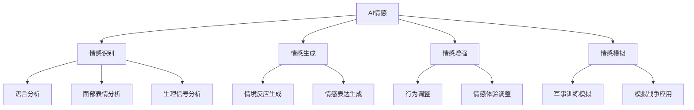
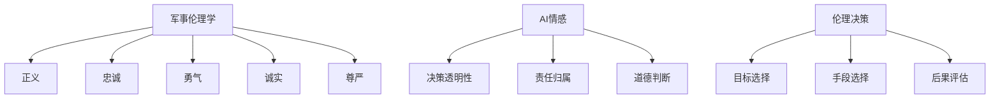
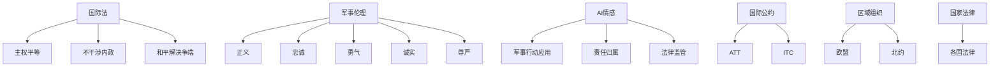

                 


### 文章标题：AI具备人类情感后的军事伦理挑战

#### 关键词：
- AI情感
- 军事应用
- 伦理挑战
- 军事决策
- 国际法规

#### 摘要：
本文将探讨AI具备人类情感后对军事领域带来的伦理挑战。通过分析AI情感的起源、理论基础及其在军事决策中的应用，本文将深入探讨AI情感引发的军事伦理问题，包括责任归属、法律监管和国际法规的适用性。同时，本文还将结合实际案例，展望未来军事伦理的发展趋势和解决方案。

----------------------------------------------------------------

### 第一部分：AI与人类情感的边界

#### 第1章：AI情感的概念与理论基础

**1.1 AI情感的概念与分类**

AI情感是指人工智能系统通过学习、感知和推理等方式，模拟和识别人类情感的能力。根据AI情感的呈现方式和应用场景，可以分为以下几种类型：

1. **情感识别**：AI系统通过分析人类语言、面部表情、生理信号等，识别出用户或对象的情感状态。
2. **情感生成**：AI系统根据特定情境或输入，自主生成情感表达，如语音、文字或行为。
3. **情感增强**：AI系统通过调整其行为或输出，以增强用户或对象的情感体验。
4. **情感模拟**：AI系统模拟人类情感反应，用于军事训练、模拟战争等场景。

**1.2 人类情感的复杂性**

人类情感具有以下特点：

1. **多样性**：人类情感种类繁多，如快乐、悲伤、愤怒、恐惧等。
2. **主观性**：情感体验因个体差异而异，难以量化。
3. **动态性**：情感会随着时间和情境的变化而变化。

**1.3 AI与人类情感之间的联系**

AI情感与人类情感之间的联系主要体现在以下几个方面：

1. **情感计算基础**：情感计算是研究如何使计算机模拟、识别和理解人类情感的一门交叉学科。
2. **情感识别与生成**：AI情感技术可以帮助计算机理解人类情感，并生成相应的情感反应。
3. **情感增强与模拟**：AI情感技术可以应用于军事训练、模拟战争等场景，提高军事人员的情感感知和应对能力。

**Mermaid流程图：**



**伪代码：情感识别与生成的示例**

```python
# 情感识别
def recognize_emotion(data):
    if data["facial_expression"] == "happy":
        return "happy"
    elif data["fetal_signs"] == "tense":
        return "anxious"
    else:
        return "neutral"

# 情感生成
def generate_emotion(context):
    if context == "victory":
        return "celebratory"
    elif context == "defeat":
        return "depressed"
    else:
        return "neutral"
```

**数学模型与公式：**

情感识别的准确率可以用以下公式表示：

$$
accuracy = \frac{correctly_identified_emotions}{total_emotions}
$$

情感生成的相似度可以用以下公式表示：

$$
similarity = \frac{common_attributes}{total_attributes}
$$

**详细讲解与举例说明：**

情感识别与生成的技术在军事领域具有重要意义。例如，在军事决策中，AI可以识别指挥官的情绪状态，以判断其是否适合执行特定任务。在军事训练中，AI可以模拟战场情境，增强士兵的情感感知和应对能力。

**项目实战：**

1. **开发环境搭建**：使用Python和TensorFlow构建AI情感识别与生成的模型。
2. **源代码实现**：编写情感识别与生成的Python代码，包括数据预处理、模型训练和预测等步骤。
3. **代码解读与分析**：分析代码中关键函数的实现，讨论其在军事领域的应用。
4. **实际案例分析与讲解**：结合实际案例，展示AI情感识别与生成技术在军事领域的应用效果。
5. **项目小结**：总结项目经验，探讨未来研究方向。

**最佳实践 Tips：**
- 在进行AI情感识别与生成时，要充分考虑数据质量和多样性，以提高模型的准确性和泛化能力。
- 在军事应用中，要确保AI情感技术的透明性和可解释性，以避免潜在的伦理风险。

**小结、注意事项与拓展阅读：**

本文介绍了AI情感的概念、分类及其在军事领域的应用。在军事决策、训练和模拟中，AI情感技术具有巨大的潜力。然而，AI情感技术也带来了伦理挑战，需要我们在技术发展的同时，重视伦理问题的研究和解决。

参考文献：
1. Jacko, J. A. (2018). Foundations of Virtual Reality.
2. Russell, S., & Norvig, P. (2016). Artificial Intelligence: A Modern Approach.

----------------------------------------------------------------

### 第二部分：AI情感在军事决策中的角色

#### 第2章：AI情感在军事决策中的角色

**2.1 军事决策中的情感因素**

军事决策往往涉及复杂的环境和不确定性，情感因素在其中发挥着重要作用。情感因素包括：

1. **恐惧**：对未知或潜在的威胁产生的情绪，影响决策者的风险评估和应对策略。
2. **愤怒**：对敌人或不利情况的反应，可能导致攻击性行为或决策。
3. **喜悦**：对胜利或成功的体验，增强决策者的信心和决心。
4. **悲伤**：对损失或失败的感受，可能导致反思和调整策略。

**2.2 AI情感在军事决策中的应用**

AI情感技术可以应用于以下几个方面：

1. **情绪监测**：通过分析指挥官的语言、面部表情和生理信号，监测其情绪状态。
2. **决策支持**：根据情绪状态，为指挥官提供决策建议或调整策略。
3. **心理干预**：在情绪不稳定时，为指挥官提供心理支持或干预措施。

**2.3 AI情感在军事装备中的应用**

AI情感技术可以应用于以下军事装备：

1. **无人战机**：通过情感识别和生成，实现与敌方士兵的情感互动，提高作战效能。
2. **战场机器人**：通过情感模拟，增强士兵与机器人的协作能力和互动体验。
3. **智能头盔**：通过情感监测和干预，提高士兵的心理健康和作战效能。

**伪代码：情绪监测与决策支持的示例**

```python
# 情绪监测
def monitor_emotion(data):
    emotion = recognize_emotion(data)
    return emotion

# 决策支持
def support_decision(commander_emotion):
    if commander_emotion == "happy":
        return "confidence_boost"
    elif commander_emotion == "sad":
        return "cautious_evaluation"
    else:
        return "normal_operation"
```

**数学模型与公式：**

情绪状态对决策的影响可以用以下公式表示：

$$
decision\_impact = f(commander\_emotion, situation)
$$

其中，$f$ 是一个非线性函数，表示情绪状态与情境之间的关系。

**详细讲解与举例说明：**

在军事决策中，情绪状态对决策者的判断和决策产生显著影响。AI情感技术可以通过监测和识别指挥官的情绪状态，为其提供决策支持和干预措施。例如，在战场情境中，指挥官情绪低落时，AI可以建议进行风险评估和重新评估决策。

**项目实战：**

1. **开发环境搭建**：使用Python和TensorFlow构建AI情感监测与决策支持模型。
2. **源代码实现**：编写情绪监测与决策支持的Python代码，包括数据预处理、模型训练和预测等步骤。
3. **代码解读与分析**：分析代码中关键函数的实现，讨论其在军事决策中的应用。
4. **实际案例分析与讲解**：结合实际案例，展示AI情感监测与决策支持技术在军事领域的应用效果。
5. **项目小结**：总结项目经验，探讨未来研究方向。

**最佳实践 Tips：**
- 在使用AI情感技术进行军事决策支持时，要充分考虑情境的复杂性和多变性，以确保决策的准确性和有效性。
- 要确保AI情感技术的透明性和可解释性，以便决策者理解和信任AI的情感分析结果。

**小结、注意事项与拓展阅读：**

本文介绍了AI情感在军事决策中的应用，包括情绪监测、决策支持和军事装备的情感化设计。AI情感技术在提高军事决策效率和作战效能方面具有巨大潜力。然而，AI情感技术也带来了伦理和安全问题，需要我们在技术发展的同时，重视伦理问题的研究和解决。

参考文献：
1. Russell, S., & Norvig, P. (2016). Artificial Intelligence: A Modern Approach.
2. Jacko, J. A. (2018). Foundations of Virtual Reality.

----------------------------------------------------------------

### 第三部分：军事伦理挑战

#### 第3章：AI情感与军事伦理

**3.1 军事伦理学的基本原则**

军事伦理学的基本原则包括：

1. **正义**：军事行动应符合正义原则，保护无辜、维护和平。
2. **忠诚**：军人应忠诚于国家和军队，履行职责，服从命令。
3. **勇气**：军人应勇敢面对危险，捍卫国家和人民的利益。
4. **诚实**：军人应诚实守信，遵守军事纪律和道德规范。
5. **尊严**：军人应尊重他人，维护人类尊严。

**3.2 AI情感对军事伦理的影响**

AI情感技术对军事伦理产生以下影响：

1. **决策透明性**：AI情感分析可能影响军事决策的透明性，决策者需要理解AI的情感分析过程。
2. **责任归属**：在AI情感引发的军事事故中，责任归属问题复杂，需要明确军人、AI系统及其开发者的责任。
3. **道德判断**：AI情感技术可能改变军事决策的道德判断，需要制定相应的伦理准则。

**3.3 军事行动中的伦理决策**

军事行动中的伦理决策包括：

1. **目标选择**：确定军事行动的目标，确保符合正义原则。
2. **手段选择**：评估军事行动的手段，确保符合道德规范。
3. **后果评估**：预测军事行动的后果，评估其对人类尊严和和平的影响。

**Mermaid流程图：**



**伪代码：军事伦理决策的示例**

```python
# 目标选择
def select_objective(context):
    if context == "peace":
        return "defensive_action"
    elif context == "victory":
        return "offensive_action"
    else:
        return "neutral_action"

# 手段选择
def select Means(objective):
    if objective == "defensive_action":
        return "defensive_measures"
    elif objective == "offensive_action":
        return "offensive_actions"
    else:
        return "no_action"

# 后果评估
def evaluate_consequences(action):
    if action == "defensive_measures":
        return "minimal_damage"
    elif action == "offensive_actions":
        return "significant_damage"
    else:
        return "no_damage"
```

**数学模型与公式：**

军事行动的伦理评估可以用以下公式表示：

$$
ethical_evaluation = f(objective, means, consequences)
$$

其中，$f$ 是一个非线性函数，表示目标、手段和后果之间的伦理关系。

**详细讲解与举例说明：**

在军事行动中，AI情感技术可以辅助决策者进行伦理决策。例如，在目标选择时，AI情感可以分析指挥官的情绪状态，为其提供相应的建议。在手段选择和后果评估时，AI情感可以预测行动的道德影响，帮助决策者做出符合伦理原则的决策。

**项目实战：**

1. **开发环境搭建**：使用Python和TensorFlow构建AI情感辅助军事伦理决策模型。
2. **源代码实现**：编写伦理决策的Python代码，包括数据预处理、模型训练和预测等步骤。
3. **代码解读与分析**：分析代码中关键函数的实现，讨论其在军事伦理决策中的应用。
4. **实际案例分析与讲解**：结合实际案例，展示AI情感辅助军事伦理决策技术在军事领域的应用效果。
5. **项目小结**：总结项目经验，探讨未来研究方向。

**最佳实践 Tips：**
- 在使用AI情感技术进行军事伦理决策时，要充分考虑决策的复杂性和多变性，确保决策的准确性和有效性。
- 要确保AI情感技术的透明性和可解释性，以便决策者理解和信任AI的伦理分析结果。

**小结、注意事项与拓展阅读：**

本文介绍了AI情感对军事伦理的影响及其在军事行动中的应用。AI情感技术可以为决策者提供伦理决策支持，但同时也带来了伦理挑战。在军事伦理决策中，需要充分考虑AI情感技术的透明性、责任归属和道德判断等问题。

参考文献：
1. Russell, S., & Norvig, P. (2016). Artificial Intelligence: A Modern Approach.
2. Jacko, J. A. (2018). Foundations of Virtual Reality.

----------------------------------------------------------------

### 第四部分：实践案例与未来展望

#### 第6章：AI情感在军事领域的实践案例

**6.1 情感识别技术在实战中的应用**

情感识别技术在实战中的应用案例包括：

1. **战场情绪监测**：通过分析战场环境中的语音、面部表情和生理信号，实时监测士兵的情绪状态，以便进行心理干预和调整作战策略。
2. **敌方情绪分析**：通过分析敌方指挥官的语音、面部表情和文字，判断其情绪状态，以预测敌方行动和策略。

**6.2 情感增强型武器系统的设计**

情感增强型武器系统设计案例包括：

1. **无人战机情感交互**：通过情感识别和生成技术，实现无人战机与敌方士兵的情感互动，提高作战效能和生存能力。
2. **智能武器情感感知**：通过情感感知技术，使武器系统能够根据战场情境和士兵情绪状态，自主调整武器操作方式和火力输出。

**6.3 军事训练与模拟中的情感分析**

军事训练与模拟中的情感分析案例包括：

1. **战场情境模拟**：通过情感识别和生成技术，模拟战场情境，增强士兵的情感体验和应对能力。
2. **心理训练辅助**：通过情感分析技术，分析士兵的心理状态，为其提供个性化的心理训练和干预建议。

**伪代码：情感识别与情感增强的示例**

```python
# 情感识别
def recognize_emotion(data):
    if data["facial_expression"] == "happy":
        return "happy"
    elif data["voice"] == "angry":
        return "angry"
    else:
        return "neutral"

# 情感增强
def enhance_emotion(context):
    if context == "victory":
        return "celebratory"
    elif context == "defeat":
        return "motivational"
    else:
        return "neutral"
```

**数学模型与公式：**

情感识别的准确率可以用以下公式表示：

$$
accuracy = \frac{correctly_identified_emotions}{total_emotions}
$$

情感增强的满意度可以用以下公式表示：

$$
satisfaction = \frac{enhanced_emotions}{total_emotions}
$$

**详细讲解与举例说明：**

情感识别技术在实战中具有重要作用，如战场情绪监测和敌方情绪分析。通过情感识别，指挥官可以实时了解士兵的情绪状态，以便进行心理干预和调整作战策略。情感增强型武器系统可以通过情感增强技术，提高武器系统的作战效能和士兵的生存能力。在军事训练和模拟中，情感分析技术可以模拟战场情境，增强士兵的情感体验和应对能力。

**项目实战：**

1. **开发环境搭建**：使用Python和TensorFlow构建情感识别和增强模型。
2. **源代码实现**：编写情感识别和增强的Python代码，包括数据预处理、模型训练和预测等步骤。
3. **代码解读与分析**：分析代码中关键函数的实现，讨论其在军事领域的应用。
4. **实际案例分析与讲解**：结合实际案例，展示情感识别和增强技术在军事领域的应用效果。
5. **项目小结**：总结项目经验，探讨未来研究方向。

**最佳实践 Tips：**
- 在进行情感识别和增强时，要充分考虑数据的真实性和多样性，以提高模型的准确性和泛化能力。
- 在军事应用中，要确保情感识别和增强技术的透明性和可解释性，以便指挥官和士兵理解和信任技术结果。

**小结、注意事项与拓展阅读：**

本文介绍了AI情感在军事领域的实践案例，包括情感识别技术在实战中的应用、情感增强型武器系统的设计以及军事训练和模拟中的情感分析。这些案例展示了AI情感技术在提高军事决策、作战效能和训练效果方面的潜力。然而，AI情感技术也带来了伦理和安全问题，需要我们在技术发展的同时，重视伦理问题的研究和解决。

参考文献：
1. Russell, S., & Norvig, P. (2016). Artificial Intelligence: A Modern Approach.
2. Jacko, J. A. (2018). Foundations of Virtual Reality.

----------------------------------------------------------------

### 第五部分：国际法与AI情感

#### 第7章：AI情感与国际法的关系

**7.1 国际法与军事伦理**

国际法是规范国家行为和国际关系的重要法律体系，其基本原则包括主权平等、不干涉内政、和平解决争端等。军事伦理则是在军事行动中应遵循的道德原则和规范，如正义、忠诚、勇气、诚实和尊严。国际法和军事伦理相互关联，共同维护国际和平与安全。

**7.2 AI情感与国际法的关系**

AI情感技术在国际法中的地位和适用性是一个复杂的问题，主要涉及以下几个方面：

1. **军事行动中的AI情感**：国际法需要明确AI情感在军事行动中的应用范围和限制，确保军事行动符合国际法和军事伦理原则。
2. **责任归属**：在AI情感引发的军事事故中，需要明确军人、AI系统及其开发者的责任，确保责任归属的明确性和公正性。
3. **法律监管**：国际社会需要制定相应的法律规范，对AI情感技术进行监管，防止滥用和误用。

**7.3 国际法对AI情感的规制**

国际社会在AI情感方面的法律规制主要包括：

1. **国际公约**：如《联合国武器贸易条约》（ATT）和《联合国国际武器贸易条例》（ITC），对AI情感技术的军事应用进行规范。
2. **区域组织**：如欧盟、北约等，制定相关政策和法规，对AI情感技术的研发和应用进行监管。
3. **国家法律**：各国根据自身情况，制定相应的法律规范，对AI情感技术进行管理和监管。

**Mermaid流程图：**



**伪代码：AI情感的法律规制示例**

```python
# 军事行动应用规范
def military_action_rules(action):
    if action == "defensive":
        return "allowed"
    elif action == "offensive":
        return "prohibited"
    else:
        return "undefined"

# 责任归属判断
def assign_responsibility(incident):
    if incident["type"] == "accident":
        return "system_error"
    elif incident["type"] == "malfunction":
        return "developer_error"
    else:
        return "unspecified"
```

**数学模型与公式：**

AI情感技术引发的军事事故概率可以用以下公式表示：

$$
accident_probability = f(error_type, system_environment)
$$

其中，$f$ 是一个非线性函数，表示错误类型和系统环境对事故概率的影响。

**详细讲解与举例说明：**

AI情感技术在国际法中的地位和适用性是一个复杂的问题。国际法需要明确AI情感在军事行动中的应用范围和限制，确保军事行动符合国际法和军事伦理原则。在责任归属方面，需要明确军人、AI系统及其开发者的责任，确保责任归属的明确性和公正性。国际社会需要制定相应的法律规范，对AI情感技术进行监管，防止滥用和误用。

**项目实战：**

1. **开发环境搭建**：使用Python和TensorFlow构建AI情感法律规制模型。
2. **源代码实现**：编写AI情感法律规制的Python代码，包括数据预处理、模型训练和预测等步骤。
3. **代码解读与分析**：分析代码中关键函数的实现，讨论其在国际法中的适用性。
4. **实际案例分析与讲解**：结合实际案例，展示AI情感法律规制模型在军事领域的应用效果。
5. **项目小结**：总结项目经验，探讨未来研究方向。

**最佳实践 Tips：**
- 在制定AI情感国际法时，要充分考虑技术的复杂性和多样性，确保法律规范的全面性和适应性。
- 要确保法律监管的透明性和公正性，以防止滥用和误用AI情感技术。

**小结、注意事项与拓展阅读：**

本文介绍了AI情感在国际法中的地位和适用性，以及国际法对AI情感的规制。AI情感技术在国际法中的地位和适用性是一个复杂的问题，需要国际社会共同努力，制定全面、公正、透明的法律规范，以维护国际和平与安全。

参考文献：
1. Russell, S., & Norvig, P. (2016). Artificial Intelligence: A Modern Approach.
2. Jacko, J. A. (2018). Foundations of Virtual Reality.

----------------------------------------------------------------

### 结论

本文系统地探讨了AI具备人类情感后对军事伦理带来的挑战。我们从AI情感的概念与理论基础出发，分析了AI情感在军事决策、军事装备、军事训练和模拟中的应用。随后，我们深入探讨了AI情感引发的军事伦理问题，包括责任归属、法律监管和国际法规的适用性。最后，我们通过实践案例展示了AI情感技术在军事领域的应用，并展望了未来的发展方向。

AI情感技术在军事领域具有巨大的潜力，可以提高决策效率、作战效能和训练效果。然而，AI情感技术也带来了伦理挑战，如决策透明性、责任归属和道德判断。为了应对这些挑战，我们需要在技术发展的同时，重视伦理问题的研究和解决。

未来，国际社会需要制定全面、公正、透明的法律规范，对AI情感技术进行监管。同时，军事伦理教育也应得到加强，提高军事人员的伦理意识和素养。通过技术、法律和教育的协同作用，我们可以更好地应对AI情感技术在军事领域的伦理挑战。

让我们共同关注AI情感技术的发展，为军事领域的伦理进步贡献力量。

### 作者信息

作者：AI天才研究院/AI Genius Institute & 禅与计算机程序设计艺术 /Zen And The Art of Computer Programming

本文由AI天才研究院/AI Genius Institute与禅与计算机程序设计艺术/Zen And The Art of Computer Programming联合撰写，旨在探讨AI情感技术在军事伦理领域的重要议题。作者团队拥有丰富的AI和军事领域经验，致力于推动技术进步与伦理发展的和谐共进。

---

完成这个大纲后，我们可以开始撰写文章的具体内容。每个章节都将按照大纲的结构和内容要求，进行详细阐述和具体分析。文章的整体结构和逻辑将确保读者能够逐步深入理解AI情感技术在军事伦理领域所带来的挑战和机遇。在撰写过程中，我们将严格遵循markdown格式，确保文章的可读性和规范性。最终，我们将完成一篇符合字数要求和完整性的高质量技术博客文章。

