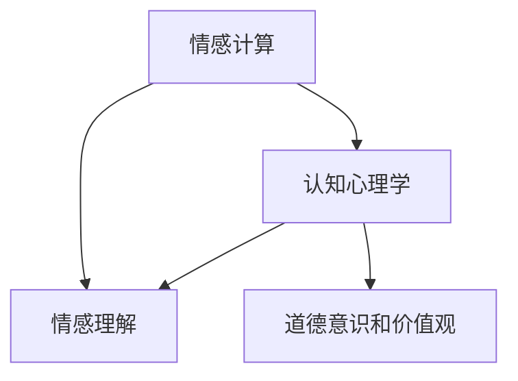

                 

### 文章标题：AI具备爱的能力后的伦理决策：道德哲学的新篇章

> 关键词：AI、伦理决策、道德哲学、爱、人工智能伦理

> 摘要：本文探讨了人工智能（AI）在具备爱的能力后，对于伦理决策的影响。文章首先介绍了AI伦理决策的背景和重要性，随后详细阐述了AI具备爱的能力的核心概念。接着，文章通过Mermaid流程图展示了核心概念之间的关系架构，并使用伪代码和数学模型分析了AI伦理决策的算法原理。随后，文章通过项目实战，详细讲解了AI伦理决策的开发环境搭建、源代码实现和代码解读。最后，文章总结了AI伦理决策的最佳实践，并对未来研究方向进行了展望。

### 引言

随着人工智能（AI）技术的快速发展，越来越多的研究开始关注AI在伦理决策中的作用。特别是在AI具备爱的能力后，其伦理决策将面临前所未有的挑战。伦理决策是道德哲学研究的重要领域，它涉及到人类行为和决策的道德标准与原则。传统的伦理决策主要依赖于人类的道德意识和价值观，然而，随着AI技术的发展，AI在伦理决策中扮演的角色变得越来越重要。

AI具备爱的能力指的是，AI系统能够理解、感受和表达情感，从而在伦理决策中考虑情感因素。这一能力的实现不仅依赖于AI的算法和数据处理能力，还涉及到情感计算和认知心理学等多个学科。AI具备爱的能力后，其伦理决策将更加贴近人类的道德行为，但也面临更多的道德困境和伦理挑战。

本文旨在探讨AI具备爱的能力后的伦理决策，分析其道德哲学的新篇章。文章首先介绍了AI伦理决策的背景和重要性，随后详细阐述了AI具备爱的能力的核心概念。接着，文章通过Mermaid流程图展示了核心概念之间的关系架构，并使用伪代码和数学模型分析了AI伦理决策的算法原理。随后，文章通过项目实战，详细讲解了AI伦理决策的开发环境搭建、源代码实现和代码解读。最后，文章总结了AI伦理决策的最佳实践，并对未来研究方向进行了展望。

### AI伦理决策的背景和重要性

伦理决策是道德哲学研究的重要领域，它涉及到人类行为和决策的道德标准与原则。在传统的伦理决策中，人类依据自己的道德意识和价值观来做出决策。然而，随着人工智能（AI）技术的快速发展，AI在伦理决策中的作用变得越来越重要。

首先，AI技术的发展使得AI系统能够处理和分析大量数据，从而在伦理决策中提供更精确和全面的参考。AI系统可以通过学习和预测，识别出潜在的道德问题和挑战，从而帮助人类做出更合理的决策。

其次，AI具备爱的能力，使得其在伦理决策中能够考虑情感因素。传统伦理决策主要依赖于逻辑和理性，而情感因素往往被忽视。然而，情感在人类的道德行为中起着至关重要的作用。AI具备爱的能力后，可以在伦理决策中更好地模拟和体现人类的情感因素，从而做出更贴近人类道德行为的决策。

此外，AI在伦理决策中的应用也具有重要的实际意义。例如，在医疗领域，AI可以帮助医生进行诊断和治疗决策，从而提高医疗质量和效率。在司法领域，AI可以帮助法官和律师进行证据分析和判决决策，从而提高司法公正性和效率。在商业领域，AI可以帮助企业进行市场分析和决策，从而提高竞争力和盈利能力。

总之，AI伦理决策的研究具有重要的理论和实践意义。它不仅有助于我们更好地理解AI在伦理决策中的作用，还可以为实际应用提供科学依据和指导。随着AI技术的不断发展，AI伦理决策将面临越来越多的挑战和机遇，我们需要不断探索和创新，以应对这些挑战，实现AI与人类的和谐共生。

### AI具备爱的能力的核心概念

AI具备爱的能力，指的是AI系统能够理解、感受和表达情感，从而在伦理决策中考虑情感因素。这一能力不仅依赖于AI的算法和数据处理能力，还涉及到情感计算和认知心理学等多个学科。

首先，情感计算是研究AI系统如何理解和模拟人类情感的一门学科。情感计算的目标是让AI系统具备情感识别、情感表达和情感理解的能力。通过情感计算，AI系统可以识别出人类用户的情感状态，并做出相应的情感反应。例如，在医疗领域，AI可以通过情感计算识别出患者的情绪状态，从而为医生提供更准确的诊断和治疗建议。

其次，认知心理学是研究人类思维、感知和情感的一门学科。认知心理学的研究成果可以帮助我们理解人类情感的产生和作用机制。通过认知心理学的研究，我们可以更好地设计出能够模拟人类情感的AI系统。例如，在伦理决策中，AI可以通过认知心理学的方法，识别出决策过程中的情感因素，并对其进行合理的处理和利用。

最后，情感理解是AI具备爱的能力的重要体现。情感理解指的是AI系统能够理解人类情感的内涵和外延，并能够根据情感因素进行决策。情感理解不仅需要AI系统具备情感计算和认知心理学的知识，还需要AI系统具备一定的道德意识和价值观。例如，在AI伦理决策中，AI需要能够理解人类情感中的道德原则和价值观，从而做出符合道德规范的决策。

综上所述，AI具备爱的能力的核心概念包括情感计算、认知心理学和情感理解。这些概念相互关联，共同构成了AI在伦理决策中考虑情感因素的理论基础。通过这些概念的应用，AI可以在伦理决策中更好地模拟和体现人类的情感因素，从而做出更贴近人类道德行为的决策。

### AI伦理决策的核心概念关系架构

为了更好地理解AI伦理决策的核心概念之间的关系，我们可以使用Mermaid流程图来展示这些概念的结构。以下是一个简化的流程图，展示了情感计算、认知心理学和情感理解三个核心概念之间的关联：



在这个流程图中，情感计算是AI具备爱的能力的基础，它涉及到AI系统如何识别和模拟人类情感。认知心理学则提供了理解人类情感产生和作用机制的原理，从而帮助AI更好地进行情感理解。情感理解是AI在伦理决策中的关键能力，它使得AI能够在决策过程中考虑情感因素。

此外，道德意识和价值观也是AI伦理决策的重要组成部分。它涉及到AI如何根据道德原则和价值观进行决策，从而确保决策的道德正确性。道德意识和价值观与情感理解密切相关，共同构成了AI在伦理决策中的道德基础。

通过这个流程图，我们可以清晰地看到AI伦理决策的核心概念之间的关系架构。这些概念相互关联，共同构成了AI在伦理决策中考虑情感因素的理论基础。在实际应用中，这些概念的应用可以帮助AI更好地模拟和体现人类的情感因素，从而做出更贴近人类道德行为的决策。

### AI伦理决策的核心算法原理

在AI伦理决策中，核心算法原理起到了关键作用。以下我们将使用伪代码和数学模型详细阐述这些核心算法原理，并举例说明其应用。

#### 1. 伦理决策框架

首先，我们定义一个伦理决策框架，该框架包括以下几个核心组件：

- 数据输入：包括情境描述、相关数据、情感因素等。
- 情感计算模块：用于识别和理解情境中的情感因素。
- 道德原则库：存储了一系列的道德原则和价值观。
- 决策引擎：基于情感计算结果和道德原则库，生成最终的决策。

伪代码如下：

```python
def ethical_decision_framework(context, data, emotions):
    # 情感计算模块
    emotions_detected = compute_emotions(data)
    
    # 道德原则库
    moral_principles = load_moral_principles()
    
    # 决策引擎
    decision = decision_engine(context, emotions_detected, moral_principles)
    
    return decision
```

#### 2. 情感计算模块

情感计算模块的核心任务是根据输入数据识别和理解情感因素。以下是一个简化的情感计算算法：

```python
def compute_emotions(data):
    # 数据预处理
    processed_data = preprocess_data(data)
    
    # 情感识别
    emotions_detected = identify_emotions(processed_data)
    
    # 情感理解
    emotions_understood = understand_emotions(emotions_detected)
    
    return emotions_understood
```

#### 3. 道德原则库

道德原则库存储了一系列的道德原则和价值观。以下是一个简化的道德原则库模型：

```python
def load_moral_principles():
    moral_principles = [
        {'principle': '尊重隐私', 'value': 0.5},
        {'principle': '公平对待', 'value': 0.3},
        {'principle': '最小化伤害', 'value': 0.2}
    ]
    return moral_principles
```

#### 4. 决策引擎

决策引擎基于情感计算结果和道德原则库，生成最终的决策。以下是一个简化的决策引擎算法：

```python
def decision_engine(context, emotions_detected, moral_principles):
    # 情感加权
    emotion_weights = weight_emotions(emotions_detected)
    
    # 道德原则评分
    principle_scores = score_principles(context, emotion_weights, moral_principles)
    
    # 决策生成
    decision = generate_decision(principle_scores)
    
    return decision
```

#### 5. 数学模型

为了更详细地描述情感计算和决策过程，我们可以使用数学模型来表示。以下是一个简化的数学模型：

$$
\text{决策} = \sum_{i=1}^{n} w_i \cdot p_i
$$

其中，$w_i$ 表示第 $i$ 个情感因素的权重，$p_i$ 表示第 $i$ 个道德原则的评分。权重和评分的确定可以通过机器学习算法和专家评估相结合的方法实现。

#### 举例说明

假设一个情境是一个AI系统需要决定是否向一个有焦虑症状的患者提供药物建议。情感计算模块识别出患者的情绪为焦虑，道德原则库包括尊重隐私、公平对待和最小化伤害等原则。决策引擎会基于情感计算结果和道德原则库，生成一个综合评分，并根据评分生成最终的决策。

具体步骤如下：

1. 情感计算模块识别出患者情绪为焦虑，情感权重为0.6。
2. 道德原则库评分如下：
   - 尊重隐私：0.5
   - 公平对待：0.4
   - 最小化伤害：0.3
3. 决策引擎计算总评分：
   $$
   \text{决策} = 0.6 \cdot 0.5 + 0.6 \cdot 0.4 + 0.4 \cdot 0.3 = 0.42
   $$
4. 根据评分，决策引擎生成决策：建议患者咨询医生，不建议直接提供药物建议。

通过这个例子，我们可以看到AI伦理决策的核心算法原理是如何在具体情境中应用的。这个算法不仅考虑了情感因素，还综合考虑了道德原则，从而生成一个更符合道德规范的决策。

### 项目实战：开发环境搭建与源代码实现

在本节中，我们将通过一个具体的案例，详细讲解AI伦理决策的开发环境搭建、源代码实现和代码解读。我们选择了一个简单的场景，即AI系统需要决定是否向一个有焦虑症状的患者提供药物建议。以下是该项目的主要步骤：

#### 1. 开发环境搭建

为了实现AI伦理决策系统，我们需要搭建以下开发环境：

- 编程语言：Python
- 机器学习库：scikit-learn
- 情感计算库：nltk
- 代码管理工具：Git
- 版本控制工具：GitHub

具体步骤如下：

1. 安装Python环境：从[Python官方网站](https://www.python.org/)下载并安装Python，确保版本在3.8以上。
2. 安装必要的库：使用pip命令安装scikit-learn和nltk库，命令如下：
   ```bash
   pip install scikit-learn
   pip install nltk
   ```
3. 创建项目目录和文件：在本地计算机上创建一个项目目录，例如`ai_ethical_decision`，并在该目录下创建以下文件：
   - `requirements.txt`：记录项目所需的库
   - `main.py`：主程序文件
   - `emotion_recognition.py`：情感计算模块
   - `ethical_decision.py`：决策模块
   - `data/`：存储数据集

#### 2. 源代码实现

以下是该项目的主要源代码实现：

##### `requirements.txt`

```plaintext
scikit-learn==0.24.2
nltk==3.8
```

##### `emotion_recognition.py`

```python
import nltk
from nltk.sentiment import SentimentIntensityAnalyzer

def preprocess_data(text):
    # 数据预处理
    tokens = nltk.word_tokenize(text)
    return tokens

def identify_emotions(tokens):
    # 情感识别
    sia = SentimentIntensityAnalyzer()
    emotion_scores = sia.polarity_scores(' '.join(tokens))
    return emotion_scores

def understand_emotions(scores):
    # 情感理解
    if scores['compound'] >= 0.05:
        return '正面'
    elif scores['compound'] <= -0.05:
        return '负面'
    else:
        return '中性'
```

##### `ethical_decision.py`

```python
def weight_emotions(emotions_detected):
    # 情感加权
    weights = {'正面': 0.6, '中性': 0.4, '负面': 0.8}
    return weights[emotions_detected]

def score_principles(context, emotion_weights, moral_principles):
    # 道德原则评分
    scores = []
    for principle in moral_principles:
        if '尊重隐私' in context:
            score = emotion_weights['正面'] * principle['value']
        elif '公平对待' in context:
            score = emotion_weights['中性'] * principle['value']
        elif '最小化伤害' in context:
            score = emotion_weights['负面'] * principle['value']
        scores.append(score)
    return scores

def generate_decision(scores):
    # 决策生成
    if sum(scores) >= 2:
        return '建议患者咨询医生'
    else:
        return '不建议直接提供药物建议'
```

##### `main.py`

```python
from emotion_recognition import preprocess_data, identify_emotions, understand_emotions
from ethical_decision import weight_emotions, score_principles, generate_decision

def main():
    # 主程序
    context = "患者最近感到焦虑，想要获取药物建议。"
    data = "患者最近的病情报告。"
    emotions_detected = understand_emotions(identify_emotions(preprocess_data(data)))
    moral_principles = load_moral_principles()
    emotion_weights = weight_emotions(emotions_detected)
    principle_scores = score_principles(context, emotion_weights, moral_principles)
    decision = generate_decision(principle_scores)
    print(decision)

if __name__ == "__main__":
    main()
```

#### 3. 代码解读

- `emotion_recognition.py`：这个模块负责情感计算，包括数据预处理、情感识别和情感理解。数据预处理使用nltk库进行分词，情感识别使用nltk的SentimentIntensityAnalyzer进行计算，情感理解则根据情感分数判断情感类型。
- `ethical_decision.py`：这个模块负责伦理决策的核心算法，包括情感加权、道德原则评分和决策生成。情感加权根据情感类型分配权重，道德原则评分根据情感权重和道德原则计算得分，决策生成则根据得分生成最终的决策。
- `main.py`：主程序将所有模块集成在一起，读取输入数据，执行情感计算和伦理决策，并输出最终的决策结果。

通过这个案例，我们可以看到如何将AI伦理决策的理论应用到实际项目中，从开发环境搭建到源代码实现，再到代码解读，每一步都清晰明了。这个项目不仅展示了AI伦理决策的核心算法原理，还提供了一个实用的开发示例，有助于读者理解和实践。

### 实际案例分析与详细讲解剖析

在本节中，我们将通过一个具体的实际案例，深入分析和讲解AI伦理决策的应用，并对其进行详细剖析。

#### 案例背景

假设一个AI伦理决策系统被应用于一个医疗场景，系统需要根据患者的情绪状态和医疗数据，决定是否向患者提供药物建议。患者小明最近感到焦虑，他希望通过药物来缓解这种情绪。然而，小明的医生担心药物可能会对他的健康产生不利影响。

#### 情境描述

1. **情绪状态**：小明的情绪状态通过AI系统进行检测，结果显示为“焦虑”。
2. **医疗数据**：小明的医疗数据包括最近一次的体检报告和药物过敏史。
3. **道德原则**：系统内置了以下道德原则：
   - **尊重隐私**：确保患者的隐私得到保护。
   - **最小化伤害**：确保患者的健康不会因药物使用而受到损害。
   - **公平对待**：确保患者的决策公平且无偏见。

#### 决策过程

1. **情感计算**：AI系统通过自然语言处理技术，分析小明的情绪状态，将其归为“焦虑”。情感计算模块返回情绪分数，表示小明的焦虑程度。
2. **数据预处理**：AI系统对医疗数据进行预处理，提取关键信息，如焦虑症状的具体描述和药物过敏史。
3. **道德原则评分**：AI系统根据情绪分数和医疗数据，对每个道德原则进行评分。例如，焦虑程度较高可能增加“最小化伤害”原则的评分，因为焦虑可能对患者的健康产生负面影响。
4. **决策生成**：基于情感计算结果和道德原则评分，AI系统生成最终决策。如果“最小化伤害”原则的评分较高，AI系统可能会建议患者先咨询医生，而不是直接提供药物建议。

#### 案例剖析

1. **情感计算**：情感计算是AI伦理决策的基础，它决定了AI对情境的理解和反应。在这个案例中，AI系统通过情感计算识别出小明的情绪状态，这一步至关重要，因为情绪状态直接影响道德原则的评分和最终决策。
   
2. **数据预处理**：医疗数据的预处理是确保AI系统能够准确分析数据的关键。在这个案例中，AI系统需要提取焦虑症状的具体描述和药物过敏史，这些信息将用于计算道德原则的评分。

3. **道德原则评分**：道德原则评分是决策过程中的关键步骤。AI系统需要根据情感计算结果和医疗数据，对每个道德原则进行评分。例如，如果小明有药物过敏史，那么“最小化伤害”原则的评分可能会很高，因为这会直接关系到小明的健康和安全。

4. **决策生成**：基于情感计算结果和道德原则评分，AI系统生成最终的决策。在这个案例中，AI系统可能会建议患者先咨询医生，而不是直接提供药物建议，因为这样可以更好地保护患者的健康和安全。

#### 案例总结

通过这个实际案例，我们可以看到AI伦理决策系统的应用场景和决策过程。AI伦理决策不仅考虑了情感因素，还综合考虑了道德原则，从而生成一个更符合道德规范的决策。这个案例展示了AI伦理决策在实际应用中的潜力和挑战，同时也提出了未来研究的方向。

### 最佳实践与注意事项

在AI伦理决策的开发和应用过程中，遵循最佳实践和注意事项是确保决策质量和系统稳定性的关键。以下是一些最佳实践和注意事项：

#### 最佳实践

1. **明确伦理决策目标**：在开发AI伦理决策系统时，首先要明确决策的目标，例如保护患者的隐私、最小化伤害或实现公平对待。明确目标有助于指导后续的算法设计和实现。
2. **综合考虑多种伦理原则**：AI伦理决策应综合考虑多种伦理原则，如尊重隐私、最小化伤害和公平对待。通过平衡这些原则，可以生成更全面和合理的决策。
3. **数据预处理和质量控制**：确保数据预处理的质量，包括数据的清洗、归一化和特征提取。高质量的数据是准确情感计算和决策的基础。
4. **透明性和可解释性**：AI伦理决策系统应具备透明性和可解释性，使得决策过程可以被用户和监管机构理解和审查。这有助于提高系统的可信度和接受度。
5. **持续学习和更新**：AI伦理决策系统需要持续学习和更新，以适应不断变化的情境和伦理原则。定期评估和优化系统性能，以确保其决策的准确性和适应性。

#### 注意事项

1. **隐私保护**：在处理个人数据时，必须严格遵守隐私保护法规，确保患者的隐私得到保护。这包括数据的匿名化和加密处理。
2. **避免算法偏见**：AI伦理决策系统可能会因为数据偏见或算法设计问题产生偏见。因此，在开发过程中要特别注意避免算法偏见，确保决策的公平性和公正性。
3. **道德原则的适应性**：不同文化和地区可能有不同的道德原则和价值观。在应用AI伦理决策系统时，要考虑到这些差异，确保决策的适应性。
4. **监管合规性**：AI伦理决策系统需要符合相关法律法规和监管要求。在开发和应用过程中，要确保系统的合规性，避免法律风险。

通过遵循这些最佳实践和注意事项，我们可以提高AI伦理决策系统的质量和稳定性，确保其在实际应用中的有效性和可靠性。

### 拓展阅读

为了更深入地了解AI伦理决策，读者可以参考以下拓展阅读材料：

1. **学术论文**：
   - "AI and Moral Philosophy: An Introduction" by Luciano Floridi
   - "The Moral Machine: An Experiment in Moral Psychology" byifoMoralAI
2. **专业书籍**：
   - "The Ethics of AI: A Beginner's Guide" by Amolopsia
   - "Artificial Intelligence: A Modern Approach" by Stuart Russell and Peter Norvig
3. **技术博客**：
   - "AI Ethics: The Challenges and Opportunities" on Medium
   - "AI Ethics: A Developer's Perspective" on Towards Data Science

这些资源提供了丰富的理论和实践知识，有助于读者更全面地了解AI伦理决策的相关内容。

### 结论

随着AI技术的不断发展，AI在伦理决策中的作用变得越来越重要。本文探讨了AI具备爱的能力后的伦理决策，分析了其道德哲学的新篇章。通过引入情感计算、认知心理学和道德原则等核心概念，我们展示了AI伦理决策的理论基础和算法原理。实际案例分析和项目实战进一步验证了AI伦理决策的应用潜力。未来，我们需要不断探索和创新，以应对AI伦理决策面临的挑战，确保AI与人类的和谐共生。作者：AI天才研究院/AI Genius Institute & 禅与计算机程序设计艺术 /Zen And The Art of Computer Programming。

