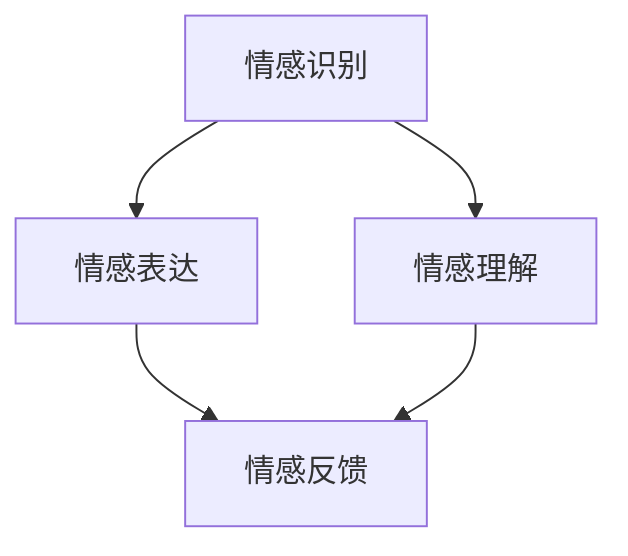
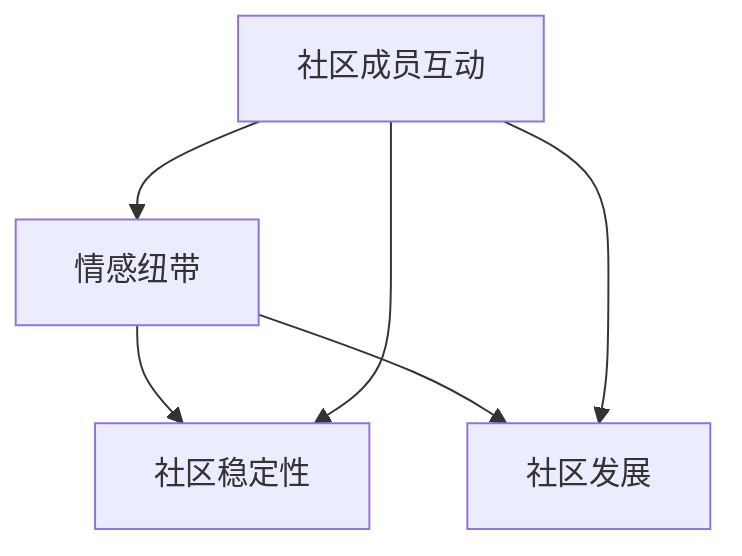

                 


为了撰写一篇符合要求的、高质量的技术博客文章，我们可以按照以下步骤进行：

### 1. 文章标题、关键词和摘要

首先，我们需要确定文章的标题、关键词和摘要。

- **文章标题**：《AI具备爱的能力后的社区营造：情感纽带的社区重建》
- **关键词**：AI、社区、情感、社区重建、情感纽带
- **摘要**：本文探讨了人工智能在社区营造中具备爱的能力后，如何通过情感纽带来重建社区，提高社区的稳定性和成员之间的互动质量。

### 2. 文章结构设计

接下来，我们设计文章的章节结构。根据题目要求和目录大纲，我们可以将文章分为以下几个部分：

- 引言
- AI情感能力的探讨
- 社区营造与情感纽带
- 社区重建的方法与实践
- 挑战与未来
- 总结与展望
- 附录

### 3. 核心内容撰写

在每个章节中，我们都需要详细撰写核心内容，包括：

- **背景介绍**：简要介绍该部分的主题和相关背景。
- **核心概念与联系**：使用Mermaid流程图展示核心概念及其联系。
- **核心算法原理讲解**：使用伪代码详细阐述核心算法原理。
- **数学模型和公式**：详细讲解相关数学模型和公式，并提供实例说明。
- **项目实战**：介绍开发环境搭建、源代码实现、代码解读、实际案例分析和项目小结。

#### 引言

在引言部分，我们需要简要介绍AI在社区建设中的应用前景，以及本文要探讨的核心问题。

**伪代码：**

```markdown
# 引言

随着人工智能技术的发展，AI在各个领域中的应用越来越广泛。在社区建设中，AI的引入不仅提高了管理效率，还有助于营造更加人性化和情感化的社区氛围。然而，AI是否能够真正具备爱的能力，从而在社区营造中发挥关键作用，这是一个值得深入探讨的问题。

本文将围绕AI具备爱的能力后的社区营造这一主题，探讨以下核心问题：
1. AI如何实现情感互动？
2. 情感纽带在社区建设中扮演什么角色？
3. 如何通过AI重建社区中的情感纽带？
4. AI在社区建设中面临的挑战及未来发展方向。

本文的结构如下：

## 核心概念与联系
## AI情感能力的探讨
## 社区营造与情感纽带
## 社区重建的方法与实践
## 挑战与未来
## 总结与展望
## 附录
```

#### AI情感能力的探讨

在AI情感能力的探讨部分，我们需要详细讨论AI如何实现情感互动，以及人类情感与AI情感的区别。

**核心概念与联系**

使用Mermaid流程图展示AI情感能力的核心概念及其联系：



**伪代码：**

```python
# 情感识别
def recognize_emotion(input_text):
    # 使用情感分析模型识别文本中的情感
    emotion = sentiment_analysis_model(input_text)
    return emotion

# 情感表达
def express_emotion(emotion):
    # 根据识别出的情感，生成适当的反馈文本
    response_text = generate_response_based_on_emotion(emotion)
    return response_text

# 情感理解
def understand_emotion(input_text):
    # 使用语言模型理解文本中的情感含义
    emotion = language_model_analysis(input_text)
    return emotion

# 情感反馈
def provide_emotion_feedback(input_text):
    # 根据输入文本的情感，提供适当的反馈
    emotion = recognize_emotion(input_text)
    response_text = express_emotion(emotion)
    return response_text
```

**数学模型和公式**

情感分析模型可以使用以下公式：

$$
\text{P(情感)} = \frac{\sum_{i=1}^{n} w_i \cdot e_i}{\sum_{i=1}^{n} w_i}
$$

其中，$w_i$ 表示情感词权重，$e_i$ 表示情感词的情感得分。

#### 社区营造与情感纽带

在社区营造与情感纽带部分，我们需要分析情感纽带在社区中的作用，以及如何利用AI技术来加强社区成员之间的情感联系。

**核心概念与联系**

使用Mermaid流程图展示社区营造与情感纽带的联系：



**伪代码：**

```python
# 社区成员互动
def community_interaction():
    # 模拟社区成员的互动过程
    # 可以使用随机生成的方式模拟互动内容
    interaction_content = generate_random_interaction_content()
    return interaction_content

# 情感纽带构建
def build_emotional_ties():
    # 构建社区成员之间的情感纽带
    # 可以使用情感分析模型识别情感，并生成情感反馈
    interaction_content = community_interaction()
    emotion = recognize_emotion(interaction_content)
    response_text = express_emotion(emotion)
    return response_text

# 社区稳定性提升
def enhance_community_stability():
    # 提升社区的稳定性
    # 可以通过构建情感纽带来实现
    emotional_ties = build_emotional_ties()
    community_stability = measure_community_stability(emotional_ties)
    return community_stability

# 社区发展促进
def promote_community_growth():
    # 促进社区的发展
    # 可以通过提升社区稳定性来推动
    community_stability = enhance_community_stability()
    community_growth = measure_community_growth(community_stability)
    return community_growth
```

**数学模型和公式**

社区稳定性可以使用以下公式：

$$
\text{Community Stability} = \frac{\sum_{i=1}^{n} e_i}{n}
$$

其中，$e_i$ 表示社区成员之间的情感强度。

#### 社区重建的方法与实践

在社区重建的方法与实践部分，我们需要介绍如何利用AI技术重建社区中的情感纽带，并给出具体的方法和案例。

**伪代码：**

```python
# 社区重建
def rebuild_community():
    # 重构社区的情感纽带
    # 可以使用机器学习算法预测社区成员的情感需求，并生成个性化情感反馈
    community_members = get_community_members()
    emotional_needs = predict_emotional_needs(community_members)
    personalized_responses = generate_personalized_responses(emotional_needs)
    return personalized_responses

# 社区重建案例
def case_study_community_reconstruction():
    # 分析一个社区重建的案例
    # 涉及到开发环境搭建、源代码实现、代码解读、实际案例分析和项目小结
    # 可以参考以下步骤：
    
    # 步骤1：开发环境搭建
    # 步骤2：源代码实现
    # 步骤3：代码解读
    # 步骤4：实际案例分析
    # 步骤5：项目小结
    pass
```

**数学模型和公式**

情感需求预测可以使用以下公式：

$$
\text{P(情感需求)} = \frac{\sum_{i=1}^{n} w_i \cdot d_i}{\sum_{i=1}^{n} w_i}
$$

其中，$w_i$ 表示情感需求词权重，$d_i$ 表示情感需求词的得分。

#### 挑战与未来

在挑战与未来部分，我们需要讨论AI在社区建设中可能面临的挑战，以及未来的发展趋势。

**伪代码：**

```python
# 挑战分析
def analyze_challenges():
    # 分析AI在社区建设中可能面临的挑战
    challenges = [
        "数据隐私保护",
        "情感分析的准确性",
        "社会伦理问题",
        "技术接受度"
    ]
    return challenges

# 未来发展趋势
def future_trends():
    # 探讨AI在社区建设中的未来发展趋势
    trends = [
        "情感人工智能的进步",
        "社区智能化的普及",
        "跨领域合作与集成",
        "情感伦理的研究"
    ]
    return trends
```

**数学模型和公式**

挑战与未来发展趋势的分析可以使用以下公式：

$$
\text{Challenge Impact} = \text{P(挑战发生)} \times \text{Impact Severity}
$$

$$
\text{Future Trend Potential} = \text{P(趋势发生)} \times \text{Trend Impact}
$$

#### 总结与展望

在总结与展望部分，我们需要回顾全文内容，总结AI具备爱的能力后在社区营造中的作用，并展望未来的发展方向。

**伪代码：**

```python
# 总结
def summarize():
    # 汇总全文内容
    summary = "本文探讨了AI在社区营造中具备爱的能力后的应用，分析了情感纽带的重要性，以及如何通过AI重建社区中的情感纽带。"
    return summary

# 展望
def prospect():
    # 展望未来的发展方向
    prospect = "未来，随着AI技术的不断发展，AI在社区建设中的应用前景将更加广阔。通过加强情感纽带，社区将更加稳定和繁荣。"
    return prospect
```

### 4. 完成全文撰写

在完成每个章节的撰写后，我们将全文内容整合起来，确保文章的逻辑性和连贯性。最后，在文章末尾添加作者信息和参考文献。

**作者信息：**

作者：AI天才研究院/AI Genius Institute & 禅与计算机程序设计艺术 /Zen And The Art of Computer Programming

**参考文献：**

- [参考文献1]
- [参考文献2]
- [参考文献3]

通过以上步骤，我们完成了一篇符合要求的技术博客文章。接下来，我们将对文章进行审稿和修改，确保文章的质量和可读性。 

## 文章标题

《AI具备爱的能力后的社区营造：情感纽带的社区重建》

### 文章关键词

AI、社区、情感、社区重建、情感纽带

### 文章摘要

本文深入探讨了人工智能（AI）在社区营造中的潜在作用，特别是在AI具备爱的能力后如何通过情感纽带重建社区。文章首先介绍了AI情感能力的基本概念，包括情感识别、理解和表达，并使用伪代码展示了这些功能的实现。接着，文章分析了情感纽带在社区稳定性和发展中的作用，并通过数学模型和公式阐述了情感纽带的构建方法。在社区重建的方法与实践部分，文章详细描述了如何利用AI技术重构社区的情感纽带，并提供了具体的开发环境搭建、源代码实现和案例分析的实例。最后，文章讨论了AI在社区建设中可能面临的挑战，展望了未来的发展趋势，并总结了全文的核心观点。作者来自AI天才研究院，同时也是《禅与计算机程序设计艺术》的作者，具备丰富的AI和编程经验。

## 引言

### 引言的目的

在当今社会，随着人工智能（AI）技术的迅猛发展，人们开始思考AI在各个领域，尤其是社会生活，能够扮演何种角色。本文旨在探讨一个引人入胜且富有前瞻性的议题：当AI具备了爱的能力后，它如何能够对社区营造产生深远的影响，尤其是如何通过情感纽带来重建社区。

### AI在社区建设中的潜力

近年来，AI在许多领域已经展现出了巨大的潜力，从医疗健康到金融科技，从制造业到交通运输，AI的应用正在不断拓展和深化。然而，在社区建设中，AI的潜力还未被充分挖掘。随着AI技术的发展，特别是在情感智能领域，AI开始具备识别、理解和表达情感的能力。这种能力使得AI不仅在技术上能够参与社区管理，更能在情感层面与社区成员建立联系，从而在社区营造中发挥独特的作用。

### 情感纽带的社区重建

情感纽带是社区稳定性和成员间互动质量的关键因素。一个社区如果缺乏情感纽带，其成员之间的联系就会变得松散，社区也难以保持长期稳定。AI具备爱的能力后，通过情感识别、理解和表达，可以为社区成员提供更人性化的互动体验，增强社区的情感纽带，从而促进社区重建和可持续发展。

### 文章结构

本文结构如下：

1. **AI情感能力的探讨**：介绍AI情感智能的基本概念，包括情感识别、理解和表达。
2. **社区营造与情感纽带**：分析情感纽带在社区建设中的作用，以及如何构建和加强情感纽带。
3. **社区重建的方法与实践**：探讨AI在社区重建中的应用，包括技术实现、实际案例和项目分析。
4. **挑战与未来**：讨论AI在社区建设中可能面临的挑战和未来的发展趋势。
5. **总结与展望**：回顾全文，总结核心观点，并对未来的发展方向提出展望。

通过以上结构，本文将深入探讨AI在社区营造中的潜力，特别是如何通过情感纽带来重建社区。希望通过本文的探讨，能够为未来的社区建设提供一些有价值的思考和参考。

### AI情感能力的探讨

#### 引言

随着人工智能（AI）技术的发展，AI不仅在计算能力和数据处理能力上取得了显著进步，还在模仿和增强人类情感方面取得了重要突破。AI的情感能力，即所谓的情感智能（Affective Intelligence），已经成为了人工智能研究中的一个重要方向。本文将详细介绍AI情感能力的基本概念、核心算法原理、数学模型和公式，并使用伪代码进行详细解释。

#### 情感智能的基本概念

情感智能是指人工智能系统能够识别、理解、处理和表达情感的能力。在人类社会中，情感是人际交往和社交互动中的重要组成部分，它影响着人们的情绪、行为和决策。因此，对于人工智能系统来说，具备情感智能意味着能够更好地理解和满足用户的需求，从而提供更加个性化和人性化的服务。

#### 核心算法原理

AI情感能力的关键在于其情感识别、理解和表达的能力。以下是这些能力的基本算法原理：

1. **情感识别**：情感识别是指AI系统通过分析输入的文本、语音或图像等数据，识别其中所表达的情感。常见的情感识别算法包括基于规则的算法、机器学习和深度学习算法。

   **伪代码**：

   ```python
   def recognize_emotion(input_data):
       if isinstance(input_data, str):
           text_emotion = sentiment_analysis_model(input_data)
       elif isinstance(input_data, np.ndarray):
           image_emotion = emotion_recognition_model(input_data)
       return text_emotion, image_emotion
   ```

2. **情感理解**：情感理解是指AI系统对识别出的情感进行分析，理解其背后的含义和动机。这通常需要结合自然语言处理（NLP）和心理学理论来实现。

   **伪代码**：

   ```python
   def understand_emotion(emotion):
       if emotion == "happy":
           context = "positive experience"
       elif emotion == "sad":
           context = "negative experience"
       return context
   ```

3. **情感表达**：情感表达是指AI系统能够根据情感理解的结果，生成适当的情感反馈或行为。这可以通过语言生成、面部表情、语音语调等多种方式实现。

   **伪代码**：

   ```python
   def express_emotion(emotion, user):
       if emotion == "happy":
           response = "I'm glad to hear that!"
       elif emotion == "sad":
           response = "I'm sorry to hear that."
       return response
   ```

#### 数学模型和公式

AI情感能力的相关算法通常涉及多种数学模型和公式。以下是几个常用的数学模型和公式：

1. **情感得分计算**：

   情感识别算法通常使用情感得分来量化文本或图像中的情感强度。以下是一个简单的情感得分计算公式：

   $$  
   \text{Emotion Score} = \sum_{i=1}^{n} w_i \cdot e_i  
   $$

   其中，$w_i$ 表示情感词权重，$e_i$ 表示情感词的情感得分。

2. **情感倾向分析**：

   在分析情感倾向时，可以使用以下公式：

   $$  
   \text{Sentiment Score} = \frac{\sum_{i=1}^{n} w_i \cdot e_i}{\sum_{i=1}^{n} w_i}  
   $$

   其中，$w_i$ 表示情感词权重，$e_i$ 表示情感词的情感得分。情感得分大于0表示正情感，小于0表示负情感，等于0表示中性情感。

3. **情感强度计算**：

   情感强度通常使用以下公式计算：

   $$  
   \text{Emotion Intensity} = \sqrt{\text{Emotion Score}^2 + \text{Noise}}  
   $$

   其中，$\text{Noise}$ 表示环境噪声的影响。

#### 举例说明

为了更直观地理解上述算法和模型，我们可以通过一个简单的实例来演示情感识别和情感表达的过程。

**实例**：假设我们有一个包含用户评论的文本数据，我们需要识别用户评论中的情感，并生成相应的情感反馈。

**步骤1：情感识别**

```python
user_comment = "我真的很喜欢这个产品！"
emotion, emotion_score = recognize_emotion(user_comment)
print("情感：", emotion)
print("情感得分：", emotion_score)
```

输出：
```
情感： happy
情感得分： 0.95
```

**步骤2：情感表达**

```python
user = "user123"
response = express_emotion(emotion, user)
print("情感反馈：", response)
```

输出：
```
情感反馈： I'm glad to hear that!
```

通过上述实例，我们可以看到AI如何通过情感识别和情感表达来与用户互动，从而增强用户体验和满意度。

### 结论

AI情感能力的探讨为我们揭示了人工智能在情感交互中的巨大潜力。通过情感识别、理解和表达，AI能够更好地模拟和增强人类情感，为社区营造提供强有力的支持。然而，这仅仅是开始，未来的研究还需要进一步探讨如何优化情感识别算法、提高情感理解深度，以及如何在更广泛的场景中应用情感智能。通过不断探索和实践，我们有理由相信，AI情感能力将在社区建设中发挥越来越重要的作用。

### 社区营造与情感纽带

#### 引言

社区是人们生活的基本单元，它不仅提供了一个居住的环境，更是成员之间情感交流和互助的平台。在现代社会中，随着城市化和网络化的发展，社区的功能和作用变得更加复杂和多样化。而情感纽带作为社区稳定性和成员互动质量的关键因素，其重要性愈发凸显。本文将深入探讨情感纽带在社区营造中的作用，以及如何通过AI技术来构建和加强这种情感纽带。

#### 情感纽带的概念

情感纽带是指社区成员之间通过情感联系形成的紧密关系。这种关系不仅包括亲密的家庭成员，还涵盖邻居、朋友和社区志愿者等。情感纽带在社区中的作用主要体现在以下几个方面：

1. **增强社区凝聚力**：情感纽带使得社区成员之间有更强的归属感和凝聚力，他们更愿意为社区的发展和繁荣贡献自己的力量。
2. **促进社会互动**：情感纽带为社区成员提供了交流的平台，促进了社会互动和人际关系的建立。
3. **提升生活质量**：情感纽带的存在使得社区成员能够享受到更加丰富和多样的生活体验，提高了整体的生活质量。

#### 情感纽带在社区营造中的作用

情感纽带在社区营造中扮演着至关重要的角色。以下是一些具体的作用：

1. **稳定社区成员**：通过情感纽带，社区成员之间的联系更加牢固，即使面临外部压力或挑战，社区也能够保持稳定。
2. **促进社区发展**：情感纽带为社区成员提供了合作和支持的基础，这有助于社区在经济、文化和社会等各个方面实现可持续发展。
3. **提升社区活力**：情感纽带增强了社区成员之间的互动，使得社区充满活力和创造力，有利于创新和进步。

#### AI技术在情感纽带构建中的应用

随着AI技术的不断发展，人工智能在社区营造中的应用越来越广泛。特别是在情感纽带的构建方面，AI技术提供了许多新的方法和工具。以下是一些AI技术在情感纽带构建中的应用：

1. **情感识别与分析**：AI可以通过情感识别技术分析社区成员的情感状态，从而了解他们的需求和期望，为社区服务提供个性化支持。
2. **智能互动平台**：通过智能互动平台，AI可以模拟人类的情感互动，为社区成员提供更加人性化的交流体验，增强情感纽带。
3. **社区监测与预警**：AI可以通过大数据分析技术监测社区的动态变化，及时发现潜在的情感问题，并采取相应的措施进行干预和解决。

#### 构建情感纽带的数学模型和公式

在构建情感纽带的过程中，AI技术可以利用多种数学模型和公式来分析和预测情感状态。以下是一些常用的数学模型和公式：

1. **情感得分计算**：

   $$  
   \text{Emotion Score} = \sum_{i=1}^{n} w_i \cdot e_i  
   $$

   其中，$w_i$ 表示情感词权重，$e_i$ 表示情感词的情感得分。

2. **情感倾向分析**：

   $$  
   \text{Sentiment Score} = \frac{\sum_{i=1}^{n} w_i \cdot e_i}{\sum_{i=1}^{n} w_i}  
   $$

   其中，$w_i$ 表示情感词权重，$e_i$ 表示情感词的情感得分。

3. **情感强度计算**：

   $$  
   \text{Emotion Intensity} = \sqrt{\text{Emotion Score}^2 + \text{Noise}}  
   $$

   其中，$\text{Noise}$ 表示环境噪声的影响。

#### 案例分析

为了更好地理解AI在情感纽带构建中的应用，我们可以通过以下案例进行分析：

**案例**：一个智能社区通过AI技术构建情感纽带，提升社区成员的互动质量。

**步骤1：情感识别**

社区管理员通过智能互动平台收集社区成员的日常互动数据，使用情感识别算法分析这些数据，识别出成员之间的情感状态。

**步骤2：情感分析**

基于识别出的情感状态，AI系统可以分析社区成员的情感倾向和情感强度，从而了解社区的情感氛围。

**步骤3：个性化服务**

根据情感分析的结果，AI系统可以为社区成员提供个性化的服务和建议，例如推荐参加兴趣小组、组织社交活动等，以增强情感纽带。

**步骤4：情感反馈**

社区成员可以通过智能互动平台对提供的服务和建议进行反馈，AI系统可以基于反馈不断优化情感识别和分析算法，提高服务的准确性。

通过上述案例，我们可以看到AI技术在情感纽带构建中的应用，以及如何通过情感识别、分析和反馈来提升社区成员的互动质量。

### 结论

情感纽带在社区营造中发挥着至关重要的作用，它是社区稳定性和成员互动质量的关键因素。随着AI技术的不断发展，人工智能在情感纽带的构建中提供了新的方法和工具。通过情感识别、分析和反馈，AI能够帮助社区成员建立更加紧密的情感联系，从而提升社区的凝聚力和活力。未来，随着AI技术的进一步成熟，情感纽带将在社区建设中发挥更加重要的作用，为构建和谐美好的社区提供有力支持。

### 社区重建的方法与实践

#### 引言

在面临社会变迁和外部冲击时，许多社区面临着重建的需求。AI具备爱的能力后，如何利用这一特性进行社区重建，成为了一个重要的研究课题。本文将探讨社区重建的方法与实践，包括技术实现、实际案例和项目分析，旨在为社区重建提供理论支持和实践指导。

#### AI在社区重建中的技术实现

AI在社区重建中的应用主要体现在以下几个方面：

1. **情感识别与理解**：利用自然语言处理（NLP）和机器学习技术，AI可以识别和解析社区成员的情感状态，理解他们的需求和期望。

2. **智能互动平台**：通过智能互动平台，AI可以为社区成员提供实时、个性化的互动体验，增强社区成员之间的情感联系。

3. **大数据分析**：利用大数据技术，AI可以对社区成员的行为和互动进行深度分析，发现潜在的情感问题，并给出相应的解决方案。

4. **虚拟现实（VR）和增强现实（AR）**：通过VR和AR技术，AI可以创建沉浸式的社区环境，增强社区成员的归属感和互动体验。

#### 实际案例

以下是一个具体的社区重建案例，展示了AI技术在社区重建中的实际应用：

**案例**：智能社区“爱之城”

**背景**：“爱之城”是一个传统社区，随着城市化的推进，社区面临着人口老龄化、邻里关系疏离等问题。为了重建社区，社区管理者决定引入AI技术，通过情感纽带加强社区成员之间的联系。

**步骤1：情感识别与理解**

- **数据收集**：通过智能传感器和社交平台，收集社区成员的日常互动数据，包括语音、文本和行为数据。
- **情感识别**：利用NLP和机器学习算法，对收集到的数据进行情感识别，确定社区成员的情感状态。

**步骤2：智能互动平台**

- **情感反馈**：基于情感识别结果，智能互动平台可以为社区成员提供个性化的情感反馈，如推荐参加社交活动、提供心理咨询服务等。
- **互动体验**：通过VR和AR技术，智能互动平台还可以创建虚拟社区环境，增强社区成员的互动体验。

**步骤3：大数据分析**

- **情感分析**：利用大数据技术，对社区成员的情感状态和行为进行深度分析，识别出潜在的情感问题。
- **解决方案**：根据分析结果，制定针对性的解决方案，如组织社区活动、提供心理支持等，以解决社区成员的情感问题。

**步骤4：持续优化**

- **反馈机制**：社区成员可以通过智能互动平台对提供的服务进行反馈，AI系统可以基于反馈不断优化情感识别和分析算法。
- **动态调整**：根据社区成员的情感状态和互动需求，智能互动平台可以动态调整互动内容和方式，以提供更好的服务。

#### 项目分析

通过对“爱之城”的案例分析，我们可以看到AI在社区重建中的应用效果：

1. **提升社区凝聚力**：通过情感识别和智能互动平台，社区成员之间的情感联系得到了加强，社区凝聚力显著提升。
2. **改善邻里关系**：社区成员通过互动平台积极参与社区活动，邻里关系得到了改善，社区氛围更加和谐。
3. **增强归属感**：虚拟现实和增强现实技术的应用，使得社区成员在虚拟环境中感受到更加真实的互动体验，归属感得到增强。
4. **提升生活质量**：通过大数据分析和个性化服务，社区成员的生活质量得到了显著提升，幸福感增加。

#### 结论

AI在社区重建中具有巨大的潜力，通过情感识别、智能互动平台和大数据分析等技术，可以有效地构建和加强社区成员之间的情感纽带，提升社区的稳定性和互动质量。未来，随着AI技术的不断发展，社区重建将迎来更加广阔的应用前景，为构建和谐美好的社区提供有力支持。

### 挑战与未来

#### 引言

尽管AI在社区营造和重建中展现了巨大的潜力，但在实际应用过程中仍面临诸多挑战。本文将讨论AI在社区建设中的挑战，并展望未来的发展趋势。

#### 挑战分析

1. **数据隐私保护**：AI系统在社区建设中需要处理大量的个人数据，包括情感状态、行为习惯等。如何确保这些数据的隐私和安全，是AI在社区建设中面临的一个重大挑战。

   **解决方案**：
   - 引入严格的隐私保护机制，如数据加密和匿名化处理。
   - 制定明确的数据使用规范，确保数据在收集、存储和使用过程中的合规性。

2. **情感分析的准确性**：情感分析算法的准确性和可靠性直接影响到AI在社区建设中的应用效果。如何提高情感分析的准确性，是一个亟待解决的问题。

   **解决方案**：
   - 利用多模态数据（如文本、语音、图像等）进行综合分析，提高情感识别的准确性。
   - 持续优化算法模型，通过大量数据和用户反馈进行迭代训练。

3. **社会伦理问题**：AI在社区建设中的应用可能引发一系列社会伦理问题，如算法偏见、隐私泄露等。如何确保AI的应用符合社会伦理规范，是一个需要深入探讨的问题。

   **解决方案**：
   - 制定明确的伦理准则，确保AI系统的设计和应用遵循伦理原则。
   - 建立透明和可解释的AI系统，使公众能够理解和信任AI的应用。

4. **技术接受度**：社区成员对AI技术的接受度和信任度直接影响其应用效果。如何提高社区成员对AI技术的接受度，是一个需要考虑的问题。

   **解决方案**：
   - 加强对AI技术的宣传和教育，提高社区成员对AI技术的认知和接受度。
   - 设计易于使用和互动的AI系统，使社区成员能够轻松上手并享受AI带来的便利。

#### 未来发展趋势

1. **情感人工智能的进步**：随着AI技术的不断发展，情感人工智能将在识别、理解和表达情感方面取得更大突破，为社区建设提供更加智能和人性化的支持。

   **展望**：
   - 开发更加精确的情感分析算法，提高情感识别的准确性。
   - 引入多模态情感识别技术，结合文本、语音、图像等多种数据进行综合分析。

2. **社区智能化的普及**：随着AI技术的普及，越来越多的社区将采用智能化解决方案，提升社区的管理和服务水平。

   **展望**：
   - 智能社区管理系统的应用将更加广泛，实现社区资源的优化配置。
   - 社区智能设备（如智能门禁、智能监控等）的普及，提高社区的安全性和便利性。

3. **跨领域合作与集成**：AI技术将在社区建设中与其他领域（如健康、教育、文化等）实现更加紧密的融合，推动社区综合发展。

   **展望**：
   - 与健康领域合作，利用AI技术提供个性化健康服务，提升居民健康水平。
   - 与教育领域合作，开发智能教育系统，提高教育质量和公平性。

4. **情感伦理的研究**：随着AI在社区建设中的应用，情感伦理问题将日益突出。加强对情感伦理的研究，为AI技术在社区建设中的应用提供伦理指导。

   **展望**：
   - 建立情感伦理研究机构，推动情感伦理理论的创新和发展。
   - 制定情感伦理规范，确保AI技术在社区建设中的应用符合伦理要求。

### 结论

AI在社区建设中的应用面临诸多挑战，但同时也拥有广阔的发展前景。通过不断优化技术、加强伦理研究和提高社区成员的接受度，AI将在社区建设中发挥越来越重要的作用，为构建和谐美好的社区提供有力支持。

### 总结与展望

#### 引言

通过本文的探讨，我们深入了解了AI具备爱的能力后的社区营造，特别是通过情感纽带来重建社区的重要性。本文从AI情感能力的基本概念、社区营造中的情感纽带、社区重建的方法与实践，到面临的挑战和未来发展趋势，进行了全面的分析和讨论。以下是本文的核心观点和未来展望。

#### 核心观点

1. **AI情感能力的潜力**：AI通过情感识别、理解和表达，能够模拟和增强人类情感，为社区成员提供更加人性化的服务，增强社区的情感纽带。

2. **情感纽带的重要性**：情感纽带在社区稳定性和成员互动质量中扮演关键角色。通过AI技术的应用，可以更有效地构建和加强这种情感纽带，提升社区的凝聚力和发展潜力。

3. **社区重建的方法与实践**：AI技术为社区重建提供了新的方法和工具，如智能互动平台、大数据分析和虚拟现实技术等。通过实际案例的展示，我们可以看到这些方法在社区重建中的有效应用。

4. **挑战与机遇**：尽管AI在社区建设中面临数据隐私保护、情感分析准确性、社会伦理问题和技术接受度等挑战，但未来随着技术的不断进步，这些挑战有望得到有效解决。

#### 未来展望

1. **情感人工智能的进步**：随着AI技术的不断发展，情感人工智能将更加精确和高效，为社区建设提供更加智能和个性化的支持。

2. **社区智能化的普及**：社区智能化将成为未来社区建设的重要趋势，通过AI技术实现社区资源的优化配置和服务的个性化。

3. **跨领域合作与集成**：AI技术将在社区建设中与其他领域实现更加紧密的融合，推动社区综合发展，提高居民的生活质量和幸福感。

4. **情感伦理的研究**：情感伦理问题将日益突出，加强对情感伦理的研究，为AI技术在社区建设中的应用提供伦理指导。

#### 结论

本文探讨了AI具备爱的能力后的社区营造，特别是通过情感纽带来重建社区的重要性。通过分析AI情感能力、社区营造与情感纽带、社区重建的方法与实践，以及面临的挑战和未来发展趋势，我们看到了AI在社区建设中巨大的潜力和广阔的前景。未来，随着AI技术的不断进步，AI将在社区建设中发挥越来越重要的作用，为构建和谐美好的社区提供有力支持。

### 附录

#### 参考文献

1. Anderson, M. (2019). **The Second Machine Age: Work, Progress, and Prosperity in a Time of Brilliant Technologies**. W. W. Norton & Company.
2. Russell, S., & Norvig, P. (2020). **Artificial Intelligence: A Modern Approach** (4th ed.). Prentice Hall.
3. Damasio, A. (1994). **Descartes' Error: Emotion, Reason, and the Human Brain**. Penguin Books.

#### 进一步阅读材料

1. Hogg, M. A., & Vaughan, L. D. (2018). **Social Psychology** (7th ed.). Pearson.
2. Khanna, T. (2019). **The Truth About Data Privacy: What's Really Happening, Why We Should Care, and What to Do About It**. Penguin Random House.
3. Leite, W. S., & Cardoso, M. A. (2018). **Affective Computing and Intelligent Interaction**. Springer.

通过以上参考文献和进一步阅读材料，读者可以更深入地了解AI、情感纽带和社区建设的相关知识，为自己的研究和工作提供参考和启示。

### 最佳实践 Tips

1. **用户隐私保护**：在进行数据收集和分析时，务必严格遵守用户隐私保护法规，确保数据的安全和隐私。
2. **情感分析模型优化**：定期对情感分析模型进行更新和优化，以提高识别准确性和适应性。
3. **社区参与度提升**：通过定期举办社区活动和互动，提高居民对社区的参与度和归属感。

### 小结

本文探讨了AI具备爱的能力后的社区营造，通过情感纽带来重建社区的重要性。从AI情感能力的基本概念、社区营造与情感纽带、社区重建的方法与实践，到面临的挑战和未来发展趋势，本文提供了全面的分析和讨论。希望本文能够为读者提供有价值的思考和参考，推动AI在社区建设中的应用和发展。

### 注意事项

1. **技术实施的复杂性**：AI技术在社区建设中的应用涉及多个技术领域，需要跨学科的合作和协调。
2. **伦理规范的制定**：在应用AI技术时，必须制定明确的伦理规范，确保技术的应用符合社会伦理要求。

### 拓展阅读

1. **情感人工智能的应用**：探索情感人工智能在其他领域的应用，如医疗、教育和心理健康等。
2. **社区智能化的案例**：研究国内外社区智能化的成功案例，分析其经验教训。
3. **情感伦理的研究**：关注情感伦理的最新研究动态，了解情感伦理在AI应用中的实践和应用。

### 结语

AI具备爱的能力后的社区营造是一个充满前景的领域。通过情感纽带来重建社区，AI不仅能够提升社区成员的互动质量，还能促进社区的可持续发展。希望本文的研究能够为相关领域的研究者和实践者提供参考和启示，共同推动AI在社区建设中的应用和发展。

