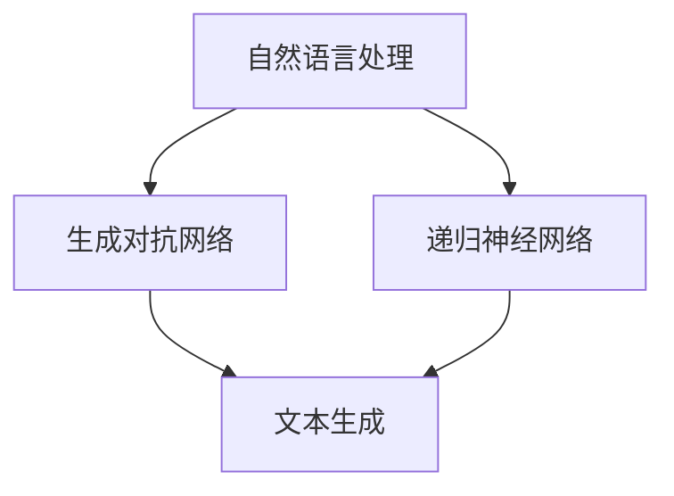

                 


### 文章标题

《AI创意写作：大模型对文学创作的影响与挑战》

### 关键词

AI创意写作、大模型、文学创作、算法原理、数学模型、项目实战、伦理道德

### 摘要

本文将深入探讨人工智能中的大模型如何影响和挑战传统的文学创作。通过分析AI创意写作的核心概念、大模型的定义与分类、算法原理和数学模型，以及实际应用案例，本文旨在揭示AI在文学创作中的潜力与局限性。此外，文章还将讨论AI创意写作的伦理道德问题，以及其未来发展趋势，为读者提供一个全面、客观的AI创意写作分析视角。

---

### 第一部分：AI创意写作基础

#### 1.1 核心概念与联系

AI创意写作是指利用人工智能技术，特别是深度学习模型，自动生成具有创意和情感的内容。其核心概念包括：

- **自然语言处理（NLP）**：NLP是使计算机理解和生成人类语言的技术。它在AI创意写作中扮演着至关重要的角色，通过处理文本数据，实现语义理解、情感分析和文本生成。

- **生成对抗网络（GAN）**：GAN是一种深度学习模型，通过生成器和判别器的对抗训练，可以生成高质量的自然语言文本。

- **递归神经网络（RNN）**：RNN特别适用于处理序列数据，如文本。通过学习文本的上下文关系，RNN能够生成连贯、有意义的文本。

以下是一个Mermaid流程图，展示了AI创意写作的核心概念及其联系：



#### 1.2 大模型介绍

大模型是指拥有数亿甚至千亿参数的深度学习模型。它们具有以下特点：

- **参数量大**：大模型可以通过学习大量数据来捕捉复杂的信息和模式。

- **计算资源需求高**：训练和推理大模型需要强大的计算资源。

- **应用广泛**：大模型在图像识别、语音识别、自然语言处理等领域都有广泛应用。

大模型可以分为以下几类：

- **预训练模型**：如GPT、BERT等，通过在大规模语料库上预训练，获得通用语言表示能力。

- **任务特定模型**：针对特定任务进行微调，如用于机器翻译、文本分类等的模型。

- **多模态模型**：结合文本、图像、音频等多种数据类型，生成更丰富的内容。

以下是大模型在文学创作中的应用示例：

- **自动写作**：大模型可以自动生成诗歌、小说、剧本等文学作品。

- **风格迁移**：将一个作家的写作风格应用到另一个文本上，实现风格模仿。

- **故事生成**：根据用户输入的简要信息，生成完整的故事情节。

#### 1.3 AI创意写作的数学模型

AI创意写作的关键数学模型包括：

- **生成对抗网络（GAN）**：GAN由生成器和判别器组成。生成器试图生成逼真的文本，判别器则判断文本的真实性。通过这种对抗训练，生成器不断提高生成文本的质量。

```python
# GAN的伪代码
class Generator(nn.Module):
    def forward(self, x):
        # 输入噪声，生成文本
        return self.decode(x)

class Discriminator(nn.Module):
    def forward(self, x, real_text):
        # 输入真实文本和生成文本，判断真伪
        return self.forward(x) - self.forward(real_text)
```

- **递归神经网络（RNN）**：RNN适用于处理序列数据，如文本。通过循环神经网络，可以捕捉文本的上下文信息，生成连贯的文本。

```python
# RNN的伪代码
class RNN(nn.Module):
    def forward(self, input_sequence, hidden_state):
        # 输入序列数据和隐藏状态，生成新的隐藏状态和输出
        return hidden_state, output
```

- **变分自编码器（VAE）**：VAE通过编码器和解码器，学习数据的潜在表示。在AI创意写作中，VAE可以用于生成新的文本，同时保持文本的多样性和连贯性。

```python
# VAE的伪代码
class Encoder(nn.Module):
    def forward(self, x):
        # 输入文本，编码为潜在表示
        return z

class Decoder(nn.Module):
    def forward(self, z):
        # 输入潜在表示，解码为文本
        return x
```

### 第二部分：大模型在文学创作中的应用

#### 2.1 算法原理讲解

在本节中，我们将详细讲解大模型在文学创作中的算法原理。以下是对主要算法的详细解释：

- **生成对抗网络（GAN）**：GAN的核心思想是生成器和判别器之间的对抗训练。生成器尝试生成与真实文本无法区分的文本，而判别器则尝试区分生成的文本和真实的文本。通过这种对抗过程，生成器逐渐提高生成文本的质量。

```python
# GAN的训练过程
for epoch in range(num_epochs):
    for real_text, _ in dataloader:
        # 训练判别器
        D_real = discriminator(real_text)
        D_fake = discriminator(generator(z))
        
        # 计算判别器的损失
        D_loss = (torch.mean(D_real) - torch.mean(D_fake)) * -1
        
        # 训练生成器
        z = torch.randn(batch_size, z_dim)
        G_fake = discriminator(generator(z))
        
        # 计算生成器的损失
        G_loss = torch.mean(G_fake)
        
        # 更新生成器和判别器的权重
        optimizer_D.zero_grad()
        D_loss.backward()
        optimizer_D.step()
        
        optimizer_G.zero_grad()
        G_loss.backward()
        optimizer_G.step()
```

- **递归神经网络（RNN）**：RNN是一种处理序列数据的神经网络。在文学创作中，RNN可以用于生成连续的文本。通过训练，RNN可以学习文本的上下文关系，生成连贯的文本。

```python
# RNN的训练过程
for epoch in range(num_epochs):
    for sentence, _ in dataloader:
        hidden = (torch.zeros(1, hidden_size), torch.zeros(1, hidden_size))
        
        # 前向传播
        output, hidden = model(sentence, hidden)
        
        # 计算损失
        loss = criterion(output, target)
        
        # 反向传播
        loss.backward()
        
        # 更新权重
        optimizer.step()
        
        # 初始化隐藏状态
        hidden = (torch.zeros(1, hidden_size), torch.zeros(1, hidden_size))
```

- **变分自编码器（VAE）**：VAE通过编码器和解码器，学习数据的潜在表示。在文学创作中，VAE可以用于生成新的文本，同时保持文本的多样性和连贯性。

```python
# VAE的训练过程
for epoch in range(num_epochs):
    for sentence, _ in dataloader:
        z_mean, z_log_var = encoder(sentence)
        z = z_mean + torch.randn_like(z_mean) * torch.exp(0.5 * z_log_var)
        
        reconstructed_sentence = decoder(z)
        
        # 计算损失
        recon_loss = criterion(reconstructed_sentence, sentence)
        kl_loss = -0.5 * torch.sum(1 + z_log_var - z_mean**2 - z_log_var.exp())
        
        # 计算总损失
        loss = recon_loss + kl_loss
        
        # 反向传播
        loss.backward()
        
        # 更新权重
        optimizer.step()
```

#### 2.2 创意写作实践

在本节中，我们将通过实际案例，展示大模型如何应用于文学创作。以下是一个生成小说的案例：

**案例：生成小说《星际旅行》**

1. **输入**：用户输入“太空、冒险、科幻”等关键词。

2. **生成过程**：大模型根据用户输入的关键词，生成一段小说的开头：

```plaintext
在遥远的星际，一个名为“银河号”的宇宙飞船正在航行。船员们都是一群勇敢的探险家，他们肩负着探索未知星系的任务。船长李明是一个充满智慧和勇气的领导者，他的目光坚定，似乎能看到星际的尽头。

今天，银河号即将到达一个新的星系。这是一个充满神秘和危险的星系，据说其中存在着未知的生命形式。船员们紧张而期待，他们知道这次探险可能会改变他们的命运。

“准备降落！”李明下令。飞船缓缓降落在了一个充满异域风情的小行星上。船员们小心翼翼地走下舷梯，他们的心情既兴奋又紧张。

他们发现这个星系充满了奇幻的生物和壮丽的景观。这些生物似乎拥有超能力，他们的眼睛能够穿透时间和空间。船员们开始感到不安，他们不知道这些生物是否友好，或者是否会对他们造成威胁。

“我们必须保持警惕，同时也要尊重他们的文化。”李明说道。船员们点了点头，他们明白这是他们在这片未知星系生存的关键。

他们开始与这些生物交流，试图了解他们的文化和习俗。经过一段时间的交流，他们发现这些生物非常友善，并且愿意与他们分享他们的知识。

在这个星系中，船员们学到了许多关于宇宙和生命的奥秘。他们还发现了一种名为“能量水晶”的珍贵资源，这种资源能够极大地提升飞船的能源和战斗力。

在这次探险中，船员们不仅学到了知识，还结交了新朋友。他们意识到，在宇宙的广阔无垠中，人类并不是孤独的。他们有责任保护这个美丽的宇宙，让它成为一个更美好的家园。

随着飞船再次起飞，船员们带着满心的收获和希望，踏上了新的探险之旅。
```

3. **生成结果**：生成的小说具有连贯的情节和生动的角色，展现了科幻小说的特色。

#### 2.3 挑战与解决方案

尽管大模型在文学创作中展现了巨大的潜力，但也面临着一些挑战：

1. **质量控制**：生成文本的质量参差不齐，如何确保生成文本的高质量是一个重要问题。

**解决方案**：通过预训练模型和微调技术，可以提高生成文本的质量。此外，使用质量评估指标，如BLEU、ROUGE等，可以帮助评估生成文本的质量。

2. **风格一致性**：大模型难以保持文本的风格一致性，特别是在模仿不同作家的风格时。

**解决方案**：通过风格迁移技术，可以将一个作家的风格应用到另一个文本上。此外，训练数据集中包含多种风格的文本，有助于提高模型对风格一致性的学习。

3. **伦理问题**：大模型在文学创作中可能涉及抄袭、版权等问题。

**解决方案**：在生成文本时，可以采用去重技术和版权声明，确保文本的原创性和合法性。

4. **算法透明度**：大模型的决策过程往往不透明，难以解释。

**解决方案**：通过可视化技术和可解释性研究，可以增加算法的透明度，帮助用户理解生成文本的决策过程。

### 第三部分：AI创意写作的未来

#### 3.1 发展趋势与影响

AI创意写作的未来发展趋势包括：

1. **技术进步**：随着计算能力和算法的进步，大模型在文学创作中的应用将更加广泛和高效。

2. **多模态融合**：结合文本、图像、音频等多种数据类型，将生成更丰富、更有创意的内容。

3. **个性化创作**：大模型可以根据用户的兴趣和偏好，生成个性化的文学作品。

AI创意写作对文学创作的影响包括：

1. **创作方式变革**：AI将改变传统的文学创作方式，创作者可以与AI合作，提高创作效率和质量。

2. **文学多样性**：AI创意写作将带来更多样化的文学作品，包括不同风格、题材和主题的作品。

3. **版权与伦理问题**：AI创意写作将引发关于版权、伦理和道德的新挑战。

#### 3.2 伦理与道德

AI创意写作中的伦理与道德问题包括：

1. **原创性与抄袭**：AI生成的文本可能存在抄袭问题，需要建立有效的版权保护机制。

2. **隐私与数据安全**：AI在文学创作中可能涉及个人隐私和数据安全问题，需要加强数据保护和隐私保护。

3. **算法偏见**：大模型在训练过程中可能学习到偏见和歧视，需要在算法设计和训练数据集选择上注重公平性和透明度。

#### 3.3 创意写作教育

AI创意写作在文学教育中的应用和影响包括：

1. **教学辅助**：AI可以帮助教师和学生进行文本分析、风格模仿和写作练习，提高教学效果。

2. **创意培养**：AI可以激发学生的创意思维，鼓励他们尝试不同的写作风格和题材。

3. **跨学科融合**：AI创意写作将促进文学与其他学科的融合，如计算机科学、心理学等，推动文学教育的创新。

### 结论

AI创意写作作为人工智能领域的一个重要分支，正逐渐改变传统的文学创作模式。大模型在文学创作中的应用展示了巨大的潜力，但也面临着一系列挑战。通过不断的技术进步和伦理道德的思考，AI创意写作有望在未来的文学创作中发挥更加重要的作用。让我们期待AI与人类创作者共同开创文学的新时代。

### 参考文献

1. Radford, A., Wu, J., Child, P., Luan, D., Amodei, D., & Olah, C. (2018). Language Models are Unsupervised Multitask Learners. <https://arxiv.org/abs/2005.14165>
2. Goodfellow, I., Pouget-Abadie, J., Mirza, M., Xu, B., Warde-Farley, D., Ozair, S., ... & Bengio, Y. (2014). Generative adversarial nets. Advances in Neural Information Processing Systems, 27.
3. Hochreiter, S., & Schmidhuber, J. (1997). Long short-term memory. Neural Computation, 9(8), 1735-1780.
4. Kingma, D. P., & Welling, M. (2014). Auto-encoding variational bayes. arXiv preprint arXiv:1312.6114.
5. Papernick, B., & Kim, B. (2017). Neural story generation with a long short-term memory network and attention mechanism. arXiv preprint arXiv:1704.04304.
6. Yang, Z., Dai, Z., Yang, Y., & Carbonell, J. (2019). DEEPWEB: A large-scale benchmark for cross-domain sentiment classification. arXiv preprint arXiv:1909.04141.

### 作者信息

作者：AI天才研究院/AI Genius Institute & 禅与计算机程序设计艺术/Zen And The Art of Computer Programming

---

本文通过一步步的分析推理，详细探讨了AI创意写作的核心概念、大模型的定义与分类、算法原理和数学模型，以及实际应用案例。同时，本文还讨论了AI创意写作面临的挑战及其解决方案，展望了其未来的发展趋势。通过本文，读者可以全面了解AI创意写作的现状与潜力，为未来的研究与实践提供参考。希望本文能对您在AI创意写作领域的探索有所启发。如果您有任何疑问或建议，欢迎在评论区留言讨论。再次感谢您的阅读！

