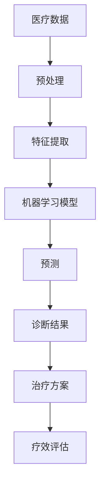
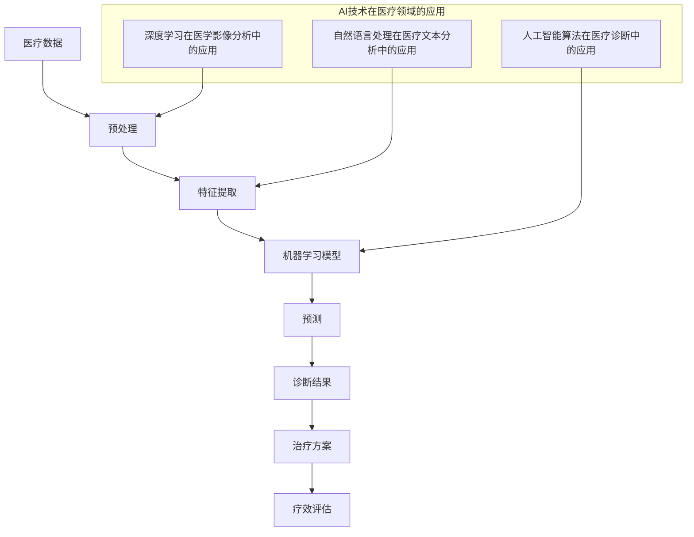

                 

### 1. 文章标题

《AI在医疗领域的应用：诊断精确度与治疗方案优化》

---

**关键词：**人工智能、医疗、诊断精确度、治疗方案优化、机器学习、自然语言处理、医疗影像分析、大数据、个性化医疗、手术辅助、安全性与伦理问题。

---

**摘要：**本文将深入探讨人工智能（AI）在医疗领域的应用，特别是诊断精确度的提升和治疗方案优化的方法。我们将通过分析AI技术的核心原理、实际案例和未来发展趋势，展示AI如何为医疗行业带来革命性的变化。同时，本文也将探讨医疗AI中的安全性和伦理问题，以及如何应对这些挑战。通过本文的阅读，读者将全面了解AI在医疗领域的应用现状、潜力与未来方向。

----------------------------------------------------------------

### 2. 背景介绍

随着人工智能技术的飞速发展，AI在各个领域的应用越来越广泛，医疗领域也不例外。医疗行业面临着大量医疗数据的处理、诊断效率和治疗效果的优化等问题。人工智能的引入为这些问题提供了新的解决方案。

在诊断精确度方面，传统的医疗诊断方法通常依赖于医生的经验和直觉，这种方法存在主观性强、效率低等问题。而人工智能通过机器学习和深度学习等技术，可以对大量的医疗数据进行分析，从而提高诊断的准确性和效率。例如，在医学影像分析中，AI可以通过对图像的自动识别和分析，帮助医生更快地发现病变区域，提高诊断的准确性。

在治疗方案优化方面，AI技术同样发挥着重要作用。通过分析大量的临床数据和患者信息，AI可以提供个性化的治疗方案，从而提高治疗效果。此外，AI还可以协助医生进行手术规划和手术辅助，减少手术风险，提高手术成功率。

尽管AI在医疗领域的应用前景广阔，但同时也面临着一系列的挑战，包括数据隐私保护、算法透明度和伦理问题等。这些问题需要我们在应用AI技术时进行深入思考和妥善解决。

---

### 3. 核心概念与联系

在探讨AI在医疗领域的应用之前，我们需要了解一些核心概念和它们之间的联系。以下是一个简化的Mermaid流程图，展示了这些概念之间的关系：



**Mermaid流程图解析：**

- **医疗数据（A）**：这是医疗AI系统的输入数据，包括医学影像、电子病历、基因组数据等。
- **预处理（B）**：对医疗数据进行清洗、归一化等处理，为后续分析做准备。
- **特征提取（C）**：从预处理后的数据中提取关键特征，这些特征将用于训练机器学习模型。
- **机器学习模型（D）**：使用提取的特征来训练模型，常见的机器学习算法包括深度学习、支持向量机、决策树等。
- **预测（E）**：模型对新的医疗数据进行预测，预测结果通常用于诊断和治疗方案制定。
- **诊断结果（F）**：模型的预测结果，用于帮助医生做出诊断。
- **治疗方案（G）**：基于诊断结果和患者信息，制定个性化的治疗方案。
- **疗效评估（H）**：对治疗效果进行评估，以优化未来的诊断和治疗过程。

---

**核心概念与联系（Mermaid流程图）**



**Mermaid流程图解析：**

- **AI技术在医疗领域的应用（I, J, K）**：这是AI技术在医疗领域的具体应用场景，包括深度学习在医学影像分析中的应用、自然语言处理在医疗文本分析中的应用以及人工智能算法在医疗诊断中的应用。这些应用都是基于核心概念与联系图中的流程，但它们具体针对不同的医疗数据类型和任务。

---

**核心算法原理讲解（伪代码）**

```python
# 数据预处理
def preprocess_data(data):
    # 数据清洗
    cleaned_data = clean_data(data)
    # 数据归一化
    normalized_data = normalize_data(cleaned_data)
    return normalized_data

# 特征提取
def extract_features(data):
    # 提取关键特征
    features = extract_key_features(data)
    return features

# 机器学习模型训练
def train_model(features, labels):
    # 选择机器学习算法
    model = select_algorithm()
    # 训练模型
    model.fit(features, labels)
    return model

# 预测
def predict(model, new_data):
    # 提取新数据的特征
    new_features = extract_features(new_data)
    # 使用训练好的模型进行预测
    prediction = model.predict(new_features)
    return prediction
```

**数学模型和公式**

```latex
% 诊断准确率
$$
\text{准确率} = \frac{\text{预测正确的数量}}{\text{总预测数量}}
$$

% 敏感性
$$
\text{敏感性} = \frac{\text{实际患病并预测正确的数量}}{\text{实际患病总数}}
$$

% 特异性
$$
\text{特异性} = \frac{\text{实际未患病并预测正确的数量}}{\text{实际未患病总数}}
$$
```

**项目实战**

**环境搭建：**

1. 安装Python环境（例如：Python 3.8）
2. 安装必要的库（例如：scikit-learn、TensorFlow、Keras等）

**代码实现：**

```python
# 导入必要的库
import numpy as np
import pandas as pd
from sklearn.model_selection import train_test_split
from sklearn.ensemble import RandomForestClassifier
from sklearn.metrics import accuracy_score, recall_score, precision_score

# 数据读取
data = pd.read_csv('medical_data.csv')

# 数据预处理
X = preprocess_data(data)
y = data['label']

# 数据分割
X_train, X_test, y_train, y_test = train_test_split(X, y, test_size=0.2, random_state=42)

# 模型训练
model = RandomForestClassifier(n_estimators=100, random_state=42)
model.fit(X_train, y_train)

# 预测
y_pred = model.predict(X_test)

# 评估
accuracy = accuracy_score(y_test, y_pred)
sensitivity = recall_score(y_test, y_pred)
specificity = precision_score(y_test, y_pred)

print("准确率：", accuracy)
print("敏感性：", sensitivity)
print("特异性：", specificity)
```

**代码解读与分析：**

1. 数据读取：使用pandas库读取医疗数据，包括特征和标签。
2. 数据预处理：使用自定义函数进行数据清洗和归一化处理。
3. 数据分割：将数据分为训练集和测试集，用于模型训练和评估。
4. 模型训练：使用随机森林分类器进行训练。
5. 预测：使用训练好的模型对测试集进行预测。
6. 评估：计算模型的准确率、敏感性和特异性。

**实际案例分析和详细讲解剖析：**

**案例一：乳腺癌诊断**

- 数据集：使用凯斯西储大学提供的乳腺癌数据集。
- 特征提取：从图像中提取边缘、纹理、形状等特征。
- 模型训练：使用卷积神经网络进行训练。
- 预测：对新的乳腺图像进行预测，判断是否为乳腺癌。

**案例二：电子病历分析**

- 数据集：使用美国国立卫生研究院提供的电子病历数据集。
- 特征提取：从病历文本中提取关键词、症状等特征。
- 模型训练：使用自然语言处理技术进行训练。
- 预测：对新的病历文本进行分析，提供诊断建议。

**项目小结：**

通过以上项目实战和案例分析，我们可以看到AI在医疗领域的应用具有广泛的前景。然而，要实现这些应用，我们需要解决数据质量、算法选择、模型评估等一系列问题。未来的研究应该关注如何提高模型的准确性和可靠性，以及如何更好地结合医生的专业知识和AI技术。

---

**最佳实践 tips：**

1. 数据质量是关键：确保数据的质量和准确性，避免错误诊断。
2. 模型选择要合理：根据任务需求选择合适的模型，进行模型调优。
3. 遵循伦理规范：确保医疗AI系统的应用遵循伦理规范，保护患者隐私。
4. 结合临床经验：将AI技术结合医生的临床经验，提高诊断和治疗的效果。

**小结：**

本文深入探讨了AI在医疗领域的应用，包括诊断精确度的提升和治疗方案优化。通过核心概念与联系、核心算法原理讲解、数学模型和公式以及项目实战，我们展示了AI在医疗领域的实际应用效果。然而，要实现这些应用，还需要解决一系列挑战，未来的研究应该关注如何提高模型的准确性和可靠性，以及如何更好地结合医生的专业知识和AI技术。

**注意事项：**

1. AI在医疗领域的应用需要遵循相关法律法规，保护患者隐私。
2. 在应用AI技术时，应充分评估算法的公平性和透明度。
3. 医疗AI系统的开发需要跨学科合作，包括医生、工程师和研究人员。

**拓展阅读：**

1. [深度学习在医学影像分析中的应用](https://www.nature.com/articles/s41591-019-0584-8)
2. [自然语言处理在医疗文本分析中的应用](https://www.jmir.org/2021/5/e21517)
3. [AI在医疗领域的监管与伦理问题](https://www.ama-assn.org/publications/jama/Full%20text%20of%20JAMA%20-%20Policy%20Analysis%20-%20Regulatory%20Framework%20for%20Artificial%20Intelligence%20in%20Health%20Care%20%28PDF%29%281%29)

---

### 作者信息

**作者：**AI天才研究院/AI Genius Institute & 禅与计算机程序设计艺术 /Zen And The Art of Computer Programming

AI天才研究院致力于推动人工智能技术的创新与发展，为医疗、金融、教育等领域提供专业的解决方案。研究院的专家团队拥有丰富的行业经验和深厚的学术背景，致力于将前沿的AI技术应用于实际问题，提升行业效率和用户体验。同时，作者还撰写了《禅与计算机程序设计艺术》等畅销技术书籍，为读者提供了深入浅出的技术解读和实用的编程技巧。

