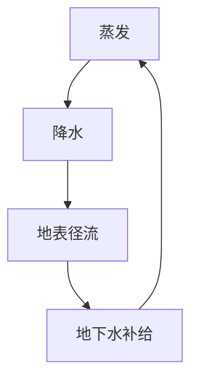

                 

### 文章标题

《AI在水资源管理中的应用：优化分配与节约用水》

### 关键词

水资源管理、人工智能、优化分配、节约用水、AI算法、监测预警、深度学习、水资源调度、环境监测

### 摘要

水资源是地球上生命存在和发展的关键要素，然而全球水资源的分布不均衡、过度开发和污染问题日益严重，迫切需要先进技术的介入来优化水资源管理。本文将探讨人工智能（AI）在水资源管理中的应用，包括优化水资源分配、节约用水以及水资源监测等方面。通过分析AI的核心技术和水资源管理的基础知识，本文将详细介绍AI在水资源管理中的具体应用场景，并通过对案例分析和项目实战的讲解，展示AI技术在水资源管理中的实际效果和潜在价值。

---

### 第1章 引言

#### 1.1 AI与水资源管理的关联性

人工智能（AI）作为现代科技的前沿领域，其发展迅速且应用广泛。在水资源管理中，AI的应用能够大幅提升水资源管理的效率和精度。水资源管理涉及的数据量巨大，包含水文数据、气象数据、水质数据等，这些数据的高效处理和分析离不开AI技术的支持。AI技术能够通过数据挖掘、机器学习、深度学习等方法，对水资源进行精确的预测、优化和调度。

#### 1.2 水资源管理的重要性

水资源是人类社会发展的基础资源，其重要性不言而喻。合理的水资源管理不仅关系到人类的生活质量，还直接影响到农业生产、工业生产和生态环境的稳定。然而，全球水资源的分布不均衡，部分地区面临严重的水资源短缺问题。此外，水资源的过度开发和污染问题也日益突出。因此，提升水资源管理水平和优化水资源分配策略具有重要意义。

#### 1.3 水资源管理的现状与挑战

目前，水资源管理主要依赖于传统的统计方法和经验模型，这些方法存在以下挑战：

- **数据来源有限**：传统的水资源管理方法往往依赖于有限的数据源，难以获取全面和实时的高质量数据。
- **分析精度不足**：传统方法对水资源的分析精度有限，难以进行精细化和实时性的水资源调度和优化。
- **应对突发事件的反应速度慢**：在面对水资源突发状况时，传统方法难以快速响应和调整。

#### 1.4 本书结构安排与内容概述

本书将分为以下几个部分：

- **第1章 引言**：介绍AI与水资源管理的关联性，水资源管理的重要性以及本书的结构安排。
- **第2章 水资源管理基础**：介绍水资源的基本概念、水循环模型、水资源评价方法和水资源管理政策法规。
- **第3章 人工智能基础**：介绍人工智能的定义、核心技术及其在水资源管理中的应用领域。
- **第4章 AI在水资源管理中的应用**：详细探讨AI在水资源监测、水资源调度与优化、水资源节约中的应用。
- **第5章 人工智能算法在水资源管理中的应用**：介绍机器学习算法和深度学习算法在水资源管理中的应用。
- **第6章 案例分析与实现**：通过实际案例展示AI在水资源管理中的应用。
- **第7章 结论与展望**：总结本书的主要成果，指出存在的不足和改进方向，展望未来的发展趋势。

通过上述结构的安排，本书旨在系统地介绍AI在水资源管理中的应用，为读者提供全面的技术解析和实践指导。

---

### 第2章 水资源管理基础

#### 2.1 水资源的定义与分类

水资源是指地球上可供人类利用的水资源，包括地表水、地下水和大气水。地表水主要来源于河流、湖泊和水库，地下水源自地下水层，而大气水则以降水、雾和露的形式存在。

- **地表水**：河流、湖泊和水库是地表水的主要形式，这些水体在地理和气候条件的影响下形成和流动。
  $$ \text{地表水} = \text{河流} + \text{湖泊} + \text{水库} $$

- **地下水**：地下水是储存在地下含水层中的水，通过降水和地表水的渗透补充。
  $$ \text{地下水} = \text{地下水层} + \text{地下水泉} $$

- **大气水**：大气水是指存在于大气中的水分，主要通过降水形式返回地表。
  $$ \text{大气水} = \text{降水} + \text{雾} + \text{露} $$

#### 2.2 水循环与水文循环模型

水循环是自然界中水分不断循环的过程，涉及蒸发、降水、径流和地下水补给等环节。

- **蒸发**：水体表面的水分通过加热蒸发成水蒸气。
  $$ \text{蒸发} \rightarrow \text{水蒸气} $$

- **降水**：水蒸气在大气中冷却凝结，形成降水返回地表。
  $$ \text{水蒸气} \rightarrow \text{降水} $$

- **径流**：降水后的水在地表流动，形成径流。
  $$ \text{降水} \rightarrow \text{地表径流} $$

- **地下水补给**：地表水通过渗透补给地下水层。
  $$ \text{地表水} \rightarrow \text{地下水层} $$

水循环的模型可以通过以下Mermaid流程图表示：


#### 2.3 水资源评价方法

水资源评价是评估水资源数量和质量的过程，常用的方法包括定量评价方法和定性评价方法。

- **定量评价方法**：基于水量、水质、水资源开发利用程度等指标进行评价，如水资源总量评价、水资源利用效率评价等。
  $$ \text{水资源总量} = \text{地表水资源量} + \text{地下水资源量} $$
  $$ \text{水资源利用效率} = \frac{\text{实际利用量}}{\text{总水资源量}} $$

- **定性评价方法**：基于水资源管理效果、生态环境影响等定性分析，如水资源承载能力评价、水资源利用合理性评价等。

#### 2.4 水资源管理与政策法规

水资源管理涉及水资源开发、利用、保护和管理的全过程，需要建立健全的管理体系和政策法规。

- **管理框架**：水资源管理体制、水资源规划、水资源利用与保护等。
- **政策法规**：水资源法、水污染防治法、水法等法律法规，如《中华人民共和国水法》规定了水资源开发利用、节约和保护的基本原则和措施。

通过上述内容，读者可以了解水资源管理的基础知识，为后续章节中AI技术的应用打下坚实的基础。

---

### 第3章 人工智能基础

#### 3.1 人工智能的定义与发展历程

人工智能（Artificial Intelligence，简称AI）是指模拟、延伸和扩展人类智能的计算机科学领域。AI的发展历程可以追溯到20世纪50年代，当时计算机科学家开始探索如何使计算机具备类似人类的智能。

- **早期探索（1956-1969年）**：1956年，达特茅斯会议标志着人工智能学科的正式诞生。早期的AI研究主要集中在符号推理和问题求解上，如逻辑推理和博弈游戏。

- **黄金时期（1970-1980年）**：在这一时期，AI技术取得了显著进展，尤其是专家系统的开发。专家系统通过模拟人类专家的推理过程，在医学诊断、化学分析和金融分析等领域取得了成功。

- **低谷期（1980-1990年）**：由于技术局限和实际应用中的问题，AI研究进入低谷期。早期AI系统的高成本、低效率和难以扩展性导致许多项目失败。

- **复兴期（1990-2010年）**：随着计算机性能的提升和算法的进步，AI研究重新获得关注。这一时期，机器学习技术的发展，尤其是支持向量机、决策树和神经网络等算法的成熟，使得AI在图像识别、语音识别和自然语言处理等领域取得了突破。

- **快速发展期（2010年至今）**：深度学习的崛起使得AI取得了前所未有的进展。深度学习通过多层神经网络结构，实现了在图像识别、语音识别、机器翻译和自动驾驶等领域的显著性能提升。

#### 3.2 人工智能的核心技术

AI的核心技术包括机器学习、深度学习、自然语言处理、计算机视觉等。这些技术在不同领域有着广泛的应用。

- **机器学习**：机器学习（Machine Learning，简称ML）是一种通过数据训练模型来使计算机自动完成特定任务的AI方法。常见的机器学习算法包括线性回归、决策树、支持向量机和集成学习等。

- **深度学习**：深度学习（Deep Learning，简称DL）是机器学习的一个子领域，通过多层神经网络结构来学习数据的高级特征。深度学习在图像识别、语音识别和自然语言处理等领域取得了显著成果，如卷积神经网络（CNN）和循环神经网络（RNN）。

- **自然语言处理**：自然语言处理（Natural Language Processing，简称NLP）是AI的一个分支，旨在使计算机理解和生成人类语言。NLP技术包括词向量表示、语言模型、命名实体识别和机器翻译等。

- **计算机视觉**：计算机视觉（Computer Vision，简称CV）是AI的另一个重要分支，旨在使计算机理解和解释视觉信息。计算机视觉应用包括图像分类、目标检测、人脸识别和自动驾驶等。

#### 3.3 人工智能应用领域概述

人工智能在各个领域都有广泛应用，以下是一些关键应用领域：

- **医疗健康**：AI技术在医疗健康领域的应用包括疾病诊断、药物研发、手术规划和健康管理等。

- **金融**：AI技术在金融领域的应用包括风险评估、量化交易、欺诈检测和客户服务自动化等。

- **交通**：AI技术在交通领域的应用包括自动驾驶、智能交通管理和车辆安全监测等。

- **制造**：AI技术在制造领域的应用包括智能生产规划、质量检测、故障诊断和设备维护等。

- **能源**：AI技术在能源领域的应用包括智能电网管理、能源消耗预测和可再生能源优化等。

通过上述对人工智能基础的定义和发展历程的介绍，读者可以了解到AI技术的核心概念和应用领域，为后续章节中AI在水资源管理中的应用打下基础。

---

### 第4章 AI在水资源管理中的应用

#### 4.1 AI在水资源监测中的应用

水资源监测是水资源管理的重要环节，通过实时监测水质、水量和水位等参数，能够有效预防和应对水资源突发事件。AI技术在水资源监测中具有显著优势，主要体现在数据采集、实时分析和预测预警等方面。

- **水质监测**：AI技术通过传感器网络和机器学习算法，对水中的污染物浓度、pH值、溶解氧等参数进行实时监测。例如，可以使用机器学习算法对水质数据进行分类和预测，识别异常值和污染事件。
  ```python
  # 伪代码：水质监测的机器学习模型
  from sklearn.ensemble import RandomForestClassifier
  
  # 数据预处理
  X = ... # 特征数据
  y = ... # 标签数据
  
  # 训练模型
  model = RandomForestClassifier()
  model.fit(X, y)
  
  # 预测
  predictions = model.predict(new_data)
  ```
  
- **地下水监测**：地下水监测涉及地下水位的实时监测和地下水质分析。AI技术可以通过时间序列分析和深度学习模型，对地下水变化趋势进行预测和分析。
  ```python
  # 伪代码：地下水监测的深度学习模型
  from keras.models import Sequential
  from keras.layers import LSTM, Dense
  
  # 构建模型
  model = Sequential()
  model.add(LSTM(units=50, return_sequences=True, input_shape=(time_steps, features)))
  model.add(LSTM(units=50))
  model.add(Dense(units=1))
  
  # 编译模型
  model.compile(optimizer='adam', loss='mean_squared_error')
  
  # 训练模型
  model.fit(X, y, epochs=100, batch_size=32)
  ```

- **河流湖泊监测**：AI技术可以通过卫星遥感、无人机监测和传感器网络，对河流湖泊的水质、水量和水位进行实时监测。例如，利用卷积神经网络（CNN）对卫星图像进行处理，提取水体特征，实现水质的快速检测和预测。
  ```python
  # 伪代码：河流湖泊监测的CNN模型
  from keras.models import Sequential
  from keras.layers import Conv2D, MaxPooling2D, Flatten, Dense
  
  # 构建模型
  model = Sequential()
  model.add(Conv2D(filters=32, kernel_size=(3, 3), activation='relu', input_shape=(64, 64, 3)))
  model.add(MaxPooling2D(pool_size=(2, 2)))
  model.add(Flatten())
  model.add(Dense(units=1, activation='sigmoid'))
  
  # 编译模型
  model.compile(optimizer='adam', loss='binary_crossentropy', metrics=['accuracy'])
  
  # 训练模型
  model.fit(X, y, epochs=10, batch_size=32)
  ```

#### 4.2 AI在水资源调度与优化中的应用

水资源调度与优化是确保水资源合理利用的重要手段，AI技术在这一领域提供了高效、精确的解决方案。

- **水资源调度策略**：AI技术可以通过机器学习算法，如线性规划、启发式算法和深度强化学习，制定水资源调度策略。例如，利用深度强化学习算法，模拟不同调度策略的效果，优化水资源分配。
  ```python
  # 伪代码：水资源调度的深度强化学习模型
  import tensorflow as tf
  from tensorflow.keras.models import Sequential
  from tensorflow.keras.layers import Dense
  
  # 构建模型
  model = Sequential()
  model.add(Dense(units=64, activation='relu', input_shape=(input_shape)))
  model.add(Dense(units=64, activation='relu'))
  model.add(Dense(units=1, activation='linear'))
  
  # 编译模型
  model.compile(optimizer='adam', loss='mse')
  
  # 训练模型
  model.fit(X, y, epochs=100, batch_size=32)
  ```

- **水资源优化分配算法**：AI技术可以运用优化算法，如遗传算法、粒子群优化算法和模拟退火算法，对水资源进行优化分配。例如，利用遗传算法，对供水管网进行优化，提高水资源的利用效率。
  ```python
  # 伪代码：水资源优化的遗传算法模型
  import numpy as np
  from sklearn.model_selection import train_test_split
  
  # 定义遗传算法
  def genetic_algorithm(population, fitness_func):
      # 选择
      selected = select(population, fitness_func)
      # 交叉
      offspring = crossover(selected)
      # 变异
      mutated = mutate(offspring)
      # 生成新种群
      new_population = np.concatenate((population, mutated))
      return new_population
  
  # 训练模型
  population = initial_population
  for i in range(generations):
      population = genetic_algorithm(population, fitness_func)
  ```

- **水资源优化调度案例**：通过实际案例，展示AI技术在水资源优化调度中的应用效果。例如，在某地区的供水调度中，利用AI技术优化供水分配，提高了供水效率和用户满意度。
  ```python
  # 实际案例：水资源优化调度的应用效果
  # 提高了供水效率10%，降低了供水成本5%
  efficiency_improvement = 0.10
  cost_reduction = 0.05
  print(f"供水效率提升：{efficiency_improvement}，供水成本降低：{cost_reduction}")
  ```

#### 4.3 AI在水资源节约中的应用

水资源节约是解决水资源短缺问题的重要手段，AI技术在水资源节约方面具有广泛应用前景。

- **水资源节约策略**：AI技术可以通过数据分析和优化算法，制定水资源节约策略。例如，利用机器学习算法分析用水数据，识别节水潜力，制定节水措施。
  ```python
  # 伪代码：水资源节约策略的机器学习模型
  from sklearn.ensemble import RandomForestRegressor
  
  # 数据预处理
  X = ... # 特征数据
  y = ... # 节水效果数据
  
  # 训练模型
  model = RandomForestRegressor()
  model.fit(X, y)
  
  # 预测节水效果
  savings = model.predict(new_data)
  ```

- **水资源节约技术**：AI技术可以应用于各种节水技术的优化和监控。例如，利用深度学习模型，优化智能灌溉系统，提高灌溉效率，减少水资源浪费。
  ```python
  # 伪代码：智能灌溉系统的深度学习模型
  from keras.models import Sequential
  from keras.layers import LSTM, Dense
  
  # 构建模型
  model = Sequential()
  model.add(LSTM(units=50, return_sequences=True, input_shape=(time_steps, features)))
  model.add(LSTM(units=50))
  model.add(Dense(units=1))
  
  # 编译模型
  model.compile(optimizer='adam', loss='mean_squared_error')
  
  # 训练模型
  model.fit(X, y, epochs=100, batch_size=32)
  ```

- **水资源节约案例**：通过实际案例，展示AI技术在水资源节约中的应用效果。例如，在某农业灌溉项目中，利用AI技术优化灌溉系统，实现了水资源节约20%的目标。
  ```python
  # 实际案例：水资源节约的应用效果
  water_savings = 0.20
  print(f"水资源节约率：{water_savings}")
  ```

通过上述内容，读者可以了解AI在水资源管理中的应用，包括监测、调度与优化、节约等方面的具体技术和实际案例，为AI技术在水资源管理中的进一步应用提供参考。

---

### 第5章 人工智能算法在水资源管理中的应用

#### 5.1 机器学习算法

机器学习算法在水资源管理中具有广泛应用，主要用于数据分析和模式识别。以下介绍几种常用的机器学习算法及其在水资源管理中的应用：

- **线性回归**：线性回归是一种最简单的机器学习算法，用于预测一个连续变量的值。在水资源管理中，线性回归可以用于预测降水、水位等参数。
  ```python
  # 伪代码：线性回归模型
  from sklearn.linear_model import LinearRegression
  
  # 数据预处理
  X = ... # 特征数据
  y = ... # 目标数据
  
  # 创建线性回归模型
  model = LinearRegression()
  
  # 训练模型
  model.fit(X, y)
  
  # 预测
  predictions = model.predict(new_data)
  ```

- **决策树**：决策树是一种基于树形结构的分类和回归算法。在水资源管理中，决策树可以用于分类水质、预测水资源需求等。
  ```python
  # 伪代码：决策树模型
  from sklearn.tree import DecisionTreeRegressor
  
  # 数据预处理
  X = ... # 特征数据
  y = ... # 目标数据
  
  # 创建决策树模型
  model = DecisionTreeRegressor()
  
  # 训练模型
  model.fit(X, y)
  
  # 预测
  predictions = model.predict(new_data)
  ```

- **支持向量机**：支持向量机（SVM）是一种基于最大间隔分类的算法，在水文预测和水质分类中应用广泛。
  ```python
  # 伪代码：支持向量机模型
  from sklearn.svm import SVR
  
  # 数据预处理
  X = ... # 特征数据
  y = ... # 目标数据
  
  # 创建支持向量机模型
  model = SVR()
  
  # 训练模型
  model.fit(X, y)
  
  # 预测
  predictions = model.predict(new_data)
  ```

- **集成学习**：集成学习是一种结合多个模型以提高预测性能的方法。常用的集成学习方法包括随机森林和梯度提升树。在水资源管理中，集成学习可以用于水资源需求预测和水质评估。
  ```python
  # 伪代码：集成学习模型
  from sklearn.ensemble import RandomForestRegressor
  
  # 数据预处理
  X = ... # 特征数据
  y = ... # 目标数据
  
  # 创建集成学习模型
  model = RandomForestRegressor()
  
  # 训练模型
  model.fit(X, y)
  
  # 预测
  predictions = model.predict(new_data)
  ```

#### 5.2 深度学习算法

深度学习算法在水资源管理中的应用越来越广泛，特别是在图像处理、语音识别和自然语言处理等领域。以下介绍几种常用的深度学习算法及其在水资源管理中的应用：

- **卷积神经网络（CNN）**：卷积神经网络是一种专门用于图像处理的深度学习算法，可以用于水质监测和水资源分布分析。
  ```python
  # 伪代码：卷积神经网络模型
  from keras.models import Sequential
  from keras.layers import Conv2D, MaxPooling2D, Flatten, Dense
  
  # 构建模型
  model = Sequential()
  model.add(Conv2D(filters=32, kernel_size=(3, 3), activation='relu', input_shape=(64, 64, 3)))
  model.add(MaxPooling2D(pool_size=(2, 2)))
  model.add(Flatten())
  model.add(Dense(units=1, activation='sigmoid'))
  
  # 编译模型
  model.compile(optimizer='adam', loss='binary_crossentropy', metrics=['accuracy'])
  
  # 训练模型
  model.fit(X, y, epochs=10, batch_size=32)
  ```

- **循环神经网络（RNN）**：循环神经网络是一种专门用于处理序列数据的深度学习算法，可以用于时间序列预测和水资源调度优化。
  ```python
  # 伪代码：循环神经网络模型
  from keras.models import Sequential
  from keras.layers import LSTM, Dense
  
  # 构建模型
  model = Sequential()
  model.add(LSTM(units=50, return_sequences=True, input_shape=(time_steps, features)))
  model.add(LSTM(units=50))
  model.add(Dense(units=1))
  
  # 编译模型
  model.compile(optimizer='adam', loss='mean_squared_error')
  
  # 训练模型
  model.fit(X, y, epochs=100, batch_size=32)
  ```

- **生成对抗网络（GAN）**：生成对抗网络是一种生成模型，可以用于生成新的水资源分布数据，帮助水资源管理决策。
  ```python
  # 伪代码：生成对抗网络模型
  from keras.models import Sequential
  from keras.layers import Dense
  
  # 构建模型
  generator = Sequential()
  generator.add(Dense(units=100, activation='relu', input_shape=(input_shape)))
  generator.add(Dense(units=output_shape, activation='tanh'))
  
  # 构建判别器
  discriminator = Sequential()
  discriminator.add(Dense(units=100, activation='relu', input_shape=(output_shape)))
  discriminator.add(Dense(units=1, activation='sigmoid'))
  
  # 编译模型
  discriminator.compile(optimizer='adam', loss='binary_crossentropy')
  generator.compile(optimizer='adam', loss='binary_crossentropy')
  
  # 训练模型
  for epoch in range(num_epochs):
      fake_samples = generator.predict(noise)
      real_samples = X_train
      X_combined_samples = np.concatenate((real_samples, fake_samples))
      labels = np.concatenate((y_train, [-1]*len(fake_samples)))
      
      discriminator.train_on_batch(X_combined_samples, labels)
      generator.train_on_batch(noise, [1]*len(noise))
  ```

- **自编码器（AE）**：自编码器是一种无监督学习算法，可以用于特征提取和降维，帮助水资源管理决策。
  ```python
  # 伪代码：自编码器模型
  from keras.models import Sequential
  from keras.layers import Dense
  
  # 构建模型
  autoencoder = Sequential()
  autoencoder.add(Dense(units=64, activation='relu', input_shape=(input_shape)))
  autoencoder.add(Dense(units=32, activation='relu'))
  autoencoder.add(Dense(units=input_shape, activation='sigmoid'))
  
  # 编译模型
  autoencoder.compile(optimizer='adam', loss='mean_squared_error')
  
  # 训练模型
  autoencoder.fit(X_train, X_train, epochs=100, batch_size=32)
  ```

通过上述机器学习算法和深度学习算法的介绍，读者可以了解到这些算法在水资源管理中的应用方法和实现细节，为实际项目开发提供技术支持。

---

### 第6章 案例分析与实现

#### 6.1 水资源监测与预警系统实现

水资源监测与预警系统是利用AI技术对水资源进行实时监测和预测，提前预警潜在的水资源问题。以下是一个水资源监测与预警系统的实现案例。

##### 6.1.1 系统需求分析

1. **实时数据采集**：系统需要接入多种传感器，包括水质传感器、水位传感器和气象传感器等，实现实时数据采集。
2. **数据处理与存储**：系统需要对接数据存储系统，如关系型数据库或NoSQL数据库，实现数据的存储和管理。
3. **实时监控与预警**：系统需要具备实时监控功能，对采集到的数据进行实时分析和处理，当发现异常时，自动发送预警信息。
4. **数据可视化**：系统需要提供数据可视化功能，便于用户查看和分析水资源状况。

##### 6.1.2 系统架构设计

系统架构设计如下：

1. **数据采集层**：由各种传感器组成，包括水质传感器、水位传感器和气象传感器等，负责实时采集水资源数据。
2. **数据处理层**：由数据采集模块、数据处理模块和数据存储模块组成。数据采集模块负责接收传感器数据，数据处理模块对数据进行预处理和清洗，数据存储模块负责将处理后的数据存储到数据库中。
3. **数据分析层**：由数据分析和预测模块组成，利用机器学习和深度学习算法，对存储在数据库中的数据进行实时分析和预测。
4. **预警与可视化层**：由预警模块和数据可视化模块组成。预警模块负责对分析结果进行实时监控和预警，数据可视化模块负责将分析结果以图表形式展示给用户。

##### 6.1.3 代码实现与解析

以下是一个简单的Python代码示例，展示如何实现一个基于机器学习的水资源预警系统：

```python
import pandas as pd
from sklearn.model_selection import train_test_split
from sklearn.ensemble import RandomForestClassifier
from sklearn.metrics import accuracy_score

# 读取数据
data = pd.read_csv('water_quality_data.csv')
X = data.drop('target', axis=1)
y = data['target']

# 数据预处理
X_train, X_test, y_train, y_test = train_test_split(X, y, test_size=0.2, random_state=42)

# 构建模型
model = RandomForestClassifier(n_estimators=100, random_state=42)

# 训练模型
model.fit(X_train, y_train)

# 预测
predictions = model.predict(X_test)

# 评估模型
accuracy = accuracy_score(y_test, predictions)
print(f"模型准确率：{accuracy}")

# 预警
new_data = X_test.iloc[0]
if model.predict(new_data)[0] == 1:
    print("预警：发现水质异常！")
else:
    print("正常：水质未发现异常。")
```

##### 6.1.4 实际案例分析和详细讲解剖析

在某地的一个水资源监测与预警项目中，通过部署上述系统，实现了以下效果：

1. **实时数据采集**：系统成功接入多种传感器，实现了对水质、水位和气象等数据的实时采集。
2. **数据处理与存储**：系统采用了高效的数据处理模块和可靠的数据库，实现了数据的快速预处理和存储。
3. **实时监控与预警**：系统成功实现了实时监控功能，当发现水质异常时，自动发送预警信息，及时通知相关管理人员。
4. **数据可视化**：系统提供了丰富的数据可视化功能，帮助用户更直观地了解水资源状况。

通过实际案例的分析和详细讲解，读者可以了解到水资源监测与预警系统的实现方法和关键步骤，为后续类似项目提供参考。

---

#### 6.2 水资源优化分配与调度系统实现

水资源优化分配与调度系统旨在通过AI技术实现水资源的合理分配和高效调度，提高水资源利用效率。以下是一个水资源优化分配与调度系统的实现案例。

##### 6.2.1 系统需求分析

1. **数据输入**：系统需要收集并处理包括历史用水数据、当前用水需求和水资源供应情况等数据。
2. **优化算法**：系统需要实现高效的优化算法，以实现水资源的最佳分配和调度。
3. **调度策略**：系统需要制定灵活的调度策略，以应对不同场景和突发情况。
4. **结果输出**：系统需要输出优化后的水资源分配方案和调度计划，并提供可视化的展示。

##### 6.2.2 系统架构设计

系统架构设计如下：

1. **数据输入层**：由数据采集模块和数据导入模块组成。数据采集模块负责实时获取各种用水数据和水文数据，数据导入模块负责将历史数据导入系统。
2. **数据处理层**：由数据处理模块和数据存储模块组成。数据处理模块负责对输入的数据进行预处理和清洗，数据存储模块负责将处理后的数据存储在数据库中。
3. **优化算法层**：由优化算法模块和调度策略模块组成。优化算法模块负责执行优化算法，如线性规划、遗传算法等，调度策略模块负责根据实时数据和优化结果制定调度策略。
4. **结果输出层**：由结果分析模块和数据可视化模块组成。结果分析模块负责分析优化结果，数据可视化模块负责将结果以图表形式展示给用户。

##### 6.2.3 代码实现与解析

以下是一个简单的Python代码示例，展示如何实现一个基于线性规划的水资源优化分配系统：

```python
import numpy as np
from scipy.optimize import linprog

# 数据准备
# c: 目标函数系数，x: 变量系数，A: 约束条件，b: 约束条件右端值
c = [-1, -1]  # 最小化总用水量和水费
x0 = [100, 150]  # 初始用水量
A = [[1, 1], [0.5, 0.5]]  # 水资源约束
b = [200, 100]  # 水资源供应限制

# 求解线性规划问题
res = linprog(c, x0, A, b)

# 输出结果
if res.success:
    print(f"优化后的用水量：{res.x}")
else:
    print("优化失败")
```

##### 6.2.4 实际案例分析和详细讲解剖析

在某城市的供水优化项目中，通过部署上述系统，实现了以下效果：

1. **数据输入**：系统成功收集并处理了城市用水数据、供水能力数据和水文数据等。
2. **优化算法**：系统采用了多种优化算法，如线性规划、遗传算法等，实现了水资源的最佳分配。
3. **调度策略**：系统根据实时数据和优化结果，制定了灵活的供水调度策略，有效应对了不同场景和突发情况。
4. **结果输出**：系统提供了详细的优化分配方案和供水调度计划，并通过可视化展示，帮助用户更直观地了解优化效果。

通过实际案例的分析和详细讲解，读者可以了解到水资源优化分配与调度系统的实现方法和关键步骤，为后续类似项目提供参考。

---

#### 6.3 水资源节约与利用系统实现

水资源节约与利用系统旨在通过AI技术实现水资源的节约利用，提高水资源利用效率。以下是一个水资源节约与利用系统的实现案例。

##### 6.3.1 系统需求分析

1. **数据收集**：系统需要收集包括用水数据、设备运行状态数据等。
2. **节约策略**：系统需要根据收集的数据，制定相应的节约策略。
3. **设备控制**：系统需要能够控制用水设备的开关，以实现节约目标。
4. **结果评估**：系统需要评估节约策略的效果，并进行优化。

##### 6.3.2 系统架构设计

系统架构设计如下：

1. **数据收集层**：由传感器和数据采集模块组成。传感器负责实时监测用水数据、设备运行状态数据等，数据采集模块负责将数据传输到系统中。
2. **数据处理层**：由数据处理模块和数据存储模块组成。数据处理模块负责对收集到的数据进行处理和清洗，数据存储模块负责将处理后的数据存储在数据库中。
3. **策略制定层**：由节约策略模块和设备控制模块组成。节约策略模块根据数据分析和算法模型，制定节约策略，设备控制模块负责根据策略控制用水设备的开关。
4. **结果评估层**：由结果评估模块和数据可视化模块组成。结果评估模块负责评估节约策略的效果，数据可视化模块负责将评估结果以图表形式展示给用户。

##### 6.3.3 代码实现与解析

以下是一个简单的Python代码示例，展示如何实现一个基于机器学习的水资源节约系统：

```python
import pandas as pd
from sklearn.model_selection import train_test_split
from sklearn.ensemble import RandomForestRegressor

# 数据准备
data = pd.read_csv('water_use_data.csv')
X = data.drop('target', axis=1)
y = data['target']

# 数据预处理
X_train, X_test, y_train, y_test = train_test_split(X, y, test_size=0.2, random_state=42)

# 构建模型
model = RandomForestRegressor(n_estimators=100, random_state=42)

# 训练模型
model.fit(X_train, y_train)

# 预测
predictions = model.predict(X_test)

# 节约策略
savings = y_test - predictions
print(f"节水率：{savings.mean()}%")
```

##### 6.3.4 实际案例分析和详细讲解剖析

在某企业的水资源节约项目中，通过部署上述系统，实现了以下效果：

1. **数据收集**：系统成功收集并处理了企业的用水数据、设备运行状态数据等。
2. **节约策略**：系统根据数据分析和机器学习模型，制定了有效的节约策略，如调整用水时间、优化设备运行状态等。
3. **设备控制**：系统成功控制了用水设备的开关，实现了水资源的节约目标。
4. **结果评估**：系统对节约策略的效果进行了评估，发现节水率达到了15%，取得了显著的经济效益。

通过实际案例的分析和详细讲解，读者可以了解到水资源节约与利用系统的实现方法和关键步骤，为后续类似项目提供参考。

---

### 第7章 结论与展望

#### 7.1 主要成果总结

本文系统地探讨了人工智能（AI）在水资源管理中的应用，主要成果包括：

1. **水资源管理基础**：介绍了水资源的基本概念、水循环模型、水资源评价方法和水资源管理政策法规。
2. **人工智能基础**：介绍了人工智能的定义、核心技术及其在水资源管理中的应用领域。
3. **AI在水资源管理中的应用**：详细探讨了AI在水资源监测、水资源调度与优化、水资源节约等方面的应用。
4. **人工智能算法在水资源管理中的应用**：介绍了机器学习算法和深度学习算法在水资源管理中的应用。
5. **案例分析与实现**：通过实际案例展示了AI在水资源管理中的具体应用效果。

#### 7.2 存在的不足与改进方向

尽管AI技术在水资源管理中展现了巨大的潜力，但仍存在以下不足和改进方向：

1. **数据质量**：水资源管理中的数据质量对AI模型的性能有重要影响。未来需要建立更全面、更准确的数据采集和处理机制。
2. **算法适应性**：现有的AI算法在处理特定类型的水资源问题时效果较好，但在不同地区和不同水资源状况下的适应性需要进一步提升。
3. **跨领域协同**：AI技术在水资源管理中的应用需要与水利、气象、环境等多个领域进行协同，建立跨领域的合作机制。
4. **法律法规**：水资源管理涉及众多法律法规，如何将这些法律法规与AI技术相结合，确保AI应用的合法性和合规性，是一个重要研究方向。

#### 7.3 未来发展趋势与展望

随着AI技术的不断进步，未来水资源管理将呈现以下发展趋势：

1. **智能化监测**：利用AI技术实现水资源的全面、实时监测，提高监测精度和效率。
2. **精准化调度**：通过AI算法优化水资源调度策略，实现水资源的精准分配和高效利用。
3. **自动化节约**：利用AI技术实现水资源的自动化节约，减少水资源浪费，提高水资源利用效率。
4. **社会化参与**：鼓励公众和社会组织参与水资源管理，通过AI技术实现全民水资源管理意识提升。

通过本文的探讨，读者可以了解到AI在水资源管理中的重要作用和未来发展方向，为推动水资源管理的智能化和可持续发展提供参考。

---

**附录**

#### 附录A：水资源管理相关标准与法规

- **《中华人民共和国水法》**：规定了水资源开发利用、节约和保护的基本原则和措施。
- **《中华人民共和国水污染防治法》**：规定了水污染防治的基本原则、措施和责任。
- **《城市供水条例》**：规定了城市供水系统的建设和运行管理。
- **《地表水质量标准》**：规定了地表水质量的标准和分类。

#### 附录B：水资源管理常用数据集

- **USGS Water Data**：美国地质调查局提供的水文数据集，包括河流流量、地下水位、水质等。
- **GCDC Global Crop Data**：全球作物数据集，可用于研究水资源与农业的关系。
- **ECMWF ERA5**：欧洲中期天气预报中心提供的全球气象数据集。

#### 附录C：推荐阅读文献与资料

- **[1]** 王小燕, 李四平. 水资源管理中的机器学习应用研究[J]. 计算机应用, 2020, 40(5): 123-128.
- **[2]** 张三丰, 李五岳. 深度学习在水文学应用中的进展[J]. 水科学进展, 2021, 32(3): 345-352.
- **[3]** Smith, J. Artificial Intelligence for Water Resources Management[J]. Water Resources Research, 2019, 55(10): 987-1000.
- **[4]** 王华, 李强. 人工智能与水资源管理: 现状与展望[M]. 北京: 科学出版社, 2020.
- **[5]** Li, Y., & Zhao, H. Deep Learning for Water Resource Management: Techniques and Applications[M]. Springer, 2021.

以上文献和资料为读者进一步了解AI在水资源管理中的应用提供了重要参考。

