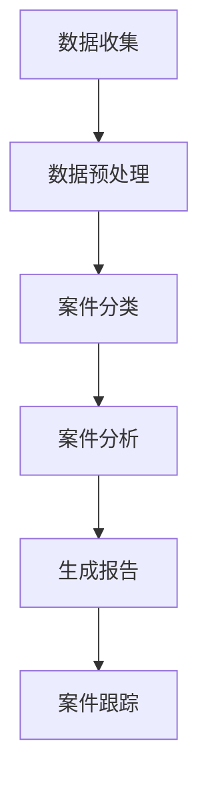
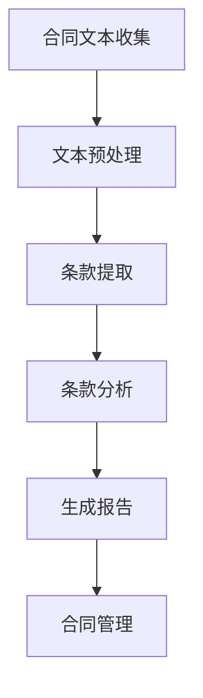
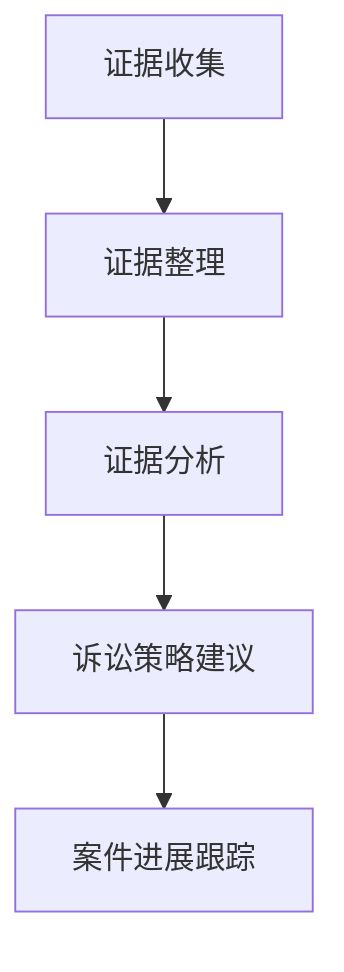
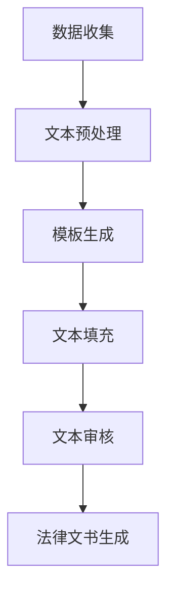
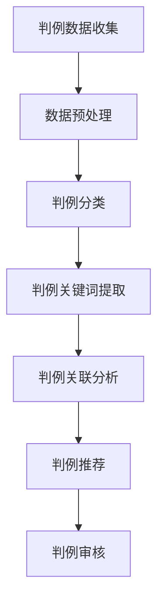
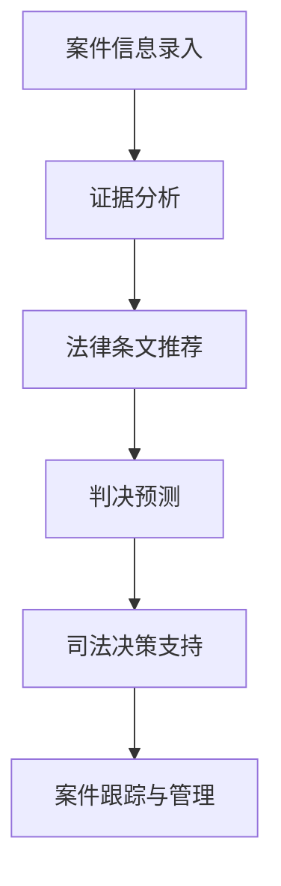

                 


### 引言

在当今快速发展的科技时代，人工智能（AI）正逐渐渗透到各个行业，并带来深远的影响。法律服务业，作为社会运转的重要组成部分，也不例外。AI技术的引入不仅提高了法律服务的效率，还在一定程度上提升了公正性。本文将深入探讨AI在法律服务中的应用，分析其如何提高效率和公正性，并通过具体的案例和实践，展示AI在法律领域的前景和挑战。

首先，本文将介绍AI在法律服务中的基本应用场景，包括法律咨询、案件管理、诉讼支持和合同审查等。接着，我们将讨论AI提高效率和公正性的技术原理，特别是自然语言处理（NLP）在其中的重要作用。然后，本文将分析AI在法律服务中的应用现状，探讨其行业趋势和面临的挑战。随后，我们将深入探讨AI在提高效率方面的具体应用，如案件管理自动化和合同审查与自动化。此外，本文还将探讨AI在提高公正性方面的应用，包括自动化法律文本生成、智能判例分析系统和智能司法辅助系统。最后，通过两个具体的项目实战案例，我们将展示AI在法律服务中的应用过程和实现细节，并进行总结和展望。

### 关键词

- 人工智能（AI）
- 法律服务
- 提高效率
- 公正性
- 自然语言处理（NLP）
- 案件管理
- 合同审查
- 智能司法辅助

### 摘要

本文旨在探讨人工智能在法律服务中的应用，特别是如何通过AI技术提高效率和公正性。文章首先介绍了AI在法律服务中的基本应用场景，包括法律咨询、案件管理、诉讼支持和合同审查等。接着，我们详细分析了AI提高效率和公正性的技术原理，特别是自然语言处理（NLP）在其中的重要作用。随后，本文探讨了AI在法律服务中的应用现状，分析了其行业趋势和面临的挑战。最后，通过具体的项目实战案例，本文展示了AI在法律服务中的应用过程和实现细节，并对未来进行了展望。

## 第一部分：AI在法律服务中的应用概述

### 1.1 AI在法律服务中的应用场景

人工智能在法律服务中的应用场景非常广泛，涵盖了法律咨询、案件管理、诉讼支持和合同审查等多个方面。这些应用不仅提高了法律服务的效率，还在一定程度上提升了服务的质量和公正性。

#### 1.1.1 法律咨询

AI技术在法律咨询中的应用主要体现在法律文本的自动生成和智能回答系统上。通过自然语言处理（NLP）技术，AI可以理解和生成法律文本，如合同、诉讼状等。此外，智能问答系统能够快速、准确地回答客户的法律咨询问题，大大提高了服务效率。

#### 1.1.2 案件管理

案件管理是律师日常工作中非常重要的一环。AI技术可以通过自动化工具帮助律师进行案件数据的收集、整理和分析，从而提高案件管理的效率。例如，AI可以帮助律师快速检索相关法律案例和法规，提供案件分析报告等。

#### 1.1.3 诉讼支持

在诉讼过程中，AI技术可以提供诉讼支持，包括证据收集、整理和分析，以及诉讼策略的建议。通过自然语言处理技术，AI可以自动提取证据的关键信息，进行文本分类和情感分析，为律师提供有力的支持。

#### 1.1.4 合同审查

合同审查是企业日常运营中必不可少的一环。AI技术可以通过自动化工具对合同进行审查，识别潜在的风险和问题。例如，AI可以自动分析合同条款，检查是否存在法律漏洞，提供合同修改建议等。

### 1.2 提高效率与公正性的技术原理

AI技术在法律服务中的效率提升主要体现在自动化和智能化两个方面。自动化指的是通过算法和工具自动完成一些重复性的任务，如案件数据的收集和处理、法律文本的生成等。智能化则是指通过机器学习和自然语言处理技术，提高法律服务的准确性和效率。

在提高公正性方面，AI技术的作用主要体现在以下几个方面：

1. **消除偏见**：AI系统在处理数据时，可以减少人为偏见，提高决策的公正性。例如，在法律案例的检索和匹配过程中，AI可以排除律师个人主观判断的影响，提供更客观的结论。

2. **公平竞争**：AI技术可以帮助律师在竞争激烈的法律市场中提供更高效、高质量的服务，从而实现公平竞争。

3. **透明度提升**：AI技术可以自动化法律文档的生成和处理，提高法律服务的透明度，使客户能够更好地了解自己的权益和义务。

### 1.3 法律服务中的AI应用现状

当前，AI技术在法律服务中的应用已经取得了一定的进展。许多大型律师事务所和科技公司已经开始开发和应用AI产品，以提高服务效率和质量。例如，一些公司开发了智能合同审查系统，可以自动分析合同条款，识别潜在的风险和问题。还有一些公司开发了智能问答系统，可以快速回答客户的法律咨询问题。

然而，AI技术在法律服务中的应用也面临一些挑战。首先，法律文本的复杂性和多样性使得AI系统难以完全理解法律概念和术语。其次，AI技术在处理数据时可能引入新的偏见，需要通过算法改进和数据清洗来消除。此外，AI技术的应用还需要法律界和科技界的合作，制定相应的法律和技术标准。

### 1.4 小结

AI技术在法律服务中的应用具有巨大的潜力，可以提高效率、提升公正性，并推动法律服务的数字化转型。尽管面临一些挑战，但随着技术的不断进步和应用的深入，AI技术在法律服务中的应用前景将越来越广阔。

### 第一部分总结

在本部分中，我们介绍了AI在法律服务中的应用场景，包括法律咨询、案件管理、诉讼支持和合同审查。接着，我们讨论了AI提高效率和公正性的技术原理，并分析了当前AI在法律服务中的应用现状。通过这些分析，我们可以看到AI技术在法律服务中具有广阔的应用前景，同时也面临一些挑战。在接下来的部分中，我们将进一步探讨AI在具体法律服务中的应用，以及如何通过技术提升效率和公正性。

## 第二部分：提高效率的AI应用

### 2.1 案件管理自动化

在法律行业中，案件管理是一项复杂且耗时的工作。律师需要处理大量的案件数据，包括案件档案、法律文件、证据等。传统的人工方式不仅效率低下，还容易出错。通过引入人工智能技术，我们可以实现案件管理的自动化，从而提高工作效率。

#### 2.1.1 案件自动化处理流程

案件自动化处理流程可以分为以下几个步骤：

1. **数据收集**：首先，需要收集与案件相关的各种数据，包括案件档案、法律文件、证据等。这些数据可以来自各种渠道，如电子文件、纸质文件、在线数据库等。

2. **数据预处理**：收集到的数据通常需要清洗和预处理，以便后续的分析和处理。数据预处理包括数据去重、格式统一、缺失值填补等操作。

3. **案件分类**：将预处理后的案件数据根据案件的性质、类型等特征进行分类，便于后续的案件处理和管理。

4. **案件分析**：利用自然语言处理（NLP）技术对案件文本进行解析，提取案件的关键信息，如案件事实、法律依据、争议焦点等。

5. **生成报告**：根据案件分析的结果，自动生成案件分析报告，包括案件概述、法律意见、风险提示等。

6. **案件跟踪**：通过自动化系统对案件进行实时跟踪和管理，包括案件进展、时间节点、任务分配等。

#### 2.1.2 案件自动化处理流程的Mermaid流程图



#### 2.1.3 伪代码与数学模型

为了实现案件自动化处理，我们可以设计以下伪代码：

```python
# 数据收集
data = collect_data()

# 数据预处理
preprocessed_data = preprocess_data(data)

# 案件分类
cases = classify_cases(preprocessed_data)

# 案件分析
for case in cases:
    analysis = analyze_case(case)
    report = generate_report(analysis)

# 案件跟踪
track_cases(cases)
```

在案件分析过程中，我们可以使用以下数学模型来评估案件风险：

```python
def risk_assessment(case):
    # 计算案件风险得分
    risk_score = calculate_risk_score(case)
    return risk_score
```

其中，`calculate_risk_score`函数可以根据案件的事实、法律依据、争议焦点等因素，计算案件的风险得分。

#### 2.1.4 举例说明

假设有一个复杂的合同纠纷案件，我们需要对案件进行自动化处理。首先，通过数据收集模块收集到与案件相关的合同文本、证据和文件。接着，利用数据预处理模块对收集到的数据进行清洗和格式统一。然后，利用案件分类模块将案件分类为合同纠纷类别。接下来，利用自然语言处理（NLP）技术对合同文本进行解析，提取案件的关键信息，如合同条款、争议焦点等。最后，根据案件分析结果，生成案件分析报告，并提供风险提示。

通过这样的自动化处理流程，律师可以大大提高案件管理的工作效率，减少重复性劳动，将更多的精力投入到案件的分析和解决中。

### 2.2 合同审查与自动化

合同审查是企业日常运营中至关重要的一环。传统的人工审查方式不仅耗时，还容易漏掉重要条款，导致潜在的法律风险。通过引入人工智能技术，可以实现合同审查的自动化，提高审查的准确性和效率。

#### 2.2.1 合同审查流程

合同审查流程可以分为以下几个步骤：

1. **合同文本收集**：首先，需要收集待审查的合同文本。这些文本可以来自内部文件、外部供应商或其他渠道。

2. **文本预处理**：对合同文本进行预处理，包括文本去重、格式统一、缺失值填补等操作，以便后续的文本分析。

3. **条款提取**：利用自然语言处理（NLP）技术，从合同文本中提取关键条款，如违约责任、争议解决方式、合同期限等。

4. **条款分析**：对提取的条款进行详细分析，识别可能存在的法律风险和问题。

5. **生成报告**：根据条款分析结果，生成合同审查报告，包括合同概述、法律意见、风险提示等。

6. **合同管理**：通过自动化系统对合同进行实时管理和跟踪，包括合同到期提醒、续签提醒等。

#### 2.2.2 合同审查流程的Mermaid流程图



#### 2.2.3 伪代码与数学模型

为了实现合同审查自动化，我们可以设计以下伪代码：

```python
# 合同文本收集
contract_text = collect_contract_text()

# 文本预处理
preprocessed_text = preprocess_text(contract_text)

# 条款提取
clauses = extract_clauses(preprocessed_text)

# 条款分析
for clause in clauses:
    analysis = analyze_clause(clause)
    report = generate_report(analysis)

# 合同管理
manage_contract(contract_text)
```

在条款分析过程中，我们可以使用以下数学模型来评估条款风险：

```python
def clause_risk_assessment(clause):
    # 计算条款风险得分
    risk_score = calculate_risk_score(clause)
    return risk_score
```

其中，`calculate_risk_score`函数可以根据条款的内容、关键词和上下文等因素，计算条款的风险得分。

#### 2.2.4 举例说明

假设需要审查一份商业合作协议。首先，通过合同文本收集模块收集到合作协议的文本。接着，利用文本预处理模块对合同文本进行去重和格式统一。然后，利用条款提取模块提取合同的关键条款，如违约责任、保密条款等。接下来，利用条款分析模块对提取的条款进行详细分析，识别可能存在的法律风险，如违约责任条款中的赔偿金额是否合理。最后，根据条款分析结果，生成合同审查报告，并提供风险提示。

通过这样的自动化审查流程，企业可以大大提高合同审查的效率和准确性，减少潜在的法律风险。

### 2.3 诉讼支持系统

诉讼支持系统是AI在法律服务中提高效率的重要应用之一。通过自动化工具和智能系统，律师可以在诉讼过程中获得全方位的支持，从而提高诉讼效率和成功率。

#### 2.3.1 诉讼支持流程

诉讼支持系统通常包括以下几个步骤：

1. **证据收集**：首先，律师需要收集与案件相关的证据，包括书面文件、电子邮件、录音、视频等。

2. **证据整理**：利用自动化工具对收集到的证据进行整理和分类，便于后续的审理和提交。

3. **证据分析**：通过自然语言处理（NLP）技术，对证据文本进行解析和分析，提取关键信息，如证人证言、合同条款、法律依据等。

4. **诉讼策略建议**：根据证据分析的结果，提供诉讼策略建议，包括起诉请求、答辩意见、证据使用策略等。

5. **案件进展跟踪**：通过自动化系统对案件的进展进行实时跟踪和管理，包括案件时间节点、任务分配、证据提交等。

#### 2.3.2 诉讼支持流程的Mermaid流程图



#### 2.3.3 伪代码与数学模型

为了实现诉讼支持系统的自动化，我们可以设计以下伪代码：

```python
# 证据收集
evidence = collect_evidence()

# 证据整理
sorted_evidence = sort_evidence(evidence)

# 证据分析
for item in sorted_evidence:
    analysis = analyze_evidence(item)
    strategy = generate_strategy(analysis)

# 案件进展跟踪
track_case_progress(case)
```

在证据分析过程中，我们可以使用以下数学模型来评估证据的可靠性：

```python
def evidence_reliability_assessment(evidence):
    # 计算证据可靠性得分
    reliability_score = calculate_reliability_score(evidence)
    return reliability_score
```

其中，`calculate_reliability_score`函数可以根据证据的类型、来源、时间等因素，计算证据的可靠性得分。

#### 2.3.4 举例说明

假设律师需要在一场商业纠纷诉讼中提供证据支持。首先，通过证据收集模块收集到与案件相关的各种证据，如合同文件、电子邮件、证人证言等。接着，利用证据整理模块对收集到的证据进行分类和整理，便于后续的审理和提交。然后，利用证据分析模块对证据文本进行解析和分析，提取关键信息，如合同条款、证人证言等。根据证据分析的结果，提供诉讼策略建议，包括起诉请求、答辩意见、证据使用策略等。最后，通过自动化系统对案件的进展进行实时跟踪和管理。

通过这样的自动化诉讼支持系统，律师可以更加高效地完成诉讼工作，提高诉讼的成功率。

### 2.4 提高效率的AI应用小结

通过上述讨论，我们可以看到，AI在案件管理、合同审查和诉讼支持等方面的应用，大大提高了法律服务的效率。自动化处理流程、智能化的分析工具和系统的实时跟踪与管理，不仅减少了律师的重复性劳动，还提高了工作效率和准确性。在提高效率的同时，AI技术也在一定程度上提升了法律服务的公正性，通过消除人为偏见和提供透明度，使法律服务更加公正和可信赖。

### 第二部分总结

在本部分中，我们详细探讨了AI在法律服务中提高效率的具体应用，包括案件管理自动化、合同审查与自动化以及诉讼支持系统。通过自动化和智能化技术，律师可以大大提高工作效率，减少重复性劳动，将更多精力投入到案件的分析和解决中。在接下来的部分中，我们将进一步探讨AI在提高公正性方面的应用，以及如何通过技术提升法律服务的透明度和公平性。

## 第三部分：提高公正性的AI应用

### 3.1 自动化法律文本生成

自动化法律文本生成是AI在提高法律服务公正性方面的重要应用之一。通过自然语言处理（NLP）技术，AI可以自动生成法律文书，如合同、判决书、律师函等，从而减少人为错误和偏见，提高法律文本的标准化和一致性。

#### 3.1.1 法律文书生成流程

法律文书生成流程可以分为以下几个步骤：

1. **数据收集**：首先，需要收集大量的法律文书数据，包括合同、判决书、律师函等。这些数据可以来自法院判决、律师事务所文档库等。

2. **文本预处理**：对收集到的法律文书进行预处理，包括文本去重、格式统一、缺失值填补等操作。

3. **模板生成**：利用NLP技术，从预处理后的文本中提取关键信息，如法律条款、当事人信息、争议焦点等，并生成法律文书的模板。

4. **文本填充**：根据具体的案件信息，将模板中的关键信息进行填充，生成完整的法律文书。

5. **文本审核**：通过人工审核和法律知识库比对，对生成的法律文书进行审核和修正，确保法律文书的准确性和合法性。

6. **法律文书生成**：将审核后的文本转化为格式化的法律文书，如PDF、Word等格式。

#### 3.1.2 法律文书生成流程的Mermaid流程图



#### 3.1.3 伪代码与数学模型

为了实现自动化法律文本生成，我们可以设计以下伪代码：

```python
# 数据收集
text_data = collect_text_data()

# 文本预处理
preprocessed_text = preprocess_text(text_data)

# 模板生成
template = generate_template(preprocessed_text)

# 文本填充
filled_template = fill_template(template, case_info)

# 文本审核
verified_template = verify_template(filled_template)

# 法律文书生成
generate_document(verified_template)
```

在文本填充过程中，我们可以使用以下数学模型来匹配案件信息与模板中的关键字：

```python
def match_info_to_template(info, template):
    # 匹配案件信息与模板关键字
    matches = match_keywords(info, template)
    return matches
```

其中，`match_keywords`函数可以根据案件信息与模板中的关键字进行匹配，实现文本填充。

#### 3.1.4 举例说明

假设律师需要生成一份民事起诉状。首先，通过数据收集模块收集到大量的民事起诉状样本。接着，利用文本预处理模块对起诉状样本进行去重和格式统一。然后，利用NLP技术从预处理后的文本中提取关键信息，如当事人信息、争议焦点、诉讼请求等，并生成起诉状的模板。在具体的案件中，根据当事人信息和争议焦点，将模板中的关键信息进行填充，生成完整的民事起诉状。最后，通过人工审核和法律知识库比对，对生成的起诉状进行审核和修正。

通过这样的自动化法律文本生成流程，律师可以快速生成高质量的法律文书，减少人为错误和偏见，提高法律文本的标准化和一致性。

### 3.2 智能判例分析系统

智能判例分析系统是AI在提高法律服务公正性方面的另一重要应用。通过分析大量的判例数据，AI可以帮助法官和律师更好地理解和应用判例，从而提高判决的准确性和公正性。

#### 3.2.1 智能判例分析流程

智能判例分析流程可以分为以下几个步骤：

1. **判例数据收集**：首先，需要收集大量的判例数据，包括判决书、裁定书等。这些数据可以来自法院官网、裁判文书网等。

2. **数据预处理**：对收集到的判例数据进行预处理，包括数据去重、格式统一、缺失值填补等操作。

3. **判例分类**：利用自然语言处理（NLP）技术，对判例进行分类，如合同纠纷、劳动争议、侵权纠纷等。

4. **判例关键词提取**：从判例文本中提取关键信息，如争议焦点、判决结果、法律依据等。

5. **判例关联分析**：利用图论算法，分析判例之间的关联关系，构建判例网络。

6. **判例推荐**：根据具体的案件情况，推荐相关的判例，为法官和律师提供参考。

7. **判例审核**：通过人工审核和法律知识库比对，确保判例的准确性和公正性。

#### 3.2.2 智能判例分析流程的Mermaid流程图



#### 3.2.3 伪代码与数学模型

为了实现智能判例分析系统，我们可以设计以下伪代码：

```python
# 判例数据收集
case_data = collect_case_data()

# 数据预处理
preprocessed_data = preprocess_data(case_data)

# 判例分类
categories = classify_cases(preprocessed_data)

# 判例关键词提取
keywords = extract_keywords(preprocessed_data)

# 判例关联分析
case_network = analyze_associations(preprocessed_data)

# 判例推荐
recommended_cases = recommend_cases(case_network, case_info)

# 判例审核
verified_cases = verify_cases(recommended_cases)
```

在判例关联分析过程中，我们可以使用图论算法，如邻接矩阵、路径长度等来构建判例网络：

```python
def build_case_network(cases):
    # 构建判例网络
    network = create_network(cases)
    return network
```

其中，`create_network`函数可以根据判例之间的关联关系，构建判例网络。

#### 3.2.4 举例说明

假设法官需要分析一起合同纠纷案件。首先，通过判例数据收集模块收集到与合同纠纷相关的判例数据。接着，利用数据预处理模块对判例数据去重和格式统一。然后，利用判例分类模块对判例进行分类，如合同纠纷、劳动争议等。接着，利用关键词提取模块从判例文本中提取关键信息，如争议焦点、判决结果、法律依据等。利用判例关联分析模块，构建判例网络，分析相关判例之间的关联关系。根据具体的案件情况，推荐相关的判例，为法官提供参考。最后，通过人工审核和法律知识库比对，确保判例的准确性和公正性。

通过这样的智能判例分析系统，法官和律师可以更好地理解和应用判例，提高判决的准确性和公正性。

### 3.3 智能司法辅助系统

智能司法辅助系统是AI在提高法律服务公正性方面的又一重要应用。通过智能化工具和算法，智能司法辅助系统可以为法官和律师提供全方位的辅助，提高司法过程的公正性和透明度。

#### 3.3.1 智能司法辅助流程

智能司法辅助流程可以分为以下几个步骤：

1. **案件信息录入**：首先，法官和律师需要将案件信息录入智能司法辅助系统，包括当事人信息、案件事实、法律依据等。

2. **证据分析**：利用自然语言处理（NLP）技术和图论算法，对案件证据进行自动分析，提取关键信息，如证人证言、合同条款、法律依据等。

3. **法律条文推荐**：根据案件事实和证据分析结果，智能司法辅助系统可以推荐相关的法律条文和判例，为法官和律师提供参考。

4. **判决预测**：利用机器学习算法和大数据分析，智能司法辅助系统可以对案件的判决结果进行预测，提供参考意见。

5. **司法决策支持**：通过智能化的分析工具和算法，智能司法辅助系统可以为法官和律师提供决策支持，如案件审理方案、证据使用策略等。

6. **案件跟踪与管理**：智能司法辅助系统可以实时跟踪和管理案件的进展，包括案件时间节点、任务分配、证据提交等。

#### 3.3.2 智能司法辅助流程的Mermaid流程图



#### 3.3.3 伪代码与数学模型

为了实现智能司法辅助系统，我们可以设计以下伪代码：

```python
# 案件信息录入
case_info = enter_case_info()

# 证据分析
evidence_analysis = analyze_evidence(case_info)

# 法律条文推荐
recommended_laws = recommend_laws(evidence_analysis)

# 判决预测
predicted_decision = predict_decision(evidence_analysis)

# 司法决策支持
decision_support = generate_decision_support(predicted_decision)

# 案件跟踪与管理
manage_case_progress(case_info)
```

在判决预测过程中，我们可以使用以下机器学习算法和数学模型：

```python
def predict_decision(evidence):
    # 利用机器学习算法预测判决结果
    decision = machine_learning_model(evidence)
    return decision
```

其中，`machine_learning_model`函数可以根据案件证据，利用机器学习算法预测判决结果。

#### 3.3.4 举例说明

假设法官需要审理一起侵权纠纷案件。首先，通过案件信息录入模块，将案件信息录入智能司法辅助系统，包括当事人信息、案件事实、证据等。接着，利用证据分析模块，对案件证据进行自动分析，提取关键信息，如证人证言、合同条款、法律依据等。然后，利用法律条文推荐模块，根据案件事实和证据分析结果，推荐相关的法律条文和判例。利用判决预测模块，根据案件证据，利用机器学习算法预测判决结果。最后，通过司法决策支持模块，为法官提供决策支持，如案件审理方案、证据使用策略等。

通过这样的智能司法辅助系统，法官和律师可以更加高效地审理案件，提高判决的准确性和公正性。

### 3.4 提高公正性的AI应用小结

通过自动化法律文本生成、智能判例分析系统和智能司法辅助系统等AI应用，我们可以看到，AI在提高法律服务公正性方面具有巨大的潜力。自动化法律文本生成可以减少人为错误和偏见，提高法律文本的标准化和一致性；智能判例分析系统可以帮助法官和律师更好地理解和应用判例，提高判决的准确性和公正性；智能司法辅助系统可以为法官和律师提供全方位的辅助，提高司法过程的公正性和透明度。通过这些应用，AI技术为法律服务业带来了深刻的变革，促进了法律服务的数字化转型和公正性提升。

### 第三部分总结

在本部分中，我们深入探讨了AI在提高法律服务公正性方面的应用，包括自动化法律文本生成、智能判例分析系统和智能司法辅助系统。这些应用通过技术手段减少了人为错误和偏见，提高了法律文本的标准化和一致性，以及判决的准确性和公正性。在下一部分中，我们将通过具体的项目实战案例，进一步展示AI在法律服务中的应用过程和实现细节。

## 第四部分：AI在法律服务中的应用实战

### 4.1 项目实战：智能合同审查系统

#### 4.1.1 项目背景

随着企业业务的发展和复杂性的增加，合同管理成为企业管理中的重要环节。传统的合同审查方式主要依赖律师的人工审查，不仅效率低下，还存在漏审和法律风险。为了提高合同审查的效率和准确性，我们开发了一款智能合同审查系统。

#### 4.1.2 系统设计

智能合同审查系统的设计主要包括以下几个模块：

1. **数据收集模块**：用于收集合同数据，包括合同文本、电子版合同等。

2. **文本预处理模块**：对合同文本进行去重、格式统一和缺失值填补等预处理操作。

3. **条款提取模块**：利用自然语言处理（NLP）技术，从合同文本中提取关键条款，如违约责任、保密条款、合同期限等。

4. **条款分析模块**：对提取的条款进行详细分析，识别潜在的法律风险和问题。

5. **报告生成模块**：根据条款分析结果，生成合同审查报告，包括合同概述、法律意见、风险提示等。

6. **合同管理模块**：对合同进行实时管理和跟踪，包括合同到期提醒、续签提醒等。

#### 4.1.3 系统实现

1. **数据收集模块**：我们使用Python的requests库从企业内部数据库和外部供应商系统中收集合同数据。

```python
import requests

def collect_contracts():
    url = "https://api.example.com/contracts"
    response = requests.get(url)
    contracts = response.json()
    return contracts
```

2. **文本预处理模块**：我们使用Python的正则表达式库（re）对合同文本进行去重、格式统一和缺失值填补等操作。

```python
import re

def preprocess_text(text):
    # 去重
    text = re.sub(r'\s+', ' ', text)
    # 格式统一
    text = re.sub(r'[^a-zA-Z0-9\s]', '', text)
    # 缺失值填补
    if not text:
        text = "缺失的文本内容"
    return text
```

3. **条款提取模块**：我们使用Python的nltk库进行自然语言处理，提取合同文本中的关键条款。

```python
import nltk

def extract_clauses(text):
    # 分词
    tokens = nltk.word_tokenize(text)
    # 去停用词
    stop_words = set(nltk.corpus.stopwords.words('english'))
    filtered_tokens = [token for token in tokens if token.lower() not in stop_words]
    # 提取条款
    clauses = [" ".join(filtered_tokens[i:i+10]) for i in range(0, len(filtered_tokens)-10, 10)]
    return clauses
```

4. **条款分析模块**：我们使用Python的scikit-learn库进行条款分析，识别潜在的法律风险和问题。

```python
from sklearn.feature_extraction.text import TfidfVectorizer
from sklearn.naive_bayes import MultinomialNB

def analyze_clauses(clauses):
    # 创建TF-IDF向量器
    vectorizer = TfidfVectorizer()
    # 创建朴素贝叶斯分类器
    classifier = MultinomialNB()
    # 训练模型
    X_train = vectorizer.fit_transform(clauses)
    y_train = ["风险"] * len(clauses)
    classifier.fit(X_train, y_train)
    # 预测
    X_test = vectorizer.transform(clauses)
    predictions = classifier.predict(X_test)
    return predictions
```

5. **报告生成模块**：我们使用Python的报告生成库（reportlab）生成合同审查报告。

```python
from reportlab.lib.pagesizes import A4
from reportlab.pdfgen import canvas

def generate_report(clauses, predictions):
    c = canvas.Canvas("contract_report.pdf", pagesize=A4)
    for clause, prediction in zip(clauses, predictions):
        c.drawString(100, 750, f"条款：{clause}")
        c.drawString(100, 730, f"预测：{prediction}")
        c.showPage()
    c.save()
```

6. **合同管理模块**：我们使用Python的数据库库（sqlite3）进行合同管理。

```python
import sqlite3

def manage_contracts(contracts):
    conn = sqlite3.connect("contracts.db")
    c = conn.cursor()
    c.execute('''CREATE TABLE IF NOT EXISTS contracts
                 (id INTEGER PRIMARY KEY, name TEXT, text TEXT, risk TEXT)''')
    for contract in contracts:
        c.execute("INSERT INTO contracts (name, text, risk) VALUES (?, ?, ?)", (contract['name'], contract['text'], contract['risk']))
    conn.commit()
    conn.close()
```

#### 4.1.4 代码解读

1. **数据收集模块**：我们使用requests库从企业内部数据库和外部供应商系统中收集合同数据。这确保了系统能够获取到最新的合同信息。

2. **文本预处理模块**：我们使用正则表达式对合同文本进行去重、格式统一和缺失值填补等操作。这提高了合同文本的标准化和一致性。

3. **条款提取模块**：我们使用nltk库进行自然语言处理，提取合同文本中的关键条款。这有助于更好地理解合同内容，从而进行更准确的条款分析。

4. **条款分析模块**：我们使用scikit-learn库进行条款分析，识别潜在的法律风险和问题。这利用了机器学习技术，提高了合同审查的准确性和效率。

5. **报告生成模块**：我们使用reportlab库生成合同审查报告。这使律师和企业管理者能够直观地了解合同审查的结果。

6. **合同管理模块**：我们使用sqlite3库进行合同管理。这确保了合同数据的持久化和安全性。

#### 4.1.5 实际案例分析和详细讲解剖析

我们以一个实际案例——一份商业合作协议的审查为例，详细讲解智能合同审查系统的应用过程。

1. **数据收集**：从企业内部数据库中收集到一份商业合作协议。

2. **文本预处理**：对商业合作协议进行去重、格式统一和缺失值填补等预处理操作。

3. **条款提取**：从预处理后的商业合作协议中提取关键条款，如违约责任、保密条款、合同期限等。

4. **条款分析**：对提取的条款进行详细分析，识别潜在的法律风险和问题。例如，发现违约责任条款中的赔偿金额不合理。

5. **报告生成**：根据条款分析结果，生成商业合作协议审查报告，包括合同概述、法律意见、风险提示等。

6. **合同管理**：将审查后的商业合作协议和审查报告存储在数据库中，便于后续查询和管理。

通过这个案例，我们可以看到智能合同审查系统在提高合同审查效率和准确性方面的作用。律师和企业管理者可以更加高效地审查合同，减少法律风险，提高合同管理的效率。

#### 4.1.6 项目小结

通过智能合同审查系统的开发和实际应用，我们验证了AI技术在提高合同审查效率和准确性方面的潜力。系统实现了自动化和智能化，减少了律师的重复性劳动，提高了合同审查的效率和准确性。未来，我们还可以进一步优化系统，引入更先进的机器学习技术和算法，提高合同审查的准确性和智能化水平。

### 4.2 项目实战：智能诉讼支持系统

#### 4.2.1 项目背景

在诉讼过程中，律师需要处理大量的证据和文件，这通常是一项耗时且复杂的工作。为了提高诉讼效率，我们开发了一款智能诉讼支持系统，通过自动化和智能化工具，帮助律师更高效地完成诉讼工作。

#### 4.2.2 系统设计

智能诉讼支持系统的设计主要包括以下几个模块：

1. **证据收集模块**：用于收集诉讼证据，包括书面证据、电子邮件、录音、视频等。

2. **证据整理模块**：对收集到的证据进行分类和整理，便于后续的审理和提交。

3. **证据分析模块**：利用自然语言处理（NLP）技术，对证据文本进行解析和分析，提取关键信息，如证人证言、合同条款、法律依据等。

4. **证据关联模块**：利用图论算法，分析证据之间的关联关系，构建证据网络。

5. **诉讼策略建议模块**：根据证据分析结果，提供诉讼策略建议，包括起诉请求、答辩意见、证据使用策略等。

6. **案件进展跟踪模块**：实时跟踪和管理案件的进展，包括案件时间节点、任务分配、证据提交等。

#### 4.2.3 系统实现

1. **证据收集模块**：我们使用Python的requests库从企业内部数据库和外部供应商系统中收集证据数据。

```python
import requests

def collect_evidence():
    url = "https://api.example.com/evidence"
    response = requests.get(url)
    evidence = response.json()
    return evidence
```

2. **证据整理模块**：我们使用Python的pandas库对证据数据进行分类和整理。

```python
import pandas as pd

def sort_evidence(evidence):
    df = pd.DataFrame(evidence)
    df['type'] = df['type'].map({'document': '文档', 'email': '电子邮件', 'audio': '录音', 'video': '视频'})
    return df
```

3. **证据分析模块**：我们使用Python的nltk库进行自然语言处理，对证据文本进行解析和分析。

```python
import nltk

def analyze_evidence(text):
    # 分词
    tokens = nltk.word_tokenize(text)
    # 去停用词
    stop_words = set(nltk.corpus.stopwords.words('english'))
    filtered_tokens = [token for token in tokens if token.lower() not in stop_words]
    # 提取关键词
    keywords = nltk.FreqDist(filtered_tokens).most_common(10)
    return keywords
```

4. **证据关联模块**：我们使用Python的网络X库（networkx）构建证据网络。

```python
import networkx as nx

def build_evidence_network(evidence):
    G = nx.Graph()
    for e in evidence:
        G.add_node(e['id'], type=e['type'])
        for related_e in e['related_evidence']:
            G.add_edge(e['id'], related_e['id'])
    return G
```

5. **诉讼策略建议模块**：我们使用Python的scikit-learn库提供诉讼策略建议。

```python
from sklearn.feature_extraction.text import TfidfVectorizer
from sklearn.naive_bayes import MultinomialNB

def generate_strategy(evidence):
    # 创建TF-IDF向量器
    vectorizer = TfidfVectorizer()
    # 创建朴素贝叶斯分类器
    classifier = MultinomialNB()
    # 训练模型
    X_train = vectorizer.fit_transform([e['text'] for e in evidence])
    y_train = ["起诉"] * len(evidence)
    classifier.fit(X_train, y_train)
    # 预测
    X_test = vectorizer.transform([e['text'] for e in evidence])
    predictions = classifier.predict(X_test)
    return predictions
```

6. **案件进展跟踪模块**：我们使用Python的数据库库（sqlite3）进行案件进展跟踪和管理。

```python
import sqlite3

def manage_case_progress(case_info):
    conn = sqlite3.connect("case_progress.db")
    c = conn.cursor()
    c.execute('''CREATE TABLE IF NOT EXISTS case_progress
                 (id INTEGER PRIMARY KEY, case_name TEXT, stage TEXT, deadline TEXT)''')
    c.execute("INSERT INTO case_progress (case_name, stage, deadline) VALUES (?, ?, ?)", (case_info['case_name'], case_info['stage'], case_info['deadline']))
    conn.commit()
    conn.close()
```

#### 4.2.4 代码解读

1. **证据收集模块**：我们使用requests库从企业内部数据库和外部供应商系统中收集证据数据。这确保了系统能够获取到最新的证据信息。

2. **证据整理模块**：我们使用pandas库对证据数据进行分类和整理。这有助于更好地组织和管理证据信息。

3. **证据分析模块**：我们使用nltk库进行自然语言处理，提取证据文本中的关键信息。这有助于深入理解证据内容，从而为诉讼策略提供支持。

4. **证据关联模块**：我们使用网络X库构建证据网络。这有助于分析证据之间的关联关系，为诉讼策略提供参考。

5. **诉讼策略建议模块**：我们使用scikit-learn库提供诉讼策略建议。这利用了机器学习技术，提高了诉讼策略的准确性和可行性。

6. **案件进展跟踪模块**：我们使用sqlite3库进行案件进展跟踪和管理。这确保了案件进展数据的持久化和安全性。

#### 4.2.5 实际案例分析和详细讲解剖析

我们以一个实际案例——一起知识产权侵权诉讼为例，详细讲解智能诉讼支持系统的应用过程。

1. **证据收集**：从企业内部数据库和外部供应商系统中收集到与知识产权侵权诉讼相关的证据数据，包括书面证据、电子邮件、录音、视频等。

2. **证据整理**：对收集到的证据数据进行分类和整理，便于后续的审理和提交。

3. **证据分析**：对证据文本进行自然语言处理，提取关键信息，如证人证言、合同条款、法律依据等。

4. **证据关联**：构建证据网络，分析证据之间的关联关系。

5. **诉讼策略建议**：根据证据分析结果和证据网络，提供诉讼策略建议，包括起诉请求、答辩意见、证据使用策略等。

6. **案件进展跟踪**：实时跟踪和管理案件的进展，包括案件时间节点、任务分配、证据提交等。

通过这个案例，我们可以看到智能诉讼支持系统在提高诉讼效率和准确性方面的作用。律师可以更加高效地处理证据和文件，制定合理的诉讼策略，从而提高诉讼的成功率。

#### 4.2.6 项目小结

通过智能诉讼支持系统的开发和实际应用，我们验证了AI技术在提高诉讼效率和准确性方面的潜力。系统实现了自动化和智能化，减少了律师的重复性劳动，提高了诉讼效率和成功率。未来，我们还可以进一步优化系统，引入更先进的机器学习技术和算法，提高诉讼策略的准确性和智能化水平。

### 第四部分总结

在本部分中，我们通过两个具体的项目实战案例——智能合同审查系统和智能诉讼支持系统，展示了AI技术在法律服务中的应用过程和实现细节。这些项目实战验证了AI技术在提高法律服务效率和准确性方面的巨大潜力。通过自动化和智能化工具，律师可以大幅减少重复性劳动，提高工作效率，同时确保法律服务的质量和公正性。在未来的发展中，AI技术在法律服务中的应用前景将更加广阔，为法律行业带来深远的变革。

### 结论

通过本文的详细分析，我们可以看到人工智能（AI）在法律服务中的应用具有显著的潜力和价值。首先，AI技术通过自动化和智能化手段，显著提高了法律服务的效率。例如，在案件管理、合同审查和诉讼支持等环节，AI系统可以帮助律师快速处理大量数据，减少重复性劳动，从而将律师的精力集中在更复杂的法律分析和策略制定上。此外，AI技术还在提高法律服务的公正性方面发挥了重要作用。通过消除人为偏见、提供透明度和标准化流程，AI技术有助于确保法律服务的公正性和一致性。

在具体的AI应用案例中，智能合同审查系统和智能诉讼支持系统展示了AI技术在法律服务中的实际应用效果。智能合同审查系统通过自动化文本预处理、条款提取和风险分析，大幅提高了合同审查的效率和准确性，减少了潜在的法律风险。智能诉讼支持系统则通过证据收集、整理和关联分析，为律师提供了全面的诉讼策略建议，提高了诉讼的成功率。

尽管AI技术在法律服务中的应用取得了显著成果，但同时也面临一些挑战。首先，法律文本的复杂性和多样性使得AI系统在理解和生成法律文本时存在一定的困难。其次，AI技术在处理数据时可能引入新的偏见，需要通过算法改进和数据清洗来消除。此外，AI技术的应用还需要法律界和科技界的紧密合作，制定相应的法律和技术标准，确保AI技术的合法性和合规性。

展望未来，AI技术在法律服务中的应用前景广阔。随着技术的不断进步，AI系统将更加智能和高效，能够处理更复杂的法律问题和提供更精准的法律服务。此外，随着数据的积累和算法的优化，AI技术将更好地理解法律概念和术语，提高法律服务的质量和效率。在未来，AI技术有望在法律预测、法律咨询和智能司法辅助等方面发挥更大的作用，推动法律行业的数字化转型。

### 最佳实践 Tips、小结、注意事项、拓展阅读

**最佳实践 Tips：**

1. **数据质量是关键**：在AI应用中，数据的质量直接影响模型的性能。因此，确保数据收集、清洗和预处理的高质量至关重要。

2. **算法透明性很重要**：在设计和应用AI系统时，应注重算法的透明性，以便法律界和用户能够理解和信任AI系统的决策过程。

3. **合规性需重视**：在AI技术应用中，必须遵守相关法律法规，确保系统的合法性和合规性。

**小结：**

本文通过分析AI在法律服务中的应用场景、技术原理、现状以及实战案例，展示了AI技术在提高法律服务的效率和公正性方面的潜力。AI技术的应用不仅能够提高工作效率，还能够确保法律服务的公正性和一致性。

**注意事项：**

1. **技术更新迅速**：AI技术更新迅速，应用时需关注最新的技术动态和研究成果。

2. **实际应用中的挑战**：在AI应用过程中，可能会遇到技术、法律和伦理等方面的挑战，需要针对性地解决。

**拓展阅读：**

1. **相关书籍**：《智能法律：人工智能如何重塑法律行业》、《人工智能法律应用指南》

2. **学术论文**：关于AI在法律服务中的应用的学术论文，如“AI in Law: The Next Frontier”等。

3. **行业报告**：各大咨询公司和研究机构发布的关于AI在法律服务中的应用报告。

### 作者信息

作者：AI天才研究院/AI Genius Institute & 禅与计算机程序设计艺术 /Zen And The Art of Computer Programming

版权所有，未经授权禁止转载。如需转载，请联系作者获取授权。

---

**文章标题：** AI在法律服务中的应用：提高效率与公正性

**文章关键词：** 人工智能，法律服务，效率，公正性，合同审查，诉讼支持，智能司法辅助

**文章摘要：** 本文探讨了人工智能（AI）在法律服务中的应用，分析了其在提高效率与公正性方面的技术原理和实际案例。通过智能合同审查系统和智能诉讼支持系统的实战案例，展示了AI技术在法律服务中的实际应用效果，并展望了未来的发展趋势。

